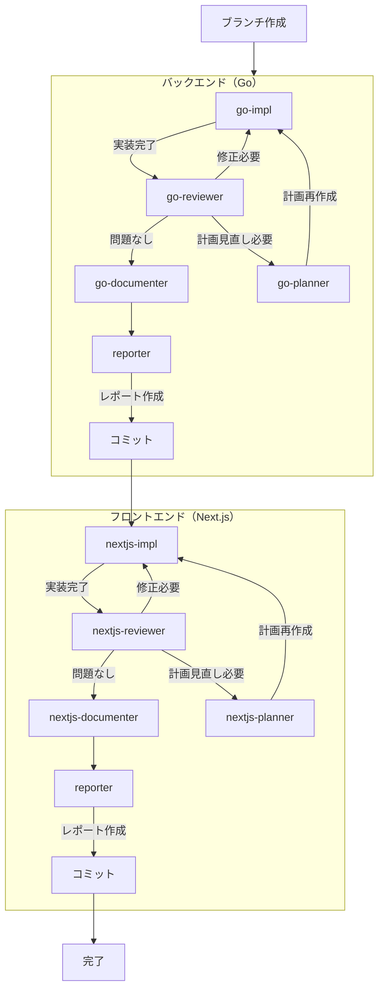

# /fullstack

**ultrathink**

指定されたタスクに対して、バックエンドとフロントエンドの両方を実装してください。
各フェーズで問題があれば、該当フェーズに戻って修正を行います。

**スキップ条件:**
- タスクがバックエンドのみの場合: フェーズ2をスキップ
- タスクがフロントエンドのみの場合: フェーズ1をスキップ
- スキップ時は、該当フェーズのレポートで仕様書を `保守/実装/完了/` に移動



---

## フェーズ 0: ブランチ作成

作業開始前に機能ブランチを作成する。

```bash
git checkout -b feat/機能名
# または
git checkout -b fix/修正内容
```

**命名規則:**
- 新機能: `feat/機能名`（例: `feat/reception-start-date`）
- バグ修正: `fix/修正内容`（例: `fix/status-update-timing`）

---

## フェーズ 1: バックエンド実装

### 1.1 タスク要件に従い、機能実装を行う

- 必ず `go-impl` エージェントを使用する
- プロジェクト内容を詳細に理解したうえで、要件に基づいて実装する
- 既存のコードパターンに厳密に従う
- ビルドが通過するまで繰り返す（`cd backend && go build ./...`）

### 1.2 実装内容が要件に沿っているか確認する

- 必ず `go-reviewer` エージェントを使用して確認する
- Go 固有の規約に基づいて、実装要件に抜け漏れがないか、バグやセキュリティリスクなど潜在的な問題がないか、徹底的にレビューする
- 静的解析（`go vet`、`go fmt`）をすべてパスすること

### 1.3 計画見直しが必要な場合

`go-reviewer` が「計画見直しが必要」と判断した場合：
- `go-planner` エージェントに問題を報告
- `go-planner` が計画を再作成
- 1.1 に戻って再実装

**エスカレーション:** planner でも解決できない問題（仕様の矛盾、技術的に実現不可能等）が発生した場合は、ユーザーに確認を求めて判断を仰ぐ

### 1.4 バックエンドドキュメント更新

- `go-documenter` エージェントを使用する
- 変更に応じて doc.go、GoDoc コメントを更新
- `backend/docs/` 配下のドキュメントを更新
  - `BACKEND_API.md` - API仕様書
  - `BACKEND_CONTRIB.md` - 開発者向けガイド
  - `BACKEND_RUNBOOK.md` - 運用手順書

### 1.5 バックエンドレポート作成

- `reporter` エージェントを使用する
- スコープ: `backend/` 配下の変更のみ
- 実装内容、課題、動作確認手順をレポートにまとめる
- 仕様書があれば追記（移動はしない、フロントエンド実装が残っているため）

### 1.6 バックエンドコミット

- バックエンドの変更をコミット（ブランチはフェーズ0で作成済み）

---

## フェーズ 2: フロントエンド実装

### 2.1 タスク要件に従い、機能実装を行う

- 必ず `nextjs-impl` エージェントを使用する
- プロジェクト内容を詳細に理解したうえで、要件に基づいて実装する
- 既存のコードパターンに厳密に従う
- ビルドが通過するまで繰り返す（`cd frontend && npm run build`）

### 2.2 実装内容が要件に沿っているか確認する

- 必ず `nextjs-reviewer` エージェントを使用して確認する
- TypeScript/React 固有の規約に基づいて、実装要件に抜け漏れがないか、バグやセキュリティリスクなど潜在的な問題がないか、徹底的にレビューする
- 型チェック（`npx tsc --noEmit`）と ESLint（`npm run lint`）をすべてパスすること

### 2.3 計画見直しが必要な場合

`nextjs-reviewer` が「計画見直しが必要」と判断した場合：
- `nextjs-planner` エージェントに問題を報告
- `nextjs-planner` が計画を再作成
- 2.1 に戻って再実装

**エスカレーション:** planner でも解決できない問題（仕様の矛盾、技術的に実現不可能等）が発生した場合は、ユーザーに確認を求めて判断を仰ぐ

### 2.4 フロントエンドドキュメント更新

- `nextjs-documenter` エージェントを使用する
- 変更に応じて `frontend/docs/` 配下のドキュメントを更新
  - `screens.md` - 画面一覧
  - `screen-flow.md` - 画面遷移フロー
  - `scenarios/` - ユーザー操作シナリオ

### 2.5 フロントエンドレポート作成

- `reporter` エージェントを使用する
- スコープ: `frontend/` 配下の変更のみ
- 実装内容、課題、動作確認手順をレポートにまとめる

### 2.6 フロントエンドコミット

- フロントエンドの変更をコミット

### 2.7 仕様書の移動（必須）

**重要: このステップを絶対にスキップしないこと**

仕様書ファイルがある場合、以下のコマンドを実行して `保守/実装/完了/` に移動する:

```bash
mkdir -p "保守/実装/完了"
mv "保守/実装/修正/<仕様書ファイル名>.md" "保守/実装/完了/<仕様書ファイル名>.md"
git add "保守/実装/"
git commit -m "docs: move completed spec to 完了 folder"
git push
```

---

## 完了条件

### バックエンド
- ビルド、`go vet`、`go fmt` がすべてパス
- レビューで Critical / Warning の指摘がない
- ドキュメントが更新されている

### フロントエンド
- ビルド、型チェック、ESLint がすべてパス
- レビューで Critical / Warning の指摘がない
- ドキュメントが更新されている

### 全体
- 実装要件を完全に満たしている
- バックエンド・フロントエンドそれぞれのレポートが作成されている
- 各フェーズでコミットが完了している
- **仕様書が `保守/実装/完了/` に移動されている**

## タスク

$ARGUMENTS
