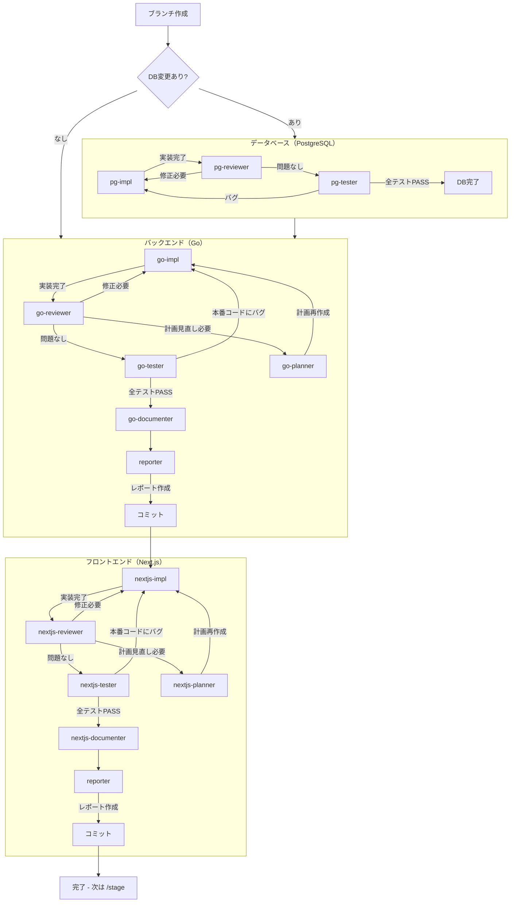

# /fullstack

**ultrathink**

指定されたタスクに対して、バックエンドとフロントエンドの両方を実装してください。
各フェーズで問題があれば、該当フェーズに戻って修正を行います。

## 計測: 開始

最初に以下のコマンドを実行して開始時刻を記録する:

```bash
date +%s > /tmp/claude-timer-fullstack-start
```

**スキップ条件:**
- タスクがバックエンドのみの場合: フェーズ2をスキップ
- タスクがフロントエンドのみの場合: フェーズ0.5, フェーズ1をスキップ
- DB変更なしの場合: フェーズ0.5をスキップ
- フェーズ0（ブランチ作成）は常に実行する


```mermaid
flowchart TD
    Start[ブランチ作成] --> DBCheck{DB変更あり?}

    DBCheck -->|あり| DB
    DBCheck -->|なし| Backend

    subgraph DB["データベース（PostgreSQL）"]
        PGI[pg-impl] -->|実装完了| PGR[pg-reviewer]
        PGR -->|問題なし| PGT[pg-tester]
        PGR -->|修正必要| PGI
        PGT -->|全テストPASS| PGDone[DB完了]
        PGT -->|バグ| PGI
    end

    DB --> Backend

    subgraph Backend["バックエンド（Go）"]
        A[go-impl] -->|実装完了| B[go-reviewer]
        B -->|問題なし| B2[go-tester]
        B -->|修正必要| A
        B -->|計画見直し必要| D[go-planner]
        D -->|計画再作成| A
        B2 -->|全テストPASS| C[go-documenter]
        B2 -->|本番コードにバグ| A
        C --> E[reporter]
        E -->|レポート作成| F[コミット]
    end

    subgraph Frontend["フロントエンド（Next.js）"]
        G[nextjs-impl] -->|実装完了| H[nextjs-reviewer]
        H -->|問題なし| H2[nextjs-tester]
        H -->|修正必要| G
        H -->|計画見直し必要| J[nextjs-planner]
        J -->|計画再作成| G
        H2 -->|全テストPASS| I[nextjs-documenter]
        H2 -->|本番コードにバグ| G
        I --> K[reporter]
        K -->|レポート作成| L[コミット]
    end

    F --> G
    L --> M[完了 - 次は /stage]
```


## フェーズ 0: ブランチ作成

作業開始前に main を最新化し、機能ブランチを作成する。

```bash
git checkout main && git pull
git checkout -b feat/機能名
# または
git checkout -b fix/修正内容
```

**命名規則:**
- 新機能: `feat/機能名`（例: `feat/reception-start-date`）
- バグ修正: `fix/修正内容`（例: `fix/status-update-timing`）


## フェーズ 0.5: DB マイグレーション（DB変更ありの場合のみ）

DB変更がある場合、バックエンド実装の前にマイグレーションを実施する。

### 0.5.1 マイグレーション実装

- `pg-impl` エージェントを使用する
- GORMマイグレーションファイルの作成
- ローカルDocker PostgreSQLでマイグレーション実行確認

### 0.5.2 マイグレーションレビュー

- `pg-reviewer` エージェントを使用する
- SQL品質、Expand/Contractパターンの遵守を確認
- 修正必要 → 0.5.1 に戻る

### 0.5.3 マイグレーションテスト

- `pg-tester` エージェントを使用する
- テストDBでのスキーマ検証、データ整合性確認
- バグ → 0.5.1 に戻る


## フェーズ 1: バックエンド実装

### 1.1 タスク要件に従い、機能実装を行う

- 必ず `go-impl` エージェントを使用する
- プロジェクト内容を詳細に理解したうえで、要件に基づいて実装する
- 既存のコードパターンに厳密に従う
- ビルドが通過するまで繰り返す（`cd backend && go build ./...`）

### 1.2 実装内容が要件に沿っているか確認する

- 必ず `go-reviewer` エージェントを使用して確認する
- DB変更ありの場合: `pg-reviewer` エージェントも追加で実行する
- Go 固有の規約に基づいて、実装要件に抜け漏れがないか、バグやセキュリティリスクなど潜在的な問題がないか、徹底的にレビューする
- 静的解析（`go vet`、`go fmt`）をすべてパスすること
- reviewer はコードレビューのみ行う（テスト実行は次のステップ）

### 1.3 テストプランに基づくテスト実施

レビュー通過後、`go-tester` エージェントでテストを実施する。

- 計画書のテストプランに基づいてテストコードを作成
- テストを実行し、全テストがパスすることを確認
- **本番コードのバグ**が見つかった場合 → 1.1 に戻って impl が修正
- **テストコードの問題**の場合 → tester が自分で修正して再実行

### 1.4 計画見直しが必要な場合

`go-reviewer` が「計画見直しが必要」と判断した場合：
- `go-planner` エージェントに問題を報告
- `go-planner` が計画を再作成
- 1.1 に戻って再実装

**エスカレーション:** planner でも解決できない問題（仕様の矛盾、技術的に実現不可能等）が発生した場合は、ユーザーに確認を求めて判断を仰ぐ

### 1.5 バックエンドドキュメント更新

- `go-documenter` エージェントを使用する
- 変更に応じて doc.go、GoDoc コメントを更新
- `backend/docs/` 配下のドキュメントを更新
  - `BACKEND_API.md` - API仕様書
  - `BACKEND_CONTRIB.md` - 開発者向けガイド
  - `BACKEND_RUNBOOK.md` - 運用手順書

### 1.6 バックエンドレポート作成

- `reporter` エージェントを使用する
- スコープ: `backend/` 配下の変更のみ
- 実装内容、課題、動作確認手順をレポートにまとめる
- 仕様書があれば追記（移動はしない、フロントエンド実装が残っているため）

### 1.7 バックエンドコミット

- バックエンドの変更をコミット（ブランチはフェーズ0で作成済み）


## フェーズ 2: フロントエンド実装

### 2.1 タスク要件に従い、機能実装を行う

- 必ず `nextjs-impl` エージェントを使用する
- プロジェクト内容を詳細に理解したうえで、要件に基づいて実装する
- 既存のコードパターンに厳密に従う
- ビルドが通過するまで繰り返す（`cd frontend && npm run build`）

### 2.2 実装内容が要件に沿っているか確認する

- 必ず `nextjs-reviewer` エージェントを使用して確認する
- DB変更ありの場合: `pg-reviewer` エージェントも追加で実行する（フロントからのDB操作の整合性確認）
- TypeScript/React 固有の規約に基づいて、実装要件に抜け漏れがないか、バグやセキュリティリスクなど潜在的な問題がないか、徹底的にレビューする
- 型チェック（`npx tsc --noEmit`）と ESLint（`npm run lint`）をすべてパスすること
- reviewer はコードレビューのみ行う（テスト実行は次のステップ）

### 2.3 テストプランに基づくテスト実施

レビュー通過後、`nextjs-tester` エージェントでテストを実施する。

- 計画書のテストプランに基づいてテストコードを作成
- テストを実行し、全テストがパスすることを確認
- **本番コードのバグ**が見つかった場合 → 2.1 に戻って impl が修正
- **テストコードの問題**の場合 → tester が自分で修正して再実行

### 2.4 計画見直しが必要な場合

`nextjs-reviewer` が「計画見直しが必要」と判断した場合：
- `nextjs-planner` エージェントに問題を報告
- `nextjs-planner` が計画を再作成
- 2.1 に戻って再実装

**エスカレーション:** planner でも解決できない問題（仕様の矛盾、技術的に実現不可能等）が発生した場合は、ユーザーに確認を求めて判断を仰ぐ

### 2.5 フロントエンドドキュメント更新

- `nextjs-documenter` エージェントを使用する
- 変更に応じて `frontend/docs/` 配下のドキュメントを更新
  - `screens.md` - 画面一覧
  - `screen-flow.md` - 画面遷移フロー
  - `scenarios/` - ユーザー操作シナリオ

### 2.6 フロントエンドレポート作成

- `reporter` エージェントを使用する
- スコープ: `frontend/` 配下の変更のみ
- 実装内容、課題、動作確認手順をレポートにまとめる

### 2.7 フロントエンドコミット

- フロントエンドの変更をコミット


## 実装完了後

全フェーズのコミットが完了したら、以下を表示する:

```
実装が完了しました。

feat ブランチへのコミットが完了しています。
次は `/stage` でステージング環境にデプロイしてください。
```


## 完了条件

### バックエンド
- ビルド、`go vet`、`go fmt` がすべてパス
- レビューで Critical / Warning の指摘がない
- ドキュメントが更新されている

### フロントエンド
- ビルド、型チェック、ESLint がすべてパス
- レビューで Critical / Warning の指摘がない
- ドキュメントが更新されている

### DB（DB変更ありの場合）
- マイグレーションが正常に実行される
- pg-reviewer のレビューで問題がない
- pg-tester のテストが全てパス

### 全体
- 実装要件を完全に満たしている
- バックエンド・フロントエンドそれぞれのレポートが作成されている
- 各フェーズでコミットが完了している
- **feat ブランチへのコミットが完了している（次は `/stage`）**

## 計測: 終了

全ステップ完了後に以下のコマンドを実行して所要時間を表示する:

```bash
start=$(cat /tmp/claude-timer-fullstack-start) && end=$(date +%s) && elapsed=$((end - start)) && minutes=$((elapsed / 60)) && seconds=$((elapsed % 60)) && echo "/fullstack 所要時間: ${minutes}分${seconds}秒" && echo "$(date +%Y-%m-%d),fullstack,$ARGUMENTS,${elapsed}秒,${minutes}分${seconds}秒" >> ~/ghostrunner-timing.csv
```

## タスク

$ARGUMENTS
