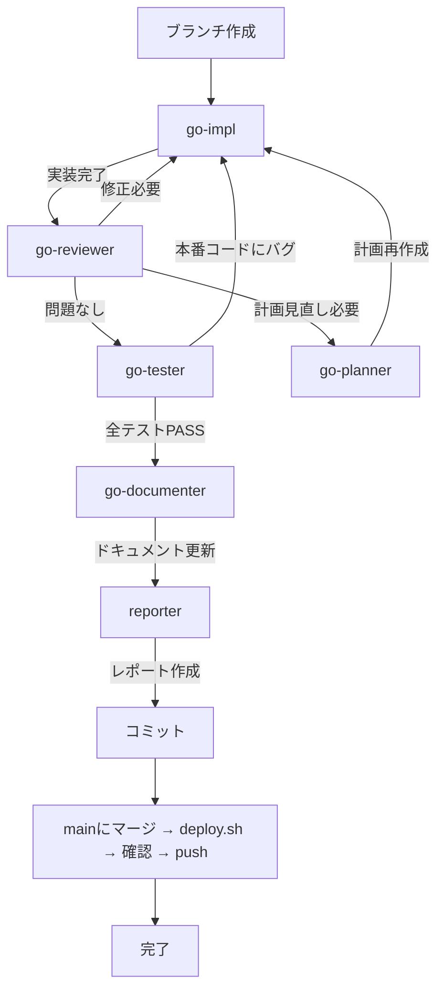

# /go

**ultrathink**

指定されたタスクに対して、適切なサブエージェントを選択して以下の順で実装してください。



## 準備

### 0. ブランチ作成

作業開始前に main を最新化し、機能ブランチを作成する。

```bash
git checkout main && git pull
git checkout -b feat/機能名
```

## 実装サイクル

### 1. タスク要件に従い、機能実装を行う

- 必ず `go-impl` エージェントを使用する
- プロジェクト内容を詳細に理解したうえで、要件に基づいて実装する
- 既存のコードパターンに厳密に従う
- ビルドが通過するまで繰り返す（`cd backend && go build ./...`）

### 2. 実装内容が要件に沿っているか確認する

- 必ず `go-reviewer` エージェントを使用して確認する
- Go 固有の規約に基づいて、実装要件に抜け漏れがないか、バグやセキュリティリスクなど潜在的な問題がないか、徹底的にレビューする
- 静的解析（`go vet`、`go fmt`）をすべてパスすること
- reviewer はコードレビューのみ行う（テスト実行は次のステップ）

### 3. テストプランに基づくテスト実施

レビュー通過後、`go-tester` エージェントでテストを実施する。

- 計画書のテストプランに基づいてテストコードを作成
- テストを実行し、全テストがパスすることを確認
- **本番コードのバグ**が見つかった場合 → 1 に戻って impl が修正
- **テストコードの問題**の場合 → tester が自分で修正して再実行

### 4. 計画見直しが必要な場合

`go-reviewer` が「計画見直しが必要」と判断した場合：
- `go-planner` エージェントに問題を報告
- `go-planner` が計画を再作成
- 1 に戻って再実装

## 完了フェーズ

レビューが通過したら、以下を順に実行する。

### 5. ドキュメント更新

- `go-documenter` エージェントを使用する
- 変更に応じて doc.go、GoDoc コメントを更新

### 6. 実装レポート作成

- `reporter` エージェントを使用する
- 実装内容、課題、動作確認手順をレポートにまとめる

### 7. コミット

- 変更をコミット（ブランチはステップ0で作成済み）

### 8. main にマージ・デプロイ・確認

```bash
git checkout main
git merge feat/機能名
./scripts/deploy.sh
```

ユーザーに本番確認を依頼する。

- **問題なし:** `git push` で GitHub にバックアップ
- **問題あり:** `git revert HEAD` でマージを取り消し → feat ブランチに戻って修正 → 再マージ

### 9. 仕様書の移動（必須）

**重要: このステップを絶対にスキップしないこと**

仕様書ファイルがある場合、以下のコマンドを実行して `保守/実装/完了/` に移動する:

```bash
mkdir -p "保守/実装/完了"
mv "保守/実装/修正/<仕様書ファイル名>.md" "保守/実装/完了/<仕様書ファイル名>.md"
git add "保守/実装/"
git commit -m "docs: move completed spec to 完了 folder"
```

## 完了条件

- すべてのビルドチェックが通過している
- レビューで Critical / Warning の指摘がない
- 実装要件を完全に満たしている
- ドキュメントが更新されている
- 実装レポートが作成されている
- コミットが完了している
- **main にマージ → deploy.sh → 本番確認 → git push が完了している**
- **仕様書が `保守/実装/完了/` に移動されている**

## タスク

$ARGUMENTS
