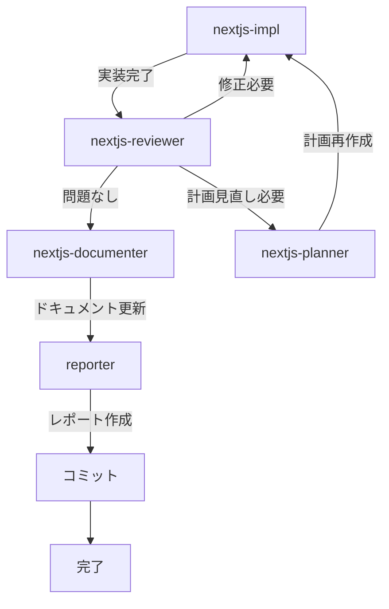

# /nextjs

**ultrathink**

指定されたタスクに対して、適切なサブエージェントを選択して以下の順で実装してください。

## 実装サイクル

### 1. タスク要件に従い、機能実装を行う

- 必ず `nextjs-impl` エージェントを使用する
- プロジェクト内容を詳細に理解したうえで、要件に基づいて実装する
- 既存のコードパターンに厳密に従う
- ビルドが通過するまで繰り返す（`cd frontend && npm run build`）

### 2. 実装内容が要件に沿っているか確認する

- 必ず `nextjs-reviewer` エージェントを使用して確認する
- TypeScript/React 固有の規約に基づいて、実装要件に抜け漏れがないか、バグやセキュリティリスクなど潜在的な問題がないか、徹底的にレビューする
- 型チェック（`npx tsc --noEmit`）と ESLint（`npm run lint`）をすべてパスすること

### 3. 計画見直しが必要な場合

`nextjs-reviewer` が「計画見直しが必要」と判断した場合：
- `nextjs-planner` エージェントに問題を報告
- `nextjs-planner` が計画を再作成
- 1 に戻って再実装

## 完了フェーズ

レビューが通過したら、以下を順に実行する。

### 4. ドキュメント更新

- `nextjs-documenter` エージェントを使用する
- 変更に応じて `frontend/docs/` 配下のドキュメントを更新
  - `screens.md` - 画面一覧
  - `screen-flow.md` - 画面遷移フロー
  - `scenarios/` - ユーザー操作シナリオ

### 5. 実装レポート作成

- `reporter` エージェントを使用する
- 実装内容、課題、動作確認手順をレポートにまとめる
- 仕様書を `保守/実装/完了/` に移動し、レポートを追記

### 6. コミット

- 機能ブランチを作成（`feat/機能名` または `fix/修正内容`）
- 変更をコミット
- ユーザーがプルリク作成・マージを行う

## 完了条件

- すべてのビルドチェックが通過している
- 型チェック、ESLint がエラーなし
- レビューで Critical / Warning の指摘がない
- 実装要件を完全に満たしている
- ドキュメントが更新されている
- 実装レポートが作成されている
- コミットが完了している

## タスク

$ARGUMENTS
