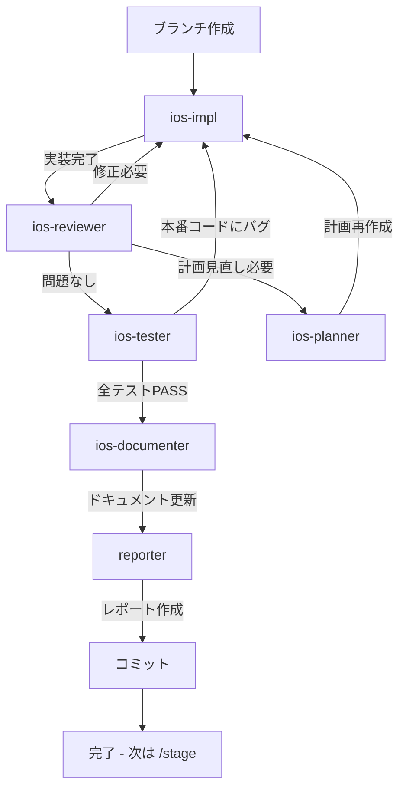

# /ios

**ultrathink**

指定されたタスクに対して、適切なサブエージェントを選択して以下の順で実装してください。各エージェントは**自分の責務だけ**を行い、残りは次の専門エージェントにバトンパスします。



## 前提

実装計画書（`*_plan.md`）が作成済みであること。未作成なら先に `/plan` を実行する（`ios-planner` + `ios-plan-reviewer` が計画を作成・レビューする）。

## 準備

### 0. ブランチ作成

作業開始前に main を最新化し、機能ブランチを作成する。

```bash
git checkout main && git pull
git checkout -b feat/機能名
```

## 実装サイクル

### 1. タスク要件に従い、機能実装を行う

- 必ず `ios-impl` エージェントを使用する
- 計画書とプロジェクト内容を詳細に理解したうえで、要件に基づいて実装する
- 既存のコードパターンに厳密に従う
- **依存を低く保つ**: 標準フレームワーク（SwiftUI / Foundation / Combine / Network / OSLog 等）で実現できるものは外部ライブラリを入れない（新規サードパーティ依存が要ると判断したら中断して提起）
- ビルドが通過するまで繰り返す（`xcodebuild -scheme App -destination 'platform=iOS Simulator,name=iPhone 15' build`。スキーム/デスティネーションはプロジェクトに合わせる。ロジックのみのターゲットは `swift build` でも可）

### 2. 実装内容が要件に沿っているか確認する

- 必ず `ios-reviewer` エージェントを使用して確認する
- Swift / iOS 固有の規約（force unwrap 禁止・Sendable・`@MainActor`・循環参照・scenePhase ライフサイクル・UIKit 相互運用・Keychain 機密保存）に基づき、抜け漏れ・バグ・セキュリティリスクを徹底レビューする
- ビルドの warning / error が 0 件になること
- reviewer はコードレビューのみ行う（テスト実行は次のステップ）

### 3. テストプランに基づくテスト実施

レビュー通過後、`ios-tester` エージェントでテストを実施する。

- 計画書のテストプランに基づいてテストコードを作成（Swift Testing・Protocol モックでネットワーク/永続化/OS API など外部依存を差し替え）
- テストを実行し、全テストがパスすることを確認（`swift test` または `xcodebuild test`）
- **本番コードのバグ**が見つかった場合 → 1 に戻って `ios-impl` が修正
- **テストコードの問題**の場合 → tester が自分で修正して再実行

### 4. 計画見直しが必要な場合

`ios-reviewer` が「計画見直しが必要」と判断した場合：
- `ios-planner` エージェントに問題を報告
- `ios-planner` が計画を再作成
- 1 に戻って再実装

## 完了フェーズ

レビューが通過したら、以下を順に実行する。

### 5. ドキュメント更新

- `ios-documenter` エージェントを使用する
- 変更に応じて DocC コメント、`docs/` 配下を更新

### 6. 実装レポート作成

- `reporter` エージェントを使用する
- 実装内容、課題、動作確認手順（実機/シミュレータ）をレポートにまとめる

### 7. コミット

- 変更をコミット（ブランチはステップ0で作成済み）

## 実装完了後

コミットが完了したら、以下を表示する:

```
実装が完了しました。

feat ブランチへのコミットが完了しています。
次は `/stage` でステージング環境にデプロイしてください。
```

## 完了条件

- iOS Simulator 向けビルドが warning / error 0 で通過している
- レビューで Critical / Warning の指摘がない
- 実装要件を完全に満たしている
- 不要な新規サードパーティ依存を足していない（標準フレームワークで実現できる箇所に外部ライブラリを持ち込んでいない）
- ドキュメントが更新されている
- 実装レポートが作成されている
- **feat ブランチへのコミットが完了している（次は `/stage`）**

## タスク

$ARGUMENTS
