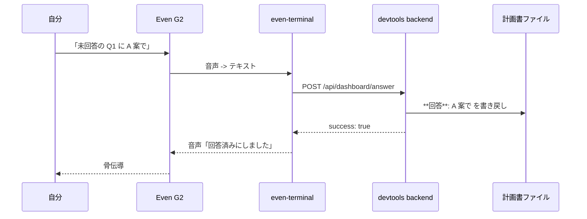

# 3 モダリティ使い分けガイド

Ghostrunner の操作には 3 つの経路（モダリティ）があり、状況に応じて使い分ける。本ドキュメントでは各経路の特徴と、それぞれを横断する運用フロー（VSCode から SID resume、Even G2 から音声回答）を整理する。

## モダリティ一覧

| 経路 | 入力 | 出力 | 一覧性 | ハンズフリー | 主な用途 |
|------|------|------|:------:|:------------:|----------|
| CLI（`claude` 直接実行） | キーボード | ターミナル | 低 | 不可 | 1 プロジェクトに腰を据えて編集する。VSCode 統合ターミナル等 |
| Even G2 + even-terminal | 音声 | 骨伝導 / TTS | 低（音声逐次） | 可 | 散歩中・運転中など手が塞がっているときの把握、軽い質疑 |
| dashboard（`/dashboard`） | テキスト + タップ | 画面 + TTS | 高（横断把握） | 半（TTS で受け） | 全プロジェクトの状況把握、確認事項回答、SID 共有 |

## 使い分けの 2 軸ルール

- **一覧性が必要 → dashboard**。横断把握、未回答質問のリストアップ、複数プロジェクト比較は GUI が優位
- **ハンズフリーが必要 → Even G2**。歩きながら / 運転中 / 家事中など手が使えない状況。短い問い合わせ・確認応答に限定
- **腰を据えて編集 → CLI（VSCode）**。コードを書く・差分を細かく確認するときは依然 CLI が一番
- **片方が困難になったらもう一方** — 例えば歩いている間に dashboard で確認事項が見えても、止まれない場面では Even G2 で「A 案で」と返す

## 場面マトリクス

| 場面 | 推奨経路 | 理由 |
|------|----------|------|
| 朝 1 で全体把握 | dashboard | 一覧性が必要 |
| 散歩中の進捗確認 | Even G2 | ハンズフリー |
| 確認事項に即答（A 案/B 案レベル） | dashboard or Even G2 | 内容と状況で選ぶ |
| 確認事項に長文回答 | dashboard | テキスト入力が必要 |
| コード差分レビュー | CLI（VSCode） | 文脈把握に画面 + キーボード |
| 一括 coding 発火 | CLI または dashboard 経由（MVP+1） | 操作系のため誤発火を避けたい |
| 既存 session を別端末で続行 | dashboard で SID コピー → VSCode で resume | SID 共有が橋渡し |

---

## VSCode で対話を引き継ぐ（SID resume）

dashboard 上の session を、VSCode の統合ターミナルで `claude --resume <SID>` として継続する手順。

### 手順

1. dashboard（`/dashboard`）の左上 SessionPicker で対象 session を選ぶ
2. 隣の「SID」ボタンを押す（クリップボードに session ID がコピーされる）
3. VSCode を開く（`cmd+\``で統合ターミナルが開く）
4. ターミナルで以下を実行
   ```bash
   claude --resume <貼り付け>
   ```
5. 同じ session の対話履歴が CLI 側にロードされる

### 書き込み排他は運用ルール

同一 session に対する書き込みは **同時 1 経路のみ** を運用ルールとする（コードロックなし）。

- dashboard の Chat で発話している間は VSCode 側からプロンプトを送らない
- VSCode 側で `claude` を attach している間は dashboard 側から送らない
- 切り替えるときは片方で発話を完全に止めてから

> 補足: even-terminal 側で同時 attach するとイベントツリーの親 UUID チェーンが分岐し、後続の整合性が失われる場合がある。運用で回避する。

### secure context が無い場合（Tailscale 経由 HTTP）

`navigator.clipboard` は HTTPS でしか動かない。Tailscale 経由の HTTP アクセス時は `SidCopyButton` が自動で以下にフォールバックする。

1. `document.execCommand('copy')` を試行
2. それも失敗したら SID を `<input readonly>` で表示するので、手動でタップして選択しコピー

---

## Even G2 から確認事項に音声回答する（音声ブリッジ）

Even G2 のマイクから「A 案で」「B 案で」のような短い回答を発話し、even-terminal が解釈して既存の `POST /api/dashboard/answer` を叩く流れ。

### 流れ



### 運用方針

- **把握系（「状況は？」）は Even G2 から OK**。読み取り API（`GET /api/dashboard/state`）と `POST /api/prompt` の `状況は？` 程度であれば誤発火しても被害は小さい
- **一括操作系（「一括 coding 発火」「全部承認」など）は Even G2 から発火させない**。誤認識のリスクが副作用の大きさに見合わない。これらは dashboard か CLI 経由で明示的に行う
- **TTS の排他は dashboard 側の TTS ON/OFF トグルで調整**。Even G2 で会話している間は dashboard の TTS を OFF にして二重発話を避ける

### 実装の前提（MVP 外）

- Even G2 自体の音声インテント解析は even-terminal の npm パッケージ側で対応する想定。Ghostrunner 側は受け口のみ（既存 `/api/dashboard/answer`、`/api/prompt`）を提供
- 詳細な意図解釈ルール（「A 案で」をどの未回答質問に紐づけるか）も even-terminal 側の責務
