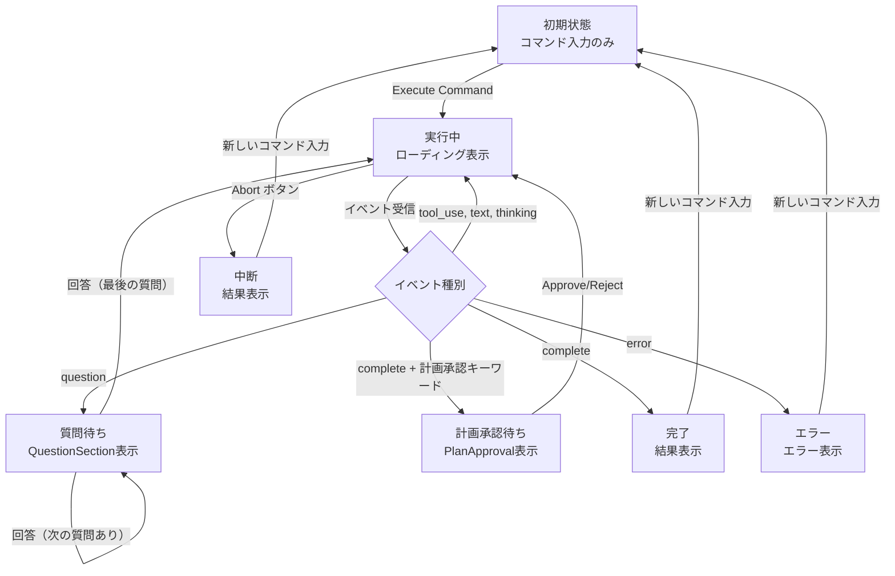
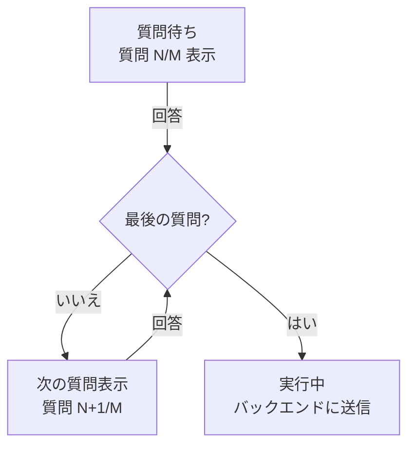
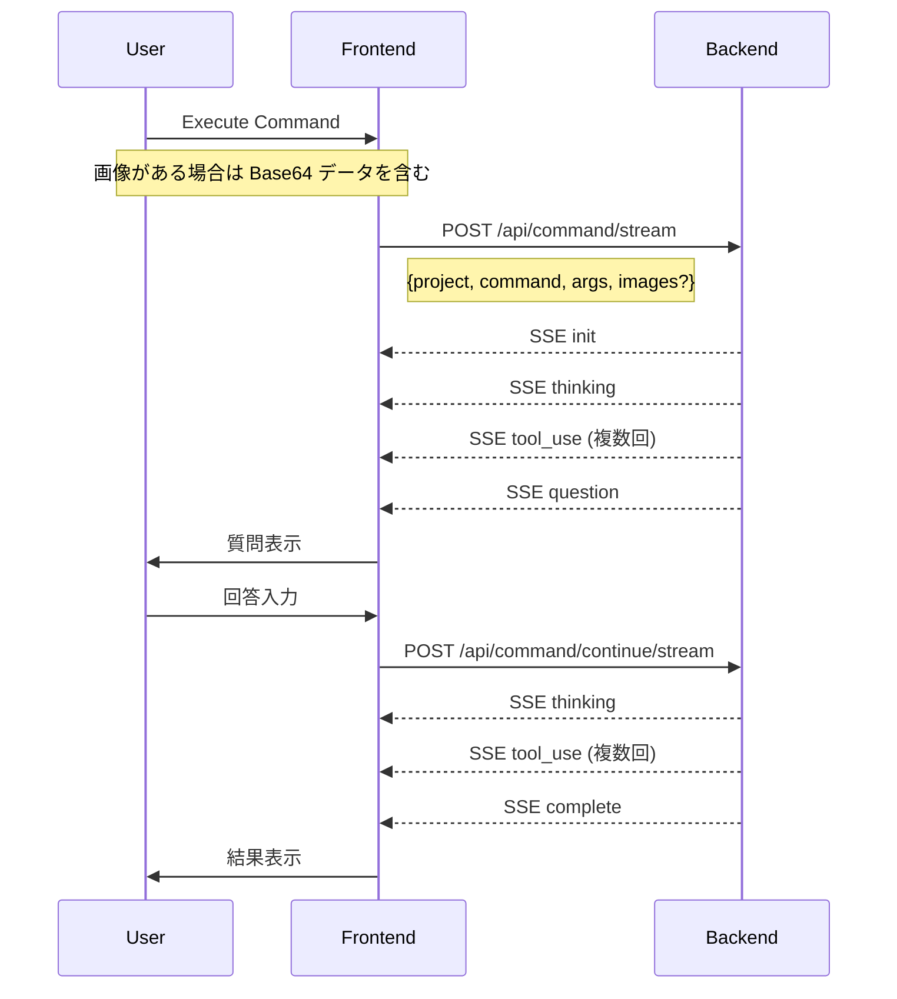
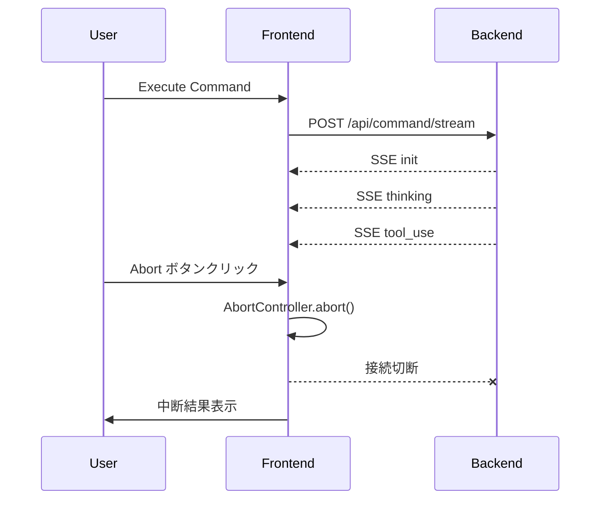
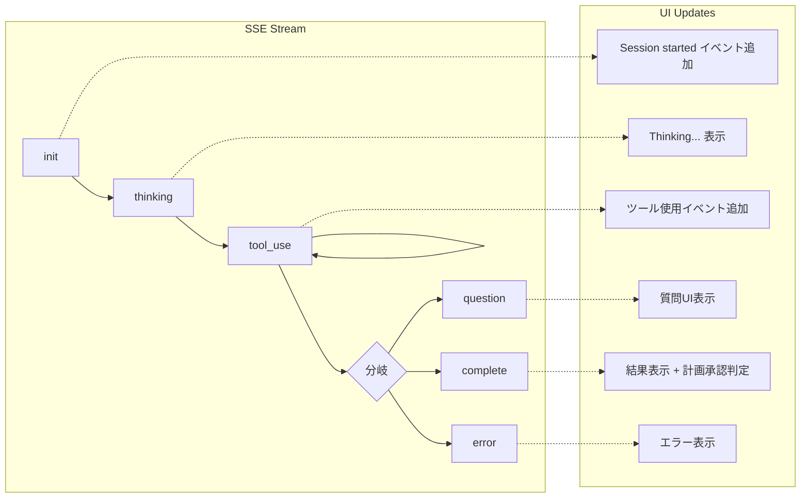
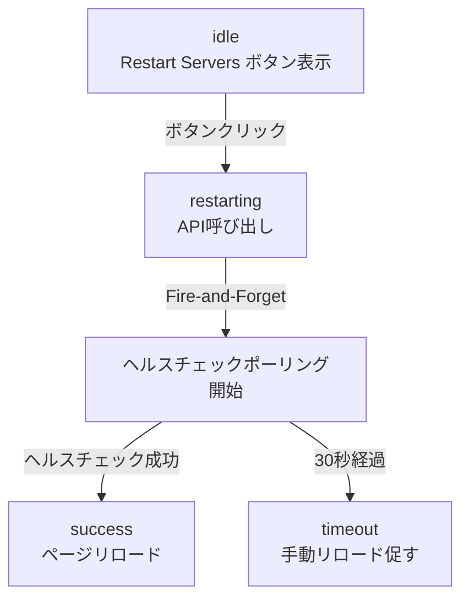
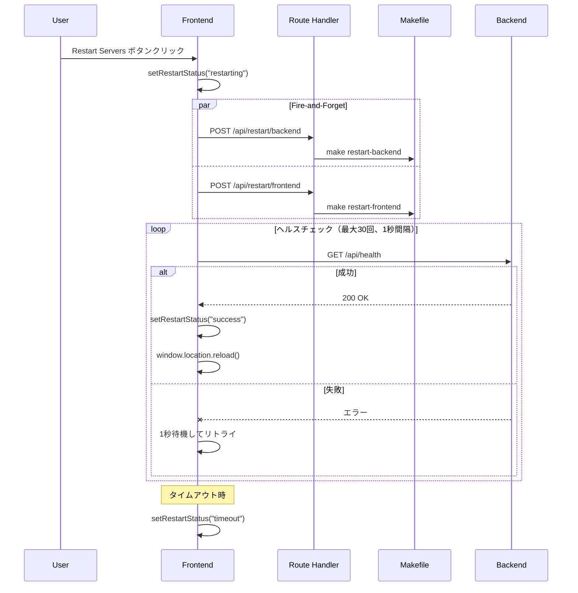

# 画面遷移フロー

Ghost Runner は SPA のため、ページ遷移ではなくコンポーネントの状態遷移で画面が変化する。

## 全体フロー

## 状態遷移詳細

### 1. 初期状態 -> 実行中

| トリガー | 処理 |
|---------|------|
| Execute Command ボタンクリック | executeCommandStream API呼び出し、SSEストリーム開始 |

**渡すデータ**:
- `project`: プロジェクトパス
- `command`: 選択したコマンド（plan, research, etc.）
- `args`: 引数（選択ファイル + 入力テキスト）
- `images`: 画像データ配列（任意）
  - `name`: ファイル名
  - `data`: Base64エンコードされた画像データ
  - `mimeType`: MIME タイプ（image/jpeg, image/png, image/gif, image/webp）

### 2. 実行中 -> 質問待ち

| トリガー | 処理 |
|---------|------|
| question イベント受信 | questions 状態を更新、showQuestions を true に設定 |

**表示データ**:
- `question`: 質問文
- `header`: 質問のヘッダー
- `options`: 選択肢（label, description）
- `multiSelect`: 複数選択可否

### 3. 質問待ち -> 次の質問 / 実行中

複数の質問がある場合、最後の質問に回答するまでバックエンド通信は発生しない。

| トリガー | 条件 | 処理 |
|---------|------|------|
| 選択肢クリック（単一選択時） | 最後の質問以外 | currentQuestionIndex をインクリメント |
| 選択肢クリック（単一選択時） | 最後の質問 | continueSessionStream API呼び出し |
| Submit ボタンクリック | 最後の質問以外 | currentQuestionIndex をインクリメント |
| Submit ボタンクリック | 最後の質問 | continueSessionStream API呼び出し |

**渡すデータ（最後の質問回答時のみ）**:
- `project`: プロジェクトパス
- `session_id`: セッションID
- `answer`: 回答テキスト

### 4. 実行中 -> 計画承認待ち

| トリガー | 処理 |
|---------|------|
| complete イベント + 承認キーワード | showPlanApproval を true に設定 |

**承認キーワード**:
- "承認をお待ち"
- "waiting for approval"
- "Ready for approval"

### 5. 計画承認待ち -> 実行中

| トリガー | 処理 |
|---------|------|
| Approve Plan ボタンクリック | "yes, proceed with the plan" で continueSessionStream 呼び出し |
| Reject ボタンクリック | "no, cancel the plan" で continueSessionStream 呼び出し |

### 6. 実行中 -> 完了/エラー

| トリガー | 処理 |
|---------|------|
| complete イベント（質問なし、承認不要） | resultOutput を設定、resultType を "success" に |
| error イベント | resultOutput を設定、resultType を "error" に |

### 7. 実行中 -> 中断

| トリガー | 処理 |
|---------|------|
| Abort ボタンクリック | AbortController.abort() で SSE 接続を切断 |

**表示条件**:
- ローディング中（`isLoading === true`）
- 質問待ちでない（`showQuestions === false`）
- 計画承認待ちでない（`showPlanApproval === false`）

**中断時の処理**:
- SSE ストリーム接続を切断
- イベントリストに "Execution aborted" を追加
- 結果表示に "Execution aborted by user" を表示（エラー扱い）
- ローディング状態を解除

## API通信フロー

### 中断時の通信フロー

## イベント処理フロー

## ツール使用イベントの表示

各ツールは使用時に以下の情報を表示する。

| ツール | 表示内容 |
|-------|---------|
| Read | ファイルパス（短縮）+ offset/limit |
| Write | ファイルパス（短縮）+ 文字数 |
| Edit | ファイルパス（短縮）+ 置換前後の文字数 |
| Glob | パターン + 対象パス |
| Grep | パターン + 対象パス + glob |
| Bash | 説明（あれば）+ コマンド |
| Task | タスク種別 + プロンプト（短縮） |
| TodoWrite | アイテム数 |
| WebFetch | URL（短縮） |
| WebSearch | 検索クエリ（短縮） |
| ExitPlanMode | "Requesting plan approval" |
| EnterPlanMode | "Starting plan mode" |

## 開発者機能：サーバー再起動フロー

開発環境でのみ利用可能なサーバー再起動機能のフロー。

### 再起動フロー詳細

### 状態遷移

| 現在の状態 | トリガー | 次の状態 | 処理 |
|-----------|---------|---------|------|
| idle | ボタンクリック | restarting | 両API呼び出し、ポーリング開始 |
| restarting | ヘルスチェック成功 | success | 500ms後にページリロード |
| restarting | 30秒タイムアウト | timeout | ボタン表示を "Timeout - Reload manually" に変更 |
