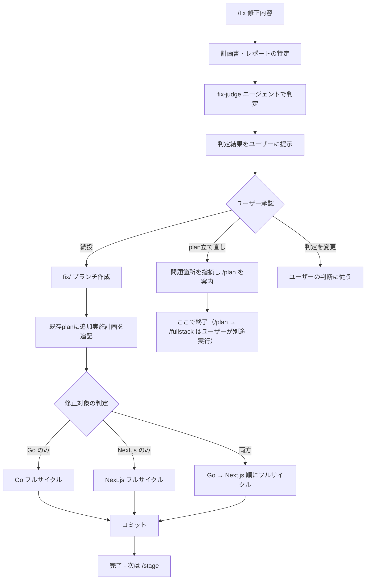

# /fix

**ultrathink**

デプロイ後の本番確認で問題が見つかった場合に、修正の重さを判定し、適切なフローで修正を実行します。

## 計測: 開始

最初に以下のコマンドを実行して開始時刻を記録する:

```bash
date +%s > /tmp/claude-timer-fix-start
```

## 全体フロー



---

## フェーズ 1: 判定

### 1.1 計画書・レポートの特定

直近の計画書を特定する:

```bash
# 完了フォルダから探す（デプロイ済みのため通常はここにある）
ls -t 開発/実装/完了/*_plan.md 2>/dev/null | head -5
# なければ実装待ちフォルダ
ls -t 開発/実装/実装待ち/*_plan.md 2>/dev/null | head -5
```

ユーザーに対象の計画書を確認する。

### 1.2 fix-judge エージェントで判定

`fix-judge` エージェントを呼び出し、以下を渡す:
- ユーザーの修正依頼（`$ARGUMENTS`）
- 特定した計画書のパス

### 1.3 判定結果のユーザー承認

fix-judge の判定結果をユーザーに提示し、承認を得る。

- **続投と判定**: 「既存planの延長で修正します。よろしいですか？」
- **plan立て直しと判定**: 「planの立て直しが必要です。問題箇所を指摘します。」
- **要確認と判定**: 「判断が難しいため、続投/立て直しのどちらにするか選んでください。」

ユーザーが判定を変更したい場合は、ユーザーの判断に従う。

---

## フェーズ 2A: 続投ルート（軽微な修正）

### 2A.1 ブランチ作成

```bash
git checkout main && git pull
git checkout -b fix/修正内容
```

### 2A.2 既存planに追加実施計画を追記

計画書ファイルの末尾に以下のセクションを追記する:

```markdown
---

## 追加実施計画（YYYY-MM-DD）

### 修正依頼
[ユーザーの修正内容]

### 修正判定
続投（fix-judge 判定: 既存planの範囲内）

### 変更ファイル
| ファイル | 変更内容 |
|---------|---------|
| ... | ... |

### 修正ステップ
1. ...
2. ...
```

### 2A.3 修正対象の判定

修正内容から Go / Next.js / 両方 のどれが対象かを判定し、対応するフルサイクルを実行する。

### 2A.4 Go フルサイクル（Go が対象の場合）

#### 実装
- `go-impl` エージェントで修正を実装
- ビルドが通過するまで繰り返す（`cd backend && go build ./...`）

#### レビュー
- `go-reviewer` エージェントでレビュー
- 静的解析（`go vet`、`go fmt`）をすべてパスすること
- 修正必要 → impl に戻る
- 計画見直し必要 → `go-planner` で計画再作成 → impl に戻る

#### テスト
- `go-tester` エージェントでテスト実施
- 計画書のテストプランに基づいてテストコードを作成・実行
- 本番コードのバグ → impl に戻る
- テストコードの問題 → tester が自分で修正

#### ドキュメント更新
- `go-documenter` エージェントでドキュメント更新

#### レポート作成
- `reporter` エージェントでレポート作成
- レポートは計画書の末尾に「追加修正レポート（YYYY-MM-DD）」として追記

### 2A.5 Next.js フルサイクル（Next.js が対象の場合）

#### 実装
- `nextjs-impl` エージェントで修正を実装
- ビルドが通過するまで繰り返す（`cd frontend && npm run build`）

#### レビュー
- `nextjs-reviewer` エージェントでレビュー
- 型チェック（`npx tsc --noEmit`）と ESLint（`npm run lint`）をすべてパスすること
- 修正必要 → impl に戻る
- 計画見直し必要 → `nextjs-planner` で計画再作成 → impl に戻る

#### テスト
- `nextjs-tester` エージェントでテスト実施
- 計画書のテストプランに基づいてテストコードを作成・実行
- 本番コードのバグ → impl に戻る
- テストコードの問題 → tester が自分で修正

#### ドキュメント更新
- `nextjs-documenter` エージェントでドキュメント更新

#### レポート作成
- `reporter` エージェントでレポート作成
- レポートは計画書の末尾に「追加修正レポート（YYYY-MM-DD）」として追記

### 2A.6 コミット

修正内容をコミットする。

### 2A.7 実装完了後

コミットが完了したら、以下を表示する:

```
修正が完了しました。

fix ブランチへのコミットが完了しています。
次は `/stage` でステージング環境にデプロイしてください。
```

---

## フェーズ 2B: plan立て直しルート（重大な修正）

### 2B.1 既存planの問題箇所を指摘

fix-judge の判定結果に基づき、以下を具体的に提示する:

- 既存planのどの部分が修正の妨げになっているか
- 設計判断のどこを見直す必要があるか
- 新たに考慮すべき要件や制約

### 2B.2 /plan への移行を案内

「`/plan` で以下の点を修正して立て直してください」と案内する:
- 修正すべき具体的なポイント
- 既存planの活かせる部分
- 新規で検討が必要な部分

**ここでコマンドは終了。** ユーザーが `/plan` → `/fullstack` を別途実行する。

---

## 完了条件（続投ルート）

- フルサイクル（impl → reviewer → tester → documenter → reporter）が完了している
- レビューで Critical / Warning の指摘がない
- 計画書に「追加実施計画」と「追加修正レポート」が追記されている
- **fix ブランチへのコミットが完了している（次は `/stage`）**

## 計測: 終了

全ステップ完了後に以下のコマンドを実行して所要時間を表示する:

```bash
start=$(cat /tmp/claude-timer-fix-start) && end=$(date +%s) && elapsed=$((end - start)) && minutes=$((elapsed / 60)) && seconds=$((elapsed % 60)) && echo "/fix 所要時間: ${minutes}分${seconds}秒" && echo "$(date +%Y-%m-%d),fix,$ARGUMENTS,${elapsed}秒,${minutes}分${seconds}秒" >> ~/ghostrunner-timing.csv
```

## タスク

$ARGUMENTS
