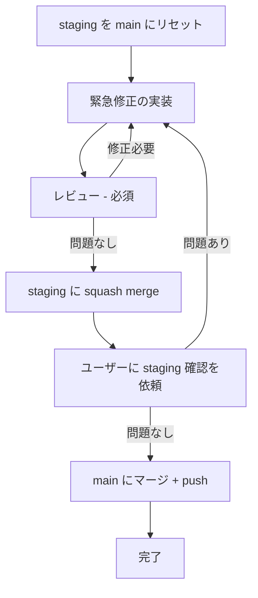

# /hotfix

**ultrathink**

本番環境の緊急修正を行います。staging をリセットし、修正を実装・レビュー後、staging 経由で本番にリリースします。

## 計測: 開始

最初に以下のコマンドを実行して開始時刻を記録する:

```bash
date +%s > /tmp/claude-timer-hotfix-start
```

## フロー



## Step 1: staging を main にリセット

`release-manager` エージェントを使用:

```bash
git checkout staging
git reset --hard origin/main
git push origin staging --force
```

## Step 2: 修正ブランチ作成

```bash
git checkout main && git pull
git checkout -b fix/修正内容
```

## Step 3: 緊急修正の実装

修正内容に応じて適切な impl エージェントを使用:

- **Go バックエンド**: `go-impl` エージェント
- **Next.js フロントエンド**: `nextjs-impl` エージェント
- **DB 変更あり**: `pg-impl` エージェントも追加

## Step 4: レビュー（必須）

緊急時でもレビューは必須:

- **Go バックエンド**: `go-reviewer` エージェント
- **Next.js フロントエンド**: `nextjs-reviewer` エージェント
- **DB 変更あり**: `pg-reviewer` エージェントも追加

テスト・ドキュメント更新はユーザーに確認し、省略可能とする。

## Step 5: コミット

修正内容をコミットする。

## Step 6: staging に squash merge

`staging-manager` エージェントを使用:
- fix ブランチを staging に squash merge
- git push origin staging

## Step 7: ステージング確認

ユーザーにステージング環境での確認を依頼する。
問題がある場合は Step 3 に戻って修正。

## Step 8: 本番リリース

`release-manager` エージェントを使用:
- staging を main にマージ
- git push origin main
- staging を main にリセット
- fix ブランチの削除

## 計測: 終了

全ステップ完了後に以下のコマンドを実行して所要時間を表示する:

```bash
start=$(cat /tmp/claude-timer-hotfix-start) && end=$(date +%s) && elapsed=$((end - start)) && minutes=$((elapsed / 60)) && seconds=$((elapsed % 60)) && echo "/hotfix 所要時間: ${minutes}分${seconds}秒" && echo "$(date +%Y-%m-%d),hotfix,$ARGUMENTS,${elapsed}秒,${minutes}分${seconds}秒" >> ~/ghostrunner-timing.csv
```

## タスク

$ARGUMENTS
