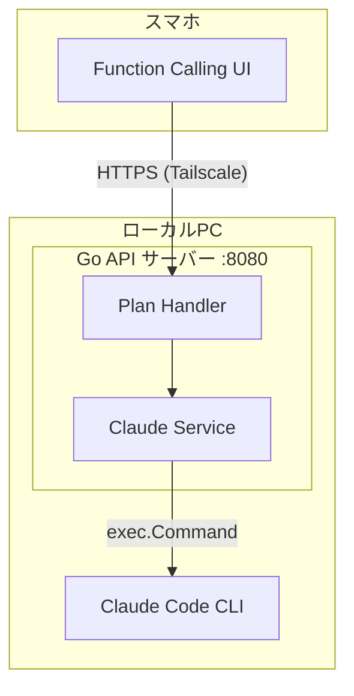
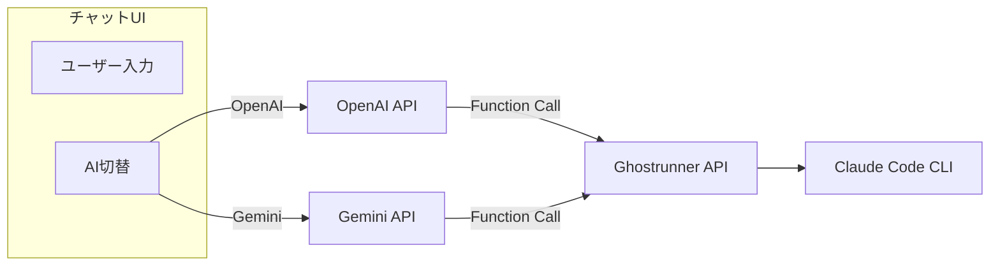

# Ghostrunner APIサーバー 実装計画

## 1. 仕様サマリー

Ghostrunnerは、ローカルのClaude Code CLIを外部からAPI経由で操作するためのローカルAPIサーバー。スマホからTailscale経由でアクセスし、`/plan` カスタムコマンドを実行する機能を提供する（Phase 1）。

**主要機能:**
- POST `/api/plan` - Claude Codeの `/plan` コマンドを実行
- 静的ファイル配信 - シンプルUI（Phase 1）

**フェーズ構成:**
- **Phase 1（今回）:** シンプルUI + API基盤
- **Phase 2（将来）:** AI連携UI（OpenAI / Gemini Function Calling）

**アーキテクチャ:**



## 2. 変更ファイル一覧

| ファイル | 変更内容 | 影響度 |
|---------|---------|-------|
| `go.mod` | モジュール初期化、Gin依存追加 | 高 |
| `cmd/server/main.go` | エントリーポイント、ルーティング、静的配信 | 高 |
| `internal/handler/plan.go` | /api/plan ハンドラー | 高 |
| `internal/service/claude.go` | Claude CLI実行サービス | 高 |
| `web/index.html` | Function Calling UI | 中 |

## 3. 実装ステップ

### Step 1: プロジェクト初期化
- **対象ファイル:** `go.mod`
- **変更内容:**
  - `go mod init ghostrunner` でモジュール初期化
  - `github.com/gin-gonic/gin` を追加

### Step 2: Claude CLI実行サービス
- **対象ファイル:** `internal/service/claude.go`
- **変更内容:**
  - `ClaudeService` インターフェース定義（テスタビリティのため）
  - `claudeServiceImpl` 構造体
  - `ExecutePlan(ctx context.Context, project, args string) (output string, err error)` メソッド
  - `exec.CommandContext` で `claude -p "/plan args" --cwd project` を実行
  - stdout/stderr をキャプチャして返却
- **注意点:** タイムアウト設定が必要（CLIは長時間実行される可能性）

### Step 3: Plan ハンドラー
- **対象ファイル:** `internal/handler/plan.go`
- **変更内容:**
  - `PlanRequest` 構造体（Project, Args フィールド）
  - `PlanResponse` 構造体（Success, Output, Error フィールド）
  - `PlanHandler` 構造体（ClaudeService を DI）
  - `Handle(c *gin.Context)` メソッド - バリデーション、サービス呼び出し、レスポンス整形
- **注意点:** project パスの検証（存在確認、パストラバーサル防止）

### Step 4: メインエントリーポイント
- **対象ファイル:** `cmd/server/main.go`
- **変更内容:**
  - Gin エンジン初期化
  - 依存性の組み立て（ClaudeService -> PlanHandler）
  - ルーティング設定（POST /api/plan）
  - 静的ファイル配信（/ -> web/index.html）
  - `:8080` でサーバー起動
- **注意点:** graceful shutdown は Phase 2 で対応（最小構成のため）

### Step 5: Function Calling UI
- **対象ファイル:** `web/index.html`
- **変更内容:**
  - プロジェクトパス入力フィールド
  - 引数（プロンプト）入力フィールド
  - 実行ボタン
  - 結果表示エリア（成功/エラー）
  - fetch で POST /api/plan を呼び出し
- **注意点:** シンプルなバニラJS（フレームワーク不要）

## 4. 設計判断とトレードオフ

| 判断 | 選択した方法 | 理由 | 他の選択肢 |
|-----|------------|------|----------|
| CLIタイムアウト | 60分（1時間） | 長時間の作業に対応するため | 5分/10分（短すぎる） |
| エラーハンドリング | stderr も output に含める | デバッグしやすい | 分離する（複雑化） |
| 認証 | なし（Phase 1） | Tailscaleで閉じたネットワーク前提 | Basic認証（将来対応） |
| ログ | 標準log パッケージ | 最小構成、外部依存なし | slog（Go 1.21+で検討） |

## 5. 懸念点と対応方針

### 5.1 要確認事項（実装前に解決が必要）

| # | 懸念点 | 詳細 | 選択肢 |
|---|-------|------|--------|
| 1 | claude CLI のパス | `claude` コマンドがPATHに存在するか | A) PATH上の`claude`を使用（シンプル）<br>B) 環境変数`CLAUDE_CLI_PATH`でカスタマイズ可能 |
| 2 | プロジェクトパス制限 | 任意のパスを指定可能だとセキュリティリスク | A) 制限なし（Tailscale前提で信頼）<br>B) `/Users/user/` 配下のみ許可 |
| 3 | タイムアウト設定 | Claude CLI の実行時間 | A) 5分固定<br>B) 10分固定<br>C) 環境変数で設定可能 |
| 4 | CORS設定 | スマホからのアクセス | A) 無効（Tailscale経由で不要）<br>B) 有効（念のため） |

### 5.2 実装時の考慮事項

| 懸念点 | 対応方針 |
|-------|---------|
| CLI実行中のリソース | `context.Context` でタイムアウト/キャンセルを制御 |
| 同時実行 | Phase 1 では制限なし（将来セマフォで制御検討） |
| 長時間実行 | レスポンスタイムアウトをGin側で設定 |
| パストラバーサル | `filepath.Clean` + `filepath.IsAbs` で検証 |
| コマンドインジェクション | `exec.Command` の引数分離（シェル経由しない） |

## 6. 確認事項（確定済み）

### Q1: claude CLI のパス
- [x] **A) PATH上の`claude`を使用**

### Q2: プロジェクトパス制限
- [x] **A) 制限なし**（Tailscale前提で信頼）

### Q3: タイムアウト設定
- [x] **60分（1時間）固定** - 長時間の作業に対応

### Q4: CORS設定
- [x] **A) 無効**（Tailscale経由で不要）

### 使用ツール
- [x] **Claude CLI (`claude`)** - 公式CLIツール。`-p` フラグで非対話的実行

---

## 7. Phase 2: AI連携UI（将来計画）

Phase 1完成後、以下のAI連携機能を追加予定。

### 7.1 概要

OpenAI / Gemini のFunction Calling機能を使用し、AIとの会話の中でClaude Code APIを自動呼び出しする。



### 7.2 追加ファイル（Phase 2）

| ファイル | 内容 |
|---------|------|
| `web/chat.html` | チャットUI（AI連携版） |
| `internal/handler/chat.go` | チャットAPI（オプション: サーバー経由でAI呼び出し） |

### 7.3 実装方針

1. **クライアントサイド実装（推奨）**
   - フロントエンドから直接OpenAI/Gemini APIを呼び出し
   - APIキーはブラウザのlocalStorageで管理（Tailscale閉域網前提）
   - Function定義でGhostrunner APIを指定

2. **サーバーサイド実装（オプション）**
   - GoサーバーでAI APIをプロキシ
   - APIキーをサーバー側で管理（より安全）

### 7.4 Function定義例

```json
{
  "name": "execute_plan",
  "description": "Claude Codeの/planコマンドを実行して実装計画を作成する",
  "parameters": {
    "type": "object",
    "properties": {
      "project": {
        "type": "string",
        "description": "プロジェクトのパス"
      },
      "args": {
        "type": "string",
        "description": "計画作成の指示内容"
      }
    },
    "required": ["project", "args"]
  }
}
```

---

確認後、`/go` で実装を開始できます。

---

## 実装完了レポート

### 実装サマリー
- **実装日**: 2026-01-24
- **変更ファイル数**: 5 files
- **Phase**: Phase 1 (シンプルUI + API基盤)

### 変更ファイル一覧

| ファイル | 変更内容 |
|---------|---------|
| `go.mod` | モジュール定義 (`ghostrunner`)、Gin v1.10.0 依存追加 |
| `internal/service/claude.go` | Claude CLI 実行サービス。60分タイムアウト、コンテキストキャンセル対応 |
| `internal/handler/plan.go` | `/api/plan` ハンドラー。リクエストバリデーション、パス検証、レスポンス整形 |
| `cmd/server/main.go` | エントリーポイント。DI組み立て、ルーティング、静的配信、:8080 起動 |
| `web/index.html` | シンプルUI。プロジェクトパス入力、引数入力、結果表示、localStorage保存 |

### 計画からの変更点

実装計画に記載がなかった判断・選択:

- **localStorage によるプロジェクトパス保存**: UIの利便性向上のため、入力したプロジェクトパスをブラウザに保存する機能を追加
- **ValidationError カスタム型**: バリデーションエラーを明確に区別するためのエラー型を定義
- **エラー時の output 返却**: CLI実行エラー時にも途中出力を返却する仕様を採用（デバッグ容易性のため）

### 実装時の課題

#### ビルド・テストで苦戦した点

特になし

#### 技術的に難しかった点

特になし

### 残存する懸念点

今後注意が必要な点:

- **テストファイル未作成**: Phase 1 ではテストファイルを作成していない。Phase 2 で対応予定
- **Graceful Shutdown 未実装**: 長時間実行中の CLI プロセスが強制終了される可能性がある
- **同時実行制限なし**: 複数リクエストが同時に来た場合、リソース競合の可能性
- **認証なし**: Tailscale 閉域網前提だが、追加のセキュリティ層があると望ましい

### 動作確認フロー

```
1. ターミナルで以下を実行:
   cd /Users/user/Ghostrunner
   go run ./cmd/server

2. ブラウザで http://localhost:8080 にアクセス

3. フォームに入力:
   - Project Path: /Users/user/Ghostrunner
   - Plan Arguments: 任意の計画指示

4. "Execute /plan" ボタンをクリック

5. 期待される動作:
   - ローディングスピナーが表示される
   - Claude CLI が実行される (数分かかる場合あり)
   - 成功時: 緑色の枠で出力結果が表示される
   - 失敗時: 赤色の枠でエラーメッセージが表示される
```

### デプロイ後の確認事項

- [ ] `claude` コマンドが PATH に存在することを確認
- [ ] Tailscale 経由でスマホからアクセスできることを確認
- [ ] 長時間実行 (10分以上) が正常に完了することを確認
- [ ] プロジェクトパスの localStorage 保存が機能することを確認

### レビュー結果

| 項目 | 結果 |
|------|------|
| ビルド (`go build ./...`) | OK |
| 静的解析 (`go vet ./...`) | OK |
| フォーマット (`go fmt ./...`) | OK |
| Critical Issues | なし |
| Warning | テストファイルなし (Phase 2 で対応予定) |

### セキュリティ対策

| 対策 | 実装内容 |
|------|---------|
| コマンドインジェクション防止 | `exec.Command` の引数分離 (シェル経由しない) |
| パストラバーサル防止 | `filepath.Clean` + `filepath.IsAbs` で検証 |
| ディレクトリ存在確認 | `os.Stat` でプロジェクトパスの存在・ディレクトリ確認 |

### コード品質

| 指標 | 状況 |
|------|------|
| 行数 (service/claude.go) | 81行 |
| 行数 (handler/plan.go) | 133行 |
| 行数 (main.go) | 39行 |
| インターフェース使用 | `ClaudeService` でテスタビリティ確保 |
| エラーハンドリング | コンテキストラップ、適切なHTTPステータス |

### Phase 2 への引継ぎ事項

1. **AI連携UI**: OpenAI / Gemini Function Calling を使用したチャットUI
2. **テスト追加**: `internal/service/claude_test.go`, `internal/handler/plan_test.go`
3. **Graceful Shutdown**: `signal.NotifyContext` を使用した適切なシャットダウン処理
4. **Health Check**: `/health` エンドポイントの追加
5. **同時実行制限**: セマフォによる並列実行数の制御

---

## コードレビュー修正レポート (2026-01-24)

### レビュー実施

go-reviewer エージェントによるコードレビューを実施。

### 修正内容

| 修正項目 | ファイル | 内容 |
|---------|---------|------|
| SSE write エラー処理 | `handler/plan.go` | `w.Write()` のエラーを検出してログ出力、ストリーム終了 |
| Scanner エラー伝播 | `service/claude.go` | Scanner エラー時にエラーイベントをチャンネルに送信 |
| 未使用型の削除 | `service/types.go` | `ClaudeStreamMessage` 型を削除 |
| ログの切り詰め | `service/claude.go` | `args`, `answer` のログ出力を `truncateLog()` で100文字に制限 |
| ドキュメント更新 | `service/doc.go`, `handler/doc.go` | ストリーミング/セッション継続機能の説明を追加 |

### 設計判断の維持（修正しなかった項目）

以下は計画書で意図的に決定された設計であり、修正しない:

| 項目 | 理由 |
|------|------|
| 認証なし | Tailscale 閉域網前提で信頼 |
| プロジェクトパス制限なし | Tailscale 閉域網前提で信頼 |
| `bypassPermissions` モード | /plan コマンド実行に必要 |

### 検証結果

| 項目 | 結果 |
|------|------|
| `go build ./...` | OK |
| `go vet ./...` | OK |
| `gofmt` | OK |

### 現在の実装状況

計画書の Phase 1 を超える機能が実装済み:

| 機能 | 状態 | 備考 |
|------|------|------|
| `/api/plan` | 完了 | Phase 1 計画通り |
| `/api/plan/stream` | 完了 | SSE ストリーミング（追加機能） |
| `/api/plan/continue` | 完了 | セッション継続（追加機能） |
| `/api/plan/continue/stream` | 完了 | セッション継続 + SSE（追加機能） |
| シンプル UI | 完了 | Phase 1 計画通り + 拡張 |
