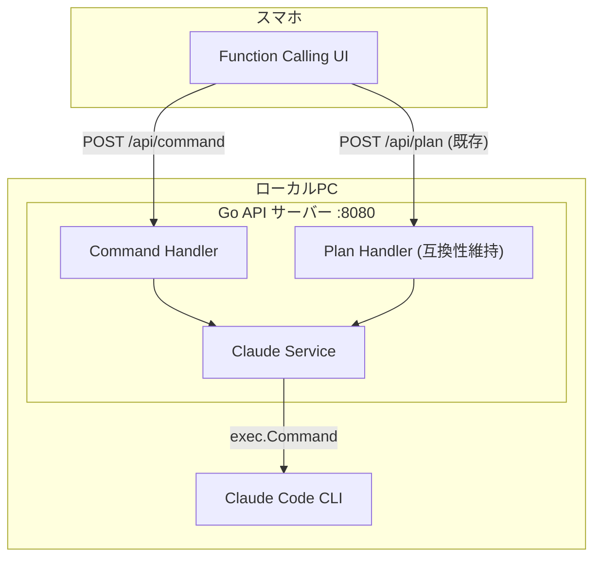

# コマンド共通化 API 実装計画

## 1. 仕様サマリー

Ghostrunner API を `/plan` 専用から汎用コマンド実行に拡張する。`/api/command` エンドポイントで任意のカスタムコマンド（`/plan`, `/fullstack`, `/go`, `/nextjs`）を実行可能にする。

**主要機能:**
- POST `/api/command` - 任意のカスタムコマンドを実行
- POST `/api/command/stream` - ストリーミング実行
- POST `/api/command/continue` - セッション継続
- POST `/api/command/continue/stream` - セッション継続ストリーミング

**今回のスコープ:**
- `/fullstack` コマンドの API 対応
- 既存の `/plan` エンドポイントは互換性のため維持
- UI にコマンド選択ドロップダウンを追加

**アーキテクチャ:**



## 2. 変更ファイル一覧

| ファイル | 変更内容 | 影響度 |
|---------|---------|-------|
| `internal/handler/command.go` | 新規: 汎用コマンドハンドラー | 高 |
| `internal/service/claude.go` | コマンド名を引数に追加 | 中 |
| `cmd/server/main.go` | /api/command ルーティング追加 | 中 |
| `web/index.html` | コマンド選択ドロップダウン追加 | 中 |
| `internal/handler/doc.go` | ドキュメント更新 | 低 |
| `internal/service/doc.go` | ドキュメント更新 | 低 |

## 3. 実装ステップ

### Step 1: ClaudeService の汎用化

- **対象ファイル:** `internal/service/claude.go`
- **変更内容:**
  - 新メソッド追加:
    - `ExecuteCommand(ctx, project, command, args string) (*PlanResult, error)`
    - `ExecuteCommandStream(ctx, project, command, args string, eventCh) error`
  - 既存の `ExecutePlan` / `ExecutePlanStream` は内部で `ExecuteCommand` を呼び出すように変更（互換性維持）
  - コマンド名のバリデーション（許可リスト: `plan`, `fullstack`, `go`, `nextjs`）

```go
// 許可されたコマンド一覧
var allowedCommands = map[string]bool{
    "plan":      true,
    "fullstack": true,
    "go":        true,
    "nextjs":    true,
}
```

### Step 2: Command ハンドラー作成

- **対象ファイル:** `internal/handler/command.go`（新規）
- **変更内容:**
  - `CommandRequest` 構造体（Project, Command, Args フィールド）
  - `CommandResponse` 構造体（PlanResponse と同じ構造）
  - `CommandHandler` 構造体
  - 4つのハンドラーメソッド:
    - `Handle` - POST /api/command
    - `HandleStream` - POST /api/command/stream
    - `HandleContinue` - POST /api/command/continue
    - `HandleContinueStream` - POST /api/command/continue/stream
  - コマンド名のバリデーション

### Step 3: ルーティング追加

- **対象ファイル:** `cmd/server/main.go`
- **変更内容:**
  - CommandHandler のインスタンス化
  - `/api/command` グループの追加

```go
// 新規: 汎用コマンドAPI
commandHandler := handler.NewCommandHandler(claudeService)
api.POST("/command", commandHandler.Handle)
api.POST("/command/stream", commandHandler.HandleStream)
api.POST("/command/continue", commandHandler.HandleContinue)
api.POST("/command/continue/stream", commandHandler.HandleContinueStream)
```

### Step 4: UI 更新

- **対象ファイル:** `web/index.html`
- **変更内容:**
  - コマンド選択ドロップダウン追加（`/plan`, `/fullstack`, `/go`, `/nextjs`）
  - API エンドポイントを動的に切り替え
  - 選択したコマンドを localStorage に保存
  - ボタンテキストを動的に変更（「Execute /plan」→「Execute /fullstack」など）

```html
<select id="command">
    <option value="plan">/plan</option>
    <option value="fullstack">/fullstack</option>
    <option value="go">/go</option>
    <option value="nextjs">/nextjs</option>
</select>
```

## 4. API 仕様

### POST /api/command

**リクエスト:**
```json
{
    "project": "/Users/user/SomeProject",
    "command": "fullstack",
    "args": "新機能を実装して"
}
```

**レスポンス:**
```json
{
    "success": true,
    "session_id": "abc123",
    "output": "実装結果...",
    "questions": [],
    "completed": true,
    "cost_usd": 0.05
}
```

### POST /api/command/stream

SSE ストリーミング。リクエスト形式は `/api/command` と同じ。

### POST /api/command/continue

**リクエスト:**
```json
{
    "project": "/Users/user/SomeProject",
    "session_id": "abc123",
    "answer": "UIも更新 (推奨)"
}
```

### POST /api/command/continue/stream

SSE ストリーミング。リクエスト形式は `/api/command/continue` と同じ。

## 5. 設計判断とトレードオフ

| 判断 | 選択した方法 | 理由 | 他の選択肢 |
|-----|------------|------|----------|
| 既存APIの扱い | `/api/plan` は維持 | 後方互換性のため | 削除（breaking change） |
| コマンド許可リスト | ハードコード | シンプル、変更頻度低い | 設定ファイル（過剰） |
| ハンドラー分離 | command.go を新規作成 | 責務の分離、plan.go の肥大化防止 | plan.go に追加（複雑化） |

## 6. 懸念点と対応方針

### 6.1 実装時の考慮事項

| 懸念点 | 対応方針 |
|-------|---------|
| 不正なコマンド名 | 許可リストでバリデーション、400 エラーを返す |
| 既存 UI の互換性 | 既存の `/api/plan` エンドポイントは維持 |
| コードの重複 | 共通ロジックは service 層に集約 |

## 7. 確認事項（確定済み）

- [x] **API設計**: コマンド共通化（`/api/command`）
- [x] **スコープ**: `/fullstack` のみ（後で `/go`, `/nextjs` 追加可能）
- [x] **UI対応**: UIも更新（コマンド選択ドロップダウン追加）
- [x] **既存API**: `/api/plan` は互換性のため維持

---

承認後、実装を開始します。
