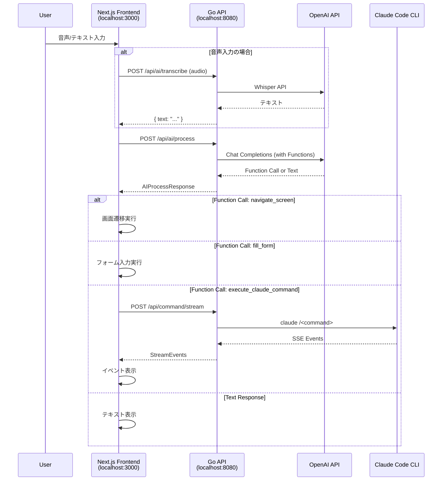

# OpenAI Function Calling による対話式UI操作 実装計画

## 概要

Ghostrunnerプロジェクトに「OpenAI Function Calling による対話式UI操作」機能を追加する。
音声/テキスト入力からAIがユーザーの意図を解析し、UIアクション（画面遷移、フォーム入力など）およびClaude CLIコマンドの実行を返却する。

**将来的な拡張**: Gemini API対応を想定した設計とする。

---

## ユーザー確認結果

| 項目 | 決定 |
|------|------|
| Function目的 | UI操作 + Claude CLI実行の両方 |
| デプロイ構成 | 別ポート運用（Next.js:3000、Go API:8080） |
| 音声入力 | 初期リリースに含める |
| APIキー | 用意可能 |

---

## 現状分析

### 既存構造

```
Ghostrunner/
|-- cmd/server/main.go           # Goサーバーエントリポイント
|-- internal/
|   |-- handler/command.go       # HTTPハンドラー（SSEストリーミング対応）
|   |-- service/claude.go        # Claude CLI実行サービス
|   |-- service/types.go         # StreamEvent, CommandResult等
|-- web/index.html               # バニラJS UI（約900行）
|-- docs/BACKEND_API.md          # API仕様書
```

### 既存API

| エンドポイント | 説明 |
|---------------|------|
| POST /api/command/stream | コマンドのSSEストリーミング実行 |
| POST /api/command/continue/stream | セッション継続（質問への回答） |

### 既存イベントタイプ

`init`, `thinking`, `tool_use`, `tool_result`, `text`, `question`, `complete`, `error`

---

## 懸念点と選択肢

### 1. AIプロバイダー抽象化のタイミング

| 選択肢 | メリット | デメリット |
|--------|---------|-----------|
| A: 初期から抽象レイヤー | Gemini対応が容易 | 初期実装が複雑化 |
| B: OpenAI固定で後から抽象化 | シンプルに開始可能 | リファクタリング必要 |

**推奨**: B案（YAGNI原則）

### 2. 音声入力方式

| 選択肢 | メリット | デメリット |
|--------|---------|-----------|
| A: OpenAI Realtime API | リアルタイム双方向通信 | 実装複雑、コスト高 |
| B: Whisper API（REST） | シンプル、確実 | 遅延あり |

**推奨**: B案（まずはWhisperで確実に動作させる）

### 3. Function Callingの実行場所

| 選択肢 | メリット | デメリット |
|--------|---------|-----------|
| A: Goバックエンドで実行 | APIキー管理集中 | バックエンド改修必要 |
| B: Next.jsフロントエンドで実行 | バックエンド変更不要 | APIキーがフロントに露出 |
| C: Next.js API Routes経由 | セキュア、柔軟 | 中間レイヤー追加 |

**推奨**: A案（Goバックエンドに新規エンドポイント追加）

### 4. 会話履歴の管理

| 選択肢 | メリット | デメリット |
|--------|---------|-----------|
| A: バックエンドで保持 | フロントが軽量 | ステートフル、複雑 |
| B: フロントから毎回送信 | ステートレス | リクエストサイズ増大 |

**推奨**: B案（ステートレス設計を維持）

### 5. 既存 `web/index.html` の扱い

| 選択肢 | メリット | デメリット |
|--------|---------|-----------|
| A: 削除してNext.jsに置き換え | コード統一 | 既存機能の再実装必要 |
| B: 両方維持 | 移行期間の安全網 | メンテナンス負荷 |

**推奨**: B案（移行完了後に削除検討）

---

## バックエンド計画

### 1. 新規エンドポイント

| エンドポイント | メソッド | 説明 |
|---------------|---------|------|
| `/api/ai/process` | POST | Function Calling実行（同期） |
| `/api/ai/transcribe` | POST | 音声文字起こし（Whisper API） |

### 2. API設計

#### POST /api/ai/process

**リクエスト**:
```json
{
    "message": "顧客一覧画面を開いて",
    "conversation_history": [
        {"role": "user", "content": "前の発言"},
        {"role": "assistant", "content": "前の応答"}
    ]
}
```

**レスポンス（Function Call検出時）**:
```json
{
    "success": true,
    "type": "function_call",
    "function_call": {
        "name": "navigate_screen",
        "arguments": {
            "screen_id": "customer_list",
            "params": {}
        }
    },
    "message": "顧客一覧画面に移動します"
}
```

**レスポンス（通常テキスト応答時）**:
```json
{
    "success": true,
    "type": "text",
    "message": "承知しました。どの画面を開きますか？"
}
```

#### POST /api/ai/transcribe

**リクエスト**: `multipart/form-data`
- `audio`: 音声ファイル（webm, wav, mp3）

**レスポンス**:
```json
{
    "success": true,
    "text": "顧客一覧画面を開いて"
}
```

### 3. Function定義

| Function名 | 説明 | パラメータ |
|-----------|------|-----------|
| `navigate_screen` | 画面遷移 | screen_id, params |
| `fill_form` | フォーム入力 | form_id, fields |
| `submit_action` | アクション実行 | action_id, params |
| `show_dialog` | ダイアログ表示 | dialog_type, message |
| `execute_claude_command` | Claude CLIコマンド実行 | command, project, args |

#### execute_claude_command 詳細

```json
{
    "name": "execute_claude_command",
    "description": "Claude Code CLIコマンドを実行する",
    "parameters": {
        "type": "object",
        "properties": {
            "command": {
                "type": "string",
                "enum": ["plan", "fullstack", "go", "nextjs"],
                "description": "実行するコマンド"
            },
            "project": {
                "type": "string",
                "description": "対象プロジェクトのパス"
            },
            "args": {
                "type": "string",
                "description": "コマンドの引数"
            }
        },
        "required": ["command", "project", "args"]
    }
}
```

### 4. 変更ファイル一覧

| ファイル | 変更内容 |
|----------|----------|
| `internal/service/types.go` | AI関連の型定義を追加 |
| `internal/service/openai.go` (新規) | OpenAI API クライアント実装 |
| `internal/handler/ai.go` (新規) | AI処理用HTTPハンドラー |
| `cmd/server/main.go` | ルーティング追加 |

### 5. 実装ステップ

1. **型定義追加** (`internal/service/types.go`)
   - AIRequest/AIResponse型
   - FunctionCall型
   - TranscribeRequest/TranscribeResponse型

2. **OpenAIサービス実装** (`internal/service/openai.go`)
   - Chat Completions API呼び出し（Function Calling対応）
   - Whisper API呼び出し（音声文字起こし）
   - Function定義の構築

3. **HTTPハンドラー作成** (`internal/handler/ai.go`)
   - `/api/ai/process` エンドポイント
   - `/api/ai/transcribe` エンドポイント
   - リクエストバリデーション

4. **ルーティング追加** (`cmd/server/main.go`)
   - AIHandler初期化と登録

---

## フロントエンド計画

### 1. プロジェクト構造

```
frontend/
|-- src/
|   |-- app/
|   |   |-- layout.tsx           # ルートレイアウト
|   |   |-- page.tsx             # メインページ
|   |   |-- globals.css          # グローバルスタイル
|   |-- components/
|   |   |-- chat/
|   |   |   |-- ChatContainer.tsx    # チャット全体コンテナ
|   |   |   |-- MessageList.tsx      # メッセージ一覧
|   |   |   |-- MessageItem.tsx      # 個別メッセージ
|   |   |   |-- InputArea.tsx        # 入力エリア
|   |   |-- event/
|   |   |   |-- EventList.tsx        # SSEイベント一覧
|   |   |   |-- EventItem.tsx        # 個別イベント表示
|   |   |-- question/
|   |   |   |-- QuestionModal.tsx    # 質問モーダル
|   |   |-- ui/
|   |       |-- Button.tsx           # 汎用ボタン
|   |       |-- LoadingSpinner.tsx   # ローディング
|   |-- hooks/
|   |   |-- useSSEStream.ts          # SSEストリーミング
|   |   |-- useVoiceInput.ts         # 音声入力
|   |   |-- useAIChat.ts             # AI対話管理
|   |-- lib/
|   |   |-- api.ts                   # Go API クライアント
|   |   |-- whisper.ts               # Whisper API クライアント
|   |-- types/
|       |-- api.ts                   # API型定義
|       |-- events.ts                # イベント型定義
```

### 2. 型定義

```typescript
// types/api.ts

// AI API
interface AIProcessRequest {
  provider?: 'openai' | 'gemini';
  message: string;
  conversation_history?: ConversationMessage[];
}

interface ConversationMessage {
  role: 'user' | 'assistant';
  content: string;
}

interface AIProcessResponse {
  success: boolean;
  type?: 'function_call' | 'text';
  function_call?: FunctionCall;
  content?: string;
  error?: string;
}

interface FunctionCall {
  name: string;
  arguments: Record<string, unknown>;
}

// SSE イベント
type StreamEventType =
  | 'init' | 'thinking' | 'tool_use' | 'tool_result'
  | 'text' | 'question' | 'complete' | 'error';

interface StreamEvent {
  type: StreamEventType;
  session_id?: string;
  message?: string;
  tool_name?: string;
  tool_input?: Record<string, unknown>;
  result?: CommandResult;
}

interface CommandResult {
  session_id: string;
  output: string;
  questions?: Question[];
  completed: boolean;
  cost_usd?: number;
}

interface Question {
  question: string;
  header: string;
  options: Option[];
  multiSelect: boolean;
}

interface Option {
  label: string;
  description: string;
}
```

### 3. 主要コンポーネント

| コンポーネント | 責務 |
|---------------|------|
| `ChatContainer` | AI対話全体の状態管理、Function Call実行 |
| `MessageList` | 対話履歴表示 |
| `InputArea` | テキスト/音声入力切り替え |
| `EventList` | SSEイベントのリアルタイム表示（Claude Code実行時） |
| `QuestionModal` | Claude Codeからの質問への回答UI |

### 4. 実装ステップ

1. **プロジェクト初期化**
   - `create-next-app` でNext.js 15作成
   - Tailwind CSS設定
   - TypeScript strict mode

2. **型定義とAPIクライアント**
   - `types/api.ts`
   - `lib/api.ts`（Go API連携）

3. **SSEストリーミングフック**
   - `useSSEStream.ts`

4. **基本UI構築**
   - `ChatContainer`
   - `EventList`
   - `InputArea`

5. **AI対話機能**
   - `useAIChat.ts`（Function Calling連携）

6. **音声入力**
   - `useVoiceInput.ts`（Whisper API）

---

## 対話フロー図

### メインフロー



---

## デプロイ構成

### 別ポート運用（採用）

```
┌─────────────────────────────┐     ┌─────────────────────────────┐
│   Next.js Frontend          │     │   Go API Server             │
│   http://localhost:3000     │────▶│   http://localhost:8080     │
│                             │     │                             │
│   - AI対話UI                │     │   - /api/ai/process         │
│   - 音声入力                │     │   - /api/ai/transcribe      │
│   - Function Call実行       │     │   - /api/command/stream     │
└─────────────────────────────┘     │   - /api/command/continue   │
                                    │                             │
┌─────────────────────────────┐     │   既存:                     │
│   既存 Web UI               │────▶│   - /api/plan/*             │
│   http://localhost:8080/    │     │   - StaticFile: /           │
│   (web/index.html)          │     └─────────────────────────────┘
└─────────────────────────────┘
```

### CORS設定（Go API側）

`cmd/server/main.go` にCORS設定を追加:
```go
r.Use(cors.New(cors.Config{
    AllowOrigins:     []string{"http://localhost:3000"},
    AllowMethods:     []string{"GET", "POST", "OPTIONS"},
    AllowHeaders:     []string{"Content-Type"},
    AllowCredentials: true,
}))
```

---

## 環境変数

### バックエンド（Go）

| 変数名 | 説明 | 例 |
|--------|------|-----|
| `OPENAI_API_KEY` | OpenAI APIキー（Function Calling + Whisper） | `sk-...` |

### フロントエンド（Next.js）

| 変数名 | 説明 | 例 |
|--------|------|-----|
| `NEXT_PUBLIC_API_URL` | Go APIベースURL | `http://localhost:8080` |

---

## テスト計画

### バックエンド

| 対象 | テスト種別 |
|------|----------|
| OpenAI APIレスポンスパース | ユニットテスト |
| ハンドラーバリデーション | ユニットテスト |

### フロントエンド

| 対象 | テスト種別 |
|------|----------|
| `useSSEStream` | ユニットテスト |
| `api.ts` | ユニットテスト |
| 対話フロー | E2Eテスト |

---

## 確認済み事項

| 項目 | 決定内容 |
|------|----------|
| Function定義の範囲 | UI操作（navigate_screen, fill_form, submit_action, show_dialog）+ Claude CLI実行（execute_claude_command） |
| OpenAI APIキー | 用意可能（バックエンドで一元管理） |
| 音声入力 | 初期リリースに含める |
| デプロイ構成 | 別ポート運用（Next.js:3000、Go API:8080） |

---

## 型定義の整合性

### Go API 既存型との対応

| Go型 (service/types.go) | TypeScript型 (types/api.ts) | 備考 |
|------------------------|----------------------------|------|
| `StreamEvent` | `StreamEvent` | 完全互換 |
| `CommandResult` | `CommandResult` | 完全互換 |
| `Question` | `Question` | 完全互換 |
| `Option` | `Option` | 完全互換 |

新規追加型:
- `AIProcessRequest` / `AIProcessResponse`（新規API用）
- `TranscribeResponse`（Whisper API用）
- `FunctionCall`（Function Calling用）

---

## 実装コマンド

計画承認後、以下のコマンドで実装を開始：

```
/fullstack
```
