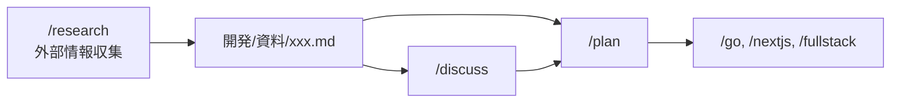

# 検討結果: /research コマンド

## 検討経緯

| 日付 | 内容 |
|------|------|
| 2026-01-25 | 初回相談: 資料作成コマンドの追加要望 |
| 2026-01-25 | 明確化: plan/discuss の上流に位置する情報収集フェーズとして位置付け |

## 背景・目的

現在のワークフローは `/discuss` → `/plan` → 実装という流れだが、外部情報を収集・整理するフェーズがない。

**目的**: 外部からの情報収集を行い、レポートとしてまとめる。このレポートは `/plan` や `/discuss` 実行時の入力資料として活用する。

## ワークフローにおける位置付け



**/research は実装ワークフローの上流に位置し、意思決定の材料となる資料を作成する。**

## 想定されるユースケース

1. **技術比較**: JWT vs Session、Redis vs Memcached など
2. **外部API調査**: Stripe API、Google Cloud サービスの仕様調査
3. **ベストプラクティス**: Go のエラーハンドリング、React の状態管理パターン
4. **ライブラリ選定**: 認証ライブラリの比較、ORM の比較
5. **業界動向**: フロントエンド/バックエンドのトレンド調査
6. **公式ドキュメント・サンプルコード調査**: 最新の公式ドキュメント、サンプルコードの確認
7. **不具合調査**: ライブラリやAPIの既知の不具合、GitHub Issues の確認
8. **コミュニティ事例**: Stack Overflow、GitHub Discussions、Reddit 等での類似事例・解決策

## 機能要件

### 必須機能

1. **ディープリサーチ**（多角的な情報収集）
   - **公式ドキュメント**: 最新の公式ドキュメント、APIリファレンス
   - **サンプルコード**: 公式リポジトリ、公式サンプルの確認
   - **不具合情報**: GitHub Issues、既知のバグ、回避策
   - **コミュニティ事例**: Stack Overflow、Discussions、Reddit での類似事例

2. **構造化されたレポート出力**
   - 概要、比較表、結論、ソース一覧
   - Mermaid 図による視覚的説明
   - 注意点・既知の問題のセクション

3. **コミット機能**
   - 作成後に自動的にコミット

4. **md ファイル入力のサポート**
   - plan や discuss で作成した md をコンテキストとして渡せる
   - その文脈に沿った調査を実施

### 出力先

```
開発/資料/YYYY-MM-DD_テーマ名.md
```

## 選択肢の検討

### 案A: シンプル構成（推奨）

```
開発/
├── 検討中/      ← /discuss
├── 資料/        ← /research (新規)
└── 実装/
    ├── 実装待ち/ ← /plan
    └── 完了/
```

**メリット**:
- 既存構造との整合性が高い
- シンプルで分かりやすい
- フォルダが増えない

**デメリット**:
- 資料が増えると探しにくくなる可能性

### 案B: カテゴリ分け構成

```
開発/
├── 検討中/
├── 資料/
│   ├── 技術調査/
│   ├── API調査/
│   └── 分析/
└── 実装/
```

**メリット**:
- 資料が増えても整理しやすい
- 目的別に検索しやすい

**デメリット**:
- 構造が複雑
- カテゴリ判断のオーバーヘッド
- 運用が煩雑

## MVP 提案

**推奨案**: 案A（シンプル構成）

### MVP 範囲

1. `/research <テーマ>` でディープリサーチを実行
2. `開発/資料/YYYY-MM-DD_テーマ名.md` にレポート出力
3. 作成後にコミット
4. 引数でコンテキストファイルを指定可能

### 使用例

```bash
# 基本的な使い方
/research JWT認証のベストプラクティス

# コンテキストファイルを指定
/research 認証方式の詳細比較 開発/検討中/2026-01-25_auth-discussion.md
```

### 次回以降（拡張機能）

- カテゴリ別フォルダ分け
- 複数の md ファイル入力対応
- 既存資料の更新機能

## 実装に必要なファイル

| ファイル | 内容 |
|---------|------|
| `.claude/commands/research.md` | コマンド定義 |
| `.claude/agents/research.md` | エージェント定義 |
| `開発/資料/.gitkeep` | フォルダ作成 |
| `.claude/settings.local.json` | Skill 許可追加 |

### エージェントに付与するツール

```yaml
tools: WebSearch, WebFetch, Read, Grep, Glob, Write
model: opus
```

### レポート出力フォーマット案

```markdown
# 調査レポート: [テーマ]

## 概要
[1-2文で調査結果を要約]

## 背景
[なぜこの調査が必要か、コンテキストファイルがあればその内容を踏まえて]

## 調査結果

### 公式ドキュメント
[公式ドキュメントからの情報]

### サンプルコード
[公式サンプル、推奨される実装パターン]

### [その他のトピック]
...

## 比較表
| 項目 | A | B | C |
|------|---|---|---|
| ... | ... | ... | ... |

## 既知の問題・注意点
[GitHub Issues、コミュニティで報告されている問題]
- [Issue #xxx](URL): 問題の概要と回避策
- ...

## コミュニティ事例
[Stack Overflow、Discussions での類似事例・解決策]

## 結論・推奨
[調査結果に基づく結論]

## ソース一覧
- [タイトル](URL) - 公式ドキュメント
- [タイトル](URL) - GitHub Issue
- [タイトル](URL) - Stack Overflow
- ...

## 関連資料
- このレポートを参照: /discuss, /plan で活用
```

## 次のステップ

1. この検討結果の承認を得る
2. `/plan` で実装計画を作成
3. 実装（commands/research.md, agents/research.md 作成）

---

## バックエンド実装レポート

### 実装サマリー

- **実装日**: 2026-01-25
- **実装内容**: `/research` コマンドをバックエンドの許可コマンドリストに追加
- **変更ファイル数**: 3 files

### 変更ファイル一覧

| ファイル | 変更内容 |
|---------|---------|
| `backend/internal/service/types.go` | `AllowedCommands` マップに `"research": true` を追加 |
| `backend/docs/BACKEND_API.md` | 許可コマンド一覧に `research` を追加（3箇所） |
| `backend/internal/service/doc.go` | 許可コマンド一覧に `research` を追加 |

### 計画からの変更点

特になし

### 実装時の課題

特になし

### 残存する懸念点

特になし

### 検証結果

| 検証項目 | 結果 |
|---------|------|
| `go build ./...` | 成功 |
| `go vet ./...` | 成功 |
| `go fmt ./...` | フォーマット問題なし |

### 動作確認フロー

```
1. バックエンドサーバーを起動
2. `/research` コマンドを実行
3. コマンドが許可され、正常に処理されることを確認
```

### 備考

本実装はバックエンド側のコマンド許可設定のみ。フロントエンド側の `/research` コマンド UI 統合は別途実装が必要。

---

## フロントエンド実装レポート

### 実装サマリー

- **実装日**: 2026-01-25
- **実装内容**: `/research` コマンドを Web UI のコマンドセレクターに追加
- **変更ファイル数**: 1 file

### 変更ファイル一覧

| ファイル | 変更内容 |
|---------|---------|
| `web/index.html` | select 要素に `/research` オプションを追加（372行目） |

### 変更詳細

#### `web/index.html`

`/plan` オプションの直後に以下を追加:

```html
<option value="research">/research - 外部情報調査</option>
```

#### 配置順序

ワークフローの順序（計画 → 調査 → 議論 → 実装）に従い配置:

```html
<option value="plan">/plan - 実装計画作成</option>
<option value="research">/research - 外部情報調査</option>
<option value="discuss">/discuss - アイデア深掘り</option>
<option value="fullstack">/fullstack - フルスタック実装</option>
<option value="go">/go - Go バックエンド実装</option>
<option value="nextjs">/nextjs - Next.js フロントエンド実装</option>
```

### 計画からの変更点

特になし

### 実装時の課題

なし

### 検証結果

| 検証項目 | 結果 |
|---------|------|
| HTML 構文 | 正常（既存オプションと同じ形式） |
| 配置位置 | ワークフロー順序に従った適切な位置 |
| value 属性 | バックエンドの許可コマンドリストと一致 |

### 動作確認フロー

```
1. ブラウザで web/index.html を開く
2. Command セレクターをクリック
3. "/research - 外部情報調査" オプションが表示されることを確認
4. /research を選択し、Arguments に調査テーマを入力
5. Submit して正常に処理されることを確認
```

### 残存する懸念点

特になし

### 備考

これでバックエンド（コマンド許可）とフロントエンド（UI）の両方の実装が完了し、`/research` コマンドが利用可能な状態となった。