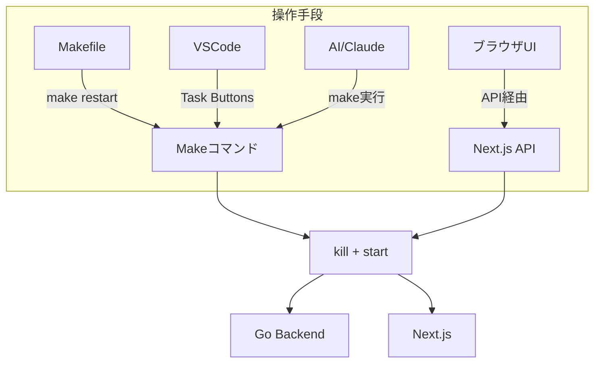
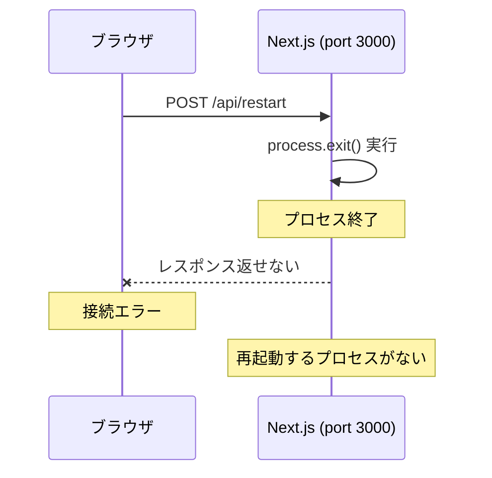
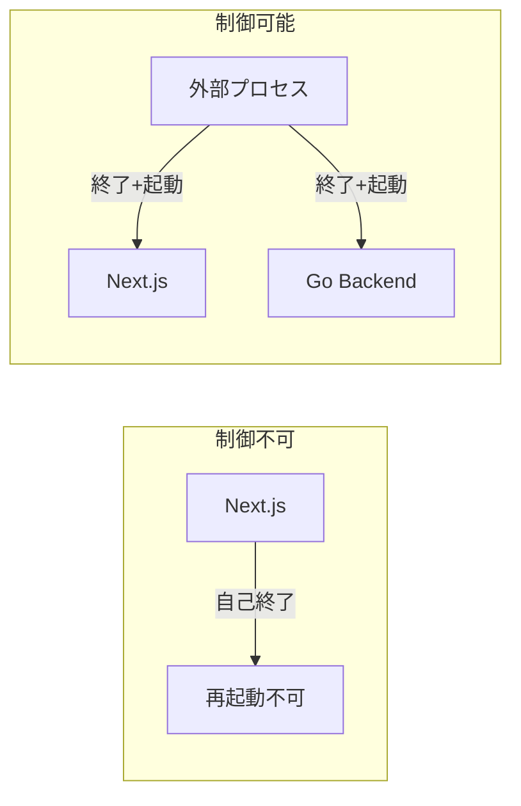
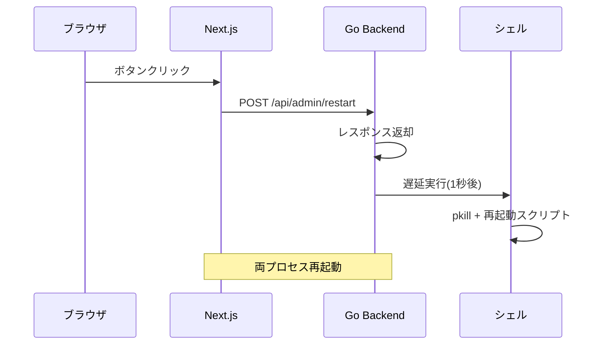
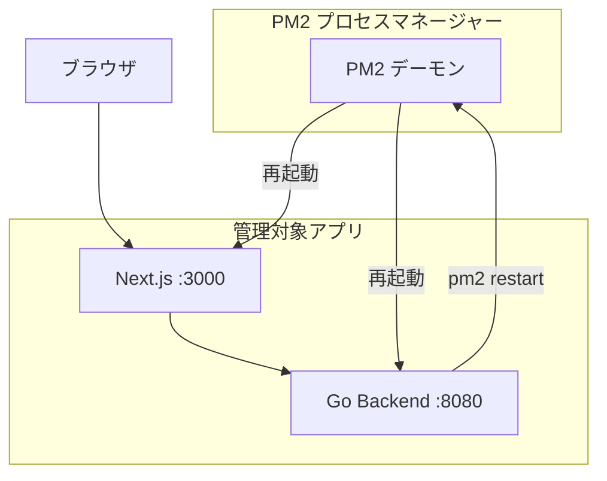
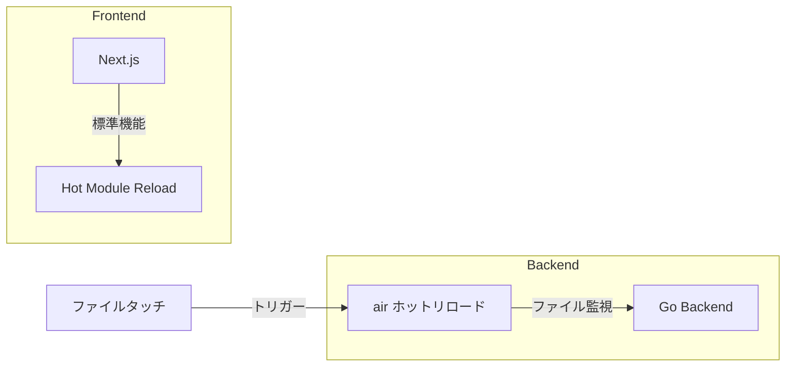
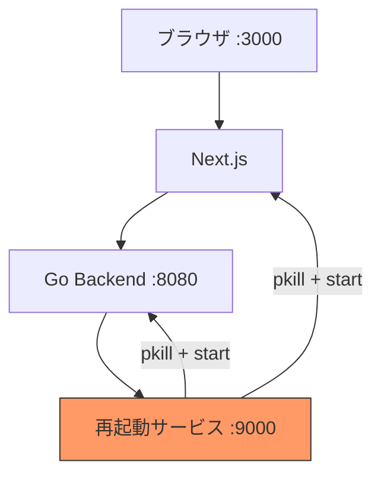
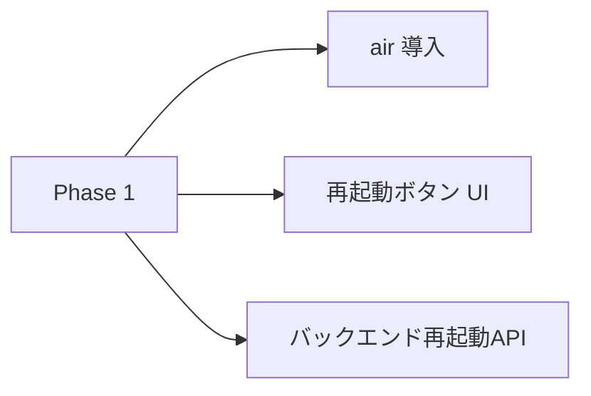

# 検討結果: サーバー再起動機能

## 検討経緯

| 日付 | 内容 |
|------|------|
| 2026-01-25 | 初回相談: localhost:3000のUIからGo/Next.js両サーバーを再起動したい |
| 2026-01-26 | 方針決定: Fire-and-Forget + ヘルスチェック方式 |
| 2026-01-26 | 追加決定: Makefile + VSCode Task Buttons + API経由での再起動 |

---

## 決定した方針

### 基本思想

- **完全なkill + 起動** - プロセスを確実に終了してから新規起動
- **Fire-and-Forget** - レスポンス不要、繋がったら成功
- **複数の操作手段** - Makefile / VSCode / AI / ブラウザUI
- **シンプルさ優先** - PM2などの外部ツール不要

### 操作手段



| 操作手段 | 使い方 | 用途 |
|----------|--------|------|
| Makefile | `make restart-backend` | ターミナルから直接 |
| VSCode Task Buttons | サイドバーのボタン | エディタ内から |
| AI (Claude Code) | Bashで `make restart` | AIによる自動操作 |
| ブラウザUI | 再起動ボタン | 外部ブラウザから |

---

## 実装内容

### 1. Makefile

```makefile
# プロジェクトルート
PROJECT_ROOT := $(shell pwd)

# 起動
.PHONY: backend frontend dev

backend:
	cd $(PROJECT_ROOT)/backend && go run ./cmd/server

frontend:
	cd $(PROJECT_ROOT)/frontend && npm start

dev:
	@echo "両サーバーを起動..."
	@make -j2 backend frontend

# 停止
.PHONY: stop-backend stop-frontend stop

stop-backend:
	-pkill -f "go run.*cmd/server" || true
	-pkill -f "backend/server" || true

stop-frontend:
	-pkill -f "next dev" || true
	-pkill -f "npm.*start" || true

stop: stop-backend stop-frontend

# 再起動（kill + start）
.PHONY: restart-backend restart-frontend restart

restart-backend: stop-backend
	@sleep 1
	nohup sh -c 'cd $(PROJECT_ROOT)/backend && go run ./cmd/server' > /tmp/backend.log 2>&1 &

restart-frontend: stop-frontend
	@sleep 1
	nohup sh -c 'cd $(PROJECT_ROOT)/frontend && npm start' > /tmp/frontend.log 2>&1 &

restart:
	@make -j2 restart-backend restart-frontend

# ビルド
.PHONY: build

build:
	cd $(PROJECT_ROOT)/backend && go build -o server ./cmd/server
	cd $(PROJECT_ROOT)/frontend && npm run build

# ヘルスチェック
.PHONY: health

health:
	@curl -s http://localhost:8080/api/health || echo "Backend: NG"
	@curl -s http://localhost:3000 > /dev/null && echo "Frontend: OK" || echo "Frontend: NG"
```

### 2. VSCode Task Buttons

```json
// .vscode/tasks.json
{
  "version": "2.0.0",
  "tasks": [
    {
      "label": "Backend起動",
      "type": "shell",
      "command": "make backend",
      "group": "build",
      "presentation": { "reveal": "always", "panel": "new" }
    },
    {
      "label": "Frontend起動",
      "type": "shell",
      "command": "make frontend",
      "group": "build",
      "presentation": { "reveal": "always", "panel": "new" }
    },
    {
      "label": "Backend再起動",
      "type": "shell",
      "command": "make restart-backend",
      "group": "build"
    },
    {
      "label": "Frontend再起動",
      "type": "shell",
      "command": "make restart-frontend",
      "group": "build"
    },
    {
      "label": "全停止",
      "type": "shell",
      "command": "make stop",
      "group": "build"
    }
  ]
}
```

```json
// .vscode/settings.json
{
  "VssTaskButtons.tasks": [
    { "label": "$(play) Backend", "task": "Backend起動" },
    { "label": "$(play) Frontend", "task": "Frontend起動" },
    { "label": "$(sync) Restart BE", "task": "Backend再起動" },
    { "label": "$(sync) Restart FE", "task": "Frontend再起動" },
    { "label": "$(stop) Stop All", "task": "全停止" }
  ]
}
```

### 3. Go バックエンド（API）

```go
// GET /api/health
func (h *HealthHandler) Handle(c *gin.Context) {
    c.JSON(200, gin.H{"status": "ok"})
}
```

### 4. Next.js API Routes

```typescript
import { spawn } from 'child_process';

// POST /api/restart/backend
export async function POST() {
  spawn('make', ['restart-backend'], {
    detached: true,
    stdio: 'ignore'
  }).unref();
  return new Response(null, { status: 202 });
}

// POST /api/restart/frontend
export async function POST() {
  spawn('make', ['restart-frontend'], {
    detached: true,
    stdio: 'ignore'
  }).unref();
  return new Response(null, { status: 202 });
}
```

### 5. フロントエンド UI

```typescript
async function restartServers() {
  setStatus("再起動中...");

  // Fire and forget
  fetch("/api/restart/backend", { method: "POST" }).catch(() => {});
  fetch("/api/restart/frontend", { method: "POST" }).catch(() => {});

  // ポーリングで復旧確認
  await waitForHealth();
  setStatus("再起動完了");
}

async function waitForHealth() {
  for (let i = 0; i < 30; i++) {
    try {
      const res = await fetch("/api/health");
      if (res.ok) return;
    } catch {}
    await new Promise((r) => setTimeout(r, 1000));
  }
  throw new Error("再起動タイムアウト");
}
```

---

## 必要な実装タスク

### Phase 1: 基盤（Makefile + VSCode）

- [ ] `Makefile` 作成
- [ ] `.vscode/tasks.json` 作成
- [ ] `.vscode/settings.json` 作成（Task Buttons用）
- [ ] VSCode拡張機能「Task Buttons」インストール案内

### Phase 2: API経由の再起動

- [ ] Go: `/api/health` エンドポイント追加
- [ ] Next.js: `/api/restart/backend` Route Handler
- [ ] Next.js: `/api/restart/frontend` Route Handler
- [ ] UI: 再起動ボタン + ステータス表示
- [ ] UI: ヘルスチェックポーリング

---

## 背景・目的

開発中のコード変更後、設定変更後、障害対応時に、ターミナルでの手動再起動ではなく、ブラウザのUIから両サーバーを再起動できるようにしたい。

## 対象ユーザー

- 開発者（自分自身）
- ローカル開発環境での使用

## 解決する課題

| 現状 | 課題 |
|------|------|
| ターミナルで手動再起動 | 画面切り替えが必要、複数ターミナルの管理が煩雑 |
| Ctrl+C → 再起動コマンド | 2サーバー分の操作が必要 |

## 技術的分析

### フロントエンド（Next.js）が自分自身を再起動できない理由



**問題点:**
1. Next.js が `process.exit()` を呼ぶと、自身のプロセスが終了
2. 終了したプロセスは自分で再起動できない（「死んだ人間が自分を蘇生できない」のと同じ）
3. リクエストを処理中のプロセスが終了するため、レスポンスも返せない

### 解決策: 外部からの制御が必要



## 選択肢の検討

### 案A: Goバックエンドからシェルコマンド実行



**概要:** Goバックエンドに管理用エンドポイントを追加し、シェルコマンドで両プロセスを再起動

**実装イメージ:**
```go
// backend/internal/handler/admin_handler.go
func (h *AdminHandler) HandleRestart(c *gin.Context) {
    c.JSON(200, gin.H{"status": "restarting"})

    // 1秒後に再起動（レスポンス返却後）
    go func() {
        time.Sleep(1 * time.Second)
        exec.Command("bash", "-c", "/path/to/restart.sh").Start()
    }()
}
```

```bash
#!/bin/bash
# restart.sh
pkill -f "go run.*server"
pkill -f "next dev"
sleep 1
cd /path/to/backend && go run ./cmd/server &
cd /path/to/frontend && npm run dev &
```

**メリット:**
- 追加ツール不要
- シンプルな実装
- 既存構成を大きく変えない

**デメリット:**
- プロセス検索が不安定になる可能性
- 再起動スクリプトの管理が必要
- Goバックエンドが自分を終了後、誰が再起動するか問題

**工数感:** 小

---

### 案B: プロセスマネージャー（PM2）導入



**概要:** PM2で両サーバーを管理し、Goバックエンドから `pm2 restart` コマンドを実行

**設定ファイル:**
```javascript
// ecosystem.config.js
module.exports = {
  apps: [
    {
      name: 'ghostrunner-backend',
      cwd: './backend',
      script: 'go',
      args: 'run ./cmd/server',
      interpreter: 'none'
    },
    {
      name: 'ghostrunner-frontend',
      cwd: './frontend',
      script: 'npm',
      args: 'run dev',
      interpreter: 'none'
    }
  ]
};
```

**メリット:**
- 安定したプロセス管理
- ログ管理、モニタリング機能付き
- 再起動が確実

**デメリット:**
- PM2のインストールが必要（`npm install -g pm2`）
- 起動方法の変更（`pm2 start ecosystem.config.js`）
- 学習コスト

**工数感:** 中

---

### 案C: 開発用ホットリロードツール活用



**概要:**
- バックエンド: `air`（Goホットリロードツール）を導入
- フロントエンド: Next.js標準のHMRを活用
- 「再起動」ではなく「ファイル変更検知による自動リロード」

**メリット:**
- 開発体験が大幅向上
- コード変更時に自動再起動
- 軽量

**デメリット:**
- 「明示的な再起動」とは異なる
- 設定変更や障害対応には不向き
- ホットリロードで解決しない問題もある

**工数感:** 小

---

### 案D: 専用の再起動サービス（別プロセス）



**概要:** 軽量な再起動専用サービス（port 9000など）を常駐させ、そこから両サーバーを制御

**メリット:**
- 確実な再起動
- 再起動サービス自体は常に生存
- シンプルな責務分離

**デメリット:**
- 追加プロセスの管理が必要
- 開発環境が複雑化
- オーバーエンジニアリング感

**工数感:** 中

---

## 比較表

| 観点 | 案A: シェル | 案B: PM2 | 案C: ホットリロード | 案D: 専用サービス |
|------|------------|----------|-------------------|------------------|
| 導入の手軽さ | ◎ | ○ | ◎ | △ |
| 再起動の確実性 | △ | ◎ | - | ◎ |
| 追加ツール | 不要 | PM2 | air | 自作 |
| 保守性 | ○ | ◎ | ◎ | △ |
| 開発体験 | ○ | ○ | ◎ | ○ |
| 工数 | 小 | 中 | 小 | 中 |

## セキュリティ考慮

### リスク

1. **意図しない本番デプロイ**: 再起動エンドポイントが本番環境で有効になると危険
2. **認証なしアクセス**: ローカルでも他のアプリからアクセス可能

### 対策

```go
// 環境変数で開発環境のみ有効化
if os.Getenv("ENABLE_ADMIN_RESTART") != "true" {
    c.JSON(403, gin.H{"error": "disabled in this environment"})
    return
}

// または localhost からのアクセスのみ許可
if !strings.HasPrefix(c.ClientIP(), "127.0.0.1") {
    c.JSON(403, gin.H{"error": "localhost only"})
    return
}
```

## MVP提案

**推奨案: 案C（ホットリロード）+ 案A（明示的再起動）の組み合わせ**

### 理由

1. **日常の開発**: ホットリロード（案C）で十分対応可能
2. **明示的再起動が必要な場面**: シンプルなシェル実行（案A）で対応
3. PM2は便利だが、このプロジェクトの規模では過剰

### MVP範囲（Phase 1）



1. **air 導入**（バックエンド用ホットリロード）
   - `.air.toml` 設定ファイル作成
   - `go install github.com/air-verse/air@latest`

2. **再起動ボタン UI**
   - フロントエンドに「Restart Backend」ボタン追加
   - localhost:3000/settings などに配置

3. **バックエンド再起動 API**
   - `POST /api/admin/restart-backend`
   - 開発環境でのみ有効
   - air を使用している場合、`.air.toml` のタッチでトリガー可能

### 次回以降（Phase 2）

- フロントエンドの再起動対応（PM2 or 専用スクリプト）
- 再起動ステータスの表示
- 再起動履歴のログ

## 未解決の課題

1. **Goバックエンドの自己再起動**: バックエンドが自分自身を終了した後、誰が再起動するか
   - 解決策: air 使用時は `.air.toml` をタッチすることで再ビルド・再起動
   - 解決策: 再起動スクリプトを `nohup` で実行

2. **フロントエンドの再起動**: Next.js は自己再起動不可
   - 解決策: 外部プロセス（PM2 or 専用スクリプト）が必要

## 次のステップ

1. **方針決定**: 案C+A の組み合わせでよいか確認
2. **air 導入の検討**: まずホットリロードを試してみる
3. **明示的再起動が本当に必要か再評価**: ホットリロードで十分かもしれない

---

## 補足: ユーザーの認識について

> フロントは無理だと思う、バックはできる

**正確には:**
- フロントエンド（Next.js）が「自分自身を」再起動するのは無理 → 正しい
- バックエンド（Go）が「自分自身を」再起動するのも実は難しい
- どちらも「外部から」再起動する仕組みが必要

ただし、**バックエンドがフロントエンドを再起動する**（外部から制御する）のは可能です。
