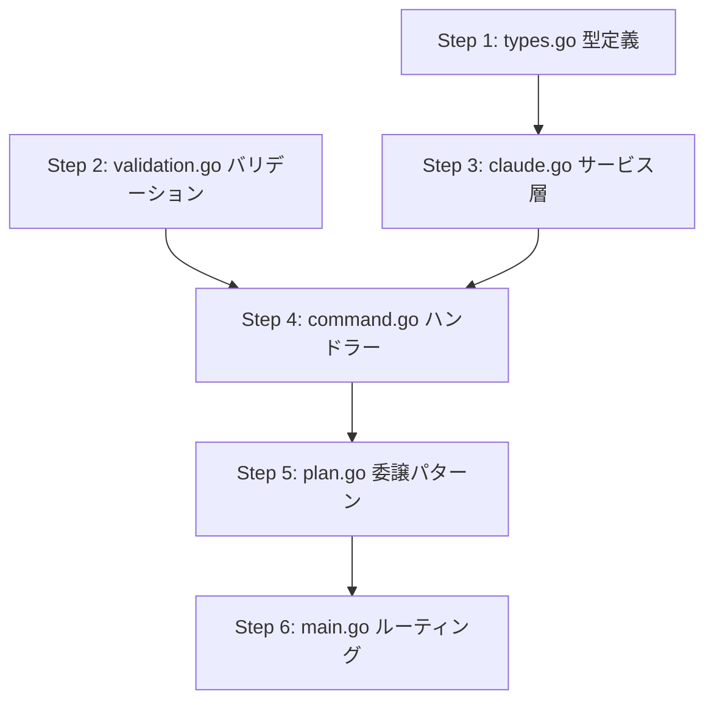

# 汎用コマンドAPI 実装計画

## 概要

現在の `/plan` 専用APIを汎用化し、`/fullstack`, `/go`, `/nextjs` などの複数コマンドを実行可能にする。

**設計方針:** 汎用コマンドAPI（`/api/command`）

## 1. 仕様サマリー

- 新規 `/api/command` エンドポイントで任意のコマンドを実行
- リクエストに `command` パラメータを追加（plan, fullstack, go, nextjs）
- 既存 `/api/plan` は維持（内部で汎用機能を呼び出す）
- 許可コマンドのホワイトリストでセキュリティ確保

## 2. 変更ファイル一覧

| ファイル | 変更内容 | 影響度 |
|---------|---------|-------|
| `internal/handler/types.go` | 新規 - 共通型定義、許可コマンドリスト | 低 |
| `internal/handler/validation.go` | 新規 - 共通バリデーション関数 | 低 |
| `internal/service/claude.go` | `ExecuteCommand` メソッドを追加 | 中 |
| `internal/handler/command.go` | 新規 - 汎用コマンドハンドラー | 中 |
| `internal/handler/plan.go` | 汎用ハンドラーへの委譲に変更、型定義を削除 | 低 |
| `cmd/server/main.go` | `/api/command` ルート追加 | 低 |

## 3. 実装ステップ

### Step 1: 共通型定義の追加

**対象:** `internal/handler/types.go` (新規)

```go
package handler

import "ghostrunner/internal/service"

// AllowedCommands は実行を許可するコマンドのホワイトリスト
var AllowedCommands = map[string]bool{
    "plan":      true,
    "fullstack": true,
    "go":        true,
    "nextjs":    true,
}

// CommandRequest は汎用コマンド実行のリクエスト
type CommandRequest struct {
    Project string `json:"project"` // プロジェクトのパス
    Command string `json:"command"` // 実行するコマンド（plan, fullstack, go, nextjs）
    Args    string `json:"args"`    // コマンドの引数
}

// ContinueRequest はセッション継続のリクエスト
type ContinueRequest struct {
    Project   string `json:"project"`    // プロジェクトのパス
    SessionID string `json:"session_id"` // セッションID
    Answer    string `json:"answer"`     // ユーザーの回答
}

// CommandResponse は汎用コマンド実行のレスポンス
type CommandResponse struct {
    Success   bool               `json:"success"`              // 成功フラグ
    SessionID string             `json:"session_id,omitempty"` // セッションID
    Output    string             `json:"output,omitempty"`     // 実行結果
    Questions []service.Question `json:"questions,omitempty"`  // 質問がある場合
    Completed bool               `json:"completed"`            // 完了したかどうか
    CostUSD   float64            `json:"cost_usd,omitempty"`   // コスト
    Error     string             `json:"error,omitempty"`      // エラーメッセージ
}

// PlanRequest は/api/plan用のリクエスト（後方互換）
type PlanRequest struct {
    Project string `json:"project"` // プロジェクトのパス
    Args    string `json:"args"`    // /planコマンドの引数
}

// PlanResponse は後方互換のため CommandResponse のエイリアス
type PlanResponse = CommandResponse
```

### Step 2: 共通バリデーション関数の追加

**対象:** `internal/handler/validation.go` (新規)

```go
package handler

import (
    "fmt"
    "os"
    "path/filepath"
)

// ValidationError はバリデーションエラーを表します
type ValidationError struct {
    Message string
}

func (e *ValidationError) Error() string {
    return e.Message
}

// validateCommand はコマンドが許可リストに含まれるか検証します
func validateCommand(command string) error {
    if command == "" {
        return &ValidationError{Message: "commandは必須です"}
    }
    if !AllowedCommands[command] {
        return &ValidationError{Message: fmt.Sprintf("コマンド '%s' は許可されていません", command)}
    }
    return nil
}

// validateProjectPath はプロジェクトパスをバリデーションします
func validateProjectPath(path string) error {
    if path == "" {
        return &ValidationError{Message: "projectは必須です"}
    }

    cleanPath := filepath.Clean(path)

    if !filepath.IsAbs(cleanPath) {
        return &ValidationError{Message: "projectは絶対パスである必要があります"}
    }

    info, err := os.Stat(cleanPath)
    if err != nil {
        if os.IsNotExist(err) {
            return &ValidationError{Message: "指定されたプロジェクトパスが存在しません"}
        }
        return &ValidationError{Message: "プロジェクトパスの確認に失敗しました"}
    }

    if !info.IsDir() {
        return &ValidationError{Message: "projectはディレクトリである必要があります"}
    }

    return nil
}

// validateArgs は引数をバリデーションします
func validateArgs(args string) error {
    if args == "" {
        return &ValidationError{Message: "argsは必須です"}
    }
    return nil
}

// validateSessionID はセッションIDをバリデーションします
func validateSessionID(sessionID string) error {
    if sessionID == "" {
        return &ValidationError{Message: "session_idは必須です"}
    }
    return nil
}

// validateAnswer は回答をバリデーションします
func validateAnswer(answer string) error {
    if answer == "" {
        return &ValidationError{Message: "answerは必須です"}
    }
    return nil
}
```

### Step 3: サービス層に汎用メソッド追加

**対象:** `internal/service/claude.go`

**インターフェース拡張（既存メソッドも維持）:**
```go
type ClaudeService interface {
    // 既存（後方互換のため維持）
    ExecutePlan(ctx context.Context, project, args string) (*PlanResult, error)
    ExecutePlanStream(ctx context.Context, project, args string, eventCh chan<- StreamEvent) error
    ContinueSession(ctx context.Context, project, sessionID, answer string) (*PlanResult, error)
    ContinueSessionStream(ctx context.Context, project, sessionID, answer string, eventCh chan<- StreamEvent) error

    // 新規
    ExecuteCommand(ctx context.Context, project, command, args string) (*PlanResult, error)
    ExecuteCommandStream(ctx context.Context, project, command, args string, eventCh chan<- StreamEvent) error
}
```

**実装詳細:**
- `ExecuteCommand`: 内部で `executeCommand` を呼び出し、`/command args` 形式でプロンプト構築
- `ExecutePlan`: 内部で `ExecuteCommand(ctx, project, "plan", args)` を呼び出すラッパーに変更
- 同様に `ExecutePlanStream` も `ExecuteCommandStream` を呼び出す

### Step 4: 汎用コマンドハンドラー作成

**対象:** `internal/handler/command.go` (新規)

```go
package handler

import (
    "encoding/json"
    "io"
    "log"
    "net/http"

    "ghostrunner/internal/service"

    "github.com/gin-gonic/gin"
)

// CommandHandler は汎用コマンド実行のHTTPハンドラを提供します
type CommandHandler struct {
    claudeService service.ClaudeService
}

// NewCommandHandler は新しいCommandHandlerを生成します
func NewCommandHandler(claudeService service.ClaudeService) *CommandHandler {
    return &CommandHandler{claudeService: claudeService}
}

// Handle は/api/commandリクエストを処理します（同期）
func (h *CommandHandler) Handle(c *gin.Context) {
    // バリデーション -> claudeService.ExecuteCommand 呼び出し
}

// HandleStream は/api/command/streamリクエストを処理します（SSE）
func (h *CommandHandler) HandleStream(c *gin.Context) {
    // バリデーション -> claudeService.ExecuteCommandStream 呼び出し
}

// HandleContinue は/api/command/continueリクエストを処理します（同期）
func (h *CommandHandler) HandleContinue(c *gin.Context) {
    // バリデーション -> claudeService.ContinueSession 呼び出し
}

// HandleContinueStream は/api/command/continue/streamリクエストを処理します（SSE）
func (h *CommandHandler) HandleContinueStream(c *gin.Context) {
    // バリデーション -> claudeService.ContinueSessionStream 呼び出し
}
```

### Step 5: 既存PlanHandlerの修正

**対象:** `internal/handler/plan.go`

**変更内容:**
- 型定義（`PlanRequest`, `ContinueRequest`, `PlanResponse`, `ValidationError`）を削除（`types.go` に移動）
- `validateProjectPath` を削除（`validation.go` に移動）
- 内部で `CommandHandler` を使用するように変更

```go
type PlanHandler struct {
    commandHandler *CommandHandler
}

func NewPlanHandler(commandHandler *CommandHandler) *PlanHandler {
    return &PlanHandler{commandHandler: commandHandler}
}

func (h *PlanHandler) Handle(c *gin.Context) {
    var req PlanRequest
    if err := c.ShouldBindJSON(&req); err != nil {
        // エラー処理
        return
    }

    // PlanRequest を CommandRequest に変換
    cmdReq := CommandRequest{
        Project: req.Project,
        Command: "plan",
        Args:    req.Args,
    }

    // context に設定して CommandHandler に委譲
    c.Set("commandRequest", cmdReq)
    h.commandHandler.Handle(c)
}
```

### Step 6: ルーティング設定の更新

**対象:** `cmd/server/main.go`

```go
func main() {
    log.Println("[Server] Starting Ghostrunner API server...")

    // 依存性の組み立て
    claudeService := service.NewClaudeService()
    commandHandler := handler.NewCommandHandler(claudeService)
    planHandler := handler.NewPlanHandler(commandHandler)

    r := gin.Default()

    api := r.Group("/api")
    {
        // 既存（後方互換）
        api.POST("/plan", planHandler.Handle)
        api.POST("/plan/stream", planHandler.HandleStream)
        api.POST("/plan/continue", planHandler.HandleContinue)
        api.POST("/plan/continue/stream", planHandler.HandleContinueStream)

        // 新規（汎用コマンド）
        api.POST("/command", commandHandler.Handle)
        api.POST("/command/stream", commandHandler.HandleStream)
        api.POST("/command/continue", commandHandler.HandleContinue)
        api.POST("/command/continue/stream", commandHandler.HandleContinueStream)
    }

    // 静的ファイル配信
    r.StaticFile("/", "./web/index.html")
    r.Static("/web", "./web")

    log.Println("[Server] Listening on 0.0.0.0:8080")
    if err := r.Run("0.0.0.0:8080"); err != nil {
        log.Fatalf("[Server] Failed to start server: %v", err)
    }
}
```

## 4. エンドポイント設計

### 新規: POST /api/command

```json
Request:
{
  "project": "/path/to/project",
  "command": "fullstack",
  "args": "仕様の内容"
}

Response (成功):
{
  "success": true,
  "session_id": "session-xxx",
  "output": "...",
  "questions": [...],
  "completed": true/false,
  "cost_usd": 0.01
}

Response (エラー):
{
  "success": false,
  "error": "コマンド 'invalid' は許可されていません"
}
```

### 新規: POST /api/command/stream

リクエストは `/api/command` と同じ。レスポンスはSSE形式。

### 新規: POST /api/command/continue

```json
Request:
{
  "project": "/path/to/project",
  "session_id": "xxx",
  "answer": "yes"
}
```

### 新規: POST /api/command/continue/stream

リクエストは `/api/command/continue` と同じ。レスポンスはSSE形式。

### 既存維持: /api/plan 系（4エンドポイント）

リクエスト・レスポンス形式は変更なし。内部で `command="plan"` として汎用処理を呼び出す。

## 5. 懸念点と対応方針

| 懸念点 | 対応方針 |
|-------|---------|
| セキュリティ | ホワイトリストで許可コマンドを制限。不正なコマンドは400エラー |
| 後方互換 | 既存 `/api/plan` は完全に維持。リクエスト・レスポンス形式も変更なし |
| コード重複 | バリデーション関数を `validation.go` に集約して共有 |
| ファイルサイズ | `claude.go` は約30行追加で許容範囲（現在599行 → 約630行） |
| フロントエンド | `web/index.html` は今回変更せず。後続タスクでコマンド選択UI追加 |
| エラーメッセージ | 日本語に統一（既存パターンに合わせる） |

## 6. 設計判断

| 判断 | 選択した方法 | 理由 |
|-----|------------|------|
| 型定義の配置 | handler/types.go | リクエスト/レスポンスはhandler層の責務 |
| バリデーションの配置 | handler/validation.go | Clean Architectureに従いhandler層で検証 |
| 後方互換 | 既存APIを維持 + 新規API追加 | フロントエンドへの影響を最小化 |
| PlanHandler | CommandHandlerへの委譲パターン | コード重複を避ける |
| インターフェース | 既存メソッドも維持 | 既存テストへの影響を最小化 |

## 7. 実装順序の依存関係



## 8. 確認事項

- [x] 許可コマンドリスト: `plan`, `fullstack`, `go`, `nextjs`
- [x] 既存の `/api/plan` エンドポイントは維持
- [x] フロントエンドのコマンド選択UIは後続タスク
- [x] バリデーション関数は handler 層に配置
- [x] 型定義は handler/types.go に集約
- [x] エラーメッセージは日本語で統一
