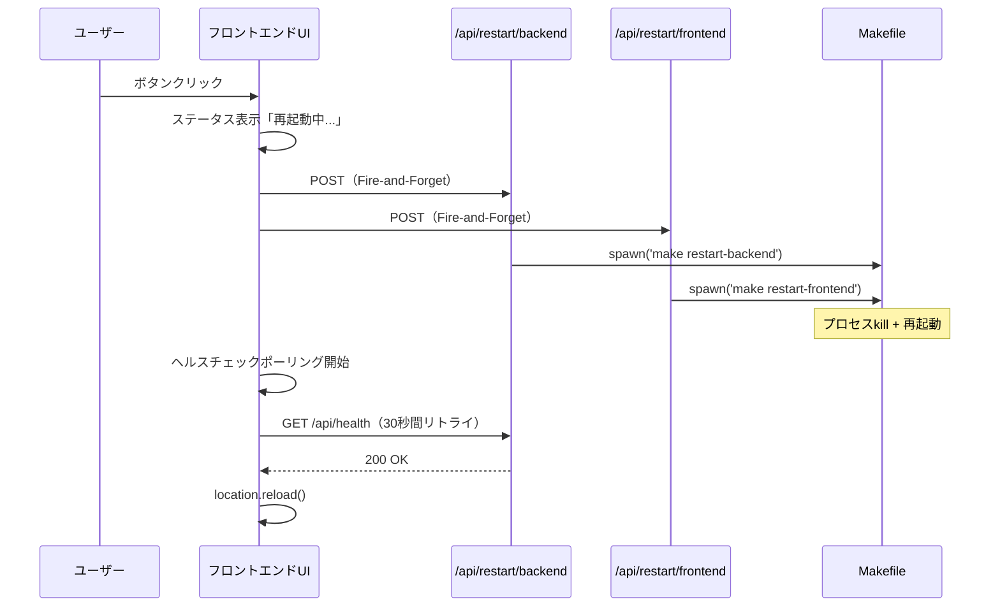

# サーバー再起動機能 実装計画

**作成日**: 2026-01-26
**仕様書**: `開発/検討中/2026-01-25_サーバー再起動機能.md`

---

## 概要

ローカル開発環境で、ブラウザUIやMakefile/VSCodeからGo/Next.jsサーバーを再起動できる機能を追加する。Fire-and-Forget方式でリクエストを送信し、ヘルスチェックで復旧を確認する。

**実装範囲:**
- Makefile（再起動コマンド）
- VSCode Task Buttons（エディタ内ボタン）
- Go: `/api/health` エンドポイント
- Next.js: `/api/restart/*` Route Handler
- フロントエンドUI: 再起動ボタン

---

## バックエンド計画（Go）

### 1. 懸念点

#### 仕様の曖昧さ

| 懸念点 | 詳細 | 解決策 |
|-------|------|-------|
| MVP範囲の確認 | 仕様書のPhase 1には「air導入」「再起動ボタンUI」「バックエンド再起動API」が記載されているが、Goバックエンドで必要なのは `/api/health` のみか？ | **確認結果**: Goバックエンド側の実装は `/api/health` エンドポイントのみ。再起動はNext.js API経由でMakefileを呼び出す方式が決定済み。 |

#### 既存コードとの整合性

| 懸念点 | 対応方針 |
|-------|---------|
| ヘルスチェックのレスポンス形式 | 仕様書では `{"status": "ok"}` - 既存APIと異なり `success` フィールドがないが、これはシンプルさ優先で問題なし |

### 2. 実装内容

#### API設計

**新規エンドポイント:**

```
GET /api/health
```

**レスポンス:**
```json
{
  "status": "ok"
}
```

**特徴:**
- 認証不要（ローカル開発環境用）
- 依存性なし（DB接続確認などは含まない）
- シンプルなJSON応答のみ

#### データ構造

新規追加する型定義はなし（`gin.H` を使用）

#### 実装ステップ

**Step 1: ヘルスチェックハンドラー作成**
- 対象ファイル: `backend/internal/handler/health.go`（新規）
- 変更内容:
  - `HealthHandler` 構造体の定義
  - `Handle` メソッド: `{"status": "ok"}` を返却
- 注意点: 依存性なし、シンプルな実装

**Step 2: ルーティング追加**
- 対象ファイル: `backend/cmd/server/main.go`
- 変更内容: `api.GET("/health", healthHandler.Handle)` 追加
- 注意点: 既存パターンに従う

**Step 3: ドキュメント更新**
- 対象ファイル: `backend/internal/handler/doc.go`
- 変更内容: HealthHandler の説明追加

#### 変更ファイル一覧

| ファイル | 変更内容 | 影響度 |
|---------|---------|-------|
| `backend/internal/handler/health.go` | 新規作成 - ヘルスチェックハンドラー | 低 |
| `backend/cmd/server/main.go` | ルーティング追加（1行） | 低 |
| `backend/internal/handler/doc.go` | HealthHandler のドキュメント追加 | 低 |

### 3. 次回実装（MVP外）

以下はMVP範囲外とし、次回以降に実装：
- 詳細なヘルスチェック（DB接続確認、依存サービス確認など）: 現時点で外部依存がないため不要
- メトリクス出力: 開発環境用のため不要

---

## フロントエンド計画（Next.js）

### 1. 懸念点

#### 仕様の曖昧さ

| 懸念点 | 詳細 | 解決策 |
|-------|------|-------|
| Makefile の有無 | 仕様書では Makefile が必要だが、git status に見当たらない | **確認結果**: Makefile は本タスクで作成する（フルスタック実装の一部） |
| Backend health エンドポイント | `/api/health` がバックエンドに存在しない | **確認結果**: 本タスクでバックエンド側も同時に実装する |
| ボタンの配置 | ヘッダー右上に小さめのボタン（灰色系、目立たない）で問題ないか？ | **デフォルト案**: ページ右上に配置、開発環境のみ表示 |

#### 技術的課題

| 懸念点 | 対応方針 |
|-------|---------|
| Frontend 再起動時の UX | APIリクエスト後にフロントエンドが終了するため、ユーザーには「接続断」に見える。ボタンクリック時に「再起動中」メッセージを表示し、setTimeout で location.reload を実行 |
| 本番環境での無効化 | `NODE_ENV !== 'development'` の場合は 403 を返す |
| ポーリングタイムアウト | 30秒でタイムアウト、手動リロードを促すメッセージ表示 |

### 2. 実装内容

#### UI設計

**コンポーネント配置:**
- `frontend/src/app/page.tsx` のヘッダー右上に配置
- ボタンラベル: "Restart Servers"
- スタイル: 灰色系、目立たないデザイン
- 開発環境のみ表示（`process.env.NODE_ENV === 'development'`）

**動作フロー:**


#### データフロー

**Server Actions / Route Handlers:**

```typescript
// POST /api/restart/backend
import { spawn } from 'child_process';
import path from 'path';

export async function POST() {
  if (process.env.NODE_ENV !== 'development') {
    return new Response(null, { status: 403 });
  }

  // プロジェクトルートを明示的に指定
  const projectRoot = path.resolve(process.cwd(), '..');

  spawn('make', ['restart-backend'], {
    cwd: projectRoot,
    detached: true,
    stdio: 'ignore'
  }).unref();
  return new Response(null, { status: 202 });
}

// POST /api/restart/frontend
import { spawn } from 'child_process';
import path from 'path';

export async function POST() {
  if (process.env.NODE_ENV !== 'development') {
    return new Response(null, { status: 403 });
  }

  // プロジェクトルートを明示的に指定
  const projectRoot = path.resolve(process.cwd(), '..');

  spawn('make', ['restart-frontend'], {
    cwd: projectRoot,
    detached: true,
    stdio: 'ignore'
  }).unref();
  return new Response(null, { status: 202 });
}
```

**UIロジック:**

```typescript
async function restartServers() {
  setStatus("再起動中...");

  // Fire and forget
  fetch("/api/restart/backend", { method: "POST" }).catch(() => {});
  fetch("/api/restart/frontend", { method: "POST" }).catch(() => {});

  // ポーリングで復旧確認
  await waitForHealth();
  location.reload();
}

async function waitForHealth() {
  const BACKEND_HEALTH_URL = "http://localhost:8080/api/health";

  for (let i = 0; i < 30; i++) {
    try {
      const res = await fetch(BACKEND_HEALTH_URL);
      if (res.ok) return;
    } catch {}
    await new Promise((r) => setTimeout(r, 1000));
  }
  throw new Error("再起動タイムアウト");
}
```

#### 実装ステップ

**Step 0: 型定義追加**
- 対象: `frontend/src/types/index.ts`
- 内容: `RestartStatus` 型を追加
- 注意: 既存の型定義との整合性を確認

**Step 1: Route Handler 作成（Backend再起動）**
- 対象: `frontend/src/app/api/restart/backend/route.ts`（新規）
- 内容: `spawn('make', ['restart-backend'])` を detached で実行、202 を即座に返却
- 注意:
  - `child_process` の `spawn` を使用、`unref()` で親プロセスから切り離す
  - **重要**: `cwd: path.resolve(process.cwd(), '..')` でプロジェクトルートを明示的に指定
  - 開発環境チェック: `NODE_ENV !== 'development'` の場合は 403 を返す

**Step 2: Route Handler 作成（Frontend再起動）**
- 対象: `frontend/src/app/api/restart/frontend/route.ts`（新規）
- 内容: Step 1 と同様、`restart-frontend` を実行
- 注意:
  - 自分自身を再起動するため、レスポンス返却直後にプロセス終了する
  - **重要**: `cwd: path.resolve(process.cwd(), '..')` でプロジェクトルートを明示的に指定

**Step 3A: 定数追加**
- 対象: `frontend/src/lib/constants.ts`
- 内容: `export const BACKEND_HEALTH_URL = "http://localhost:8080/api/health";` を追加
- 注意: 既存の定数ファイルに集約することで一元管理

**Step 3B: カスタムフック作成（選択肢A 推奨の場合）**
- 対象: `frontend/src/hooks/useServerRestart.ts`（新規）
- 内容: 再起動ロジックとヘルスチェックポーリングを実装
- 注意:
  - `BACKEND_HEALTH_URL` を `constants.ts` からインポート
  - タイムアウト時（30秒）のエラーハンドリングを実装
  - 既存フックのパターンに従う
  - フロントエンド再起動時はフロントエンド自体が終了するため、ヘルスチェック失敗時は手動リロードを促すメッセージを表示

**Step 3C: コンポーネント作成（選択肢A 推奨の場合）**
- 対象: `frontend/src/components/RestartButton.tsx`（新規）
- 内容: 再起動ボタンUIとステータス表示を実装
- 注意:
  - 既存の CommandForm コンポーネントのスタイルパターンに従う
  - 開発環境のみ表示: `process.env.NODE_ENV === 'development'`

**Step 3D: UI にボタン配置（選択肢A 推奨の場合）**
- 対象: `frontend/src/app/page.tsx`
- 内容: ヘッダー右上に `<RestartButton />` を配置
- 注意: 既存レイアウトを崩さないように配置

**Step 3（選択肢B MVP優先の場合）: UI に直接実装**
- 対象: `frontend/src/app/page.tsx`
- 内容: ヘッダー右上に「Restart Servers」ボタンを配置、ロジックも直接実装
- 動作:
  1. ボタンクリック時に両APIを Fire-and-Forget で呼び出し
  2. ステータス表示（「再起動中...」）
  3. ヘルスチェックポーリング（30秒間、1秒ごと）- `BACKEND_HEALTH_URL` は `constants.ts` からインポート
  4. 成功時: location.reload()
  5. タイムアウト時: 「手動でリロードしてください」メッセージ表示
- 注意:
  - 開発環境のみで使用する機能のため、目立たない配置にする
  - イベントハンドラ名は既存パターンに従い `handleRestartServers` とする
  - フロントエンド再起動時はフロントエンド自体が終了するため、ヘルスチェック失敗時は手動リロードを促す

#### 型定義

**追加型定義:**

```typescript
// frontend/src/types/index.ts に追加
export type RestartStatus = "idle" | "restarting" | "success" | "error" | "timeout";
```

#### コンポーネント分離の検討

**推奨アプローチ（既存パターンとの整合性）:**

既存の `page.tsx` は既に440行あり、再起動ロジック（状態管理、ポーリング処理）を追加すると更に肥大化します。既存パターンではロジックはカスタムフックに分離されている（`useSessionManagement`, `useSSEStream` 等）ため、以下の分離を検討：

1. **コンポーネント分離**: `RestartButton` コンポーネントを `frontend/src/components/RestartButton.tsx` として分離
2. **カスタムフック**: ポーリングロジックは `useServerRestart` カスタムフックとして `frontend/src/hooks/useServerRestart.ts` に分離

**MVP実装の選択肢:**

- **選択肢A（推奨）**: コンポーネント・フック分離を最初から実装
  - **理由**: 既存パターンとの整合性、将来のメンテナンス性向上
  - **工数**: 中（追加ファイル3つ）
  - **適用条件**: 時間に余裕がある場合、または将来的な拡張を見据えている場合

- **選択肢B**: `page.tsx` に直接実装してMVP完成後にリファクタリング
  - **理由**: MVP を最速で完成させる
  - **工数**: 小（追加ファイル1つ、Step 3A + 3のみ）
  - **適用条件**: 最速でMVPを完成させたい場合
  - **注意**: MVP完成後にリファクタリングが必要

**推奨**: 選択肢A（既存パターンとの整合性を優先）

#### 変更ファイル一覧

**選択肢A（推奨）を選択した場合:**

| ファイル | 変更内容 | 影響度 |
|---------|---------|-------|
| `frontend/src/app/api/restart/backend/route.ts` | 新規: Backend再起動API | 中 |
| `frontend/src/app/api/restart/frontend/route.ts` | 新規: Frontend再起動API | 中 |
| `frontend/src/lib/constants.ts` | 定数追加（BACKEND_HEALTH_URL） | 低 |
| `frontend/src/components/RestartButton.tsx` | 新規: 再起動ボタンコンポーネント | 低 |
| `frontend/src/hooks/useServerRestart.ts` | 新規: 再起動ロジックのカスタムフック | 低 |
| `frontend/src/types/index.ts` | 型定義追加（RestartStatus） | 低 |
| `frontend/src/app/page.tsx` | RestartButtonコンポーネント配置 | 低 |

**選択肢B（MVP優先）を選択した場合:**

| ファイル | 変更内容 | 影響度 |
|---------|---------|-------|
| `frontend/src/app/api/restart/backend/route.ts` | 新規: Backend再起動API | 中 |
| `frontend/src/app/api/restart/frontend/route.ts` | 新規: Frontend再起動API | 中 |
| `frontend/src/lib/constants.ts` | 定数追加（BACKEND_HEALTH_URL） | 低 |
| `frontend/src/types/index.ts` | 型定義追加（RestartStatus） | 低 |
| `frontend/src/app/page.tsx` | 再起動ボタン追加（直接実装） | 中 |

### 3. 次回実装（MVP外）

以下はMVP範囲外とし、次回以降に実装：
- 再起動ボタンの位置を設定画面に移動
- 再起動履歴のログ表示
- Backend / Frontend 個別の再起動ボタン（現在は両方同時）

---

## 共通実装（Makefile + VSCode）

### 1. Makefile

**新規作成**: プロジェクトルート `/Users/user/Ghostrunner/Makefile`

**内容:**

```makefile
# プロジェクトルート
PROJECT_ROOT := $(shell pwd)

# 起動
.PHONY: backend frontend dev

backend:
	cd $(PROJECT_ROOT)/backend && go run ./cmd/server

frontend:
	cd $(PROJECT_ROOT)/frontend && npm start

dev:
	@echo "両サーバーを起動..."
	@make -j2 backend frontend

# 停止
.PHONY: stop-backend stop-frontend stop

stop-backend:
	-pkill -f "go run.*cmd/server" || true
	-pkill -f "backend/server" || true

stop-frontend:
	-pkill -f "next dev" || true
	-pkill -f "npm.*start" || true

stop: stop-backend stop-frontend

# 再起動（kill + start）
.PHONY: restart-backend restart-frontend restart

restart-backend: stop-backend
	@sleep 1
	nohup sh -c 'cd $(PROJECT_ROOT)/backend && go run ./cmd/server' > /tmp/backend.log 2>&1 &

restart-frontend: stop-frontend
	@sleep 1
	nohup sh -c 'cd $(PROJECT_ROOT)/frontend && npm start' > /tmp/frontend.log 2>&1 &

restart:
	@make -j2 restart-backend restart-frontend

# ビルド
.PHONY: build

build:
	cd $(PROJECT_ROOT)/backend && go build -o server ./cmd/server
	cd $(PROJECT_ROOT)/frontend && npm run build

# ヘルスチェック
.PHONY: health

health:
	@curl -s http://localhost:8080/api/health || echo "Backend: NG"
	@curl -s http://localhost:3000 > /dev/null && echo "Frontend: OK" || echo "Frontend: NG"
```

### 2. VSCode Tasks

**新規作成**: `.vscode/tasks.json`

```json
{
  "version": "2.0.0",
  "tasks": [
    {
      "label": "Backend起動",
      "type": "shell",
      "command": "make backend",
      "group": "build",
      "presentation": { "reveal": "always", "panel": "new" }
    },
    {
      "label": "Frontend起動",
      "type": "shell",
      "command": "make frontend",
      "group": "build",
      "presentation": { "reveal": "always", "panel": "new" }
    },
    {
      "label": "Backend再起動",
      "type": "shell",
      "command": "make restart-backend",
      "group": "build"
    },
    {
      "label": "Frontend再起動",
      "type": "shell",
      "command": "make restart-frontend",
      "group": "build"
    },
    {
      "label": "全停止",
      "type": "shell",
      "command": "make stop",
      "group": "build"
    }
  ]
}
```

**修正**: `.vscode/settings.json`（Task Buttons用）

```json
{
  "VssTaskButtons.tasks": [
    { "label": "$(play) Backend", "task": "Backend起動" },
    { "label": "$(play) Frontend", "task": "Frontend起動" },
    { "label": "$(sync) Restart BE", "task": "Backend再起動" },
    { "label": "$(sync) Restart FE", "task": "Frontend再起動" },
    { "label": "$(stop) Stop All", "task": "全停止" }
  ]
}
```

**注意:** VSCode拡張機能「Task Buttons」のインストールが必要（手動インストール）

### 3. 変更ファイル一覧

| ファイル | 変更内容 | 影響度 |
|---------|---------|-------|
| `Makefile` | 新規作成 - 再起動コマンド定義 | 中 |
| `.vscode/tasks.json` | 新規作成 - VSCodeタスク定義 | 低 |
| `.vscode/settings.json` | 修正 - Task Buttons設定追加 | 低 |

---

## 全体の実装ステップ（フルスタック）

### Phase 1: 基盤（Makefile + VSCode）

1. `Makefile` 作成
2. `.vscode/tasks.json` 作成
3. `.vscode/settings.json` 修正
4. 動作確認: `make restart-backend` / `make restart-frontend` が正常に動作するか

### Phase 2: バックエンド（Go）

1. `backend/internal/handler/health.go` 作成
2. `backend/cmd/server/main.go` 修正（ルーティング追加）
3. `backend/internal/handler/doc.go` 修正
4. 動作確認: `curl http://localhost:8080/api/health` が `{"status":"ok"}` を返すか

### Phase 3: フロントエンド（Next.js）

1. `frontend/src/app/api/restart/backend/route.ts` 作成
2. `frontend/src/app/api/restart/frontend/route.ts` 作成
3. `frontend/src/app/page.tsx` 修正（再起動ボタン追加）
4. 動作確認: ボタンクリックで両サーバーが再起動されるか

### Phase 4: 統合テスト

1. ブラウザから再起動ボタンをクリック
2. 両サーバーが再起動され、自動リロードされるか確認
3. VSCode Task Buttons で再起動できるか確認
4. Makefile コマンドで再起動できるか確認

---

## 設計判断とトレードオフ

| 判断 | 選択した方法 | 理由 | 他の選択肢 |
|-----|------------|------|----------|
| 再起動方式 | Makefile経由 | シンプル、追加ツール不要 | PM2（過剰）、air（開発時のみ） |
| ボタン配置 | ページ右上 | 常時アクセス可能、コマンドフォームと干渉しない | 専用設定ページ（過剰） |
| 状態管理 | useState | シンプルな表示切り替えのみ | Context（過剰） |
| ヘルスチェック | バックエンドのみ | フロントエンドは自分自身、確認不要 | 両方チェック（複雑） |

---

## セキュリティ考慮

### リスク

1. **意図しない本番デプロイ**: 再起動エンドポイントが本番環境で有効になると危険
2. **認証なしアクセス**: ローカルでも他のアプリからアクセス可能

### 対策

**Next.js Route Handler:**
```typescript
if (process.env.NODE_ENV !== 'development') {
  return new Response(null, { status: 403 });
}
```

**Go Backend:**
- `/api/health` エンドポイントは読み取り専用のため、セキュリティリスクは低い
- 開発環境専用の機能のため、環境変数チェックは不要

---

## 修正範囲の全体像

```mermaid
flowchart TD
    subgraph "Makefile（新規）"
        MAKE[restart-backend / restart-frontend / health]
    end
    subgraph "VSCode（新規）"
        VSCODE[.vscode/tasks.json]
    end
    subgraph "Backend（修正）"
        HEALTH[handler/health.go 新規]
        MAIN[cmd/server/main.go 追加]
    end
    subgraph "Frontend（新規）"
        NEXTAPI[/api/restart/* Route Handler]
        UI[再起動ボタン]
    end

    UI --> NEXTAPI
    NEXTAPI --> MAKE
    MAKE --> |pkill + start| HEALTH
    VSCODE --> MAKE
```

---

## 確認事項

計画の内容について、以下の点をご確認ください：

1. **ボタンの配置**: ページ右上（目立たない灰色系）で問題ないか？
2. **再起動方式**: 両サーバー同時再起動で問題ないか？（個別ボタンは次回以降）
3. **VSCode拡張機能**: Task Buttonsのインストールが必要だが、問題ないか？

確認後、以下のコマンドで実装を開始できます：
- `/fullstack` - フルスタック実装（推奨）
- `/go` - Goバックエンドのみ
- `/nextjs` - Next.jsフロントエンドのみ

---

## バックエンド実装完了レポート

### 実装サマリー
- **実装日**: 2026-01-26
- **対象**: Go バックエンド（Phase 2）
- **変更ファイル数**: 4 files

### 変更ファイル一覧

| ファイル | 変更内容 |
|---------|---------|
| `backend/internal/handler/health.go` | 新規作成 - HealthHandler 構造体と Handle メソッド |
| `backend/cmd/server/main.go` | ルーティング追加（`api.GET("/health", healthHandler.Handle)`） |
| `backend/internal/handler/doc.go` | HealthHandler のドキュメント追加（パッケージコメント更新） |
| `backend/docs/BACKEND_API.md` | Health API の仕様ドキュメント追加 |

### 計画からの変更点

実装計画に記載がなかった判断・選択：

- `backend/docs/BACKEND_API.md` への仕様追加（計画では `doc.go` のみだったが、API仕様書も更新）
- ログ出力を省略（ポーリング時のログ汚染を防ぐため、ヘルスチェックは無言で 200 を返す設計）

### 実装時の課題

特になし

### 残存する懸念点

特になし

### 動作確認フロー

```
1. バックエンドサーバーを起動
   cd backend && go run ./cmd/server

2. ヘルスチェックエンドポイントにリクエスト
   curl http://localhost:8080/api/health

3. 期待されるレスポンス
   {"status":"ok"}
```

### 実装詳細

**HealthHandler (`backend/internal/handler/health.go`):**

```go
type HealthHandler struct{}

func NewHealthHandler() *HealthHandler {
    return &HealthHandler{}
}

func (h *HealthHandler) Handle(c *gin.Context) {
    c.JSON(http.StatusOK, gin.H{
        "status": "ok",
    })
}
```

**特徴:**
- 依存性なし（外部サービスへの接続確認は行わない）
- 認証不要
- シンプルなJSON応答のみ

### 次のステップ

フロントエンド実装（Phase 3）が必要：
- `/api/restart/backend` Route Handler
- `/api/restart/frontend` Route Handler
- 再起動ボタンUI
- ヘルスチェックポーリングロジック

---

## フロントエンド実装完了レポート

### 実装サマリー
- **実装日**: 2026-01-26
- **対象**: フロントエンド（Phase 3）+ 基盤（Phase 1: Makefile, VSCode設定）
- **変更ファイル数**: 10 files

### 変更ファイル一覧

| ファイル | 変更内容 |
|---------|---------|
| `Makefile` | 新規作成 - 再起動コマンド（restart-backend, restart-frontend等） |
| `.vscode/tasks.json` | 新規作成 - VSCodeタスク定義（起動、再起動、停止） |
| `.vscode/settings.json` | 新規作成 - Task Buttons拡張機能の設定 |
| `frontend/src/app/api/restart/backend/route.ts` | 新規作成 - バックエンド再起動 Route Handler |
| `frontend/src/app/api/restart/frontend/route.ts` | 新規作成 - フロントエンド再起動 Route Handler |
| `frontend/src/lib/constants.ts` | 定数追加（`BACKEND_HEALTH_URL`） |
| `frontend/src/types/index.ts` | 型定義追加（`RestartStatus`） |
| `frontend/src/app/page.tsx` | 再起動ボタンUI実装（ヘッダー右上に配置） |
| `frontend/docs/screens.md` | ドキュメント更新（サーバー再起動機能の説明追加） |
| `frontend/docs/screen-flow.md` | ドキュメント更新（再起動フローの詳細追加） |

### 計画からの変更点

実装計画に記載がなかった判断・選択：

- **選択肢Bを採用**: 計画では選択肢A（コンポーネント・フック分離）を推奨していたが、MVP優先で選択肢B（page.tsx直接実装）を採用
- **ドキュメント更新**: `frontend/docs/screens.md` と `frontend/docs/screen-flow.md` に詳細なドキュメントを追加（計画には明記されていなかったが、既存のドキュメント構成に合わせて実施）
- **success状態後のリロード待機**: リロード前に500msの待機を追加（ユーザーに成功を見せるため）

### 実装時の課題

#### 技術的に重要だった点

- **cwd の指定**: Route Handler から Makefile を実行する際、`process.cwd()` は `/Users/user/Ghostrunner/frontend` を返すため、`path.resolve(process.cwd(), '..')` でプロジェクトルートを明示的に指定
- **Fire-and-Forget パターン**: `spawn` を `detached: true` と `stdio: 'ignore'` で実行し、`unref()` で親プロセスから切り離すことで、レスポンス返却後もプロセスが継続

### 残存する懸念点

- **リファクタリング**: 選択肢Bで実装したため、将来的に `RestartButton` コンポーネントと `useServerRestart` フックへの分離を検討（page.tsx が約490行に増加）
- **フロントエンド再起動時のUX**: フロントエンド自体が終了するため、ヘルスチェックは実質バックエンドのみで判定。フロントエンドが復旧していない場合でもリロードが実行される可能性あり

### 動作確認フロー

```
1. 開発環境でサーバーを起動
   make backend
   make frontend

2. ブラウザで http://localhost:3000 にアクセス

3. ヘッダー右上の「Restart Servers」ボタンを確認
   - 開発環境のみ表示されることを確認
   - 本番ビルドでは非表示

4. ボタンをクリック
   - ボタンが「Restarting...」に変化
   - バックエンド・フロントエンドが再起動

5. 再起動完了後
   - ヘルスチェック成功でページが自動リロード
   - または30秒後にタイムアウト表示
```

### 実装詳細

**Route Handler (`frontend/src/app/api/restart/backend/route.ts`):**

```typescript
import { spawn } from "child_process";
import path from "path";

export async function POST() {
  if (process.env.NODE_ENV !== "development") {
    return new Response(null, { status: 403 });
  }

  const projectRoot = path.resolve(process.cwd(), "..");

  spawn("make", ["restart-backend"], {
    cwd: projectRoot,
    detached: true,
    stdio: "ignore",
  }).unref();

  return new Response(null, { status: 202 });
}
```

**UI実装 (`frontend/src/app/page.tsx` 抜粋):**

- `RestartStatus` 型を使用した状態管理
- `handleRestartServers` コールバックでFire-and-Forget APIコールとヘルスチェックポーリング
- 30秒タイムアウト、1秒間隔のリトライ
- 開発環境のみ表示（`process.env.NODE_ENV === "development"`）

### デプロイ後の確認事項

- [ ] 開発環境でボタンが表示されること
- [ ] 本番環境でボタンが非表示であること
- [ ] `/api/restart/*` が本番環境で 403 を返すこと
- [ ] `make restart-backend` / `make restart-frontend` が正常に動作すること
- [ ] VSCode Task Buttons からタスク実行できること（要Task Buttons拡張機能）
