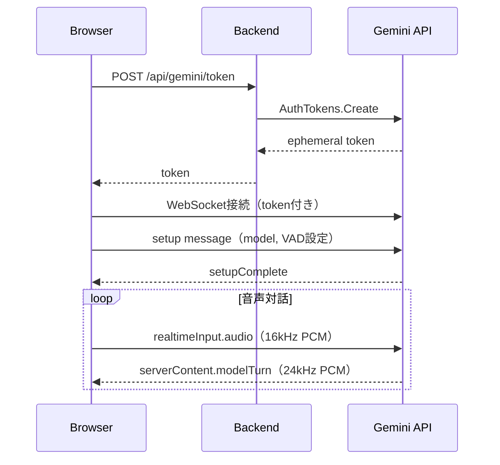
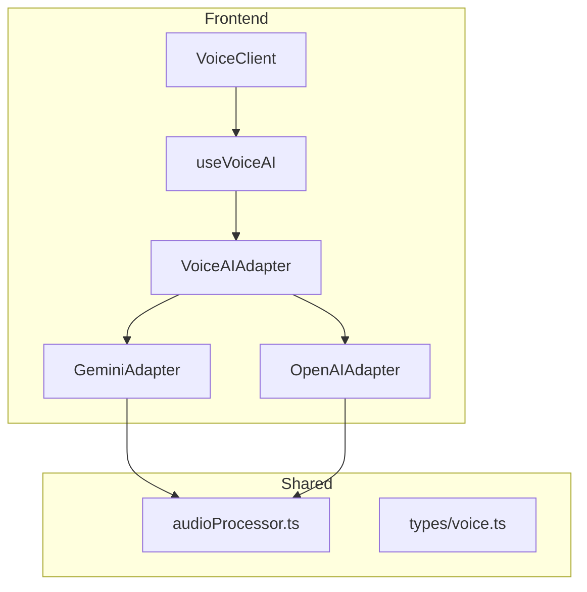
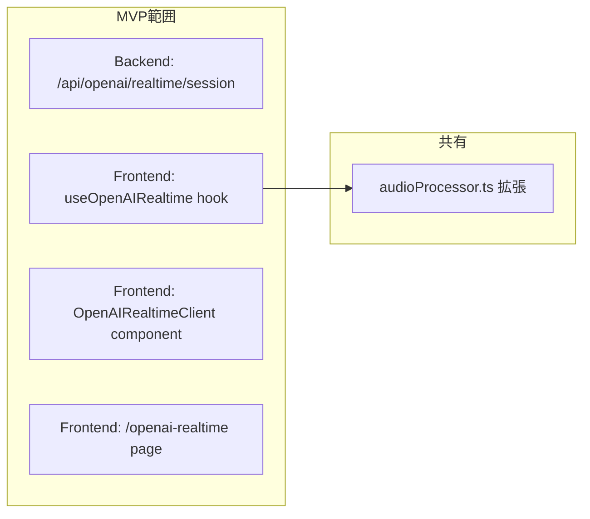

# 検討結果: ChatGPT音声対話（OpenAI Realtime API）

## 検討経緯

| 日付 | 内容 |
|------|------|
| 2026-01-27 | 初回相談: Gemini Liveの音声対話実装があり、ChatGPT（OpenAI）でも同等機能を実装したい |

## 背景・目的

既存のGemini Live音声対話機能に加えて、OpenAI Realtime APIを使用した音声対話機能を実装することで、ユーザーに選択肢を提供する。

### 現状のGemini Live実装



**主な特徴:**
- WebSocket接続（BidiGenerateContentConstrained）
- エフェメラルトークンによる認証
- 音声フォーマット: 入力16kHz / 出力24kHz（16-bit PCM）
- VAD（Voice Activity Detection）によるターン検出
- ScriptProcessorNodeによる音声入力処理

## 対象ユーザー

- 現在Gemini Live音声対話を使用しているユーザー
- OpenAIモデルを好むユーザー
- 複数のAIプロバイダーを比較したいユーザー

## 解決する課題

1. **AIプロバイダーの選択肢**: Gemini以外の選択肢を提供
2. **障害耐性**: 一方のサービスが障害時にもう一方を利用可能
3. **機能比較**: 異なるモデルの応答品質を比較可能

## Gemini Live vs OpenAI Realtime API 比較

| 項目 | Gemini Live | OpenAI Realtime |
|------|-------------|-----------------|
| 接続方式 | WebSocket | WebSocket / WebRTC / SIP |
| 認証 | エフェメラルトークン | エフェメラルキー (ek_xxx) |
| 入力音声 | 16kHz PCM | 24kHz PCM |
| 出力音声 | 24kHz PCM | 24kHz PCM |
| VAD | あり（自動検出） | あり（server_vad / semantic_vad） |
| セッション上限 | 不明 | 60分 |
| 料金（音声入力） | 非公開 | $32/1M tokens |
| 料金（音声出力） | 非公開 | $64/1M tokens |

## 選択肢の検討

### 案A: 既存構造を流用（並列実装）

```mermaid
flowchart TD
    subgraph Frontend
        A[VoiceClient] --> B{Provider選択}
        B -->|Gemini| C[useGeminiLive]
        B -->|OpenAI| D[useOpenAIRealtime]
    end

    subgraph Backend
        E[/api/gemini/token] --> F[GeminiService]
        G[/api/openai/realtime/session] --> H[OpenAIService]
    end

    C --> E
    D --> G
```

**概要:** Gemini Live実装と同様の構造で、OpenAI用のフック・コンポーネント・バックエンドエンドポイントを新規作成

**メリット:**
- 既存のパターンを踏襲、理解しやすい
- 各プロバイダーの実装が独立、影響が小さい
- 段階的な開発が可能

**デメリット:**
- コードの重複が発生
- 共通処理（音声エンコード等）が分散

**工数感:** 中

### 案B: 抽象化レイヤー導入（統一インターフェース）



**概要:** 共通のインターフェースを定義し、プロバイダーごとにアダプターを実装

**メリット:**
- コードの再利用性が高い
- 新しいプロバイダー追加が容易
- UI側の変更が最小限

**デメリット:**
- 初期設計に時間がかかる
- 各プロバイダーの差異を吸収する設計が複雑
- Gemini実装のリファクタリングが必要

**工数感:** 大

### 案C: OpenAI専用ページ（MVP優先）

```mermaid
flowchart TD
    subgraph Pages
        A[/gemini-live] --> B[GeminiLiveClient]
        C[/openai-realtime] --> D[OpenAIRealtimeClient]
    end

    subgraph Shared
        E[audioProcessor.ts]
    end

    B --> E
    D --> E
```

**概要:** Gemini Liveと同様に独立したページ・コンポーネントとして実装。共通部分は`audioProcessor.ts`のみ共有。

**メリット:**
- 最速で動くものを作れる
- 既存コードへの影響ゼロ
- 実装後に抽象化を検討可能

**デメリット:**
- UIの重複
- 将来的なリファクタリングが必要

**工数感:** 小

## MVP提案

**推奨案:** 案C（OpenAI専用ページ）

理由:
1. 「まず動くもの」を最優先
2. 既存のGemini Live実装に影響を与えない
3. OpenAI Realtime APIの挙動を理解してから抽象化を検討できる

### MVP範囲



**必須機能:**
1. バックエンドでエフェメラルキー発行エンドポイント作成
2. OpenAI Realtime API用のReactフック作成
3. 音声対話UIコンポーネント作成（Gemini版と同等機能）
4. 専用ページ `/openai-realtime` 作成
5. `audioProcessor.ts` に24kHz入力対応を追加

### 次回以降

- プロバイダー切り替えUI
- 抽象化レイヤーの導入（案Bへの移行）
- 音声認識テキスト表示
- 会話履歴の保存機能

## 技術的な注意点

### 音声フォーマットの違い

| 項目 | Gemini Live | OpenAI Realtime |
|------|-------------|-----------------|
| 入力サンプルレート | 16kHz | 24kHz |
| 出力サンプルレート | 24kHz | 24kHz |
| フォーマット | 16-bit PCM | 16-bit PCM |

OpenAIは入出力ともに24kHzを要求するため、`audioProcessor.ts`のダウンサンプリング処理を調整する必要がある。

### 認証フローの違い

**Gemini:**
```
POST /api/gemini/token -> AuthTokens.Create -> access_token パラメータで接続
```

**OpenAI:**
```
POST /api/openai/realtime/session -> /v1/realtime/client_secrets -> ek_xxx をヘッダーで使用
```

## 次のステップ

1. この検討結果について方針を決定
2. 方針決定後、`/plan` で実装計画を作成
3. 計画確定後、`開発/実装/実装待ち/` に移動

---

## 参考リンク

- [OpenAI Realtime API ガイド](https://platform.openai.com/docs/guides/realtime)
- [OpenAI Realtime API WebSocket](https://platform.openai.com/docs/guides/realtime-websocket)
- [OpenAI Realtime API VAD](https://platform.openai.com/docs/guides/realtime-vad)
- [OpenAI Client Secrets](https://platform.openai.com/docs/api-reference/realtime-sessions)
- [OpenAI Pricing](https://platform.openai.com/docs/pricing)
