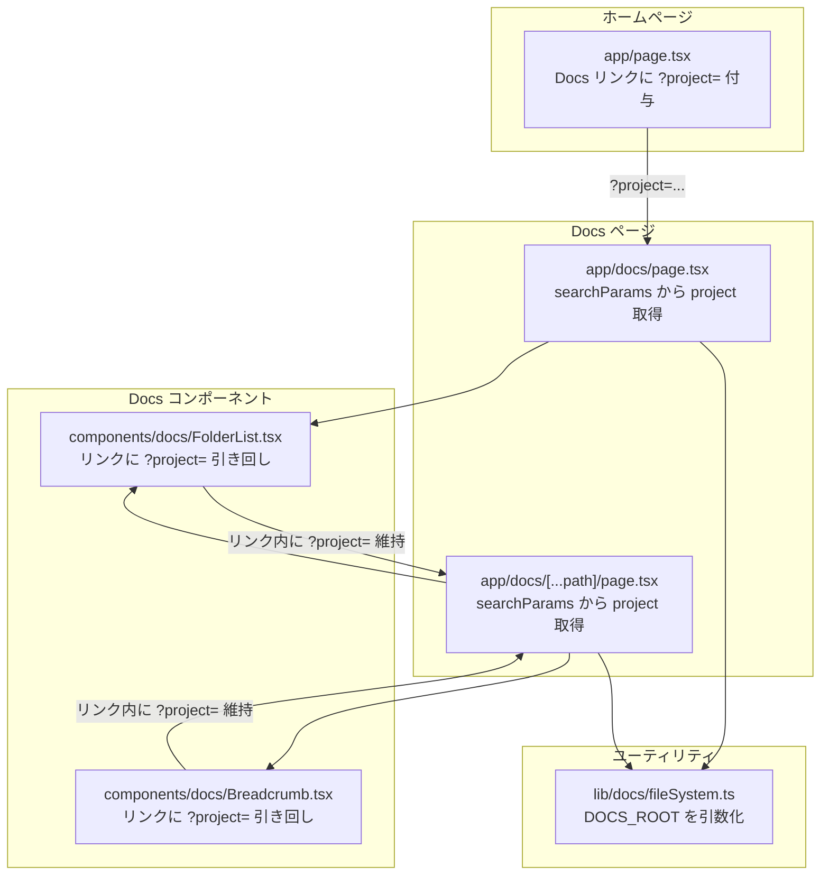

# Docs ページのプロジェクト対応 実装計画

## 概要

Docs ページ (`/docs`) は現在 Ghostrunner プロジェクトの `開発/` フォルダのみをハードコードで参照している。メインページで選択された任意のプロジェクトパスの `開発/` フォルダを表示できるように変更する。

## 現状の問題

- `fileSystem.ts` で `DOCS_ROOT = path.join(process.cwd(), "..", "開発")` とハードコード
- メインページで Project パスを変更しても、Docs ページは常に Ghostrunner の `開発/` フォルダを表示
- ホームページの Docs リンクは `/docs` にハードコード

## 設計判断: プロジェクトパスの受け渡し方法

### 選択肢の比較

| 方法 | メリット | デメリット |
|------|---------|----------|
| A: クエリパラメータ `?project=...` | URL共有可能、Server Component 維持可能 | URLが長い |
| B: localStorage 直接参照 | 既存の仕組みを活用 | Server Component では読めない、Client Component 化が必要 |
| C: Cookie | Server Component 維持可能 | Cookie管理の複雑さ |

### 採用: 方法A（クエリパラメータ）

**理由**:
- Server Components を維持できる（`fs` 直接アクセスが可能な現行アーキテクチャを活かせる）
- 変更量が最小限
- クエリパラメータ未指定時は現行と同じフォールバック動作

## 修正範囲



## 変更ファイル一覧

| ファイル | 変更内容 |
|---------|---------|
| `frontend/src/lib/docs/fileSystem.ts` | 全関数に `projectPath` 引数を追加、ハードコード除去 |
| `frontend/src/app/docs/page.tsx` | `searchParams` から `project` を取得し `fileSystem` に渡す |
| `frontend/src/app/docs/[...path]/page.tsx` | `searchParams` から `project` を取得し `fileSystem` に渡す |
| `frontend/src/components/docs/FolderList.tsx` | `project` prop を追加、リンクに `?project=` を付与 |
| `frontend/src/components/docs/Breadcrumb.tsx` | `project` prop を追加、リンクに `?project=` を付与 |
| `frontend/src/app/page.tsx` | Docs リンクの `href` を `projectPath` ベースに動的化 |

## フロントエンド計画

### Step 1: fileSystem.ts のリファクタリング

**対象**: `frontend/src/lib/docs/fileSystem.ts`

- 定数 `DOCS_ROOT` を削除
- `resolveDocsRoot(projectPath?: string)` ヘルパーを追加: `projectPath` があれば `projectPath + "/開発"` を返し、なければ `path.join(process.cwd(), "..", "開発")` をフォールバックとして返す
- `getDirectoryContents(relativePath, projectPath?)`: `projectPath` 引数を追加
- `getFileContent(relativePath, projectPath?)`: `projectPath` 引数を追加
- `getPathType(relativePath, projectPath?)`: `projectPath` 引数を追加

### Step 2: Docs ページコンポーネントの修正

**対象**: `frontend/src/app/docs/page.tsx`

- Props に `searchParams` を追加（Next.js 15: `Promise<{ project?: string }>` 型）
- `searchParams` から `project` を取得
- `getDirectoryContents("", project)` と呼び出す
- `FolderList` に `project` prop を渡す

**対象**: `frontend/src/app/docs/[...path]/page.tsx`

- Props に `searchParams` を追加
- `searchParams` から `project` を取得
- `getDirectoryContents`, `getFileContent`, `getPathType` に `project` を渡す
- `FolderList` と `Breadcrumb` に `project` prop を渡す

### Step 3: FolderList / Breadcrumb の修正

**対象**: `frontend/src/components/docs/FolderList.tsx`

- Props に `project?: string` を追加
- リンクの `href` を `project` がある場合 `/docs/${path}?project=...` に変更

**対象**: `frontend/src/components/docs/Breadcrumb.tsx`

- Props に `project?: string` を追加
- 全リンクに `?project=` クエリパラメータを付与

### Step 4: ホームページの Docs リンク修正

**対象**: `frontend/src/app/page.tsx`

- Docs リンクの `href` を動的生成:
  - `projectPath` がある場合: `/docs?project=${encodeURIComponent(projectPath)}`
  - ない場合: `/docs`

## 懸念点と対応

| 懸念点 | 対応 |
|-------|------|
| パストラバーサル攻撃 | `fileSystem.ts` で `path.resolve` 後に `docsRoot` 配下であることを `startsWith` でチェック |
| クエリパラメータのエンコード | `encodeURIComponent` / `decodeURIComponent` を適切に使用 |
| `開発/` フォルダが存在しないプロジェクト | 空フォルダ表示（現行動作と同一） |
| Breadcrumb のルートラベル | 現行の「開発」のまま維持 |

## ドキュメント更新

| ファイル | 更新内容 |
|---------|---------|
| `frontend/docs/screens.md` | Docs ページのセクション追加（構成要素、プロジェクトパラメータ） |
| `frontend/docs/screen-flow.md` | Docs ページの遷移フロー追加 |

---

## 実装完了レポート

### 実装サマリー

- **実装日**: 2026-01-27
- **スコープ**: frontend/ 配下の変更のみ（バックエンド変更なし）
- **変更ファイル数**: 8 files（ソースコード6件 + ドキュメント2件）

### 変更ファイル一覧

| ファイル | 変更内容 |
|---------|---------|
| `frontend/src/lib/docs/fileSystem.ts` | 定数 `DOCS_ROOT` を削除し、`resolveDocsRoot(projectPath?)` ヘルパーを追加。`validatePath()` によるパストラバーサル防止を追加。`getDirectoryContents`, `getFileContent`, `getPathType` の全関数に `projectPath` 引数を追加 |
| `frontend/src/app/docs/page.tsx` | `searchParams: Promise<{ project?: string }>` を Props に追加し、`project` を取得して `getDirectoryContents` と `FolderList` に渡すように変更 |
| `frontend/src/app/docs/[...path]/page.tsx` | `searchParams` を Props に追加し、`project` を取得して `getDirectoryContents`, `getFileContent`, `getPathType`, `FolderList`, `Breadcrumb` の全てに渡すように変更 |
| `frontend/src/components/docs/FolderList.tsx` | `project?: string` prop を追加し、`buildHref` ヘルパーでリンクに `?project=` クエリパラメータを付与 |
| `frontend/src/components/docs/Breadcrumb.tsx` | `project?: string` prop を追加し、`buildHref` ヘルパーでルートリンク・中間パスリンク全てに `?project=` クエリパラメータを付与 |
| `frontend/src/app/page.tsx` | Docs リンクの `href` を `projectPath` の有無に応じて動的生成（`projectPath` があれば `/docs?project=${encodeURIComponent(projectPath)}`、なければ `/docs`） |
| `frontend/docs/screens.md` | Docs ページセクションを追加（クエリパラメータ仕様、構成要素、パス解決とセキュリティ、関連ファイル） |
| `frontend/docs/screen-flow.md` | Docs ドキュメント閲覧フローを追加（ページ間遷移図、遷移詳細テーブル、project パラメータの流れ、パス解決フロー） |

### 計画からの変更点

実装計画に記載がなかった判断・選択:

- `validatePath()` 関数を独立したヘルパーとして抽出し、`getDirectoryContents`, `getFileContent`, `getPathType` の3関数全てから呼び出す構成にした（計画では `fileSystem.ts` 内でのチェックとのみ記載）
- `validatePath()` でパストラバーサル検出時に例外をスローし、各関数で catch して安全なデフォルト値（空配列、null、"not_found"）を返す設計とした
- `getPathType()` では `dirPath` と `filePath` の両方に対して `validatePath()` を適用し、いずれかが不正な場合に即座に "not_found" を返す
- `FolderList` と `Breadcrumb` の両方で `buildHref` ヘルパー関数を新設し、`project` パラメータの有無によるリンク生成を共通化した

### レビュー結果サマリ

| 項目 | 結果 |
|-----|------|
| Critical | 0件 |
| Warning | 2件（いずれも対応済み・低優先度） |
| ビルド | OK |
| 型チェック | OK |
| ESLint | OK（変更ファイルにエラーなし） |

Warning の詳細:

1. **ドキュメント更新**: `screens.md` と `screen-flow.md` への Docs ページセクション追加が必要 → 対応済み
2. **projectPath バリデーション（ホワイトリスト方式）**: ローカル開発環境前提のため低優先度として未実施

### 実装時の課題

#### ビルド・テストで苦戦した点

特になし

#### 技術的に難しかった点

特になし。計画書の設計が詳細であったため、各ファイルの変更はスムーズに進行した。

### 残存する懸念点

今後注意が必要な点:

- **projectPath のホワイトリスト方式バリデーション未実施**: 現在は任意のパスを `?project=` で指定可能であり、パストラバーサル防止は `validatePath()` で `開発/` フォルダ配下のみにアクセスを制限しているが、`projectPath` 自体の正当性検証（許可されたプロジェクトパスのホワイトリスト方式）は行っていない。ローカル開発環境での利用を前提としているため現時点では問題ないが、Cloud Run デプロイ時にはサーバー上のファイルシステムへの任意パスアクセスを防ぐ追加対策が必要
- **`encodeURIComponent` の二重エンコード可能性**: ホームページから Docs へ遷移する際に `encodeURIComponent(projectPath)` でエンコードし、Docs ページ側では Next.js の `searchParams` が自動デコードする設計。パスに `%` 文字が含まれるような極端なケースでは注意が必要

### 動作確認フロー

```
1. フロントエンドを起動 (make frontend)
2. ホームページ (/) で任意のプロジェクトパスを Project Path 入力欄に設定する
3. ヘッダーの Docs リンクをクリック
4. URL に ?project=... が付与されていることを確認する
5. /docs ページで設定したプロジェクトの 開発/ フォルダ内容が表示されることを確認する
6. フォルダをクリックしてサブフォルダに遷移 → URL の ?project= が維持されることを確認する
7. Breadcrumb（パンくず）のリンクをクリック → ?project= が維持されることを確認する
8. Markdown ファイルをクリック → 内容が正しく表示され、Breadcrumb でも ?project= が維持されることを確認する
9. ?project= 未指定で /docs に直接アクセス → デフォルト（Ghostrunner プロジェクトの開発フォルダ）が表示されることを確認する
```

### デプロイ後の確認事項

- [ ] ローカル環境で `?project=` 付きの Docs ページが正常に表示されること
- [ ] `?project=` 未指定時にデフォルトの開発フォルダにフォールバックすること
- [ ] フォルダ遷移・Breadcrumb 遷移で `?project=` パラメータが維持されること
- [ ] パストラバーサル（`../` を含むパス）が `validatePath()` によって拒否されること
- [ ] 存在しないプロジェクトパスを指定した場合に空フォルダが表示されること（エラーにならないこと）
