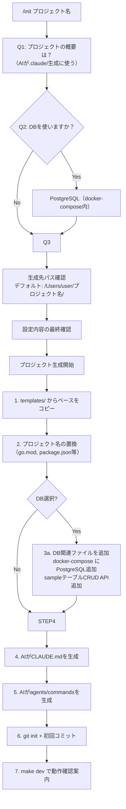

# 検討結果: プロジェクトスターター (`/init`)

## 検討経緯

| 日付 | 内容 |
|------|------|
| 2026-03-02 | 初回相談: プロジェクトを簡単に作って初期設定できるモードを作りたい。対話で設定を選択し、自動で用意してそこから開発できる仕組み |
| 2026-03-02 | 深掘り: 対象ユーザー（外部汎用）、Hello Worldまでの自動化、DB付きCRUDオプションを明確化 |
| 2026-03-02 | 方針決定: Claude Codeコマンド `/init` + `templates/` + AI生成の`.claude/`資産 |

## 背景・目的

新しいプロジェクトを立ち上げるたびに、同じような初期設定作業（ディレクトリ構造、Dockerfile、CI/CD設定、Makefile、CLAUDE.md等）を繰り返している。Ghostrunnerで培ったプロジェクト構成と開発支援体制（agents/commands）を、新プロジェクトに素早く展開できる仕組みが必要。

## 対象ユーザー

外部の人でも使える汎用スターターキット。ただしClaude Codeの利用が前提。

## 解決する課題

| 現状の課題 | この機能での解決 |
|-----------|----------------|
| プロジェクト開始時に毎回同じ初期設定を手作業で行う | `/init` コマンドで対話的に自動生成 |
| Hello Worldが動くまでに時間がかかる | `make dev` 一発で動く状態まで自動生成 |
| CLAUDE.mdやagents/commandsを一から作る必要がある | Ghostrunnerのパターンを参考にAIが自動生成 |
| DB設定やDockerfile作成が面倒 | テンプレートから一括生成、DB有無も選択可能 |

---

## 確定した方針

### 実行方法: Claude Codeコマンド (`/init`)

Ghostrunnerの `.claude/commands/init.md` として実装する。

**選定理由:**
- CLAUDE.mdやagents/commandsの中身は単純な文字列置換では対応できない（プロジェクト固有の文脈が必要）
- AIがプロジェクトの目的を理解して、エージェントの指示内容を適切に書き換えられる
- 既存のClaude Codeコマンド体系に自然に乗れる
- 対話の質問追加・変更が柔軟にできる

### テンプレート管理: Ghostrunner内 `templates/`

`/Users/user/Ghostrunner/templates/` にテンプレートファイルを配置する。

**選定理由:**
- 一元管理でメンテナンスしやすい
- MVPとしてはこれが最速
- 将来的に別リポジトリへの分離も可能

### `.claude/` 資産: テンプレートに含めず、AIが生成

テンプレートには `.claude/` を含めない。`/init` コマンド実行時に、AIがGhostrunnerの `.claude/` を参考にして新プロジェクト用の設定を生成する。

**選定理由:**
- 現在のagents/commandsはGhostrunner固有の記述が多い（データ復旧サービス、Spreadsheet API等）
- AIが現在のagents/commandsの構造とパターンを理解し、新プロジェクト用のものを適切に生成できる
- プロジェクトの目的に合わせた自然なカスタマイズが可能

---

## MVP スコープ (v0.1)

### `/init` コマンドの対話フロー



### 生成物一覧

#### A. テンプレートからコピーするもの（`templates/` に配置）

| ファイル/ディレクトリ | 内容 |
|---------------------|------|
| `backend/cmd/server/main.go` | Go + Gin エントリーポイント、Health API + Hello World API |
| `backend/internal/handler/health.go` | ヘルスチェックハンドラー |
| `backend/internal/handler/hello.go` | Hello Worldハンドラー |
| `backend/go.mod` | Go modules（プロジェクト名を置換） |
| `backend/Dockerfile` | Cloud Run対応のマルチステージビルド |
| `frontend/src/app/page.tsx` | トップページ（バックエンドAPIを呼び出してHello World表示） |
| `frontend/src/app/layout.tsx` | ルートレイアウト |
| `frontend/package.json` | Next.js 15 + React 19 + Tailwind CSS |
| `frontend/tsconfig.json` | TypeScript設定 |
| `frontend/Dockerfile` | Cloud Run対応のマルチステージビルド |
| `Makefile` | `make dev` / `make build` / `make stop` 等 |
| `docker-compose.yml` | ローカル開発用（backend + frontend） |
| `cloudbuild.yaml` | Cloud Buildデプロイ設定（backend + frontend） |
| `.gitignore` | Go + Node.js + IDE用 |

#### B. DB選択時に追加されるもの

| ファイル/ディレクトリ | 内容 |
|---------------------|------|
| `docker-compose.yml` への追記 | PostgreSQLコンテナ定義 |
| `backend/internal/handler/sample.go` | sampleテーブルCRUDハンドラー |
| `backend/internal/domain/model/sample.go` | Sampleモデル |
| `backend/internal/infrastructure/database.go` | DB接続設定 |
| `db/init.sql` | sampleテーブル初期化SQL |

#### C. AIが生成するもの（テンプレートに含めない）

| ファイル | 内容 | 生成方針 |
|---------|------|---------|
| `.claude/CLAUDE.md` | プロジェクト固有の開発ルール | プロジェクト概要・技術スタックに合わせて生成 |
| `.claude/commands/` | カスタムコマンド群 | 下記の選択基準に従い生成 |
| `.claude/agents/` | エージェント群 | 下記の選択基準に従い生成 |

**agents/commandsの選択基準:**

| 条件 | 含めるcommands | 含めるagents |
|------|---------------|-------------|
| 常に含める | discuss, research, plan, fix | discuss, research, reporter, fix-judge, test-planner |
| Go + Next.js構成（MVP） | go, nextjs, fullstack | go-impl, go-reviewer, go-tester, go-planner, go-documenter, go-plan-reviewer, nextjs-impl, nextjs-reviewer, nextjs-tester, nextjs-planner, nextjs-documenter, nextjs-plan-reviewer |
| Cloud Run構成（MVP） | stage, release, hotfix | staging-manager, release-manager |
| DB選択時 | (なし) | pg-impl, pg-reviewer, pg-planner, pg-tester |

### 生成後の状態

```
/Users/user/新プロジェクト/
|-- backend/
|   |-- cmd/server/main.go          # Health API + Hello World
|   |-- internal/
|   |   |-- handler/
|   |   |   |-- health.go
|   |   |   |-- hello.go
|   |   |   |-- sample.go           # DB選択時のみ
|   |   |-- domain/model/
|   |   |   |-- sample.go           # DB選択時のみ
|   |   |-- infrastructure/
|   |       |-- database.go         # DB選択時のみ
|   |-- go.mod
|   |-- go.sum
|   |-- Dockerfile
|-- frontend/
|   |-- src/app/
|   |   |-- page.tsx
|   |   |-- layout.tsx
|   |-- package.json
|   |-- tsconfig.json
|   |-- Dockerfile
|-- .claude/
|   |-- CLAUDE.md                   # AIが生成
|   |-- commands/                    # AIが生成
|   |   |-- discuss.md
|   |   |-- research.md
|   |   |-- plan.md
|   |   |-- go.md
|   |   |-- nextjs.md
|   |   |-- fullstack.md
|   |   |-- fix.md
|   |   |-- stage.md
|   |   |-- release.md
|   |   |-- hotfix.md
|   |-- agents/                      # AIが生成
|   |   |-- discuss.md
|   |   |-- research.md
|   |   |-- reporter.md
|   |   |-- test-planner.md
|   |   |-- fix-judge.md
|   |   |-- go-impl.md
|   |   |-- go-reviewer.md
|   |   |-- go-tester.md
|   |   |-- go-planner.md
|   |   |-- go-documenter.md
|   |   |-- go-plan-reviewer.md
|   |   |-- nextjs-impl.md
|   |   |-- nextjs-reviewer.md
|   |   |-- nextjs-tester.md
|   |   |-- nextjs-planner.md
|   |   |-- nextjs-documenter.md
|   |   |-- nextjs-plan-reviewer.md
|   |   |-- staging-manager.md
|   |   |-- release-manager.md
|   |   |-- pg-impl.md              # DB選択時のみ
|   |   |-- pg-reviewer.md          # DB選択時のみ
|   |   |-- pg-planner.md           # DB選択時のみ
|   |   |-- pg-tester.md            # DB選択時のみ
|-- 開発/
|   |-- 検討中/.gitkeep
|   |-- 実装/実装待ち/.gitkeep
|   |-- 実装/完了/.gitkeep
|   |-- 資料/.gitkeep
|-- db/
|   |-- init.sql                     # DB選択時のみ
|-- Makefile
|-- docker-compose.yml
|-- cloudbuild.yaml
|-- .gitignore
```

---

## `/init` コマンドの処理フロー（詳細）

### Phase 1: 対話

```
> /init myproject

プロジェクト「myproject」を作成します。いくつか質問させてください。

1. このプロジェクトの概要を教えてください。
   （例: ECサイトの管理システム、社内タスク管理ツール、IoTデータ収集基盤、など）

> 飲食店の予約管理システム

2. データベースを使いますか？
   - Yes: PostgreSQL（docker-compose内で起動、sampleテーブルとCRUD付き）
   - No: DB なし

> Yes

3. 生成先を確認します。
   パス: /Users/user/myproject/
   よろしいですか？ (Y/n)

> Y

以下の設定でプロジェクトを生成します:
- プロジェクト名: myproject
- 概要: 飲食店の予約管理システム
- 技術スタック: Go + Next.js + Cloud Run
- DB: PostgreSQL あり
- 生成先: /Users/user/myproject/

生成を開始してよろしいですか？ (Y/n)
```

### Phase 2: テンプレートコピーと置換

1. `templates/base/` から `/Users/user/myproject/` にファイルをコピー
2. プロジェクト名を置換:
   - `go.mod`: `module {{PROJECT_NAME}}/backend`
   - `package.json`: `"name": "{{PROJECT_NAME}}"`
   - `Makefile`: プロジェクトルートパス
   - `cloudbuild.yaml`: サービス名
3. DB選択時: `templates/with-db/` から追加ファイルをコピー・マージ

### Phase 3: AI生成（`.claude/` 資産）

AIがGhostrunnerの `.claude/` を参照し、新プロジェクト用に生成:

1. **CLAUDE.md**: プロジェクト概要、技術スタック、コーディング規約、ファイル構造をプロジェクトに合わせて記述
2. **agents/**: Ghostrunnerの各エージェントの構造・パターンを踏襲しつつ、プロジェクト固有の記述（ドメイン用語、ディレクトリパス等）を新プロジェクトに合わせて調整
3. **commands/**: 同様にパターンを踏襲しつつカスタマイズ

### Phase 4: 仕上げ

1. `git init` + 初回コミット
2. 完了メッセージと次のステップを案内:

```
プロジェクト「myproject」の生成が完了しました。

生成先: /Users/user/myproject/

起動方法:
  cd /Users/user/myproject
  make dev

アクセス:
  フロントエンド: http://localhost:3000
  バックエンドAPI: http://localhost:8080/api/health

次のステップ:
  1. make dev でローカル起動を確認
  2. ブラウザで http://localhost:3000 にアクセスし Hello World を確認
  3. /discuss でアイデアを整理
  4. /plan で実装計画を作成
  5. /fullstack で実装開始
```

---

## Ghostrunner内のディレクトリ構成案

```
/Users/user/Ghostrunner/
|-- templates/
|   |-- base/                        # 全プロジェクト共通のベーステンプレート
|   |   |-- backend/
|   |   |   |-- cmd/server/main.go
|   |   |   |-- internal/handler/health.go
|   |   |   |-- internal/handler/hello.go
|   |   |   |-- go.mod
|   |   |   |-- Dockerfile
|   |   |-- frontend/
|   |   |   |-- src/app/page.tsx
|   |   |   |-- src/app/layout.tsx
|   |   |   |-- src/app/globals.css
|   |   |   |-- package.json
|   |   |   |-- tsconfig.json
|   |   |   |-- postcss.config.mjs
|   |   |   |-- eslint.config.mjs
|   |   |   |-- Dockerfile
|   |   |-- Makefile
|   |   |-- docker-compose.yml
|   |   |-- cloudbuild.yaml
|   |   |-- .gitignore
|   |   |-- 開発/
|   |       |-- 検討中/.gitkeep
|   |       |-- 実装/実装待ち/.gitkeep
|   |       |-- 実装/完了/.gitkeep
|   |       |-- 資料/.gitkeep
|   |-- with-db/                     # DB選択時に追加・マージするファイル
|       |-- backend/
|       |   |-- internal/handler/sample.go
|       |   |-- internal/domain/model/sample.go
|       |   |-- internal/infrastructure/database.go
|       |-- db/
|       |   |-- init.sql
|       |-- docker-compose.override.yml  # PostgreSQLコンテナ定義（baseにマージ）
|       |-- main.go.patch               # main.goへのルーティング追加差分
|-- .claude/
|   |-- commands/
|   |   |-- init.md                  # 新規追加: プロジェクトスターターコマンド
|   |   |-- discuss.md
|   |   |-- ... (既存コマンド)
|   |-- agents/
|   |   |-- ... (既存エージェント)
```

---

## 将来拡張 (v0.2+)

| バージョン | 機能 | 概要 |
|-----------|------|------|
| v0.2 | 認証オプション | NextAuth.js + OAuth2のテンプレート追加。対話で「ログイン機能が必要ですか？」を追加 |
| v0.3 | AWS対応 | Cloud Run以外にECS/Fargate、CodePipelineのテンプレート追加。対話で「クラウド環境は？」を追加 |
| v0.4 | 技術スタックの多様化 | Python (FastAPI) + React、Ruby (Rails) + React 等のテンプレート追加 |
| v0.5 | シェルスクリプト版 | Claude Code非依存の `ghostrunner init` コマンド。外部配布用 |
| v0.6 | テンプレートの外部化 | `ghostrunner-templates` 別リポジトリへの分離。バージョン管理・配布の独立化 |

---

## 次のステップ

1. この検討結果を `開発/検討中/` に保存 -- 完了
2. 方針確定後、`/plan` で実装計画を作成
   - Phase 1: `templates/base/` のファイル群を作成
   - Phase 2: `templates/with-db/` のファイル群を作成
   - Phase 3: `.claude/commands/init.md` を作成
3. 計画確定後、`/fullstack` で実装開始
