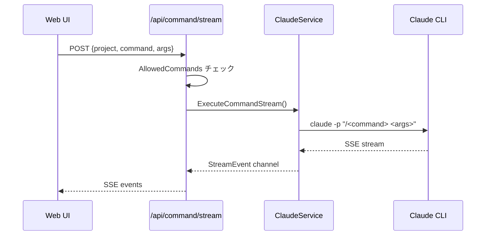

# /discuss コマンド Web UI対応 実装計画

## 1. 仕様サマリー

`/discuss` コマンドを Web UI（Ghost Runner）から実行できるようにする。現在の Web UI は `/plan`, `/fullstack`, `/go`, `/nextjs` の4つのコマンドに対応しており、同じ仕組みで `/discuss` を追加する。

## 2. 現状分析

### 既存のコマンドUI実装

| 層 | ファイル | 役割 |
|---|---------|------|
| フロントエンド | `web/index.html` | コマンド選択UI、SSEストリーム処理 |
| ハンドラー | `internal/handler/command.go` | HTTPリクエスト処理、バリデーション |
| サービス | `internal/service/claude.go` | Claude CLI実行 |
| 型定義 | `internal/service/types.go` | `AllowedCommands` 定義 |

### コマンド実行フロー



### 追加に必要な変更

1. **`AllowedCommands` に `"discuss": true` を追加** - これだけでバックエンドは動作する
2. **Web UI のドロップダウンに `/discuss` オプションを追加**

## 3. 変更ファイル一覧

| ファイル | 変更内容 | 影響度 |
|---------|---------|-------|
| `internal/service/types.go` | `AllowedCommands` に `"discuss": true` 追加 | 低 |
| `web/index.html` | select 要素に `/discuss` オプション追加 | 低 |

## 4. 実装ステップ

### Step 1: AllowedCommands への追加

- 対象ファイル: `internal/service/types.go`
- 変更内容: `AllowedCommands` map に `"discuss": true` を追加
- 注意点: なし（単純な追加）

### Step 2: Web UI ドロップダウンへの追加

- 対象ファイル: `web/index.html`
- 変更内容: `<select id="command">` に新しい `<option>` を追加
- 追加する option: `value="discuss"`, 表示テキスト: `/discuss - アイデア深掘り`
- 注意点: 既存の option の並び順を考慮（plan の後に配置が自然）

## 5. 設計判断とトレードオフ

| 判断 | 選択した方法 | 理由 | 他の選択肢 |
|-----|------------|------|----------|
| コマンド追加方法 | AllowedCommands への追加のみ | 既存パターンに従う、最小変更 | 専用ハンドラー作成（過剰） |

## 6. 懸念点と対応方針

### 要確認（実装前に解決が必要）

なし。仕様は明確。

### 注意（実装時に考慮が必要）

| 懸念点 | 対応方針 |
|-------|---------|
| `/discuss` は対話的なコマンドで、複数回の往復が想定される | 既存の `question` イベント処理と `continueSessionStream` が対応済み |

## 7. 次回実装（MVP外）

以下はMVP範囲外とし、次回以降に実装：

- UI でのコマンド説明ツールチップ: 各コマンドの詳細説明を表示
- コマンドカテゴリ分け: 「計画系」「実装系」「検討系」のグループ化

## 8. 確認事項

特になし。変更は2ファイル、合計2行の追加のみ。

---

## バックエンド実装完了レポート

### 実装サマリー
- **実装日**: 2026-01-25
- **変更ファイル数**: 4 files
- **実装範囲**: バックエンド側の変更のみ（Step 1 完了）

### 変更ファイル一覧

| ファイル | 変更内容 |
|---------|---------|
| `internal/service/types.go` | `AllowedCommands` に `"discuss": true` を追加 |
| `internal/service/doc.go` | 許可コマンドの説明に discuss を追加 |
| `internal/handler/doc.go` | 許可コマンドの説明に discuss を追加 |
| `docs/BACKEND_API.md` | API仕様書の許可コマンド一覧に discuss を追記 |

### 計画からの変更点

実装計画に記載がなかった判断・選択：

- doc.go ファイルのコメント更新: API仕様の一貫性を保つため、service と handler の両方の doc.go に discuss コマンドの説明を追加
- BACKEND_API.md の更新: バリデーション欄も含めて discuss コマンドを追記

### 実装時の課題

特になし。計画通り、単純な追加のみで完了。

### 残存する懸念点

特になし。

### 動作確認フロー（バックエンド単体）

```
1. サーバーを起動する
   $ go run ./cmd/server

2. curl でコマンド実行をテストする
   $ curl -X POST http://localhost:8080/api/command \
     -H "Content-Type: application/json" \
     -d '{"project":"/path/to/project","command":"discuss","args":"テスト"}'

3. 期待される動作:
   - 400エラーが返らないこと（コマンドが許可されている）
   - Claude CLIが実行されること（プロジェクトパスが有効な場合）
```

### 次のステップ

- [x] フロントエンド側の実装（Step 2: Web UI ドロップダウンへの追加）
- [ ] 統合テスト（Web UIから `/discuss` コマンドを実行）

---

## フロントエンド実装完了レポート

### 実装サマリー
- **実装日**: 2026-01-25
- **変更ファイル数**: 1 file
- **実装範囲**: Web UI側の変更（Step 2 完了）

### 変更ファイル一覧

| ファイル | 変更内容 |
|---------|---------|
| `web/index.html` | コマンド選択ドロップダウンに `/discuss - アイデア深掘り` オプションを追加 |

### 変更詳細

```html
<!-- web/index.html 372行目に追加 -->
<option value="discuss">/discuss - アイデア深掘り</option>
```

コマンド選択ドロップダウン（`<select id="command">`）に新しいオプションを追加。配置は `/plan` の直後とし、計画系コマンドと実装系コマンドの間に論理的に位置づけた。

### 計画からの変更点

特になし。計画通り、1行の追加のみで完了。

### 実装時の課題

特になし。

### 残存する懸念点

特になし。バックエンド側で既に `/discuss` コマンドが `AllowedCommands` に追加済みのため、フロントエンドの変更のみで動作する。

### 動作確認フロー

```
1. サーバーを起動する
   $ go run ./cmd/server

2. ブラウザで Web UI にアクセスする
   http://localhost:8080/

3. コマンドドロップダウンを確認する
   - `/discuss - アイデア深掘り` オプションが表示されること

4. /discuss コマンドを実行する
   - Project Path: 任意のプロジェクトパス
   - Command: `/discuss - アイデア深掘り` を選択
   - Arguments: 検討したい内容を入力
   - Execute Command ボタンをクリック

5. 期待される動作:
   - SSEストリームが開始されること
   - Claude からの応答が表示されること
   - 質問があった場合、回答入力UIが表示されること
```

### 備考

- 今回の変更は静的HTML（`web/index.html`）への1行追加のみ
- Next.js プロジェクト（`frontend/`）への変更はなし（Web UI は別システム）
- ドキュメント更新は不要（Web UI 専用ドキュメントが存在しないため）
