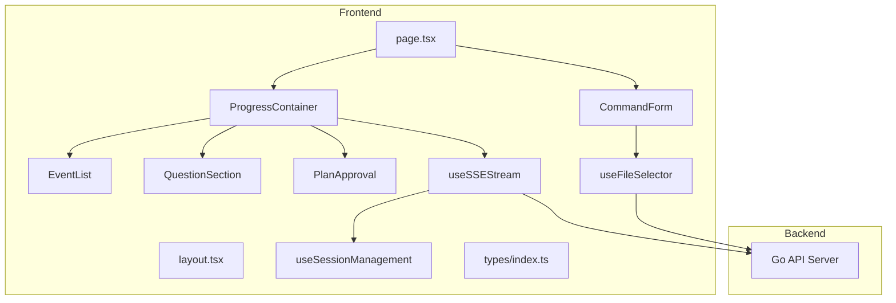
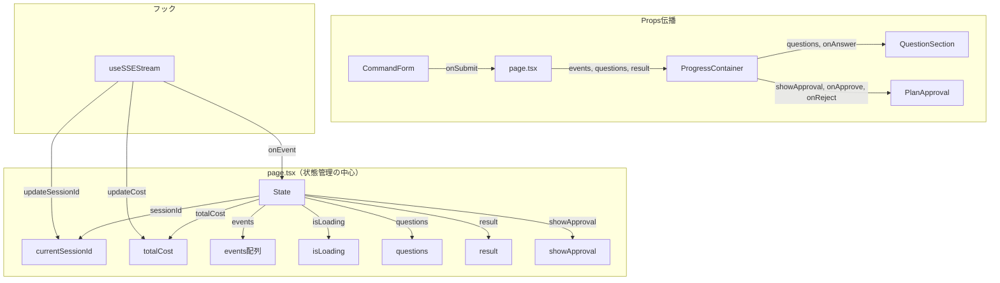
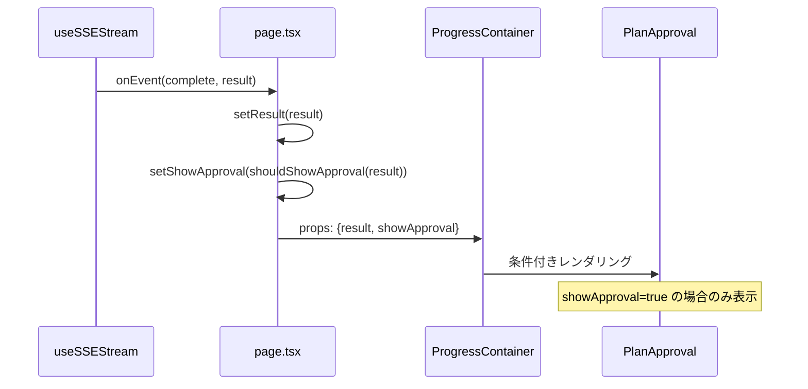

# Next.js移行 実装計画

## 概要

Gemini Live API実装に向けたNext.js移行（A案）の実装計画。既存の`web/index.html`（バニラJS、約1005行）をNext.js 15 + React 19 + TypeScriptに完全移植する。

### 選択した方針: A案

- 先にNext.js化してからGemini Live実装
- 既存`web/index.html`の全機能を移植
- TypeScriptの型安全性でオーディオ処理やWebSocket管理のバグを減らす

### 移植対象機能

- SSEストリーミングによるコマンド実行（plan, fullstack, go, nextjs, discuss, research）
- イベント表示（tool_use, text, thinking等）
- ファイルセレクター（5フォルダ対応）
- 質問UI（単一選択/複数選択、カスタム入力）
- 計画承認UI
- セッション継続機能
- コスト表示

---

## 懸念点と解決策

### 解決済み

| 懸念点 | 解決策 |
|--------|--------|
| SSEバッファ処理 | TextDecoderの`stream: true`オプション使用、不完全行のバッファリング（詳細は後述） |
| セッション状態管理 | page.tsxで一元管理し、propsで子コンポーネントに伝播（状態フロー図参照） |
| PlanApproval表示条件 | 出力テキストの文字列検出ロジック（詳細は後述） |

### 要確認（実装前にユーザー確認が必要）

| 懸念点 | 選択肢 |
|--------|--------|
| バックエンドURL | 開発時: localhost:8080、本番: 環境変数 `NEXT_PUBLIC_API_URL` で設定 |
| 認証 | 現在と同様、認証なしで進める |
| web/index.html | Next.js完成後は削除（A案の方針） |

---

## 修正範囲の全体像



---

## 状態管理フロー



### 状態の責務

| 状態 | 管理場所 | 更新タイミング |
|------|----------|---------------|
| `currentSessionId` | page.tsx | SSEイベント `init` 受信時 |
| `totalCost` | page.tsx | SSEイベント `complete` 受信時 |
| `events` | page.tsx | 各SSEイベント受信時 |
| `isLoading` | page.tsx | コマンド実行開始/完了時 |
| `questions` | page.tsx | SSEイベント `question` 受信時 |
| `result` | page.tsx | SSEイベント `complete` 受信時 |
| `showApproval` | page.tsx | result内容の文字列判定で決定 |
| `projectPath` | useSessionManagement | localStorageから復元/保存 |

---

## SSEバッファ処理の詳細設計

### 処理フロー

1. ReadableStreamからチャンクを読み取る
2. TextDecoderで`stream: true`オプションを使用してデコード（マルチバイト文字対応）
3. 改行で分割し、最後の不完全行はバッファに保持
4. `data: `プレフィックスを持つ行のみJSONパースしてイベント発火

### 重要ポイント

- `stream: true`オプション: マルチバイト文字（日本語等）が途中で切れた場合に正しく処理
- 不完全行の保持: 改行で終わっていない最後の行をバッファに戻す
- `data: `プレフィックス: SSEフォーマットに従い、このプレフィックスがない行は無視

---

## PlanApproval表示条件

### 判定ロジック

resultのoutputに以下のキーワードが含まれる場合にPlanApprovalを表示:
- 「承認をお待ち」
- 「waiting for approval」
- 「Ready for approval」

### 表示フロー



---

## ファイルパス結合ロジック

### CommandFormの仕様

選択ファイルと引数入力を結合してargsを生成:

| ファイル選択 | 引数入力 | 結果のargs |
|------------|---------|-----------|
| 選択あり | 入力あり | ファイルパス + 空白 + 引数 |
| 選択あり | 入力なし | ファイルパスのみ |
| 選択なし | 入力あり | 引数のみ |
| 選択なし | 入力なし | 空文字 |

---

## 質問回答のmultiSelect対応

### QuestionSectionの仕様

**単一選択（multiSelect: false）**
- 選択肢クリックで即座に回答送信
- 選択後はUIを非表示

**複数選択（multiSelect: true）**
- 選択肢クリックで選択状態をトグル
- 「送信」ボタン押下で選択肢をカンマ区切りで結合して送信

**カスタム入力**
- テキスト入力フィールド + 「送信」ボタン
- 入力内容をそのまま送信

---

## 変更ファイル一覧

| ファイル | 変更内容 | 影響度 |
|---------|---------|-------|
| `frontend/package.json` | プロジェクト設定（Next.js 15, React 19, TypeScript） | 高 |
| `frontend/tsconfig.json` | TypeScript設定 | 中 |
| `frontend/tailwind.config.ts` | Tailwind CSS設定 | 低 |
| `frontend/next.config.ts` | Next.js設定（APIプロキシ、環境変数） | 中 |
| `frontend/src/app/layout.tsx` | ルートレイアウト | 低 |
| `frontend/src/app/page.tsx` | メインページ（状態管理の中心） | 高 |
| `frontend/src/types/index.ts` | 型定義（StreamEvent, Question等） | 中 |
| `frontend/src/hooks/useSSEStream.ts` | SSEストリーム処理フック | 高 |
| `frontend/src/hooks/useSessionManagement.ts` | セッション・コスト管理フック | 中 |
| `frontend/src/hooks/useFileSelector.ts` | ファイル選択フック | 中 |
| `frontend/src/components/CommandForm.tsx` | フォームセクション | 高 |
| `frontend/src/components/ProgressContainer.tsx` | プログレス表示コンテナ | 高 |
| `frontend/src/components/EventList.tsx` | イベントリスト表示 | 中 |
| `frontend/src/components/EventItem.tsx` | 個別イベント表示（展開可能） | 中 |
| `frontend/src/components/QuestionSection.tsx` | 質問UI（multiSelect対応） | 高 |
| `frontend/src/components/PlanApproval.tsx` | 計画承認UI | 低 |
| `frontend/src/components/LoadingIndicator.tsx` | ローディング表示 | 低 |
| `frontend/src/lib/api.ts` | API呼び出しユーティリティ | 中 |
| `frontend/src/lib/constants.ts` | 定数（ALL_DEV_FOLDERS等） | 低 |

---

## 実装ステップ

### Phase 1: プロジェクト基盤構築

#### Step 1: Next.jsプロジェクト初期化
- `create-next-app@latest` で `frontend/` ディレクトリを作成
- App Router、TypeScript、Tailwind CSS、ESLint を有効化
- `src/` ディレクトリ使用
- 不要な初期ファイル（page.tsx のデフォルト内容等）を削除

#### Step 2: 型定義の作成
- `frontend/src/types/index.ts` を作成
- バックエンドの `internal/service/types.go` と整合性を取る
- StreamEvent, Question, Option, CommandRequest, FileInfo等

#### Step 3: 定数ファイルの作成
- `frontend/src/lib/constants.ts` を作成
- `ALL_DEV_FOLDERS` 配列（バックエンドと同期）
- 許可コマンドリスト

#### Step 4: Next.js設定（APIプロキシ）
- `frontend/next.config.ts` を編集
- `/api/*` をバックエンドにプロキシ
- 環境変数 `NEXT_PUBLIC_API_URL` のサポート

### Phase 2: カスタムフック実装

#### Step 5: useSSEStreamフック
- `frontend/src/hooks/useSSEStream.ts`
- fetch + ReadableStream でSSE処理
- バッファ処理（前述の詳細設計に従う）
- エラーハンドリング

#### Step 6: useSessionManagementフック
- `frontend/src/hooks/useSessionManagement.ts`
- localStorageでプロジェクトパスを永続化
- セッションIDとコストは page.tsx で管理（このフックは localStorage 操作のみ）

#### Step 7: useFileSelectorフック
- `frontend/src/hooks/useFileSelector.ts`
- GET /api/files を呼び出し
- フォルダ別ファイル一覧を取得

### Phase 3: コンポーネント実装

#### Step 8: LoadingIndicatorコンポーネント
- `frontend/src/components/LoadingIndicator.tsx`
- Tailwind CSS でスピナーアニメーション
- シンプルな表示のみ

#### Step 9: EventItemコンポーネント
- `frontend/src/components/EventItem.tsx`
- ツール別の表示フォーマット（Read, Write, Edit, Bash等）
- 展開可能テキスト（200文字以上で折りたたみ）

#### Step 10: EventListコンポーネント
- `frontend/src/components/EventList.tsx`
- EventItem の配列をレンダリング
- 自動スクロール

#### Step 11: PlanApprovalコンポーネント
- `frontend/src/components/PlanApproval.tsx`
- 承認/拒否ボタン
- onApprove, onReject コールバック

#### Step 12: QuestionSectionコンポーネント
- `frontend/src/components/QuestionSection.tsx`
- 単一選択/複数選択対応
- カスタム入力フィールド

#### Step 13: ProgressContainerコンポーネント
- `frontend/src/components/ProgressContainer.tsx`
- EventList, QuestionSection, PlanApproval を統括
- 表示/非表示の制御

#### Step 14: CommandFormコンポーネント
- `frontend/src/components/CommandForm.tsx`
- プロジェクトパス入力
- コマンド選択ドロップダウン
- ファイルセレクター
- 引数入力
- 実行ボタン

### Phase 4: ページ統合

#### Step 15: メインページ実装
- `frontend/src/app/page.tsx`
- 状態管理の中心
- CommandForm と ProgressContainer を統合
- useSSEStream との連携

### Phase 5: 動作確認

#### Step 16: ローカル動作確認
- バックエンドを起動（`go run ./cmd/server`）
- フロントエンドを起動（`npm run dev`）
- 全6コマンドの動作確認
- ファイルセレクターの動作確認
- 質問応答の動作確認
- セッション継続の動作確認

---

## ディレクトリ構造（完成形）

```
frontend/
├── src/
│   ├── app/
│   │   ├── layout.tsx          # ルートレイアウト
│   │   └── page.tsx            # メインページ（状態管理中心）
│   ├── components/
│   │   ├── CommandForm.tsx     # フォームセクション
│   │   ├── ProgressContainer.tsx # プログレス表示
│   │   ├── EventList.tsx       # イベントリスト
│   │   ├── EventItem.tsx       # 個別イベント（展開可能）
│   │   ├── QuestionSection.tsx # 質問UI
│   │   ├── PlanApproval.tsx    # 計画承認
│   │   └── LoadingIndicator.tsx # ローディング
│   ├── hooks/
│   │   ├── useSSEStream.ts     # SSE処理
│   │   ├── useSessionManagement.ts # localStorage操作
│   │   └── useFileSelector.ts  # ファイル選択
│   ├── lib/
│   │   ├── api.ts              # API呼び出し
│   │   └── constants.ts        # 定数定義
│   └── types/
│       └── index.ts            # 型定義
├── next.config.ts              # Next.js設定
├── tailwind.config.ts          # Tailwind設定
├── tsconfig.json               # TypeScript設定
└── package.json                # 依存関係
```

---

## 設計判断

| 判断 | 選択した方法 | 理由 |
|-----|------------|------|
| SSE処理 | fetch + ReadableStream | EventSourceはPOST非対応 |
| 状態管理 | useState + props伝播 | 複雑度が低い、Context不要 |
| APIプロキシ | next.config.ts rewrites | CORS回避 |
| スタイリング | Tailwind CSS | CLAUDE.MDの規約 |

---

## MVP外（将来対応）

- エフェメラルトークンAPI（Gemini Live用）
- WebSocket接続（Gemini Live用）
- 音声処理フック（Gemini Live用）
- E2Eテスト
- ダークモード

---

## 次のステップ

承認後、`/nextjs` コマンドで実装を開始。

---

## 実装完了レポート

### 実装サマリー

- **実装日**: 2026-01-25
- **変更ファイル数**: 19 files
- **技術スタック**: Next.js 16.1.4 + React 19.2.3 + TypeScript 5.x + Tailwind CSS 4.x

既存の `web/index.html`（バニラJS、約1005行）を Next.js 15 + React 19 + TypeScript に完全移植完了。全6コマンド（plan, fullstack, go, nextjs, discuss, research）の実行、SSEストリーミング、質問UI、計画承認UI、ファイルセレクター、セッション継続機能を実装。

### 変更ファイル一覧

| ファイル | 変更内容 |
|---------|---------|
| `frontend/package.json` | Next.js 16.1.4, React 19.2.3, Tailwind CSS 4 等の依存関係定義 |
| `frontend/tsconfig.json` | TypeScript strict mode 設定 |
| `frontend/tailwind.config.ts` | Tailwind CSS 設定 |
| `frontend/next.config.ts` | APIプロキシ設定（localhost:8080へのrewrites） |
| `frontend/src/app/layout.tsx` | ルートレイアウト（メタデータ、フォント設定） |
| `frontend/src/app/page.tsx` | メインページ（状態管理の中心、372行） |
| `frontend/src/app/globals.css` | グローバルスタイル（Tailwind directives） |
| `frontend/src/types/index.ts` | 型定義（StreamEvent, Question, ToolInput等） |
| `frontend/src/lib/constants.ts` | 定数定義（COMMANDS, DEV_FOLDERS, PLAN_APPROVAL_KEYWORDS） |
| `frontend/src/lib/api.ts` | API呼び出し関数（fetchFiles, executeCommandStream, continueSessionStream） |
| `frontend/src/hooks/useSSEStream.ts` | SSEストリーム処理フック（TextDecoder stream:true、不完全行バッファリング） |
| `frontend/src/hooks/useSessionManagement.ts` | セッション・コスト・プロジェクトパス管理フック |
| `frontend/src/hooks/useFileSelector.ts` | ファイル選択フック（5フォルダ対応） |
| `frontend/src/components/CommandForm.tsx` | コマンド入力フォーム（プロジェクトパス、コマンド選択、ファイル選択、引数入力） |
| `frontend/src/components/ProgressContainer.tsx` | 進捗表示コンテナ（イベントリスト、質問、結果を統括） |
| `frontend/src/components/EventList.tsx` | イベントリスト表示（自動スクロール対応） |
| `frontend/src/components/EventItem.tsx` | 個別イベント表示（ツール別アイコン、展開可能テキスト） |
| `frontend/src/components/QuestionSection.tsx` | 質問UI（単一選択/複数選択、カスタム入力対応） |
| `frontend/src/components/PlanApproval.tsx` | 計画承認UI（Approve/Rejectボタン、isLoading対応） |
| `frontend/src/components/LoadingIndicator.tsx` | ローディングスピナー表示 |
| `frontend/docs/screens.md` | 画面一覧ドキュメント |
| `frontend/docs/screen-flow.md` | 画面遷移フロードキュメント |

### 計画からの変更点

実装計画に記載がなかった判断・選択:

- **Next.js バージョン**: 計画では Next.js 15 としていたが、create-next-app@latest により Next.js 16.1.4 が採用された
- **React バージョン**: 計画では React 19 としていたが、React 19.2.3 が採用された
- **ドキュメント追加**: `frontend/docs/screens.md` と `frontend/docs/screen-flow.md` を追加作成（計画外）
- **DisplayEvent型の追加**: イベント表示用の内部型として `DisplayEvent` インターフェースを追加
- **EventDotType型の追加**: イベントドットの色分け用に `EventDotType` 型を追加

### 実装時の課題

#### ビルド・テストで苦戦した点

- **substr の非推奨警告**: レビューで `substr` が非推奨であることを指摘され、`substring` に変更
- **未使用コードの検出**: useSSEStream の初期実装で未使用のインポートがあり、リンターで検出・削除

#### 技術的に難しかった点

- **SSEバッファ処理**: マルチバイト文字（日本語）が途中で切れた場合の処理。TextDecoderの`stream: true`オプションで解決
- **ツール使用イベントの表示フォーマット**: 各ツール（Read, Write, Edit, Glob, Grep, Bash, Task等）に応じた適切な情報表示の設計

### 残存する懸念点

今後注意が必要な点:

- **環境変数によるAPIエンドポイント切り替え**: 現在はnext.config.tsで固定的にlocalhost:8080へプロキシしているが、本番環境では`NEXT_PUBLIC_API_URL`環境変数による切り替えが必要
- **認証機能**: 現在は認証なしで動作しており、本番運用にはNextAuth.js等の認証実装が必要
- **E2Eテスト**: 計画のMVP外として記載されているが、品質保証のため将来的に必要
- **web/index.html の削除**: A案の方針により、Next.js完成後は既存の `web/index.html` を削除する予定だが、まだ未実施

### 動作確認フロー

```
1. バックエンドを起動
   cd /Users/user/Ghostrunner/backend
   go run ./cmd/server

2. フロントエンドを起動
   cd /Users/user/Ghostrunner/frontend
   npm run dev

3. ブラウザで http://localhost:3000 にアクセス

4. 以下の機能を確認:
   a. プロジェクトパスを入力（例: /Users/user/Ghostrunner）
   b. コマンドを選択（plan, fullstack, go, nextjs, discuss, research）
   c. ファイルセレクターでファイルを選択（任意）
   d. 引数を入力
   e. "Execute Command" ボタンをクリック
   f. イベントリストにツール使用状況が表示されることを確認
   g. 質問が来た場合、選択肢をクリックまたはカスタム入力で回答
   h. 計画承認が必要な場合、Approve/Rejectボタンが表示されることを確認
   i. 完了後、結果出力とセッションID、累計コストが表示されることを確認
```

### デプロイ後の確認事項

- [ ] 本番環境のAPIエンドポイント設定（環境変数）
- [ ] CORSの設定確認
- [ ] SSEストリーミングの動作確認（プロキシ経由）
- [ ] 全6コマンドの動作確認
- [ ] 日本語を含む長いテキストの表示確認
- [ ] モバイル端末での表示確認
- [ ] web/index.html の削除（Next.js版への完全移行後）
