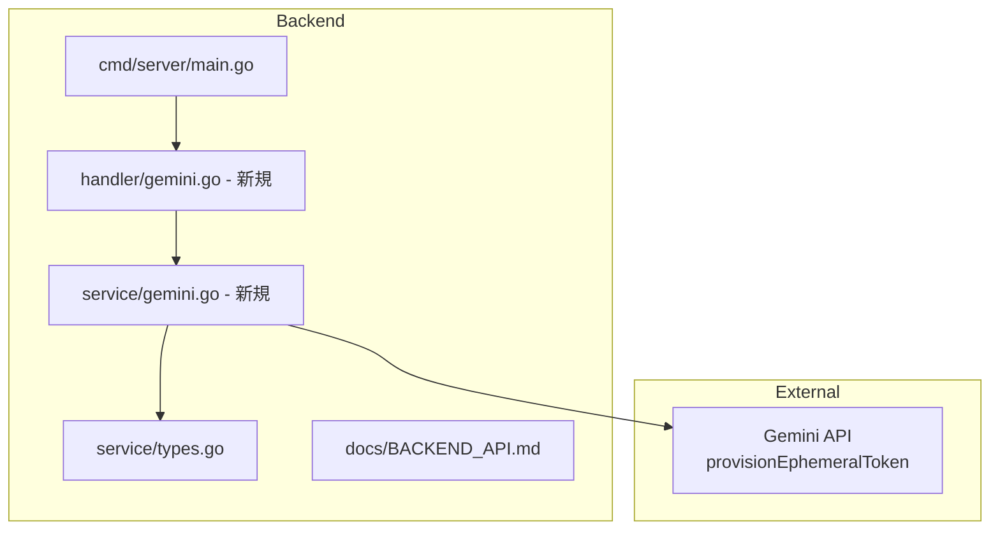
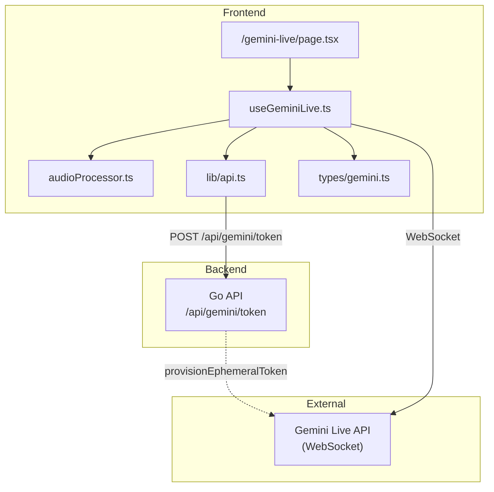

# Gemini Live API 最小限導入 実装計画

## 概要

Gemini Live API を使った音声 AI インターフェースの基盤を構築する。Phase 1 として、WebSocket 接続と基本的な音声入出力機能を実装し、既存の Claude UI (`/`) とは独立した専用ページ (`/gemini-live`) を作成する。

**目的**:
- Gemini Live API への接続基盤を構築
- 音声入力（マイク）と音声出力（スピーカー）の基本機能を実装
- 最小限の UI で動作確認可能な状態を達成

**実装しない範囲（Phase 2 以降）**:
- Function Calling（ツール使用）
- セッション再開（14分再接続対応）
- バックグラウンド通知
- 会話履歴の保存・表示
- 高度な UI/UX（割り込み、リアルタイム転写など）

---

## バックエンド計画（Go）

### 1. 仕様サマリー

Gemini Live API の Phase 1 として、エフェメラルトークン発行エンドポイントを Go バックエンドに追加する。

**目的**: フロントエンドが Gemini Live API に直接 WebSocket 接続するために必要な短命トークンを発行する

**エフェメラルトークンの特性**:
- 有効期限: 新規セッション開始に1分、メッセージ送信に30分
- Live API 専用（他の Gemini API では使用不可）
- Google の `provisionEphemeralToken` API で発行

### 2. 変更ファイル一覧

| ファイル | 変更内容 | 影響度 |
|---------|---------|-------|
| `backend/internal/handler/gemini.go` | 新規: GeminiHandler（トークン発行エンドポイント） | 低 |
| `backend/internal/service/gemini.go` | 新規: GeminiService（トークン発行ロジック） | 低 |
| `backend/internal/service/types.go` | 追加: Gemini 関連の型定義 | 低 |
| `backend/cmd/server/main.go` | 追加: GeminiHandler のルーティング登録 | 低 |
| `backend/docs/BACKEND_API.md` | 追加: `/api/gemini/token` の仕様 | 低 |

### 3. 修正範囲



### 4. 実装ステップ

#### Step 1: 型定義の追加

**対象**: `backend/internal/service/types.go`

**追加するもの**:
- 型 `GeminiTokenResult`: service 層の戻り値型
  - フィールド: `Token` (string), `ExpireTime` (string)

**注意点**:
- 既存の型定義ファイルに追記（ファイル分割不要、現在100行程度）
- 命名規則: service層は `*Result`、handler層は `*Response` を使用

#### Step 2: GeminiService の作成

**対象**: `backend/internal/service/gemini.go` (新規)

**追加するもの**:
- インターフェース `GeminiService`: メソッド `ProvisionEphemeralToken(expireSeconds int) (*GeminiTokenResult, error)`
- 構造体 `geminiServiceImpl`: `apiKey` フィールドを保持
- コンストラクタ `NewGeminiService()`: 環境変数 `GEMINI_API_KEY` から API キーを取得
- メソッド `ProvisionEphemeralToken`: Google API を呼び出して `GeminiTokenResult` を返す

**注意点**:
- 環境変数 `GEMINI_API_KEY` が未設定の場合、`NewGeminiService` は nil を返す（オプショナル機能）
- `expireSeconds` のバリデーション: 60〜86400 の範囲外の場合はデフォルト 3600 を使用
- HTTP クライアントのタイムアウトは 30 秒
- エラー時は `fmt.Errorf("failed to provision ephemeral token: %w", err)` 形式で返す
- ログ出力: `log.Printf("[GeminiService] ProvisionEphemeralToken: calling API")`

#### Step 3: GeminiHandler の作成

**対象**: `backend/internal/handler/gemini.go` (新規)

**追加するもの**:
- 構造体 `GeminiHandler`: `geminiService` フィールド
- コンストラクタ `NewGeminiHandler(geminiService service.GeminiService) *GeminiHandler`
- メソッド `HandleToken(c *gin.Context)`: POST `/api/gemini/token` を処理
- 型 `GeminiTokenRequest`:
  - `ExpireSeconds` (int, optional): トークン有効期限（秒）、デフォルト 3600
- 型 `GeminiTokenResponse`: API レスポンス型
  - `Success` (bool): 成功フラグ
  - `Token` (string, omitempty): トークン文字列
  - `ExpireTime` (string, omitempty): 有効期限（ISO8601形式）
  - `Error` (string, omitempty): エラーメッセージ

**HTTPステータスコード**:
- 200: 成功
- 400: リクエストボディが不正（JSONパースエラー）
- 503: GEMINI_API_KEY 未設定（サービスが nil）
- 500: トークン発行失敗（API エラー）

**注意点**:
- 既存の `CommandHandler` のパターンに従う
- サービスが nil の場合: `c.JSON(503, GeminiTokenResponse{Success: false, Error: "Gemini service is not available"})`
- ログ出力: `log.Printf("[GeminiHandler] HandleToken started")`

#### Step 4: ルーティング登録

**対象**: `backend/cmd/server/main.go`

**修正するもの**:
- `NewGeminiService` でサービス初期化
- `NewGeminiHandler` でハンドラー初期化
- `/api/gemini/token` ルートを登録

**注意点**:
- サービスが nil（API キー未設定）の場合もハンドラーは登録する
- ハンドラー内で nil チェックを行い、適切なエラーを返す

#### Step 5: API ドキュメント更新

**対象**: `backend/docs/BACKEND_API.md`

**追加するもの**:
- Gemini API セクション
- `POST /api/gemini/token` の仕様（リクエスト/レスポンス）

### 5. 設計判断とトレードオフ

| 判断 | 選択した方法 | 理由 | 他の選択肢 |
|-----|------------|------|----------|
| API キー管理 | 環境変数 `GEMINI_API_KEY` | 既存パターンと整合、シンプル | config パッケージ新設（過剰） |
| サービスの Optional 化 | nil 許容 + ハンドラーで 503 | 既存機能への影響なし | panic（運用に悪影響） |
| エンドポイントパス | `/api/gemini/token` | 機能が明確、拡張性あり | `/api/token`（汎用すぎる） |
| トークン有効期限 | デフォルト 1 時間、リクエストで指定可 | 柔軟性と安全性のバランス | 固定値（硬直的） |

### 6. 懸念点と対応方針

#### 注意（実装時に考慮が必要）

| 懸念点 | 対応方針 |
|-------|---------|
| API キー未設定時の動作 | サービス nil を許容し、リクエスト時に 503 を返す |
| トークン発行失敗時 | エラーメッセージをログに出力し、500 を返す（詳細は隠す） |
| レート制限 | MVP では対応しない。必要なら Phase 2 で検討 |
| CORS | 既存の `localhost:3000` 許可設定で対応済み |

### 7. 次回実装（MVP外）

以下は MVP 範囲外とし、次回以降に実装：

- **レート制限**: トークン発行の頻度制限（必要性を見て判断）
- **トークンキャッシュ**: 同一クライアントへの重複発行防止
- **認証**: エンドポイントへのアクセス制御（現状は内部利用想定）
- **モデル指定**: リクエストでモデルを指定可能にする

---

## フロントエンド計画（Next.js）

### 1. 仕様サマリー

**目的**: Gemini Live API を使った音声 AI インターフェースの基盤を構築する。既存の Claude UI (`/`) とは独立した専用ページ (`/gemini-live`) を作成。

**Phase 1 の範囲（MVP）**:
- WebSocket 接続とセッション管理
- エフェメラルトークンの取得
- 音声入力（マイク -> 16kHz PCM）
- 音声出力（24kHz PCM -> スピーカー）
- 基本的な UI（接続ボタン、マイクボタン、状態表示）

### 2. 変更ファイル一覧

| ファイル | 変更内容 | 影響度 |
|---------|---------|-------|
| `frontend/src/app/gemini-live/page.tsx` | 新規作成: Gemini Live 専用ページ | 高 |
| `frontend/src/hooks/useGeminiLive.ts` | 新規作成: WebSocket 接続・音声処理フック | 高 |
| `frontend/src/lib/audioProcessor.ts` | 新規作成: 音声フォーマット変換ユーティリティ | 中 |
| `frontend/src/lib/api.ts` | 追加: `fetchGeminiToken()` 関数 | 低 |
| `frontend/src/types/gemini.ts` | 新規作成: Gemini Live API 型定義 | 中 |
| `frontend/public/audio-worklet-processor.js` | 新規作成: AudioWorklet プロセッサー | 低 |

### 3. 修正範囲の図示



### 4. 実装ステップ

#### Step 1: 型定義の作成

**対象**: `frontend/src/types/gemini.ts`

**追加するもの**:

1. 型 `ConnectionStatus`:
   ```typescript
   type ConnectionStatus = 'disconnected' | 'connecting' | 'connected' | 'error'
   ```

2. 型 `GeminiLiveSetupMessage`: setup メッセージ用
   ```typescript
   interface GeminiLiveSetupMessage {
     model: string
     generationConfig: {
       responseModalities: string[]
     }
     systemInstruction?: { parts: { text: string }[] }
   }
   ```

3. 型 `GeminiLiveRealtimeInput`: 音声送信用
   ```typescript
   interface GeminiLiveRealtimeInput {
     media: {
       mimeType: string
       data: string // Base64 encoded PCM
     }
   }
   ```

4. 型 `GeminiLiveServerMessage`: サーバーからのメッセージ（Union型）
   ```typescript
   type GeminiLiveServerMessage =
     | { setupComplete: { model: string } }
     | { serverContent: { modelTurn: { parts: { inlineData: { data: string; mimeType: string } }[] } } }
     | { toolCall: { functionCalls: unknown[] } }
     | { error: { message: string; code?: number } }
   ```

5. 型 `GeminiLiveConfig`: フック設定用
   ```typescript
   interface GeminiLiveConfig {
     model?: string
     systemInstruction?: string
   }
   ```

6. 型 `GeminiTokenResponse`: バックエンドからのトークンレスポンス
   ```typescript
   interface GeminiTokenResponse {
     success: boolean
     token?: string
     expire_time?: string
     error?: string
   }
   ```

**注意点**:
- 既存の `types/index.ts` とは別ファイルにして責務を分離
- `GeminiLiveServerMessage` は Union型で各メッセージタイプを区別

#### Step 2: 音声処理ユーティリティの作成

**対象**: `frontend/src/lib/audioProcessor.ts`

**追加するもの**:
- 関数 `downsample`: Float32Array を 16kHz にダウンサンプリング
- 関数 `float32ToInt16`: Float32 -> Int16 PCM 変換
- 関数 `int16ToFloat32`: Int16 PCM -> Float32 変換（出力再生用）
- 関数 `createAudioWorkletNode`: マイク入力用 AudioWorklet の作成

**注意点**:
- `ScriptProcessorNode` は非推奨のため `AudioWorklet` を使用
- AudioWorklet はメインスレッドをブロックしない
- Worklet ファイル（`audio-worklet-processor.js`）を `public/` に配置

#### Step 3: useGeminiLive フックの作成

**対象**: `frontend/src/hooks/useGeminiLive.ts`

**追加するもの**:
- State: `connectionStatus` (型: `ConnectionStatus`)
- State: `isRecording` (型: `boolean`)
- State: `error` (型: `string | null`)
- Ref: `wsRef` (WebSocket インスタンス)
- Ref: `audioContextRef` (AudioContext インスタンス)
- Ref: `streamRef` (MediaStream インスタンス)
- Ref: `audioQueueRef` (音声出力キュー: `ArrayBuffer[]`)
- 関数 `connect`: トークン取得 -> WebSocket 接続 -> setup 送信
- 関数 `disconnect`: WebSocket 切断、リソース解放
- 関数 `startRecording`: マイク入力開始
- 関数 `stopRecording`: マイク入力停止
- 関数 `handleServerMessage`: サーバーメッセージ処理（音声出力含む）
- 関数 `playAudioQueue`: キューから順次音声を再生

**エラーメッセージの種別**:
- トークン取得失敗: `"Failed to get ephemeral token"`
- WebSocket 接続失敗: `"Failed to connect to Gemini Live API"`
- マイク許可拒否: `"Microphone permission denied"`
- 予期しないエラー: `"Unexpected error: [詳細]"`

**注意点**:
- フックファイルに `"use client"` は不要（呼び出し元のコンポーネントが Client Component であれば動作する）
- クリーンアップ処理を useEffect の return で確実に実行
- 音声出力はキューイングが必要:
  - `audioQueueRef` に ArrayBuffer を追加
  - AudioContext の `onended` イベントで次のチャンクを再生
  - 参考: google-gemini/live-api-web-console の実装

#### Step 4: トークン取得関数の追加

**対象**: `frontend/src/lib/api.ts`

**追加するもの**:
- 関数 `fetchGeminiToken(expireSeconds?: number): Promise<string>`:
  - バックエンド `/api/gemini/token` を呼び出してトークンを取得
  - レスポンスから `token` フィールドを抽出して返す
  - エラー時は `Error` をスロー

**注意点**:
- 既存の `executeCommandStream` などと同じパターンで実装
- `NEXT_PUBLIC_API_BASE` 環境変数を使用
- バックエンドエンドポイント `/api/gemini/token` を呼び出す（Next.js API Route ではない）

#### Step 5: 専用ページの作成

**対象**: `frontend/src/app/gemini-live/page.tsx`

**追加するもの**:
- コンポーネント `GeminiLivePage`: ページ本体
- UI 要素:
  - 接続ボタン（Connect / Disconnect）
  - マイクボタン（Start / Stop Recording）
  - 接続状態インジケーター（色付きドット + テキスト）
  - エラー表示エリア
- State: 接続・録音状態は `useGeminiLive` から取得

**注意点**:
- `"use client"` ディレクティブが必要
- マイクボタンは接続中のみ有効化
- 初回アクセス時にマイク許可リクエスト（ユーザー操作起点）

#### Step 6: AudioWorklet Processor ファイルの配置

**対象**: `frontend/public/audio-worklet-processor.js`

**追加するもの**:
- AudioWorkletProcessor クラス: マイク入力を処理してメインスレッドへ送信

**注意点**:
- public ディレクトリに配置（静的ファイルとして配信）
- TypeScript ではなく JavaScript で記述（AudioWorklet 制約）

### 5. 設計判断とトレードオフ

| 判断 | 選択した方法 | 理由 | 他の選択肢 |
|-----|------------|------|----------|
| 音声処理 | AudioWorklet | 非推奨の ScriptProcessorNode を避ける、パフォーマンス向上 | ScriptProcessorNode（非推奨） |
| トークン取得 | バックエンド API 経由 | API キーをクライアントに露出させない、既存パターンと整合 | Next.js API Route（重複）、クライアント直接（セキュリティリスク） |
| 状態管理 | フック内 useState | シンプル、ページローカルで十分 | Context（過剰）、Zustand（依存追加） |
| 型定義 | 別ファイル | 既存の types/index.ts と責務分離 | 既存ファイルに追加（肥大化） |
| ページ配置 | /gemini-live | 既存の / と完全に独立 | 既存ページに統合（複雑化） |

### 6. 懸念点と対応方針

#### 注意（実装時に考慮が必要）

| 懸念点 | 対応方針 |
|-------|---------|
| 音声フォーマット変換 | 公式サンプル（google-gemini/live-api-web-console）の実装を参考にする |
| AudioWorklet の非対応ブラウザ | Safari 14.1+ で対応。古いブラウザは未対応として明示 |
| WebSocket 切断時の再接続 | Phase 1 では自動再接続は実装しない。手動で再接続ボタンを押す |
| マイク許可拒否 | エラー表示で対応。許可方法の案内は Phase 2 以降 |
| Hydration mismatch | 接続状態の初期値を一貫させる（`'disconnected'`） |
| メモリリーク | useEffect のクリーンアップで AudioContext, MediaStream, WebSocket を確実に解放 |

### 7. ブラウザ互換性

| 機能 | Chrome | Safari | Firefox | Edge |
|-----|--------|--------|---------|------|
| WebSocket | OK | OK | OK | OK |
| Web Audio API | OK | OK | OK | OK |
| AudioWorklet | OK | 14.1+ | 76+ | OK |
| getUserMedia | OK | OK | OK | OK |

**対象外**: IE、Safari 14.0 以前

### 8. 次回実装（Phase 2 以降）

以下は MVP 範囲外とし、次回以降に実装：

- **Function Calling**: 仕様書 Section 2 に詳細あり、ツール定義とレスポンス処理が必要
- **セッション再開（14分対応）**: WebSocket 寿命 10 分、セッション 15 分の制限対応
- **バックグラウンド通知**: Web Notification + 効果音 + 音声説明（仕様書参照）
- **会話履歴表示**: リアルタイム転写、チャット形式の表示
- **音声波形アニメーション**: 音量レベル連動の視覚フィードバック
- **割り込み（Barge-in）**: ユーザーがモデル発話中に割り込む機能

---

## 全体の確認事項

実装を開始する前に、以下の点をご確認ください：

### 1. 環境変数名
- **バックエンド**: `GEMINI_API_KEY`（Go サーバーの環境変数）

この命名で問題ないでしょうか？

### 2. トークン取得フロー
- フロントエンド → バックエンド `/api/gemini/token` → Google Gemini API

バックエンド経由でトークンを取得する方式で問題ないでしょうか？

### 3. トークン有効期限
デフォルトで **1時間（3600秒）** を設定していますが、これで問題ないでしょうか？

### 4. UI デザイン
最小限の UI（接続ボタン、マイクボタン、状態表示のみ）で良いでしょうか？

### 5. エラー表示
開発フェーズなので技術的なエラーメッセージを詳細に表示する方針で良いでしょうか？

### 6. 認証
バックエンドのエンドポイントは認証なしで公開されますが、ローカル開発用途として問題ないでしょうか？

---

## 実装開始コマンド

確認後、以下のコマンドで実装を開始できます：

- フルスタック実装: `/fullstack`
- Go バックエンドのみ: `/go`
- Next.js フロントエンドのみ: `/nextjs`

---

## バックエンド実装完了レポート

### 実装サマリー

- **実装日**: 2026-01-26
- **変更ファイル数**: 5 files
- **実装内容**: Gemini Live API エフェメラルトークン発行エンドポイント

### 変更ファイル一覧

| ファイル | 変更内容 |
|---------|---------|
| `backend/internal/service/types.go` | `GeminiTokenResult` 型を追加（Token, ExpireTime フィールド） |
| `backend/internal/service/gemini.go` | 新規作成: `GeminiService` インターフェースと実装、`ProvisionEphemeralToken` メソッド |
| `backend/internal/handler/gemini.go` | 新規作成: `GeminiHandler`、`GeminiTokenRequest`/`GeminiTokenResponse` 型、`HandleToken` ハンドラー |
| `backend/cmd/server/main.go` | `geminiService`/`geminiHandler` の初期化、`/api/gemini/token` ルート登録 |
| `backend/docs/BACKEND_API.md` | Gemini API セクションを追加、`POST /api/gemini/token` の仕様を記載 |

### 計画からの変更点

計画に記載がなかった判断・選択:

- 特になし（計画通りに実装）

### 実装時の課題

#### ビルド・テストで苦戦した点

- 特になし

#### 技術的に難しかった点

- 特になし

### 残存する懸念点

今後注意が必要な点:

- **レート制限**: MVP では未対応。トークン発行リクエストの頻度制限が必要な場合は Phase 2 以降で検討
- **認証**: エンドポイントは認証なしで公開されている。内部利用想定だが、本番環境では検討が必要

### 動作確認フロー

```bash
# 1. 環境変数を設定
export GEMINI_API_KEY="your-gemini-api-key"

# 2. サーバー起動
cd backend && go run ./cmd/server

# 3. トークン発行（デフォルト1時間）
curl -X POST http://localhost:8080/api/gemini/token

# 4. トークン発行（有効期限指定: 2時間）
curl -X POST http://localhost:8080/api/gemini/token \
  -H "Content-Type: application/json" \
  -d '{"expireSeconds": 7200}'

# 5. 期待されるレスポンス（成功時）
# {
#   "success": true,
#   "token": "ephemeral-token-string...",
#   "expireTime": "2026-01-26T13:00:00Z"
# }

# 6. GEMINI_API_KEY 未設定時のレスポンス（503）
# {
#   "success": false,
#   "error": "Gemini サービスが利用できません"
# }
```

### デプロイ後の確認事項

- [ ] 環境変数 `GEMINI_API_KEY` が正しく設定されていること
- [ ] `POST /api/gemini/token` が 200 を返すこと
- [ ] レスポンスに `token` と `expireTime` が含まれること
- [ ] フロントエンドから CORS エラーなくアクセスできること

---

## フロントエンド実装完了レポート

### 実装サマリー

- **実装日**: 2026-01-26
- **変更ファイル数**: 9 files
- **実装内容**: Gemini Live API を使用した音声 AI インターフェースの基盤（WebSocket 接続、音声入出力、専用ページ）

### 変更ファイル一覧

| ファイル | 変更内容 |
|---------|---------|
| `frontend/src/types/gemini.ts` | 新規作成: Gemini Live API 関連の型定義（ConnectionStatus、メッセージ型、型ガード関数） |
| `frontend/src/lib/audioProcessor.ts` | 新規作成: 音声フォーマット変換ユーティリティ（ダウンサンプリング、PCM 変換、Base64 変換） |
| `frontend/src/lib/api.ts` | 追加: `fetchGeminiToken()` 関数（エフェメラルトークン取得） |
| `frontend/src/hooks/useGeminiLive.ts` | 新規作成: WebSocket 接続・音声処理フック（connect, disconnect, startRecording, stopRecording） |
| `frontend/src/components/GeminiLiveClient.tsx` | 新規作成: 音声 AI インターフェースの UI コンポーネント |
| `frontend/src/app/gemini-live/page.tsx` | 新規作成: Gemini Live 専用ページ（SSR 無効化で動的インポート） |
| `frontend/public/audio-worklet-processor.js` | 新規作成: AudioWorklet プロセッサ（マイク入力のチャンク処理） |
| `frontend/docs/screens.md` | 更新: Gemini Live ページのドキュメント追加 |
| `frontend/docs/screen-flow.md` | 更新: Gemini Live の状態遷移、WebSocket 通信フロー、音声処理フローを追加 |

### 計画からの変更点

実装計画に記載がなかった判断・選択:

- **型ガード関数の追加**: `types/gemini.ts` に `isSetupComplete`, `isServerContent`, `isToolCall`, `isGeminiError` の型ガード関数を追加。Union 型のメッセージを安全に判別するため
- **GeminiLiveClient コンポーネントの分離**: ページファイルから UI コンポーネントを分離し、`components/GeminiLiveClient.tsx` として作成。SSR 無効化を明確にするため `dynamic` インポートを使用
- **入力用と出力用の AudioContext を分離**: `inputAudioContextRef` と `audioContextRef` を分けて管理。入力は可変サンプルレート（マイクのネイティブレート）、出力は 24kHz 固定
- **デバッグ情報の表示**: 開発環境でのみ接続状態、録音状態、エラー情報を表示する UI を追加

### 実装時の課題

#### ビルド・テストで苦戦した点

- 特になし

#### 技術的に難しかった点

- **音声再生の再帰呼び出し**: `playNextAudio` 関数の再帰呼び出しで React の状態更新とタイミングの問題が発生。`useRef` と `useEffect` を組み合わせて `playNextAudioRef` に関数を保存することで解決
- **AudioWorklet の非同期読み込み**: `addModule` が非同期のため、`startRecording` 内で `await` が必要。エラーハンドリングを適切に行う必要があった

### 残存する懸念点

今後注意が必要な点:

- **セッション継続（14分問題）**: WebSocket 接続の寿命は約10分、セッションは15分で切断される。Phase 2 で自動再接続機能の実装が必要
- **割り込み（Barge-in）未対応**: ユーザーがモデル発話中に割り込む機能は未実装。音声キューのクリアとセッションリセットが必要になる
- **ブラウザ互換性**: AudioWorklet は Safari 14.1+ が必要。古いブラウザでの動作確認は行っていない
- **メモリ使用量**: 長時間の会話で音声バッファが蓄積する可能性がある。キューの最大サイズ制限などの対策を検討

### 動作確認フロー

```bash
# 1. バックエンドを起動（GEMINI_API_KEY が必要）
cd backend
export GEMINI_API_KEY="your-gemini-api-key"
go run ./cmd/server

# 2. フロントエンドを起動
cd frontend
npm run dev

# 3. ブラウザで http://localhost:3000/gemini-live にアクセス

# 4. 動作確認手順
#    a. "Connect" ボタンをクリック
#    b. 接続状態が "Connected"（緑）になることを確認
#    c. "Start Recording" ボタンをクリック
#    d. マイク許可を承諾
#    e. マイクに向かって話しかける
#    f. AI からの音声応答がスピーカーから再生されることを確認
#    g. "Stop Recording" ボタンで録音停止
#    h. "Disconnect" ボタンで切断
```

### デプロイ後の確認事項

- [ ] バックエンドの環境変数 `GEMINI_API_KEY` が正しく設定されていること
- [ ] `/api/gemini/token` エンドポイントが正常に動作すること
- [ ] `/gemini-live` ページにアクセスできること
- [ ] WebSocket 接続が確立できること（CORS、プロキシ設定）
- [ ] マイク入力が正常に送信されること
- [ ] 音声応答が正常に再生されること
- [ ] HTTPS 環境でマイク許可が動作すること（getUserMedia は HTTPS 必須）
