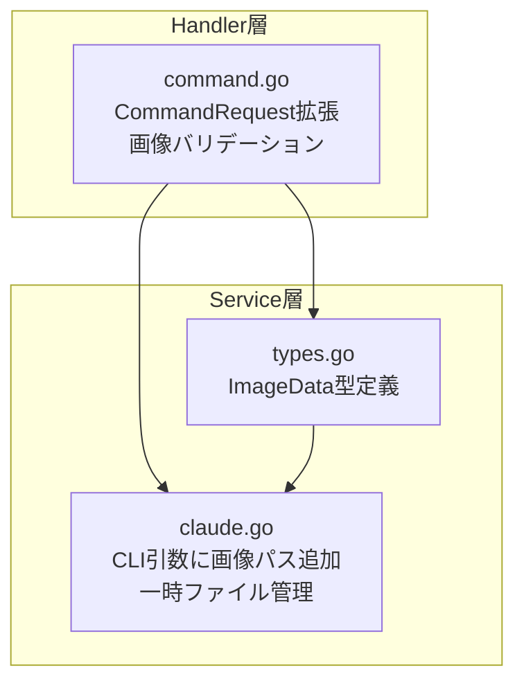
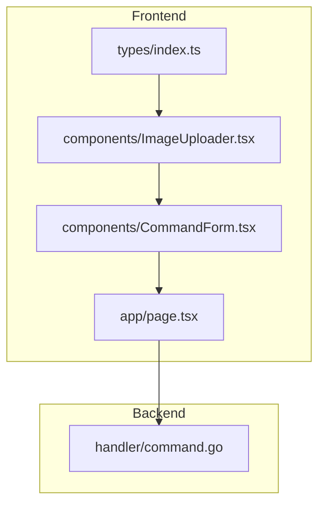

# 画像と文字の組み合わせ指示機能 実装計画

**作成日**: 2026-01-26
**ステータス**: 実装待ち

## 仕様サマリー

全コマンド（plan, research, discuss, fullstack, go, nextjs）で画像と文字を組み合わせた指示を可能にする。

- **入力形式**: テキスト + 画像（Base64エンコード）
- **画像枚数**: 最大5枚
- **画像制約**: 各5MB以下、JPEG/PNG/GIF/WebP対応
- **実装アプローチ**: Base64 + 構造化引数（MVP）

---

## バックエンド計画（Go）

### 修正範囲の全体像



### 変更ファイル一覧

| ファイル | 変更内容 | 影響度 |
|---------|---------|-------|
| `backend/internal/service/types.go` | ImageData 型、定数の追加 | 低 |
| `backend/internal/handler/command.go` | ImageData 型定義、CommandRequest に Images フィールド追加、バリデーション関数追加 | 中 |
| `backend/internal/service/claude.go` | ClaudeService インターフェースとクライアント実装の更新、一時ファイル保存処理追加 | 高 |

### 実装ステップ

#### Step 1: 定数とImageData 型定義（types.go）

**対象**: `/Users/user/Ghostrunner/backend/internal/service/types.go`

**追加するもの**:
- 定数 `MaxImageCount`: 最大画像枚数（5枚）
- 定数 `MaxImageSize`: 最大画像サイズ（5MB）
- 変数 `AllowedImageMimeTypes`: 許可する画像形式（JPEG, PNG, GIF, WebP）
- 型 `ImageData`: フィールド `Name`, `Data`, `MimeType`（JSONタグ: name, data, mimeType）

**注意点**:
- JSON タグは仕様書に合わせる（name, data, mimeType）
- CommandResult の後に配置

#### Step 2: Handler層の型定義とバリデーション（command.go）

**対象**: `/Users/user/Ghostrunner/backend/internal/handler/command.go`

**追加するもの**:
- 型 `ImageData`: フィールド `Name`, `Data`, `MimeType`（service層との結合を避けるため独自定義）
- 関数 `validateImages`: 画像のバリデーション（枚数、Base64デコード、サイズ、MIMEタイプ）
- 関数 `toServiceImages`: handler.ImageData を service.ImageData に変換

**修正するもの**:
- 型 `CommandRequest`: フィールド `Images []ImageData` を追加（JSONタグ: `json:"images,omitempty"`）
- 関数 `HandleStream`: 画像バリデーションの呼び出しを追加
- 関数 `Handle`: 画像バリデーションの呼び出しを追加

**注意点**:
- handler.ImageData と service.ImageData を分離することで、レイヤー間の結合を緩和
- 画像なしの場合は従来通り動作すること（後方互換性）
- `encoding/base64` パッケージをインポート

#### Step 3: ClaudeService インターフェースと実装（claude.go）

**対象**: `/Users/user/Ghostrunner/backend/internal/service/claude.go`

**追加するもの**:
- 関数 `saveImageToTemp`: Base64をデコードして一時ファイルに保存
- 関数 `mimeTypeToExt`: MIMEタイプから拡張子を取得

**修正するもの**:
- インターフェース `ClaudeService`: メソッド `ExecuteCommand` と `ExecuteCommandStream` に `images []ImageData` パラメータを追加
- 関数 `ExecuteCommandStream`: 画像の一時ファイル保存、Claude CLI に `--image` オプションで画像パスを追加、defer でクリーンアップ
- 関数 `ExecuteCommand`: 同上（非ストリーム版）

**注意点**:
- インターフェースと実装の両方を更新する必要がある
- 一時ファイルは defer で確実に削除（エラー時も含む）
- 早期リターン時もクリーンアップが実行されるように defer をスライスに対して使用
- `encoding/base64`, `os`, `path/filepath` パッケージをインポート

#### Step 4: Handler からの Service 呼び出し更新

**対象**: `/Users/user/Ghostrunner/backend/internal/handler/command.go`

**修正するもの**:
- 関数 `HandleStream`: `toServiceImages` で変換した画像を `ExecuteCommandStream` に渡す
- 関数 `Handle`: `toServiceImages` で変換した画像を `ExecuteCommand` に渡す

**注意点**:
- handler.ImageData から service.ImageData への変換を忘れずに行う

### 設計判断とトレードオフ

| 判断 | 選択した方法 | 理由 | 他の選択肢 |
|-----|------------|------|----------|
| 画像の渡し方 | Base64 + 一時ファイル | Claude CLI が `--image` オプションでファイルパスを受け取るため | 直接 stdin に渡す（CLI未対応） |
| 一時ファイルの配置 | os.TempDir() | OS標準の一時ディレクトリ、自動クリーンアップ対象 | プロジェクト内（不要ファイル残留リスク） |
| バリデーション位置 | Handler 層 | 早期にエラーを返しリソース消費を抑制 | Service 層（遅延検出） |

### 入力パターンの検証

| args | images | 期待動作 |
|------|--------|---------|
| あり | あり | テキスト + 画像を Claude CLI に渡す |
| あり | なし/空 | 従来通りテキストのみ（後方互換） |
| なし/空 | あり | エラー（args は必須のまま維持） |
| なし/空 | なし/空 | エラー（既存動作通り） |

### 懸念点と対応方針

#### 要確認（実装前に解決が必要）

| 懸念点 | 詳細 | 確認事項 |
|-------|------|---------|
| Claude CLI の画像オプション | 仕様書では `--image` オプションを想定 | `claude --help` で画像関連オプションを確認 |

#### 注意（実装時に考慮が必要）

| 懸念点 | 対応方針 |
|-------|---------|
| 一時ファイルの確実な削除 | executeCommandStream 内で defer + cleanup スライスで管理 |
| Base64 デコードエラー | validateImages でデコードテストを行い、不正なデータは早期拒否 |
| 画像なしリクエストの後方互換性 | images フィールドは omitempty、nil/空配列の場合は従来動作 |

---

## フロントエンド計画（Next.js）

### 修正範囲の全体像



### 変更ファイル一覧

| ファイル | 変更内容 | 影響度 |
|---------|---------|-------|
| `frontend/src/types/index.ts` | ImageData型、CommandRequest拡張 | 中 |
| `frontend/src/components/ImageUploader.tsx` | **新規作成** - 画像アップロードUI | 高 |
| `frontend/src/components/CommandForm.tsx` | ImageUploaderの組み込み | 中 |
| `frontend/src/app/page.tsx` | images状態管理、submit時の結合 | 中 |

### 実装ステップ

#### Step 1: 型定義の追加

**対象**: `frontend/src/types/index.ts`

**追加するもの**:
- 型 `ImageData`: フィールド `name`, `data`, `mimeType`

**修正するもの**:
- 型 `CommandRequest`: フィールド `images?: ImageData[]` を追加

#### Step 2: ImageUploaderコンポーネント作成

**対象**: `frontend/src/components/ImageUploader.tsx`（新規）

**追加するもの**:
- コンポーネント `ImageUploader`: Client Component（"use client"）
- Props: `images`, `onImagesChange`, `maxImages`, `maxSizePerImage`
- State: `error` (型: string)
- Ref: `fileInputRef` (型: HTMLInputElement)
- 関数 `handleFileSelect`: ファイル選択処理
- 関数 `fileToBase64`: FileReader API で Base64 変換
- 関数 `handleRemove`: 画像削除
- 関数 `handleDragOver`: ドラッグオーバー処理
- 関数 `handleDrop`: ドロップ処理

**UI要素**:
- ドロップゾーン（クリック可能）
- 非表示の input type="file"（multiple, accept指定）
- エラー表示
- 画像プレビュー（グリッド表示、削除ボタン付き）

**バリデーション**:
- 枚数制限（最大5枚）
- サイズ制限（各5MB以下）
- 形式制限（JPEG, PNG, GIF, WebP）
- 重複チェック（ファイル名で判定）

#### Step 3: CommandFormへの統合

**対象**: `frontend/src/components/CommandForm.tsx`

**追加するもの**:
- import: `ImageUploader` と `ImageData` 型

**修正するもの**:
- Props: `images: ImageData[]` と `onImagesChange: (images: ImageData[]) => void` を追加
- JSX: Args フィールドの後に `<ImageUploader />` を配置

**注意点**:
- 既存の CommandForm は `onXxxChange` 形式のイベントハンドラーを使用しているため、統一すること
- ImageUploader は Args フィールドの後、Submit ボタンの前に配置

#### Step 4: page.tsxでの状態管理

**対象**: `frontend/src/app/page.tsx`

**追加するもの**:
- import: `ImageData` 型
- State: `images` (型: `ImageData[]`)

**修正するもの**:
- 関数 `handleSubmit`: `executeCommandStream` の引数に `images: images.length > 0 ? images : undefined` を追加
- 関数 `handleSubmit` の依存配列: `images` を追加
- JSX: `<CommandForm />` に `images={images}` と `onImagesChange={setImages}` を追加
- 関数 `resetProgress` または `resetSession`: `setImages([])` を追加（オプション）

**注意点**:
- 既存の複雑な構造（カスタムフック、状態管理）を変更せず、最小限の追加のみ
- executeCommandStream は `@/lib/api` からインポート済み
- 送信完了後に images をクリアするかは、UX要件に応じて決定（現在は残す想定）

### 設計判断とトレードオフ

| 判断 | 選択した方法 | 理由 | 他の選択肢 |
|-----|------------|------|----------|
| 状態管理場所 | page.tsx（親） | 既存パターンに従う | CommandForm内（Props drilling が不要だが一貫性がない） |
| Base64変換タイミング | ファイル選択時 | プレビュー表示に必要、submit時に再変換不要 | submit時（メモリ効率は良いがプレビュー不可） |
| ドラッグ&ドロップ | 標準DOM API | 依存なし、シンプル | react-dropzone（過剰） |

### UI入力の組み合わせパターン

| ファイル選択 | テキスト(args) | 画像 | submit時の挙動 |
|------------|---------------|------|---------------|
| なし | あり | なし | args のみ送信（現状通り） |
| あり | なし | なし | selectedFile のみ送信（現状通り） |
| あり | あり | なし | selectedFile + args 結合（現状通り） |
| なし | あり | あり | args + images 送信 |
| あり | あり | あり | selectedFile + args + images 送信 |
| なし | なし | あり | **送信不可**（argsは必須のため） |

**結論**: 画像は args の補助情報として扱う。args が空の場合は画像があっても送信不可（既存バリデーション維持）。

### 懸念点と対応方針

#### 要確認（実装前に解決が必要）

| 懸念点 | 詳細 | 確認事項 |
|-------|------|---------|
| バックエンド未実装 | フロントエンドのみ先行実装して良いか | バックエンドが images を無視する場合、エラーにならないか確認（JSON の未知フィールドは無視されるため問題なし） |

#### 注意（実装時に考慮が必要）

| 懸念点 | 対応方針 |
|-------|---------|
| 大きな画像のBase64変換 | FileReader は非同期で自動的にメインスレッドをブロックしない |
| 複数画像の同時選択 | input に `multiple` 属性を付与 |
| 同じ画像の重複追加 | ファイル名 + サイズで重複チェック |

---

## 次回実装（MVP外）

以下はMVP範囲外とし、次回以降に実装：

### バックエンド
- マジックバイトによるファイル形式検証: MIMEタイプのみで十分
- 画像圧縮機能: クライアント側で対応
- 一時ファイルの定期クリーンアップジョブ: defer で都度削除するため不要

### フロントエンド
- 画像の並び替え（ドラッグ&ドロップ）: 順序はそこまで重要でない
- 画像圧縮: 5MB制限で運用可能
- クリップボードからの貼り付け: 便利機能

---

## レビュー結果と修正内容

### 実施したレビュー

計画書作成後、以下のレビューエージェントで技術的懸念を検証しました：
- `go-plan-reviewer`: バックエンド計画のレビュー
- `nextjs-plan-reviewer`: フロントエンド計画のレビュー

### 発見された Critical な懸念と対応

#### バックエンド

1. **インターフェース変更の影響範囲**: ClaudeService インターフェースのシグネチャ変更が必要
   - **対応**: インターフェース定義と実装の両方を更新するよう計画を修正

2. **型の配置場所による循環依存リスク**: handler から service の型を直接参照する設計
   - **対応**: handler.ImageData と service.ImageData を分離し、変換関数で対応

3. **Handle（非ストリーム）エンドポイントの更新漏れ**: HandleStream のみ言及
   - **対応**: Handle エンドポイントも更新対象として明記

4. **定数のハードコード**: バリデーション関数内に定数が埋め込まれている
   - **対応**: types.go で定数を一元管理するよう修正

5. **defer の不適切な使用**: ループ内での defer が正しく機能しない可能性
   - **対応**: defer でスライス全体をクリーンアップするパターンに修正

#### フロントエンド

1. **Props の命名規則不一致**: 計画書が既存の `onXxxChange` パターンと異なる
   - **対応**: 既存パターンに合わせて計画を修正

2. **page.tsx の構造理解不足**: 計画書の例が既存の複雑な構造と乖離
   - **対応**: 最小限の変更箇所のみを記載する形式に修正

3. **型定義の重複記載**: 既存の CommandRequest を再定義している
   - **対応**: 「既存定義への追加」として記述を修正

### その他の改善点

- エラー状態のクリアタイミングを明確化（handleRemove でもエラーをクリア）
- 送信完了後の画像状態の扱いを明記（オプションとして記載）

---

## 確認事項

以下の点についてご確認ください：

### バックエンド

1. **Claude CLI の画像オプション名**: `--image` で正しいですか？ `claude --help` で確認をお願いします
2. **args 必須ルールの維持**: 画像のみ（テキストなし）での実行を許可しますか？現計画では args 必須を維持しています

### フロントエンド

1. **バックエンド先行か同時か**: フロントエンドのみ先に実装して良いか？（バックエンドが images フィールドを無視する間は、画像は送信されるが処理されない状態になる）
2. **画像なしでもUIを常に表示するか**: ImageUploader を常に表示するか、トグルで表示/非表示を切り替えるか？（推奨: 常に表示、ただしコンパクトに）
3. **送信完了後の画像クリア**: コマンド実行完了後に images をクリアするか、保持するか？（推奨: 保持して再利用可能にする）

---

## 実装開始方法

確認後、以下のコマンドで実装を開始：
- 両方（フルスタック）: `/fullstack`
- Go バックエンドのみ: `/go`
- Next.js フロントエンドのみ: `/nextjs`

---

## バックエンド実装完了レポート

### 実装サマリー
- **実装日**: 2026-01-26
- **スコープ**: backend/ 配下のみ
- **変更ファイル数**: 6 files

### 変更ファイル一覧

| ファイル | 変更内容 |
|---------|---------|
| `backend/internal/service/types.go` | ImageData 型、画像関連定数（MaxImageCount, MaxImageSize, AllowedImageMimeTypes）の追加 |
| `backend/internal/handler/command.go` | handler層のImageData型定義、CommandRequestにImagesフィールド追加、validateImages/toServiceImages関数追加、Handle/HandleStreamで画像バリデーション呼び出し |
| `backend/internal/service/claude.go` | ClaudeServiceインターフェースにimagesパラメータ追加、saveImagesToTemp/mimeTypeToExt関数追加、ExecuteCommand/ExecuteCommandStreamで一時ファイル保存とCLI引数追加 |
| `backend/internal/service/doc.go` | 画像サポートのドキュメント追加（制約、使用例） |
| `backend/internal/handler/doc.go` | CommandHandlerの画像サポートに関するドキュメント追加 |
| `backend/docs/BACKEND_API.md` | API仕様書に画像関連のリクエスト/レスポンス形式、制約、バリデーションを追記 |

### 計画からの変更点

実装計画に記載がなかった判断・選択：

- 特になし（計画通りに実装）

### 実装時の課題

#### ビルド・テストで苦戦した点
- 特になし

#### 技術的に難しかった点
- 特になし

### 残存する懸念点

今後注意が必要な点：

- **フロントエンド未実装**: バックエンドのみ実装完了。フロントエンドは別途 `/nextjs` で実装が必要
- **Claude CLI の --image オプション確認**: 計画書に記載の通り、`claude --help` で画像オプションの存在を事前に確認することを推奨

### 動作確認フロー

```
1. バックエンドサーバーを起動
   make restart-backend-logs

2. 画像付きコマンドをPOSTリクエストで送信
   curl -X POST http://localhost:8080/api/command \
     -H "Content-Type: application/json" \
     -d '{
       "project": "/path/to/project",
       "command": "go",
       "args": "この画像を参考に実装してください",
       "images": [
         {
           "name": "screenshot.png",
           "data": "<Base64エンコードされた画像データ>",
           "mimeType": "image/png"
         }
       ]
     }'

3. 期待される動作:
   - 画像が一時ファイルとして保存される
   - Claude CLI が --image オプション付きで実行される
   - 実行完了後、一時ファイルが自動削除される
   - レスポンスにsession_id, output, completed等が返却される

4. バリデーションエラーの確認
   - 6枚以上の画像を送信 -> "画像は最大5枚までです" エラー
   - 5MB超の画像を送信 -> "画像X: サイズが5MBを超えています" エラー
   - 不正なMIMEタイプ -> "画像X: サポートされていない形式です" エラー
   - 不正なBase64 -> "画像X: Base64デコードに失敗しました" エラー
```

### デプロイ後の確認事項

- [ ] 画像付きリクエストが正常に処理されること
- [ ] 画像なしリクエストが従来通り動作すること（後方互換性）
- [ ] バリデーションエラーが適切に返却されること
- [ ] 一時ファイルがリクエスト完了後に削除されていること

---

## フロントエンド実装完了レポート

### 実装サマリー
- **実装日**: 2026-01-26
- **スコープ**: frontend/ 配下のみ
- **変更ファイル数**: 6 files

### 変更ファイル一覧

| ファイル | 変更内容 |
|---------|---------|
| `frontend/src/types/index.ts` | ImageData 型の追加、CommandRequest に images フィールド追加 |
| `frontend/src/components/ImageUploader.tsx` | **新規作成** - 画像アップロードコンポーネント（ドラッグ&ドロップ対応、プレビュー表示、バリデーション） |
| `frontend/src/components/CommandForm.tsx` | ImageUploader の組み込み、images/onImagesChange プロパティ追加 |
| `frontend/src/app/page.tsx` | images 状態管理の追加、handleSubmit での画像送信対応 |
| `frontend/docs/screens.md` | 画像アップロードエリアの仕様ドキュメント追加 |
| `frontend/docs/screen-flow.md` | 画像データを含む API 通信フローのドキュメント更新 |

### 計画からの変更点

実装計画に記載がなかった判断・選択：

- 特になし（計画通りに実装）

### 実装時の課題

#### ビルド・テストで苦戦した点
- 特になし

#### 技術的に難しかった点
- 特になし

### 残存する懸念点

今後注意が必要な点：

- **重複判定の精度**: 現在はファイル名と Base64 データ長で重複判定しているが、同名で内容が異なるファイルを正しく区別できない可能性がある。厳密な判定が必要な場合はハッシュ値での比較を検討
- **大量画像のメモリ使用**: 5枚 x 5MB = 最大25MBの画像データがブラウザメモリに保持される。低スペックデバイスでの挙動を確認することを推奨

### 動作確認フロー

```
1. フロントエンドサーバーを起動
   make restart-frontend-logs

2. ブラウザで http://localhost:3000 にアクセス

3. コマンド入力エリアで以下を確認:
   - Project Path を入力
   - Command を選択
   - Arguments を入力
   - 「Images (optional)」セクションが表示されていることを確認

4. 画像アップロード機能の確認:
   a. ドロップゾーンをクリックしてファイル選択ダイアログから画像を選択
   b. 画像をドラッグ&ドロップでアップロード
   c. 画像プレビューがグリッド表示されることを確認
   d. 画像にホバーして削除ボタン (x) で削除できることを確認
   e. 枚数カウント (0/5) が正しく更新されることを確認

5. バリデーションエラーの確認:
   - 6枚以上の画像を追加 -> 「画像は最大5枚までです」エラー
   - 5MBを超える画像を追加 -> 「ファイル名: サイズが5MBを超えています」エラー
   - 非対応形式（例: .bmp）を追加 -> 「ファイル名: サポートされていない形式です」エラー

6. コマンド実行（バックエンド実装済みの場合）:
   - 画像付きでコマンドを実行
   - ネットワークタブで images フィールドが送信されていることを確認
```

### デプロイ後の確認事項

- [ ] 画像アップロードUIが正常に表示されること
- [ ] ドラッグ&ドロップで画像が追加できること
- [ ] ファイル選択ダイアログから画像が追加できること
- [ ] 画像プレビューが正しく表示されること
- [ ] 画像削除ボタンが機能すること
- [ ] バリデーションエラーが適切に表示されること
- [ ] Execute Command 時に images データがリクエストに含まれること
- [ ] 画像なしでも従来通りコマンド実行できること（後方互換性）
