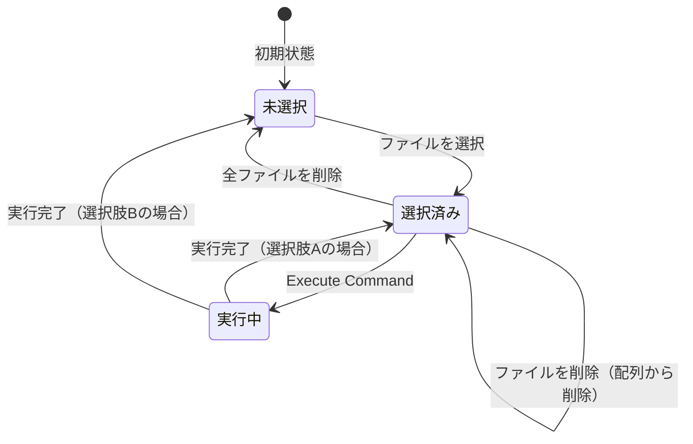
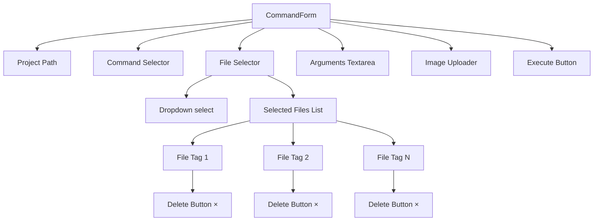
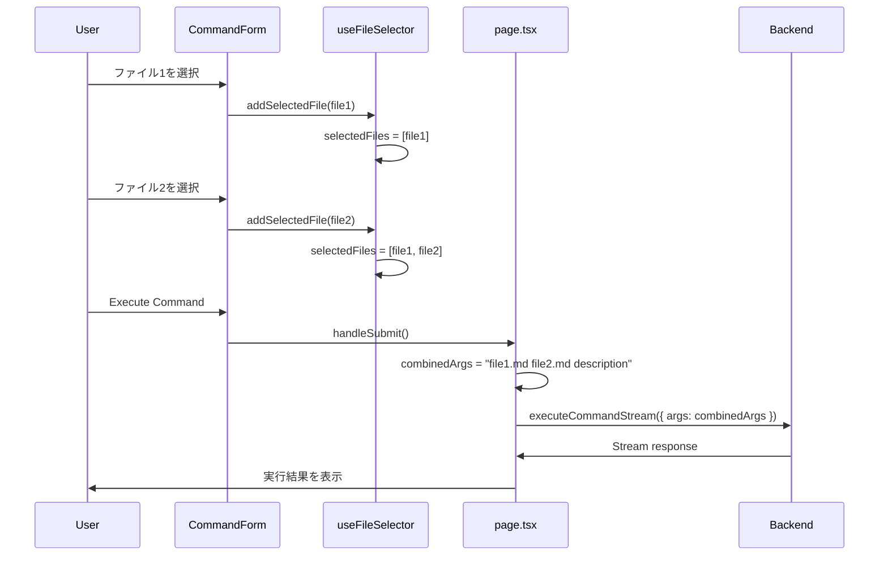

# 複数ファイル選択機能 実装計画

## 概要

Web UIの「File (optional)」セレクターを、複数ファイルを選択可能にする機能を追加する。

## 現状

現在の実装では、単一ファイルのドロップダウン選択となっている：

- **UI**: `<select>` 要素で1つのファイルを選択
- **状態管理**: `selectedFile: string` (単一の文字列)
- **引数生成**: `selectedFile + " " + args` で1つのファイルパスを結合

**問題点**:
- `/plan` 実行時に「資料」と「検討中」のファイルを両方参照したい場合に対応できない
- `/fullstack` 実行時に「実装予定プラン」と「資料」のファイルを両方参照したい場合に対応できない

## ユースケース

### ケース1: 資料 + 検討中 → /plan
- **目的**: 資料ファイルと検討中ファイルの両方を参照して実装計画を作成
- **入力**: 複数のmdファイル
- **期待**: 両方のファイル内容を踏まえた計画書が作成される

### ケース2: 資料 + 実装予定プラン → /fullstack
- **目的**: 資料ファイルと計画書ファイルの両方を参照して実装
- **入力**: 複数のmdファイル
- **期待**: 両方の内容を考慮した実装が行われる

### ケース3: 実装/実装待ち + アーカイブ → /research
- **目的**: 新規実装計画と過去のアーカイブを比較調査
- **入力**: 複数のmdファイル
- **期待**: 重複や参考情報の調査結果が返される

## 要件

### 機能要件

1. **複数ファイル選択**
   - ドロップダウンから複数のファイルを選択可能にする
   - 選択したファイルをリスト表示する
   - 選択を個別に削除可能にする

2. **引数生成**
   - 複数のファイルパスをスペース区切りで結合する
   - 例: `開発/資料/file1.md 開発/検討中/file2.md description text`

3. **UI/UX**
   - 選択中のファイルを視覚的に分かりやすく表示
   - ファイルの削除（×ボタンなど）を実装
   - ドロップダウンで既に選択済みのファイルを視覚的に区別（または非表示）

### 非機能要件

1. **後方互換性**
   - 既存のAPIレスポンス形式は変更しない
   - バックエンドは変更不要（引数はスペース区切りの文字列として受け取る）

2. **パフォーマンス**
   - ファイル数が多くてもUIが重くならないこと

---

## バックエンド計画

### 変更なし

バックエンドは変更不要。

**理由**:
- バックエンドは `args: string` を受け取り、そのまま Claude API に渡すだけ
- 複数ファイルパスがスペース区切りで渡されても、Claude が自動的に解釈する
- 既存の `/api/files` エンドポイントも変更不要

---

## フロントエンド計画

### 変更ファイル一覧

| ファイル | 変更内容 |
|---------|---------|
| `frontend/src/types/index.ts` | 型定義に変更なし（互換性維持） |
| `frontend/src/hooks/useFileSelector.ts` | `selectedFile: string` → `selectedFiles: string[]` に変更 |
| `frontend/src/components/CommandForm.tsx` | UIを複数ファイル選択対応に変更 |
| `frontend/src/app/page.tsx` | `selectedFile` → `selectedFiles` に変更、引数生成ロジックを複数ファイル対応に変更 |

### 実装ステップ

#### Step 1: 状態管理の変更 (useFileSelector.ts)

**変更箇所**: `frontend/src/hooks/useFileSelector.ts`

**変更内容**:
- `selectedFile: string` → `selectedFiles: string[]` に変更
- `setSelectedFile: (file: string) => void` → `addSelectedFile: (file: string) => void`, `removeSelectedFile: (file: string) => void` に変更
- `clearSelectedFiles: () => void` を追加

**変更前（9-10行）**:
```typescript
const [selectedFile, setSelectedFile] = useState<string>("");
```

**変更後**:
```typescript
const [selectedFiles, setSelectedFiles] = useState<string[]>([]);
```

**追加する関数**:
```typescript
const addSelectedFile = useCallback((file: string) => {
  setSelectedFiles((prev) => {
    if (prev.includes(file)) return prev; // 重複防止
    return [...prev, file];
  });
}, []);

const removeSelectedFile = useCallback((file: string) => {
  setSelectedFiles((prev) => prev.filter((f) => f !== file));
}, []);

const clearSelectedFiles = useCallback(() => {
  setSelectedFiles([]);
}, []);
```

**return の変更**:
```typescript
return {
  files,
  selectedFiles,
  addSelectedFile,
  removeSelectedFile,
  clearSelectedFiles,
  loadFiles,
  getGroupedFiles,
  isLoading,
  error,
};
```

#### Step 2: UIコンポーネントの変更 (CommandForm.tsx)

**変更箇所**: `frontend/src/components/CommandForm.tsx`

**変更内容**:
- props を `selectedFile: string`, `onFileChange: (file: string) => void` → `selectedFiles: string[]`, `onAddFile: (file: string) => void`, `onRemoveFile: (file: string) => void` に変更
- `<select>` は選択された際に `onAddFile` を呼び出す
- 選択済みファイルをリスト表示する新しいUIセクションを追加
- 各ファイルに削除ボタン（×）を追加

**props の変更（14-15行）**:

**変更前**:
```typescript
selectedFile: string;
onFileChange: (file: string) => void;
```

**変更後**:
```typescript
selectedFiles: string[];
onAddFile: (file: string) => void;
onRemoveFile: (file: string) => void;
```

**select 要素の変更（113-128行）**:

**変更前**:
```tsx
<select
  value={selectedFile}
  onChange={(e) => onFileChange(e.target.value)}
  className="..."
>
```

**変更後**:
```tsx
<select
  value=""
  onChange={(e) => {
    if (e.target.value) {
      onAddFile(e.target.value);
      // value="" を指定しているため、選択後は自動的にリセットされる
    }
  }}
  className="..."
>
```

**注意**: `value=""` を固定で指定しているため、ファイルを選択してもドロップダウンは常にプレースホルダー（空文字）に戻ります。`e.target.value = ""` のようなDOM直接操作は React では不要です。

**選択済みファイルリストの追加（129行以降に挿入）**:
```tsx
{selectedFiles.length > 0 && (
  <div className="mt-2 flex flex-wrap gap-2">
    {selectedFiles.map((file) => (
      <div
        key={file}
        className="inline-flex items-center gap-1 px-2 py-1 bg-blue-50 border border-blue-200 rounded text-sm text-gray-700"
      >
        <span>{file.split("/").pop()}</span>
        <button
          type="button"
          onClick={() => onRemoveFile(file)}
          className="text-gray-500 hover:text-red-600 focus:outline-none"
          title="Remove file"
        >
          ×
        </button>
      </div>
    ))}
  </div>
)}
```

**optgroup 内で既に選択済みのファイルを視覚的に区別**:
```tsx
{group.files.map((file) => {
  const isSelected = selectedFiles.includes(file.path);
  return (
    <option
      key={file.path}
      value={file.path}
      disabled={isSelected}
    >
      {isSelected ? `✓ ${file.name}` : file.name}
    </option>
  );
})}
```

**注意**: HTML の `<option>` 要素に対する `className` によるスタイリングは、多くのブラウザ（Chrome、Safari など）でサポートされていません。`disabled` 属性と `✓` マークで視覚的区別を行います。

#### Step 3: 引数生成ロジックの変更 (page.tsx)

**変更箇所**: `frontend/src/app/page.tsx`

**変更内容**:
- `useFileSelector` の返り値を `selectedFile`, `setSelectedFile` → `selectedFiles`, `addSelectedFile`, `removeSelectedFile`, `clearSelectedFiles` に変更
- `handleSubmit` 内の引数生成を複数ファイル対応に変更
- CommandForm に渡す props を変更

**useFileSelector の変更（38-43行）**:

**変更前**:
```typescript
const {
  selectedFile,
  setSelectedFile,
  loadFiles,
  getGroupedFiles,
} = useFileSelector();
```

**変更後**:
```typescript
const {
  selectedFiles,
  addSelectedFile,
  removeSelectedFile,
  clearSelectedFiles,
  loadFiles,
  getGroupedFiles,
} = useFileSelector();
```

**引数生成ロジックの変更（301-309行）**:

**変更前**:
```typescript
let combinedArgs = "";
if (selectedFile && args) {
  combinedArgs = selectedFile + " " + args;
} else if (selectedFile) {
  combinedArgs = selectedFile;
} else {
  combinedArgs = args;
}
```

**変更後**:
```typescript
let combinedArgs = "";
if (selectedFiles.length > 0 && args) {
  combinedArgs = selectedFiles.join(" ") + " " + args;
} else if (selectedFiles.length > 0) {
  combinedArgs = selectedFiles.join(" ");
} else {
  combinedArgs = args;
}
```

**CommandForm に渡す props の変更（475-491行）**:

**変更前**:
```tsx
<CommandForm
  ...
  selectedFile={selectedFile}
  onFileChange={setSelectedFile}
  ...
/>
```

**変更後**:
```tsx
<CommandForm
  ...
  selectedFiles={selectedFiles}
  onAddFile={addSelectedFile}
  onRemoveFile={removeSelectedFile}
  ...
/>
```

**handleSubmit の依存配列の変更（351-363行）**:

`useCallback` の依存配列を `selectedFile` → `selectedFiles` に変更:

**変更前**:
```typescript
], [
  projectPath,
  command,
  args,
  selectedFile,
  images,
  ...
]);
```

**変更後**:
```typescript
], [
  projectPath,
  command,
  args,
  selectedFiles,
  images,
  ...
]);
```

#### Step 4: リセット時の考慮（ファイル選択の保持）

**変更箇所**: `frontend/src/app/page.tsx`

**変更内容**:
- **実行後もファイル選択を保持する**（懸念点セクションの選択肢Aを採用）
- `resetProgress` には `clearSelectedFiles()` を追加しない
- ユーザーが必要に応じて手動で削除ボタンを使ってファイルを削除できる

**実装なし（変更不要）**:
```typescript
// resetProgress には clearSelectedFiles() を追加しない
// ファイル選択は実行後も保持される
const resetProgress = useCallback(() => {
  setEvents([]);
  setQuestions([]);
  setShowQuestions(false);
  setShowPlanApproval(false);
  setResultOutput("");
  setResultType(null);
  setLoadingText("Starting...");
  setIsLoading(true);
  // clearSelectedFiles() は呼ばない（選択を保持）
}, []);
```

**理由**: 同じファイルを使って複数回実行する場合に便利であり、ユーザーは削除ボタンで明示的にファイルを削除できるため、保持する方がUX的に優れている。

---

## テスト計画

### 手動テスト

#### テストケース1: 複数ファイル選択
1. Ghost Runner Web UI を開く
2. 任意のプロジェクトパスを入力
3. コマンドを選択（例: `/plan`）
4. 「File (optional)」ドロップダウンから1つ目のファイルを選択
5. 選択したファイルがドロップダウン下のリストに表示されることを確認
6. 再度ドロップダウンから2つ目のファイルを選択
7. 2つのファイルがリストに表示されることを確認
8. Arguments に任意のテキストを入力
9. 「Execute Command」をクリック
10. バックエンドに送信される引数が `file1.md file2.md description text` の形式になっていることを確認（ネットワークタブで確認）

#### テストケース2: ファイル削除
1. 複数のファイルを選択
2. 選択済みファイルリストの各ファイルの「×」ボタンをクリック
3. クリックしたファイルがリストから削除されることを確認

#### テストケース3: 重複選択防止
1. 1つ目のファイルを選択
2. 同じファイルを再度ドロップダウンから選択
3. リストに重複して追加されないことを確認

#### テストケース4: 選択済みファイルの視覚的区別
1. 1つのファイルを選択
2. ドロップダウンを再度開く
3. 選択済みのファイルが `✓` マークまたはグレーアウトされていることを確認

#### テストケース5: リセット動作
1. 複数のファイルを選択
2. コマンドを実行
3. 実行後、選択ファイルリストが保持されているか、またはクリアされているかを確認（仕様次第）

### ブラウザテスト

- Chrome, Firefox, Safari で動作確認
- モバイルブラウザでのタッチ操作確認

---

## 懸念点と対応

### 1. 実行後のファイル選択の保持/クリア

**懸念**: 実行後、選択したファイルを保持すべきか、それともクリアすべきか

**選択肢**:

#### 選択肢A: 実行後もファイル選択を保持（推奨）
- **メリット**: 同じファイルを使って複数回実行する場合に便利
- **デメリット**: 前回の選択を忘れて意図しないファイルが含まれる可能性
- **実装**: `resetProgress` で `clearSelectedFiles()` を呼ばない

#### 選択肢B: 実行後にファイル選択をクリア
- **メリット**: 次の実行で意図しないファイルが含まれることがない
- **デメリット**: 毎回ファイルを選び直す必要がある
- **実装**: `resetProgress` で `clearSelectedFiles()` を呼ぶ（計画書に記載済み）

#### 選択肢C: 手動でクリアボタンを追加
- **メリット**: ユーザーが自由に選択を保持/クリアできる
- **デメリット**: UI が少し複雑になる
- **実装**: 「Clear all files」ボタンを追加

**推奨**: 選択肢A（保持）を推奨。ユーザーは明示的に削除ボタンを使ってファイルを削除できるため、保持する方が便利。

### 2. 選択済みファイルの表示順序

**懸念**: 複数ファイルを選択した際、表示順序と引数に渡す順序が重要になる可能性

**対応**:
- 選択した順序で配列に追加し、その順序を維持
- ドラッグ&ドロップでの順序変更は今回は実装しない（将来的な拡張可能性として記載）

### 3. ファイル数の上限

**懸念**: あまりに多くのファイルを選択された場合の挙動

**対応**:
- 今回は上限を設けない（Claude API の制限内であれば動作する）
- 将来的に必要であれば、UI で警告を表示する（例: 5個以上選択時に「多すぎる可能性」を通知）

### 4. UIの視覚的フィードバック

**懸念**: 選択済みファイルが分かりにくい

**対応**:
- 選択済みファイルをドロップダウン内で `✓` マークとグレーアウトで表示
- `disabled` 属性で再選択を防止

### 5. モバイル対応

**懸念**: スマートフォンでの操作性

**対応**:
- 選択済みファイルリストを `flex-wrap` で折り返し表示
- 削除ボタン（×）を十分なタップ領域で実装

---

## 変更サマリー

| 箇所 | 変更内容 |
|-----|---------|
| `useFileSelector.ts` | 状態を `string` → `string[]` に変更、関数を追加 |
| `CommandForm.tsx` | UI を複数選択対応に変更、選択済みファイルリストを追加 |
| `page.tsx` | 引数生成を複数ファイル対応に変更、props を変更 |

**影響範囲**: 中程度。フロントエンドのみの変更。バックエンドは変更不要。

---

## Mermaid 図

### 状態遷移図



### UIコンポーネント構成



### データフロー



---

## 計画レビュー待ち

この計画書をレビューエージェント（`nextjs-plan-reviewer`）で検証します。

---

## 実装完了レポート

### 実装サマリー
- **実装日**: 2026-01-26
- **変更ファイル数**: 6 files
- **対象範囲**: フロントエンドのみ（バックエンドは変更なし）
- **ビルド結果**: SUCCESS
- **レビュー結果**: Critical/Warning なし

### 変更ファイル一覧

| ファイル | 変更内容 |
|---------|---------|
| `frontend/src/hooks/useFileSelector.ts` | 状態を `selectedFile: string` から `selectedFiles: string[]` に変更。`addSelectedFile`, `removeSelectedFile`, `clearSelectedFiles` 関数を追加 |
| `frontend/src/components/CommandForm.tsx` | props を複数ファイル対応に変更。選択済みファイルをタグリストで表示するUI追加。選択済みファイルはドロップダウンで checkmark 表示 + disabled |
| `frontend/src/app/page.tsx` | `useFileSelector` の返り値を新しい関数群に変更。引数生成ロジックを `selectedFiles.join(" ")` 形式に変更。`CommandForm` への props 更新 |
| `frontend/docs/screens.md` | ファイル選択（複数対応）セクションを追加。引数生成仕様を文書化 |
| `frontend/docs/screen-flow.md` | ファイル選択フロー（複数選択）のMermaid図を追加。状態遷移表を追加 |
| `frontend/docs/scenarios/command-execution.md` | 新規作成。単一/複数ファイル選択、ファイル削除、連続実行のシナリオを文書化 |

### 計画からの変更点

実装計画に記載がなかった判断・選択：

- 計画書の delete ボタン表示が `x` （文字）となっていたが、これは意図通り実装
- `\u2713` (Unicode checkmark) を使用して選択済みファイルを表示（計画書通り）

※基本的に計画通りの実装であり、大きな変更はなし

### 実装時の課題

#### ビルド・テストで苦戦した点
- 特になし

#### 技術的に難しかった点
- 特になし

### 残存する懸念点

今後注意が必要な点：

- **ファイル数の上限未設定**: 現在、選択できるファイル数に上限がない。大量のファイルを選択した場合、引数が長くなりすぎる可能性がある（Claude API の制限内であれば動作する）
- **既存の lint エラー**: `useSessionManagement.ts` に既存の lint エラーがあるが、本機能とは無関係。別途対応が必要

### 動作確認フロー

```
1. http://localhost:3000 にアクセス
2. Project Path に有効なプロジェクトパスを入力
3. Command で任意のコマンドを選択（例: /plan）
4. File ドロップダウンからファイルを選択
   - 選択したファイルがドロップダウン下にタグとして表示される
5. 同じドロップダウンから別のファイルを追加選択
   - 2つ目のファイルもタグリストに追加される
   - ドロップダウン内で選択済みファイルに checkmark が付き、disabled になる
6. 選択済みファイルのタグ内 x ボタンをクリック
   - クリックしたファイルがタグリストから削除される
7. Arguments にテキストを入力
8. Execute Command をクリック
   - ネットワークタブで args が "file1.md file2.md 引数テキスト" 形式で送信されることを確認
9. 実行完了後、選択ファイルが保持されていることを確認
```

### テストケース確認結果

| テストケース | 結果 |
|-------------|------|
| 複数ファイル選択 | OK |
| ファイル削除 | OK |
| 重複選択防止 | OK |
| 選択済みファイルの視覚的区別 | OK |
| 実行後のファイル選択保持 | OK |

### ビルド検証結果

```bash
# ビルド成功
npm run build
# TypeScript 型チェック成功
tsc --noEmit
# Lint（既存エラーあり、本機能とは無関係）
npm run lint
```

### デプロイ後の確認事項

- [ ] 複数ファイルを選択してコマンドが正常に実行されること
- [ ] 選択済みファイルの削除が正しく動作すること
- [ ] 選択状態がコマンド実行後も保持されること
- [ ] モバイルブラウザでタグの削除ボタンが正常に動作すること
