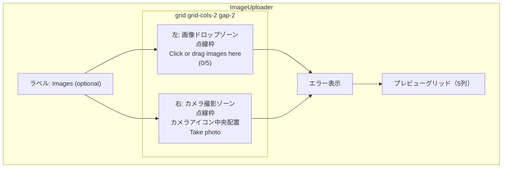

# ImageUploader カメラ撮影ゾーン追加 実装計画

## フロントエンド計画

### 1. 仕様サマリー

`ImageUploader.tsx` のドロップゾーンを横2分割し、左半分に既存の画像アップロード機能、右半分にカメラ撮影ゾーンを追加する。カメラ撮影ゾーンはHTML5の `capture` 属性を使い、モバイルではデバイスカメラを起動する。撮影した画像は既存の `images` 配列に追加され、既存バリデーションがそのまま適用される。

### 2. 変更後レイアウト

### 3. 変更ファイル一覧

| ファイル | 変更内容 | 影響度 |
|---------|---------|-------|
| `frontend/src/components/ImageUploader.tsx` | ドロップゾーンを横2分割、カメラ撮影ゾーン追加 | 中 |

変更は1ファイルのみ。

### 4. 実装ステップ

#### Step 1: カメラ用のref・ハンドラー追加

**対象**: `frontend/src/components/ImageUploader.tsx`

**追加するもの**:
- Ref: `cameraInputRef` (`useRef<HTMLInputElement>`)
- 関数: `handleCameraClick` - `cameraInputRef.current?.click()` を呼ぶ（既存の `handleZoneClick` と同パターン）
- 関数: `handleCameraCapture` - `onChange` ハンドラー。既存の `processFiles` を呼び出し、input の value をリセット（既存の `handleFileSelect` と同パターン）

#### Step 2: ドロップゾーンを横2分割レイアウトに変更

- 既存のドロップゾーンをラッパー `div` で囲み、`grid grid-cols-2 gap-2` で横2分割
- 左側: 既存のドロップゾーンをそのまま配置（`onDragOver` / `onDrop` は左側のみに付与。カメラゾーンへのドラッグ&ドロップは受け付けない）
- 右側: カメラ撮影ゾーンを新規追加（クリック操作専用）
  - 同じ点線枠スタイル（`border-2 border-dashed border-gray-300 rounded-lg p-4`）
  - hidden の `<input type="file" accept="image/*" capture="environment">`（`multiple` は不要、1枚ずつ撮影）
  - カメラアイコン（SVGインライン）を中央配置（`flex items-center justify-center`）
  - `onClick` で `handleCameraClick` を呼び出し
  - ホバースタイルは既存と統一（`hover:border-blue-400 hover:bg-blue-50 transition-colors`）

#### Step 3: カメラアイコンのSVG実装

- SVGインラインで実装（24x24、`text-gray-400`）
- プロジェクトにアイコンライブラリは未導入のため、インラインSVGが最適
- SVGの下にテキスト「Take photo」を表示（`text-gray-500 text-sm`）

### 5. 設計判断とトレードオフ

| 判断 | 選択した方法 | 理由 | 他の選択肢 |
|-----|------------|------|----------|
| アイコン実装 | SVGインライン | ライブラリ未導入、1アイコンのため追加は過剰 | lucide-react導入（過剰）、テキストのみ（視認性低下） |
| capture属性 | `capture="environment"` | 背面カメラが書類撮影に適している（データ復旧サービスの業務用途） | `capture="user"`（前面カメラ、自撮り向け） |
| レスポンシブ | 常に横2分割（`grid-cols-2`） | 両ゾーンとも最小限のコンテンツで、モバイルでも横2分割で十分な幅がある | モバイル縦並び（不要な複雑化） |
| カメラ入力のmultiple | なし（1枚ずつ） | `capture` 属性使用時は1回の撮影で1枚が自然 | multiple付き（captureとの併用は挙動が不定） |

### 6. 懸念点と対応方針

| 懸念点 | 対応方針 |
|-------|---------|
| `capture` 属性はデスクトップブラウザで無視される | デスクトップでは通常のファイル選択ダイアログが開くだけでフォールバック済み。特別な対応不要 |
| カメラ撮影画像のMIMEタイプ | `accept="image/*"` で広く受け、既存の `ALLOWED_TYPES` バリデーションで非対応形式は弾く |
| 両ゾーンの高さ揃え | grid レイアウトのデフォルト `align-items: stretch` で自動的に揃う |
| カメラ入力のvalue リセット | `handleFileSelect` と同じパターンで `e.target.value = ""` をリセットし、同じ画像の再撮影を可能にする |
| カメラ撮影画像のファイル名重複 | モバイルOSはカメラ撮影画像に `image.jpg` 等の汎用名を付ける場合がある。既存の `isDuplicate` は名前+サイズで判定するため、同名・同サイズの異なる画像が重複と誤判定される可能性が低確率であるが、MVP段階では許容する |
| 枚数上限到達時のカメラゾーン | 5枚到達時もカメラゾーンはクリック可能だが、`processFiles` 内のバリデーションでエラーメッセージが表示される。MVP段階ではこの挙動で十分 |
| 小画面での左側テキスト折り返し | 320px幅の画面では左側テキストが折り返されるが、gridの `stretch` で高さが自動調整されるため許容する |
