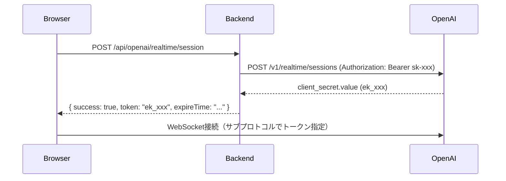
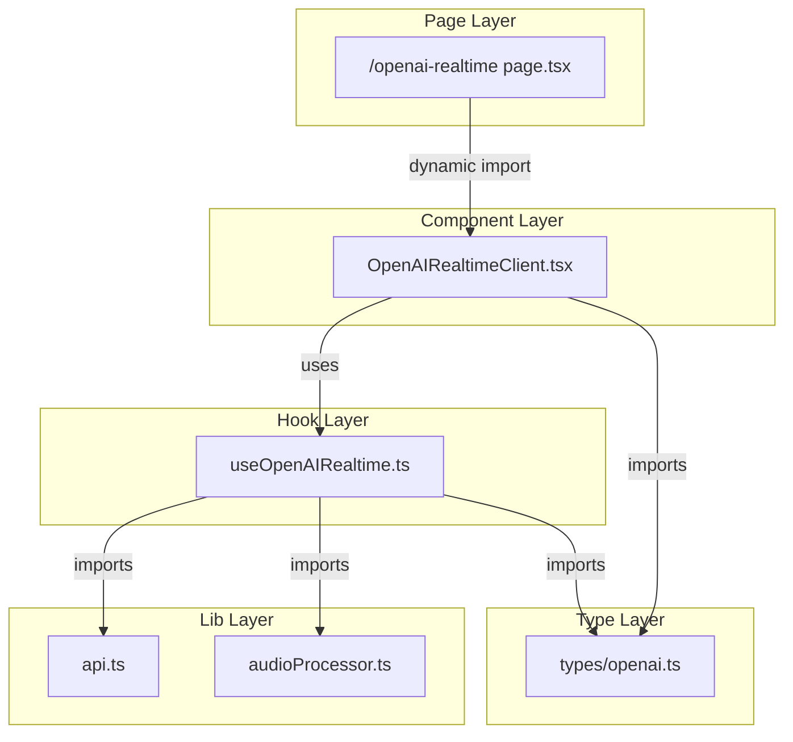
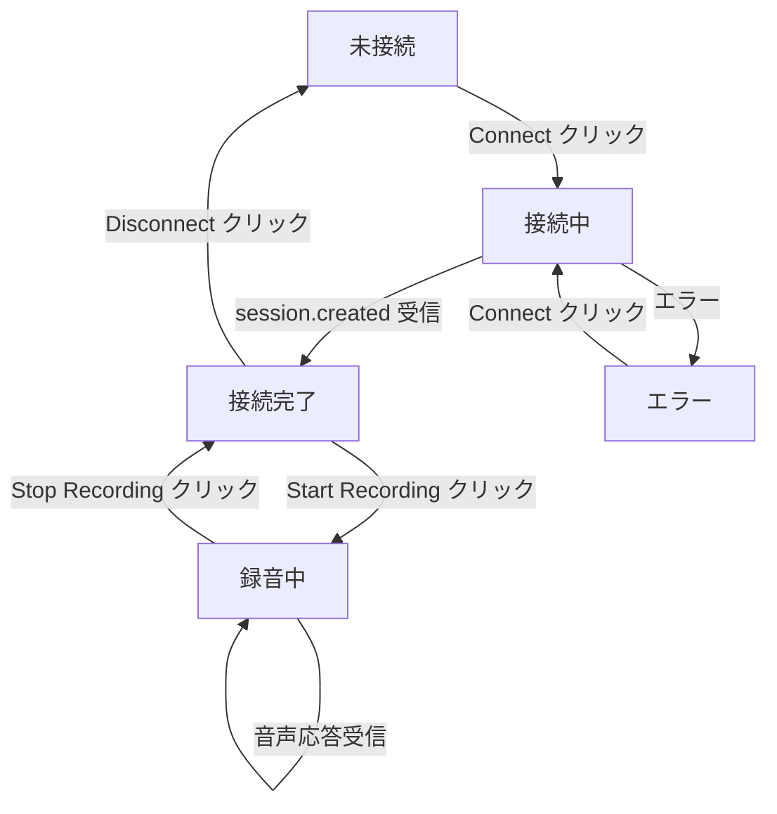

# OpenAI Realtime 音声対話 実装計画

## 概要

OpenAI Realtime API を使用したリアルタイム音声対話機能を実装する。既存の Gemini Live 実装と同様のパターンで、独立したページ・コンポーネントとして実装（案C: MVP優先）。

**背景**: 既存のGemini Live音声対話機能に加えて、OpenAI Realtime APIを使用した音声対話機能を実装することで、ユーザーに選択肢を提供する。

**音声フォーマットの違い**:
| API | 入力 | 出力 |
|-----|------|------|
| Gemini Live | 16kHz, 16-bit PCM | 24kHz, 16-bit PCM |
| OpenAI Realtime | 24kHz, 16-bit PCM | 24kHz, 16-bit PCM |

---

## バックエンド計画

### 1. 概要

OpenAI Realtime API用のエフェメラルキー発行エンドポイントを実装する。

- **エンドポイント**: `POST /api/openai/realtime/session`
- **目的**: フロントエンドがOpenAI Realtime APIへWebSocket接続する際に必要な一時的なエフェメラルキー（`ek_xxx`形式）を発行
- **参考実装**: 既存の `POST /api/gemini/token` と同様のパターン

#### 認証フロー



### 2. 懸念点と解決策

| 懸念点 | 対応方針 |
|-------|---------|
| OpenAI APIのレスポンス形式 | 公式ドキュメントに従い、`client_secret.value` を抽出 |
| APIキー未設定時の挙動 | Geminiと同様に `nil` を返し、ハンドラーで 503 を返す |
| HTTPリクエストのタイムアウト | `http.Client{Timeout: 10 * time.Second}` を使用 |
| エラーレスポンスの形式 | OpenAI APIのエラー形式（`error.message`）をパースし、適切なエラーメッセージを返す |
| モデル・ボイスのバリデーション | OpenAI API にそのまま渡し、エラーハンドリングは OpenAI のレスポンスに委ねる |

**OpenAI エラーレスポンス形式**:
```json
{
  "error": {
    "message": "Invalid API key",
    "type": "invalid_request_error",
    "code": "invalid_api_key"
  }
}
```

### 3. 変更ファイル一覧

| ファイル | 変更内容 | 影響度 |
|---------|---------|-------|
| `backend/internal/service/openai.go` | 新規作成: OpenAIServiceインターフェースと実装 | 中 |
| `backend/internal/service/types.go` | 追加: OpenAISessionResult型 | 低 |
| `backend/internal/handler/openai.go` | 新規作成: OpenAIHandlerとHandleSession関数 | 中 |
| `backend/cmd/server/main.go` | 追加: OpenAIService生成とルーティング登録 | 低 |
| `backend/docs/BACKEND_API.md` | 追加: APIドキュメント | 低 |

### 4. 実装ステップ

#### Step 1: 型定義の追加

**対象**: `backend/internal/service/types.go`

**追加するもの**:
- 型 `OpenAISessionResult`: フィールド `Token`, `ExpireTime`

**注意点**:
- 既存の `GeminiTokenResult` と命名規則を統一（`Token`, `ExpireTime`）

#### Step 2: OpenAIServiceの作成

**対象**: `backend/internal/service/openai.go`（新規作成）

**追加するもの**:
- インターフェース `OpenAIService`: メソッド `CreateRealtimeSession`
- 構造体 `openaiServiceImpl`: フィールド `apiKey`, `httpClient`
- 関数 `NewOpenAIService`: 環境変数 `OPENAI_API_KEY` を読み取り、未設定時は `nil` を返す
- メソッド `CreateRealtimeSession`: OpenAI `/v1/realtime/sessions` APIを呼び出しエフェメラルキーを取得

**注意点**:
- SDKは使用しない（HTTPリクエストで直接呼び出す）
- OpenAI APIのエンドポイント: `https://api.openai.com/v1/realtime/sessions`
- リクエストボディ: `{ "model": "gpt-4o-realtime-preview-2024-12-17", "voice": "verse" }`
- 認証ヘッダー: `Authorization: Bearer sk-xxx`
- レスポンスから `client_secret.value` を抽出
- HTTPクライアント: `http.Client{Timeout: 10 * time.Second}` を使用

#### Step 3: OpenAIHandlerの作成

**対象**: `backend/internal/handler/openai.go`（新規作成）

**追加するもの**:
- 型 `OpenAISessionRequest`: フィールド `Model`, `Voice`（いずれもオプション）
- 型 `OpenAISessionResponse`: フィールド `Success`, `Token`, `ExpireTime`, `Error`
- 構造体 `OpenAIHandler`: フィールド `openaiService`
- 関数 `NewOpenAIHandler`
- メソッド `HandleSession`: `POST /api/openai/realtime/session` を処理

**注意点**:
- サービスが `nil` の場合は 503 Service Unavailable を返す
- リクエストボディは空でも許容（デフォルト値を使用）
- レスポンスのJSONフィールド名は既存のGemini APIと統一（`token`, `expireTime`）

#### Step 4: main.goへの統合

**対象**: `backend/cmd/server/main.go`

**修正するもの**:
- `NewOpenAIService()` 呼び出しを追加
- `NewOpenAIHandler(openaiService)` 呼び出しを追加
- ルーティング追加: `api.POST("/openai/realtime/session", openaiHandler.HandleSession)`

#### Step 5: ドキュメント更新

**対象**: `backend/docs/BACKEND_API.md`

**追加するもの**:
- OpenAI API セクション
- `POST /api/openai/realtime/session` の仕様

### 5. API仕様

#### POST /api/openai/realtime/session

OpenAI Realtime API用のエフェメラルキーを発行する。

##### リクエスト

```json
{
    "model": "gpt-4o-realtime-preview-2024-12-17",
    "voice": "verse"
}
```

| フィールド | 型 | 必須 | 説明 |
|-----------|-----|------|------|
| `model` | string | No | 使用するモデル。デフォルト: `gpt-4o-realtime-preview-2024-12-17` |
| `voice` | string | No | 音声タイプ。デフォルト: `verse` |

##### レスポンス（成功）

```json
{
    "success": true,
    "token": "ek_xxx...",
    "expireTime": "2026-01-27T12:00:00Z"
}
```

**注意**: フィールド名は既存のGemini API（`/api/gemini/token`）と統一。

##### レスポンス（エラー）

```json
{
    "success": false,
    "error": "エラーメッセージ"
}
```

##### HTTPステータスコード

| コード | 説明 |
|--------|------|
| 200 | 正常完了 |
| 400 | リクエスト不正 |
| 500 | セッション作成に失敗（OpenAI API エラー） |
| 503 | OPENAI_API_KEY 未設定 |

### 6. 設定・環境変数

| 環境変数 | 説明 | 必須 |
|----------|------|------|
| `OPENAI_API_KEY` | OpenAI APIキー（sk-xxx形式） | 機能利用時のみ |

---

## フロントエンド計画

### 1. 概要

OpenAI Realtime API を使用したリアルタイム音声対話機能を実装する。既存の Gemini Live 実装と同等の機能を持つが、音声フォーマットとWebSocket認証方式が異なる点に注意が必要。

### 2. 懸念点と解決策

| 懸念点 | 対応方針 |
|-------|---------|
| 音声入力サンプルレート | OpenAI は 24kHz を要求。AudioContext 作成時のサンプルレートを変更 |
| AudioWorklet の共有 | 既存の `audio-worklet-processor.js` はサンプルレート非依存のため、そのまま流用可能 |
| 型定義の重複 | Gemini と OpenAI で似た構造だが別の型として定義。共通化は過剰設計のため行わない |
| WebSocket認証方法 | ブラウザではヘッダー設定不可のため、サブプロトコルでトークン指定 |

#### WebSocket接続の認証方式

ブラウザの WebSocket API は直接ヘッダーを設定できないため、OpenAI Realtime API ではサブプロトコルにエフェメラルキーを含める方式を使用する。

```typescript
const OPENAI_REALTIME_WS_URL = "wss://api.openai.com/v1/realtime";

// 接続時
const url = `${OPENAI_REALTIME_WS_URL}?model=${encodeURIComponent(model)}`;
const ws = new WebSocket(url, [
  "realtime",
  `openai-insecure-api-key.${ephemeralToken}`
]);
```

参考: [OpenAI Realtime API ドキュメント](https://platform.openai.com/docs/guides/realtime-websocket)

#### 設計判断

| 判断 | 選択した方法 | 理由 | 他の選択肢 |
|-----|------------|------|----------|
| コンポーネント設計 | Gemini版をコピーして修正 | 構造が同じで分かりやすい | 共通コンポーネント抽出（過剰） |
| API関数配置 | `lib/api.ts` に追加 | 既存パターンに従う | 別ファイル（不要な分割） |
| 型定義配置 | `types/openai.ts` を新規作成 | Gemini と同様の構成 | `types/index.ts` に追加（肥大化を避ける） |

### 3. 変更ファイル一覧

| ファイル | 変更内容 | 影響度 |
|---------|---------|-------|
| `frontend/src/types/openai.ts` | 新規作成: OpenAI Realtime API 用型定義 | 中 |
| `frontend/src/hooks/useOpenAIRealtime.ts` | 新規作成: WebSocket接続・音声処理フック | 高 |
| `frontend/src/components/OpenAIRealtimeClient.tsx` | 新規作成: UIコンポーネント | 高 |
| `frontend/src/app/openai-realtime/page.tsx` | 新規作成: ページエントリーポイント | 低 |
| `frontend/src/lib/api.ts` | 修正: トークン取得関数追加 | 低 |
| `frontend/docs/screens.md` | 修正: 画面一覧にページ追加 | 低 |

**注**: `audioProcessor.ts` の修正は不要。既存の関数は汎用的で、サンプルレートは引数で指定可能。

### 4. 実装ステップ

#### Step 1: 型定義の作成

**対象**: `frontend/src/types/openai.ts`

**追加するもの**:

**接続状態・設定**:
- 型 `OpenAIConnectionStatus`: `"disconnected"`, `"connecting"`, `"connected"`, `"error"`
- 型 `OpenAIRealtimeConfig`: `model?`, `voice?`, `instructions?`, `modalities?`

**クライアント -> サーバー（送信用）**:
- 型 `OpenAISessionUpdate`: `type: "session.update"`, `session`
- 型 `OpenAIInputAudioBufferAppend`: `type: "input_audio_buffer.append"`, `audio`

**サーバー -> クライアント（受信用）**:
- 型 `OpenAISessionCreatedEvent`: `type: "session.created"`, `session`
- 型 `OpenAIResponseAudioDeltaEvent`: `type: "response.audio.delta"`, `delta`
- 型 `OpenAIErrorEvent`: `type: "error"`, `error`
- 型 `OpenAIServerEvent`: Union型（上記の受信イベント群）

**バックエンドAPI連携**:
- 型 `OpenAITokenResponse`: `success`, `token?`, `expireTime?`, `error?`

**型ガード関数**:
- `isSessionCreated`, `isResponseAudioDelta`, `isOpenAIError`

**MVPで処理するイベント**:
- `session.created`: 接続完了
- `response.audio.delta`: 音声データ
- `error`: エラー

#### Step 2: API関数の追加

**対象**: `frontend/src/lib/api.ts`

**追加するもの**:
- 関数 `fetchOpenAIRealtimeToken`: エフェメラルトークン取得

**仕様**:
- 戻り値: `Promise<string>`（token を返す）
- エラー時: `Error` を throw
- 既存の `fetchGeminiToken` と同じパターン

#### Step 3: カスタムフックの作成

**対象**: `frontend/src/hooks/useOpenAIRealtime.ts`

**追加するもの**:
- フック `useOpenAIRealtime`
- State: `connectionStatus`, `isRecording`, `error`
- Refs: `wsRef`, `audioContextRef`, `inputAudioContextRef`, `streamRef`, `audioQueueRef`
- 関数: `connect`, `disconnect`, `startRecording`, `stopRecording`

**定数定義**:
```typescript
const OPENAI_REALTIME_WS_URL = "wss://api.openai.com/v1/realtime";
const INPUT_SAMPLE_RATE = 24000;  // OpenAI要件
const OUTPUT_SAMPLE_RATE = 24000; // OpenAI要件
```

**Gemini版との違い**:
- WebSocket URL: `wss://api.openai.com/v1/realtime?model=xxx`
- WebSocket認証: サブプロトコル `["realtime", "openai-insecure-api-key.{token}"]`
- 入力サンプルレート: 24kHz（Gemini は 16kHz）
- setup メッセージ形式: `session.update` イベント
- サーバーメッセージ形式: `response.audio.delta` 等

**session.update メッセージ形式**:
```typescript
{
  type: "session.update",
  session: {
    modalities: ["text", "audio"],
    instructions: "You are a helpful assistant.",
    voice: "verse"
  }
}
```

**エラーケースと対応メッセージ**:
- トークン取得失敗: "Failed to get ephemeral token"
- WebSocket接続失敗: "Failed to connect to OpenAI Realtime API"
- マイク権限拒否: "Microphone permission denied"
- 録音開始失敗: "Failed to start recording: {詳細}"
- APIエラー: "OpenAI API error: {message}"

#### Step 4: UIコンポーネントの作成

**対象**: `frontend/src/components/OpenAIRealtimeClient.tsx`

**追加するもの**:
- コンポーネント `OpenAIRealtimeClient`
- ヘルパー関数: `getStatusColor`, `getStatusText`

**構成**:
- `"use client"` ディレクティブ（Client Component）
- `useOpenAIRealtime` フックを使用
- Gemini版と同じUI構造（タイトル、接続状態、ボタン、使い方説明）

#### Step 5: ページの作成

**対象**: `frontend/src/app/openai-realtime/page.tsx`

**追加するもの**:
- ページコンポーネント `OpenAIRealtimePage`
- `dynamic` インポートで SSR 無効化（ブラウザ API 使用のため）

#### Step 6: ドキュメント更新

**対象**: `frontend/docs/screens.md`

**修正するもの**:
- ページ一覧テーブルに `/openai-realtime` を追加

### 5. コンポーネント構成



**責務**:
- `page.tsx`: SSR無効化、コンポーネントのエントリーポイント
- `OpenAIRealtimeClient`: UI表示、ユーザーインタラクション処理
- `useOpenAIRealtime`: WebSocket接続、音声入出力、状態管理
- `api.ts`: トークン取得のHTTPリクエスト
- `audioProcessor.ts`: 音声フォーマット変換（既存関数を使用）
- `types/openai.ts`: 型定義と型ガード

### 6. 型定義

#### `types/openai.ts`

| 型名 | フィールド | 用途 |
|-----|----------|------|
| `OpenAIConnectionStatus` | `"disconnected"`, `"connecting"`, `"connected"`, `"error"` | 接続状態 |
| `OpenAIRealtimeConfig` | `model?`, `voice?`, `instructions?`, `modalities?` | 設定 |
| `OpenAISessionUpdate` | `type: "session.update"`, `session` | 送信: セッション設定 |
| `OpenAIInputAudioBufferAppend` | `type: "input_audio_buffer.append"`, `audio` | 送信: 音声データ |
| `OpenAISessionCreatedEvent` | `type: "session.created"`, `session` | 受信: 接続完了 |
| `OpenAIResponseAudioDeltaEvent` | `type: "response.audio.delta"`, `delta` | 受信: 音声データ |
| `OpenAIErrorEvent` | `type: "error"`, `error` | 受信: エラー |
| `OpenAIServerEvent` | Union型（受信イベント群） | 受信メッセージ |
| `OpenAITokenResponse` | `success`, `token?`, `expireTime?`, `error?` | バックエンドAPI |

### 7. 画面仕様

#### ページURL

`/openai-realtime`

#### UI要素

| 要素 | 役割 |
|-----|------|
| タイトル | "OpenAI Realtime" の表示 |
| 接続状態インジケーター | 色付きドット + テキスト |
| エラー表示 | エラーメッセージ（エラー時のみ） |
| 接続ボタン | Connect / Disconnect |
| マイクボタン | Start Recording / Stop Recording |
| 使い方説明 | 3ステップの操作手順 |

#### ユーザー操作フロー



---

## 次回実装（MVP外）

以下はMVP範囲外とし、次回以降に実装：
- プロバイダー切り替えUI
- 抽象化レイヤーの導入（案Bへの移行）
- 音声のテキスト表示（文字起こし）
- ツール呼び出し対応（function calling）
- 音声選択UI（voice パラメータ変更）
- 会話履歴の保存機能
- その他のOpenAIイベント対応（`session.updated`, `response.done`, `input_audio_buffer.speech_started` 等）

---

## 実装順序

1. **バックエンド**: Step 1〜5 を順に実装
2. **フロントエンド**: Step 1〜6 を順に実装

バックエンドの `/api/openai/realtime/session` が完成してからフロントエンドのテストを行う。

---

## 参考リンク

- [OpenAI Realtime API WebSocket ガイド](https://platform.openai.com/docs/guides/realtime-websocket)
- [OpenAI Realtime API リファレンス](https://platform.openai.com/docs/api-reference/realtime)
- [OpenAI Client Secrets](https://platform.openai.com/docs/api-reference/realtime-sessions)

---

## バックエンド実装レポート

### 実装サマリー

- **実装日**: 2026-01-27
- **実装範囲**: バックエンド（`backend/` 配下）
- **変更ファイル数**: 7 files

OpenAI Realtime API用のエフェメラルキー発行エンドポイント `POST /api/openai/realtime/session` を実装した。既存のGemini API実装パターンを踏襲し、一貫したアーキテクチャで設計。

### 変更ファイル一覧

| ファイル | 変更種別 | 変更内容 |
|---------|----------|---------|
| `backend/internal/service/types.go` | 追記 | `OpenAISessionResult` 型を追加（Token, ExpireTime フィールド） |
| `backend/internal/service/openai.go` | 新規作成 | OpenAIService インターフェースと実装。エフェメラルキー発行ロジック |
| `backend/internal/handler/openai.go` | 新規作成 | OpenAIHandler。リクエスト/レスポンス型定義とHTTPハンドラー |
| `backend/cmd/server/main.go` | 修正 | OpenAIService/Handler の初期化とルーティング追加 |
| `backend/docs/BACKEND_API.md` | 追記 | API仕様ドキュメント追加 |
| `backend/internal/service/doc.go` | 修正 | パッケージドキュメントに OpenAIService の説明を追加 |
| `backend/internal/handler/doc.go` | 修正 | パッケージドキュメントに OpenAIHandler の説明を追加 |

### API仕様の要約

#### POST /api/openai/realtime/session

OpenAI Realtime API用のエフェメラルキー（ek_xxx形式）を発行する。

**リクエスト:**
```json
{
    "model": "gpt-4o-realtime-preview-2024-12-17",  // オプション
    "voice": "verse"                                // オプション
}
```

**レスポンス（成功）:**
```json
{
    "success": true,
    "token": "ek_xxx...",
    "expireTime": "2026-01-27T12:00:00Z"
}
```

**HTTPステータス:**
| コード | 説明 |
|--------|------|
| 200 | 正常完了 |
| 400 | リクエスト不正 |
| 500 | OpenAI API エラー |
| 503 | OPENAI_API_KEY 未設定 |

### 計画からの変更点

特になし。計画書通りに実装した。

### 実装時の課題

特になし。既存のGemini API実装パターンを参考に、スムーズに実装できた。

### 残存する懸念点

- **API キー管理**: `OPENAI_API_KEY` 環境変数が未設定の場合、サービスが nil を返す設計。フロントエンドで適切なエラーハンドリングが必要
- **トークン有効期限**: OpenAI のエフェメラルキーは発行から1分程度で失効する。フロントエンド側で接続前に毎回取得する必要がある

### 動作確認手順

#### 1. 環境変数の設定

```bash
export OPENAI_API_KEY="sk-xxx..."
```

#### 2. バックエンドの起動

```bash
make restart-backend-logs
```

起動ログに以下が表示されることを確認:
```
[OpenAIService] Initialized with OpenAI API
```

#### 3. API疎通確認

```bash
# リクエスト送信
curl -X POST http://localhost:8080/api/openai/realtime/session \
  -H "Content-Type: application/json" \
  -d '{}'

# 期待されるレスポンス
{
  "success": true,
  "token": "ek_...",
  "expireTime": "2026-01-27T12:34:56Z"
}
```

#### 4. パラメータ指定の確認

```bash
curl -X POST http://localhost:8080/api/openai/realtime/session \
  -H "Content-Type: application/json" \
  -d '{"model": "gpt-4o-realtime-preview-2024-12-17", "voice": "alloy"}'
```

#### 5. API キー未設定時の確認

```bash
# 環境変数を削除してサーバー再起動
unset OPENAI_API_KEY
make restart-backend-logs

# リクエスト送信
curl -X POST http://localhost:8080/api/openai/realtime/session

# 期待されるレスポンス（503 Service Unavailable）
{
  "success": false,
  "error": "OpenAI サービスが利用できません"
}
```

### 次のステップ

~~フロントエンド実装に進む~~ → 完了

---

## フロントエンド実装レポート

### 実装サマリー

- **実装日**: 2026-01-27
- **実装範囲**: フロントエンド（`frontend/` 配下）
- **変更ファイル数**: 6 files

OpenAI Realtime API を使用したリアルタイム音声対話のフロントエンド機能を実装した。既存の Gemini Live 実装と同様のパターンで、型定義・カスタムフック・UIコンポーネント・ページを作成。

### 変更ファイル一覧

| ファイル | 変更種別 | 変更内容 |
|---------|----------|---------|
| `frontend/src/types/openai.ts` | 新規作成 | OpenAI Realtime API 用型定義（接続状態、送受信イベント、型ガード関数） |
| `frontend/src/hooks/useOpenAIRealtime.ts` | 新規作成 | WebSocket 接続・音声入出力・状態管理フック |
| `frontend/src/components/OpenAIRealtimeClient.tsx` | 新規作成 | 音声 AI インターフェースの UI コンポーネント |
| `frontend/src/app/openai-realtime/page.tsx` | 新規作成 | ページエントリーポイント（SSR 無効化） |
| `frontend/src/lib/api.ts` | 修正 | `fetchOpenAIRealtimeToken` 関数を追加 |
| `frontend/docs/screens.md` | 修正 | ページ一覧に `/openai-realtime` を追加、OpenAI Realtime ページセクションを追加 |

### Gemini Live 版との主な違い

| 項目 | Gemini Live | OpenAI Realtime |
|-----|------------|-----------------|
| WebSocket URL | Gemini API エンドポイント | `wss://api.openai.com/v1/realtime` |
| 認証方式 | URL にトークンを含める | サブプロトコルにエフェメラルキーを含める |
| 入力サンプルレート | 16kHz | 24kHz |
| 出力サンプルレート | 24kHz | 24kHz |
| セットアップメッセージ | Gemini 独自形式 | `session.update` イベント |
| 音声データ受信 | Gemini 独自形式 | `response.audio.delta` イベント |
| VAD（音声区間検出） | クライアント側 | サーバー側（`server_vad`） |
| 音声入力処理 | AudioWorklet | ScriptProcessorNode |

### 計画からの変更点

- **AudioWorklet → ScriptProcessorNode**: AudioWorklet を使用する計画だったが、24kHz サンプルレートでの互換性を考慮し ScriptProcessorNode を採用
- **追加イベント型**: `session.updated` と `response.audio.done` イベントの型を追加（MVP範囲で処理に活用）

### 残存する懸念点

- **ScriptProcessorNode の非推奨**: ScriptProcessorNode は Web Audio API で非推奨。将来的に AudioWorklet への移行を検討
- **エフェメラルキーの有効期限**: OpenAI のエフェメラルキーは約1分で失効するため、接続前に毎回取得が必要
- **同時再生の競合**: 出力用 AudioContext の遅延作成により、入力用 AudioContext との競合を回避しているが、エッジケースの検証が必要

### 動作確認手順

1. バックエンドを起動（`OPENAI_API_KEY` 環境変数が設定されていること）
2. フロントエンドを起動
3. ブラウザで `/openai-realtime` にアクセス
4. "Connect" をクリックして接続
5. "Start Recording" をクリックしてマイク入力開始
6. 音声で話しかけると AI の音声応答が再生される
