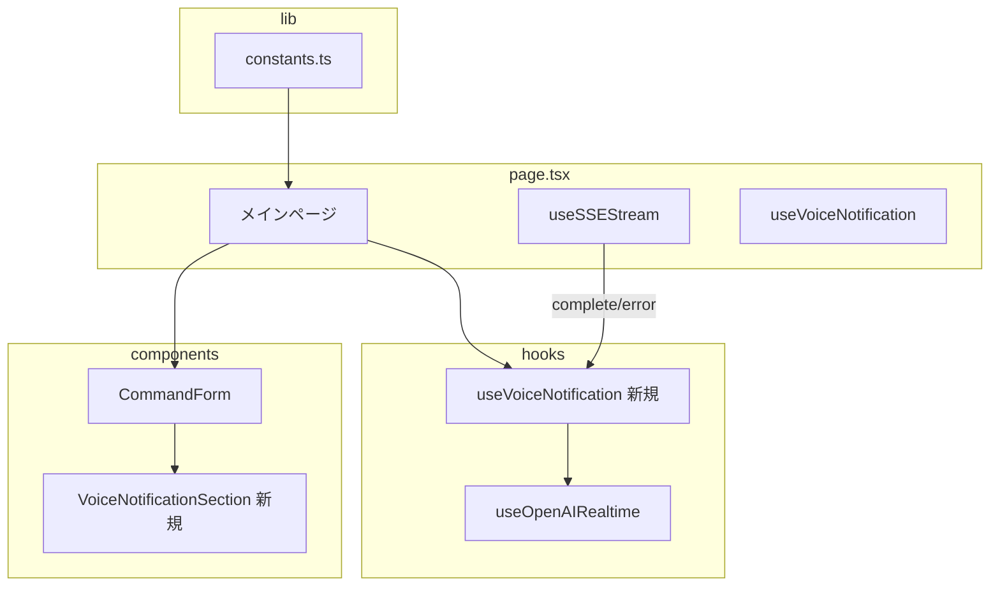

# 音声通知統合 実装計画

## 仕様書

`開発/検討中/2026-01-31_音声通知統合.md` の「案A: MVP」を実装する。

## 1. 仕様サマリー

Ghostrunnerの処理（plan/command実行）完了時に、OpenAI Realtime APIを使って音声で通知する機能を追加する。

**機能要件**:
- メインページ（`page.tsx`）にトグルを追加
- トグルONで Realtime API に自動接続
- 処理完了/エラー発生時に音声で通知
- マイクボタンを押すと対話モードに移行可能
- エフェメラルキー有効期限切れ時の自動再接続

**UI配置**:
- 既存の「PR workflow」トグルの隣に「音声通知」トグルを配置
- 接続状態インジケーター（ドット）をトグル横に表示
- マイクボタンは進捗表示エリア内に配置

## 2. 修正範囲の全体像



## 3. 変更ファイル一覧

| ファイル | 変更内容 | 影響度 |
|---------|---------|-------|
| `frontend/src/hooks/useOpenAIRealtime.ts` | `sendText` 関数追加、自動再接続ロジック追加 | 中 |
| `frontend/src/hooks/useVoiceNotification.ts` | 新規作成: 音声通知ロジックをカプセル化 | 中 |
| `frontend/src/components/VoiceNotificationSection.tsx` | 新規作成: トグル + 接続状態 + マイクボタン | 低 |
| `frontend/src/components/CommandForm.tsx` | VoiceNotificationSection の組み込み | 低 |
| `frontend/src/app/page.tsx` | フック使用、完了/エラー時の通知呼び出し | 中 |
| `frontend/src/lib/constants.ts` | localStorage キー追加 | 低 |
| `frontend/src/types/openai.ts` | conversation.item.create の型追加 | 低 |

## 4. 実装ステップ

### Step 1: 型定義の追加

**対象**: `frontend/src/types/openai.ts`

**追加するもの**:

1. **`OpenAIConversationItemCreate`**: テキストメッセージ追加用
   - `type`: `"conversation.item.create"`
   - `item.type`: `"message"`
   - `item.role`: `"user"`
   - `item.content`: `[{ type: "input_text", text: string }]`

2. **`OpenAIResponseCreate`**: 音声レスポンス生成要求用
   - `type`: `"response.create"`

### Step 2: useOpenAIRealtime の拡張

**対象**: `frontend/src/hooks/useOpenAIRealtime.ts`

**追加するもの**:

1. **関数 `sendText(message: string)`**: テキストメッセージを送信し、AIに音声で応答させる
   - 手順:
     1. `conversation.item.create` でユーザーメッセージを追加
     2. `response.create` でAIの音声応答を要求
   - 接続中でない場合は何もしない

2. **自動再接続ロジック**:
   - WebSocket切断時に新しいトークンを取得して再接続
   - 最大3回、指数バックオフ（1秒、2秒、4秒）

3. **ref `reconnectAttemptRef`**: 再接続試行回数の管理

4. **ref `shouldReconnectRef`**: 意図的な切断かどうかのフラグ

**修正するもの**:
- `ws.onclose` ハンドラ: `shouldReconnectRef` が true なら自動再接続
- `disconnect` 関数: `shouldReconnectRef` を false に設定してから切断
- 戻り値: `sendText` を追加

### Step 3: useVoiceNotification フックの作成

**対象**: `frontend/src/hooks/useVoiceNotification.ts`（新規）

**追加するもの**:

1. **フック `useVoiceNotification`**: 音声通知機能をカプセル化

2. **State**:
   - `enabled`: boolean（トグル状態）
   - `connectionStatus`: OpenAIConnectionStatus
   - `isRecording`: boolean
   - `error`: string | null

3. **通知キュー**:
   - `pendingNotificationsRef`: `Array<{ type: 'completion' | 'error', message: string }>`
   - 再接続中に通知が発生した場合はキューに追加
   - 接続完了時にキューを順次処理

4. **関数**:
   - `setEnabled(enabled: boolean)`: トグル状態を変更（true で接続、false で切断）
   - `notifyCompletion(summary: string)`: 完了通知を送信（200文字に切り詰め）
   - `notifyError(error: string)`: エラー通知を送信（200文字に切り詰め）
   - `startRecording()`: マイク入力を開始
   - `stopRecording()`: マイク入力を停止

5. **localStorage 連携**: トグル状態の永続化（キー: `LOCAL_STORAGE_VOICE_NOTIFICATION_KEY`）

6. **戻り値**:
   ```typescript
   {
     enabled: boolean;
     setEnabled: (enabled: boolean) => void;
     connectionStatus: OpenAIConnectionStatus;
     isRecording: boolean;
     error: string | null;
     notifyCompletion: (summary: string) => void;
     notifyError: (error: string) => void;
     startRecording: () => Promise<void>;
     stopRecording: () => void;
   }
   ```

### Step 4: VoiceNotificationSection コンポーネントの作成

**対象**: `frontend/src/components/VoiceNotificationSection.tsx`（新規）

**追加するもの**:
- コンポーネント `VoiceNotificationSection`: トグル + 接続状態インジケーター + マイクボタン

**Props**:
```typescript
{
  enabled: boolean;
  onEnabledChange: (enabled: boolean) => void;
  connectionStatus: OpenAIConnectionStatus;
  isRecording: boolean;
  error: string | null;
  onStartRecording: () => void;
  onStopRecording: () => void;
}
```

**UI構成**:
- トグルスイッチ（既存の gitWorkflow トグルと同じスタイル）
- 接続状態ドット:
  - 灰: `disconnected`
  - 黄: `connecting`
  - 緑: `connected`
  - 赤: `error`
- マイクボタン（録音中は赤く表示）
- エラー時のツールチップ表示

### Step 5: CommandForm の修正

**対象**: `frontend/src/components/CommandForm.tsx`

**修正するもの**:

1. **Props に音声通知関連を追加**:
   ```typescript
   voiceNotificationEnabled: boolean;
   onVoiceNotificationChange: (enabled: boolean) => void;
   voiceConnectionStatus: OpenAIConnectionStatus;
   voiceIsRecording: boolean;
   voiceError: string | null;
   onVoiceStartRecording: () => void;
   onVoiceStopRecording: () => void;
   ```

2. **VoiceNotificationSection を PR workflow トグルの後に配置**

### Step 6: page.tsx の統合

**対象**: `frontend/src/app/page.tsx`

**追加するもの**:

1. **`useVoiceNotification` フックの使用**

2. **`handleVoiceNotificationChange` コールバック**: トグル変更時に `setEnabled` を呼び出し

3. **`handleStreamEvent` の `complete` ケース**: `notifyCompletion` 呼び出し
   - `result.output` を渡す

4. **`handleError` コールバック修正**: `notifyError` 呼び出し

5. **CommandForm に音声通知関連の props を渡す**

### Step 7: constants.ts の更新

**対象**: `frontend/src/lib/constants.ts`

**追加するもの**:
- 定数 `LOCAL_STORAGE_VOICE_NOTIFICATION_KEY`: `"ghostrunner_voice_notification"`

## 5. 設計判断とトレードオフ

| 判断 | 選択した方法 | 理由 | 他の選択肢 |
|-----|------------|------|----------|
| フック分離 | `useVoiceNotification` を新規作成 | page.tsx の肥大化防止、責務分離 | page.tsx に直接実装（コード膨張） |
| トグル配置 | CommandForm 内 | 既存 UI パターンとの一貫性 | ヘッダーに配置（操作位置が分散） |
| マイクボタン配置 | ProgressContainer 内 | 処理完了後に対話するため近い方が自然 | CommandForm 内（コンテキスト離れる） |
| 再接続戦略 | 最大3回、指数バックオフ | 無限リトライ防止、サーバー負荷軽減 | 即時再接続（サーバー負荷増） |
| 通知メッセージ | 完了時に結果サマリーを読み上げ | ユーザーが状況を即座に把握可能 | 固定メッセージ（情報量不足） |

## 6. 懸念点と対応方針

### 要確認（実装前に解決が必要）

| 懸念点 | 詳細 | 対応 |
|-------|------|------|
| 通知メッセージの内容 | `complete` イベントの `result.output` が長すぎる可能性 | `notifyCompletion` 関数内で冒頭200文字に切り詰め |

### 注意（実装時に考慮が必要）

| 懸念点 | 対応方針 |
|-------|---------|
| エフェメラルキー有効期限（約1分） | `ws.onclose` で自動再接続を実装 |
| 再接続中の通知 | 再接続中はキューに溜め、接続完了後に送信 |
| ブラウザバックグラウンド時 | WebSocket は維持されるが、音声再生は制限される可能性 |
| 音声通知と手動対話の競合 | isRecording 中は自動通知を抑制 |

## 7. 次回実装（MVP外）

以下はMVP範囲外とし、次回以降に実装：

- **会話履歴表示**: 過去の通知と会話のログ表示
- **音声コマンド**: 「承認して」「キャンセル」などの音声操作
- **複数AI対応**: OpenAI / Gemini の切り替え
- **接続維持用ping**: 30秒ごとの空メッセージ送信（必要性を検証後）

---

## 8. 実装完了レポート

### 実装サマリー
- **実装日**: 2026-01-31
- **変更ファイル数**: 7 files
- **実装範囲**: フロントエンドのみ

Ghostrunner の処理完了/エラー発生時に OpenAI Realtime API を使って音声で通知する機能を追加した。トグルスイッチで機能のON/OFFを切り替え、ONの場合は自動的にAPIに接続する。マイクボタンを押すと対話モードに移行可能。

### 変更ファイル一覧

| ファイル | 変更内容 |
|---------|---------|
| `frontend/src/types/openai.ts` | `OpenAIConversationItemCreate` と `OpenAIResponseCreate` 型を追加 |
| `frontend/src/lib/constants.ts` | `LOCAL_STORAGE_VOICE_NOTIFICATION_KEY` 定数を追加 |
| `frontend/src/hooks/useOpenAIRealtime.ts` | `sendText` 関数追加、自動再接続ロジック（最大3回、指数バックオフ）を実装 |
| `frontend/src/hooks/useVoiceNotification.ts` | 新規作成: 音声通知ロジックをカプセル化、通知キュー管理 |
| `frontend/src/components/VoiceNotificationSection.tsx` | 新規作成: トグル + 接続状態インジケーター + マイクボタンのUIコンポーネント |
| `frontend/src/components/CommandForm.tsx` | 音声通知関連のProps追加、VoiceNotificationSection を組み込み |
| `frontend/src/app/page.tsx` | `useVoiceNotification` フック使用、完了/エラー時に `notifyCompletion`/`notifyError` を呼び出し |

### 計画からの変更点

特になし。計画通りに実装を完了した。

### 実装時の課題

特になし。既存の `useOpenAIRealtime` フックをベースに拡張したため、WebSocket接続や音声再生の基盤が整っており、スムーズに実装できた。

### 残存する懸念点

- **エフェメラルキーの有効期限**: 約1分で期限切れになるため、長時間放置した場合に再接続が発生する。自動再接続ロジックは実装済みだが、ユーザー体験への影響は実運用で確認が必要
- **ブラウザバックグラウンド時の音声再生**: タブがバックグラウンドにある場合、音声再生が制限される可能性がある
- **通知メッセージの内容**: `result.output` を200文字に切り詰めて読み上げているが、内容が長すぎる/短すぎる場合の調整は実運用で検討

### 動作確認フロー

```
1. フロントエンドを起動: make frontend
2. ブラウザで http://localhost:3001 を開く
3. CommandForm 内の「Voice notification」トグルをONにする
4. 接続状態ドットが黄色（connecting）から緑色（connected）になることを確認
5. 任意のコマンドを実行（例: /plan で簡単な実装計画を作成）
6. 処理完了時に音声で結果が読み上げられることを確認
7. エラーが発生した場合も音声で通知されることを確認
8. マイクボタンをクリックして対話モードに移行できることを確認
9. トグルをOFFにすると接続が切断され、ドットが灰色になることを確認
10. ページをリロードしてもトグル状態が維持されることを確認（localStorage永続化）
```

### デプロイ後の確認事項

- [ ] トグルON時にOpenAI Realtime APIに正常に接続できること
- [ ] 処理完了時に音声通知が再生されること
- [ ] エラー発生時に音声通知が再生されること
- [ ] 自動再接続が正常に動作すること（WebSocket切断後の復帰）
- [ ] マイクボタンで対話モードに移行できること
- [ ] トグル状態がlocalStorageに永続化されること
