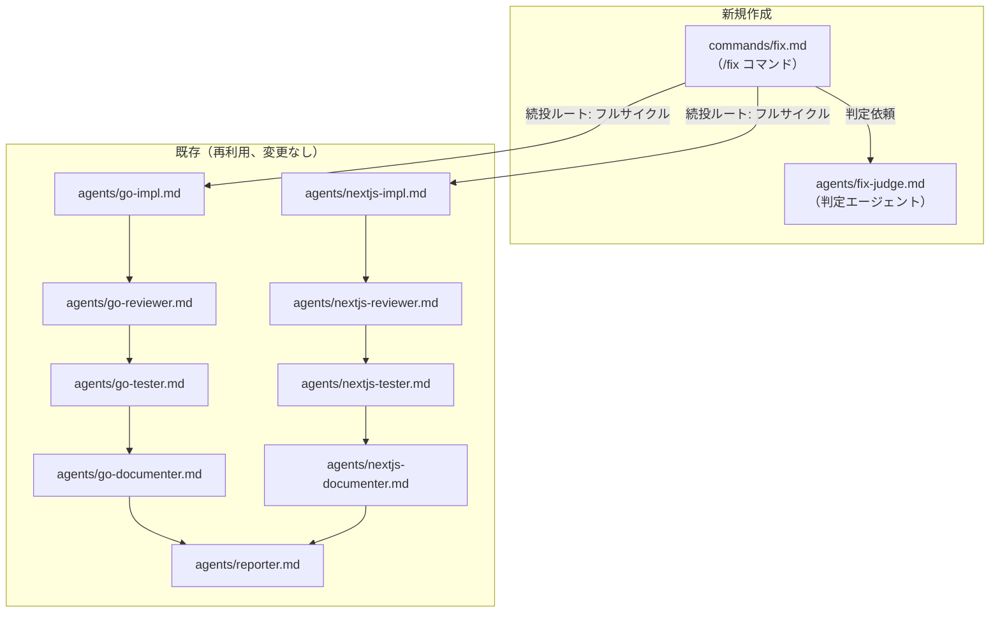
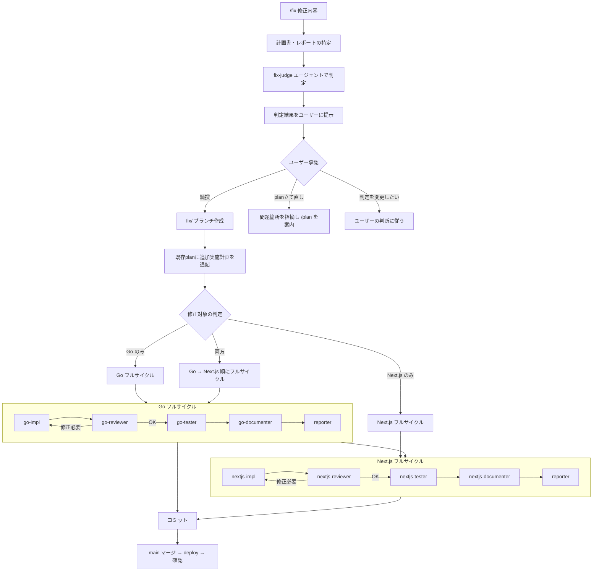

# fix-judge エージェントと /fix コマンド 実装計画

## 検討資料

`開発/検討中/2026-03-02_プラン確認判定エージェント.md`

## 1. 仕様サマリー

デプロイ後の本番確認で修正が必要になった場合に、修正の重さを判定し、適切なフローに振り分けるエージェントとコマンドを追加する。

- `fix-judge` エージェント: 計画書・レポート・テスト結果・ユーザーの修正依頼から「続投 or plan立て直し」を判定
- `/fix` コマンド: fix-judge を呼び出し、続投の場合は既存planに追加実施計画を追記してフルサイクルを内部実行。plan立て直しの場合は問題箇所を指摘して `/plan` への移行を案内

**最重要要件**: どちらのルートでもフルサイクル（impl → reviewer → tester → documenter → reporter）を必ず回す

## 2. 変更ファイル一覧

| ファイル | 変更内容 | 種別 |
|---------|---------|------|
| `.claude/agents/fix-judge.md` | 修正の重さを判定するエージェント定義 | 新規 |
| `.claude/commands/fix.md` | 判定→実行を1コマンドで完結するコマンド定義 | 新規 |

既存の `/fullstack`, `/go`, `/nextjs` は変更しない。

## 3. 修正範囲の全体像



## 4. 実装ステップ

### Step 1: fix-judge エージェント作成

**対象**: `.claude/agents/fix-judge.md`

**YAML frontmatter**:
- name: `fix-judge`
- description: デプロイ後の修正依頼を分析し、既存planの続投かplan立て直しかを判定するエージェント
- tools: `Read, Grep, Glob`（読み取り専用。コード修正は行わない）
- model: `opus`

**エージェントの責務**:
- 入力情報の収集: 計画書（`*_plan.md`）、レポート（計画書末尾）、テストプラン/結果、git diff/log
- 判定基準に基づく分析（6観点: 変更スコープ、設計判断、API/データ構造、テスト影響、レポート懸念点、修正の性質）
- 判定結果の出力（続投 / plan立て直し / 要確認）

**出力フォーマット**: 検討資料の「出力フォーマット」セクションに従う
- 判定結果（続投 / plan立て直し / 要確認）
- 修正内容の分析（影響範囲、既存planとの関係）
- 判定理由（6観点の評価テーブル）
- 推奨アクション

**注意点**:
- 既存の `go-reviewer` の「計画見直し判断」と観点が似ているが、fix-judge は**デプロイ後**の判定に特化（reviewer は実装中の判定）
- fix-judge は判定のみ行い、コード修正や計画書の編集は一切行わない

### Step 2: /fix コマンド作成

**対象**: `.claude/commands/fix.md`

**コマンドの全体フロー**:



**コマンドの構成**（`/fullstack` のパターンに準拠）:

1. **共通ステップ（判定フェーズ）**
   - 計画書の特定: `開発/実装/完了/` または `開発/実装/実装待ち/` から直近の `*_plan.md` を探す
   - `fix-judge` エージェントを呼び出し
   - 判定結果をユーザーに提示し承認を得る

2. **続投ルート**
   - `fix/修正内容` ブランチ作成
   - 既存planに「追加実施計画」セクションを追記（修正依頼、判定結果、変更ファイル、修正ステップ）
   - 修正対象（Go / Next.js / 両方）を判定し、対応するフルサイクルを実行
   - フルサイクルは `/fullstack` のフェーズ1・フェーズ2と同じ構成（impl → reviewer → tester → documenter → reporter）
   - コミット → main マージ → deploy → 確認

3. **plan立て直しルート**
   - 既存planの問題箇所を具体的に指摘
   - `/plan` で修正して立て直すよう案内（既存planベースで、修正すべき箇所を明示）
   - ここでコマンドは終了（/plan → /fullstack はユーザーが別途実行）

**計画書への追記フォーマット**（続投ルート）:
- 検討資料の「計画書への追記イメージ」セクションに準拠
- `---` 区切りの後に「追加実施計画（YYYY-MM-DD）」セクション
- reporter が追記する「追加修正レポート（YYYY-MM-DD）」セクション

**注意点**:
- `/fullstack` の実装サイクル部分（フェーズ1・2）のパターンをそのまま踏襲する
- タイマー計測も `/fullstack` と同様に実装する
- reviewer が「計画見直し必要」と判断した場合のエスカレーションは `/fullstack` と同じ
- 仕様書移動のステップは不要（既に完了済みのplanに対する修正のため）

## 5. 設計判断とトレードオフ

| 判断 | 選択した方法 | 理由 | 他の選択肢 |
|-----|------------|------|----------|
| fix-judge の配置 | 独立エージェント | 判定ロジックの責務分離。基準変更が1箇所で済む | /fix コマンド内に直接記述（責務混在） |
| 実行サイクルの実装 | /fix コマンド内で /fullstack と同じパターンを記述 | エージェント群は同じものを再利用するが、コマンドの記述は /fix に独自に持つ。/fullstack を内部呼び出しする仕組みは現状ない | /fullstack を直接呼び出す（技術的に不可） |
| 既存コマンドの変更 | 変更しない | /fix は独立コマンドとして運用。既存フローに影響を与えない | フェーズ3に /fix への誘導を追加（スコープ外） |
| fix-judge のモデル | opus | 判定精度が重要。計画書・レポートの文脈理解が必要 | sonnet（コスト削減だが判定精度低下リスク） |
| 計画書への追記方式 | 既存planに「追加実施計画」セクション追記 | 1ファイルに履歴が残る。実装経緯が追える | 別ファイル作成（ファイル散乱） |

## 6. 懸念点と対応方針

### 注意（実装時に考慮が必要）

| 懸念点 | 対応方針 |
|-------|---------|
| /fix コマンドのフルサイクル記述が /fullstack と重複する | 記述は重複するが、呼び出すエージェントは同一。/fix は修正特化の文脈（追加実施計画の追記、fix/ ブランチ等）を持つため、完全な共通化は不要 |
| fix-judge の判定が「要確認」の場合のフロー | ユーザーに判断を委ね、「続投」「plan立て直し」のどちらかを選んでもらう |
| 計画書ファイルが `完了/` に移動済みの場合 | `開発/実装/完了/` からも検索する。追記は移動先で行う |

## テストプラン

本タスクは `.claude/` 配下の Markdown ファイル作成のため、自動テストの対象外。

### 手動検証項目

| 項目 | 確認方法 |
|------|---------|
| fix-judge エージェントが Agent ツールから呼び出せる | `/fix` コマンド実行時に fix-judge が起動することを確認 |
| /fix コマンドがスラッシュコマンドとして認識される | Claude Code で `/fix` と入力して候補に表示されることを確認 |
| YAML frontmatter の構文 | 既存エージェントと同じフォーマットであることを目視確認 |
| フルサイクルの記述が /fullstack と整合 | エージェント呼び出し順序が一致していることを目視確認 |

---

## 実装完了レポート

### 実装サマリー
- **実装日**: 2026-03-02
- **変更ファイル数**: 2 files

### 変更ファイル一覧

| ファイル | 変更内容 |
|---------|---------|
| `.claude/agents/fix-judge.md` | 修正判定エージェント: 6観点の判定基準、入力情報収集プロセス、構造化された出力フォーマットを定義 |
| `.claude/commands/fix.md` | /fix コマンド: 判定フェーズ（fix-judge呼び出し）、続投ルート（追加実施計画追記 + フルサイクル）、plan立て直しルート（問題指摘 + /plan案内）の全フローを定義 |

### 計画からの変更点

特になし

### 実装時の課題

特になし。既存のエージェント・コマンドのパターンに沿って作成したため、スムーズに実装できた。

### 残存する懸念点

- 実運用での判定精度は使いながら調整が必要（判定基準の重み付けや閾値）
- /fix コマンドのフルサイクル記述は /fullstack と構造的に重複している（将来的にコマンド間の共通化の仕組みができれば統合可能）

### 動作確認フロー

```
1. Claude Code で /fix と入力し、スラッシュコマンド候補に表示されることを確認
2. /fix テスト修正 と実行し、fix-judge エージェントが起動することを確認
3. fix-judge が計画書を検索し、判定結果を出力することを確認
```

### デプロイ後の確認事項

- [ ] /fix コマンドがスラッシュコマンドとして認識される
- [ ] fix-judge エージェントが正しく呼び出される
- [ ] 判定結果の出力フォーマットが期待通り
