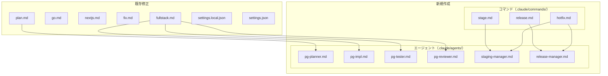

# デプロイフローパターン定型化 実装計画

## 仕様書

`開発/検討中/2026-03-02_デプロイフローパターン定型化.md`

## 1. 仕様サマリー

Webアプリ/API系プロジェクトのデプロイフローをパターンC（staging統一型）に定型化する。
具体的には以下を実装する：

1. **pg系エージェント4つ**: pg-planner, pg-impl, pg-tester, pg-reviewer
2. **インフラ系エージェント2つ**: staging-manager, release-manager
3. **新規コマンド3つ**: /stage, /release, /hotfix
4. **既存コマンド改修5つ**: /fullstack, /go, /nextjs, /fix（デプロイフェーズ削除）、/plan（pg-planner追加）
5. **設定更新**: settings.local.json（権限追加）、settings.json（hook更新）

## 2. 修正範囲の全体像



## 3. 変更ファイル一覧

| ファイル | 操作 | 変更内容 | 影響度 |
|---------|------|---------|-------|
| `.claude/agents/pg-planner.md` | 新規 | PostgreSQLスキーマ設計・マイグレーション計画エージェント | 中 |
| `.claude/agents/pg-impl.md` | 新規 | マイグレーションファイル作成・テストDB実行エージェント | 中 |
| `.claude/agents/pg-tester.md` | 新規 | テストDBでの検証エージェント | 中 |
| `.claude/agents/pg-reviewer.md` | 新規 | SQL品質レビュー・Expand/Contract管理エージェント | 中 |
| `.claude/agents/staging-manager.md` | 新規 | squash merge + git pushエージェント | 高 |
| `.claude/agents/release-manager.md` | 新規 | staging→main merge + git pushエージェント | 高 |
| `.claude/commands/stage.md` | 新規 | /stageコマンド定義 | 高 |
| `.claude/commands/release.md` | 新規 | /releaseコマンド定義 | 高 |
| `.claude/commands/hotfix.md` | 新規 | /hotfixコマンド定義 | 高 |
| `.claude/commands/fullstack.md` | 修正 | フェーズ3削除（featブランチコミットで終了）、pg系エージェント統合 | 高 |
| `.claude/commands/go.md` | 修正 | ステップ8（mainマージ・デプロイ）削除、仕様書移動削除 | 高 |
| `.claude/commands/nextjs.md` | 修正 | ステップ8（mainマージ・デプロイ）削除、仕様書移動削除 | 高 |
| `.claude/commands/fix.md` | 修正 | フェーズ2A.7（mainマージ・デプロイ）削除 | 高 |
| `.claude/commands/plan.md` | 修正 | pg-plannerを計画フェーズに追加 | 中 |
| `.claude/settings.local.json` | 修正 | 新スキルの権限追加 | 低 |
| `.claude/settings.json` | 修正 | Write hookに`.claude/`パスの除外追加 | 低 |

## 4. 実装ステップ

### Step 1: pg系エージェント作成（4ファイル）

既存のgo-planner/go-impl/go-tester/go-reviewerと同じ構造で、PostgreSQL/GORM専用の知識を持つエージェントを作成。

**対象**: `.claude/agents/pg-planner.md`, `pg-impl.md`, `pg-tester.md`, `pg-reviewer.md`

**pg-planner.md:**
- name: pg-planner
- tools: Read, Grep, Glob, AskUserQuestion（読み取り専用、go-plannerと同じ）
- 役割: PostgreSQLスキーマ設計、マイグレーション計画、Expand/Contract計画
- CLAUDE.mdのDB設定（db, orm, migration）を参照して動作
- Expand and Contractパターンの判断基準を含む

**pg-impl.md:**
- name: pg-impl
- tools: Read, Write, Edit, Bash, Grep, Glob（go-implと同じ）
- 役割: GORMマイグレーションファイル作成、テストDBでの実行確認
- Docker上のローカルPGに対して`go run ./cmd/migrate`を実行
- マイグレーションファイルの配置先規約を含む

**pg-tester.md:**
- name: pg-tester
- tools: Read, Write, Edit, Bash, Grep, Glob（go-testerと同じ）
- 役割: テストDBでの検証（データ整合性、制約確認）
- ローカルDocker PGに対するテスト実行

**pg-reviewer.md:**
- name: pg-reviewer
- tools: Read, Grep, Glob, Bash（go-reviewerと同じ）
- 役割: SQL品質レビュー、Expand/Contract掃除候補リスト管理
- マイグレーションが追加系のみか検証
- NULLABLEまたはデフォルト値付きか検証

### Step 2: インフラ系エージェント作成（2ファイル）

**対象**: `.claude/agents/staging-manager.md`, `.claude/agents/release-manager.md`

**staging-manager.md:**
- name: staging-manager
- tools: Read, Bash, Grep, Glob（git操作がメイン）
- 役割:
  - featブランチをstagingにsquash merge
  - コンフリクト解消（staging上で）
  - git push origin staging
  - squash commitメッセージにfeatの履歴を自動転記
- stagingブランチが存在しない場合の初期化手順を含む

**release-manager.md:**
- name: release-manager
- tools: Read, Bash, Grep, Glob
- 役割:
  - stagingをmainにマージ
  - git push origin main
  - stagingをmainにリセット（`git checkout staging && git reset --hard main && git push origin staging --force`）
  - featブランチの削除（本番反映完了後）
- Cloud Buildのデプロイ完了確認方法を含む（`gcloud builds list`）

### Step 3: 新規コマンド作成（3ファイル）

**対象**: `.claude/commands/stage.md`, `release.md`, `hotfix.md`

**stage.md（/stage コマンド）:**
- 引数: `$ARGUMENTS`（featブランチ名、例: `feat/A`）
- staging-managerエージェントを呼び出し
- 完了後にステージングURL（Cloud Runのstaging URL）を表示
- タイマー計測あり

**release.md（/release コマンド）:**
- ユーザーにstaging確認完了を確認（AskUserQuestion相当）
- release-managerエージェントを呼び出し
- 完了後に本番URL表示
- 仕様書を`開発/実装/完了/`に移動
- タイマー計測あり

**hotfix.md（/hotfix コマンド）:**
- staging を main にリセット（release-manager）
- 緊急修正の実装（go-impl/nextjs-impl を直接使用、DB変更ありならpg-impl も）
- レビュー（go-reviewer/nextjs-reviewer、DB変更ありならpg-reviewer も）- 必須
- テスト/ドキュメント: 緊急時は省略可（ユーザーに確認）
- staging に squash merge（staging-manager）
- ユーザーにstaging確認を依頼
- main にマージ + push（release-manager）
- タイマー計測あり

### Step 4: 既存コマンド改修（/fullstack, /go, /nextjs, /fix）

#### 4.1 /fullstack 改修

**対象**: `.claude/commands/fullstack.md`

**主要変更点:**

1. **フェーズ3（マージ・デプロイ）を削除** → featブランチへのコミットで終了
   - `deploy.sh`の呼び出しを削除
   - `mainにマージ`を削除
   - 仕様書移動を削除（/releaseで移動する）
   - 代わりに「完了（次は /stage）」のメッセージを表示

2. **pg系エージェントの統合**（DB変更がある場合のみ）
   - フェーズ1の前にDB変更有無を判断
   - DB変更あり: フェーズ1の前にpg-impl → pg-tester を実行
   - フェーズ1/2のレビューステップにpg-reviewerを追加（DB変更ありの場合）
   - pg-plannerは/fullstackには統合しない（/planで事前に実行する。Step 5で対応）

3. **フローの変更（mermaidダイアグラム更新）:**
   ```
   ブランチ作成 → [DB変更あり: pg-impl → pg-tester] → バックエンド → フロントエンド → コミット → 完了
   ```

**スキップ条件の更新:**
- フロントだけ: go系、pg系全てスキップ
- バックだけ: nextjs系スキップ
- DB変更なし: pg系全てスキップ

#### 4.2 /go, /nextjs 改修

**対象**: `.claude/commands/go.md`, `.claude/commands/nextjs.md`

**共通変更点:**
- ステップ8（mainマージ・デプロイ・確認）を削除
- ステップ9（仕様書移動）を削除
- 代わりに「完了（次は /stage）」のメッセージを表示

#### 4.3 /fix 改修

**対象**: `.claude/commands/fix.md`

**変更点:**
- フェーズ2A.7（mainマージ・deploy.sh・確認）を削除
- 代わりに「完了（次は /stage）」のメッセージを表示

### Step 5: /plan コマンド改修

**対象**: `.claude/commands/plan.md`

**変更点:**

1. **plannerの選択肢にpg-plannerを追加:**
   - Go + PostgreSQL → go-planner + pg-planner を並行実行
   - Next.js のみ → nextjs-planner のみ
   - フルスタック + DB → go-planner + nextjs-planner + pg-planner を並行実行

2. **plan-reviewerにpg対応は不要:**
   - pg-plannerの出力はgo-plan-reviewerが検証可能（Go/GORM領域のため）
   - 新規のpg-plan-reviewerは作成しない

### Step 6: 権限設定・hook更新

**対象**: `.claude/settings.local.json`, `.claude/settings.json`

**settings.local.json - 追加する権限:**
```json
"Skill(stage)",
"Skill(stage:*)",
"Skill(release)",
"Skill(release:*)",
"Skill(hotfix)",
"Skill(hotfix:*)"
```

**settings.json - hook更新:**
- PreToolUseのWrite hookの2箇所を修正:
  1. **matcher**: `.claude/`パスの除外を追加（エスケープ: `\\\\.claude/`）
  2. **commandスクリプト内のif文**: `.claude/`配下のファイルを許可する条件分岐を追加

## 5. 設計判断とトレードオフ

| 判断 | 選択した方法 | 理由 | 他の選択肢 |
|-----|------------|------|----------|
| pg-plan-reviewer | 作成しない | go-plan-reviewerがGORM/SQLもカバーできる | 専用reviewer作成（過剰） |
| /fullstackのデプロイ削除 | フェーズ3を完全削除 | Pattern C統一の方針に従う | 条件分岐で残す（複雑化） |
| hotfixの実装部分 | go-impl/nextjs-implを直接使用 | 新エージェント不要、既存資産活用 | hotfix専用implエージェント（過剰） |
| stagingブランチ初期化 | staging-managerに手順を含める | 初回だけの操作だが自動化しておく | 手動で事前作成（忘れるリスク） |
| Docker Compose/CloudBuild | この計画では作成しない | Ghostrunnerは現時点でPG未使用。実際にPGを導入するプロジェクトで作成する | テンプレートとして同梱（使わないファイルが増える） |

## 6. 懸念点と対応方針

### ✅ 解決済み

| 懸念点 | 決定事項 |
|-------|---------|
| 現行Ghostrunnerへの影響 | Ghostrunnerも今すぐPattern Cに移行する。stagingブランチの作成とCloud Buildトリガーの設定が必要 |
| settings.jsonのmd作成ブロック | hookの除外パターンに`.claude/`パスを追加する（Step 6で対応） |

### 🟡 注意（実装時に考慮が必要）

| 懸念点 | 対応方針 |
|-------|---------|
| stagingブランチ未作成時 | staging-managerがブランチ存在チェックし、なければ`git checkout -b staging main && git push -u origin staging`で初期化 |
| Cloud Buildトリガー未設定時 | /stageと/releaseのコマンド内で「Cloud Buildトリガーが設定済みであること」を前提条件として明記。未設定の場合はgit pushのみ行い、手動デプロイを案内 |

## 7. 次回実装（MVP外）

以下はこの計画のスコープ外とし、必要になった時点で実装：

- **docker-compose.yml**: PG導入プロジェクトで作成
- **cloudbuild.yaml テンプレート**: PG導入プロジェクトで作成
- **cmd/migrate/main.go**: PG導入プロジェクトで作成
- **Makefile更新（make db）**: PG導入プロジェクトで追加
- **CLAUDE.mdテンプレート**: 別タスクとして作成
- **pg-documenter**: 必要になった時点で追加（当面はgo-documenterがカバー）

## 8. 確認事項

全て解決済み:
1. ~~Ghostrunnerの/fullstack~~ → Pattern Cに即時移行（確認済み）
2. ~~settings.jsonのhook更新~~ → `.claude/`パスを除外に追加（確認済み）

---

# テストプラン

## 対象計画
`開発/実装/実装待ち/2026-03-02_デプロイフローパターン定型化_plan.md`

## リスク分析

この計画はClaude Codeのエージェント/コマンド定義ファイル（Markdown）と設定ファイル（JSON）のみの変更であり、Go/フロントエンドのアプリケーションコードは一切変更しない。そのため、従来の単体テスト/結合テストではなく、**構造検証（ファイル形式・参照整合性・権限整合性）** を手動チェックリストとして設計する。

### テストが必要な箇所

| 対象 | リスク | 理由 | テスト種別 |
|------|-------|------|----------|
| 新規エージェント6つのYAML frontmatter | 高 | name/tools/modelの誤りはエージェント呼び出し失敗に直結 | 構造検証 |
| 新規コマンド3つのエージェント参照 | 高 | 存在しないエージェント名の参照はコマンド実行失敗に直結 | 参照整合性 |
| settings.local.jsonの権限追加 | 高 | Skill権限の欠如はコマンド実行時に権限エラーを引き起こす | 権限整合性 |
| settings.jsonのWrite hookの除外パターン | 高 | `.claude/`配下のmd作成がブロックされるとエージェント/コマンド作成が不可能 | hook整合性 |
| /fullstack, /go, /nextjs, /fixのデプロイフェーズ削除 | 高 | 削除漏れがあるとPattern C移行の目的が達成されない | 削除検証 |
| /fullstackのmermaidダイアグラム更新 | 中 | フロー図と実際のステップの不一致はオペレータの混乱を招く | 内容整合性 |
| /planのpg-planner追加 | 中 | 選択肢の記載漏れはDB変更時の計画フェーズ欠落を招く | 内容整合性 |

### テスト不要な箇所

| 対象 | 理由 |
|------|------|
| エージェントのプロンプト本文（指示内容の品質） | 文章品質は機能テストの対象外。実際のタスク実行で検証すべき |
| pg系エージェント4つの詳細な指示内容 | PG未導入のGhostrunnerでは実行されない。テンプレートとしての構造のみ検証 |
| コミットメッセージの形式 | CLAUDE.mdのルールが適用されるため個別検証不要 |

## テストケース

### 1. 新規エージェントのYAML frontmatter構造検証

**対象ファイル**: `.claude/agents/pg-planner.md`, `pg-impl.md`, `pg-tester.md`, `pg-reviewer.md`, `staging-manager.md`, `release-manager.md`
**種別**: 構造検証（手動チェック）

| # | ケース | 検証方法 | 期待結果 | 優先度 |
|---|-------|---------|---------|-------|
| 1.1 | YAML frontmatterの形式 | 各ファイルが `---` で囲まれたfrontmatterを持つこと | `name`, `description`, `tools`, `model` の4フィールドが全て存在 | 必須 |
| 1.2 | nameフィールドの値 | frontmatterのname値を確認 | pg-planner, pg-impl, pg-tester, pg-reviewer, staging-manager, release-manager | 必須 |
| 1.3 | toolsフィールドの値（pg-planner） | toolsに読み取り専用ツールのみ含まれること | `Read, Grep, Glob, AskUserQuestion`（go-plannerと同一） | 必須 |
| 1.4 | toolsフィールドの値（pg-impl） | toolsに書き込みツールを含むこと | `Read, Write, Edit, Bash, Grep, Glob`（go-implと同一） | 必須 |
| 1.5 | toolsフィールドの値（pg-tester） | toolsに書き込みツールを含むこと | `Read, Write, Edit, Bash, Grep, Glob`（go-testerと同一） | 必須 |
| 1.6 | toolsフィールドの値（pg-reviewer） | toolsにBashを含むこと | `Read, Grep, Glob, Bash`（go-reviewerと同一） | 必須 |
| 1.7 | toolsフィールドの値（staging-manager） | git操作に必要なツールを含むこと | `Read, Bash, Grep, Glob` | 必須 |
| 1.8 | toolsフィールドの値（release-manager） | git操作に必要なツールを含むこと | `Read, Bash, Grep, Glob` | 必須 |
| 1.9 | modelフィールドの値 | 全エージェントでopusが指定されていること | `model: opus` | 必須 |
| 1.10 | ultrathinkディレクティブ | frontmatter直後に `**always ultrathink**` があること | 既存エージェントと同じパターン | 推奨 |

### 2. 新規コマンドのエージェント参照整合性

**対象ファイル**: `.claude/commands/stage.md`, `release.md`, `hotfix.md`
**種別**: 参照整合性（手動チェック）

| # | ケース | 検証方法 | 期待結果 | 優先度 |
|---|-------|---------|---------|-------|
| 2.1 | /stageがstaging-managerを参照 | stage.md内で`staging-manager`エージェントへの言及を確認 | `staging-manager`エージェントの呼び出し記述が存在 | 必須 |
| 2.2 | /releaseがrelease-managerを参照 | release.md内で`release-manager`エージェントへの言及を確認 | `release-manager`エージェントの呼び出し記述が存在 | 必須 |
| 2.3 | /hotfixがstaging-manager+release-managerの両方を参照 | hotfix.md内で両エージェントへの言及を確認 | `staging-manager`と`release-manager`の両方の呼び出し記述が存在 | 必須 |
| 2.4 | /hotfixがgo-impl, nextjs-impl, pg-implを参照 | hotfix.md内で実装エージェントへの言及を確認 | 緊急修正で使用する実装エージェントの記述が存在 | 必須 |
| 2.5 | /hotfixがgo-reviewer, nextjs-reviewer, pg-reviewerを参照 | hotfix.md内でレビューエージェントへの言及を確認 | レビュー必須としてレビューエージェントの記述が存在 | 必須 |
| 2.6 | 参照先エージェントの実在確認 | `.claude/agents/`に参照先の全mdファイルが存在すること | staging-manager.md, release-manager.md が存在 | 必須 |
| 2.7 | タイマー計測の存在 | 各コマンドに開始/終了の計測コードがあること | `date +%s` による計測が /stage, /release, /hotfix に存在 | 推奨 |
| 2.8 | $ARGUMENTS変数の存在 | 各コマンドに引数受け渡しの記述があること | `$ARGUMENTS` が /stage, /release, /hotfix に存在 | 必須 |

### 3. settings.local.jsonの権限整合性

**対象ファイル**: `.claude/settings.local.json`
**種別**: 権限整合性（手動チェック）

| # | ケース | 検証方法 | 期待結果 | 優先度 |
|---|-------|---------|---------|-------|
| 3.1 | /stageの権限追加 | allowリストに`Skill(stage)`系が存在すること | `"Skill(stage)"` と `"Skill(stage:*)"` が存在 | 必須 |
| 3.2 | /releaseの権限追加 | allowリストに`Skill(release)`系が存在すること | `"Skill(release)"` と `"Skill(release:*)"` が存在 | 必須 |
| 3.3 | /hotfixの権限追加 | allowリストに`Skill(hotfix)`系が存在すること | `"Skill(hotfix)"` と `"Skill(hotfix:*)"` が存在 | 必須 |
| 3.4 | 既存権限が破壊されていないこと | 既存のSkill(fullstack), Skill(go), Skill(nextjs), Skill(plan), Skill(fix)等が維持されていること | 既存エントリが全て残存 | 必須 |
| 3.5 | JSON構文の妥当性 | JSONとしてパース可能であること | `jq .` でエラーが出ないこと | 必須 |

### 4. settings.jsonのWrite hook整合性

**対象ファイル**: `.claude/settings.json`
**種別**: hook整合性（手動チェック）

| # | ケース | 検証方法 | 期待結果 | 優先度 |
|---|-------|---------|---------|-------|
| 4.1 | Write hookのmatcherが.claude/パスを除外 | PreToolUseのWriteのmatcher条件を確認 | `.claude/`配下のmdファイルがmatcherで除外されている（hookが発火しない） | 必須 |
| 4.2 | Write hookのcommandスクリプトが.claude/パスを許可 | commandの中のif文で`.claude/`パスが許可されていること | `.claude/`で始まるパスの場合、ブロックせずに通過する条件分岐が存在 | 必須 |
| 4.3 | 既存のhookが破壊されていないこと | `.claude/`以外のmdファイル（README.md等以外）の作成が引き続きブロックされること | `開発/xxx.md`等を書こうとした場合に引き続きブロックされる | 必須 |
| 4.4 | JSON構文の妥当性 | JSONとしてパース可能であること | `jq .` でエラーが出ないこと | 必須 |

### 5. 既存コマンドのデプロイフェーズ削除検証

**対象ファイル**: `.claude/commands/fullstack.md`, `go.md`, `nextjs.md`, `fix.md`
**種別**: 削除検証（手動チェック）

| # | ケース | 検証方法 | 期待結果 | 優先度 |
|---|-------|---------|---------|-------|
| 5.1 | /fullstack: フェーズ3（マージ・デプロイ）が削除 | fullstack.mdに`deploy.sh`、`mainにマージ`、Deployサブグラフが存在しないこと | `deploy.sh`への参照なし、`## フェーズ 3`のセクションなし | 必須 |
| 5.2 | /fullstack: 仕様書移動が削除 | fullstack.mdに`仕様書の移動`、`保守/実装/完了`が存在しないこと | 仕様書移動の記述なし（/releaseに移管されたため） | 必須 |
| 5.3 | /fullstack: 「完了（次は /stage）」メッセージ追加 | fullstack.mdに `/stage` への案内が存在すること | コミット後に「次は /stage」相当の案内メッセージが記載されている | 必須 |
| 5.4 | /go: ステップ8（mainマージ・デプロイ）が削除 | go.mdに`deploy.sh`、`mainにマージ`ステップが存在しないこと | ステップ8が削除されている | 必須 |
| 5.5 | /go: ステップ9（仕様書移動）が削除 | go.mdに`仕様書の移動`が存在しないこと | ステップ9が削除されている | 必須 |
| 5.6 | /go: 「完了（次は /stage）」メッセージ追加 | go.mdに `/stage` への案内が存在すること | コミット後に「次は /stage」相当の案内メッセージが記載されている | 必須 |
| 5.7 | /nextjs: ステップ8（mainマージ・デプロイ）が削除 | nextjs.mdに`deploy.sh`、`mainにマージ`ステップが存在しないこと | ステップ8が削除されている | 必須 |
| 5.8 | /nextjs: ステップ9（仕様書移動）が削除 | nextjs.mdに`仕様書の移動`が存在しないこと | ステップ9が削除されている | 必須 |
| 5.9 | /nextjs: 「完了（次は /stage）」メッセージ追加 | nextjs.mdに `/stage` への案内が存在すること | コミット後に「次は /stage」相当の案内メッセージが記載されている | 必須 |
| 5.10 | /fix: フェーズ2A.7（mainマージ・デプロイ・確認）が削除 | fix.mdに`deploy.sh`、`git merge fix/`、2A.7のセクションが存在しないこと | フェーズ2A.7が削除されている | 必須 |
| 5.11 | /fix: 「完了（次は /stage）」メッセージ追加 | fix.mdに `/stage` への案内が存在すること | コミット後に「次は /stage」相当の案内メッセージが記載されている | 必須 |
| 5.12 | /fullstack: 完了条件からデプロイ関連が削除 | 完了条件に`main にマージ → deploy.sh`が存在しないこと | 完了条件がfeatブランチコミットまでに変更されている | 必須 |
| 5.13 | /go: 完了条件からデプロイ関連が削除 | 完了条件に`main にマージ → deploy.sh`が存在しないこと | 完了条件がfeatブランチコミットまでに変更されている | 必須 |
| 5.14 | /nextjs: 完了条件からデプロイ関連が削除 | 完了条件に`main にマージ → deploy.sh`が存在しないこと | 完了条件がfeatブランチコミットまでに変更されている | 必須 |
| 5.15 | /fix: 完了条件からデプロイ関連が削除 | 完了条件に`main にマージ → deploy`が存在しないこと | 完了条件がfeatブランチコミットまでに変更されている | 必須 |

### 6. mermaidダイアグラムの整合性

**対象ファイル**: `.claude/commands/fullstack.md`, `go.md`, `nextjs.md`, `fix.md`
**種別**: 内容整合性（手動チェック）

| # | ケース | 検証方法 | 期待結果 | 優先度 |
|---|-------|---------|---------|-------|
| 6.1 | /fullstack: Deployサブグラフが削除 | mermaidのflowchart内にDeployサブグラフが存在しないこと | `Deploy`ラベルのサブグラフなし。フローがコミットで終了 | 必須 |
| 6.2 | /fullstack: pg系エージェントの追加 | mermaidのflowchart内にpg-impl, pg-testerへの分岐が存在すること | DB変更あり時のpg-impl → pg-testerフローが図示されている | 必須 |
| 6.3 | /fullstack: pg-reviewerの統合 | mermaidのflowchart内にpg-reviewerが存在すること | レビューステップにpg-reviewer（DB変更あり時）が含まれている | 推奨 |
| 6.4 | /go: mermaidからデプロイノードが削除 | go.mdのmermaid内に`deploy.sh`、`mainにマージ`ノードが存在しないこと | フローがコミットで終了する図になっている | 必須 |
| 6.5 | /nextjs: mermaidからデプロイノードが削除 | nextjs.mdのmermaid内に`deploy.sh`、`mainにマージ`ノードが存在しないこと | フローがコミットで終了する図になっている | 必須 |
| 6.6 | /fix: mermaidからデプロイノードが削除 | fix.mdのmermaid内に`MERGE`ノード（main マージ → deploy → 確認）が存在しないこと | 続投ルートのフローがコミット → 「次は /stage」で終了する図になっている | 必須 |

### 7. /planコマンドのpg-planner統合検証

**対象ファイル**: `.claude/commands/plan.md`
**種別**: 内容整合性（手動チェック）

| # | ケース | 検証方法 | 期待結果 | 優先度 |
|---|-------|---------|---------|-------|
| 7.1 | pg-plannerが選択肢に追加 | plan.mdの実行方法セクションにpg-plannerの記載があること | Go + PostgreSQL時に`pg-planner`を使用する旨の記述あり | 必須 |
| 7.2 | フルスタック+DBの選択肢 | plan.mdにフルスタック+DB変更時の記述があること | `go-planner + nextjs-planner + pg-planner`の並行実行が記載 | 必須 |
| 7.3 | pg-plan-reviewerを作成しないことの記載 | plan.mdのレビューセクションでpg専用reviewerに言及しないこと | go-plan-reviewerがGORM/SQLもカバーする方針が維持されている（新reviewerの追加なし） | 推奨 |

### 8. /fullstackのpg系エージェント統合検証

**対象ファイル**: `.claude/commands/fullstack.md`
**種別**: 内容整合性（手動チェック）

| # | ケース | 検証方法 | 期待結果 | 優先度 |
|---|-------|---------|---------|-------|
| 8.1 | DB変更有無の判断ステップ | fullstack.mdにDB変更の有無を判断するステップが存在すること | フェーズ1の前（またはフェーズ1内の冒頭）にDB変更判断の記述あり | 必須 |
| 8.2 | DB変更あり時のpg-impl実行 | fullstack.mdにpg-implエージェントの呼び出しが記載されていること | DB変更あり条件下でpg-implの実行ステップが存在 | 必須 |
| 8.3 | DB変更あり時のpg-tester実行 | fullstack.mdにpg-testerエージェントの呼び出しが記載されていること | pg-impl後にpg-testerの実行ステップが存在 | 必須 |
| 8.4 | DB変更あり時のpg-reviewer実行 | fullstack.mdにpg-reviewerエージェントの呼び出しが記載されていること | レビューステップにpg-reviewer（DB変更あり時）が含まれている | 必須 |
| 8.5 | スキップ条件の更新 | fullstack.mdのスキップ条件にDB変更なし時のpg系スキップが記載されていること | 「DB変更なし: pg系全てスキップ」の条件が存在 | 必須 |
| 8.6 | pg-plannerは/fullstackに統合しない | fullstack.mdにpg-plannerの呼び出しが存在しないこと | pg-plannerは/planで実行するため、/fullstackには含まれない | 必須 |

## テスト実行手順

全ての検証はファイル作成/修正後に手動チェックリストとして実施する。以下のコマンドで一括確認が可能:

```bash
# 1. 新規エージェントファイルの存在確認
ls -la .claude/agents/pg-planner.md .claude/agents/pg-impl.md .claude/agents/pg-tester.md .claude/agents/pg-reviewer.md .claude/agents/staging-manager.md .claude/agents/release-manager.md

# 2. 新規コマンドファイルの存在確認
ls -la .claude/commands/stage.md .claude/commands/release.md .claude/commands/hotfix.md

# 3. YAML frontmatterの形式確認（各エージェントのnameを一括確認）
for f in .claude/agents/pg-planner.md .claude/agents/pg-impl.md .claude/agents/pg-tester.md .claude/agents/pg-reviewer.md .claude/agents/staging-manager.md .claude/agents/release-manager.md; do echo "=== $f ===" && head -6 "$f"; done

# 4. settings.local.jsonの権限確認
grep -E "Skill\((stage|release|hotfix)" .claude/settings.local.json

# 5. settings.jsonのhook更新確認
grep -c "\.claude" .claude/settings.json

# 6. デプロイフェーズ削除確認（これらが0件であること）
grep -l "deploy\.sh" .claude/commands/fullstack.md .claude/commands/go.md .claude/commands/nextjs.md .claude/commands/fix.md 2>/dev/null || echo "OK: deploy.shの参照なし"

# 7. /stage案内メッセージの存在確認
grep -l "/stage" .claude/commands/fullstack.md .claude/commands/go.md .claude/commands/nextjs.md .claude/commands/fix.md

# 8. JSON構文チェック
jq . .claude/settings.local.json > /dev/null && echo "settings.local.json: OK"
jq . .claude/settings.json > /dev/null && echo "settings.json: OK"

# 9. pg-planner参照の確認
grep "pg-planner" .claude/commands/plan.md

# 10. /fullstackのpg系エージェント統合確認
grep -E "pg-(impl|tester|reviewer)" .claude/commands/fullstack.md
```

## まとめ

| 項目 | 数 |
|------|---|
| 検証カテゴリ数 | 8 |
| テストケース数（必須） | 38 |
| テストケース数（推奨） | 5 |
| テストケース合計 | 43 |
| 推定実装時間 | 小（手動チェックのため実装作業なし。検証は10-15分） |

**テストしない判断の根拠:**
- エージェントのプロンプト本文の品質: 文章内容の正しさは実際のタスク実行で初めて検証できる。静的チェックで検証可能なのは構造とメタデータのみ
- pg系エージェント4つの詳細な指示内容: Ghostrunnerは現時点でPostgreSQLを使用していないため、テンプレートとしての構造検証のみで十分
- コミットメッセージの形式: プロジェクト全体のCLAUDE.mdルールで管理されており、個別ファイルでの検証は冗長
