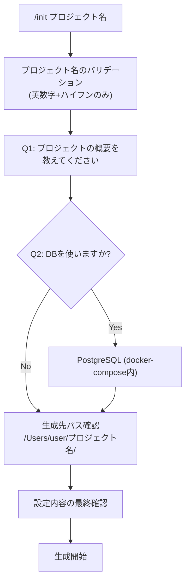
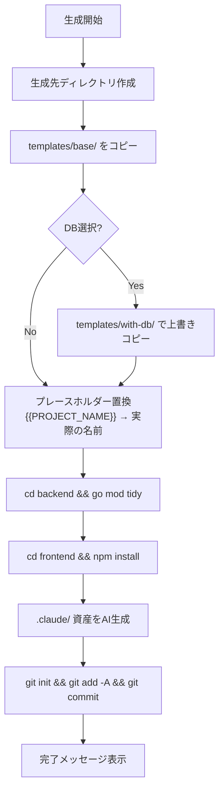

# プロジェクトスターター (`/init`) 実装計画

## 概要

Ghostrunner内にテンプレートファイル群と `/init` コマンドを作成し、新プロジェクトを対話的に生成できるようにする。

- **実行方法**: Claude Codeコマンド `/init <プロジェクト名>`
- **テンプレート配置**: `templates/base/` + `templates/with-db/`
- **`.claude/` 資産**: テンプレートに含めず、AIが生成
- **生成先**: `/Users/user/<プロジェクト名>/`（Ghostrunnerと同階層）

**仕様書**: `開発/検討中/2026-03-02_プロジェクトスターター.md`

---

## 懸念点と解決策

### 1. DB選択時のテンプレートマージ戦略

**懸念**: base + with-db をどう組み合わせるか。overlay/patch方式は複雑になりがち。

**解決策**: with-db/ に **完全置換ファイル** を配置する。

- `main.go`, `go.mod`, `docker-compose.yml` はDB版が base版を上書きする
- `sample.go`, `database.go` 等のDB固有ファイルは追加コピー
- コードが小さいのでDRYより明確さを優先

### 2. go.sum / package-lock.json の扱い

**懸念**: バージョンロックファイルをテンプレートに含めると陳腐化する。

**解決策**: テンプレートに含めず、`/init` 実行時に生成する。

- `go mod tidy` で go.sum を生成
- `npm install` で package-lock.json を生成

### 3. Makefile の簡略化

**懸念**: 現在のMakefile（244行）はGhostrunner固有設定（Tailscale、外部アクセス）を含む。

**解決策**: 基本コマンドのみに簡略化する。

- 含める: `dev`, `backend`, `frontend`, `stop`, `build`, `health`, `logs-*`, `start-*`, `restart-*`
- 除外: `dev-external`, `frontend-external`（Tailscale固有）
- DB選択時: `make db` (PostgreSQLコンテナ起動) を追加

### 4. CORS設定のテンプレート化

**懸念**: 現在のCORSにはTailscale固有のIPパターンがある。

**解決策**: テンプレートでは `localhost:3000` のみ許可。Cloud Run本番では環境変数 `ALLOWED_ORIGIN` で制御する構成にする。

### 5. Cloud Runポート対応

**懸念**: Cloud RunはPORT環境変数で動的にポートを指定する。

**解決策**: テンプレートのmain.goで `PORT` 環境変数を参照し、未設定時は `:8080` をデフォルトにする。

### 6. Next.jsバージョン

**懸念**: 仕様書では「Next.js 15」と記載されているが、実際のGhostrunnerは `next@16.1.4` を使用。

**解決策**: テンプレートではNext.js最新安定版を使用する。package.jsonでバージョンを `latest` ではなく具体的なバージョンで固定する（生成時点の最新）。

---

### 7. DB接続のアーキテクチャ（レビュー指摘: Go-C1, Go-C2）

**懸念**: handler → DB直接呼び出しはClean Architecture違反。グローバルシングルトンDBはテスト困難。

**解決策**:
- DB接続は**構造体ベースのDI**で実装する（`Database` 構造体を `main.go` で生成し handler に注入）
- MVPでは**service層は省略**する。handler が Database 構造体を直接使用する。プロジェクトが成長した段階で service 層を導入する方針をコメントで示す
- グローバル変数の `InitDB/GetDB/CloseDB` パターンは使わない

### 8. page.tsx の実装方式（レビュー指摘: FE-C2）

**懸念**: Server Component の fetch では Next.js の rewrites が適用されず、バックエンド API にアクセスできない。

**解決策**: **Client Component** として実装する。
- `"use client"` + `useEffect` + `useState` で `/api/hello` を fetch
- rewrites が正しく適用される
- テンプレートとしてシンプルで理解しやすい

### 9. Next.js standalone モードと本番通信（レビュー指摘: FE-C3）

**懸念**: Dockerfile で standalone モードを使うが、next.config.ts に `output: 'standalone'` が未設定。また standalone モードでは rewrites が動作しない。

**解決策**:
- `next.config.ts` に `output: 'standalone'` を追加
- 本番環境では `NEXT_PUBLIC_API_URL` 環境変数でバックエンド URL を指定
- 開発時は rewrites（localhost:8080 プロキシ）、本番は環境変数で直接指定

### 10. AutoMigrate と init.sql の二重管理（レビュー指摘: Go-W4）

**懸念**: GORM AutoMigrate と db/init.sql でスキーマ定義が二重になる。

**解決策**: `init.sql` は削除し、**AutoMigrate のみ**にする。
- docker-compose 初期化はアプリ起動時の AutoMigrate に任せる
- `db/init.sql` にはサンプルデータのINSERTのみを残す（テーブル作成はAutoMigrateが担当）
- 本番ではマイグレーションツール（golang-migrate等）を使用予定。MVPではAutoMigrateで代替

### 11. エラーレスポンス形式（レビュー指摘: Go-W5）

**懸念**: CRUD ハンドラーのエラーレスポンス形式が未定義。

**解決策**: `gin.H{"error": "エラーメッセージ"}` で統一する。Ghostrunner の handler パターンに準拠。

---

## 技術的判断

| 項目 | 判断 | 理由 |
|------|------|------|
| プレースホルダー | `{{PROJECT_NAME}}` | AIが `sed` で一括置換。対象はテキストファイル拡張子のみに限定 |
| Go module名 | `{{PROJECT_NAME}}/backend` | Ghostrunnerのパターンに準拠 |
| ポート | backend: 8080, frontend: 3000 | Ghostrunnerと同じ。Cloud RunはPORT環境変数で上書き |
| CORS | localhost:3000 + 環境変数対応、全HTTPメソッド許可 | 汎用テンプレートとしてTailscale固有設定は除外 |
| Tailwind CSS | v4 (PostCSS plugin方式) | Ghostrunnerのパターンに準拠 |
| テスト | vitest + @testing-library/react | Ghostrunnerのパターンに準拠 |
| DB ORM | GORM | Ghostrunnerのpg系エージェントと一貫 |
| DB接続 | 構造体ベースDI + 環境変数 `DATABASE_URL` | グローバルシングルトン回避、テスト容易性確保 |
| service層 | MVPでは省略（handler → DB直接） | シンプルさ優先。将来導入方針をコメントで示す |
| page.tsx | Client Component | Server Component の fetch では rewrites が非適用のため |
| Next.js standalone | next.config.ts に `output: 'standalone'` | Dockerfile 必須。本番は `NEXT_PUBLIC_API_URL` で通信 |
| エラーレスポンス | `{"error": "..."}` | gin.H パターンで統一 |
| スキーマ管理 | AutoMigrate のみ（init.sqlはデータ投入のみ） | 二重管理回避 |

---

## 変更ファイル一覧

### 新規作成: templates/base/ (21ファイル)

| ファイル | 内容 |
|---------|------|
| `templates/base/backend/cmd/server/main.go` | Go + Gin エントリーポイント |
| `templates/base/backend/internal/handler/health.go` | ヘルスチェックハンドラー |
| `templates/base/backend/internal/handler/hello.go` | Hello Worldハンドラー |
| `templates/base/backend/go.mod` | Go modules定義 |
| `templates/base/backend/Dockerfile` | マルチステージビルド |
| `templates/base/backend/.env.example` | 環境変数サンプル |
| `templates/base/frontend/src/app/page.tsx` | トップページ（Client Component） |
| `templates/base/frontend/src/app/layout.tsx` | ルートレイアウト |
| `templates/base/frontend/src/app/globals.css` | Tailwind CSS設定 |
| `templates/base/frontend/package.json` | 依存関係定義 |
| `templates/base/frontend/tsconfig.json` | TypeScript設定 |
| `templates/base/frontend/next.config.ts` | Next.js設定（APIプロキシ + standalone） |
| `templates/base/frontend/postcss.config.mjs` | PostCSS設定 |
| `templates/base/frontend/eslint.config.mjs` | ESLint設定 |
| `templates/base/frontend/vitest.config.ts` | Vitest設定 |
| `templates/base/frontend/vitest.setup.ts` | Vitestセットアップ |
| `templates/base/frontend/Dockerfile` | マルチステージビルド（standalone） |
| `templates/base/Makefile` | 開発コマンド定義 |
| `templates/base/docker-compose.yml` | ローカル開発用 |
| `templates/base/cloudbuild.yaml` | Cloud Buildデプロイ設定 |
| `templates/base/.gitignore` | Git無視ファイル定義 |

### 新規作成: templates/with-db/ (7ファイル)

| ファイル | 内容 | base置換? |
|---------|------|----------|
| `templates/with-db/backend/cmd/server/main.go` | DB接続 + sampleルート追加版 | Yes |
| `templates/with-db/backend/internal/handler/sample.go` | CRUD ハンドラー | 追加 |
| `templates/with-db/backend/internal/domain/model/sample.go` | GORMモデル | 追加 |
| `templates/with-db/backend/internal/infrastructure/database.go` | DB接続（構造体ベースDI） | 追加 |
| `templates/with-db/backend/go.mod` | GORM依存追加版 | Yes |
| `templates/with-db/docker-compose.yml` | PostgreSQL追加版 | Yes |
| `templates/with-db/db/init.sql` | サンプルデータ投入（テーブル作成はAutoMigrate） | 追加 |

### 新規作成: /initコマンド (1ファイル)

| ファイル | 内容 |
|---------|------|
| `.claude/commands/init.md` | プロジェクト生成コマンド |

### ディレクトリ構造用 .gitkeep (4ファイル)

| ファイル |
|---------|
| `templates/base/開発/検討中/.gitkeep` |
| `templates/base/開発/実装/実装待ち/.gitkeep` |
| `templates/base/開発/実装/完了/.gitkeep` |
| `templates/base/開発/資料/.gitkeep` |

**合計: 33ファイル**

---

## Phase 1: Backend テンプレート

### templates/base/backend/

#### cmd/server/main.go

- Gin初期化
- CORS設定（localhost:3000 + 環境変数 `ALLOWED_ORIGIN`、全HTTPメソッド許可）
- `/api/health` → HealthHandler
- `/api/hello` → HelloHandler（`{"message": "Hello, World!"}` を返す）
- PORT環境変数対応: `os.Getenv("PORT")` → 未設定時 `"8080"` → `r.Run("0.0.0.0:" + port)`
- ログ出力: `[Server] Starting...`, `[Server] Listening on ...`

#### internal/handler/health.go

- Ghostrunnerのhealth.goと同一パターン
- `GET /api/health` → `{"status": "ok"}`

#### internal/handler/hello.go

- health.goと同じ構造
- `GET /api/hello` → `{"message": "Hello, World!"}`

#### go.mod

- `module {{PROJECT_NAME}}/backend`
- Go 1.24
- 依存: `github.com/gin-gonic/gin`, `github.com/gin-contrib/cors`

#### Dockerfile

- マルチステージビルド
- Stage 1: Go builder（`golang:1.24-alpine`）
- Stage 2: 実行用（`gcr.io/distroless/static-debian12`）
- PORT環境変数対応
- ヘルスチェック用EXPOSE

#### .env.example

- `PORT=8080`
- `ALLOWED_ORIGIN=http://localhost:3000`
- DB選択時は with-db 版で `DATABASE_URL` を追加

---

## Phase 2: Frontend テンプレート

### templates/base/frontend/

#### src/app/page.tsx

- **Client Component** として実装（`"use client"`）
- `useEffect` + `useState` で `/api/hello` を fetch して結果を表示
- rewrites経由でバックエンドにプロキシ（開発時）
- 本番では `NEXT_PUBLIC_API_URL` 環境変数でバックエンドURLを指定
- シンプルなUI: プロジェクト名とHello Worldメッセージ
- Tailwind CSSでスタイリング

#### src/app/layout.tsx

- Ghostrunnerのlayout.tsxと同一パターン
- lang="ja"
- メタデータ: title=`{{PROJECT_NAME}}`, description=プロジェクト概要
- Tailwind CSS適用

#### src/app/globals.css

- `@import "tailwindcss"`
- `:root` でCSS変数定義（`--background`, `--foreground`）
- `@theme inline` ブロックで Tailwind テーマに登録（`--color-background`, `--color-foreground`, `--font-sans`, `--font-mono`）
- `body` に背景色・文字色を適用
- Ghostrunner固有のアニメーション・プラグイン（typography, highlight.js）は除外

#### package.json

- name: `{{PROJECT_NAME}}`
- scripts: dev, build, start, lint, test, test:watch
- dependencies: `next`, `react`, `react-dom`
- devDependencies（全パッケージ列挙）:
  - `@tailwindcss/postcss` - PostCSS plugin
  - `@testing-library/jest-dom` - vitest.setup.ts 用
  - `@testing-library/react` - コンポーネントテスト
  - `@types/node`, `@types/react`, `@types/react-dom` - TypeScript型定義
  - `@vitejs/plugin-react` - vitest.config.ts 用
  - `eslint`, `eslint-config-next` - ESLint
  - `jsdom` - vitest テスト環境
  - `tailwindcss` - v4
  - `typescript` - v5
  - `vitest` - テストフレームワーク

#### tsconfig.json

- Ghostrunnerのtsconfig.jsonと同一

#### next.config.ts

- `output: 'standalone'` - Cloud Run Dockerfile 用（standalone モード）
- API rewrite: `/api/:path*` → `http://localhost:8080/api/:path*`（開発用プロキシ）
- Tailscale固有設定（`allowedDevOrigins`）は除外
- `devIndicators` はデフォルト（true）のまま

#### postcss.config.mjs

- Ghostrunnerと同一（@tailwindcss/postcss）

#### eslint.config.mjs

- Ghostrunnerと同一

#### vitest.config.ts

- Ghostrunnerの vitest.config.ts と同一パターン
- plugins: `@vitejs/plugin-react`
- test.environment: `jsdom`
- test.setupFiles: `./vitest.setup.ts`
- resolve.alias: `@` → `./src`

#### vitest.setup.ts

- `@testing-library/jest-dom/vitest` をインポート

#### Dockerfile

- マルチステージビルド
- Stage 1: Node builder（`node:20-alpine`）で `npm run build`
- Stage 2: 実行用（`node:20-alpine`）で `next start`
- `.next/standalone` ディレクトリを使用（next.config.ts の `output: 'standalone'` が前提）
- PORT環境変数対応

---

## Phase 3: インフラテンプレート

### templates/base/ (ルート)

#### Makefile

Ghostrunnerの構造をベースに、以下のコマンドを含める:

- `make help` - コマンド一覧
- `make backend` - バックエンド起動（フォアグラウンド）
- `make frontend` - フロントエンド起動（フォアグラウンド）
- `make dev` - 両方を並列起動
- `make start-backend` / `make start-frontend` - バックグラウンド起動+ログ表示
- `make stop-backend` / `make stop-frontend` / `make stop` - 停止
- `make restart-backend-logs` / `make restart-frontend-logs` - 再起動+ログ表示
- `make build` - 両方ビルド
- `make health` - ヘルスチェック
- `make logs-backend` / `make logs-frontend` - ログ表示（色付き）

ログ色分けはGhostrunnerのパターンを踏襲。

#### docker-compose.yml

- `backend` サービス: `./backend/Dockerfile` ビルド、ポート 8080:8080
- `frontend` サービス: `./frontend/Dockerfile` ビルド、ポート 3000:3000
- frontend → backend の依存関係
- 環境変数マッピング

#### cloudbuild.yaml

- Step 1: Dockerイメージビルド（backend）
- Step 2: Dockerイメージビルド（frontend）
- Step 3: Cloud Run デプロイ（backend）
- Step 4: Cloud Run デプロイ（frontend）
- 置換変数: `$_SERVICE_NAME`, `$_REGION`

#### .gitignore

```
# Go
backend/server

# Node
node_modules/
.next/

# macOS
.DS_Store

# Environment files
.env
.env.local
.env*.local

# IDE
.idea/
.vscode/
```

#### 開発ディレクトリ

- `開発/検討中/.gitkeep`
- `開発/実装/実装待ち/.gitkeep`
- `開発/実装/完了/.gitkeep`
- `開発/資料/.gitkeep`

---

## Phase 4: DB オーバーレイ

### templates/with-db/

#### backend/cmd/server/main.go (base版を置換)

base版に対して以下を追加:
- `infrastructure.NewDatabase(databaseURL)` で Database 構造体を生成
- Database を SampleHandler にコンストラクタインジェクション
- sampleルートの登録: GET/POST/PUT/DELETE `/api/samples`
- `defer database.Close()` のクリーンアップ
- AutoMigrate の呼び出し

#### backend/internal/handler/sample.go

SampleHandler構造体（Database を DI で受け取る）:
- `NewSampleHandler(db *infrastructure.Database) *SampleHandler`
- `List` - GET /api/samples → 全件取得
- `Get` - GET /api/samples/:id → 1件取得
- `Create` - POST /api/samples → 作成
- `Update` - PUT /api/samples/:id → 更新
- `Delete` - DELETE /api/samples/:id → 削除
- エラーレスポンス: `gin.H{"error": "..."}` で統一

リクエスト/レスポンス型:
- `CreateSampleRequest`: Name(string, required, binding:"required"), Description(string, optional)
- `UpdateSampleRequest`: Name(string, optional), Description(string, optional)

注: MVPでは簡略化のためservice層は省略し、handler が Database を直接使用する。プロジェクトが成長した段階で `internal/service/` 層を導入する。

#### backend/internal/domain/model/sample.go

GORMモデル:
- `Sample` 構造体: ID, Name, Description, CreatedAt, UpdatedAt
- GORMタグ: primaryKey, not null, type指定

#### backend/internal/infrastructure/database.go

構造体ベースの DI パターン（グローバル変数は使わない）:
- `Database` 構造体: `db *gorm.DB` フィールド
- `NewDatabase(databaseURL string) (*Database, error)`: PostgreSQL接続を確立
- `DB() *gorm.DB`: GORM DB インスタンスを返す
- `Close() error`: 接続をクローズ
- `AutoMigrate(models ...interface{}) error`: マイグレーション実行

#### backend/go.mod (base版を置換)

base版に対して以下を追加:
- `gorm.io/gorm`
- `gorm.io/driver/postgres`

#### docker-compose.yml (base版を置換)

base版に対して以下を追加:
- `db` サービス: `postgres:16-alpine`、ポート 5432:5432
- ボリューム: `pgdata` (永続化)
- 環境変数: POSTGRES_USER, POSTGRES_PASSWORD, POSTGRES_DB
- backend → db の依存関係
- backend環境変数に `DATABASE_URL` を追加

#### db/init.sql

- サンプルデータ2-3件のINSERT（テーブル作成はAutoMigrateが担当）

**注**: DB選択時のフロントエンド CRUD UI は MVP に含めない。CRUD 操作は API のみ提供し、curl 等で動作確認する。

---

## Phase 5: /init コマンド

### .claude/commands/init.md

コマンドの処理フローを定義するMarkdownファイル。

#### 対話フロー



#### 生成フロー



#### init.md に含める指示内容

1. **引数の処理**: `$ARGUMENTS` からプロジェクト名を取得
2. **バリデーション**: プロジェクト名が英数字+ハイフンのみ、生成先が存在しないこと
3. **対話**: AskUserQuestionで概要とDB選択を質問
4. **テンプレートコピー**: `cp -r` でbase → 生成先。DB選択時は with-db/ で上書き
5. **プレースホルダー置換**: `find` + `sed` で `{{PROJECT_NAME}}` を一括置換（対象: `*.go`, `*.json`, `*.tsx`, `*.ts`, `*.css`, `*.yml`, `*.yaml`, `*.md`, `*.mjs`, `*.sql`, `Makefile`, `Dockerfile`, `.gitignore` のみ。バイナリファイル破損を防止）
6. **依存関係解決**: `go mod tidy`, `npm install`
7. **.claude/ 生成**: CLAUDE.md、agents/、commands/ をプロジェクトの文脈に合わせて生成
   - 生成対象の選択基準（検討資料の分類表に準拠）
   - Ghostrunnerの対応ファイルを参照して構造・パターンを踏襲
8. **settings.json 生成**: PostToolUseフック（gofmt, tsc, console.log/fmt.Print警告）
9. **Git初期化**: `git init` + 全ファイル add + 初回コミット
10. **完了案内**: `make dev` でのローカル起動手順を表示

#### .claude/ 生成の詳細指示

init.mdには以下の生成ガイドラインを含める:

**CLAUDE.md**:
- Ghostrunnerの `.claude/CLAUDE.md` の構造を参考に生成
- プロジェクト概要セクション: ユーザーが入力した概要を反映
- Backend/Frontend セクション: テンプレートの技術スタックに合わせたルール
- 共通ルール: Gitワークフロー、セキュリティ、Makefileコマンド

**agents/**:
- 常に含める: discuss, research, reporter, fix-judge, test-planner
- Go+Next.js構成: go-impl/reviewer/tester/planner/documenter/plan-reviewer, nextjs-同等
- Cloud Run構成: staging-manager, release-manager
- DB選択時: pg-impl/reviewer/planner/tester
- 各エージェントはGhostrunnerの対応ファイルを参照し、ドメイン固有の記述を新プロジェクトに合わせて書き換え

**commands/**:
- 常に含める: discuss, research, plan, fix
- Go+Next.js構成: go, nextjs, fullstack
- Cloud Run構成: stage, release, hotfix
- 各コマンドはGhostrunnerの対応ファイルを参照し、パスやプロジェクト名を書き換え

---

## 実装ステップ（依存関係順）

### Step 1: ディレクトリ構造の作成

`templates/base/` と `templates/with-db/` のディレクトリ構造を作成。

### Step 2: Backend テンプレート（base）

1. `go.mod` - モジュール定義
2. `internal/handler/health.go` - ヘルスチェック
3. `internal/handler/hello.go` - Hello World
4. `cmd/server/main.go` - エントリーポイント
5. `Dockerfile` - Cloud Run用
6. `.env.example` - 環境変数サンプル

依存: なし

### Step 3: Frontend テンプレート（base）

1. `package.json` - 依存関係（devDependencies 完全列挙）
2. `tsconfig.json` - TypeScript設定
3. `postcss.config.mjs` - PostCSS設定
4. `eslint.config.mjs` - ESLint設定
5. `vitest.config.ts` - Vitest設定
6. `vitest.setup.ts` - Vitestセットアップ
7. `next.config.ts` - Next.js設定（standalone + rewrites）
8. `src/app/globals.css` - スタイル（@theme inline 含む）
9. `src/app/layout.tsx` - レイアウト
10. `src/app/page.tsx` - トップページ（Client Component）
11. `Dockerfile` - Cloud Run用（standalone）

依存: なし（Step 2と並行可能）

### Step 4: インフラテンプレート（base）

1. `.gitignore`
2. `Makefile`
3. `docker-compose.yml`
4. `cloudbuild.yaml`
5. `開発/` ディレクトリ構造

依存: Step 2, 3（Makefileがbackend/frontendのパスを参照）

### Step 5: DB オーバーレイ

1. `backend/internal/domain/model/sample.go` - モデル
2. `backend/internal/infrastructure/database.go` - DB接続（構造体ベースDI）
3. `backend/internal/handler/sample.go` - CRUDハンドラー（Database をDI）
4. `backend/cmd/server/main.go` - DB版エントリーポイント（DI組み立て）
5. `backend/go.mod` - GORM依存追加版
6. `docker-compose.yml` - PostgreSQL追加版
7. `db/init.sql` - サンプルデータ投入

依存: Step 2（base版のmain.goをベースに拡張）

### Step 6: /init コマンド

1. `.claude/commands/init.md` - コマンド定義

依存: Step 2-5（テンプレートのパスを参照）

### Step 7: 動作確認

1. `/init testproject`（DB なし）でプロジェクト生成
2. 生成されたプロジェクトで `make dev` が動作するか確認
3. `localhost:3000` でHello World表示を確認
4. `curl localhost:8080/api/health` でヘルスチェック確認
5. `/init testproject-db`（DB あり）でプロジェクト生成
6. `make dev` でPostgreSQL + backend + frontend が起動するか確認
7. CRUD APIの動作確認（curl）:
   - `curl localhost:8080/api/samples` - 一覧取得
   - `curl -X POST localhost:8080/api/samples -d '{"name":"test"}' -H 'Content-Type: application/json'` - 作成
   - `curl -X PUT localhost:8080/api/samples/1 -d '{"name":"updated"}' -H 'Content-Type: application/json'` - 更新
   - `curl -X DELETE localhost:8080/api/samples/1` - 削除

依存: Step 6

---

## プレースホルダー一覧

テンプレート内で `{{PROJECT_NAME}}` を使用する箇所:

| ファイル | 置換箇所 |
|---------|---------|
| `backend/go.mod` | `module {{PROJECT_NAME}}/backend` |
| `frontend/package.json` | `"name": "{{PROJECT_NAME}}"` |
| `frontend/src/app/layout.tsx` | `title: "{{PROJECT_NAME}}"` |
| `cloudbuild.yaml` | サービス名 |
| `docker-compose.yml` | コンテナ名 |
| `Makefile` | ヘルプ表示のプロジェクト名 |

**注**: with-db/ の置換ファイル（go.mod, docker-compose.yml）も同じプレースホルダーを含む。`find` + `sed` の一括置換で全ファイルが処理される。

---

## 実装の並行化計画

```mermaid
gantt
    title 実装ステップ
    dateFormat X
    axisFormat %s

    section Phase 1-2
    Backend テンプレート (Step 2)      :a1, 0, 1
    Frontend テンプレート (Step 3)     :a2, 0, 1

    section Phase 3
    インフラテンプレート (Step 4)       :a3, after a1, 1

    section Phase 4
    DB オーバーレイ (Step 5)           :a4, after a1, 1

    section Phase 5
    /init コマンド (Step 6)            :a5, after a3, 1

    section 検証
    動作確認 (Step 7)                  :a6, after a5, 1
```



- Step 2 と Step 3 は並行実行可能
- Step 4 と Step 5 は Step 2 完了後に並行実行可能
- Step 6 は Step 4, 5 完了後
- Step 7 は Step 6 完了後

---

## 技術レビュー結果

### Go Plan Review（go-plan-reviewer）

| # | 重要度 | 内容 | 対応 |
|---|--------|------|------|
| C1 | Critical | handler→DB直接呼び出し、service層欠如 | MVPでは省略と明記。コメントで将来導入方針を示す |
| C2 | Critical | グローバルシングルトンDB | 構造体ベースのDIに変更 |
| W1 | Warning | graceful shutdown欠如 | MVPでは `r.Run()` を維持。Ghostrunnerとの一貫性優先 |
| W2 | Warning | CORS AllowMethodsにPUT/DELETE不足 | base版から全HTTPメソッド許可に変更 |
| W4 | Warning | AutoMigrateとinit.sqlの二重管理 | init.sqlはデータ投入のみ、テーブル作成はAutoMigrate |
| W5 | Warning | エラーレスポンス形式未定義 | `gin.H{"error": "..."}` で統一 |
| W6 | Warning | PORT環境変数の実装詳細不足 | `os.Getenv("PORT")` + デフォルト "8080" を明記 |

### Next.js Plan Review（nextjs-plan-reviewer）

| # | 重要度 | 内容 | 対応 |
|---|--------|------|------|
| C-1 | Critical | vitest設定ファイル欠如 | vitest.config.ts, vitest.setup.ts を追加 |
| C-2 | Critical | Server Componentのfetch問題 | Client Componentに変更 |
| C-3 | Critical | standalone設定未反映 | next.config.tsに `output: 'standalone'` 追加 |
| W-1 | Warning | devDependencies不完全 | 全パッケージを列挙 |
| W-2 | Warning | globals.cssの@theme inline欠如 | @theme inlineブロックを追記 |
| W-4 | Warning | DB選択時のフロントエンドCRUD UI未提供 | MVPでは含めずAPI(curl)で確認と明記 |
| W-5 | Warning | sed置換でバイナリ破損リスク | 対象拡張子を限定 |

---

## テストプラン

### 対象計画

`開発/実装/実装待ち/2026-03-02_プロジェクトスターター_plan.md`

### この計画のテスト特性

通常の機能実装と異なり、自動テスト可能なコードの新規実装を含まない。成果物は以下の3種類:

1. **テンプレートファイル** (33ファイル) -- 静的ファイル。個別のユニットテストは不可能
2. **/init コマンド** (init.md) -- Claude Code用Markdownファイル。自動テスト不可能
3. **生成されたプロジェクト** -- テンプレートから生成されるプロジェクト。ビルド・起動・APIレスポンスの統合検証が主体

したがって、テストは **シェルスクリプトによる静的検証** + **手動での統合検証チェックリスト** の2本立てとなる。

---

### リスク分析

#### テストが必要な箇所

| 対象 | リスク | 理由 | テスト種別 |
|------|--------|------|-----------|
| テンプレートファイル存在確認 | 高 | ファイル欠損があると生成プロジェクトが壊れる | 静的検証(shell) |
| プレースホルダー整合性 | 高 | `{{PROJECT_NAME}}` の記載漏れ・typoで sed 置換が失敗する | 静的検証(shell) |
| go.mod シンタックス | 高 | module名やGoバージョンが不正だと `go mod tidy` が失敗する | 静的検証(shell) |
| package.json JSON構文 | 高 | 構文エラーがあると `npm install` が失敗する | 静的検証(shell) |
| base生成: go build | 高 | Goコードのコンパイルエラーがあるとプロジェクトが使えない | 手動統合検証 |
| base生成: npm run build | 高 | フロントエンドビルド失敗はプロジェクトが使えない | 手動統合検証 |
| base生成: API応答 | 高 | /api/health, /api/hello が応答しないと「Hello Worldまで動く」が実現できない | 手動統合検証 |
| with-db生成: CRUD API | 中 | DB付きテンプレートの主要機能。全エンドポイントが動くことの確認 | 手動統合検証 |
| with-db生成: AutoMigrate | 中 | テーブルが作られないとCRUD APIが機能しない | 手動統合検証 |
| with-db: base上書きの整合性 | 中 | main.go, go.mod, docker-compose.ymlの上書きでbase側機能が壊れないこと | 手動統合検証 |

#### テスト不要な箇所

| 対象 | 理由 |
|------|------|
| Dockerfile | docker-compose起動で暗黙検証される。Dockerfile単体テストは不要 |
| cloudbuild.yaml | Cloud Build実行時に検証される。ローカルテスト不可 |
| .gitignore | 機能的な影響なし。目視確認で十分 |
| 開発/ディレクトリの.gitkeep | 空ファイルであり検証不要 |
| Makefile個別コマンド | `make dev` で起動確認すれば十分。全コマンドの網羅テストはコスパが悪い |
| globals.css, postcss.config.mjs等 | フロントエンドビルド成功で暗黙検証される |
| tsconfig.json, eslint.config.mjs等 | ビルド・lint成功で暗黙検証される |
| vitest.config.ts, vitest.setup.ts | テスト実行時に暗黙検証される |
| layout.tsx | フロントエンドビルド成功で暗黙検証される |
| init.md の対話フロー | Claude Codeの実行環境に依存。自動テスト不可能 |
| .claude/ 資産のAI生成内容 | AI生成物は毎回異なる。自動テストの対象外 |
| .env.example | 単なるサンプルファイル。検証不要 |

---

### テストケース

#### 1. テンプレートファイル静的検証スクリプト

**ファイル**: `templates/verify_templates.sh`
**種別**: 静的検証 (shell script)
**目的**: テンプレートファイルが全て存在し、構文上の問題がないことを確認する

| # | ケース | 検証内容 | 期待結果 | 優先度 |
|---|--------|---------|---------|--------|
| 1 | baseテンプレートファイル存在確認 | 計画書記載の21ファイルが全て存在するか | 全ファイル存在 | 必須 |
| 2 | with-dbテンプレートファイル存在確認 | 計画書記載の7ファイルが全て存在するか | 全ファイル存在 | 必須 |
| 3 | go.mod (base) 構文 | `module {{PROJECT_NAME}}/backend` を含み、`go 1.24` が指定されているか | 該当行が存在 | 必須 |
| 4 | go.mod (with-db) 構文 | base版に加えて `gorm.io/gorm` と `gorm.io/driver/postgres` を含むか | 該当行が存在 | 必須 |
| 5 | package.json JSON構文 | `python3 -m json.tool` または `jq .` でパースできるか | パース成功 | 必須 |
| 6 | package.json プレースホルダー | `"name": "{{PROJECT_NAME}}"` が含まれるか | 該当行が存在 | 必須 |
| 7 | プレースホルダー網羅チェック | 計画書の「プレースホルダー一覧」に記載された6ファイル全てに `{{PROJECT_NAME}}` が含まれるか | 全ファイルで検出 | 必須 |
| 8 | with-db上書き対象の整合性 | with-dbの置換ファイル(main.go, go.mod, docker-compose.yml)がbase側にも存在するか | 対応するbase版が存在 | 推奨 |
| 9 | init.mdの存在確認 | `.claude/commands/init.md` が存在するか | ファイル存在 | 必須 |

**スクリプトの実装方針**:
- bash スクリプトで実装。`set -e` で失敗時即座に停止
- 検証結果を `OK` / `FAIL` で表示し、最後に集計
- CI実行可能な終了コードを返す（全パス: 0, 失敗あり: 1）

#### 2. base生成プロジェクト統合検証（DBなし）

**種別**: 手動統合検証
**前提**: `/init testproject`（DB: No）でプロジェクトを生成済み

| # | ケース | 実行コマンド | 期待結果 | 優先度 |
|---|--------|-------------|---------|--------|
| 1 | プレースホルダー置換確認 | `grep -r '{{PROJECT_NAME}}' /Users/user/testproject/` | ヒット0件（全て置換済み） | 必須 |
| 2 | Goビルド成功 | `cd testproject/backend && go build ./...` | 終了コード 0 | 必須 |
| 3 | フロントエンドビルド成功 | `cd testproject/frontend && npm run build` | 終了コード 0 | 必須 |
| 4 | ESLint成功 | `cd testproject/frontend && npm run lint` | 終了コード 0 | 必須 |
| 5 | make dev で起動 | `cd testproject && make dev` | backend:8080 + frontend:3000 が起動 | 必須 |
| 6 | ヘルスチェックAPI | `curl -s localhost:8080/api/health` | `{"status":"ok"}` | 必須 |
| 7 | Hello API | `curl -s localhost:8080/api/hello` | `{"message":"Hello, World!"}` | 必須 |
| 8 | フロントエンド表示 | `curl -s localhost:3000` | HTMLが返る（200 OK） | 必須 |
| 9 | APIプロキシ動作 | `curl -s localhost:3000/api/hello` | `{"message":"Hello, World!"}` (rewritesでプロキシ) | 推奨 |
| 10 | git初期化確認 | `cd testproject && git log --oneline -1` | 初回コミットが存在 | 推奨 |

#### 3. with-db生成プロジェクト統合検証（DBあり）

**種別**: 手動統合検証
**前提**: `/init testproject-db`（DB: Yes）でプロジェクトを生成済み。Docker(Docker Desktop)が起動していること

| # | ケース | 実行コマンド | 期待結果 | 優先度 |
|---|--------|-------------|---------|--------|
| 1 | プレースホルダー置換確認 | `grep -r '{{PROJECT_NAME}}' /Users/user/testproject-db/` | ヒット0件 | 必須 |
| 2 | Goビルド成功 | `cd testproject-db/backend && go build ./...` | 終了コード 0 | 必須 |
| 3 | PostgreSQL起動 | `cd testproject-db && docker-compose up -d db` | コンテナ起動成功 | 必須 |
| 4 | バックエンド起動 | `cd testproject-db && make backend` | DB接続成功、AutoMigrateが実行される | 必須 |
| 5 | base API維持確認 | `curl -s localhost:8080/api/health` | `{"status":"ok"}` | 必須 |
| 6 | Sample一覧取得 | `curl -s localhost:8080/api/samples` | `[]` または初期データ配列 | 必須 |
| 7 | Sample作成 | `curl -s -X POST localhost:8080/api/samples -H 'Content-Type: application/json' -d '{"name":"test"}'` | 201 + 作成されたレコード | 必須 |
| 8 | Sample取得 | `curl -s localhost:8080/api/samples/1` | 200 + 該当レコード | 必須 |
| 9 | Sample更新 | `curl -s -X PUT localhost:8080/api/samples/1 -H 'Content-Type: application/json' -d '{"name":"updated"}'` | 200 + 更新されたレコード | 必須 |
| 10 | Sample削除 | `curl -s -X DELETE localhost:8080/api/samples/1` | 200 or 204 | 必須 |
| 11 | バリデーションエラー | `curl -s -X POST localhost:8080/api/samples -H 'Content-Type: application/json' -d '{}'` | 400 + `{"error":"..."}` | 推奨 |
| 12 | 存在しないID取得 | `curl -s localhost:8080/api/samples/999` | 404 + `{"error":"..."}` | 推奨 |

#### 4. /init コマンド手動検証チェックリスト

**種別**: 手動検証
**前提**: Ghostrunnerリポジトリ内でClaude Codeが起動していること

| # | 確認項目 | 確認方法 | 期待結果 | 優先度 |
|---|---------|---------|---------|--------|
| 1 | コマンド認識 | Claude Codeで `/init` を入力 | コマンドとして認識される | 必須 |
| 2 | プロジェクト名バリデーション | `/init test_project`（アンダースコア含む） | 英数字+ハイフンのみの制約エラー | 推奨 |
| 3 | 概要質問 | `/init myproject` | 「プロジェクトの概要を教えてください」が表示される | 必須 |
| 4 | DB選択質問 | 概要回答後 | 「DBを使いますか？」が表示される | 必須 |
| 5 | 生成先確認 | DB選択回答後 | 生成先パスの確認が表示される | 必須 |
| 6 | テンプレートコピー | 確認後 | base/（+ with-db/）がコピーされる | 必須 |
| 7 | プレースホルダー置換 | 生成後のファイルを確認 | `{{PROJECT_NAME}}` が全て実際の名前に置換されている | 必須 |
| 8 | go mod tidy 実行 | 生成後 | go.sum が生成されている | 必須 |
| 9 | npm install 実行 | 生成後 | node_modules/ と package-lock.json が生成されている | 必須 |
| 10 | .claude/ 生成 | 生成後のディレクトリを確認 | CLAUDE.md, agents/, commands/ が生成されている | 必須 |
| 11 | git init 実行 | 生成後 | .git/ が存在し、初回コミットがある | 必須 |
| 12 | 既存ディレクトリへの上書き防止 | 既に存在するパスで再実行 | エラーメッセージが表示され、上書きされない | 推奨 |

---

### テスト実行手順

#### 静的検証（自動）

```bash
# テンプレートファイルの静的検証スクリプトを実行
cd /Users/user/Ghostrunner
bash templates/verify_templates.sh
```

#### 統合検証（手動）

```bash
# 1. DBなしプロジェクト生成 (Claude Codeで実行)
/init testproject
# -> 対話で概要入力、DB: No を選択

# 2. DBなしプロジェクトの検証
cd /Users/user/testproject
grep -r '{{PROJECT_NAME}}' .            # ヒット0件であること
cd backend && go build ./...             # 成功すること
cd ../frontend && npm run build          # 成功すること
cd ../frontend && npm run lint           # 成功すること
cd .. && make dev                        # 起動すること
# 別ターミナルで:
curl -s localhost:8080/api/health        # {"status":"ok"}
curl -s localhost:8080/api/hello         # {"message":"Hello, World!"}
curl -s localhost:3000                   # HTMLが返ること

# 3. DBありプロジェクト生成 (Claude Codeで実行)
/init testproject-db
# -> 対話で概要入力、DB: Yes を選択

# 4. DBありプロジェクトの検証
cd /Users/user/testproject-db
grep -r '{{PROJECT_NAME}}' .            # ヒット0件であること
cd backend && go build ./...             # 成功すること
cd .. && docker-compose up -d db         # PostgreSQL起動
make backend                             # バックエンド起動（AutoMigrate実行）
# 別ターミナルで:
curl -s localhost:8080/api/health        # {"status":"ok"}
curl -s localhost:8080/api/samples       # 一覧取得
curl -s -X POST localhost:8080/api/samples \
  -H 'Content-Type: application/json' \
  -d '{"name":"test","description":"desc"}'  # 作成
curl -s localhost:8080/api/samples/1     # 取得
curl -s -X PUT localhost:8080/api/samples/1 \
  -H 'Content-Type: application/json' \
  -d '{"name":"updated"}'               # 更新
curl -s -X DELETE localhost:8080/api/samples/1  # 削除

# 5. クリーンアップ
cd /Users/user/testproject-db && docker-compose down -v
rm -rf /Users/user/testproject /Users/user/testproject-db
```

---

### まとめ

| 項目 | 数 |
|------|---|
| テストファイル数 | 1 (verify_templates.sh) |
| 静的検証ケース数 | 9 |
| 手動統合検証ケース数（DBなし） | 10 |
| 手動統合検証ケース数（DBあり） | 12 |
| /initコマンド検証ケース数 | 12 |
| 合計テストケース数 | 43 |
| 推定実装時間 | 小（スクリプト1本 + チェックリスト） |

**テストしない判断の根拠:**
- **テンプレートの個別ファイル内容の網羅検証**: 静的ファイルの中身を1行ずつ検証するテストはコスパが悪い。「ビルドが通る」「APIが応答する」の統合検証で十分カバーされる
- **Dockerfile単体テスト**: docker-compose起動時に暗黙検証される。Dockerfileだけのテストは環境依存が大きくコスパが悪い
- **cloudbuild.yaml**: Cloud Build環境でしか実行できない。ローカルテスト不可
- **Makefile全コマンド**: `make dev` と `make backend` で起動確認すれば、他コマンド（stop, restart, logs等）は同じパターンの繰り返しであり、網羅テストは過剰
- **CSS/設定ファイル類**: ビルド成功で暗黙検証される。個別テストは不要
- **/init コマンドの自動テスト**: Claude Codeの実行環境に依存するMarkdownファイルであり、自動テストは現実的でない。手動チェックリストで対応
- **.claude/ AI生成内容**: 毎回異なる生成物のためテスト基準が定まらない。存在確認のみで十分
