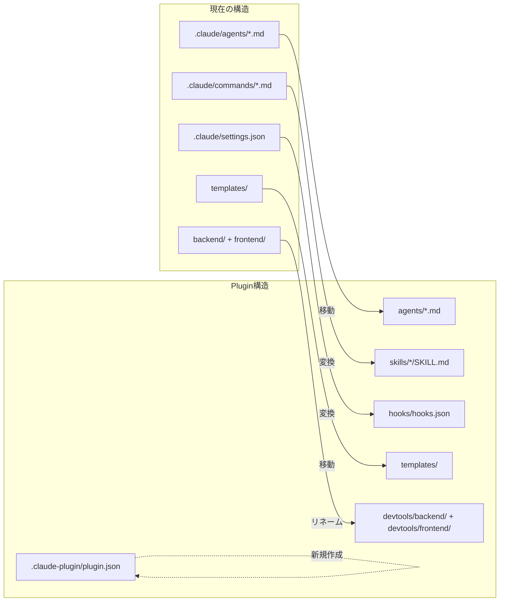

# GhostrunnerリポジトリをClaude Code Plugin構造に変換する 実装計画

## 概要

Ghostrunnerリポジトリを Claude Code Plugin 構造に変換し、`/plugin install ghostrunner` でどのプロジェクトからでも利用可能にする。

## 検討資料

- [開発/検討中/2026-03-20_Ghostrunner配布方法.md](../../検討中/2026-03-20_Ghostrunner配布方法.md)
- [/tmp/claude-code-plugin-research.md](/tmp/claude-code-plugin-research.md) - Claude Code Plugin 仕様調査

## 懸念点と決定事項

### 懸念1: commands/ vs skills/

**決定: skills/ を使用する（推奨形式）**

- `commands/` はレガシー。`skills/<name>/SKILL.md` が新しい推奨形式
- 変換は機械的（ファイルをディレクトリに入れて SKILL.md にリネーム）
- 将来のリスクを避けるため、最初から skills/ にする

### 懸念2: `${CLAUDE_PLUGIN_ROOT}` の既知の不具合

**決定: まず普通に使い、ダメならBashで動的取得**

- Issue #9354（コマンドMD内で展開されない）は修正済みの可能性あり
- スキルコンテンツ内では `${CLAUDE_PLUGIN_ROOT}` はインライン展開される（公式ドキュメント確認済み）
- ダメだった場合のフォールバック: `echo $CLAUDE_PLUGIN_ROOT` でBash経由取得

### 懸念3: devtools の起動方法

**決定: シンボリックリンク方式**

- `/init` 実行時に `ln -s ${CLAUDE_PLUGIN_ROOT}/devtools .devtools` を作成
- テンプレートの Makefile に `make devtools` を追加（`.devtools/` を参照）
- `make dev` にも含めて自動起動
- リンク切れ時は `/init` 再実行で修復

---

## 現在の構造 → Plugin構造の変換マップ



### 詳細な対応表

| 現在 | Plugin後 | 操作 |
|------|---------|------|
| `.claude/agents/*.md` (27ファイル) | `agents/*.md` | 移動（内容変更なし） |
| `.claude/commands/init.md` | `skills/init/SKILL.md` | 移動+リネーム+パス書換 |
| `.claude/commands/fullstack.md` | `skills/fullstack/SKILL.md` | 移動+リネーム |
| `.claude/commands/plan.md` | `skills/plan/SKILL.md` | 移動+リネーム |
| `.claude/commands/go.md` | `skills/go/SKILL.md` | 移動+リネーム |
| `.claude/commands/nextjs.md` | `skills/nextjs/SKILL.md` | 移動+リネーム |
| `.claude/commands/stage.md` | `skills/stage/SKILL.md` | 移動+リネーム |
| `.claude/commands/release.md` | `skills/release/SKILL.md` | 移動+リネーム |
| `.claude/commands/hotfix.md` | `skills/hotfix/SKILL.md` | 移動+リネーム |
| `.claude/commands/fix.md` | `skills/fix/SKILL.md` | 移動+リネーム |
| `.claude/commands/discuss.md` | `skills/discuss/SKILL.md` | 移動+リネーム |
| `.claude/commands/research.md` | `skills/research/SKILL.md` | 移動+リネーム |
| `.claude/commands/destroy.md` | `skills/destroy/SKILL.md` | 移動+リネーム |
| `.claude/settings.json` | `hooks/hooks.json` | フック部分を抽出・変換 |
| `templates/` | `templates/` | 位置そのまま、Makefile追加 |
| `backend/` | `devtools/backend/` | リネーム |
| `frontend/` | `devtools/frontend/` | リネーム |
| (なし) | `.claude-plugin/plugin.json` | 新規作成 |
| (なし) | `skills/devtools/SKILL.md` | 新規作成 |

---

## 実装ステップ

### Phase 1: Plugin基盤の作成

#### Step 1: `.claude-plugin/plugin.json` を作成

```json
{
  "name": "ghostrunner",
  "version": "1.0.0",
  "description": "Claude Code用フルスタック開発フレームワーク - エージェント・コマンド・テンプレート・devtools を統合",
  "author": {
    "name": "nyan-tama"
  },
  "repository": "https://github.com/nyan-tama/Ghostrunner",
  "license": "MIT",
  "keywords": ["fullstack", "go", "nextjs", "development-workflow", "project-starter"]
}
```

#### Step 2: agents/ をプラグインルートに移動

```bash
mv .claude/agents agents
```

内容の変更は不要。27ファイルそのまま。

#### Step 3: commands/ を skills/ に変換

各コマンドファイルをスキル形式に変換する。

```bash
# 12コマンド分のディレクトリを作成
for cmd in init fullstack plan go nextjs stage release hotfix fix discuss research destroy; do
  mkdir -p skills/$cmd
  mv .claude/commands/$cmd.md skills/$cmd/SKILL.md
done
```

各 SKILL.md にフロントマターを追加（先頭に）:

```markdown
---
name: <コマンド名>
description: <1行の説明>
allowed-tools: [Read, Write, Edit, Bash, Glob, Grep, Agent, TodoWrite, AskUserQuestion]
---
```

各スキルの description:

| スキル | description |
|--------|-----------|
| init | プロジェクトスターター - 新規プロジェクトを対話的に生成 |
| fullstack | フルスタック実装 - 計画からコミットまでを一括実行 |
| plan | 実装計画作成 - 仕様書分析と懸念点の洗い出し |
| go | Go バックエンド実装サイクル |
| nextjs | Next.js フロントエンド実装サイクル |
| stage | ステージング環境にデプロイ |
| release | 本番リリース - staging を main にマージ |
| hotfix | 緊急本番修正 |
| fix | 本番問題の修正判定と実行 |
| discuss | アイデアや課題の対話的深掘り |
| research | 外部情報の調査レポート作成 |
| destroy | プロジェクト削除 |

#### Step 4: settings.json からフックを抽出して hooks/hooks.json を作成

`.claude/settings.json` の `hooks` セクションを抽出し、`hooks/hooks.json` に配置する。

**変更点:**
- パス参照のあるシェルスクリプトは `${CLAUDE_PLUGIN_ROOT}` を使用するように変更
- `permissions` セクションは hooks.json には含めない（プロジェクト固有）

hooks/hooks.json の構造:
```json
{
  "hooks": {
    "PreToolUse": [...],
    "PostToolUse": [...],
    "Stop": [...]
  }
}
```

**注意**: 現在のフック内のスクリプトにはハードコードされたパスはなく、インラインのシェルコマンドのみなので、パス書き換えは不要。

#### Step 5: backend/ と frontend/ を devtools/ に移動

```bash
mkdir devtools
mv backend devtools/backend
mv frontend devtools/frontend
```

### Phase 2: /init スキルのパス修正

#### Step 6: skills/init/SKILL.md のテンプレートパスを修正

現在:
```bash
cp -r /Users/user/Ghostrunner/templates/base/. /Users/user/<プロジェクト名>/
```

修正後:
```bash
cp -r ${CLAUDE_PLUGIN_ROOT}/templates/base/. /Users/user/<プロジェクト名>/
```

全ての `/Users/user/Ghostrunner/templates/` を `${CLAUDE_PLUGIN_ROOT}/templates/` に置換する。

#### Step 7: /init に .claude/ 資産コピーの修正

現在（Step 7.1）:
```bash
cp /Users/user/Ghostrunner/.claude/agents/*.md /Users/user/<プロジェクト名>/.claude/agents/
cp /Users/user/Ghostrunner/.claude/commands/*.md /Users/user/<プロジェクト名>/.claude/commands/
cp /Users/user/Ghostrunner/.claude/settings.json /Users/user/<プロジェクト名>/.claude/settings.json
```

修正後:
```bash
# agents をコピー
cp ${CLAUDE_PLUGIN_ROOT}/agents/*.md /Users/user/<プロジェクト名>/.claude/agents/

# skills を commands 形式でコピー（生成先プロジェクトはPlugin構造ではないので commands/ のまま）
for skill_dir in ${CLAUDE_PLUGIN_ROOT}/skills/*/; do
  skill_name=$(basename "$skill_dir")
  cp "$skill_dir/SKILL.md" "/Users/user/<プロジェクト名>/.claude/commands/${skill_name}.md"
done

# hooks.json を settings.json に変換してコピー
# hooks/hooks.json のhooksセクションを settings.json に埋め込む
```

**注意**: 生成先プロジェクトは Plugin ではないので、`.claude/commands/` と `.claude/settings.json` の形式を維持する。

#### Step 8: /init にシンボリックリンク作成を追加

Step 8（Git初期化）の前に、devtools へのシンボリックリンクを作成する:

```bash
ln -s ${CLAUDE_PLUGIN_ROOT}/devtools /Users/user/<プロジェクト名>/.devtools
```

`.gitignore` に `.devtools` を追加する。

### Phase 3: テンプレートの Makefile 修正

#### Step 9: テンプレートの Makefile に devtools を追加

`templates/base/Makefile` に以下を追加:

```makefile
# devtools（進捗ビューア）
devtools:
	@if [ ! -L .devtools ]; then echo "devtools が見つかりません。Ghostrunner Plugin をインストールしてください。"; exit 1; fi
	@cd .devtools && PROJECT_DIR=$$(cd .. && pwd) npm run dev -- -p 3001
```

`make dev` ターゲットに devtools を追加:
```makefile
dev:
	@make backend & make frontend & make devtools
```

### Phase 4: devtools の修正

#### Step 10: devtools の環境変数対応

`devtools/frontend/src/lib/docs/fileSystem.ts` を修正し、`PROJECT_DIR` 環境変数から対象プロジェクトのパスを取得するようにする。

現在: Ghostrunner自身の `開発/` を読む（ハードコードまたは相対パス）
修正後: `process.env.PROJECT_DIR` から対象プロジェクトのパスを取得し、そのプロジェクトの `開発/` を読む

#### Step 11: /devtools スキルを作成

```
skills/devtools/SKILL.md
```

```markdown
---
name: devtools
description: 開発進捗ビューアを起動
allowed-tools: [Bash]
---

devtools（開発ドキュメントビューア）を起動する。

## 実行

カレントディレクトリの 開発/ 配下のMDファイルをブラウザで閲覧できるようにする。

```bash
cd ${CLAUDE_PLUGIN_ROOT}/devtools && PROJECT_DIR=$(pwd) npm run dev -- -p 3001
```

起動後、http://localhost:3001 でアクセス可能。
```

### Phase 5: クリーンアップ

#### Step 12: 不要になったファイル・ディレクトリの削除

```bash
rm -rf .claude/agents/      # agents/ に移動済み
rm -rf .claude/commands/     # skills/ に変換済み
# .claude/settings.json は残す（Ghostrunner自体の開発用）
# .claude/CLAUDE.md は残す（Ghostrunner自体の開発用）
```

#### Step 13: .claude/CLAUDE.md の更新

Ghostrunner自体のCLAUDE.mdを更新し、Plugin構造であることを反映する:
- ファイル構造セクションをPlugin構造に更新
- devtools/ の説明を追加

#### Step 14: .gitignore の更新

```
# Plugin 開発時
.devtools
```

### Phase 6: テスト

#### Step 15: ローカルでPluginとしてテスト

```bash
# Plugin として直接ロード
claude --plugin-dir /Users/user/Ghostrunner

# 動作確認
# 1. /init でプロジェクト生成ができるか
# 2. 生成されたプロジェクトで /fullstack, /plan 等が使えるか
# 3. make devtools でdevtoolsが起動するか
# 4. devtools から生成プロジェクトの 開発/ が閲覧できるか
```

---

## 変換後のディレクトリ構造

```
Ghostrunner/（= ghostrunner-plugin）
├── .claude-plugin/
│   └── plugin.json
├── .claude/
│   ├── CLAUDE.md              # Ghostrunner自体の開発用（残す）
│   └── settings.json          # Ghostrunner自体の開発用（残す）
├── agents/                    # 27エージェント
│   ├── discuss.md
│   ├── fix-judge.md
│   ├── go-documenter.md
│   ├── go-impl.md
│   ├── go-plan-reviewer.md
│   ├── go-planner.md
│   ├── go-reviewer.md
│   ├── go-tester.md
│   ├── nextjs-documenter.md
│   ├── nextjs-impl.md
│   ├── nextjs-plan-reviewer.md
│   ├── nextjs-planner.md
│   ├── nextjs-reviewer.md
│   ├── nextjs-tester.md
│   ├── pg-impl.md
│   ├── pg-planner.md
│   ├── pg-reviewer.md
│   ├── pg-tester.md
│   ├── redis-impl.md
│   ├── redis-planner.md
│   ├── release-manager.md
│   ├── reporter.md
│   ├── research.md
│   ├── staging-manager.md
│   ├── storage-impl.md
│   ├── storage-planner.md
│   └── test-planner.md
├── skills/                    # 13スキル（12コマンド + devtools）
│   ├── init/
│   │   └── SKILL.md
│   ├── fullstack/
│   │   └── SKILL.md
│   ├── plan/
│   │   └── SKILL.md
│   ├── go/
│   │   └── SKILL.md
│   ├── nextjs/
│   │   └── SKILL.md
│   ├── stage/
│   │   └── SKILL.md
│   ├── release/
│   │   └── SKILL.md
│   ├── hotfix/
│   │   └── SKILL.md
│   ├── fix/
│   │   └── SKILL.md
│   ├── discuss/
│   │   └── SKILL.md
│   ├── research/
│   │   └── SKILL.md
│   ├── destroy/
│   │   └── SKILL.md
│   └── devtools/
│       └── SKILL.md
├── hooks/
│   └── hooks.json
├── templates/
│   ├── base/
│   │   ├── Makefile           # devtools ターゲット追加
│   │   └── ...
│   ├── with-db/
│   ├── with-storage/
│   └── with-redis/
├── devtools/                  # 進捗ビューア（旧 backend/ + frontend/）
│   ├── backend/
│   │   ├── cmd/server/
│   │   ├── internal/
│   │   └── ...
│   └── frontend/
│       ├── src/app/docs/
│       ├── src/components/docs/
│       └── ...
├── 開発/                      # 開発ドキュメント（維持）
├── 保守/
├── 概要.md
├── Makefile                   # Ghostrunner自体の開発用（残す）
└── .gitignore
```

---

## 影響範囲

### 変更されるファイル

| ファイル | 変更内容 |
|---------|---------|
| skills/init/SKILL.md（旧 .claude/commands/init.md） | テンプレートパスを `${CLAUDE_PLUGIN_ROOT}` に変更、.claude/資産コピーのロジック変更、シンボリックリンク作成追加 |
| devtools/frontend/src/lib/docs/fileSystem.ts | PROJECT_DIR 環境変数からパスを取得する対応 |
| templates/base/Makefile | devtools ターゲット追加、dev ターゲットに devtools 追加 |
| .claude/CLAUDE.md | Plugin構造を反映した更新 |
| .gitignore | .devtools 追加 |

### 新規作成されるファイル

| ファイル | 内容 |
|---------|------|
| .claude-plugin/plugin.json | プラグインマニフェスト |
| hooks/hooks.json | フック設定（settings.jsonから抽出） |
| skills/devtools/SKILL.md | devtools 起動スキル |

### 移動されるファイル

| 移動元 | 移動先 |
|--------|--------|
| .claude/agents/*.md (27ファイル) | agents/*.md |
| .claude/commands/*.md (12ファイル) | skills/*/SKILL.md |
| backend/ | devtools/backend/ |
| frontend/ | devtools/frontend/ |

### 削除されるファイル

| ファイル | 理由 |
|---------|------|
| .claude/agents/ (ディレクトリ) | agents/ に移動済み |
| .claude/commands/ (ディレクトリ) | skills/ に変換済み |
