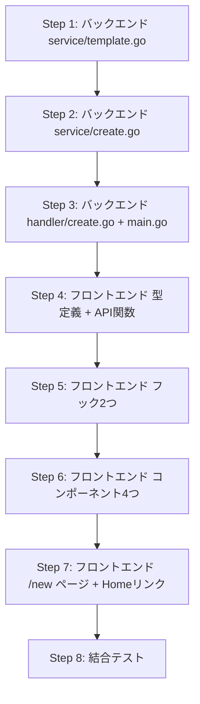

# devtools GUIプロジェクト作成画面 実装計画

## Context

CLIの `/init` コマンドは非エンジニアには分かりにくい。devtoolsのブラウザUI（localhost:3001）にフォーム画面を作り、ポチポチ選ぶだけでプロジェクト生成できるようにする。同人誌「非エンジニアでもClaude CodeでWebシステムを作る方法」の導入体験としても重要。

検討資料: `開発/検討中/2026-03-20_devtools_GUI_プロジェクト作成画面.md`

## 実装方針

- Claude CLIを使わず、Goコードで直接プロジェクト生成（高速・進捗表示が正確・APIコスト不要）
- SSEで進捗をリアルタイム表示
- 1画面フォーム → 進捗表示 → 完了画面（VS Codeで開くボタン）

---

## バックエンド計画

### 変更ファイル一覧

| ファイル | 変更 | 内容 |
|---------|------|------|
| `devtools/backend/internal/service/template.go` | 新規 | テンプレートコピー、プレースホルダー置換、docker-compose結合 |
| `devtools/backend/internal/service/create.go` | 新規 | プロジェクト生成オーケストレーション（CreateService インターフェース + 実装） |
| `devtools/backend/internal/handler/create.go` | 新規 | 3エンドポイントのハンドラー + CreateEvent用SSE送信 |
| `devtools/backend/cmd/server/main.go` | 修正 | DI追加、ルーティング3行追加 |
| `devtools/backend/go.mod` | 修正 | `gopkg.in/yaml.v3` 追加（docker-compose結合用） |

### APIエンドポイント

**1. GET /api/projects/validate?name={name}**
- プロジェクト名バリデーション（形式 + ディレクトリ存在チェック）
- 正規表現: `^[a-z0-9]+(-[a-z0-9]+)*$`
- レスポンス: `{ valid, path, error }`

**2. POST /api/projects/create/stream (SSE)**
- リクエスト: `{ name, description, services[] }`
- 10ステップ、各完了時にSSEでprogressイベント送信
- SSEイベント: `{ type: "progress"|"complete"|"error", step, message, progress }`

**3. POST /api/projects/open**
- リクエスト: `{ path }`
- `exec.Command("code", path)` でVS Code起動

### 生成ステップ（service/create.go）

| # | step ID | ラベル | 処理 |
|---|---------|--------|------|
| 1 | template_copy | テンプレートをコピー中 | base + オプションテンプレートのコピー |
| 2 | placeholder_replace | プロジェクト名を設定中 | {{PROJECT_NAME}} 置換 |
| 3 | env_create | 環境設定ファイルを作成中 | .env.example → .env + サービス別変数追加 |
| 4 | dependency_install | 依存パッケージをインストール中 | go mod tidy + npm install |
| 5 | claude_assets | 開発支援ツールを設定中 | .claude/ 資産コピー + 不要エージェント削除 |
| 6 | claude_md | プロジェクト設定を生成中 | CLAUDE.md テンプレート生成 |
| 7 | devtools_link | devtools を接続中 | シンボリックリンク作成 |
| 8 | git_init | バージョン管理を初期化中 | git init + add + commit |
| 9 | server_start | サーバーを起動中 | docker-compose up + backend/frontend起動 |
| 10 | health_check | 動作確認中 | localhost:8080/api/health ポーリング |

### docker-compose 結合ルール
- YAML パース（`gopkg.in/yaml.v3`）でマップマージ
- database選択時: with-db の docker-compose.yml をベースにする（backendサービスにenv/depends_on追加があるため）
- storage/cache: services と volumes を追加マージ

### テンプレートパス解決
- Ghostrunnerリポジトリルートからの相対パス（`../templates/`）
- devtools/backend は Ghostrunner/devtools/backend/ で動作する前提

### CLAUDE.md 生成
- Ghostrunnerの `.claude/CLAUDE.md` をベースに、プロジェクト名・概要・選択サービスに応じてセクションを組み立て
- テンプレートリテラルとして Go コード内に持つ

---

## フロントエンド計画

### 変更ファイル一覧

| ファイル | 変更 | 内容 |
|---------|------|------|
| `devtools/frontend/src/types/index.ts` | 修正 | 型追加（CreateProjectRequest, CreateProgressEvent, CreateStep, CreatedProject, CreatePhase, DataService） |
| `devtools/frontend/src/lib/createApi.ts` | 新規 | API呼び出し3関数（validateProjectName, createProjectStream, openInVSCode） |
| `devtools/frontend/src/hooks/useProjectValidation.ts` | 新規 | 300msデバウンス付きバリデーション |
| `devtools/frontend/src/hooks/useProjectCreate.ts` | 新規 | SSE通信 + 状態遷移管理 |
| `devtools/frontend/src/components/create/ServiceSelector.tsx` | 新規 | Data Servicesチェックボックス3つ |
| `devtools/frontend/src/components/create/ProjectForm.tsx` | 新規 | フォーム入力 + 確認セクション |
| `devtools/frontend/src/components/create/CreateProgress.tsx` | 新規 | チェックリスト + プログレスバー |
| `devtools/frontend/src/components/create/CreateComplete.tsx` | 新規 | 完了画面（URL + ボタン） |
| `devtools/frontend/src/app/new/page.tsx` | 新規 | /new ページ本体（phase切り替え） |
| `devtools/frontend/src/app/page.tsx` | 修正 | ヘッダーに "New Project" リンク追加 |

### 状態遷移

```
Form → Creating → Complete（成功）
                → Error（失敗）→ Form（やり直し、入力値保持）
Complete → Form（もう1つ作る）
```

### コンポーネント構成

- **page.tsx**: `useProjectCreate` で phase 管理、phase に応じて表示切替
- **ProjectForm**: 名前入力（useProjectValidation）+ 概要 + ServiceSelector + 確認セクション常時表示
- **CreateProgress**: 10ステップのチェックリスト（完了=チェック、進行中=pulse、未着手=空丸）+ プログレスバー
- **CreateComplete**: 成功メッセージ + URL + [Open in VS Code] + [Create Another]

### SSEパース
- `useSSEStream` は `StreamEvent` 型専用のため直接再利用せず、同じ ReadableStream パースロジックを `useProjectCreate` 内に持つ

---

## 実装順序



---

## 検証方法

1. `make dev` で devtools 起動
2. ブラウザで `localhost:3001/new` にアクセス
3. フォーム入力 → [Create Project] → 進捗表示 → 完了
4. [Open in VS Code] でプロジェクトが開く
5. 開いたプロジェクトで `/fullstack`, `/plan` が認識される
6. `make dev` でバックエンド + フロントエンドが起動する

---

## バックエンド実装レポート

### 実装サマリー
- **実装日**: 2026-03-20
- **対象**: devtools/backend/ 配下のみ（フロントエンドは未実装）
- **変更ファイル数**: 7 files（新規6 + 修正1）
- **テスト結果**: 全47テスト パス（新規31件 + 既存16件）、go vet / go fmt / go build 全パス

### 変更ファイル一覧

| ファイル | 変更種別 | 変更内容 |
|---------|---------|---------|
| `internal/service/template.go` | 新規 | TemplateService: テンプレートコピー（base + サービス別）、プレースホルダー置換、docker-compose YAMLマージ、.envファイル生成、.claude資産コピー、不要エージェント削除、CLAUDE.md生成、devtoolsシンボリックリンク作成 |
| `internal/service/create.go` | 新規 | CreateProjectServiceインターフェース + CreateService実装: 10ステップのプロジェクト生成オーケストレーション、バリデーション、VS Code起動、SSEイベント送信 |
| `internal/handler/create.go` | 新規 | CreateHandler: 3エンドポイント（validate/create-stream/open）のHTTPハンドラ、SSEストリーミング送信、サービス名バリデーション、パストラバーサル防止 |
| `internal/service/template_test.go` | 新規 | TemplateServiceのテスト: serviceTemplateDir、isBinaryFile、mergeYAMLMaps、ReplacePlaceholders、buildClaudeMD（計5テスト関数、テーブル駆動で多数のケース） |
| `internal/service/create_test.go` | 新規 | CreateServiceのテスト: ValidateProjectName（12ケース）、ProjectBaseDir、CreateProject_ContextCancel、CreateProject_SendsProgressEvents |
| `internal/handler/create_test.go` | 新規 | CreateHandlerのテスト: HandleValidate（3ケース）、HandleOpen（7ケース含むパストラバーサル攻撃検出）、HandleCreateStream不正JSON/不正サービス、VS Codeエラー、validateServices（4ケース） |
| `cmd/server/main.go` | 修正 | DI追加（runtime.Caller でGhostrunnerルート解決 → TemplateService → CreateService → CreateHandler）、ルーティング3行追加 |

### 計画からの変更点

- **go.mod の変更は不要だった**: 計画では `gopkg.in/yaml.v3` の追加を記載していたが、既に依存に含まれていた（indirect として存在済み）。go.mod の修正は発生しなかった
- **Ghostrunnerルートの解決方法**: 計画には詳細がなかったが、`runtime.Caller(0)` でソースファイルの絶対パスを取得し、4階層上をGhostrunnerルートとする方式を採用した
- **プロジェクト生成先ディレクトリ**: 計画に明記がなかったが、`os.UserHomeDir()` をベースディレクトリとし、`~/プロジェクト名` に生成する方式とした
- **SSEヘルパー関数の再利用**: 既存の `sse.go` にある `setSSEHeaders` と `sseKeepaliveInterval` を再利用し、create.go 側は `writeCreateSSEEvents` のみ新規実装とした
- **サーバー起動ステップ**: 計画では `docker-compose up` と記載されていたが、実装では `make start-backend` を使用した。フロントエンド起動は含めていない（devtools のフロントエンドはこのステップでは不要なため）

### 実装時の課題

特になし

### 残存する懸念点

- **Ghostrunnerルートのパス解決**: `runtime.Caller(0)` によるソースファイルパスベースの解決は、`go build` でバイナリ化した場合にソースのパスが変わる可能性がある。現在は `go run` での開発利用を前提としているため問題ないが、バイナリ配布時には環境変数等での指定が必要になる
- **サーバー起動ステップの信頼性**: `make start-backend` を `exec.Command.Start()` で非同期実行し、3秒待機してから次に進む設計のため、環境によっては起動が間に合わない場合がある。ヘルスチェック（step 10）でリトライするため実用上は問題ないが、タイムアウト値の調整が必要になる可能性がある
- **ヘルスチェックのポート固定**: localhost:8080 がハードコードされている。生成されたプロジェクトのバックエンドポートが変更された場合には対応できない
- **VS Code の `code` コマンド依存**: `code` コマンドがPATHにない環境ではOpenInVSCodeが失敗する。エラーメッセージは返すが、ユーザーへの案内（PATH設定方法等）は含めていない

### 動作確認フロー

```
1. make backend でdevtoolsバックエンドを起動
2. curl でバリデーションAPIを確認:
   curl "http://localhost:8080/api/projects/validate?name=my-project"
   -> {"valid":true,"path":"/Users/user/my-project"} が返ること
3. curl で不正な名前のバリデーションを確認:
   curl "http://localhost:8080/api/projects/validate?name=My-Project"
   -> {"valid":false,"error":"..."} が返ること
4. SSE作成APIは結合テスト時にフロントエンドと合わせて確認
5. go test ./... で全テストがパスすること
```

### デプロイ後の確認事項

- [ ] `go test ./...` で全47テストがパスすること
- [ ] `go vet ./...` で警告がないこと
- [ ] バリデーションAPIが正常に応答すること（`/api/projects/validate?name=test`）
- [ ] フロントエンド実装後にSSE作成API（`/api/projects/create/stream`）の結合テストを実施すること
- [ ] フロントエンド実装後にOpen API（`/api/projects/open`）のE2Eテストを実施すること

---

## フロントエンド実装レポート

### 実装サマリー
- **実装日**: 2026-03-20
- **対象**: devtools/frontend/ 配下のみ
- **変更ファイル数**: 11 files（新規9 + 修正2）
- **テスト結果**: 全84テスト パス（新規15件 + 既存69件）、ビルド・型チェック成功

### 変更ファイル一覧

| ファイル | 変更種別 | 行数 | 変更内容 |
|---------|---------|------|---------|
| `src/types/index.ts` | 修正 | 143行(全体) | 型追加6つ: DataService（リテラル型）、CreateProjectRequest、CreateProgressEvent、CreateStep、CreatedProject、CreatePhase |
| `src/lib/createApi.ts` | 新規 | 61行 | API呼び出し3関数: validateProjectName（AbortSignal対応）、createProjectStream（SSEレスポンス返却）、openInVSCode。API_BASEは環境変数 `NEXT_PUBLIC_API_BASE` で切り替え可能 |
| `src/hooks/useProjectValidation.ts` | 新規 | 81行 | 300msデバウンス付きプロジェクト名バリデーション。タイマーとAbortControllerをuseRefで管理し、onNameChangeの参照安定性を保つ設計。前回リクエストのキャンセルに対応 |
| `src/hooks/useProjectCreate.ts` | 新規 | 206行 | SSE通信 + 4フェーズ（form/creating/complete/error）の状態遷移管理。ReadableStreamのSSEパース処理を内蔵。10ステップの進捗状態（pending/active/done/error）を管理。AbortControllerによるキャンセル対応 |
| `src/components/create/ServiceSelector.tsx` | 新規 | 52行 | Data Servicesチェックボックス3つ（PostgreSQL+GORM, Cloudflare R2/MinIO, Redis）。イミュータブルな配列操作でselected状態を管理 |
| `src/components/create/ProjectForm.tsx` | 新規 | 155行 | フォーム入力（名前+概要+サービス選択）+ Summary確認セクション常時表示。initialName設定時のマウントバリデーション、Enterキー送信、バリデーション状態に連動したSubmitボタン制御 |
| `src/components/create/CreateProgress.tsx` | 新規 | 80行 | 10ステップチェックリスト（SVGアイコン: done=チェック, active=スピナー, error=X, pending=空丸）+ プログレスバー（パーセント表示付き） |
| `src/components/create/CreateComplete.tsx` | 新規 | 74行 | 完了画面: 成功メッセージ + プロジェクトパス表示 + [Open in VS Code]ボタン（ローディング状態対応）+ [Create Another]ボタン |
| `src/app/new/page.tsx` | 新規 | 95行 | /new ページ本体: useProjectCreateでphase管理、phase=form/errorでProjectForm、phase=creatingでCreateProgress、phase=completeでCreateCompleteを表示。エラー復帰時の入力値保持（lastInput state） |
| `src/app/page.tsx` | 修正 | 610行(全体) | ヘッダーに "New Project" リンク追加（purple系スタイル、/new へのナビゲーション） |
| テストファイル5つ | 新規 | 計239行 | createApi.test.ts（10ケース）、ServiceSelector.test.tsx（3ケース）、ProjectForm.test.tsx（2ケース）、CreateProgress.test.tsx（4ケース）、CreateComplete.test.tsx（3ケース）。ただし `src/` 直下と `src/__tests__/` に重複配置あり |

### 計画からの変更点

実装計画に記載がなかった判断・選択:

- **SSEパースの実装方式**: 計画では「useSSEStreamは StreamEvent 型専用のため直接再利用せず、同じパースロジックを useProjectCreate 内に持つ」と記載されていたが、実装でもその通り ReadableStream のパースロジックを `processSSEResponse` 関数として useProjectCreate 内に実装した。計画通り
- **AbortSignal対応の追加**: 計画には明記されていなかったが、validateProjectName と createProjectStream の両方に AbortSignal パラメータを追加。デバウンス中のリクエストキャンセルとページ離脱時の中断に対応
- **テストファイルの重複配置**: テストファイルが `src/components/create/*.test.tsx` と `src/__tests__/components/create/*.test.tsx` の両方に同一内容で配置されている。vitest の設定次第で片方のみ実行される可能性があるが、現在は84テスト全パスしている
- **エラー復帰時の入力値保持**: 計画の状態遷移図に「Error → Form（やり直し、入力値保持）」と記載があり、page.tsx の `lastInput` state + ProjectForm の `initialName/initialDescription/initialServices` props で実現。加えて `initialName` 設定時のマウントバリデーション（useEffect）も追加

### レビューで修正した項目

| 項目 | 問題 | 修正内容 |
|------|------|---------|
| useProjectValidation stale closure | useState の setter 関数内から最新の name を参照できないケースがあった | タイマーと AbortController の管理を useState から useRef に変更し、onNameChange を useCallback で安定化 |
| validateProjectName AbortSignal | デバウンス中に連続入力すると前回リクエストが完了まで走り続ける問題 | AbortSignal パラメータを追加し、前回リクエストを abort() でキャンセル |
| ProjectForm initialName バリデーション | エラー復帰時に initialName が設定されていてもバリデーション結果が空（valid=null）のまま | useEffect でマウント時に onNameChange(initialName) を呼び出し、初期バリデーションを実行 |
| processSSEResponse エラーレスポンス | response.ok が false の場合に response.json() が失敗するとキャッチされない | try-catch を追加し、JSON パース失敗時は HTTP ステータスコードを含むフォールバックメッセージを表示 |

### 実装時の課題

特になし

### 残存する懸念点

今後注意が必要な点:

- **テストファイルの重複**: `src/` 直下（コロケーション）と `src/__tests__/` の両方に同一テストファイルが存在する。どちらかに統一すべき。現在の vitest 設定で重複実行されていないか確認が必要
- **useProjectCreate のフック内 SSE パース**: ReadableStream のパースロジックが useProjectCreate 内にインラインで記述されている。既存の useSSEStream と類似のロジックがあるが、型が異なる（StreamEvent vs CreateProgressEvent）ため統合は困難。将来的にジェネリック化を検討する余地がある
- **エラー復帰時の eslint-disable**: ProjectForm の useEffect で `eslint-disable-next-line react-hooks/exhaustive-deps` を使用している。onNameChange が useCallback で安定しているため実害はないが、依存配列の省略は将来のリファクタリング時に見落とされるリスクがある
- **"New Project" リンクのルーティング**: page.tsx では `<a href="/new">` を使用しており、Next.js の `<Link>` コンポーネントではない。クライアントサイドナビゲーションではなくフルページリロードが発生する

### 動作確認フロー

```
1. make dev で devtools を起動
2. ブラウザで http://localhost:3001 にアクセス
3. ヘッダーの "New Project" リンクをクリック → /new ページに遷移すること
4. Project Name に "my-test-app" を入力
   → 300ms後にバリデーション結果が表示されること（"Will be created at: /Users/user/my-test-app"）
5. Project Name に "My-App" を入力
   → バリデーションエラーが表示されること
6. Description に任意のテキストを入力
7. Data Services から PostgreSQL + GORM にチェック
   → Summary セクションに選択内容が反映されること
8. [Create Project] ボタンをクリック
   → 進捗画面に切り替わり、10ステップが順次チェックされること
   → プログレスバーが 0% → 100% に進むこと
9. 完了画面で "Project Created" と表示されること
10. [Open in VS Code] をクリック → VS Code でプロジェクトが開くこと
11. [Create Another] をクリック → フォーム画面に戻ること（入力値はクリア）
12. 作成中にバックエンドでエラーが発生した場合:
    → エラーメッセージが表示され、フォーム画面に戻れること（入力値は保持）
```

### デプロイ後の確認事項

- [ ] `cd devtools/frontend && npm run build` でビルドが通ること
- [ ] `cd devtools/frontend && npx vitest run` で全84テストがパスすること
- [ ] `/new` ページにアクセスしてフォームが表示されること
- [ ] プロジェクト名バリデーションがリアルタイムで動作すること（デバウンス300ms）
- [ ] SSE による進捗表示が正常に動作すること（バックエンドとの結合）
- [ ] エラー発生時にフォーム画面に戻り、入力値が保持されること
- [ ] [Open in VS Code] ボタンでプロジェクトが開けること
- [ ] ホーム画面の "New Project" リンクから /new に遷移できること
