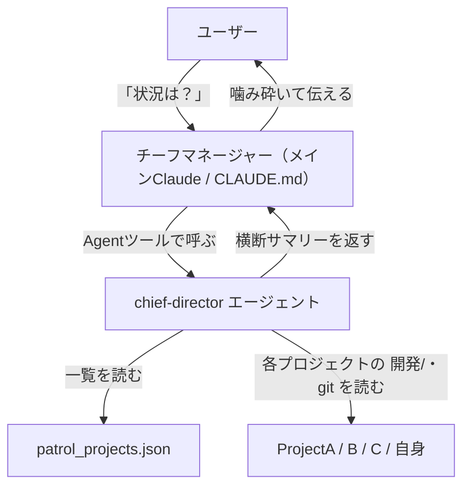

# 統括チーフディレクター（把握MVP）実装計画

作成日: 2026-05-24
種別: Claude Code エージェント定義（アプリコードではない。go/nextjs/swift プランナー対象外）
元検討: [開発/検討中/2026-05-24_複数プロジェクト統括ターミナル.md](../../検討中/2026-05-24_複数プロジェクト統括ターミナル.md)

## 概要

統括ターミナルの **Layer1（把握）** の最小実装。Ghostrunner ターミナルから「全プロジェクトの状況は？」と
聞くと、チーフディレクター エージェントが全登録プロジェクトの `開発/` フォルダと git 状態を読み、
状況を集約して報告する。**読み取り専用**（実行・書き込み・通知・解消はしない）。



## スコープ

### やること（MVP）

- チーフディレクター エージェント定義（`.claude/agents/chief-director.md`）を新規作成
- 登録プロジェクト一覧（`devtools/backend/patrol_projects.json`）を読む
- 各プロジェクトの `開発/` フォルダ（`検討中/`・`実装待ち/`・`実行中/`・`完了/`）と git log/status を読む
- 各プロジェクトの計画書から **未回答の確認事項** を検出
- 横断状況を集約して報告（注意が必要な所を優先表示）

### やらないこと（MVP外・次フェーズ）

- 一括/coding 等の実行（Layer2）、gr-run / flock / 通知
- 確認事項の回答書き戻し、異常終了のディレクター調査（人間トリガーで後日）
- Q5（統括の起動方法: 兼任/明示/分離）の本格設計
- 各プロジェクトへ配る単体層ディレクター（templates/ 反映は別タスク）

## 作成・変更するファイル

| ファイル | 操作 | 内容 |
|---|---|---|
| `.claude/agents/chief-director.md` | 新規 | チーフディレクター エージェント定義（本MVPの本体） |
| `.claude/CLAUDE.md` | 追記（最小） | 「全プロジェクトの状況」を聞かれたら chief-director を呼ぶ、という最小の案内（任意・確実性のため） |

注:
- 統括層は **Ghostrunner 固有**のため `templates/` にはコピーしない（単体層ディレクターを各プロジェクトに配るのは別タスク）。
- `.claude/` 配下の変更は**ブランチを切る**（メモリの方針 [[feedback_branch_for_claude_dir]]）。本計画書（`開発/` 配下）は main で可。

## エージェントの責務・入出力

- **入力**: チーフマネージャー（メインClaude）からの「状況確認」依頼
- **ツール**: Read, Glob, Grep, Bash（git 用）。書き込み系ツールは付けない（読み取り専用を担保）
- **出力**: 横断状況サマリー（テキスト）。状態変更は一切しない

## 状態判定ロジック（フォルダ＋確認事項ベース）

各プロジェクトについて、`開発/` フォルダの中身から状態を導出する（詳細は元検討の「状態モデル」を参照）。

- `検討中/` のファイル数 → 検討中
- `実装待ち/` のファイル数 → 未着手
- `実行中/` のファイル → 実行中候補。**MVPでは flock 判定はせず**「実行中フォルダにN件」と報告（flockによる実行中/異常終了の精密判定は Layer2/gr-run 導入後）
- `完了/` のファイル → 完了（最近の分）
- 各計画書（`*_plan.md` 等）をスキャンし「確認事項」セクションのステータスが未回答のもの（正規フォーマットは太字のステータス行）を検出 → 確認事項待ち件数

前方互換: `実行中/` フォルダや確認事項セクションが無いプロジェクトもある（新方式が未導入）。
**無い場合は 0 件として扱い、エラーにしない**。

## 報告フォーマット（例）

注意が必要な所を上に、プロジェクトごと1行:

```
[要対応] akiba-media   : 確認事項 未回答2件 / 実装待ち1件
[進行]   face-search   : 実装待ち3件 / 検討中1件
[静観]   sns-poster    : 実装待ち0 / 完了多数
[自身]   Ghostrunner   : 検討中5件 / 実装待ち1件
```

末尾に「今日の注目」を数行で要約（例: akiba-media の確認事項が実装を止めている → 先に回答を推奨）。

## 懸念点と解決

| 懸念 | 解決 |
|---|---|
| 他プロジェクトのファイルを読めるか | `/Users/user` が作業ディレクトリに含まれ絶対パスで読める。読めなければ「アクセス不可」と報告して続行 |
| patrol_projects.json が唯一の一覧源で良いか | MVPは流用（新規の一覧管理は作らない）。参照箇所は1点に集約し将来差し替え可能に |
| 実行中/・確認事項がまだ無い | 無ければ 0 件。エラーにしない（前方互換） |
| git が無い/巨大リポジトリ | `git log -5` 程度に制限。失敗してもフォルダ情報だけで報告継続 |
| プロジェクト増加時の速度 | 読み取りは軽量（フォルダ一覧＋確認事項grep）。問題が出たら並列読みを後で検討 |
| 読み取り専用の担保 | エージェントに Write/Edit を付けない。検証で git status がクリーンのままを確認 |

## 確認事項（デフォルト承認済み）

| ID | 内容 | 回答（デフォルト採用） | ステータス |
|---|---|---|---|
| C-1 | エージェント名 | `chief-director`（表示名「チーフディレクター」） | 回答済 |
| C-2 | CLAUDE.md 追記の範囲 | 最小の案内のみ。Q5本格設計は別タスク | 回答済 |
| C-3 | 報告フォーマット | 「1行サマリー＋今日の注目」 | 回答済 |

## 検証方法（受け入れ基準）

- Ghostrunner ターミナルで「全プロジェクトの状況は？」と聞くと chief-director が起動し、登録4プロジェクトの状況サマリーが返る
- 確認事項が未回答のプロジェクトがあれば「要対応」として上位に出る
- **読み取りのみ**で、どのプロジェクトのファイルも変更しない（実行後に各プロジェクトの `git status` がクリーンのまま）

## 次フェーズ（この後）

- Layer2: gr-run（flock）＋ 一括/coding ＋ 通知
- 確認事項の回答書き戻し、異常終了のディレクター調査（人間トリガー）
- 各プロジェクトへ配る単体層ディレクター（templates/）
- Q5（統括の起動方法）の確定
