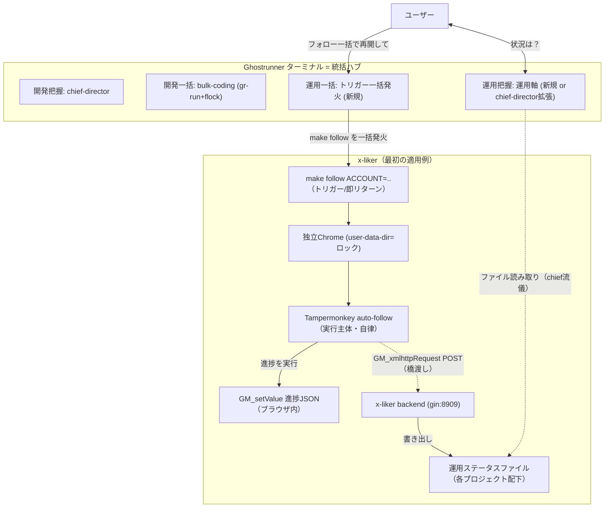
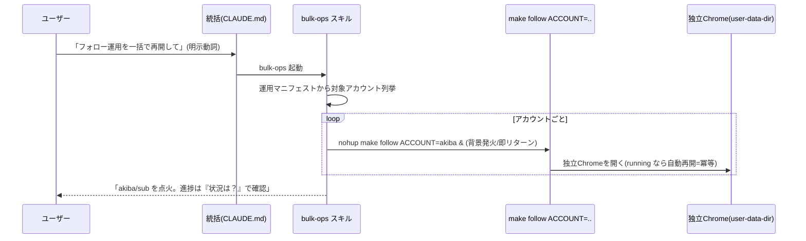
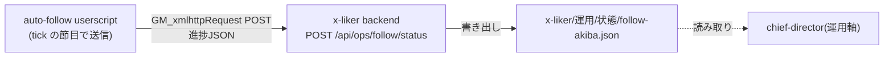
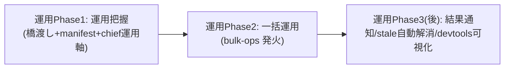

# 検討結果: 運用統括（ランタイム状態把握と一括運用）

作成日: 2026-05-25
ステータス: 完了（Phase1=把握は実装済み・稼働中。Phase2=一括運用は YAGNI で棚上げ）

## 検討経緯

| 日付 | 内容 |
|------|------|
| 2026-05-25 | 統括ハブに「運用（ランタイム状態）」ドメインを追加する構想を起票。開発ドメイン（把握=chief-director / 一括=bulk-coding）と対称に、運用ドメインを「運用把握」＋「一括運用」の2能力で扱う方針 |
| 2026-05-25 | 既存設計（2026-05-24 複数プロジェクト統括ターミナル）の原則を踏襲対象として確認。x-liker の運用実体（make follow / userscript / GM_setValue 進捗）を grep で裏取り。最大の制約「運用進捗がブラウザ内（GM_setValue）でファイルにない」を確認 |
| 2026-05-25 | 各論点（運用ステータス規約・一括運用の仕組み・運用把握・運用宣言方法・x-liker具体化・MVPスコープ）に案とトレードオフを整理。橋渡しは「userscript→backend POST→ステータスファイル」を推奨。MVPは運用把握先行（開発側のPhase1先行と整合）を推奨 |

## 背景・目的

統括ハブ（Ghostrunner）は現在「開発」ドメインを横断管理している。

- 開発把握: `chief-director`（読み取り専用・全プロジェクトのカンバンと確認事項を集約）
- 開発一括: `bulk-coding`（実装待ちタスクを gr-run で一括起動）

これに対し、x-liker のような「**動かし続ける**」プロジェクトには、開発とは別軸の **運用（ランタイム状態）** がある。
「いま回っているか／何件まで進んだか／止まっていないか」を横断的に把握し、必要なら一括で再点火したい。

そこで開発ドメインと**対称**な形で、運用ドメインを以下の2能力で扱えるようにする。

| ドメイン | 把握（読み取り自動） | 一括操作（明示指示のみ） |
|---|---|---|
| 開発（既存） | chief-director | bulk-coding（gr-run + flock） |
| 運用（本検討） | 運用把握（chief-director に運用軸を追加 等） | 一括運用（トリガーcmd の一括発火） |

最初の適用例は `~/x-liker`（ブラウザ駆動のフォロー運用）。

### 踏襲する既存原則（2026-05-24 から・矛盾チェック対象）

本検討は以下の確立済み原則と矛盾しないことを必須要件とする。

1. **フォルダ＝カンバン／状態はファイルから導出**（状態DBを別に持たない）。
2. **把握＝読み取り（自動）／操作＝状態変更は明示指示があったときだけ**。
3. **委譲型＝統括はトリガーを撃つだけ、ワーカーは自律**（単一指揮官・並列ワーカー）。
4. **chief-director はファイルベース・読み取り専用**（Read/Grep/Glob/Bash の参照のみ）。
5. **決まっていることは一括、決めることは個別対話**。
6. **gr-run＝ロック＋起動＋通知のワンショット**（常駐なし、終了コードで分類）。

## 調査で分かったこと（運用実体・裏取り済み）

### x-liker の運用＝ブラウザ駆動、進捗はブラウザ内に閉じている

- **トリガー**: `make follow`（`open -na "Google Chrome" --args --user-data-dir=~/.x-liker-chrome-<acct> <URL>`）。
  fire-and-forget で即リターン。完了シグナルは返さない。
- **アカウント分離＝独立Chrome**: `ACCOUNT=akiba` で `user-data-dir` が `~/.x-liker-chrome-akiba` に分かれる。
  別ログイン・別Tampermonkey状態・別進捗。同時起動も可。**user-data-dir が事実上のロック**（同じ data-dir の二重起動は
  Chrome 側が弾く）。
- **実行主体**: Tampermonkey userscript（`auto-follow`）。ページ読込のたびに状態機械（`MainModule.tick`）が回る。
  `running` ならリロードで自動再開する（`make follow` は「開くだけ」で再開を兼ねる＝**冪等な再点火**）。
- **進捗の保存先（最大の制約）**: `GM_setValue(STORAGE_KEY='autofollow_state', JSON)`。
  ブラウザ（Tampermonkey）内にJSONで永続化され、**ファイルにも backend にも出ていない**。
  状態の中身（`10-state-module.js` の `defaultState`）は把握に十分なリッチさを持つ:

  ```text
  running        実行中か
  queue / index  対象キューと現在位置（進捗 = index/queue.length）
  dailyTarget / dailyCount  当日枠と当日実行数
  stats          { followed, already, skipped, error }
  consecutiveErrors  連続エラー（安全装置で停止する閾値あり）
  myFollowers / dayIndex / nextActionAt ほか
  ```

### 橋渡しの足場は既にある（重要）

- **userscript からの外部POST実績あり**: `search-linker/80-discord-module.js` が `GM_xmlhttpRequest` で
  Discord Webhook に POST している。同じ手法を `auto-follow` に足せる。
  ただし `auto-follow/meta.js` の `@grant` は現状 `GM_setValue` / `GM_getValue` のみ。
  **`@grant GM_xmlhttpRequest` と `@connect localhost`（または x-liker backend ホスト）の追加が必要**。
- **x-liker backend は gin + registry パターン**（`registry.OnRoute` でルート登録、`health.go` が雛形）。
  ポート 8909。**運用ステータス受信エンドポイントを足す土台が既にある**（新規サーバー不要）。
- **chief-director は既に Bash を持ち**、各プロジェクトのファイルを読んでいる。運用ステータスを
  「各プロジェクト配下のファイル」にすれば、chief-director の流儀（ファイルベース・読み取り）そのままで把握できる。

### 開発側 gr-run は運用にそのまま使えない（差分の明確化）

| 観点 | 開発（gr-run / coding） | 運用（make follow / userscript） |
|---|---|---|
| 完了シグナル | `claude -p` の終了コードで分類できる | トリガーは即リターン、完了は無い（回り続ける） |
| ロック | flock（プロセス寿命で自動解放） | user-data-dir（Chrome起動中は実質ロック） |
| 進捗の真実源 | ファイル（カンバン＋計画書） | ブラウザ内 GM_setValue（要・橋渡し） |
| 状態遷移 | 未着手→実行中→完了（終端あり） | 待機/実行中/稼働時間外/本日分完了/制限検知停止（**終端のない常駐**） |

→ 開発の「終わったら完了に移す」モデルは運用に合わない。運用は「**今この瞬間のスナップショット＋古さ（staleness）**」で
把握するのが自然。gr-run の流用は限定的で、むしろ「ステータスを定期的に吐く／読む」仕組みが要る。

## 全体像（提案）



委譲型の精神は保たれる: 統括は `make follow` を**撃つだけ**、回すのは userscript（自律）。
把握はファイル読み取り（chief-director の流儀）に閉じる。

---

## 論点1: 運用ステータスの統一規約（置き場・形式・誰が書くか・古さの示し方）

開発の「フォルダ＝カンバン」に相当する、運用の状態規約を決める。最大の制約は
**進捗がブラウザ内（GM_setValue）でファイルにない**こと。これをどう「ファイルベース・読み取り専用」の
chief-director 流儀に橋渡しするか。

### 案1-A: userscript → backend へ POST → backend がステータスファイルを書く（推奨）

- userscript が状態更新時（tick の節目）に `GM_xmlhttpRequest` で x-liker backend に進捗JSONをPOST。
  backend が各プロジェクト配下の運用ステータスファイル（例 `運用/状態/<account>.json`）に書き出す。
- chief-director（運用軸）はそのファイルを読むだけ。
- メリット: chief-director の「ファイルベース・読み取り専用」原則と完全整合。backend に集約点ができ、
  将来 devtools 可視化にも繋げやすい。search-linker に POST 実績があり技術的に確実。
- デメリット: userscript の `@grant`/`@connect` 追加と backend エンドポイント追加が要る（小さめだが新規実装）。
  backend が起動していないと書けない（フォールバック設計が要る）。

### 案1-B: GM_download でブラウザが直接ファイルを吐く

- userscript が `GM_download` で進捗JSONをダウンロードフォルダ等に保存。
- メリット: backend 不要。
- デメリット: ダウンロード先が固定しづらく、各プロジェクト配下の所定パスに置けない（パス制御が弱い）。
  Tampermonkey の download 権限・ファイル名衝突・上書き挙動が不安定。chief-director が拾う場所が散らかる。
  **不採用寄り**。

### 案1-C: backend が状態を保持し、chief-director が backend エンドポイントを叩く

- userscript→backend POST までは同じ。だが chief-director が「ファイル」でなく backend の GET API を叩いて取得。
- メリット: 常に最新（ファイル経由のラグなし）。
- デメリット: **chief-director がファイルベース・読み取り専用原則から外れる**（HTTP 依存・backend 常駐前提）。
  プロジェクトを単独で開いても状態が見えない（フォルダ＝真実、の原則に反する）。原則整合性で劣る。

### ステータス・スキーマ（案1-A 採用時のドラフト）

各プロジェクトの運用ステータスは「アカウント単位のスナップショット」とする。GM_setValue の state から素直に導出できる。

```text
{
  "account": "akiba",            // ACCOUNT に対応
  "kind": "auto-follow",         // 運用の種類（将来 like 等も）
  "status": "running",           // running / idle / paused / blocked / done
  "progress": { "index": 123, "total": 800 },
  "today": { "count": 12, "target": 40 },
  "stats": { "followed": 300, "already": 50, "skipped": 0, "error": 2 },
  "consecutiveErrors": 0,
  "updatedAt": "2026-05-25T09:30:00+09:00"  // 古さ(staleness)判定の基準
}
```

### 古さ（staleness）の示し方 ＝ 運用版の「異常終了検知」

開発側の異常終了（実行中/ に残って flock が取れる）に相当するのが、運用では **ステータスが更新されない（stale）** こと。

- `updatedAt` と現在時刻の差で判定。`status=running` なのに更新が一定時間（例: 想定 tick 間隔 ×数倍）止まっていれば
  「**実行が止まっている疑い**」として報告（Chrome が閉じた／タブが死んだ／制限検知で停止 等）。
- これは chief-director の「異常終了を検知・報告するが解消はしない（人間トリガー）」原則と同型。
- `status=blocked`（制限検知で停止）や `consecutiveErrors` 多発は明示的な要対応サインとして報告。

**推奨: 案1-A（userscript→backend POST→ステータスファイル）。** chief-director のファイルベース・読み取り専用原則と
最も整合し、search-linker の POST 実績で技術リスクも低い。staleness は `updatedAt` 基準で判定。

---

## 論点2: 一括運用の仕組み（トリガー一括発火）

統括が運用トリガー（cmd）を一括発火する。開発の gr-run との本質的な違いは
「**運用トリガーは即リターンで完了シグナルが無い**」こと。進捗はステータス経由でしか分からない。

### 共通の前提（gr-run との違い）

| 観点 | gr-run（開発） | 運用トリガー |
|---|---|---|
| 起動後 | プロセスを待って終了コードで分類 | 即リターン（待たない）。完了は無い |
| 二重起動防止 | flock（中央ロック） | user-data-dir が事実上のロック（同 data-dir は Chrome が弾く） |
| 再発火の意味 | 再実行（やり直し） | **再開（冪等）**。running なら userscript がリロードで継続 |
| 通知 | gr-run が終了コードで ntfy | 発火時点では「点火した」だけ。状態変化の通知は別途（後述） |

### 一括の軸（複数アカウント中心 vs 複数プロジェクト）

- x-liker の現実は「**1プロジェクト内に複数アカウント**（ACCOUNT 別の独立Chrome）」。
  運用の一括は当面 **複数アカウントの一括発火**（`make follow ACCOUNT=akiba`, `=sub` …）が中心になる。
- 開発の一括（複数プロジェクト）とは軸が直交する。将来、運用を持つプロジェクトが増えれば
  「複数プロジェクト × 複数アカウント」の二重ループになるが、MVP は x-liker のアカウント軸でよい。

### 案2-A: 専用ヘルパー gr-op を新規に作る

- gr-run と対になる運用版ワンショット `gr-op`（仮称）。マニフェストを読み、対象アカウントごとに
  運用トリガー cmd を背景発火。完了を待たない（運用は終端がない）ので gr-run の終了コード分類は持たない。
- メリット: 開発（gr-run）/運用（gr-op）が対称で分かりやすい。運用固有の事情（即リターン・冪等再点火・
  user-data-dir ロック）を専用に最適化できる。Go 資産（patrol の起動ロジック）の一部を流用可。
- デメリット: 新規バイナリが増える。実体は「cmd を背景発火するだけ」なので Go で作るほどの重さがない可能性。

### 案2-B: bulk-coding を拡張して運用も扱う

- 既存の bulk-coding スキルに運用モードを足す。
- メリット: スキルが1つで済む。
- デメリット: **「決まっていることは一括」という bulk-coding の意味づけ（実装待ちタスクのディスパッチ）と
  運用（常駐の点火）は別物**。混ぜると責務が濁る。開発/運用の対称性も崩れる。**不採用寄り**。

### 案2-C: 新スキル bulk-ops（運用版 bulk-coding）＋ 発火は素の cmd

- 運用一括専用スキル `bulk-ops`（仮称）を新設。マニフェストから対象アカウントを読み、
  `make follow ACCOUNT=..` を `nohup ... &` で背景発火（bulk-coding の発火パターンと同型）。
  gr-run のような Go ヘルパーは挟まず、スキルが直接 cmd を撃つ（運用トリガーは即リターンなので
  flock も終了コード分類も不要）。
- メリット: 開発の bulk-coding と対称（スキル層でディスパッチ）。新規 Go バイナリ不要で軽い。
  運用トリガーが「即リターンの cmd」である事実に素直。
- デメリット: ロック・分類を持たないぶん「撃ちっぱなし」。だが運用は user-data-dir ロック＋冪等再点火なので
  二重発火しても害が小さく、むしろ自然。

**推奨: 案2-C（新スキル bulk-ops、発火は素の cmd を背景起動）。** 理由:

- 運用トリガーは即リターン・完了シグナル無し・冪等再点火・user-data-dir ロック。
  gr-run が担っていた「flock／終了コード分類／完了通知」は**運用では不要**。よって Go ヘルパー（gr-op）を
  新設するほどの中身がなく、スキルが直接 cmd を撃つのが最小。
- 開発 bulk-coding（スキルがディスパッチ）と対称で一貫性が高い。bulk-coding 拡張（案2-B）は責務が濁るので避ける。
- 二重起動防止は user-data-dir が担うので、スキル側は「対象アカウントを列挙して背景発火」だけでよい。



---

## 論点3: 運用把握（横断報告に運用軸を追加）

開発カンバンと並べて、運用ステータスを横断報告する。読み取り自動・操作明示の原則を運用にも適用する。

### 案3-A: chief-director に運用軸を追加（推奨）

- 既存 chief-director の手順に「各プロジェクトの運用ステータスファイル（論点1のファイル）を読む」を足す。
- 出力に運用行を追加（開発カンバンと並記）。
- メリット: 「全プロジェクト一望」の単一ダッシュボードが保たれる。chief-director は既にファイル読み取り専用なので
  流儀がそのまま。運用を持たないプロジェクトは 0 件扱い（前方互換、開発側の既存方針と同型）。
- デメリット: chief-director の責務がやや広がる（開発＋運用）。出力が長くなる。

### 案3-B: 運用専用エージェント ops-director を新設

- 運用把握専用の別エージェント。chief-director は開発のみ。
- メリット: 責務分離が明快。運用固有のロジック（staleness 判定など）を集約できる。
- デメリット: 「状況は？」で2エージェントを呼ぶ／使い分ける必要が出て、単一ダッシュボードの体験が割れる。
  開発/運用の境界が曖昧なプロジェクト（x-liker は開発もある）で二度手間。

### 案3-C: chief-director は開発のまま、運用は出力セクションだけ追加（軽量折衷）

- chief-director が運用ステータスファイルも読むが、運用は「補足セクション」として軽く出す（深掘りしない）。
- メリット: 単一エージェントを保ちつつ実装が最小。
- デメリット: 案3-A とほぼ同じ。明確な利点が薄い。

**推奨: 案3-A（chief-director に運用軸を追加）。** 単一ダッシュボードの価値が最も高く、ファイルベース・読み取り専用の
流儀が変わらない。staleness（古さ）と blocked/連続エラーを「要対応」として開発の確認事項待ちと同じ注意度ロジックに乗せる。

出力イメージ（運用行を追加）:

```text
[要対応] x-liker      : 運用 akiba=stale(更新2h前/running表示) / 開発 実装待ち0
[進行]   x-liker      : 運用 sub=running(本日12/40, 進捗123/800) / 開発 検討中1件
[静観]   face-search  : 開発 実装待ち0 / 運用なし
```

---

## 論点4: プロジェクトが運用を宣言する方法

運用を持つプロジェクトだけが「運用マニフェスト」を持つ（任意）。運用を持たないプロジェクトは持たなくてよい。

### 案4-A: patrol_projects.json を拡張（運用フィールド追加）

- 各プロジェクトエントリに `ops` を追加。
  ```text
  { "path": "...", "name": "x-liker",
    "ops": { "trigger": "make follow ACCOUNT={account}",
             "statusDir": "運用/状態",
             "accounts": ["akiba", "sub"] } }
  ```
- メリット: 統括が見る一覧が1ファイルで完結。chief-director / bulk-ops が同じ JSON を読めばよい。
- デメリット: patrol_projects.json は gitignore（ローカル専用）なので、運用宣言が各プロジェクトの git に残らない。
  プロジェクトを別環境に持って行くと運用宣言が失われる。中央集中で、プロジェクト完結性が弱い。

### 案4-B: 各プロジェクトに運用マニフェストファイル（推奨）

- 各プロジェクト配下に `運用/manifest.json`（または `.gr-ops.json`）を置く。
  トリガーcmd群・ステータス置き場・アカウント一覧を記述。
  ```text
  運用/manifest.json
  {
    "kind": "auto-follow",
    "trigger": "make follow ACCOUNT={account}",
    "statusDir": "運用/状態",
    "accounts": ["akiba", "sub"]
  }
  ```
- 統括（chief-director / bulk-ops）は patrol_projects.json で列挙された各プロジェクトについて、
  この manifest があれば運用ありと判断（無ければ運用なし＝任意）。
- メリット: **フォルダ＝真実の原則と整合**（運用宣言もプロジェクト配下に置く＝プロジェクト完結・git 追跡可）。
  開発の「実行中/ フォルダがプロジェクト配下にある」のと同じ思想。プロジェクトを単独で開いても運用構成が分かる。
- デメリット: 統括は各プロジェクトを1段読みに行く必要（だが chief-director は既に各プロジェクトを読んでいるので増分小）。

### 案4-C: ハイブリッド（一覧は patrol_projects.json、詳細は各マニフェスト）

- patrol_projects.json には `"ops": true` のフラグだけ。詳細（trigger/accounts/statusDir）は各マニフェスト。
- メリット: 統括が「どのプロジェクトが運用持ちか」を一覧で素早く把握しつつ、詳細はプロジェクト完結。
- デメリット: 2か所に分かれる（ただし開発側のロック中央／状態各プロジェクトの「ハイブリッド」前例と同思想で許容範囲）。

### 決定（2026-05-25・ユーザー確認済み）: `運用/` フォルダを作る（開発の `開発/` と対称）

案4-B を、**専用の `運用/` フォルダ**として具体化する。`開発/` フォルダが開発の真実であるのと対称に、
`運用/` フォルダを運用の真実とする。

- **opt-in は「フォルダの有無」**: プロジェクトに `運用/` フォルダがあれば運用あり、無ければ運用なし。
  開発側で `実行中/` フォルダの有無が任意なのと同じ思想（presence = 規約）。patrol_projects.json の
  拡張（案4-A）は採らない（gitignore でプロジェクトに残らないため）。
- **`運用/` の中身**:
  - `運用/manifest.json` — 運用宣言（trigger cmd 群・accounts・status 置き場）。git 追跡。
  - `運用/状態/<account>.json` — 進捗ステータス（backend が POST から書き出す）。再生成可なので gitignore。
- **テンプレ反映**: `templates/` に `開発/` があるのと同様、運用を持つ雛形には `運用/` を足せる
  （base には任意。x-liker は手で作る）。
- 統括（chief-director / bulk-ops）は patrol_projects.json で列挙された各プロジェクトの `運用/` を見て
  運用ありを判断。開発カンバンと完全に対称な「フォルダ＝規約」になる。

理由: 開発の `開発/` と並ぶ `運用/` という対称構造が直感的で、「フォルダ＝真実／状態はファイルから導出」
原則にそのまま乗る。プロジェクト完結・git 追跡性も保たれる。

---

## 論点5: x-liker を最初の適用例にした具体化

### 5-1. フォロー進捗のブラウザ→ファイル橋渡し（最小実装）

論点1-A の最小実装。3点セット。



1. **userscript 側**: `auto-follow/meta.js` に `@grant GM_xmlhttpRequest` と `@connect`（backend ホスト）を追加。
   `10-state-module.js` の `save()`（または `MainModule.tick` の節目）で、state を運用スキーマに変換して
   backend に POST する薄い関数を足す（search-linker の Discord POST と同型）。
   backend 不達でも運用は止めない（best-effort。POST 失敗は console に出すだけ＝search-linker と同じ）。
2. **backend 側**: registry パターンで `POST /api/ops/follow/status` を追加（health.go が雛形）。
   受け取った JSON を `運用/状態/follow-<account>.json` に `updatedAt` 付きで書き出す。
   （注: CORS は現状 `ALLOWED_ORIGIN` 単一。userscript からは `GM_xmlhttpRequest`（@connect）で送るので
   ブラウザの CORS を回避できる＝search-linker の Discord POST が CORS を超えているのと同じ理屈。）
3. **ステータスファイル**: 各アカウント1ファイル。`status` は state から導出
   （`running` かつ稼働時間内→running、`running=false`→idle/done、softBlock 検知→blocked、など）。

最小で言えば **1.（送信関数＋grant追加）と 2.（受信エンドポイント＋ファイル書き出し）だけ**で把握が成立する。

### 5-2. make follow の一括発火

論点2-C の具体。bulk-ops スキルが manifest の `accounts` を読み、各アカウントを背景発火。

```bash
# bulk-ops スキルが各アカウントについて実行（イメージ。実装は /plan で詳細化）
cd /Users/user/x-liker && nohup make follow ACCOUNT=akiba </dev/null >/dev/null 2>&1 &
cd /Users/user/x-liker && nohup make follow ACCOUNT=sub   </dev/null >/dev/null 2>&1 &
disown
```

二重発火しても user-data-dir ロックで安全（同 data-dir の Chrome は1つ）。running ならリロードで継続（冪等）。

### 5-3. 運用マニフェストの記述例（x-liker）

```text
x-liker/運用/manifest.json
{
  "kind": "auto-follow",
  "trigger": "make follow ACCOUNT={account}",
  "statusDir": "運用/状態",
  "accounts": ["akiba", "sub"]
}
```

統括はこれを読み、`accounts` をループして発火（bulk-ops）／`statusDir` のファイルを読んで把握（chief-director）。

---

## 論点6: MVPスコープ（把握先行か一括先行か）

開発側は **Phase1（把握）→Phase2（一括）** の順で、把握を先に作ったことで状態判定・スキャン基盤が
一括の土台になった（実績）。運用も同じ理由で **把握先行**が整合的。

### なぜ運用も把握先行か

- 一括運用（発火）は「運用が今どうなっているか」が見えないと、撃ってよいか判断できない
  （二重発火は user-data-dir で防げるが、stale/blocked を見てから再点火したい）。
- 把握（ステータス橋渡し＋運用軸）を先に作れば、その出力がそのまま一括運用の対象選定に直結する
  （開発で「把握の結果が一括の対象選定に直結」したのと同型）。
- 橋渡し（GM_setValue→ファイル）が運用ドメインの根幹インフラ。これが無いと一括を作っても結果が見えない。

### 運用 Phase1 MVP（把握先行・推奨）

含む:

1. **橋渡しの最小実装**（論点5-1）: auto-follow userscript の進捗 POST（grant/connect 追加＋送信関数）、
   x-liker backend の受信エンドポイント＋ステータスファイル書き出し。
2. **運用マニフェスト**（論点4-B）: x-liker に `運用/manifest.json` を1つ置く。
3. **chief-director に運用軸を追加**（論点3-A）: ステータスファイルを読み、staleness/blocked/連続エラーを
   含めて開発カンバンと並記。運用を持たないプロジェクトは 0 件扱い（前方互換）。
4. **CLAUDE.md に「統括（運用把握）」節を追記**: 「状況は？」で運用も含めて報告、と明文化。

含まない（運用 Phase2 以降）:

- 一括運用の発火（bulk-ops スキル）。
- 運用トリガーの結果通知（点火後の状態変化を ntfy する等）。
- stale 検知時の自動再点火（解消は人間トリガー＝開発の異常終了解消と同型で後回し）。
- devtools での運用ダッシュボード可視化（ターミナル完結を優先）。

### 運用 Phase2（一括運用）

- **bulk-ops スキル**（論点2-C）: manifest の accounts を一括背景発火。
- **CLAUDE.md に「統括（一括運用）」節**: 「運用を一括で再開して」等の明示動詞で発火。把握との線引き。
- stale/blocked を見て対象を絞る（把握の結果を使う）。



**推奨: 把握先行（運用 Phase1 を先に）。** 橋渡し（GM_setValue→ファイル）が根幹で、これが無いと一括の結果が
見えない。開発側の Phase1 先行と整合し、把握の出力が一括の対象選定に直結する。

---

## 各論点の決定（2026-05-25・ユーザー確認済み）

| 論点 | 決定 | 一言理由 |
|---|---|---|
| 1. 運用ステータス規約 | 1-A: userscript→backend POST→ステータスファイル | chief のファイルベース・読み取り専用と整合、POST 実績あり |
| 2. 一括運用の仕組み | **2-C: 新スキル bulk-ops（素の cmd 背景発火）** | 運用トリガーは即リターン・冪等。gr-op を作る中身がない |
| 3. 運用把握 | 3-A: chief-director に運用軸を追加 | 単一ダッシュボード維持、流儀そのまま |
| 4. 運用宣言 | **`運用/` フォルダ（開発の `開発/` と対称・フォルダの有無で opt-in）** | フォルダ＝真実の原則に対称的に乗る。manifest＋状態を `運用/` 配下に置く |
| 5. x-liker 具体化 | POST橋渡し＋`運用/`フォルダ＋make follow一括 | 足場（POST実績/gin/独立Chrome）が揃っている |
| 6. MVPスコープ | 把握先行（運用 Phase1） | 橋渡しが根幹、把握が一括の対象選定に直結 |

### 細目の既定（/plan で最終確定可）

- ステータス配置: `運用/状態/<account>.json`（manifest は `運用/manifest.json`＝git追跡、状態は再生成可なので **gitignore**）。
- staleness 閾値: tick 最短3分＋ジッタ＋長休憩で最大1h を踏まえ、余裕を見て既定 **3時間**（更新が止まれば stale=要確認）。
- POST 頻度・backend 未起動時フォールバック（best-effort 握りつぶし）は /plan で詰める。

## 原則との矛盾チェック

- フォルダ＝カンバン／状態はファイルから導出 → 運用も**ステータスファイル**で導出（中央DBを持たない）。整合。
- 把握＝読み取り自動／操作＝明示指示 → 運用把握は自動、一括運用は明示動詞ゲート（bulk-coding と同型）。整合。
- 委譲型（統括は撃つだけ・ワーカー自律） → 統括は make follow を撃つだけ、userscript が自律。整合。
- chief-director はファイルベース・読み取り専用 → 運用ステータスも**ファイル**を読むだけ（案1-C を避けた理由）。整合。
- 状態は各プロジェクト＝真実、揮発する制御は中央 → 運用マニフェスト/ステータスは各プロジェクト配下（案4-B）。整合。

## 残る未解決の問い（/plan を止めるブロッカーではない細目）

- ステータス POST の頻度（毎 tick か、節目だけか）。過剰 POST を避ける間引き方針。/plan で詰める。
- staleness の閾値 → **既定3時間で決定**（tick 最短3分＋長休憩最大1h を踏まえ余裕を見た値。運用で微調整可）。
- ステータスファイルの配置 → **`運用/状態/<account>.json` で決定**（manifest=`運用/manifest.json` は git 追跡、
  状態は再生成可なので gitignore）。
- backend 未起動時のフォールバック（POST 失敗を best-effort で握りつぶす＝search-linker と同じで可）。
- 複数プロジェクトに運用が広がった場合の「プロジェクト×アカウント」二重ループの一括 UX（MVP 後）。
- 運用の「種類」拡張（auto-follow 以外。like は userscript 本流だが現状ファイル化されていない）。将来検討。

## 結果

### Phase1（運用把握）: 完了

- Ghostrunner 側: chief-director に運用軸追加、CLAUDE.md「統括（運用把握）」節追加。main マージ済み（e9530e0）。
- x-liker 側: 運用/manifest.json + 運用/状態/*.json + userscript→backend POST。実装・検証済み。
- end-to-end 確認済み: chief-director が x-liker の運用状態を横断ダッシュボードに表示。

### Phase2（一括運用 / bulk-ops）: YAGNI で棚上げ

x-liker の運用（auto-follow）は通常動きっぱなしであり、改めて一括実行の指示を出す場面がほぼ無い。
異常停止は Phase1 の stale 検知で気づけるため、手動で `make follow ACCOUNT=xxx` を叩けば十分。
アカウント数が大幅に増えて手動では回らなくなった場合に改めて検討する。

棚上げ理由:
- 通常運用: 常時稼働しており発火不要
- 異常停止: Phase1（stale 検知）→ 手動1コマンドで復旧可能
- 全面再開（マシン再起動等）: 稀。手動数コマンドで対処可能な規模
- bulk-ops スキルの設計自体は本検討書の論点2で固まっているため、必要になれば即着手できる
