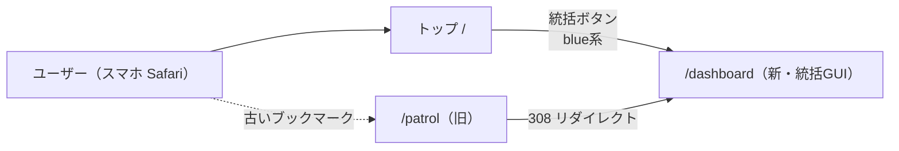
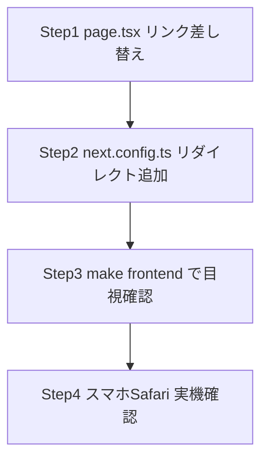

# 動線整備（patrol → dashboard 一本化）実装計画

作成日: 2026-05-26
元検討: `開発/検討中/2026-05-26_巡回ダッシュボードの統括GUIへの統合と運用表示改善.md`（案A 採用）
構成: フロントエンド単独（Next.js のみ、バックエンド・DB 変更なし）
運用: `feat/dashboard-gui` ブランチ継続使用（既存ブランチで合わせて出す）

## 1. 概要

`/dashboard`（統括GUI MVP）はバックエンド・フロント共に完成済みだが、トップ `/` からの動線が古い `/patrol` を指したままで、新ダッシュボードがユーザーに届いていない。本タスクはこの**動線整備**のみを行う：

1. トップ `/` のヘッダ上にある「巡回」ボタンのリンク先・ラベル・色を新ダッシュボードに合わせて差し替え
2. 古い `/patrol` URL に来た場合は新 `/dashboard` へ 308 リダイレクト（ブックマーク救済）

古い `/patrol` ページ・`/api/patrol/*` ハンドラ・`PatrolService` 等の**コード削除は本 MVP のスコープ外**（リダイレクト経由で当面温存）。削除は別タスクで段階的に行う。

## 2. 全体像



---

## 3. フロントエンド計画（Next.js）

### 3.1 変更ファイル一覧

| ファイル | 種別 | 内容 |
|---|---|---|
| `devtools/frontend/src/app/page.tsx` | 修正 | 507-513 行の「巡回」リンクを差し替え。`href="/patrol"` → `href="/dashboard"`、ラベル `巡回` → `統括`、Tailwind クラスの orange → blue 系、`title` 属性も「統括ダッシュボード」に更新 |
| `devtools/frontend/next.config.ts` | 修正 | 新規 `async redirects()` を追加し、`source: "/patrol"` → `destination: "/dashboard"`、`permanent: true`（= 308）でリダイレクトを定義。既存 `rewrites()` には触れない |

### 3.2 リンクボタンの最終形（page.tsx）

- `href`: `/dashboard`
- ラベル: `統括`（CLAUDE.md の用語に合わせる）
- `title`: `統括ダッシュボード`
- Tailwind クラス: `px-3 py-1 text-xs bg-blue-100 text-blue-700 rounded hover:bg-blue-200 transition-colors`
- 隣接ボタン（「プロジェクト作成」purple / 「ファイル一覧」green）と色被りせず、blue は「重要動線・主導線」を示す既存規約と一致

### 3.3 リダイレクト仕様（next.config.ts）

- 形: `permanent: true` → 308 Permanent Redirect
- 対象パスは `/patrol` の**完全一致のみ**（`/patrol/...` 配下のサブルートは現状存在しないため `:path*` は付けない）
- 既存 `rewrites()` 配列とは独立した `redirects()` 関数として追加（`rewrites()` は API プロキシ用なので衝突しない）

### 3.4 実装ステップ（依存順）



1. `page.tsx` 507-513 行の `<a href="/patrol">巡回</a>` ブロックを `/dashboard` / 統括 / blue 系に差し替え
2. `next.config.ts` に `async redirects()` を追加
3. `make frontend` で dev サーバーを起動し、トップから「統括」ボタンが `/dashboard` に飛ぶこと、`/patrol` 直接アクセスが `/dashboard` に 308 リダイレクトされることを目視確認
4. Tailscale 経由スマホ Safari で実機確認（ホーム画面追加済みなら旧ブックマークが救済されること）

### 3.5 設計判断の最終決定

| # | 論点 | 採用 | 理由 |
|---|---|---|---|
| FE-1 | リンク先 | `/dashboard` | 検討書の案A通り |
| FE-2 | ラベル | `統括` | CLAUDE.md の「統括ハブ」用語と一致。`ダッシュボード` は長い |
| FE-3 | ボタン色 | blue 系（`bg-blue-100 text-blue-700 hover:bg-blue-200`） | ユーザー指定。隣接ボタンと色被りなし |
| FE-4 | リダイレクト方式 | Next.js `redirects()` の `permanent: true`（308） | 永続的な移動を意図、Cache 効くがブラウザ側は新 URL 学習で困らない |
| FE-5 | パス対象範囲 | `/patrol` 完全一致のみ | `/patrol/...` サブパスは現状存在せず、ワイルドカードを足すと将来 `/patrol` 配下に何か作る時に阻害する。最小スコープを優先 |
| FE-6 | 古い patrol コード | **温存**（本 MVP では削除しない） | スコープ外。検討書「後続」の段階廃止に合わせる |
| FE-7 | rewrites との関係 | 独立した `redirects()` 関数を新設 | rewrites は API プロキシ用、redirects はユーザー可視のブラウザ遷移用。役割が違うので分ける |

---

## 4. 既存原則との整合性

| 原則 | チェック |
|---|---|
| 動かないコードを残さない | `/patrol` 直接アクセスは即リダイレクトで救済、本体は別タスクで削除 |
| スコープ最小 | 2 ファイル変更・実質 5 行以下。検討書の「後続」に書かれた削除作業は本 MVP に含めない |
| 用語統一 | ラベルは `統括` で CLAUDE.md と一致 |
| 既存パターン踏襲 | ヘッダの色クラスは既存ボタン（purple/green）と同じトークン体系 |

矛盾なし。

---

## 5. 残課題（本 MVP では扱わない）

検討書「後続」セクションに記載済みの内容。本 MVP 完了後、必要に応じて別タスクで `/plan` する：

- `devtools/frontend/src/app/patrol/` ディレクトリ削除
- `devtools/frontend/src/components/patrol/` ディレクトリ削除
- `devtools/frontend/src/hooks/usePatrol*.ts` および `src/lib/patrolApi.ts`、`src/types/patrol.ts` の削除
- `devtools/backend/internal/patrol/`（`PatrolService` 等）削除
- `cmd/server/main.go` の `/api/patrol/*` ルーティング削除
- リダイレクト自体の撤去（ブックマーク救済不要となった時点で）

---

## 6. テストプラン

### 6.1 設計方針

本変更はリンクの `href`／ラベル／クラス文字列の置換と、Next.js の `redirects()` 設定追加の 2 点のみ。

- **自動テスト**: 設定ファイル・JSX 文字列置換に対する単体テストは ROI が低い。リダイレクトの動作確認は Next.js フレームワーク機能の保証範囲。書かない。
- **手動テスト**: `make frontend` での dev サーバー目視確認とスマホ Safari 実機確認に集中。これは「動線整備」というタスク性質上、UX の体感確認が本質。

### 6.2 手動検証項目

| # | 項目 | 期待 |
|---|---|---|
| 1 | `make frontend` 後、`http://localhost:3333/` を開く | ヘッダ右側に blue 系の「統括」ボタンが表示される |
| 2 | 「統括」ボタンをクリック | `/dashboard` に遷移し、統括GUI MVP のダッシュボードが描画される |
| 3 | ブラウザの URL バーに直接 `http://localhost:3333/patrol` を入力 | `/dashboard` に 308 リダイレクトされる（DevTools の Network タブで 308 を確認） |
| 4 | スマホ Safari（Tailscale 経由）でトップを開く | blue 系「統括」ボタンが表示され、タップで `/dashboard` に遷移する |
| 5 | スマホ Safari で旧 `/patrol` URL を入力 | 自動で `/dashboard` に遷移する |
| 6 | `/dashboard` 内のチャット入力で「状況は？」を送信 | 既存 MVP の SSE 経由でレスポンスが返ること（回帰確認） |
| 7 | ヘッダ「ファイル一覧」「プロジェクト作成」ボタン | 既存通り遷移する（回帰確認） |

### 6.3 自動テストを書かない理由

| 対象 | 理由 |
|---|---|
| `page.tsx` のリンクテキスト・href | Snapshot/RTL での文字列 assert は保守コスト > 利益 |
| `next.config.ts` の `redirects()` | Next.js の設定保証範囲。E2E（Playwright 等）導入してまで検証するスコープではない |
| Tailwind クラス文字列 | 色は実機目視で確認、文字列 assert は意味薄 |

### 6.4 テスト実行手順

```bash
# dev サーバー起動
make frontend

# ブラウザで目視確認
open http://localhost:3333/
open http://localhost:3333/patrol   # → /dashboard へリダイレクトを確認

# ビルド検証（Next.js 設定の妥当性）
cd devtools/frontend
npm run build
npx tsc --noEmit
```

---

## 7. 実装後の動作確認チェックリスト

- [ ] `make frontend` で dev サーバーが起動する
- [ ] トップ `/` のヘッダに blue 系「統括」ボタンが表示される
- [ ] 「統括」ボタンクリックで `/dashboard` に遷移する
- [ ] `/patrol` 直接アクセスで 308 リダイレクトが `/dashboard` に返る
- [ ] スマホ Safari 実機で同じ挙動を確認
- [ ] `npm run build` がエラーなく完了する
- [ ] 既存の「ファイル一覧」「プロジェクト作成」ボタンが回帰なく動作する
