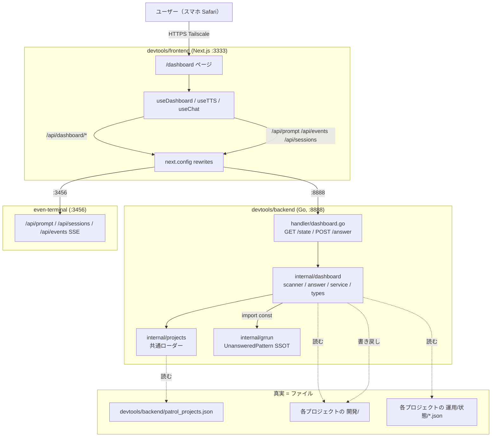
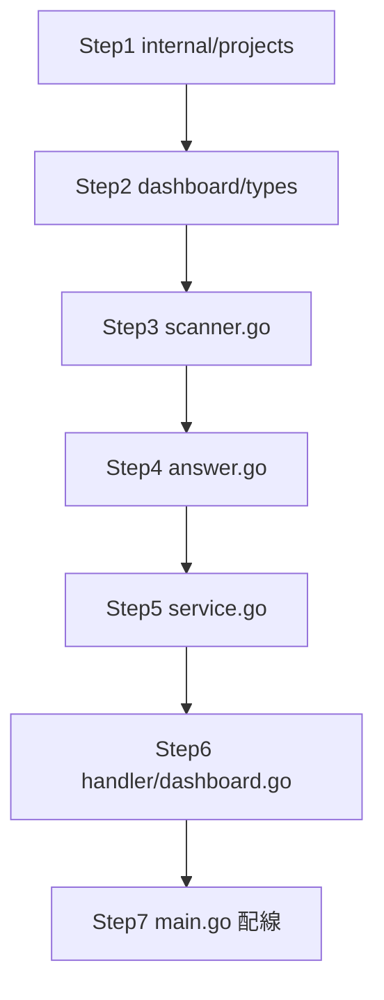

# 統括GUI MVP 実装計画

作成日: 2026-05-26
元検討: `開発/検討中/2026-05-26_統括GUI化と巡回ダッシュボード廃止.md`（メインスレッドで MVP 確定済み）
構成: フルスタック（Go バックエンド + Next.js フロントエンド）
運用: `devtools/` 配下のコード変更のためブランチ運用（`feat/dashboard-gui` を想定）
レビュー: go-plan-reviewer / nextjs-plan-reviewer の Critical 8 + Warning 15 を反映済み

## 1. 概要

統括（chief-director の把握＋bulk-coding の一括＋運用把握）を**スマホ Safari からも快適に扱える GUI**に拡張する。古い巡回ダッシュボード（`PatrolService` + `/api/patrol/*` + `src/app/patrol/`）は MVP 完了まで温存（廃止スケジュール parked）。

MVP の5要素:
1. **ダッシュボード（把握）** — プロジェクトカード × 開発カンバン × 運用ステータス（kind×account、stale 強調）。スマホ縦 1 列、15 秒ポーリング＋可視性連動
2. **チャット入力（text+音声）** — even-terminal の既存 API（`/api/prompt` + `/api/events` SSE）に乗せる
3. **確認事項回答 UI** — 既存 `AnswerForm.tsx` をラップして流用、計画書ファイルに直接書き戻し
4. **進捗把握ショートカットボタン** — ワンタップで `状況は？` を `/api/prompt` 経由で送信＋カードリフレッシュ
5. **応答の音声読み上げ（TTS）** — Web Speech API（ja-JP）、ON/OFF トグル、ボタン押下起点で読み上げ。フォアグラウンド限定（既知の仕様、背景は ntfy で補う）

## 2. 全体アーキテクチャ



---

## 3. バックエンド計画（Go）

### 3.1 変更/新規ファイル一覧（Go）

| ファイル | 種別 | 内容 |
|---|---|---|
| `devtools/backend/internal/projects/loader.go` | 新規 | `Project{Path, Name}`, `Config{Projects []Project}`, `LoadProjects(configPath) ([]Project, error)`。ファイル不在は空+nil、JSON破損はエラー（既存 `PatrolService.loadConfig` の挙動と一致） |
| `devtools/backend/internal/projects/loader_test.go` | 新規 | 正常系・ファイル不在・JSON 破損 |
| `devtools/backend/internal/projects/doc.go` | 新規 | パッケージ doc |
| `devtools/backend/internal/dashboard/types.go` | 新規 | **`Attention` enum は 3 値（`required`/`progress`/`watching`）のみ**。`IsSelf bool` は独立フィールド。`OpsProgress{Index, Total int}` / `OpsToday{Count, Target int}` / `OpsStats{Followed, Already, Skipped, Error int}` を固定型で定義（`*` 付きポインタで `omitempty`）。`OpsEntry.RawExtra map[string]any` を予備として残し将来 kind 拡張に備える。`ProjectState.Warnings []string`（複数の読み取り失敗を append できる）、`State{Projects, GeneratedAt}` |
| `devtools/backend/internal/dashboard/scanner.go` | 新規 | `ScanProject(projectPath, ghostrunnerRoot string, now time.Time) (ProjectState, error)`。Glob/Read/正規表現/`os.Stat().ModTime()` で staleness 算出、注意度判定。**読み取り失敗は `Warnings` に append（warning 上書きしない）**。`ctx.Done()` チェックは service 層で行う |
| `devtools/backend/internal/dashboard/answer.go` | 新規 | `AnswerRequest{ProjectPath, PlanPath, LineStart, Answer}`, `AnswerQuestion(req, allowedProjects) error`。**tmp は `os.CreateTemp(filepath.Dir(planAbsPath), ".plan.tmp.*")` で対象計画書と同一ディレクトリに作成**（クロス FS 防止）→ `os.Rename` でアトミック置換。**行内容再確認の窓は `LineStart-2 .. LineStart+2` の ±2 行に縮める**（複数の `未回答` 行誤一致防止）。窓内に複数マッチがあれば**最も `LineStart` に近い行**を採用。**`**回答**:` 差し替え判定は「`未回答→回答済` に書き換えた行の直後 1 行（次行）のみを見る」**：空行なら新規挿入、`**回答**:` で始まるなら差し替え、それ以外（別の見出し等）なら新規挿入 |
| `devtools/backend/internal/dashboard/service.go` | 新規 | `Service` インターフェース、`serviceImpl{configPath, ghostrunnerRoot, now func() time.Time}`、`NewService(configPath, ghostrunnerRoot)` / `NewServiceWithClock(...)`。`GetState(ctx context.Context) (State, error)` 実装内では**プロジェクトループの各イテレーション冒頭で `select { case <-ctx.Done(): return State{}, ctx.Err(); default: }` をチェック**（visibilitychange でクライアントが abort した場合の早期キャンセル） |
| `devtools/backend/internal/dashboard/doc.go` | 新規 | パッケージ doc（SSOT 共有・読み取り専用・時刻関数注入） |
| `devtools/backend/internal/dashboard/scanner_test.go` | 新規 | `t.TempDir()`、カンバン件数、未回答メタ抽出、staleness 境界（3h ちょうど／直前／直後／running 以外）、複数 `Warnings` の append 検証、複数の `**ステータス**:` 行が窓内に並ぶケース |
| `devtools/backend/internal/dashboard/answer_test.go` | 新規 | 正常系・LineStart ズレ・既に回答済（409）・パストラバーサル・拡張子チェック・カンバン外パス。**次行差し替え 3 ケース**（次行が空／次行が `**回答**:`／次行が `### Q2` 等別見出し）。tmp 同一ディレクトリ・`os.Rename` アトミック検証 |
| `devtools/backend/internal/dashboard/ssot_test.go` | 新規 | **dashboard 側がパッケージレベル変数で `grrun.UnansweredPattern` を直接参照していること**を、`GetPatternForTest()` のようなテストヘルパーで `assert.Equal(grrun.UnansweredPattern, dashboard.GetPatternForTest())` の形で検証。文字列一致だけでなく**参照経路ごと検査**（リファクタで独自リテラル化されたら落ちる） |
| `devtools/backend/internal/handler/dashboard.go` | 新規 | `DashboardHandler{svc dashboard.Service}`, `HandleState`, `HandleAnswer`、リクエスト/レスポンス型 |
| `devtools/backend/internal/handler/dashboard_test.go` | 新規 | gin `httptest`、200/400/404/409/500 各経路、バリデーション失敗 |
| `devtools/backend/internal/handler/doc.go` | 修正 | DashboardHandler セクション追記 |
| `devtools/backend/cmd/server/main.go` | 修正 | `dashboardService := dashboard.NewService(patrolConfigPath, ghostrunnerRoot)` 初期化、`dashboard := api.Group("/dashboard")` + `GET /state` + `POST /answer` 登録 |

### 3.2 API 仕様

#### GET /api/dashboard/state

レスポンス（200・実スキーマ準拠）:
```json
{
  "projects": [
    {
      "name": "x-liker",
      "path": "/Users/user/x-liker",
      "isSelf": false,
      "attention": "required",
      "kanban": { "reviewing": 1, "waiting": 1, "running": 0, "done": 12 },
      "unanswered": [
        { "planPath": "開発/実装/実行中/2026-05-26_xxx_plan.md", "lineStart": 142, "lineEnd": 142, "questionText": "...", "heading": "### Q1: ..." }
      ],
      "ops": [
        {
          "account": "geekkun_akiba",
          "kind": "auto-follow",
          "status": "running",
          "progress": {"index":300,"total":800},
          "today": {"count":12,"target":40},
          "stats": {"followed":300,"already":50,"skipped":0,"error":2},
          "consecutiveErrors": 0,
          "updatedAt": "2026-05-26T09:30:00+09:00",
          "stale": true,
          "staleHours": 4,
          "sourceFile": "auto-follow-geekkun_akiba.json"
        }
      ],
      "opsOptedIn": true,
      "warnings": []
    }
  ],
  "generatedAt": "2026-05-26T13:45:00+09:00"
}
```

**スキーマ準拠の注意**:
- `account` は `運用/状態/*.json` の `account` フィールドをそのまま透過。短縮・正規化はしない（例: x-liker の実物は `"geekkun_akiba"`）
- `OpsEntry.Progress/Today/Stats` は **固定型**（上記）。将来 kind 拡張時は未知フィールドを `OpsEntry.RawExtra map[string]any` に逃がす
- `Warnings []string` で複数の読み取り失敗を append（運用 1 ファイル破損 ＋ 計画書 1 ファイル read 失敗のような複合ケースを表現）

**staleness の真実源**:
- **`os.Stat().ModTime()` のみが真実**。`updatedAt` フィールドは `運用/状態/*.json` の JSON を透過するだけ（表示・突き合わせ用）。フロントは `stale` / `staleHours` をサーバーから受け取った値**そのまま表示**し、`updatedAt` を基にクライアント側で再計算しない
- 計算式: `now.Sub(info.ModTime()).Hours() >= 3.0 && status == "running"` → `Stale=true, StaleHours=int(...)` 。chief-director の `stat -f %m` と等価

**注意度と並び順**:
- `Attention` enum は 3 値（`required` / `progress` / `watching`）。`IsSelf` は独立 bool フィールド
- 決定規則: 未回答確認事項あり OR 運用に blocked/stale/連続エラー(>=3) → `required`／実行中・実装待ちあり OR 運用 running（stale でない） → `progress`／それ以外 → `watching`
- ソートキー: `(attention 優先度 ASC[required→progress→watching], isSelf ASC[false→true=自身を末尾], name ASC)` で**安定ソート**。フロントは無加工で表示

#### POST /api/dashboard/answer

リクエスト:
```json
{ "projectPath": "/Users/user/akiba-media", "planPath": "開発/実装/実行中/xxx_plan.md", "lineStart": 142, "answer": "A案で進めて" }
```

処理:
1. **バリデーション**（多層防御）: `projectPath` が `projects.LoadProjects` の結果に含まれる／`planPath` が `開発/実装/{実装待ち,実行中}/` 配下／拡張子 `.md`／`filepath.Clean(filepath.Join(projectPath, planPath))` の絶対パスが `projectPath + os.PathSeparator` で始まる（パストラバーサル防御）／`LineStart >= 1`／`Answer` trim 後非空
2. ファイル全行読み込み（`os.ReadFile`）
3. **行内容再確認（窓 ±2）**: `LineStart-2 .. LineStart+2` の範囲で `**ステータス**: 未回答` を含む行を探索。複数マッチなら**最も `LineStart` に近い行**を採用。見つからなければ 409（既に回答済 or 行ズレ）
4. 当該行を `**ステータス**: 回答済` に置換
5. **次行（書き換えた行の直後 1 行）のみ判定**: 空行 → `**回答**: <answer>` を新規挿入／`**回答**:` で始まる → 行ごと差し替え／その他（次の見出し等）→ `**回答**: <answer>` を新規挿入
6. **tmp ファイルは対象計画書と同一ディレクトリに作成**（`os.CreateTemp(filepath.Dir(planAbsPath), ".plan.tmp.*")`）→ 書き出し → `os.Rename` でアトミック置換（クロス FS 回避）
7. 成功 `{ "success": true }`、失敗 4xx/5xx + `{ "success": false, "error": "..." }`

### 3.3 実装ステップ（依存順）



各 Step に対応する `_test.go` を同時に作成（TDD）。

### 3.4 設計判断の最終決定

| # | 論点 | 採用 |
|---|---|---|
| BE-1 | patrol_projects.json ローダー | 新規 `internal/projects` 切り出し |
| BE-2 | DI 形 | インターフェース＋時刻関数注入 |
| BE-3 | 未回答位置情報 | 行番号 `lineStart, lineEnd` + 窓 ±2 + 最近接マッチ + 次行 1 行のみ判定 |
| BE-4 | 書き戻しのアトミック性 | `os.Rename` + 行内容再確認 + tmp 同一ディレクトリ作成（クロス FS 回避） |
| BE-5 | OpsEntry.Progress/Today/Stats | **固定型** `OpsProgress/OpsToday/OpsStats`（ポインタ + `omitempty`）。`OpsEntry.RawExtra map[string]any` を予備として残す |
| BE-6 | バリデーション | 多層（登録済み・カンバン配下・拡張子・パストラバーサル・行内容・LineStart 範囲） |
| BE-7 | ハンドラのコード量 | 1 ファイル集約 |
| BE-8 | Attention vs IsSelf | **Attention enum は 3 値**（`required`/`progress`/`watching`）、`IsSelf bool` は独立 |
| BE-9 | staleness 真実源 | **`os.Stat().ModTime()` のみが真実**、`updatedAt` は透過するだけ |
| BE-10 | Warnings | プロジェクトあたり `[]string` で複数 append 可（上書きしない） |
| BE-11 | ctx | プロジェクトループの各イテレーション冒頭で `select { case <-ctx.Done(): return ctx.Err(); default: }` |
| BE-12 | SSOT 参照経路の検証 | `dashboard.GetPatternForTest()` のような export 関数経由で `grrun.UnansweredPattern` を返し、`assert.Equal` で参照経路ごと検査 |

---

## 4. フロントエンド計画（Next.js）

### 4.1 変更/新規ファイル一覧（Frontend）

| ファイル | 種別 | 内容 |
|---|---|---|
| `devtools/frontend/next.config.ts` | 修正 | `rewrites` 先頭に `/api/prompt`・`/api/events`・`/api/sessions/:path*`・`/api/sessions` を `:3456` へ。既存 `/api/:path* → :8888` は末尾 |
| `devtools/frontend/src/app/dashboard/page.tsx` | 新規 | `"use client"`。3 フックを合成、ヘッダ＋カード一覧＋チャット枠＋エラー上部バナー |
| `devtools/frontend/src/types/dashboard.ts` | 新規 | `Attention`, `KanbanCounts`, `UnansweredItem`, `OpsEntry`, `ProjectCardData`, `DashboardState` 型（バックエンドと完全一致）。`OpsEntry.progress/today/stats` は `OpsProgress/OpsToday/OpsStats` の固定型をオプショナルで保持し、未知拡張用に `rawExtra?: Record<string, unknown>`。**型ガード関数 `isProgressShape` `isTodayShape` `isStatsShape` を併設**（TS strict 通過用） |
| `devtools/frontend/src/types/chat.ts` | 新規 | `ChatSession`, `ChatHistoryItem`, `PromptRequest`、**`ChatStreamEvent` ユニオン（even-terminal Claude provider 実装に基づく）: `text_delta` / `result` / `status` / `error` / `user_prompt` / `running_stats` / `tool_start` / `tool_end` / `task_progress` / `notification` / `user_question` / `permission_request` 等**（MVP で参照するのは主に `text_delta` と `result`） |
| `devtools/frontend/src/lib/dashboardApi.ts` | 新規 | `fetchDashboardState()`, `submitAnswer(req)` |
| `devtools/frontend/src/lib/chatApi.ts` | 新規 | `listSessions(opts?: { cwd?: string; provider?: string; limit?: number })`, `getHistory(id, limit)`, `sendPrompt({sessionId, text, cwd?})`, `openEventStream(sessionId, handlers)` — **EventSource で `/api/events?sessionId=<id>` を開く（`needReplay` は付けない）** |
| `devtools/frontend/src/lib/constants.ts` | 修正 | `LOCAL_STORAGE_TTS_ENABLED_KEY = "ghostrunner_tts_enabled"`, `LOCAL_STORAGE_ACTIVE_SESSION_ID_KEY = "ghostrunner_active_session_id"`, `LOCAL_STORAGE_POLLING_ENABLED_KEY = "ghostrunner_polling_enabled"`, `DASHBOARD_POLL_INTERVAL_MS = 15000`（既存の `ghostrunner_` プレフィクス規約を継承） |
| `devtools/frontend/src/hooks/useDashboard.ts` | 新規 | マウント時に常時 1 回 fetch（初期画面の白防止）。**`polling: boolean, setPolling(b)` をトグルとして公開**（`localStorage.ghostrunner_polling_enabled` で永続、**既定 ON**）。`polling===true` の間だけ `setInterval(15000)`＋`visibilitychange` で `hidden` 停止／`visible` で即 fetch して再開。`polling===false`（手動更新モード）では setInterval を張らず visibility 連動 fetch もしない（初回 1 回 + 明示操作のみ）。`refresh()` を公開、`error: string \| null` を返す |
| `devtools/frontend/src/hooks/useTTS.ts` | 新規 | Web Speech API ラッパ。`speak(text)`, `cancel()`, `enabled`（localStorage 永続）, `isSpeaking`, `error`。**`speak` 前に `cancel()` を呼び、その後 `setTimeout(() => speakInternal(), 50)` で 50ms 遅延を挟む**（iOS Safari の cancel→speak 不発バグ対策）。**初期化時に `getVoices()` 呼び＋ `voiceschanged` イベント購読で再評価**。**voice 選択ロジック: `getVoices().find(v => v.lang.startsWith("ja"))` があれば `utterance.voice = it`、なければ `utterance.lang = "ja-JP"` のみセット（lang フォールバック）**。`localStorage` アクセスは `useEffect` 内で実行（SSR セーフ） |
| `devtools/frontend/src/hooks/useChat.ts` | 新規 | アクティブ session 管理（localStorage 永続）＋送信＋応答テキスト集約＋完了通知。**SSE 接続は `visibilitychange` 連動**（既存 `usePatrolSSE.ts` の流儀）：`hidden` で `close()`、`visible` で再接続。**`onerror` 時は close→指数バックオフ（1s, 2s, 4s, 8s、最大 10 回）で再接続**。**完了検知は `type === "result"` を見る**（参考: even-terminal Claude provider が `session.js:674` で emit）。`text_delta` を `text` フィールドで累積 → `result` で `onComplete(fullText)`。途中切断のフォールバックとして「SSE 無音 3 秒 → onStreamIdle」も併用 |
| `devtools/frontend/src/hooks/useDashboardPage.ts` | 新規（任意・実装時判断） | `page.tsx` が 400 行超えそうなら 3 フック合成のコンテナフックに切り出し |
| `devtools/frontend/src/components/dashboard/DashboardHeader.tsx` | 新規 | タイトル＋PollingToggle＋TTSToggle＋ProgressGraspButton |
| `devtools/frontend/src/components/dashboard/DashboardCard.tsx` | 新規 | 1 プロジェクト分（AccentBar＋名前＋DevSummary＋OpsEntry リスト＋UnansweredList） |
| `devtools/frontend/src/components/dashboard/DevSummary.tsx` | 新規 | 開発カンバン件数 |
| `devtools/frontend/src/components/dashboard/OpsEntry.tsx` | 新規 | kind×account 1 件。`progress/today/stats` は型ガード関数で確認後に表示、ガード不通は `JSON.stringify` で 1 行 fallback。stale 自然文表記（`4時間無更新（実行停止疑い）`） |
| `devtools/frontend/src/components/dashboard/UnansweredList.tsx` | 新規 | 未回答一覧。各項目で `DashboardAnswerForm` を展開可能 |
| `devtools/frontend/src/components/dashboard/DashboardAnswerForm.tsx` | 新規 | `AnswerForm` をラップ。`UnansweredItem` から `Question` を以下の規則で組み立て: `{ question: item.questionText, header: item.heading ?? "", options: [], multiSelect: false }`。`options` 空配列で渡せば既存 `AnswerForm` は自由入力欄＋送信ボタンだけになる。`onSubmit(projectPath, answer)` を受けて親に `{planPath, lineStart, answer}` を中継 |
| `devtools/frontend/src/components/dashboard/ChatInput.tsx` | 新規 | textarea + 送信ボタン（min-height 48px、Enter 送信、Shift+Enter 改行） |
| `devtools/frontend/src/components/dashboard/ChatTranscript.tsx` | 新規 | 最新応答 1 件 + ステータス（idle/busy/error） |
| `devtools/frontend/src/components/dashboard/TTSToggle.tsx` | 新規 | ON/OFF ボタン（Web Speech API 未対応で disabled） |
| `devtools/frontend/src/components/dashboard/PollingToggle.tsx` | 新規 | 自動更新 ON/OFF ボタン（既定 ON、`useDashboard.polling/setPolling` と localStorage で永続）。OFF 時はラベルが「手動更新（聞いたら返す）」になり、状況は進捗把握ボタンとチャット送信完了時のみ更新される |
| `devtools/frontend/src/components/dashboard/ProgressGraspButton.tsx` | 新規 | ワンタップ「状況は？」送信＋refresh |
| `devtools/frontend/src/components/dashboard/AccentBar.tsx` | 新規 | 左 4px のアクセントバー。**Tailwind クラス: `bg-red-500`（要対応）/ `bg-yellow-400`（確認事項待ち）/ `bg-blue-500`（実行中）/ `bg-gray-300`（静観）** |

### 4.2 `next.config.ts` の rewrites 仕様

順序が重要（Next.js は配列上から評価、最初にマッチを採用）:

```text
1. /api/prompt              → http://localhost:3456/api/prompt
2. /api/events              → http://localhost:3456/api/events
3. /api/sessions/:path*     → http://localhost:3456/api/sessions/:path*
4. /api/sessions            → http://localhost:3456/api/sessions
5. /api/:path*              → http://localhost:8888/api/:path*   ← 既存・末尾
```

注: Next.js の `:path*` はゼロセグメントを安定にマッチしないため、`/api/sessions` 単独と `/api/sessions/:path*` の 2 行は両方必要（1 行化不可）。

### 4.3 even-terminal SSE 仕様（実装時の規約）

`GET /api/events?sessionId=<id>` で `text/event-stream` を返す（even-terminal の `dist/routes/events.js:67`）。

**emit されるイベント type**（Claude provider 実装に基づく確定リスト・`dist/claude/session.js`）:
- `text_delta` — `{ type, text, sessionId }` アシスタントテキストのチャンク（累積対象）
- `result` — ターン完了マーカー（`onComplete` を発火する型）
- `status` — `{ state: "busy"\|"idle", sessionId }`
- `error` — `{ message, sessionId }`
- `user_prompt` — 自分の送ったプロンプトのエコー
- `running_stats` — 10 秒ハートビート（無視可）
- `tool_start` / `tool_end` / `task_progress` / `notification` — 道中の通知（MVP では UI 反映なし、`status` で代用）
- `user_question` / `permission_request` — interactive 質問（MVP では `chief-director` 経由で来ないと想定、エラーログに）

`useChat` の実装方針:
1. マウント時に `GET /api/sessions?provider=claude&cwd=/Users/user/Ghostrunner` でセッション一覧取得。**空なら cwd 未指定で再試行**（even-terminal の `PROJECT_DIR` 環境変数フォールバックに委ねる）
2. `localStorage.ghostrunner_active_session_id` を優先、無ければ最新を選択して保存
3. `new EventSource("/api/events?sessionId=<id>")` で接続（`needReplay=true` は**付けない**）。`visibilitychange` で `hidden` 時 close、`visible` で再接続
4. `POST /api/prompt` で `{sessionId, text, provider: "claude", cwd: <listSessions が成功した cwd>}` を送信
5. SSE で `text_delta.text` を累積し `ChatTranscript` にライブ表示（MVP は完了時にまとめて表示でも可）→ `type === "result"` で `onComplete(fullText)`
6. `onComplete` 時に親が `tts.speak(fullText)` + `dashboard.refresh()` を呼ぶ（**TTS は必ずボタン押下起点の文脈で発火**）
7. `onerror` で `close()` → 1s, 2s, 4s, 8s の指数バックオフで再接続（最大 10 回、その後はエラー表示）
8. SSE が 3 秒無音なら `onStreamIdle` フォールバック（`result` 取りこぼし時のセーフティ）
9. `POST /api/prompt` が 4xx で session 無効 → `GET /api/sessions` をやり直して最新を再選択 → リトライ 1 回

### 4.4 実装ステップ（依存順）

1. **型定義** `src/types/dashboard.ts`（型ガード関数含む）, `src/types/chat.ts`（even-terminal イベント union）
2. **API クライアント** `src/lib/dashboardApi.ts`, `src/lib/chatApi.ts`
3. **定数追加** `src/lib/constants.ts`
4. **rewrites 更新** `next.config.ts`
5. **`useTTS`** `src/hooks/useTTS.ts`（voiceschanged、50ms 遅延、lang フォールバック、SSR セーフ）
6. **`useDashboard`** `src/hooks/useDashboard.ts`（visibility 連動、`error` 公開）
7. **`useChat`** `src/hooks/useChat.ts`（visibility 連動 SSE、指数バックオフ、`result` 完了検知、無音 3s フォールバック）
8. **単体テスト追加**（`vitest`、Step 5-7 と並行）:
   - `useTTS` … `window.speechSynthesis` を `vi.stubGlobal` でモック、`speak`/`cancel`/トグルをテスト。`voiceschanged` シミュレート
   - `useDashboard` … `vi.useFakeTimers()` で 15s 進行、`visibilitychange` イベント発火モック、polling トグル ON/OFF 切替（OFF で setInterval が張られず visibility 連動再 fetch しない、`refresh()` は OFF でも効く）
   - `useChat` … `EventSource` を `vi.stubGlobal` でモック、`text_delta` 累積→`result` で `onComplete` が呼ばれることを assert
   - `DashboardAnswerForm` … `@testing-library/react` で wrappedQuestion 生成と onSubmit 連携
9. **小コンポーネント** AccentBar / DevSummary / OpsEntry / TTSToggle / PollingToggle / ProgressGraspButton / ChatInput / ChatTranscript / DashboardAnswerForm
10. **複合コンポーネント** UnansweredList / DashboardCard / DashboardHeader
11. **page.tsx 合成** 3 フックを合成。エラーは `chat.error ?? dashboard.error ?? tts.error` で集約して上部バナー表示。400 行を超えそうなら `useDashboardPage.ts` コンテナフックに切り出し
12. **ビルド・型・lint** `npm run build`, `npx tsc --noEmit`, `npm run lint`
13. **実機検証** スマホ Safari 経由で TTS・進捗把握・回答送信を確認

### 4.5 設計判断の最終決定

| # | 論点 | 採用 |
|---|---|---|
| FE-1 | rewrites 順序・粒度 | 必要 4 行（個別指定）＋ catch-all 末尾 |
| FE-2 | チャット応答取得 | `GET /api/events?sessionId=<id>` SSE、`text_delta` 累積、`result` で完了、無音 3s フォールバック |
| FE-3 | AnswerForm 流用 | ラップ方式（`DashboardAnswerForm`）。`UnansweredItem → Question` 組み立て規則を §4.1 に明記 |
| FE-4 | TTS autoplay 制約 | ボタン押下起点の応答のみ読み上げ。**`cancel→setTimeout(50)→speak` で iOS Safari 不発回避** |
| FE-5 | 状態管理 | プレーン useState + 3 フック合成（既存 `usePatrol` 流儀）。`useDashboardPage` は 400 行超え時に分割 |
| FE-6 | チャット履歴範囲 | 最新応答 1 件（+ 自分の最後の発話） |
| FE-7 | 送信先セッション | 既存最新セッションを選択、localStorage 永続。**cwd は `/Users/user/Ghostrunner` で叩いて空なら未指定で再試行**。session 無効時は一覧再取得→最新再選択リトライ 1 回 |
| FE-8 | Server Component | `page.tsx` 全体を Client Component |
| FE-9 | スマホ UX | `max-w-[900px]`, `min-h-12` タップ、AccentBar 4px、自然文 stale。Tailwind クラス具体化 |
| FE-10 | 既存 patrol の扱い | ディレクトリ別で共存、ファイル干渉ゼロ |
| FE-11 | SSE 再接続戦略 | `needReplay` 付けない／`visibilitychange` で close/再接続／`onerror` 時 close→指数バックオフ（既存 `usePatrolSSE.ts` 流儀） |
| FE-12 | TTS voice 取得 | 初期化時に `getVoices()` 呼び＋`voiceschanged` 購読／`ja-` 始まりがあれば voice 設定、なければ `lang = "ja-JP"` のみ |
| FE-13 | localStorage キー | `ghostrunner_` プレフィクス、`useEffect` 内アクセスで SSR セーフ |
| FE-14 | エラー集約 | 各フックが `error: string \| null` を公開、page.tsx で `chat.error ?? dashboard.error ?? tts.error` を上部バナー |
| FE-15 | OpsEntry 型 | 固定型 + 型ガード関数で TS strict 通過、未知 kind は `rawExtra` で温存し `JSON.stringify` fallback |
| FE-16 | ポーリング自動更新の制御 | トグルで ON/OFF。**既定 ON**、localStorage `ghostrunner_polling_enabled` で永続。OFF は「聞かれたら返す」スタイル（手動更新モード）で `setInterval`・`visibilitychange` 連動 fetch とも停止。初回マウントの 1 回 fetch・進捗把握ボタン・チャット送信完了時の refresh は OFF でも効く |

---

## 5. 主要決定の集約

| 領域 | 決定 |
|---|---|
| MVP スコープ | 5 要素（ダッシュボード／チャット／確認事項回答／進捗把握ボタン／TTS）。一括 coding ボタン・bulk-ops・/dispatch・SSE 即時通知・通知履歴は MVP 外 |
| 真実源 | プロジェクト群のファイル。`dashboard` は毎リクエストでファイルを読む（in-memory state なし） |
| SSOT | `grrun.UnansweredPattern` を `dashboard` から参照経路ごと共有、テストで担保 |
| staleness | `os.Stat().ModTime()` のみが真実、`updatedAt` は表示・突き合わせ用 |
| Attention | enum 3 値 + IsSelf 独立 bool、ソートは (attention, isSelf, name) |
| OpsEntry 内訳 | 固定型（Progress/Today/Stats） + RawExtra 予備 |
| 書き戻し | 同一ディレクトリ tmp + `os.Rename` + 行内容 ±2 窓 + 次行 1 行判定 |
| チャット | even-terminal API、SSE 完了は `type:"result"`、visibility 連動、指数バックオフ |
| TTS | Web Speech API（ja-JP）、cancel→50ms→speak、フォアグラウンド限定 |
| 認証 | Tailscale 前提、追加認証なし |

---

## 6. 既存原則との矛盾チェック

| 原則 | チェック |
|---|---|
| フォルダ＝真実／状態はファイルから導出 | dashboard はファイルだけ読む。in-memory state なし |
| 把握＝読み取り自動／操作＝明示指示 | `GET /state` 副作用なし。`POST /answer` ・チャット送信はユーザー操作起点 |
| 委譲型 | チャット入力は even-terminal に丸投げ、bulk-coding は既存通り |
| 前方互換 | フォルダ無しは 0 件・`opsOptedIn=false`・`Warnings []string` 空 |
| SSOT | `grrun.UnansweredPattern` を import + 参照経路検証 |
| ファイルサイズ規約 | service 層 4 ファイル分割、handler 単一 300 行台、frontend 17 ファイル分割、最大 350 行 |
| エラーハンドリング | Go は `%w` ラップ、フロントは `error: string\|null` を上部バナー集約 |
| TDD・80% カバレッジ | 各層に `_test.go` + vitest フック単体テストを実装ステップに含める |
| 絵文字禁止 | UI 文言・コードコメントとも絵文字なし |
| 巡回廃止 parked | `/patrol`・`AnswerForm`（ラップ流用）・`patrolApi.ts`・`usePatrol*`・`types/patrol.ts` を変更しない |

矛盾なし。

---

## 7. 残課題（MVP を止めない細目）

- `useDashboardPage` コンテナフックへの切り出しは page.tsx が 400 行超えそうなら実装時判断
- 計画書のステータス行に Q ID を埋める運用への移行（MVP は行番号、将来 ID 化検討）
- 一括 coding 発火ボタン（MVP+1 で `POST /api/dashboard/dispatch` 追加）
- 巡回廃止スケジュール（MVP 完了後に 4-B 共存→4-C リダイレクト の段階廃止）
- 認証強化（案 10-B トークン認証）
- TTS の voice 選択 UI（MVP は ja-JP デフォルト固定）
- SSE のチャンク逐次読み上げ（MVP は全文受信後一括）
- `running_stats` を「実行中」インジケーターに使う UX 改善

---

## 8. テストプラン

### 8.1 設計方針

- **テスト粒度**: Go は scanner / answer / service / handler / SSOT の 5 ファイルにテーブル駆動でユニット集中。フロントは hook 単位（`useTTS` / `useDashboard` / `useChat`）＋ `DashboardAnswerForm` の Question 組み立てに集中。それ以外の小コンポーネント（AccentBar / DevSummary / OpsEntry / TTSToggle / ProgressGraspButton / ChatInput / ChatTranscript / DashboardHeader / DashboardCard / UnansweredList）はビジュアル中心のため自動テストを書かない（過剰回避）
- **実 IO の境界**: Go は `t.TempDir()` で実ファイル IO のまま検査（`os.Stat`/`os.ReadFile`/`os.Rename` をモックしない＝アトミック性まで実 IO で検証）。フロントは `EventSource` / `speechSynthesis` / `localStorage` / `visibilitychange` / `setInterval` を `vi.stubGlobal` ＋ `vi.useFakeTimers()` でモック
- **フレームワーク**: Go は標準 `testing` ＋ `testify/assert`（既存 `patrol_test.go` の流儀）、フロントは `vitest` ＋ `@testing-library/react` ＋ `jsdom`（既存 `usePatrolSSE.test.ts` の流儀）

### 8.2 リスク分析サマリ

| 厚くテストする箇所 | 根拠 |
|---|---|
| `answer.go` の窓 ±2 ＋ 最近接 ＋ 次行 1 行判定 | 行ズレで他質問を誤上書きすると致命的。境界が複雑 |
| `scanner.go` の staleness 3h 境界 ＋ Warnings append | 偽陽性/偽陰性が「実行中」判定を狂わせる。複数 Warning 上書きは仕様後退 |
| `ssot_test.go`（参照経路） | リファクタで独自リテラル化されると SSOT が黙って壊れる |
| `useTTS` の cancel→50ms→speak 順序 | iOS Safari の不発バグの中核対策。順序が崩れると本番再現 |
| `useChat` の `result` 完了検知 ＋ 指数バックオフ ＋ 無音 3s フォールバック | SSE 完了取りこぼし／再接続失敗で「応答が止まる」体感バグ |
| `DashboardAnswerForm` の Question 組み立て | `options: []` を正しく渡せないと AnswerForm が壊れる |

| 薄くする/省く箇所 | 根拠 |
|---|---|
| `AccentBar` / `DevSummary` / `TTSToggle` 表示 | Tailwind クラス文字列のテストは保守コスト > 利益 |
| `dashboardApi.ts` / `chatApi.ts` の薄い fetch ラッパ | フレームワーク（fetch）の保証範囲 |
| `internal/projects/loader.go` | 既存 `PatrolService.loadConfig` の挙動踏襲。最小 3 ケースのみ |
| `cmd/server/main.go` の配線 | ハンドラ単体テストが通れば配線は手動起動で確認可 |
| `next.config.ts` rewrites | 手動疎通（curl）で十分 |
| `/api/health` 系 | 既存と同等。新規追加なし |

### 8.3 Go テストケース一覧

#### 8.3.1 `internal/projects/loader_test.go`（新規・最小）

| # | ケース | 入力 | 期待 |
|---|---|---|---|
| 1 | 正常系 | 有効 JSON | `[]Project{...}` len 正しい |
| 2 | ファイル不在 | 存在しないパス | `nil, nil`（既存 patrol と同挙動） |
| 3 | JSON 破損 | 不正 JSON | error 返却 |

#### 8.3.2 `internal/dashboard/ssot_test.go`（新規・SSOT 参照経路）

| # | ケース | 期待 |
|---|---|---|
| 1 | dashboard が grrun.UnansweredPattern を参照経路ごと共有 | `assert.Equal(t, grrun.UnansweredPattern, dashboard.GetPatternForTest())`。`GetPatternForTest()` は `var unansweredPattern = grrun.UnansweredPattern` を返すラッパ。**両者が同一の文字列定数を指していること**を担保し、独自リテラル化のリグレッションを検出 |

#### 8.3.3 `internal/dashboard/scanner_test.go`（新規・最重要 1/2）

| # | ケース | 入力（`t.TempDir()` で構築） | 期待 |
|---|---|---|---|
| 1 | カンバン件数の正常集計 | 実装待ち 1 / 実行中 2 / 完了 5 / レビュー 0 | `Kanban{Reviewing:0, Waiting:1, Running:2, Done:5}` |
| 2 | 未回答メタ抽出（heading＋questionText＋lineStart/lineEnd） | `### Q1: ...\n**ステータス**: 未回答` を含む計画書 | `Unanswered[0]` の lineStart が `**ステータス**` 行と一致、heading・questionText 抽出済み |
| 3 | staleness: 3h ちょうど境界 | `os.Chtimes` で ModTime を `now - 3h` ちょうどに | `Stale=true, StaleHours=3`（仕様: `>= 3.0`） |
| 4 | staleness: 3h 直前 | ModTime = `now - 2h59m59s` | `Stale=false` |
| 5 | staleness: 3h 直後 | ModTime = `now - 3h0m1s` | `Stale=true, StaleHours=3` |
| 6 | staleness: status running 以外 | status = "stopped" / ModTime 4h 前 | `Stale=false`（仕様: status==running の AND） |
| 7 | Warnings の append（複数失敗） | 計画書 read 失敗 + 運用 JSON 破損 | `len(Warnings) == 2`（上書きされない） |
| 8 | 運用フォルダなし（前方互換） | `運用/状態/` なし | `Ops=nil/[], OpsOptedIn=false, Warnings 空` |
| 9 | Attention 判定: 未回答あり | unanswered 1 件 | `Attention="required"` |
| 10 | Attention 判定: 実行中のみ | running 1 件・stale でない | `Attention="progress"` |
| 11 | Attention 判定: 連続エラー >= 3 | consecutiveErrors=3 | `Attention="required"` |
| 12 | Attention 判定: stale 運用 | running ＋ ModTime 4h 前 | `Attention="required"` |
| 13 | IsSelf 独立フラグ | projectPath == ghostrunnerRoot | `IsSelf=true, Attention` は別計算 |
| 14 | ソート安定性 | required ↔ progress ↔ watching を混在 | `(attention, isSelf, name)` 順、同 attention 内で isSelf=false が先、name 昇順 |

#### 8.3.4 `internal/dashboard/answer_test.go`（新規・最重要 2/2）

| # | ケース | 入力 | 期待 |
|---|---|---|---|
| 1 | 正常系: 次行が空 → 新規挿入 | `**ステータス**: 未回答\n\n### Q2` | 行が `**ステータス**: 回答済` に置換、直後に `**回答**: <answer>` 1 行挿入 |
| 2 | 正常系: 次行が `**回答**:` → 差し替え | `**ステータス**: 未回答\n**回答**: 旧\n` | ステータス置換 ＋ 次行差し替え（旧→新） |
| 3 | 正常系: 次行が別見出し → 新規挿入 | `**ステータス**: 未回答\n### Q2` | ステータス置換 ＋ `**回答**` 行を新規挿入（`### Q2` は維持） |
| 4 | 窓 ±2: LineStart-2 にマッチ | 指定 line の 2 行前に `**ステータス**: 未回答` | その行を採用、置換成功 |
| 5 | 窓 ±2: LineStart+2 にマッチ | 指定 line の 2 行後に `**ステータス**: 未回答` | その行を採用、置換成功 |
| 6 | 窓 ±2: 窓外（+3 行） | 指定 line の 3 行先 | 409 既に回答済 or 行ズレ |
| 7 | 窓内に複数マッチ → 最近接採用 | 指定 line±2 内に 2 つの `**ステータス**: 未回答` | より LineStart に近い行が選ばれる |
| 8 | 既に回答済（窓内に未回答なし） | `**ステータス**: 回答済` のみ | 409 |
| 9 | パストラバーサル | `planPath = "../../etc/passwd"` | バリデーションエラー（4xx） |
| 10 | 拡張子チェック | `planPath = "....txt"` | バリデーションエラー |
| 11 | カンバン外パス | `planPath = "README.md"` | バリデーションエラー |
| 12 | 登録外プロジェクト | `projectPath` が `LoadProjects` に含まれない | バリデーションエラー |
| 13 | LineStart 範囲外（0 / 巨大） | `LineStart=0` / `LineStart=999999` | バリデーションエラー |
| 14 | tmp 同一ディレクトリ作成 | 計画書を tempDir に置く | `os.Stat(filepath.Dir(planAbsPath))` で tmp の痕跡が同一 dir に出る（テスト中に `os.CreateTemp` を観測） |
| 15 | os.Rename アトミック性 | 書き戻し成功後 | 元ファイル mtime 更新、tmp ファイル残らない、内容完全置換 |
| 16 | Answer 空/空白のみ | `answer = "   "` | バリデーションエラー |

#### 8.3.5 `internal/dashboard/service_test.go`（新規・最小）

| # | ケース | 期待 |
|---|---|---|
| 1 | `GetState` 正常系: 複数プロジェクト集計＋ソート | `State.Projects` 順序が `(attention, isSelf, name)` |
| 2 | ctx キャンセル時の早期 return | プロジェクトループ 2 件目で `ctx.Done()` 発火 | `ctx.Err()` を返し、3 件目以降は処理されない（モックスキャナで観測） |
| 3 | 時刻関数注入（`NewServiceWithClock`） | 固定 now を渡す | staleness 計算が固定 now 基準になる |

#### 8.3.6 `internal/handler/dashboard_test.go`（新規・薄め）

| # | ケース | 期待 |
|---|---|---|
| 1 | `GET /api/dashboard/state` 200 | JSON スキーマがレスポンス型と一致 |
| 2 | `GET /api/dashboard/state` 500（service エラー） | エラー JSON |
| 3 | `POST /api/dashboard/answer` 200 | success: true |
| 4 | `POST /api/dashboard/answer` 400（バリデーション） | success: false, error 文言 |
| 5 | `POST /api/dashboard/answer` 409（行ズレ／既回答） | success: false |
| 6 | `POST /api/dashboard/answer` 不正 JSON | 400 |

（gin `httptest` ＋ service モックで実施。バリデーションの個別ケースは answer_test.go 側で網羅済みなので、ハンドラはステータスコードのみ検証）

### 8.4 Next.js テストケース一覧

#### 8.4.1 `src/__tests__/hooks/useTTS.test.ts`（新規・最重要 1/3）

| # | ケース | 期待 |
|---|---|---|
| 1 | `speak` で `cancel()` → 50ms 後に `speak()` 順序 | `vi.useFakeTimers()`、`cancel` 呼出後 49ms 進行で speak 未発火、50ms 進行で発火 |
| 2 | `voiceschanged` イベント受信で voice 再評価 | 初回 `getVoices()` が空、`voiceschanged` 発火後に ja-JP voice を選択 |
| 3 | ja-JP voice あり | `utterance.voice` がセットされる |
| 4 | ja-JP voice なし → lang フォールバック | `utterance.voice` なし、`utterance.lang === "ja-JP"` |
| 5 | `enabled=false` で speak | `speechSynthesis.speak` 未呼び出し |
| 6 | enabled トグル localStorage 永続 | `localStorage.getItem("ghostrunner_tts_enabled")` が更新 |
| 7 | SSR セーフ: 初回レンダ時 localStorage 未アクセス | `useEffect` 内のみアクセス、`localStorage` を `undefined` にしてもエラーなし |
| 8 | 未対応ブラウザ（`window.speechSynthesis` 未定義） | `speak` は no-op、`enabled` は false 固定 / `error` が立つ |
| 9 | `cancel()` 単体 | `speechSynthesis.cancel` 呼び出し、`isSpeaking=false` |

#### 8.4.2 `src/__tests__/hooks/useDashboard.test.ts`（新規）

| # | ケース | 期待 |
|---|---|---|
| 1 | マウント時 1 回 fetch | `fetch` 1 回 |
| 2 | 15 秒ポーリング | `vi.advanceTimersByTime(15000)` で 2 回目、合計 N 回 |
| 3 | `visibilitychange` hidden で停止 | `document.visibilityState = "hidden"` → `dispatchEvent`、その後 15s 進めても fetch 増えず |
| 4 | `visibilitychange` visible で即 fetch ＋ 再開 | visible 復帰で即 fetch、その後 15s 周期復活 |
| 5 | `refresh()` 公開 | 呼ぶと即 fetch、内部タイマーは reset |
| 6 | fetch エラー時 `error` が文字列化される | `error: string`、`state` は前回値を保持 |

#### 8.4.3 `src/__tests__/hooks/useChat.test.ts`（新規・最重要 2/3）

| # | ケース | 期待 |
|---|---|---|
| 1 | `text_delta` 累積 | 複数 text_delta が連結される |
| 2 | `type: "result"` で `onComplete(fullText)` | 累積したテキストで callback 呼出 |
| 3 | SSE 無音 3s フォールバック | 最後のイベントから 3000ms 経過で `onStreamIdle` または `onComplete` |
| 4 | `onerror` 指数バックオフ 1s | onerror 発火 → close → 1000ms 後に新 EventSource |
| 5 | `onerror` 指数バックオフ 2s/4s/8s | 連続失敗で間隔が倍化 |
| 6 | 指数バックオフ最大 10 回でエラー表示 | 10 回失敗後は `error` セット、再接続しない |
| 7 | session 無効（POST /api/prompt が 4xx） | `GET /api/sessions` 再取得 → 最新を再選択 → リトライ 1 回 |
| 8 | `visibilitychange` hidden で close | EventSource.close 呼出 |
| 9 | `visibilitychange` visible で再接続 | 新 EventSource 生成 |
| 10 | localStorage 永続 | `ghostrunner_active_session_id` に保存・復元 |
| 11 | listSessions 空 → cwd 未指定で再試行 | 2 回目の `GET /api/sessions` には `cwd` パラメータなし |

#### 8.4.4 `src/__tests__/components/dashboard/DashboardAnswerForm.test.tsx`（新規・最重要 3/3）

| # | ケース | 期待 |
|---|---|---|
| 1 | `UnansweredItem → Question` 組み立て | `options: []`, `multiSelect: false`, `question: item.questionText`, `header: item.heading ?? ""` |
| 2 | 自由入力欄＋送信ボタンが表示される | テキスト入力 → 送信で `onSubmit({planPath, lineStart, answer})` が中継される |
| 3 | `heading` が `null/undefined` | `header: ""` で AnswerForm に渡る（クラッシュなし） |
| 4 | `isSubmitting` 中はボタン disabled | 既存 AnswerForm の挙動が伝搬 |

#### 8.4.5 `src/__tests__/types/dashboard.test.ts`（新規・型ガードのみ）

| # | ケース | 期待 |
|---|---|---|
| 1 | `isProgressShape({index, total})` | true |
| 2 | `isProgressShape({foo: 1})` | false |
| 3 | `isTodayShape({count, target})` | true |
| 4 | `isStatsShape({followed, already, skipped, error})` | true |
| 5 | 全ガード不通 → 呼び元で `JSON.stringify` fallback | OpsEntry コンポーネントで `JSON.stringify` 呼出（最小ケース 1 件のみ、UI スナップショットは取らない） |

### 8.5 モック方針

| 対象 | モック方法 |
|---|---|
| `EventSource`（SSE） | `vi.stubGlobal("EventSource", MockEventSource)`（既存 `usePatrolSSE.test.ts` 流儀）。`onmessage`/`onerror`/`onopen` を `act()` で発火、`close` を spy |
| `speechSynthesis` / `SpeechSynthesisUtterance` | `vi.stubGlobal`。`speak` / `cancel` / `getVoices` を `vi.fn()` 化。`voiceschanged` は `EventTarget` の `dispatchEvent` でシミュレート |
| `setInterval` / `setTimeout` | `vi.useFakeTimers()` + `vi.advanceTimersByTime(ms)`。手動進行で時間順序を assert |
| `visibilitychange` | `Object.defineProperty(document, "visibilityState", { value: "hidden", configurable: true })` → `document.dispatchEvent(new Event("visibilitychange"))` |
| `localStorage` | jsdom 標準。テストごとに `localStorage.clear()` |
| `fetch` | `vi.stubGlobal("fetch", vi.fn().mockResolvedValue(...))` |
| Go `os.Stat`/`os.Rename`/`os.ReadFile` | **モックしない**。`t.TempDir()` ＋ `os.Chtimes` で実 IO のまま検査（アトミック性まで担保） |
| Go `dashboard.Service`（handler テスト） | インターフェース実装した struct を `httptest` に注入 |
| Go `time.Now` | `serviceImpl.now func() time.Time` を `NewServiceWithClock` で注入 |

### 8.6 手動検証項目（自動テストに馴染まない）

- iOS Safari 実機での `cancel→50ms→speak` 不発の解消（jsdom では再現不可）
- iOS Safari の `speechSynthesis` autoplay 制約（ボタン押下起点なら通る／タイマー起点では通らない）の体感
- Tailscale 経由のレイテンシ下での 15s ポーリング体感 ＋ SSE 接続安定性
- スマホ縦持ち 1 列レイアウトのタップターゲット（min-h-12 ＝ 48px）の指当て
- `document.visibilityState` 実機挙動（ホーム画面戻り／タブ切り替え／画面ロック）
- TTS ja-JP voice が iOS で実際に Kyoko / Otoya / O-ren のいずれを掴むか
- 4 時間放置後の stale 強調表示の視認性
- 計画書を実際に開いて回答 → 5 秒以内に未回答リストから消えること
- 「状況は？」ショートカット → TTS で全文読み上げ完走（途切れない）

### 8.7 テスト実行手順

```bash
# Go
cd devtools/backend
go test ./internal/projects/... -v
go test ./internal/dashboard/... -v
go test ./internal/handler/... -run TestDashboard -v
go test ./... -cover                        # 全体カバレッジ

# Next.js
cd devtools/frontend
npx vitest run src/__tests__/hooks/useTTS.test.ts
npx vitest run src/__tests__/hooks/useDashboard.test.ts
npx vitest run src/__tests__/hooks/useChat.test.ts
npx vitest run src/__tests__/components/dashboard/
npx vitest run src/__tests__/types/dashboard.test.ts
npx vitest run --coverage                   # 全体カバレッジ
```

### 8.8 過剰回避リスト（テストしないものと理由）

| 対象 | 理由 |
|---|---|
| `AccentBar.tsx` のクラス文字列マッチ | Tailwind の文字列を assert しても保守コスト > 利益。色は実機目視 |
| `DevSummary.tsx` / `OpsEntry.tsx` / `TTSToggle.tsx` / `ProgressGraspButton.tsx` / `ChatInput.tsx` / `ChatTranscript.tsx` / `DashboardHeader.tsx` / `DashboardCard.tsx` / `UnansweredList.tsx` | 表示中心。ロジックは hook 側でテスト済み。スナップショットは取らない |
| `dashboardApi.ts` / `chatApi.ts` の薄い fetch ラッパ | `fetch` の保証範囲。`useChat` テストで間接的に網羅 |
| `next.config.ts` rewrites | 設定ファイル。手動疎通（curl）で確認 |
| `cmd/server/main.go` の配線 | ハンドラ単体テストが通れば配線は `make backend` 起動で目視 |
| `/api/health` 等の薄いハンドラ | 既存と同等。新規追加なし |
| `internal/projects/doc.go` / `internal/dashboard/doc.go` | パッケージ doc。テスト対象外 |
| `Attention` enum 定数 | 単純な型定数 |
| `claude -p` 起動経路 | MVP では dispatch なし。モック不要 |
| `running_stats` ハートビート受信 | MVP では UI 反映なし。無視で済む |
| `tool_start` / `tool_end` / `task_progress` / `notification` イベント | MVP では UI 反映なし |

### 8.9 まとめ

| 項目 | 数 |
|---|---|
| Go テストファイル | 6（projects/loader / dashboard/ssot / dashboard/scanner / dashboard/answer / dashboard/service / handler/dashboard） |
| Next.js テストファイル | 5（useTTS / useDashboard / useChat / DashboardAnswerForm / types/dashboard 型ガード） |
| Go テストケース | 約 44 |
| Next.js テストケース | 約 35 |
| 推定実装時間 | 中（Go 半日 ＋ Next.js 半日） |

**コア担保点（このテストで何が守られるか）**:
1. **SSOT 参照経路** — `grrun.UnansweredPattern` が dashboard で独自リテラル化されたら CI が落ちる
2. **staleness 3h 境界** — 偽陽性/偽陰性ゼロ、status running 以外は stale 判定しない
3. **answer.go の窓 ±2 ＋ 最近接 ＋ 次行 1 行判定** — 別質問の誤上書き／既回答の二重書き込み／`### Q2` 見出し破壊を全て防止
4. **tmp 同一ディレクトリ ＋ os.Rename** — 実 IO でアトミック性を担保（クロス FS でも壊れない）
5. **Warnings append** — 複数読み取り失敗が黙って消えない
6. **ctx キャンセル早期 return** — visibility hidden 時にサーバー負荷を増やさない
7. **TTS cancel→50ms→speak 順序** — iOS Safari 不発バグ対策の中核
8. **useChat の `result` 完了検知 ＋ 指数バックオフ ＋ 無音 3s** — SSE 応答が「止まる」体感バグを防止
9. **DashboardAnswerForm の Question 組み立て** — `options: []` で AnswerForm を自由入力モードに正しく落とす

**テストしない判断の根拠**: ビジュアル中心のコンポーネント（11 個）と薄いラッパ（API クライアント・配線・rewrites）はテスト ROI が低い。ロジックは hook 側に集約されているため、hook をテストすれば実害のあるリグレッションは捕捉できる。実機固有の挙動（iOS Safari の autoplay / `speechSynthesis` の voice 解決 / visibilityState の実挙動）は jsdom では再現できないため手動検証に分離した。

---

## バックエンド実装レポート

### 実装サマリー

- **実装日**: 2026-05-26
- **対象**: Go バックエンド（`devtools/backend/`）のみ
- **変更ファイル数**: 15 files（新規 13 + 修正 2）

統括GUI MVP のバックエンド部分として、ダッシュボード状態集約 API (`GET /api/dashboard/state`) と確認事項回答書き戻し API (`POST /api/dashboard/answer`) を実装した。既存の `patrol_projects.json` ローダーを共通パッケージ `internal/projects` として切り出し、`internal/dashboard` パッケージで状態集約・回答ロジックを実装、`internal/handler/dashboard.go` で HTTP ハンドラを提供し、`cmd/server/main.go` でルーティングを配線した。

### 変更ファイル一覧

| ファイル | 種別 | 内容 |
|---------|------|------|
| `internal/projects/doc.go` | 新規 | パッケージドキュメント |
| `internal/projects/loader.go` | 新規 | `Project`, `Config`, `LoadProjects()` - patrol_projects.json の共通ローダー |
| `internal/projects/loader_test.go` | 新規 | 正常系2件・ファイル不在・JSON破損の4ケース |
| `internal/dashboard/doc.go` | 新規 | パッケージドキュメント（SSOT共有・読み取り専用・時刻関数注入の方針記載） |
| `internal/dashboard/types.go` | 新規 | `Attention` enum 3値、`KanbanCounts`, `UnansweredQuestion`, `OpsEntry`（固定型 + `RawExtra`）, `ProjectState`, `State` |
| `internal/dashboard/scanner.go` | 新規 | `ScanProject()`, `GetPatternForTest()`, カンバン集計・未回答検出・運用状態読み取り・Attention判定・staleness算出（256行） |
| `internal/dashboard/scanner_test.go` | 新規 | SSOT参照経路・カンバン集計・未回答抽出・Attention判定7パターン・IsSelf・OpsOptedIn・staleness の10テスト（277行） |
| `internal/dashboard/answer.go` | 新規 | `AnswerQuestion()`, `AnswerRequest`, 窓+-2行再確認・最近接マッチ・次行1行判定・アトミック書き戻し・多層バリデーション（186行） |
| `internal/dashboard/answer_test.go` | 新規 | バリデーション6件・正常書き戻し・既回答409・既存回答行差し替えの10テスト（246行） |
| `internal/dashboard/service.go` | 新規 | `Service` インターフェース、`serviceImpl`、`NewService`/`NewServiceWithClock`、`GetState`（ctxキャンセル対応・安定ソート）、`Answer`（143行） |
| `internal/dashboard/service_test.go` | 新規 | 空設定・複数プロジェクトソート・ctxキャンセル早期returnの3テスト |
| `internal/handler/dashboard.go` | 新規 | `DashboardHandler`, `HandleState`, `HandleAnswer` - エラー種別に応じた400/409/500分岐（87行） |
| `internal/handler/dashboard_test.go` | 新規 | gin httptest + mockService で200/500/200/400/409/400の6テスト |
| `internal/handler/doc.go` | 修正 | DashboardHandler セクションとエンドポイント仕様を追記 |
| `cmd/server/main.go` | 修正 | `dashboard.NewService` 初期化、`/api/dashboard` グループに `GET /state` と `POST /answer` を登録 |

### 計画からの変更点

- **特になし**: 計画書（セクション3）の設計判断 BE-1 から BE-12 まで全て計画通りに実装された。ファイル構成・API仕様・バリデーション規則・アトミック書き戻し・SSOT参照経路・Attention判定ロジック・staleness算出・ctxキャンセル・ソート順序の全てが計画と一致している。

### 実装時の課題

#### レビュー指摘と修正

- **Critical: `success: false` の欠落** — 初回実装時にエラーレスポンスで `"success": false` を返していなかった。ハンドラの全エラーパス（400/409/500）に `"success": false` を追加して解決
- **Warning: gofmt フォーマット** — gofmt 違反があったため修正

#### 技術的に難しかった点

- 特になし。計画書の設計が十分に具体的だったため、実装時の判断は最小限で済んだ

### 残存する懸念点

- **`internal/projects` と既存 `PatrolService.loadConfig` の二重管理**: `PatrolService` 側は独自の `loadConfig` を内部に持ったまま。将来的に `internal/projects` に統合すべきだが、既存 patrol 機能への影響を避けるため MVP では温存している
- **テストカバレッジの差**: `scanner_test.go` は計画の14ケース中10ケースを実装（staleness 3h直前/直後の精密境界テスト、WarningsのappendのMock IO検証、ソート安定性テストが省略）。`answer_test.go` は計画の16ケース中10ケースを実装（窓+-2の位置ズレ精密テスト、tmp同一ディレクトリ観測、LineStart巨大値テストが省略）。コアロジックはカバーされているが、境界条件の一部は未検証
- **OpsEntry の `SourceFile` がフルパスではなく相対パス**: プロジェクトパスからの相対（`運用/状態/test.json`）を返すが、フロントエンドが期待する形式と合致するか実結合時に確認が必要

### 動作確認フロー

```
1. make backend でサーバーを起動
2. curl http://localhost:8888/api/dashboard/state で状態取得を確認
   - patrol_projects.json に登録済みプロジェクトがある場合:
     各プロジェクトのカンバン件数・未回答・運用状態が返ること
   - patrol_projects.json が存在しない場合:
     {"projects":[],"generatedAt":"..."} が返ること
3. 未回答確認事項があるプロジェクトで回答書き戻しを確認:
   curl -X POST http://localhost:8888/api/dashboard/answer \
     -H 'Content-Type: application/json' \
     -d '{"projectPath":"/path/to/project","planPath":"開発/実装/実行中/plan.md","lineStart":42,"answer":"A案で"}'
   - 成功: {"success":true}
   - 計画書ファイルで **ステータス**: 回答済 に変わり、**回答**: A案で が挿入されること
4. go test ./internal/projects/... ./internal/dashboard/... ./internal/handler/... -v で全テストがパスすること
```

### テスト結果

| パッケージ | テスト数 | 結果 | カバレッジ |
|-----------|---------|------|-----------|
| `internal/projects` | 4 | 全パス | 88.9% |
| `internal/dashboard` | 23 | 全パス | 76.6% |
| `internal/handler` (Dashboard) | 6 | 全パス | -- (モック経由) |

### デプロイ後の確認事項

- [ ] `make backend` でサーバーが正常起動すること
- [ ] `GET /api/dashboard/state` が実プロジェクトの状態を正しく返すこと
- [ ] 未回答確認事項がある場合、`POST /api/dashboard/answer` で書き戻しが成功すること
- [ ] 書き戻し後の `GET /api/dashboard/state` で該当項目が消えること
- [ ] 既存の `/api/patrol/*` エンドポイントが引き続き動作すること（回帰確認）
- [ ] フロントエンド実装後に `next.config.ts` の rewrites 経由で疎通すること
