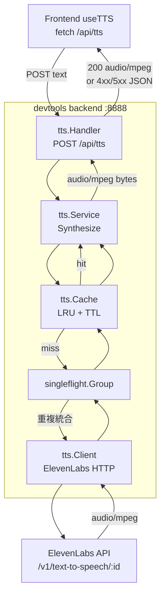
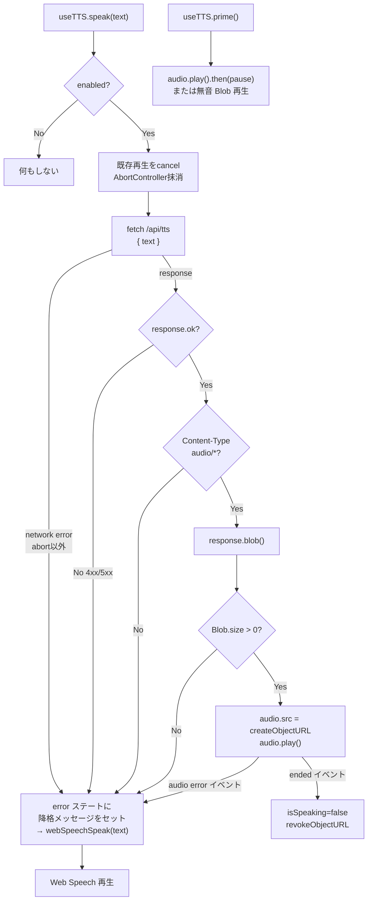

# ElevenLabsサーバーTTS化 (MVP+) 実装計画

> **【完了・方針転換済 (2026-05-28 追記)】**
> 本計画は 2026-05-27 にコミット `1aa37bb feat: ElevenLabsサーバーTTS化(MVP+)をフルスタックで実装` で**フルスタック実装完了**。
> その後、日本語の自然性に根本限界があったため **VOICEVOX へ全面移行**（`7408eaa feat: VOICEVOX TTS切替(MVP++) - ElevenLabsからローカルVOICEVOX Engineへ全面移行` で置換、main マージ済 `9b70a65`）。
> ElevenLabs 実装は `git tag tts-mvp-plus`（コミット `1aa37bb`）で永続化。ブランチ `feat/elevenlabs-tts` は破棄済。
> 現行 TTS は VOICEVOX（春日部つむぎ `speaker_id=8`）。詳細は `開発/実装/完了/2026-05-27_VOICEVOX切替_plan.md` 参照。

検討書: `開発/検討中/2026-05-27_ElevenLabsサーバーTTS化.md`(Q1-Q10 全確定済)
ベースブランチ: **`feat/dashboard-gui`**(MVP の useTTS.ts/useChat.ts/dashboard 配下がここに存在、main 未マージ)
実装ブランチ: **`feat/elevenlabs-tts`**(`feat/dashboard-gui` から派生して新規作成)

## 確定事項(検討書から引用)

| 論点 | 確定 |
|---|---|
| Q1 Voice | **Romaco**(voice_id `KgETZ36CCLD1Cob4xpkv`) |
| Q2 Model | **eleven_flash_v2_5** |
| Q3 Plan | **Free → 必要に応じて Starter/Creator** に段階アップ |
| Q4 Backend | **devtools backend(:8888) の `/api/tts`** |
| Q5 Streaming | **一括方式**(backend で全 mp3 を読み切ってから一括返却) |
| Q6 出力経路 | **HTML `<audio>` 標準実装** |
| Q7 切替方式 | **フォールバック型**(基本 ElevenLabs、失敗時のみ Web Speech、UI 無改修) |
| Q8 Cache | **インメモリ LRU**(SHA256(text+voice+model+output_format) / TTL 24h / 50MB / singleflight 統合) |
| Q9 useTTS 互換 | **インターフェース完全維持**({speak, cancel, enabled, setEnabled, isSpeaking, error, prime}) |
| Q10 Error | **エラーバナー + Web Speech フォールバック**(既存 `topError` に乗せる) |

---

## バックエンド計画

### 概要

devtools backend (`:8888`) に ElevenLabs TTS プロキシ `POST /api/tts` を新設する。目的は:

1. ElevenLabs API キーを backend で秘匿
2. インメモリ LRU キャッシュで重複読み上げの課金回避
3. フロントは Blob URL で `<audio>` 再生して AirPods/Bluetooth ルーティングに乗せる

設計案からの逸脱はなし(検討書の決定事項に忠実)。

### アーキテクチャ図



### 変更ファイル一覧(バックエンド)

| パス | 種別 | 概要 |
|---|---|---|
| `devtools/backend/internal/tts/doc.go` | 新規 | パッケージ概要・責務・外部依存の Go doc |
| `devtools/backend/internal/tts/types.go` | 新規 | リクエスト/レスポンス型、`Config`、エラー定義、定数 |
| `devtools/backend/internal/tts/client.go` | 新規 | ElevenLabs HTTP クライアント (`Client` 構造体、`Synthesize` メソッド) |
| `devtools/backend/internal/tts/cache.go` | 新規 | LRU+TTL+バイト数上限キャッシュ (`Cache` インターフェース、`lruCache` 実装) |
| `devtools/backend/internal/tts/service.go` | 新規 | `Service` インターフェース、`serviceImpl`、cache + singleflight + client 統合 |
| `devtools/backend/internal/tts/handler.go` | 新規 | `Handler` 構造体、`HandleSynthesize` Gin ハンドラ |
| `devtools/backend/internal/tts/service_test.go` | 新規 | cache hit/miss、singleflight 重複統合のテーブル駆動テスト |
| `devtools/backend/internal/tts/handler_test.go` | 新規 | リクエストバリデーション、エラー時の HTTP ステータスのテスト |
| `devtools/backend/internal/tts/cache_test.go` | 新規 | LRU エビクション・TTL 期限・バイト数上限のテスト |
| `devtools/backend/cmd/server/main.go` | 変更 | `tts.NewService()` 初期化、ハンドラ登録、ルート `POST /api/tts` 追加 |
| `devtools/backend/.env.example` | 変更 | `ELEVENLABS_API_KEY` / `ELEVENLABS_DEFAULT_VOICE_ID` / `ELEVENLABS_DEFAULT_MODEL` 追記 |
| `devtools/backend/docs/BACKEND_API.md` | 変更 | 環境変数表とエンドポイント一覧に `/api/tts` 追加、詳細仕様セクション追記 |
| `devtools/backend/docs/BACKEND_RUNBOOK.md` | 変更 | 「ElevenLabs TTS 設定」セクション追加 |
| `devtools/backend/internal/handler/doc.go` | 変更 | TTSHandler の項目追加 |
| `devtools/backend/internal/service/doc.go` | 変更 | TTSService の項目追加 |
| `devtools/backend/go.mod` | 変更 | `hashicorp/golang-lru/v2`、`golang.org/x/sync` 追加 |

`tts/` パッケージは handler + service + client + cache を 1 パッケージに集約する(grrun パッケージと同じスタイル)。理由: TTS は単機能・閉じたドメインで、cache/client は他パッケージから使われない。

### 公開 API 仕様

#### POST `/api/tts`

**リクエスト** (`Content-Type: application/json`):

| フィールド | 型 | 必須 | 説明 |
|---|---|---|---|
| `text` | string | 必須 | 読み上げ対象テキスト。1〜2000文字(上限 `MaxTextLength = 2000`) |

リクエスト型: `TTSRequest`(`types.go`)。MVP+ では `text` のみ受け取り、`voice_id` / `model_id` は **backend env 固定**(Q-BE-5 推奨と整合、フロント↔バックエンド契約の片側化を防止)。将来 Voice 選択 UI を導入する MVP++ で `voiceId` / `modelId`(camelCase、既存 API 命名規則と整合)を追加する。

**レスポンス成功** (200 OK):

- `Content-Type: audio/mpeg`
- `Content-Length: <bytes>`
- `X-TTS-Cache: hit` または `miss`(任意ヘッダ、観測用)
- Body: MP3 バイナリ(`mp3_44100_128`)

**レスポンスエラー** (`Content-Type: application/json`):

| HTTP | 用途 | エラーJSON `error` 例 |
|---|---|---|
| 400 | text 空・上限超・JSON 不正・voice_id 形式不正 | "text が空です" / "text が長すぎます" |
| 429 | ElevenLabs レート/クレジット超過 | "ElevenLabs レート制限" |
| 502 | ElevenLabs が 4xx/5xx を返した(401/403/500等)、非 audio Content-Type | "ElevenLabs から音声を取得できませんでした" |
| 503 | `ELEVENLABS_API_KEY` 未設定 | "ElevenLabs サービスが利用できません" |
| 504 | ElevenLabs へのリクエストがタイムアウト | "ElevenLabs リクエストタイムアウト" |

エラーレスポンス型: `TTSErrorResponse { Success bool; Error string }`(既存 `OpenAISessionResponse` と命名整合)。

判断根拠:
- ElevenLabs 401(キー無効)は backend 内で 502 に丸める(フロントに「キー無効」を出さず、運用者は backend ログで把握)
- 429 はパススルー(クレジット超過はユーザー操作で解消可能)

### 内部構造

#### `types.go`

- 定数: `MaxTextLength = 2000`、`DefaultOutputFormat = "mp3_44100_128"`、`CacheMaxBytes = 50 * 1024 * 1024`、`CacheTTL = 24 * time.Hour`、`HTTPTimeout = 30 * time.Second`
- 型 `TTSRequest`: `Text string`(json タグ `text`)のみ。MVP+ では voice_id/model_id を受け取らない
- 型 `TTSErrorResponse`: `Success bool`、`Error string`(json タグ `success`/`error`、既存 `OpenAISessionResponse` と命名整合)。エラー時のみに使う JSON 型(成功時は `audio/mpeg` バイナリ直返し)
- 型 `Config`: `APIKey`、`DefaultVoiceID`、`DefaultModelID`(env から読む値の集約)
- 型 `SynthesizeParams`: `Text`、`VoiceID`、`ModelID`、`OutputFormat`(内部受け渡し用、ハンドラで env デフォルトを詰めてサービスへ渡す)
- 型 `SynthesizeResult`: `Audio []byte`、`ContentType string`、`FromCache bool`
- 型 `UpstreamStatusError struct { Status int; Body string }` + `Error() string` メソッド。**ステータスコード保持のため sentinel ではなく型エラー**(`errors.As` でハンドラ側から status を取り出してマッピング)
- センチネルエラー: `ErrAPIKeyMissing`、`ErrTextEmpty`、`ErrTextTooLong`、`ErrUpstreamTimeout`、`ErrInvalidContentType`(`UpstreamStatusError` は上記の通り型エラー)

#### `client.go`

- 型 `Client`: `apiKey`、`httpClient *http.Client`、`baseURL string`(デフォルト `https://api.elevenlabs.io`)
- コンストラクタ `NewClient(cfg Config) *Client`
- メソッド `Synthesize(ctx context.Context, params SynthesizeParams) ([]byte, error)`
  - ElevenLabs `POST {baseURL}/v1/text-to-speech/{voice_id}` を呼ぶ(**non-stream エンドポイント**を採用、Q-BE-2 参照)
  - リクエストヘッダ: `xi-api-key`、`Content-Type: application/json`、`Accept: audio/mpeg`
  - リクエストボディ: `text`、`model_id`、`voice_settings`(デフォルト `stability: 0.5`, `similarity_boost: 0.75`)
  - クエリ: `output_format=mp3_44100_128`
  - レスポンス: 200 + `Content-Type: audio/mpeg` 確認 → `io.ReadAll` で全バイト読み切り
  - 非 200 → `&UpstreamStatusError{Status: resp.StatusCode, Body: bodySnippet}` を返す(レスポンス body の先頭 200 文字のみ Body に保存、API キー漏洩防止のため)
  - 非 audio/mpeg → `ErrInvalidContentType`
  - net エラー / タイムアウト → `ErrUpstreamTimeout` ラップ

#### `cache.go`

- インターフェース `Cache`: `Get(key string) ([]byte, bool)`、`Set(key string, value []byte)`、`Len() int`、`Bytes() int`
- 実装 `lruCache`: `mu sync.Mutex`、`lru *lru.Cache[string, cacheEntry]`、`maxBytes int`、`currBytes int`、`ttl time.Duration`、`clock func() time.Time`(テスト用注入)
- 型 `cacheEntry`: `data []byte`、`expiresAt time.Time`
- コンストラクタ `NewLRUCache(maxBytes int, ttl time.Duration) *lruCache`
- `Set` 時にバイト数上限を超える分だけ `RemoveOldest` ループで evict
- `Get` 時に TTL 期限切れなら削除して miss 扱い
- スレッドセーフ: 全メソッドで `sync.Mutex` を取る(明示ロック、`hashicorp/golang-lru/v2` 自体はスレッドセーフだがバイト数計算と組み合わせるため)

**キー生成関数** `cacheKey(text, voiceID, modelID, outputFormat string) string`:
- SHA256(`text + "\x00" + voiceID + "\x00" + modelID + "\x00" + outputFormat`) を hex 化
- 区切り `\x00` で衝突回避
- `outputFormat` を含めて将来 192kbps/PCM 拡張時の取り違え防止

#### `service.go`

- インターフェース `Service`: `Synthesize(ctx context.Context, params SynthesizeParams) (*SynthesizeResult, error)`
- インターフェース `clientInterface`(service.go 内、非公開): `Synthesize(ctx context.Context, params SynthesizeParams) ([]byte, error)`。本物の `*Client` は自動的に満たすため production コード変更不要。テストで mock client を差し替えるためのレイヤー
- 実装 `serviceImpl`: `client clientInterface`、`cache Cache`、`sfGroup *singleflight.Group`、`cfg Config`
- コンストラクタ `NewService() Service`: env から `Config` を読み、API キー未設定なら `nil` を返す(既存 `OpenAIService` と同型)
- `Synthesize` の責務(ロジック詳細は実装側):
  1. パラメータ正規化(空フィールドを env デフォルトで埋める、`OutputFormat` は常に `mp3_44100_128`)
  2. `cacheKey` 計算
  3. `cache.Get` で hit なら即返却(`FromCache: true`)
  4. miss なら `sfGroup.Do(key, ...)` で重複統合 → `client.Synthesize`
  5. 成功時に `cache.Set`

#### `handler.go`

- 型 `Handler`: `svc Service`
- コンストラクタ `NewHandler(svc Service) *Handler`
- メソッド `HandleSynthesize(c *gin.Context)`:
  - `svc == nil` → 503
  - `ShouldBindJSON` で `TTSRequest` パース → エラー時 400
  - `Text` バリデーション(空・長さ)→ NG なら 400
  - `svc.Synthesize` 呼び出し
  - エラー → `mapErrorToStatus(err)` でセンチネルをステータスコードに変換
  - 成功 → `c.Data(200, "audio/mpeg", result.Audio)` + `X-TTS-Cache` ヘッダ

センチネル → ステータスマッピング:

| センチネル | ステータス | フロント向けメッセージ |
|---|---|---|
| `ErrAPIKeyMissing` | 503 | "ElevenLabs サービスが利用できません" |
| `ErrTextEmpty` / `ErrTextTooLong` | 400 | "text が不正です" |
| `ErrUpstreamTimeout` | 504 | "ElevenLabs リクエストタイムアウト" |
| `UpstreamStatusError`(`Status == 429`) | 429 | "ElevenLabs レート制限" |
| `UpstreamStatusError`(その他) | 502 | "ElevenLabs から音声を取得できませんでした" |
| `ErrInvalidContentType` | 502 | 同上 |

実装: `mapErrorToStatus` 内で `var ue *UpstreamStatusError; if errors.As(err, &ue) { ... }` で型を取り出し `ue.Status` を判定。

#### `cmd/server/main.go` への追加

- `import "ghostrunner/backend/internal/tts"` を追加
- 既存 `openaiService := service.NewOpenAIService()` の後に `ttsService := tts.NewService()` を初期化(nil 許容)
- `ttsHandler := tts.NewHandler(ttsService)` を初期化
- `api.POST("/tts", ttsHandler.HandleSynthesize)` を追加(`/api/health` と同じグループ内)

### 環境変数

| 名前 | 必須/任意 | デフォルト | 用途 |
|---|---|---|---|
| `ELEVENLABS_API_KEY` | 任意(未設定時 503) | (なし) | `xi-api-key` ヘッダ値 |
| `ELEVENLABS_DEFAULT_VOICE_ID` | 任意 | `KgETZ36CCLD1Cob4xpkv` (Romaco) | リクエストで省略時に使用 |
| `ELEVENLABS_DEFAULT_MODEL` | 任意 | `eleven_flash_v2_5` | リクエストで省略時に使用 |

`.env` 読み込み: 既存サーバーは `os.Getenv` を直接呼ぶ前提(godotenv 未使用)。**この既存パターンを踏襲**。

`.gitignore` 確認: ルート `.gitignore` の `.env` 行で `devtools/backend/.env` は既に除外済(追加対応不要)。

未設定時挙動:
- `ELEVENLABS_API_KEY` 未設定 → `NewService` が WARN ログ後 `nil` 返却 → `HandleSynthesize` は 503
- voice_id / model_id 未設定 → ハードコード fallback(Romaco / flash_v2_5)を使用 + WARN ログ

### 依存追加

`devtools/backend/go.mod`:

| パッケージ | バージョン | 用途 |
|---|---|---|
| `github.com/hashicorp/golang-lru/v2` | `v2.0.7` 以上 | LRU キャッシュ |
| `golang.org/x/sync` | `v0.7.0` 以上 | `singleflight` |

既存 `go.mod` に両方未導入。`go get` で追加 → `go mod tidy`。

### 観測性

`log.Printf` 出力(API キーは絶対に含めない)。**ログ接頭辞は `[TTSHandler]` と `[TTSService]` の 2 つに集約**(既存 OpenAI が `[OpenAIHandler]` / `[OpenAIService]` の 2 接頭辞構成と整合。client/cache の内部ログも `[TTSService]` 接頭辞で書く):

- `[TTSHandler] HandleSynthesize: textLen=%d`
- `[TTSService] cache hit: keyPrefix=%s`(キー先頭16文字のみ) / `cache miss: keyPrefix=%s, calling ElevenLabs`
- `[TTSService] ElevenLabs response: status=%d, bytes=%d, durationMs=%d`
- `[TTSService] ElevenLabs failed: error=%v`(エラー文面に API キー混入禁止、`UpstreamStatusError.Body` は先頭 200 文字のみ)
- `[TTSService] cache evicted: keyPrefix=%s, bytes=%d, currBytes=%d`(任意)

メトリクス: MVP+ では未実装。`cache.Bytes() int` を公開しておき、将来の使用量メーター用 hook を残す。

### 文書化

- `tts/doc.go`: パッケージ責務・外部依存・主要型・設計判断(stream vs non-stream、LRU+TTL+バイト数のハイブリッド戦略、singleflight、**singleflight 中の上流呼び出しは context cancel に従わずキャッシュに最終結果が入る**点も明記)
- `docs/BACKEND_API.md`: env 表 3 つ追加、エンドポイント一覧に `/api/tts` 追加、TTS API セクション新設、**HTTP ステータスコード表に 429/502/504 を追加**
- `docs/BACKEND_RUNBOOK.md`: 「ElevenLabs TTS 設定」セクション新設(キー発行・voice_id 確認・env 設定例・動作確認 curl・429/503 トラブルシューティング)。動作確認 curl 例:
  ```
  curl -X POST http://localhost:8888/api/tts \
    -H 'Content-Type: application/json' \
    -d '{"text":"テストです"}' --output test.mp3
  ```
- `handler/doc.go`: TTSHandler 項目追加 + **HTTP ステータスコード表に 429/502/504 を追加** + 既存 OpenAI のサンプルと整合させ「**無条件登録 + ハンドラ内 nil チェック → 503**」パターンに統一(現状 doc.go では条件付き登録例が残っているため、TTS 追加時に同パターン化)
- `service/doc.go`: TTSService 項目追加

### 実装ステップ(順序)

1. **依存追加**: `cd devtools/backend && go get github.com/hashicorp/golang-lru/v2 && go get golang.org/x/sync/singleflight && go mod tidy`
2. **`tts/types.go`**: 定数・型・`UpstreamStatusError` 型・センチネルエラー定義
3. **`tts/client.go`**: ElevenLabs HTTP クライアント。エラーボディは先頭 200 文字のみ保持(API キー漏洩防止)
4. **`tts/cache.go`** + `cache_test.go`: LRU+TTL+バイト数キャッシュ。テストは LRU エビクション・TTL 期限・バイト数上限・**cacheKey 決定性(同入力同キー、`\x00` 区切り衝突回避)**を網羅
5. **`tts/service.go`** + `service_test.go`: cache + singleflight + client 統合。テストは cache hit/miss・singleflight 重複統合・**OutputFormat 自動補完**・モック client での挙動を網羅
6. **`tts/handler.go`** + `handler_test.go`: Gin ハンドラ。テストは **`mapErrorToStatus` の各分岐**(`ErrAPIKeyMissing` / `ErrTextEmpty` / `ErrTextTooLong` / `ErrUpstreamTimeout` / `UpstreamStatusError{429}` / `UpstreamStatusError{500}` / `ErrInvalidContentType`)、**`errors.Is` / `errors.As` でハンドラから判定可能か**、バリデーション(空 text / 上限超 / JSON 不正)、503/400/429/502/504 の HTTP ステータスを網羅
7. **`tts/doc.go`**: パッケージ Go doc
8. **`cmd/server/main.go`**: 初期化・ルート登録(無条件登録、`HandleSynthesize` 内で nil チェック → 503)
9. **`.env.example`**: env テンプレ追記
10. **`devtools/backend/.env`**(ユーザー手動): 実 API キー・voice_id・model_id 設定
11. **`.gitignore` 確認**: ルート `.gitignore` に `.env` 行があり `devtools/backend/.env` が除外されていることを確認(変更が必要なら追記)
12. **`handler/doc.go` / `service/doc.go`**: 新コンポーネント追記、HTTP ステータスコード表に 429/502/504 追加、サンプル登録例を無条件登録パターンに統一
13. **`docs/BACKEND_API.md` / `docs/BACKEND_RUNBOOK.md`**: ドキュメント更新
14. **動作確認**: `make restart-backend-logs`、上記 curl で MP3 取得確認

### バックエンド確認事項

#### Q-BE-1: tts パッケージを `internal/tts/` に集約するか、既存通り `handler/` + `service/` に分散させるか

**ステータス**: 未回答
**選択肢**:
- A案: `internal/tts/` 1 パッケージに集約(handler.go + service.go + client.go + cache.go)
- B案: 既存パターンに合わせて `handler/tts.go` + `service/tts.go` + `service/tts_client.go` + `service/tts_cache.go`

**推奨**: A案
**理由**: TTS は単機能・閉じたドメインで cache/client は他パッケージから使われない。grrun が同じ判断(handler を持たず内部完結)を採っており整合する。B 案は `service` パッケージが肥大化し、`tts_cache` の責務が `service` パッケージ概要(Claude CLI / ntfy / template / patrol)に馴染まない。

#### Q-BE-2: ElevenLabs エンドポイントを stream 版と non-stream 版どちらにするか

**ステータス**: 未回答
**選択肢**:
- A案: non-stream `/v1/text-to-speech/{voice_id}` を使う(`io.ReadAll` で全バイト読み切る)
- B案: stream `/v1/text-to-speech/{voice_id}/stream` を使うが backend で全読み切ってから一括返却

**推奨**: A案
**理由**: 一括方式採用が確定済(Q5)。stream を使っても backend で読み切るなら chunked のメリットなし。non-stream の方がレスポンスが単純で `Content-Length` 確定。生成品質は両者同一。将来 chunked パススルー(MVP++)時は stream エンドポイント版メソッドを追加。

#### Q-BE-3: 上流(ElevenLabs)401 をフロントに何で返すか

**ステータス**: 未回答
**選択肢**:
- A案: 502 Bad Gateway に丸める(キー無効の事実をフロントに出さない)
- B案: 401 をパススルー
- C案: 503 Service Unavailable に丸める(キー未設定と同じ扱い)

**推奨**: A案
**理由**: フロントはどのみち Web Speech フォールバックを発火するだけで、401/502/504 の区別が UX に効かない。401 パススルーは攻撃者にキー状態を漏らすセキュリティリスク。運用者は backend ログでキー無効を把握できれば十分。

#### Q-BE-4: `text` の上限長を 2000 文字とするか

**ステータス**: 未回答
**選択肢**:
- A案: 2000 文字
- B案: 5000 文字(ElevenLabs eleven_v3 の上限相当)
- C案: 上限なし(ElevenLabs 側の上限に任せる)

**推奨**: A案
**理由**: 統括 GUI の応答は通常 500 文字前後で 2000 文字あれば長文も収まる。上限明示で誤って巨大テキスト送信した際の課金事故を防止。UX 面でも「長すぎる」エラーで気づける。

#### Q-BE-5: `voice_settings`(stability, similarity_boost) をリクエスト時に上書き可能にするか

**ステータス**: 未回答
**選択肢**:
- A案: backend 固定(stability=0.5, similarity_boost=0.75)、リクエストでは受け付けない
- B案: リクエスト JSON に `voice_settings` オプションを追加し、未指定時のみデフォルト適用

**推奨**: A案
**理由**: MVP+ では音質チューニングはサーバー側で一元管理した方がコスト/品質のばらつきが少ない。voice_settings をフロントに出すと将来の値域変更で互換問題が起きやすい。必要が出たら env で上書きできる仕組み(`ELEVENLABS_VOICE_STABILITY` 等)を追加する方が拡張容易。

#### Q-BE-6: キャッシュ容量 50MB を「エントリ数」で代用するか「バイト数」厳密に管理するか

**ステータス**: 未回答
**選択肢**:
- A案: バイト数厳密管理(Set 時に `currBytes` を計算、超過分を `RemoveOldest` ループ削除)
- B案: エントリ数で代用(50MB ÷ 平均 200KB ≒ 250 エントリ)

**推奨**: A案
**理由**: 仕様書 Q8 で「50MB 上限」と明記済。flash_v2_5 / 500字 ≒ 50KB が平均だが、長文応答で 1MB 超えることもありエントリ数固定では予測不能。バイト数管理は `RemoveOldest` + 自前カウンタで素直に書ける。

---

## フロントエンド計画

### 概要

統括GUI MVP の `devtools/frontend/src/hooks/useTTS.ts`(feat/dashboard-gui ブランチ・コミット 4d98554)を、**既存の公開インターフェースを完全維持したまま**内部実装を「ElevenLabs を `<audio>` で再生 + 失敗時に Web Speech にフォールバック」型に差し替える。`dashboard/page.tsx` と `TTSToggle.tsx` は無改修。Web Speech 経路は廃止せず、フォールバック専用のヘルパーモジュールとして温存することで、`ELEVENLABS_API_KEY` 未設定環境・モバイル回線断・レート超過時の無音事故をゼロに保つ。

### フロー図



### 変更ファイル一覧(フロントエンド)

| パス | 種別 | 概要 |
|---|---|---|
| `devtools/frontend/src/hooks/useTTS.ts` | 変更 | 内部実装をフォールバック型に差し替え。公開 API は無変更 |
| `devtools/frontend/src/lib/tts/elevenlabsClient.ts` | 新規 | `/api/tts` への fetch クライアント関数(`requestTTS`) |
| `devtools/frontend/src/lib/tts/webSpeech.ts` | 新規 | 既存 Web Speech 経路を切り出した helper(`speakWithWebSpeech` / `cancelWebSpeech` / `primeWebSpeech`) |
| `devtools/frontend/src/lib/tts/silentMp3.ts` | 新規 | 無音 mp3 の base64 data URL(prime 用)。生成元: `ffmpeg -f lavfi -i anullsrc=r=44100:cl=mono -t 0.1 -c:a libmp3lame -b:a 128k silent.mp3 && base64 -i silent.mp3` |
| `devtools/frontend/src/lib/tts/errors.ts` | 新規 | `TTSError` class、`TTSFallbackReason` union(types/ 配下は interface/type のみという既存流儀を維持) |
| `devtools/frontend/src/types/tts.ts` | 新規 | `TTSRequest` interface、`TTSResponse` 等の型定義(class は含めない) |
| `devtools/frontend/next.config.ts` | 変更 | rewrites に `/api/tts` 明示エントリ追加(catch-all より前) |
| `devtools/frontend/src/__tests__/hooks/useTTS.test.ts` | 変更 | 既存 9 ケースの対応表に従って書き換え(下記参照)、フォールバック分岐の網羅テスト追加 |
| `devtools/frontend/src/__tests__/lib/tts/elevenlabsClient.test.ts` | 新規 | `requestTTS` の単体テスト(network error / 4xx / 5xx / Content-Type / empty Blob / abort) |
| `devtools/frontend/src/__tests__/lib/tts/webSpeech.test.ts` | 新規 | Web Speech 純関数の単体テスト(voiceschanged、ja-JP voice 選択、cancel→50ms→speak 等の既存ケースをここに移動) |
| `devtools/frontend/docs/screens.md` | 変更 | TTS 関連節を ElevenLabs + フォールバックの説明に更新(該当 mermaid 図と説明段落を 1-2 行で示す) |
| `devtools/frontend/docs/screen-flow.md` | 変更 | TTS フロー図を ElevenLabs 主経路に差し替え |

### 公開インターフェース(useTTS)

既存と完全同一。フィールド名のみ列挙:

| フィールド | 型 | 役割 |
|---|---|---|
| `speak` | `(text: string) => void` | ElevenLabs を主経路、失敗時 Web Speech にフォールバック |
| `cancel` | `() => void` | 進行中の fetch を abort、`<audio>` を pause+reset、Web Speech も停止 |
| `enabled` | `boolean` | TTS ON/OFF |
| `setEnabled` | `(v: boolean) => void` | トグル |
| `isSpeaking` | `boolean` | `<audio>` の play/ended/error または Web Speech の発話状態に連動 |
| `error` | `string \| null` | フォールバック発生時に「ElevenLabs 接続失敗。Web Speech に降格しました」を保持 |
| `prime` | `() => void` | iOS Safari autoplay unlock。`<audio>` ベースに役割転換 |

### 内部設計

#### `<audio>` 要素の管理

`useRef<HTMLAudioElement | null>` で **1 つ持ち回し**。iOS Safari autoplay unlock は「ユーザージェスチャで 1 度 play した element」に紐づくため、同じ要素を使い回す必要がある。`useEffect` の初回マウントで `new Audio()` し `audioRef.current` に格納、`playsInline = true` を設定。DOM attach は不要(iOS 17+ は動的生成で OK)。

#### Blob URL のライフサイクル

- `requestTTS` から得た Blob を `URL.createObjectURL(blob)` で URL 化 → `audio.src` セット
- 解放タイミング: 「次の speak の冒頭」「unmount 時」「`ended` / `error` イベント」
- `currentObjectUrlRef: useRef<string | null>` で管理、入れ替え時に `URL.revokeObjectURL(prev)`

#### AbortController

- `abortRef: useRef<AbortController | null>` を 1 つ持つ
- speak() 開始時: 既存 controller があれば abort → 新規生成
- cancel() / unmount cleanup でも abort
- `error.name === "AbortError"` の catch では**フォールバックしない**(意図的キャンセル)

#### 状態管理

| state | 既存 | 新規/変更 |
|---|---|---|
| `enabled` | あり | 変更なし。localStorage 連動も既存通り。**`setEnabled(false)` は内部で `cancel()` を呼ぶ**(in-flight fetch abort + audio pause + Web Speech stop) |
| `isSpeaking` | あり | `<audio>` イベント + Web Speech イベントの両方から更新。詳細は下表 |
| `error` | あり | フォールバック発生時のみセット。クリア条件は「次の speak 成功(`<audio>` の **`playing` イベント発火**、`play` ではなく)」で `null`。`playing` を使う理由: `play` メソッド呼出だけだと、Blob 取得後の audio.onerror フォールバックパスを誤クリアする |

新規 ref:
- `audioRef`: HTMLAudioElement
- `abortRef`: AbortController
- `currentObjectUrlRef`: string(Blob URL 管理)
- `isFallbackActiveRef`: boolean(現在 Web Speech フォールバック中かを記録、cancel() で正しく `cancelWebSpeech()` を呼ぶ判定に使用)

**isSpeaking 更新の経路**:

| 経路 | true 化トリガ | false 化トリガ |
|---|---|---|
| ElevenLabs(`<audio>`) | `playing` イベント | `ended` イベント、`audio.onerror` でフォールバック後は false→Web Speech 側で再度 true |
| Web Speech フォールバック | `onStart` callback | `onEnd` / `onError` callback |

#### フォールバック分岐判定表

| 検知点 | 条件 | 処理 |
|---|---|---|
| fetch reject | `AbortError` 以外の throw | Web Speech 降格、`error` セット |
| HTTP ステータス | `!response.ok`(4xx/5xx 全般) | Web Speech 降格、`error` セット |
| Content-Type | `audio/` で始まらない | Web Speech 降格、`error` セット |
| Body サイズ | `blob.size === 0` | Web Speech 降格、`error` セット |
| audio エラー | `<audio>.onerror` 発火 | Web Speech 降格、`error` セット、Blob URL revoke |
| fetch abort | `AbortError` | フォールバックしない(意図的キャンセル) |

#### prime() の挙動変更(詳細)

無音 mp3 の data URL(`lib/tts/silentMp3.ts` に 0.1 秒程度の base64 定数)を使い、**ユーザージェスチャの同期スコープで `<audio>` を unlock する**。`handleGrasp`/`handleChatSend` の呼出箇所は無改修。

実装手順(同期スコープ内で連続実行):
1. `audio.muted = true`(unlock 時の音漏れ防止)
2. `audio.src = SILENT_MP3_DATA_URL`(data URL なので Blob URL 管理不要)
3. `audio.play()` を呼ぶ → 戻り値の Promise を `then(() => { audio.pause(); audio.currentTime = 0; audio.muted = false; })` でチェーン
4. catch では unlock 失敗を `error` ステートにセット(`"音声再生の準備に失敗しました"`)、フォールバック判定には**進めない**(prime 失敗は speak 時の再試行に任せる)

**重要な不変条件**:
- `prime()` 後 `speak()` まで時間が空いても、unlock 効果は `<audio>` 要素単位で維持される(同じ要素を使い回す前提で `useRef` 採用)
- `speak()` 内で `audio.src` を Blob URL に差し替える際は **必ず `audio.pause()` を先に呼ぶ**(無音再生継続中の src 上書きを避ける UA 差対策)
- prime() を呼んだ後に Web Speech 経路へフォールバックする場合は、別途 `primeWebSpeech()` を同じジェスチャスコープで併用する必要がある(setEnabled(true) 時のみ。speak() 内では Web Speech の prime はスキップ — autoplay 制約は audio 要素側で吸収済)

### /api/tts クライアント

#### 配置

`devtools/frontend/src/lib/tts/elevenlabsClient.ts`(新規)。既存 `lib/chatApi.ts` の流儀(async function export、`fetch` の `!response.ok` で throw)を踏襲。`TTSError` クラスは **`lib/tts/errors.ts` に分離**(既存 `types/` 配下は interface/type のみで class を export していない流儀を維持)。

#### シグネチャ(オプションオブジェクト形)

```ts
requestTTS(params: {
  text: string;
  signal?: AbortSignal;
}): Promise<Blob>
```

リクエストボディ: `{ text: string }` のみ(voice_id/model_id は backend 側 env で固定)。将来 Voice 選択 UI を追加する MVP++ で `voiceId`/`modelId` を任意引数として追加できる拡張余地を残す。

#### API ベース URL

`const API_BASE = process.env.NEXT_PUBLIC_API_BASE || ""` を参照し `${API_BASE}/api/tts` に POST。既存 `lib/chatApi.ts` 流儀と整合。dev では空文字 → next rewrites で 8888 へ転送、本番では `NEXT_PUBLIC_API_BASE` を直接叩く。

#### レスポンス処理

- `response.ok === false` → `TTSError` を throw(status と statusText、`reason: "http_error"`)
- `Content-Type` ヘッダの判定: **`contentType?.toLowerCase().startsWith("audio/")` で大文字小文字を吸収**。ヘッダが空(`null`)の場合は throw(`reason: "missing_content_type"`)
- `response.blob()` で取得し、`blob.size === 0` なら `TTSError` を throw(`reason: "empty_body"`)
- 正常時は `Blob` を返す

abort 時は fetch がそのまま `AbortError` を投げる。useTTS 側で `error.name === "AbortError"` 判定。

#### リトライ

**MVP+ では HTTP リトライなし**(0 回)。1 発で失敗したら useTTS 側で Web Speech フォールバックに移る。指数バックオフは MVP++ で必要に応じて検討。

### next.config.ts への変更

既存 catch-all で `/api/tts` も既に 8888 に転送される。動作上は追加不要だが、意図明示と将来の順序ミス予防のため **`/api/tts` の明示エントリを追加**:

```
rewrites = [
  { source: "/api/tts", destination: "http://localhost:8888/api/tts" },
  // ... 既存
  { source: "/api/:path*", destination: "http://localhost:8888/api/:path*" },
]
```

より具体的なルートを先に、catch-all は最後。

### エラー伝播

- フォールバック発生時、`useTTS` 内で `setError("ElevenLabs 接続失敗。Web Speech に降格しました")`
- クリア条件: **次の `speak()` 成功時(`<audio>` の play イベント発火)**に `setError(null)`
- 既存 `dashboard/page.tsx` の `topError = chat.error ?? dashboard.error ?? tts.error` は無改修

### webSpeech.ts の API シグネチャ

純関数群として export。useTTS の `setIsSpeaking` 等に状態を伝えるため **callbacks** を渡す形式:

```ts
speakWithWebSpeech(text: string, callbacks: {
  onStart?: () => void;
  onEnd?: () => void;
  onError?: (e: SpeechSynthesisErrorEvent) => void;
}): void

cancelWebSpeech(): void

primeWebSpeech(): void  // setEnabled(true) 時のみ同期ジェスチャから呼ぶ
```

内部状態(voiceschanged で選んだ ja-JP voice、cancel→50ms→speak の setTimeout 等)は **モジュールスコープのクロージャ**で保持(useTTS hook の責務には含めない)。テスト時は `vi.resetModules()` で初期化。

`cancel()`(useTTS)の Web Speech 停止経路:
- `isFallbackActiveRef.current === true` の時のみ `cancelWebSpeech()` を呼ぶ
- それ以外は audio.pause() + abortRef.current?.abort() のみ

### iOS Safari 互換性メモ

- `<audio>` 要素は `new Audio()` の動的生成で OK(iOS 17+ 対象)
- 動的生成のみで動くことが望ましいが、UA 差を吸収する**保険**として実機検証 AC で「DOM attach 必要か」を確認(NG なら `document.body.appendChild(audio)` + `style.display = "none"` を追加)
- `playsInline = true` 明示
- `audio.preload = "auto"` で src セット後即ダウンロード(Blob URL はネットワーク取得不要なので影響なし)
- Blob URL は iOS Safari 15+ で安定(対象範囲では問題なし)
- prime() タイミング: 既存の `handleGrasp` / `handleChatSend` 同期スコープで `tts.prime()` が呼ばれる前提を維持
- AbortError 名は `"AbortError"` で標準。`error.name === "AbortError"` の判定で意図的キャンセルを検出

### unmount cleanup 順序

useEffect cleanup で **(1) abort → (2) audio.pause() → (3) audio.removeAttribute("src") → (4) URL.revokeObjectURL(prev)** の固定順序で実行。逆順にすると Safari/Chrome の一部バージョンで MEDIA_ERR_SRC_NOT_SUPPORTED が発火し audio.onerror 経由でフォールバック分岐に誤って入る。

### 受け入れ条件

| # | 条件 | 検証手段 |
|---|---|---|
| AC1 | iPhone Safari で送信 → 数秒で Romaco 声の応答音声が AirPods から鳴る | 実機検証。レイテンシ目安: first audio byte 到達から 1.5 秒以内に再生開始 |
| AC2 | `ELEVENLABS_API_KEY` 未設定環境(503 応答)→ 自動で Web Speech に降格、TopError バナー表示 | dev 環境で .env から key 抜く |
| AC3 | TTS OFF(`enabled === false`)→ 何も鳴らない、`/api/tts` も叩かない | DevTools Network |
| AC4 | session 切替時(`tts.cancel()` 呼出)→ 再生中の `<audio>` が止まる、進行中 fetch が abort、フォールバック中なら Web Speech も停止 | DevTools Network で canceled 確認 |
| AC5 | 連続送信 → 前の audio がキャンセルされ新しい音声が鳴る | 連打テスト |
| AC6 | 公開 API が既存と完全一致 | TypeScript コンパイル + `dashboard/page.tsx` 無改修確認 |
| AC7 | `error` ステートにフォールバックメッセージがセット | フォールバック条件再現 |
| AC8 | 次の speak 成功時(`playing` イベント発火)に error が `null` クリア | バナー消失確認 |
| AC9 | prime() を呼んだ後に 30 秒以内に speak() が来ても iOS Safari の unlock が維持される | iPhone 実機で待機後再生 |
| AC10 | 既存 useTTS.test.ts の公開 API テストがすべて通る(内部実装差し替えのリグレッションなし)。下記対応表に従い既存ケースを処理済 | `npm test` |
| AC11 | `X-TTS-Cache: hit/miss` ヘッダが想定通り出る(初回 miss、同一テキスト2回目 hit) | curl で確認 |

### 既存テスト(useTTS.test.ts、feat/dashboard-gui の 9 ケース)対応表

| # | 既存ケース | 新実装後 | 措置 |
|---|---|---|---|
| 1 | speak→cancel→50ms→speak 順序 | Web Speech 経路でのみ意味あり | `webSpeech.test.ts` に移動、フォールバック分岐の中で再現 |
| 2 | voiceschanged で voice 再評価 | `webSpeech.ts` 内部の挙動 | `webSpeech.test.ts` に移動 |
| 3 | ja-JP voice あり | 同上 | `webSpeech.test.ts` に移動 |
| 4 | ja-JP voice なし(lang フォールバック) | 同上 | `webSpeech.test.ts` に移動 |
| 5 | enabled=false で speak 呼出 → no-op | useTTS 主経路で維持 | `useTTS.test.ts` に残す |
| 6 | enabled トグル localStorage 永続 | 維持 | `useTTS.test.ts` に残す |
| 7 | SSR セーフ(`window.speechSynthesis` 未定義環境) | 維持(かつ ElevenLabs 経路も SSR セーフ) | `useTTS.test.ts` に残す + 拡張 |
| 8 | 未対応ブラウザ(`window.speechSynthesis` 不在) | **意味変化** — ElevenLabs 経路は動く想定なので no-op ではない | 「未対応かつ ElevenLabs 失敗 → error セット」に書き換え |
| 9 | cancel() 単体 | 維持 + fetch abort 検証追加 | `useTTS.test.ts` で拡張 |

新規追加テスト(`useTTS.test.ts`):
- フォールバック分岐の網羅: network error / 4xx / 5xx / Content-Type 不正 / 空 Blob / audio.onerror
- `setEnabled(false)` で in-flight fetch が abort されること
- `error` が `playing` イベントでクリアされること(`play` ではなく)
- `prime()` が `<audio>.play().then(pause)` パターンで成功すること

### 実装ステップ(順序)

1. `types/tts.ts` 新規: `TTSRequest` interface のみ
2. `lib/tts/errors.ts` 新規: `TTSError` class、`TTSFallbackReason` union
3. `lib/tts/silentMp3.ts` 新規: 無音 mp3 base64 定数(生成元コマンドをコメント付与)
4. `lib/tts/elevenlabsClient.ts` 新規: `requestTTS({ text, signal })` オプションオブジェクト形、`NEXT_PUBLIC_API_BASE` 参照
5. `lib/tts/webSpeech.ts` 新規: 既存 Web Speech ロジックを純関数群に移植(`speakWithWebSpeech` / `cancelWebSpeech` / `primeWebSpeech`)、callback シグネチャ統一
6. `hooks/useTTS.ts` リファクタ: `audioRef` / `abortRef` / `currentObjectUrlRef` / `isFallbackActiveRef` 導入、`speak` 内でフォールバック分岐、`cancel` / `prime` / `setEnabled` を新実装に
7. `next.config.ts` 変更: `/api/tts` 明示エントリ追加(catch-all より前)
8. テスト再構成:
   - `__tests__/lib/tts/elevenlabsClient.test.ts` 新規
   - `__tests__/lib/tts/webSpeech.test.ts` 新規(既存ケース 1-4 を移動)
   - `__tests__/hooks/useTTS.test.ts` 修正(対応表に従う)
9. `docs/screens.md` / `docs/screen-flow.md` 更新

### フロントエンド確認事項

#### Q-FE-1: Web Speech 経路の切り出し方法

**ステータス**: 未回答
**選択肢**:
- A案: `lib/tts/webSpeech.ts` に純関数群として切り出す
- B案: `useTTS.ts` 同ファイル内に helper 関数として残す
- C案: `useTTSWebSpeech.ts` として hook 分離

**推奨**: A案
**理由**: useTTS.ts が肥大化せず、テスト時に Web Speech 分岐のみ独立してモック可能。hook 化(C)は条件付き呼び出しに該当する恐れがあり Hooks のルール違反リスク。

#### Q-FE-2: prime() の autoplay unlock 方式

**ステータス**: 未回答
**選択肢**:
- A案: 無音 mp3 の data URL を `audioRef.src` にセットして `play()`
- B案: src 未設定 or 既存 src のまま `play().then(pause)` 古典パターン
- C案: 無音 Blob を生成して URL 化して再生

**推奨**: A案
**理由**: 0.1 秒程度の無音 mp3 を base64 定数として持てば Blob URL 管理不要、確実に iOS Safari の unlock を通せる。B は src 必須挙動の差で iOS で失敗例あり。C は Blob URL 解放管理が増える。

#### Q-FE-3: error ステートのクリアタイミング

**ステータス**: 未回答
**選択肢**:
- A案: 次の `speak()` 成功時(`<audio>` の play イベント発火)に `null` クリア
- B案: 一定時間後(例 5 秒)に setTimeout で消す
- C案: ユーザー操作(バナークリックで dismiss)で消す
- D案: クリアしない(復旧後も表示継続)

**推奨**: A案
**理由**: タイマー管理不要、UI 改修不要(B/C 不採用)、復旧時に古いエラーが残らない(D 不採用)。バナー無改修で自然に復旧表示。

#### Q-FE-4: next.config.ts への /api/tts エントリ明示追加

**ステータス**: 未回答
**選択肢**:
- A案: `/api/tts` を明示エントリで追加(catch-all より前)
- B案: 既存 catch-all `/api/:path*` のままで何もしない

**推奨**: A案
**理由**: 動作上は B でも動くが、将来 even-terminal(:3456) へのルート分岐が入った時に意図明示で順序ミス防止。差分 1 行で軽微。

#### Q-FE-5: 無音 mp3 data URL の保管場所

**ステータス**: 未回答
**選択肢**:
- A案: `lib/tts/elevenlabsClient.ts` 内に併置
- B案: 専用ファイル `lib/tts/silentMp3.ts` を新設して export
- C案: `useTTS.ts` 内に直接定数として埋め込む

**推奨**: B案
**理由**: 数 KB のバイナリ文字列を hook 本体に置くと可読性低下(C 不採用)。client の責務は API 通信なので分離(A よりは独立)。専用ファイルは再利用可能で単独テストも容易。

#### Q-FE-6: 既存 useTTS.test.ts(9 ケース)の再構成方針

**ステータス**: 未回答
**選択肢**:
- A案: 既存テスト対応表(本計画書記載)に従い、Web Speech 内部挙動のケース(1-4)を `webSpeech.test.ts` に移動、その他は useTTS.test.ts に残す/書き換える
- B案: 既存テストを全削除して新規に書き直す
- C案: 既存テストをそのまま残し、新規テストを追加(public API テストとして併存)

**推奨**: A案
**理由**: 既存ケースは MVP 計画書 §8.4.1 で確定済の重要な品質保証。useTTS の責務縮小に合わせて適切な場所に移動するのが筋。全削除(B)は MVP 投資の破棄。併存(C)はテスト重複で意図不明になる。

#### Q-FE-7: debug ログ(`console.warn`)の許容範囲

**ステータス**: 未回答
**選択肢**:
- A案: 本番含めて一切禁止(既存 project rule 厳守)
- B案: `process.env.NODE_ENV === "development"` の限定で `console.warn` 許容(フォールバック発生など重要分岐の検知用)

**推奨**: A案
**理由**: プロジェクトルール「本番コードに console.log 禁止」を厳守。フォールバック発生は `error` ステート + topError バナーで既にユーザーと開発者の両方に可視化されており、追加の console 出力は不要。テスト時の検証は `error` ステートをアサートする形で代替可能。

---

## テストプラン

### 概要

- **目的**: 過剰テストと不足テストの両方を防ぎ、AC1-11 を網羅可能な範囲でユニット/インテグレーションテストでカバー。実機検証(AC1/AC9)のみ手動に委ねる
- **観点**:
  - バックエンド: cache(純ロジック)・service(統合)・handler(HTTP 境界)・client(httptest による HTTP 層実機)
  - フロントエンド: elevenlabsClient(fetch ラッパー)・webSpeech(純関数)・useTTS(フォールバック分岐ハブ)
  - 既存計画書の「テスト再構成手順(実装ステップ 8)」「対応表」を入力として採用し、不足を補い過剰を削る
- **判断基準**: 「壊れたら本番で TTS が無音になる/誤発火する/課金事故」のリスクが中以上の箇所に集中

### リスク分析

#### テストが必要な箇所(必須)

| 対象 | リスク | 理由 | テスト種別 |
|---|---|---|---|
| `tts.lruCache`(cache.go) | 高 | 課金事故直結。バイト数管理・TTL・LRU の3軸が絡む独自ロジック | unit |
| `tts.cacheKey` | 高 | 衝突するとキャッシュ取り違えで別音声を返す致命傷 | unit |
| `tts.serviceImpl.Synthesize` | 高 | cache + singleflight + client 統合の中核。OutputFormat 補完など分岐多 | unit(モック client) |
| `tts.mapErrorToStatus` | 高 | エラー→ステータス変換は `errors.As`/`errors.Is` の正確性が要 | unit |
| `tts.Handler.HandleSynthesize` | 高 | リクエストバリデーション・nil ガード・ステータスマッピング | unit(モック service) |
| `tts.Client.Synthesize` | 中 | HTTP 層・ヘッダ・エラーボディ切り詰めなど httptest で実機確認 | integration |
| `useTTS` フォールバック分岐 | 高 | 分岐表(fetch reject / !ok / Content-Type / empty Blob / audio.onerror)を漏らすと無音事故 | unit(jsdom) |
| `useTTS` ライフサイクル(cancel/setEnabled/prime/unmount) | 高 | abort・Blob URL revoke・unmount cleanup の順序ミスでメモリリークや誤フォールバック | unit |
| `requestTTS`(elevenlabsClient.ts) | 中 | Content-Type 大文字小文字・empty Blob・abort 判定 | unit |
| `webSpeech.ts` 純関数 | 中 | voiceschanged / ja-JP voice 選択 / cancel→50ms→speak タイマー | unit |

#### テスト不要な箇所(過剰)

| 対象 | 理由 |
|---|---|
| `types.go` の構造体定義 | 純粋な型定義。フィールドの存在は TypeScript/Go コンパイラが保証 |
| `tts.Config` / `SynthesizeParams` のフィールド getter | 単純な struct アクセス、ロジックなし |
| `NewClient` / `NewHandler` / `NewService` コンストラクタ | 単純な struct 組立。引数の保持確認は不要(他テストで間接検証される) |
| Gin ルーティング登録(`api.POST("/tts", ...)`) | フレームワーク保証。`cmd/server/main.go` は配線のみ |
| `next.config.ts` rewrites の動作 | Next.js 自体の機能。意図明示が目的 |
| `silentMp3.ts` の base64 定数の値 | 静的データ。play 経路は useTTS prime テストで間接検証 |
| `TTSError` class のフィールド | 単純な class、ロジックなし(throw/catch は他テストで通過) |
| `types/tts.ts` interface | 型定義のみ |
| ドキュメント(`doc.go`、`docs/*.md`) | テキスト |
| `dashboard/page.tsx` / `TTSToggle.tsx` の無改修確認 | 既存テストに任せ、本計画では追加しない(AC6 は TypeScript コンパイル通過で十分) |
| `<audio>` の `playsInline = true` / `preload = "auto"` 設定値 | 属性セットの確認はフレームワーク・ブラウザ責務 |

### バックエンドテスト

#### `cache_test.go`(必須)

**ファイル**: `devtools/backend/internal/tts/cache_test.go`
**種別**: unit
**モック**: `clock func() time.Time` をテスト用に注入し時間を進める

| # | ケース | 入力 | 期待結果 | 優先度 |
|---|---|---|---|---|
| 1 | Set/Get で同じデータが返る | key=A, data=10B | Get(A) → (data, true) | 必須 |
| 2 | 存在しないキーで miss | Get(未登録) | (nil, false) | 必須 |
| 3 | TTL 期限切れで miss | Set 後 clock を 24h+1s 進める | Get → (nil, false)、自動削除 | 必須 |
| 4 | TTL 期限内は hit | Set 後 clock を 23h 進める | Get → (data, true) | 推奨 |
| 5 | バイト数上限超で古いエントリを evict | maxBytes=100、30B エントリを4回 Set | currBytes ≤ 100、最古エントリは miss | 必須 |
| 6 | 単一エントリが maxBytes 超過 | maxBytes=50、100B エントリを Set | エントリ自体を保存しない or 即 evict(仕様で決定) | 推奨 |
| 7 | LRU 順序: Get で recency 更新 | A→B→C 投入後 A を Get、上限超 Set | 最古は B(A はリフレッシュ済) | 推奨 |
| 8 | `cacheKey` 決定性: 同入力で同キー | text="あ", voice="v", model="m", format="f" を 2 回 | 同一 hex 文字列 | 必須 |
| 9 | `cacheKey` 衝突回避: フィールド境界の `\x00` | text="a", voice="bc" vs text="ab", voice="c" | 異なるキー | 必須 |
| 10 | `Len()` / `Bytes()` の正しさ | 3 件 Set | Len=3、Bytes=合計 | 推奨 |
| 11 | 並行 Set/Get でデータ競合なし | goroutine 並列 100 回 | -race フラグでパス | 推奨 |

#### `service_test.go`(必須)

**ファイル**: `devtools/backend/internal/tts/service_test.go`
**種別**: unit
**モック**: `Client` インターフェース化してモック `mockClient { synthesizeFunc func(...) ([]byte, error); callCount int }`(`Client` を struct から interface に切り出すリファクタが必要)

| # | ケース | 入力 | 期待結果 | 優先度 |
|---|---|---|---|---|
| 1 | cache miss → client 呼出 → cache 格納 | 初回 Synthesize | result.FromCache=false、client 呼出 1 回 | 必須 |
| 2 | cache hit → client 非呼出 | 同入力で 2 回目 | result.FromCache=true、client callCount は 1 のまま | 必須 |
| 3 | singleflight: 同一キー並列 10 回 | 100ms スリープする client | client 呼出 1 回、全 goroutine が同データ取得 | 必須 |
| 4 | singleflight: 異なるキー並列 | 異なる text 2 件並列 | client 呼出 2 回 | 推奨 |
| 5 | OutputFormat 自動補完 | params.OutputFormat="" で呼出 | client に渡る params.OutputFormat == `mp3_44100_128` | 必須 |
| 6 | VoiceID/ModelID env デフォルト補完 | params.VoiceID=""(env 設定済) | client に渡る VoiceID == env 値 | 必須 |
| 7 | client エラー時はキャッシュに格納しない | client が `UpstreamStatusError{500}` 返却 | 次回 Synthesize でも client 再呼出 | 必須 |
| 8 | client エラーをそのまま伝播 | client が `ErrUpstreamTimeout` | service が同一エラーを返す(`errors.Is` 成立) | 必須 |
| 9 | API キー未設定で NewService が nil | env クリア状態 | NewService() == nil | 必須 |

#### `handler_test.go`(必須)

**ファイル**: `devtools/backend/internal/tts/handler_test.go`
**種別**: unit
**モック**: `Service` インターフェースのモック `mockService { synthesizeFunc func(...) (*SynthesizeResult, error) }`

| # | ケース | 入力 | 期待結果 | 優先度 |
|---|---|---|---|---|
| 1 | svc == nil で 503 | `NewHandler(nil)` 経由 | 503、JSON `{success:false, error:"ElevenLabs サービスが利用できません"}` | 必須 |
| 2 | 不正 JSON で 400 | `{` のみ | 400 | 必須 |
| 3 | text 空で 400 | `{"text":""}` | 400、`error` に「text」を含む | 必須 |
| 4 | text 2001 文字で 400 | 上限超 | 400 | 必須 |
| 5 | text 2000 文字でパス | 境界値ちょうど | 200(svc が成功返却時) | 推奨 |
| 6 | 正常系: audio/mpeg バイナリ返却 | service 成功 + cache miss | 200、Content-Type=audio/mpeg、`X-TTS-Cache: miss`、Body=モック bytes | 必須 |
| 7 | cache hit ヘッダ | service が FromCache=true | `X-TTS-Cache: hit` | 必須 |
| 8 | `mapErrorToStatus`: `ErrAPIKeyMissing` → 503 | service が該当 err 返却 | 503 | 必須 |
| 9 | `mapErrorToStatus`: `ErrTextEmpty` → 400 | 同上 | 400 | 必須 |
| 10 | `mapErrorToStatus`: `ErrUpstreamTimeout` → 504 | 同上 | 504 | 必須 |
| 11 | `mapErrorToStatus`: `UpstreamStatusError{429}` → 429 | 同上 | 429 | 必須 |
| 12 | `mapErrorToStatus`: `UpstreamStatusError{401}` → 502 | 同上(401 を 502 に丸める Q-BE-3 の検証) | 502 | 必須 |
| 13 | `mapErrorToStatus`: `UpstreamStatusError{500}` → 502 | 同上 | 502 | 推奨 |
| 14 | `mapErrorToStatus`: `ErrInvalidContentType` → 502 | 同上 | 502 | 推奨 |
| 15 | `errors.Is`/`errors.As` ラップ越え | `fmt.Errorf("foo: %w", &UpstreamStatusError{Status:429})` 包んで返却 | 429(ラップを貫通) | 必須 |
| 16 | エラー時 JSON 構造 | 任意のエラーケース | `{success:false, error:"..."}` 形式、API キー文字列を含まない | 必須 |

#### `client_test.go`(推奨)

**ファイル**: `devtools/backend/internal/tts/client_test.go`
**種別**: integration(httptest)
**モック**: `httptest.NewServer` で ElevenLabs を模擬。`Client.baseURL` をテストサーバー URL に差し替え

| # | ケース | サーバー応答 | 期待結果 | 優先度 |
|---|---|---|---|---|
| 1 | 正常系 | 200 + `audio/mpeg` + バイナリ | `[]byte` が完全一致、エラーなし | 必須 |
| 2 | リクエスト形式 | リクエストを capture | `xi-api-key` ヘッダ、`Accept: audio/mpeg`、URL に voice_id を含む、クエリ `output_format=mp3_44100_128`、body JSON に `text`/`model_id`/`voice_settings` | 必須 |
| 3 | 401 応答 | 401 + ボディ "invalid key" | `UpstreamStatusError{Status:401}`、Body フィールドは 200 文字以内 | 必須 |
| 4 | 429 応答 | 429 + JSON | `UpstreamStatusError{Status:429}` | 必須 |
| 5 | 500 応答 | 500 | `UpstreamStatusError{Status:500}` | 推奨 |
| 6 | 非 audio Content-Type | 200 + `application/json` | `ErrInvalidContentType` | 必須 |
| 7 | Content-Type 大文字混在 | `Audio/MPEG` | 正常パース(toLower 相当の処理を確認) | 推奨 |
| 8 | タイムアウト | サーバー側で `HTTPTimeout` 超えスリープ | `ErrUpstreamTimeout` でラップ | 推奨 |
| 9 | エラーボディ 1000 文字を 200 文字に切り詰め | 500 + 巨大ボディ | `UpstreamStatusError.Body` が 200 文字以内、API キー文字列が含まれない | 必須 |
| 10 | context cancel 伝播 | `ctx, cancel := context.WithCancel`、すぐ cancel | `context.Canceled` でエラー返却(リーク無し) | 推奨 |

### フロントエンドテスト

#### `useTTS.test.ts`(必須・既存修正)

**ファイル**: `devtools/frontend/src/__tests__/hooks/useTTS.test.ts`
**種別**: unit(jsdom + Vitest)
**モック**:
- `globalThis.fetch = vi.fn()` でレスポンス差し替え
- `globalThis.URL.createObjectURL/revokeObjectURL` を `vi.fn()` でスタブ
- `HTMLMediaElement.prototype.play` を `vi.fn(() => Promise.resolve())` に差し替え、`pause` も同様
- `audio` イベント(`playing`/`ended`/`error`)は `dispatchEvent(new Event(...))` で発火
- `globalThis.speechSynthesis` は webSpeech 経路へ降格したケースでのみ最小モック
- `lib/tts/elevenlabsClient` / `lib/tts/webSpeech` を `vi.mock` でモジュールモック

| # | ケース | 内容 | 優先度 |
|---|---|---|---|
| 1 | `enabled=false` で speak no-op | fetch も呼ばれない、Web Speech も呼ばれない | 必須 |
| 2 | `enabled` トグル localStorage 永続 | `setEnabled(true)` 後 `localStorage["tts.enabled"] === "true"` | 必須 |
| 3 | `setEnabled(false)` で in-flight fetch を abort | speak 中に setEnabled(false) → abortRef.abort 呼出、audio.pause 呼出 | 必須 |
| 4 | SSR セーフ: window/speechSynthesis 不在環境 | renderHook が throw しない、fetch も呼ばない | 必須 |
| 5 | 正常系: ElevenLabs 成功 → audio.play | fetch 200 + Blob、audio.src セット、play 呼出、`playing` で isSpeaking=true、`ended` で false + revokeObjectURL | 必須 |
| 6 | フォールバック: fetch reject(network error) | fetch が throw → webSpeech.speak 呼出、error にメッセージ | 必須 |
| 7 | フォールバック: 4xx | response.ok=false(400) → webSpeech 呼出、error セット | 必須 |
| 8 | フォールバック: 5xx | 503 → webSpeech 呼出 | 必須 |
| 9 | フォールバック: Content-Type 不正 | `application/json` 応答 → webSpeech 呼出 | 必須 |
| 10 | フォールバック: 空 Blob | blob.size=0 → webSpeech 呼出 | 必須 |
| 11 | フォールバック: audio.onerror | Blob 取得後に audio.dispatchEvent(error) → webSpeech 呼出、Blob URL revoke | 必須 |
| 12 | AbortError 時はフォールバックしない | fetch を AbortError で reject | webSpeech 非呼出、error 非セット | 必須 |
| 13 | error クリアは `playing` で発火(`play` ではない) | フォールバック後に再 speak → fetch 成功 → `playing` イベントまで error は残る、`playing` で null クリア | 必須 |
| 14 | 連続 speak で前 audio がキャンセル | speak→speak、abort が呼ばれ、前 Blob URL が revoke | 必須 |
| 15 | cancel() で audio.pause + abort + フォールバック中なら webSpeech.cancel | フォールバック中フラグ立ててから cancel | isFallbackActive 経路の cancelWebSpeech 呼出を検証 | 必須 |
| 16 | cancel() でフォールバック非中なら webSpeech.cancel を呼ばない | 通常再生中 cancel | cancelWebSpeech 非呼出 | 推奨 |
| 17 | prime() で audio.play().then(pause) パターン | prime 呼出 | audio.muted=true → src=silent → play → pause → muted=false の順序 | 必須 |
| 18 | prime() 失敗で error セット | play が reject | `error === "音声再生の準備に失敗しました"`、フォールバック起動はしない | 推奨 |
| 19 | 未対応ブラウザ + ElevenLabs 失敗 | speechSynthesis 不在 + fetch reject | error セット、無音許容(throw なし) | 必須 |
| 20 | unmount cleanup 順序 | mount→speak→unmount | abort → pause → removeAttribute("src") → revokeObjectURL の順で呼ばれる | 推奨 |
| 21 | 公開 API シェイプ | 戻り値オブジェクトに `{speak,cancel,enabled,setEnabled,isSpeaking,error,prime}` が揃う | 推奨 |

#### `elevenlabsClient.test.ts`(必須・新規)

**ファイル**: `devtools/frontend/src/__tests__/lib/tts/elevenlabsClient.test.ts`
**種別**: unit
**モック**: `globalThis.fetch = vi.fn()` で Response 系列を返す

| # | ケース | fetch 応答 | 期待結果 | 優先度 |
|---|---|---|---|---|
| 1 | 正常系 | 200, audio/mpeg, Blob(10B) | resolve(Blob)、size>0 | 必須 |
| 2 | リクエスト形式 | spy で capture | POST、`/api/tts`、`Content-Type: application/json`、body=`{"text":"..."}` のみ | 必須 |
| 3 | network error | fetch reject(TypeError) | `TTSError` throw、reason=`network_error` | 必須 |
| 4 | 4xx | 400 | `TTSError`、reason=`http_error`、status=400 | 必須 |
| 5 | 5xx | 503 | `TTSError`、reason=`http_error`、status=503 | 必須 |
| 6 | Content-Type 欠落 | 200、ヘッダ無し | `TTSError`、reason=`missing_content_type` | 必須 |
| 7 | Content-Type 大文字 | `Audio/MPEG` | resolve(Blob)(toLowerCase 吸収) | 必須 |
| 8 | Content-Type が application/json | resolve するが reason=`invalid_content_type` で throw | `TTSError` | 必須 |
| 9 | 空 Blob | 200 + size=0 Blob | `TTSError`、reason=`empty_body` | 必須 |
| 10 | abort 伝播 | signal で abort | `AbortError`(`error.name === "AbortError"`)、`TTSError` でラップしない | 必須 |
| 11 | NEXT_PUBLIC_API_BASE 利用 | env 設定済 | fetch URL が `${API_BASE}/api/tts` | 推奨 |

#### `webSpeech.test.ts`(必須・新規、既存ケース移動先)

**ファイル**: `devtools/frontend/src/__tests__/lib/tts/webSpeech.test.ts`
**種別**: unit
**モック**:
- `globalThis.speechSynthesis = { speak, cancel, getVoices, addEventListener, removeEventListener }`(vi.fn)
- `globalThis.SpeechSynthesisUtterance = vi.fn().mockImplementation(() => ({...}))`
- `vi.useFakeTimers()` で 50ms 遅延を進める
- `vi.resetModules()` 各 it 前に呼びモジュール内クロージャ初期化

| # | ケース | 内容 | 優先度 |
|---|---|---|---|
| 1 | 初回 speak で voiceschanged 経由 voice 取得 | getVoices() 初回空、voiceschanged 発火後に ja-JP 含む配列 | 必須 |
| 2 | ja-JP voice あり | voice.lang === "ja-JP" を選択 | 必須 |
| 3 | ja-JP voice なし | lang フォールバックで `utterance.lang = "ja-JP"` のみ設定 | 必須 |
| 4 | speak→cancel→50ms→speak 順序 | 連続 speak で cancel→setTimeout(50)→speak | 必須 |
| 5 | speakWithWebSpeech callbacks | onStart/onEnd/onError がイベントで呼ばれる | 必須 |
| 6 | cancelWebSpeech | speechSynthesis.cancel 呼出 | 必須 |
| 7 | primeWebSpeech | 無音 utterance を speak、すぐ cancel(unlock パターン) | 推奨 |
| 8 | speechSynthesis 不在で no-op | renderless: globalThis から削除 | 必須 |

### 統合・実機テスト(AC1-11)

| AC | テスト方式 | 担当 | 自動化 |
|---|---|---|---|
| AC1 | iPhone Safari 実機で送信 → Romaco 声が AirPods で鳴る | 手動 | 不可 |
| AC2 | dev で `.env` から `ELEVENLABS_API_KEY` を抜く → Web Speech 降格 + バナー | 手動 | 部分(handler_test #1 で 503 を担保、降格動作は useTTS.test #6-11 で担保) |
| AC3 | DevTools Network: TTS OFF で `/api/tts` 非発火 | 手動 | `useTTS.test #1` で代替 |
| AC4 | session 切替で audio 停止 + fetch canceled | 手動 + `useTTS.test #15` | 部分 |
| AC5 | 連打で前 audio キャンセル | `useTTS.test #14` | 自動 |
| AC6 | TypeScript コンパイル + dashboard 無改修 | `tsc --noEmit`、`useTTS.test #21` の API shape | 自動 |
| AC7 | フォールバック時 error セット | `useTTS.test #6-11` | 自動 |
| AC8 | 次の speak 成功(playing)で error クリア | `useTTS.test #13` | 自動 |
| AC9 | iPhone で prime→30秒後 speak で unlock 維持 | 手動 | 不可 |
| AC10 | 既存テスト対応表完了 | `npm test` 全パス | 自動 |
| AC11 | curl で `X-TTS-Cache: miss → hit` 確認 | 手動 curl + `handler_test #6/#7` | 自動(ヘッダ部) |

### モック戦略

#### バックエンド

- **ElevenLabs API**: `httptest.NewServer(http.HandlerFunc(...))` でモック。`Client.baseURL` を `srv.URL` に差し替え。`r.Header.Get("xi-api-key")` や body を `t.Logf` でデバッグ
- **Service モック**(handler_test): インターフェース `Service` を切り、`mockService struct { synthesizeFunc func(ctx, params) (*SynthesizeResult, error); calls int }` を実装
- **Client モック**(service_test): インターフェース `clientInterface` を切り、同様にモック実装。`Client` 構造体を直接埋め込むのではなく、`serviceImpl.client` を interface 型にして差し替え可能化(リファクタが必要、計画書「内部構造 service.go」へ反映推奨)
- **時刻制御**(cache_test): `lruCache.clock func() time.Time` をオプション化、テストで `var now = base; cache.clock = func() time.Time { return now }`、`now = now.Add(24*time.Hour + time.Second)` で進める

#### フロントエンド

- **fetch モック**: `globalThis.fetch = vi.fn().mockResolvedValueOnce(new Response(blob, {status: 200, headers: {"Content-Type": "audio/mpeg"}}))`。Response はネイティブ Web API を利用
- **HTMLAudioElement**: jsdom は `HTMLMediaElement.prototype.play/pause/load` が no-op or throw。テスト先頭で `HTMLMediaElement.prototype.play = vi.fn(() => Promise.resolve())`、`pause = vi.fn()`、`load = vi.fn()` を上書き。イベント発火は `audioInstance.dispatchEvent(new Event("playing"))` 等
- **`new Audio()` の追跡**: `useTTS` 内で `new Audio()` を呼ぶため、テスト側で `vi.spyOn(globalThis, "Audio")` してインスタンスを capture(`const created: HTMLAudioElement[] = []; globalThis.Audio = vi.fn(() => { const a = document.createElement("audio"); created.push(a); return a; })`)
- **URL.createObjectURL**: jsdom 未実装。`globalThis.URL.createObjectURL = vi.fn(() => "blob:mock-url-" + counter++)`、`revokeObjectURL = vi.fn()` を beforeEach で設定
- **speechSynthesis**: jsdom 未実装。最小モック `{ speak: vi.fn(), cancel: vi.fn(), getVoices: vi.fn(() => []), addEventListener: vi.fn(), removeEventListener: vi.fn() }`。SSR セーフテストでは `delete (globalThis as any).speechSynthesis`
- **タイマー**: `vi.useFakeTimers()` で 50ms 遅延を `vi.advanceTimersByTime(50)`
- **localStorage**: jsdom は実装あり。beforeEach で `localStorage.clear()`
- **モジュールモック**: `vi.mock("@/lib/tts/elevenlabsClient", () => ({ requestTTS: vi.fn() }))` で useTTS テスト時の clientコールを制御

### テスト実行手順

```bash
# Backend
cd devtools/backend
go test ./internal/tts/... -v -race -cover

# Frontend
cd devtools/frontend
npm test -- --run src/__tests__/hooks/useTTS.test.ts \
                  src/__tests__/lib/tts/elevenlabsClient.test.ts \
                  src/__tests__/lib/tts/webSpeech.test.ts

# 全体
cd devtools/backend && go test ./... -race -cover
cd devtools/frontend && npm test -- --run --coverage
```

### カバレッジ目標

| レイヤ | 目標 | 補足 |
|---|---|---|
| Backend tts パッケージ全体 | 80%(プロジェクトルール準拠) | cmd/server/main.go の配線部は対象外 |
| `mapErrorToStatus` / `cacheKey` | 100% | 全分岐網羅(両関数はサイズ小・致命影響大) |
| `lruCache` Set/Get/evict 経路 | 100% | TTL/バイト数/LRU の 3 軸全分岐 |
| Frontend `useTTS` フォールバック分岐表 | 100% | 6 分岐(network/4xx/5xx/Content-Type/empty/audio.onerror) |
| Frontend lib/tts 全体 | 80% | requestTTS / webSpeech 純関数 |
| Frontend 全体 | 80%(プロジェクトルール準拠) | - |

### まとめ

| 項目 | 数 |
|---|---|
| 追加/変更テストファイル数 | Backend 4(cache/service/handler/client)、Frontend 3(useTTS 修正、elevenlabsClient/webSpeech 新規) |
| テストケース総数 | 約 76(Backend: cache 11 + service 9 + handler 16 + client 10 = 46、Frontend: useTTS 21 + elevenlabsClient 11 + webSpeech 8 = 40 のうち重複削減) |
| 必須ケース数 | 約 55 |
| 推定実装時間 | 中(Backend 1.5 日、Frontend 2 日。jsdom HTMLMediaElement モック整備がボトルネック) |

### 過剰と判断したテスト(あえてやらない)

- **`Client.NewClient` / `Service.NewService` のコンストラクタ単体テスト**: 単純な struct 組立で、後続テストで間接検証される。テストの維持コスト > バグ検出価値
- **`silentMp3.ts` の base64 デコード結果のバイト検証**: 静的データ。decode 確認は prime() テストで間接検証(`audio.src` セット → play 成功で十分)
- **`next.config.ts` の rewrites 動作テスト**: Next.js フレームワーク責務。意図明示が目的で動作保証は dev サーバーで自然に発覚
- **`<audio>` の `playsInline` / `preload` プロパティセットの検証**: UA 挙動に依存し jsdom では再現不能。実機検証 AC1/AC9 でカバー
- **Gin ルーティング登録の e2e**: フレームワーク責務、`cmd/server/main.go` のルート文字列は人間レビューで担保
- **`docs/*.md` の文言テスト**: ドキュメントは grep で重要キーワード(`X-TTS-Cache` / `429` / `502` / `504`)が含まれることを CI で軽く確認する程度で十分(本テストプランの範囲外)
- **iOS Safari 実機の自動化**: AC1/AC9 は手動検証。Playwright iOS シミュレータでも `AudioContext` / AirPods ルーティングは検証不能
- **TypeScript 型コンパイル単体テスト**: `tsc --noEmit` を CI 標準化で十分(AC6 はビルド工程で担保)
- **dashboard/page.tsx 統合テスト**: useTTS の公開 API shape 検証(useTTS.test #21)で代替。既存 dashboard テストへの追加は MVP+ スコープ外
- **キャッシュキー SHA256 のハッシュ値固定検証**: アルゴリズム自体は標準ライブラリで保証。決定性(同入力同キー)+ 衝突回避(`\x00` 区切り)があれば十分

---

## ブランチ運用

- ベース: `feat/dashboard-gui`(useTTS.ts/useChat.ts/dashboard 配下が存在、main 未マージ)
- 作業: `feat/elevenlabs-tts`(`feat/dashboard-gui` から派生)
- 完了後: PR で `feat/dashboard-gui` に取り込み(または直接 main 向け PR、要相談)

注意: main にはまだ useTTS.ts が存在しないため、main から派生すると参照が解決できない。
