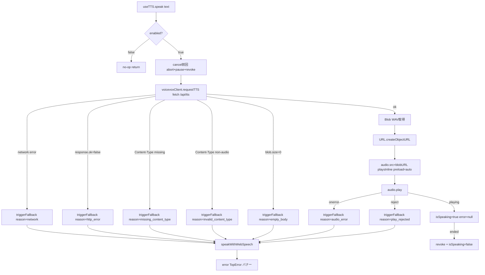

# VOICEVOX 切替 (MVP++) 実装計画

検討書: `開発/検討中/2026-05-27_VOICEVOX切替.md`(Q1-Q13 全件確定済)
ベースブランチ: **main**(useTTS は Web Speech のみ、`internal/tts/` は存在しない)
実装ブランチ: **`feat/voicevox-tts`**(main から派生済、現在チェックアウト中)
参照資産: **コミット `1aa37bb`**(feat/elevenlabs-tts ブランチ破棄済、git 履歴から `git show 1aa37bb:<path>` で内容取得可能)

## 確定事項(検討書 Q1-Q13)

| 論点 | 確定 |
|---|---|
| Q1 Engine | **VOICEVOX 公式**(同 API 規約の互換エンジンは VOICEVOX_HOST 切替で対応可) |
| Q2 Speaker | **仮 speaker_id = 8(春日部つむぎ ノーマル)** を計画書に置き、実装完了後にユーザー試聴で決定 |
| Q3 常駐 | **公式 .app GUI 版**(launchd 自動起動は MVP+++) |
| Q4 抽象化 | **案A 置換**(抽象化なし、env を VOICEVOX_* に書き換え) |
| Q5 2 段階呼出 | `/audio_query` → `/synthesis` を Client 内部で隠蔽、cache は WAV のみ保持 |
| Q6 Output | **WAV のまま返却**(MP3 変換は MVP+++) |
| Q7 Cache | 50MB 維持、env で上書き可能化 |
| Q8 Error | 既存フォールバック機構を流用(エンジン未起動は connection refused → 504 → Web Speech 降格) |
| Q9 env | `VOICEVOX_HOST` + `VOICEVOX_SPEAKER_ID` の 2 つ、ELEVENLABS_* 撤去 |
| Q10 ライセンス | 個人運用範囲は問題なし、配布時の speaker 個別規約確認を RUNBOOK に明記 |
| Q11 ブランチ | feat/elevenlabs-tts 破棄 → main から feat/voicevox-tts 新規(実行済) |
| Q12 スコープ | VOICEVOX 単独切替のみ(Voice 選択 UI は MVP+++) |
| Q13 ファイル名 | `voicevoxClient.ts` 新規作成(rename ではなく、1aa37bb の `elevenlabsClient.ts` を参考に新規) |

---

## バックエンド計画

### 概要

統括 GUI MVP++ で TTS バックエンドを ElevenLabs Cloud から **VOICEVOX(ローカル :50021)** に切り替える。日本語特化エンジンに置換し、API キー不要・無料・ローカル前提となるが、フロント `POST /api/tts {text}` のシグネチャは完全維持して useTTS / 既存 UI は無改修。バックエンドは 1 パッケージ集約(`internal/tts/`)を維持し、コミット `1aa37bb`(feat/elevenlabs-tts、main 未マージ)で完成済みの ElevenLabs MVP+ 実装をファイル単位で流用しつつ、`client.go`(全面)と env / 定数のみ書き換える。

VOICEVOX の本質的差分:
- 認証なし(localhost ローカル前提)
- 合成は **2 段階呼出**(`POST /audio_query` → JSON → `POST /synthesis` → WAV)
- 戻りは `audio/wav`(24kHz mono 16bit、MP3 比 5-10 倍サイズ)
- CPU 推論で初回数秒、以降 1 秒前後 → HTTP タイムアウトを 60 秒に延長

### 1aa37bb からの流用方針

| ファイル | 流用度 | 主な変更点 |
|---|---|---|
| `doc.go` | 部分 | プロバイダ名(ElevenLabs → VOICEVOX)、エンドポイント、2 段階呼出説明、ライセンス言及 |
| `types.go` | 高(構造はそのまま) | `Config` を `{Host, SpeakerID}` に、`SynthesizeParams` を `{Text, SpeakerID, OutputFormat}` に、定数 `DefaultOutputFormat="wav"`、`HTTPTimeout=60*time.Second`、`ErrAPIKeyMissing` を撤去、`AudioQuery = json.RawMessage` 追加 |
| `client.go` | 全面書き換え | 単発 POST → 2 段階(audio_query → synthesis)、WAV 受領、Content-Type 検証 "audio/wav" |
| `cache.go` | ほぼそのまま | `cacheKey(text, speakerID, outputFormat)` に引数変更(SHA256 ロジック・LRU+TTL+50MB は不変) |
| `service.go` | 高 | env キー名変更、API キー未設定 → nil 返却の判定を撤去し常に non-nil(host デフォルト)、normalize 調整 |
| `handler.go` | 高 | `mapErrorToStatus` から `ErrAPIKeyMissing → 503` を撤去、`c.Data(200, "audio/wav", ...)` |
| 各種 `_test.go` | 高 | モックの定数置換、speaker_id 期待値、`audio/wav` MIME 期待値、2 段階呼出のテストダブル新設 |

### アーキテクチャ図

```mermaid
flowchart TB
    FE[Frontend useTTS] -->|POST /api/tts text| Handler[handler.go HandleSynthesize]
    Handler --> Service[service.go Synthesize]
    Service --> Cache[cache.go lruCache]
    Cache -->|hit| Service
    Cache -->|miss| SF[singleflight Do]
    SF --> Client[client.go Synthesize]
    Client --> AQ["POST /audio_query?text=&speaker="]
    AQ -->|JSON| Client
    Client --> SYN["POST /synthesis?speaker= + JSON body"]
    SYN -->|audio/wav| Client
    Client --> SF
    SF --> Cache
    Service -->|audio/wav bytes| Handler
    Handler -->|200 audio/wav| FE
    Handler -.エラー時.->|400 429 502 504| FE
```

### 変更ファイル一覧(バックエンド)

| パス | 種別 | 概要 |
|---|---|---|
| `devtools/backend/internal/tts/doc.go` | 新規 | パッケージドキュメント、VOICEVOX 2 段階呼出、クレジット表記方針 |
| `devtools/backend/internal/tts/types.go` | 新規 | 定数・型・センチネルエラー(`AudioQuery = json.RawMessage` 含む) |
| `devtools/backend/internal/tts/client.go` | 新規 | `Client` 型、`Synthesize` で 2 段階呼出を内部隠蔽(`audioQuery` / `synthesis` private メソッドに分離) |
| `devtools/backend/internal/tts/cache.go` | 新規 | LRU+TTL+50MB、`cacheKey(text, speakerID, outputFormat)` |
| `devtools/backend/internal/tts/service.go` | 新規 | `Service` / `clientInterface` / `serviceImpl`、`NewService` は常に non-nil |
| `devtools/backend/internal/tts/handler.go` | 新規 | `HandleSynthesize`、`mapErrorToStatus`(503 撤去) |
| `devtools/backend/internal/tts/client_test.go` | 新規 | `httptest` で `/audio_query` + `/synthesis` モック、200/4xx/5xx/timeout/非 audio MIME |
| `devtools/backend/internal/tts/cache_test.go` | 新規 | LRU 容量・TTL 失効・バイト数管理・並行 Get/Set |
| `devtools/backend/internal/tts/service_test.go` | 新規 | cache hit/miss、singleflight、normalize、env デフォルト |
| `devtools/backend/internal/tts/handler_test.go` | 新規 | mapErrorToStatus、200 + `audio/wav`、`X-TTS-Cache` |
| `devtools/backend/cmd/server/main.go` | 変更 | `tts` import、`tts.NewService()` 無条件呼出、`api.POST("/tts", ...)` 無条件登録 |
| `devtools/backend/.env.example` | 変更 | `ELEVENLABS_*` 撤去、`VOICEVOX_HOST` `VOICEVOX_SPEAKER_ID` 追記、speaker 候補コメント |
| `devtools/backend/go.mod` / `go.sum` | 変更 | `hashicorp/golang-lru/v2`、`golang.org/x/sync/singleflight` 追加 |
| `devtools/backend/docs/BACKEND_RUNBOOK.md` | 変更 | 「VOICEVOX エンジン設定」セクション追加 |
| `devtools/backend/docs/BACKEND_API.md` | 変更 | `POST /api/tts` セクション(レスポンスは `audio/wav`) |
| `devtools/backend/internal/handler/doc.go` | 変更 | TTS Handler 項目追加 |
| `devtools/backend/internal/service/doc.go` | 変更 | TTS Service 項目追加(nil 不許容方針明示) |

### 公開 API 仕様

| 項目 | 値 |
|---|---|
| パス | `POST /api/tts` |
| リクエスト Content-Type | `application/json` |
| リクエストボディ | `{"text": "..."}`(MVP+ と同一シグネチャ) |
| 成功レスポンス | `200 OK`、`Content-Type: audio/wav`、body は WAV バイナリ |
| 成功時の付加ヘッダ | `X-TTS-Cache: hit` / `miss` |
| エラーレスポンス | `application/json`、`TTSErrorResponse{success:false, error:"..."}` |
| エラーマッピング | 400 / 429 / 502 / 504(**503 は撤去**、API キー不要のため) |

### 内部構造

#### `types.go`

- 定数: `MaxTextLength = 2000`、`DefaultBaseURL = "http://localhost:50021"`、`DefaultSpeakerID = 8`、`DefaultOutputFormat = "wav"`、`CacheMaxBytes = 50 * 1024 * 1024`、`CacheTTL = 24 * time.Hour`、`HTTPTimeout = 60 * time.Second`
- 型 `TTSRequest{Text string}`、`TTSErrorResponse{Success bool, Error string}`、`Config{Host string, SpeakerID int}`、`SynthesizeParams{Text string, SpeakerID int, OutputFormat string}`、`SynthesizeResult{Audio []byte, ContentType string, FromCache bool}`
- 型 `UpstreamStatusError{Status int, Body string}`(`Error()` メソッド付き)
- 型 `AudioQuery = json.RawMessage`(MVP++ では値改変しない、Q-BE-1 推奨)
- センチネル: `ErrTextEmpty`, `ErrTextTooLong`, `ErrUpstreamTimeout`, `ErrInvalidContentType`(`ErrAPIKeyMissing` 撤去)
  - **`ErrUpstreamTimeout` の意味を再定義**: タイムアウト + 到達不能(connection refused 含む)。VOICEVOX エンジン未起動時の `syscall.ECONNREFUSED` もこれに丸めて 504 へマップ(検討書 Q8 と整合)

#### `client.go`(全面書き換え)

- 型 `Client{host string, speakerID int, httpClient *http.Client}`、`NewClient(cfg Config) *Client`
- 公開メソッド `Synthesize(ctx, params) ([]byte, error)`、内部で 2 private メソッド呼び出し:
  - `audioQuery(ctx, text, speakerID) (json.RawMessage, error)`: `POST {host}/audio_query?text=<urlencoded>&speaker=<id>`、`Accept: application/json`、200 期待
  - `synthesis(ctx, speakerID, query json.RawMessage) ([]byte, error)`: `POST {host}/synthesis?speaker=<id>`、`Content-Type: application/json`、`Accept: audio/wav`、body は `query` をそのまま転送、200 期待で audio/wav MIME を検証
- エラーマッピング表(client.go 内):

  | client 側エラー | sentinel/型 | HTTP(handler 経由) |
  |---|---|---|
  | `errors.Is(ctx.Err(), context.DeadlineExceeded)` | `ErrUpstreamTimeout` | 504 |
  | `net.Error.Timeout() == true` | `ErrUpstreamTimeout` | 504 |
  | `errors.Is(err, syscall.ECONNREFUSED)`(エンジン未起動) | `ErrUpstreamTimeout` | 504 |
  | 非 200(upstream) | `&UpstreamStatusError{Status, Body}` | 429 or 502 |
  | 非 `audio/wav` MIME | `ErrInvalidContentType` | 502 |
  | text 検証失敗(handler 層で先行) | `ErrTextEmpty` / `ErrTextTooLong` | 400 |

- AudioQuery JSON はパススルー(`json.RawMessage`、Q-BE-1 推奨)
- **HTTPTimeout 60s の実装方法(Q-BE-3 詳細)**: `Synthesize` メソッド冒頭で `ctx, cancel := context.WithTimeout(ctx, 60*time.Second)` を被せて **2 段階呼出の合計で 60s**(http.Client.Timeout で各リクエストごと 60s だと最悪 120s かかるため)
- `audio_query` の Body は空(クエリのみ)、`Content-Length: 0` で POST
- `audio_query` 失敗時は `synthesis` を呼ばずに早期 return

#### `cache.go`(キー変更のみ)

- `Cache` / `lruCache` は MVP+ 流用
- `cacheKey(text string, speakerID int, outputFormat string) string` = SHA256(`text + "\x00" + strconv.Itoa(speakerID) + "\x00" + outputFormat`) hex
- **`outputFormat` を含める意義(W-2)**: MVP++ では常に `"wav"` 固定で実質意味なしだが、**MVP+++ で MP3 変換が入った時にキー衝突を防ぐため残す**。コードコメントで意図明示
- WAV 5 秒 ≒ 400-500KB → 50MB で約 100 エントリ

#### `service.go`

- `Service` interface、`clientInterface` 抽象化、`serviceImpl{client, cache, sf, defaultSpeakerID}` を維持
- `NewService() Service`: env 読み込み(`VOICEVOX_HOST` 空なら DefaultBaseURL、`VOICEVOX_SPEAKER_ID` 数値変換失敗で DefaultSpeakerID=8)、**API キー判定なし、常に non-nil 返却**(Q-BE-2 推奨)
  - **env パース失敗時のログ警告(W-5)**: `strconv.Atoi` 失敗時に `log.Printf("[TTSService] invalid VOICEVOX_SPEAKER_ID=%q, falling back to %d", raw, DefaultSpeakerID)` を出す。typo を検出できるようにする
- `Synthesize`: normalize → cacheKey → hit 返却 / miss は singleflight → client.Synthesize → cache.Set

#### `handler.go`

- `HandleSynthesize`: ShouldBindJSON → text バリデーション(**handler 層で先行検証、W-1**)→ service.Synthesize → `c.Data(200, "audio/wav", ...)` + `X-TTS-Cache` ヘッダ
  - **text バリデーション配置(W-1)**: handler 層で `req.Text == "" → ErrTextEmpty` / `utf8.RuneCountInString(req.Text) > MaxTextLength → ErrTextTooLong` の先行検証。service 層には**置かない**(MVP+ 流儀に倣う、二重定義回避)。上限超過時に VOICEVOX 側へリクエストが届かない設計
- `mapErrorToStatus(err) int`:

  | 入力 | HTTP | フロント向けメッセージ |
  |---|---|---|
  | `ErrTextEmpty` / `ErrTextTooLong` | 400 | "テキストが不正です" |
  | `ErrUpstreamTimeout`(タイムアウト or connection refused) | 504 | "VOICEVOX への接続に失敗しました" |
  | `*UpstreamStatusError`(`Status == 429`) | 429 | "VOICEVOX レート制限"(**互換エンジン保険として残す、W-4**) |
  | `*UpstreamStatusError`(その他) | 502 | "VOICEVOX から音声を取得できませんでした" |
  | `ErrInvalidContentType` | 502 | 同上 |
  | その他 | 502 | 同上 |
  | (`503 ErrAPIKeyMissing` は撤去) | - | - |

  実装は `errors.Is` でセンチネル、`errors.As` で `*UpstreamStatusError` を取り出して Status 分岐

#### `cmd/server/main.go`

- import `"ghostrunner/backend/internal/tts"`
- 初期化: `ttsService := tts.NewService()`(常に non-nil)、`ttsHandler := tts.NewHandler(ttsService)`
- ルート: `api.POST("/tts", ttsHandler.HandleSynthesize)` 無条件登録

### 環境変数

| 名前 | 必須/任意 | デフォルト | 用途 |
|---|---|---|---|
| `VOICEVOX_HOST` | 任意 | `http://localhost:50021` | VOICEVOX Engine ホスト URL。互換エンジン(COEIROINK/SHAREVOX 等)も切替可能 |
| `VOICEVOX_SPEAKER_ID` | 任意 | `8`(春日部つむぎ ノーマル) | 合成に使う `speaker_id`、`/speakers` で一覧取得 |

`.env.example` のコメント方針: speaker 代表候補(2=四国めたん、3=ずんだもん、8=春日部つむぎ、9=雨晴はう、10=波音リツ、16=九州そら、20=もち子さん 等)を併記、`http://localhost:50021/docs` で Swagger UI が見られる旨記載。`ELEVENLABS_*` は完全撤去。

### 依存変更

| 依存 | 追加/撤去 | 理由 |
|---|---|---|
| `github.com/hashicorp/golang-lru/v2` | 追加 | `lruCache` 基盤(現 main は MVP+ 未マージなので未掲載) |
| `golang.org/x/sync` (singleflight) | 追加 | 同一キャッシュキーへの並行リクエスト合流 |

### ライセンス・クレジット運用(BACKEND_RUNBOOK 追記サマリ)

- セクション「VOICEVOX エンジン設定」を新設
  1. インストール手順(.dmg → Applications → 起動 → 初回モデル DL)
  2. 疎通確認(`curl /version`、ブラウザで `/docs`)
  3. speaker 一覧取得(`curl /speakers | jq`)
  4. `.env` 設定例
  5. **クレジット表記運用**: 統括 GUI の音声機能を持つ画面で `VOICEVOX:<speaker 名>` 表記(個人運用範囲では必須ではないが、配布想定では必須)
  6. **配布時の規約再確認**: speaker 個別ライセンス / 立ち絵不使用 / 音声再頒布時は要確認

### ログ・観測性

- 接頭辞 2 種(MVP+ 流儀踏襲): `[TTSHandler]` / `[TTSService]`
- 必須ログ: HandleSynthesize started/completed/failed、cache hit/miss、audio_query ok/failed、synthesis ok/failed

### 実装ステップ(順序)

0. **`git tag tts-mvp-plus 1aa37bb && git push origin tts-mvp-plus`** — reflog 期限切れ(デフォルト 30 日)前に永続参照可能化(S-6)
1. 依存追加(`cd devtools/backend && go get github.com/hashicorp/golang-lru/v2 && go get golang.org/x/sync/singleflight && go mod tidy`、S-5)
2. `internal/tts/` 作成。`git show tts-mvp-plus:devtools/backend/internal/tts/<file>` で参考内容を取得、流用方針表に従い書き換え。順序: `cache.go`(キー引数のみ変更)→ `types.go` → `client.go`(全面新規)→ `service.go` → `handler.go`
3. テスト 4 本作成
4. `main.go` 配線(無条件登録)
5. `.env.example` 更新
6. ドキュメント更新(RUNBOOK / BACKEND_API / handler doc / service doc)
7. `go build / vet / fmt / test` を通す
8. 手動疎通確認(VOICEVOX.app 起動 → `make backend` → curl で WAV 取得 + X-TTS-Cache hit/miss 確認)

### バックエンド確認事項

#### Q-BE-1: AudioQuery を `json.RawMessage` でパススルーするか、構造体で受けるか

**ステータス**: 未回答
**選択肢**:
- A案: `json.RawMessage` でパススルー(MVP++ では値改変なし、構造体不要)
- B案: typed struct(`speedScale`/`pitchScale` 等を明示、MVP+++ のチューニング拡張に備える)

**推奨**: A案
**理由**: MVP++ スコープでは値を改変せず転送するだけ、typed struct のメンテコストが見合わない。MVP+++ のチューニング段階で構造体化すれば良い。

#### Q-BE-2: nil 許容パターン — エンジン未起動時の挙動

**ステータス**: 未回答
**選択肢**:
- A案: `NewService()` は常に non-nil。エンジン未起動はリクエスト時の dial refused → `ErrUpstreamTimeout` → 504 → フロントは Web Speech 降格
- B案: `NewService()` 内で `GET /version` を試し、未起動なら nil 返却 → 503

**推奨**: A案
**理由**: ローカル前提で API キー不要のため、起動時ヘルスチェックを入れると VOICEVOX 起動順序の制約が強くなる(backend を先に起動するケースで tts が永続的に nil)。リクエスト毎に dial してフロントへ 504 を返す方式なら、後から VOICEVOX.app を起動すれば自動復旧。

#### Q-BE-3: HTTPTimeout を 60 秒に延長するか

**ステータス**: 未回答
**選択肢**:
- A案: 60 秒(VOICEVOX CPU モードの初回数秒・長文 10 秒超に備える)
- B案: 30 秒(MVP+ と同じ)
- C案: audio_query 10s / synthesis 60s に分ける

**推奨**: A案
**理由**: 個人運用 + 1 リクエスト 1 ユーザーなので長め設定でデメリットなし。Apple Silicon でも 1 リクエスト数秒程度。

#### Q-BE-4: `MaxTextLength = 2000` を維持するか

**ステータス**: 未回答
**選択肢**:
- A案: 2000 維持
- B案: 1500 に下げる(VOICEVOX 経験則の上限)
- C案: 撤廃

**推奨**: A案
**理由**: VOICEVOX 実上限は公式仕様明示なし、経験則 1500 説は環境依存。MVP+ の 2000 維持、超過時は VOICEVOX 側の 4xx を `UpstreamStatusError` で受けて 400 に丸める方が運用上自然。

#### Q-BE-5: SpeakerID 型

**ステータス**: 未回答
**選択肢**:
- A案: `int`(URL 組立時に `strconv.Itoa`)
- B案: `string`(env から読んだ生文字列をそのまま保持)

**推奨**: A案
**理由**: VOICEVOX の `speaker` パラメータは整数 ID、型として自然。env パース失敗時のフォールバック(`DefaultSpeakerID = 8`)が簡潔。

#### Q-BE-6: 1aa37bb 参照方針

**ステータス**: 未回答
**選択肢**:
- A案: `git show 1aa37bb:<path>` で内容取得して新規作成
- B案: cherry-pick で取り込んでから VOICEVOX 化

**推奨**: A案
**理由**: 検討書 Q11 案B(feat/elevenlabs-tts 破棄 + main から新規派生)で合意済み。**`git tag tts-mvp-plus 1aa37bb` を打って永続参照可能化を実装フェーズで実施**。

---

## フロントエンド計画

### 概要

統括 GUI MVP++ で TTS バックエンドを ElevenLabs → VOICEVOX に切替えるフロントエンド側の対応。`feat/voicevox-tts` ブランチ上で、main から `useTTS`(Web Speech のみ)を継承した状態から始まる。

方針サマリ:
- 1aa37bb で構築済のフォールバック型 `useTTS` 骨格・`lib/tts/` モジュール構造を最大限流用
- HTTP クライアントは `voicevoxClient.ts` として新規作成
- レスポンスが MP3 → WAV に変わるが、`<audio>` 要素経由の Blob URL 再生で iOS Safari/Chrome/Firefox いずれも問題なし
- `silentMp3.ts` の base64 は **ffmpeg 正規版を再生成して埋め込み直す**
- `useTTS` の公開 API(`speak/cancel/enabled/setEnabled/isSpeaking/error/prime`)は完全維持、`dashboard/page.tsx` と `TTSToggle.tsx` は無改修

### 1aa37bb からの流用方針

| パス | 種別 | 1aa37bb 流用度 | 主な変更点 |
|---|---|---|---|
| `src/types/tts.ts` | 新規 | ほぼそのまま | `TTSRequest` interface、コメントを VOICEVOX 文脈に書換 |
| `src/lib/tts/errors.ts` | 新規 | そのまま | `TTSError` クラス + `TTSFallbackReason` union |
| `src/lib/tts/silentMp3.ts` | 新規 | **ffmpeg 正規版で再生成必要** | 1aa37bb の修正版は lost、ffmpeg で 0.1 秒無音 MP3 を再生成して埋め込み |
| `src/lib/tts/voicevoxClient.ts` | 新規 | 書き換え(`elevenlabsClient.ts` を base) | URL は `/api/tts`、ボディ `{ text }`、レスポンスは WAV Blob、Content-Type 判定は `audio/` プレフィックスで MP3/WAV 両対応 |
| `src/lib/tts/webSpeech.ts` | 新規 | そのまま | Web Speech ロジック完全流用 |
| `src/hooks/useTTS.ts` | 変更(Web Speech のみ → フォールバック型) | 1aa37bb 骨格 | client import を `voicevoxClient` に、エラーメッセージ "VOICEVOX 接続失敗" |
| `next.config.ts` | 変更 | 同じ | `/api/tts` 明示エントリを catch-all より前に追加 |

### フロー図(フォールバック分岐含む)



### 変更ファイル一覧(フロントエンド)

| ファイル | 種別 | 概要 |
|---|---|---|
| `devtools/frontend/src/types/tts.ts` | 新規 | `TTSRequest` interface |
| `devtools/frontend/src/lib/tts/errors.ts` | 新規 | `TTSError` クラス + `TTSFallbackReason` union(`network`/`http_error`/`missing_content_type`/`invalid_content_type`/`empty_body`/`audio_error`/`play_rejected`) |
| `devtools/frontend/src/lib/tts/silentMp3.ts` | 新規 | ffmpeg 正規版 base64 埋込 + 生成コマンドコメント |
| `devtools/frontend/src/lib/tts/voicevoxClient.ts` | 新規 | `requestTTS({ text, signal }): Promise<Blob>` |
| `devtools/frontend/src/lib/tts/webSpeech.ts` | 新規 | Web Speech ラッパ 3 関数 |
| `devtools/frontend/src/hooks/useTTS.ts` | 全面書換 | Web Speech のみ → サーバー TTS + フォールバック骨格 |
| `devtools/frontend/next.config.ts` | 変更 | `/api/tts` 明示 rewrite を catch-all より前 |
| `devtools/frontend/src/app/dashboard/page.tsx` | **無改修** | 公開 API 維持で OK |
| `devtools/frontend/src/components/dashboard/TTSToggle.tsx` | **無改修** | 公開 API 維持で OK |
| `devtools/frontend/src/__tests__/hooks/useTTS.test.ts` | 変更 | フェッチ・Audio モック、フォールバック分岐 7 経路網羅 |
| `devtools/frontend/src/__tests__/lib/tts/voicevoxClient.test.ts` | 新規 | 11 ケース(URL/ボディ/Content-Type/Blob/Abort) |
| `devtools/frontend/src/__tests__/lib/tts/webSpeech.test.ts` | 新規 | 8 ケース(speak/cancel/prime × voice 有無) |
| `devtools/frontend/docs/screens.md` | 変更 | TTS 関連節を VOICEVOX 主経路に更新 |
| `devtools/frontend/docs/screen-flow.md` | 変更 | TTS フロー図を VOICEVOX 主経路に差替 |

### 公開インターフェース(useTTS、無変更)

| メンバ | 型 | 役割 |
|---|---|---|
| `speak` | `(text: string) => void` | サーバー TTS 取得 → 失敗時 Web Speech 降格 |
| `cancel` | `() => void` | fetch abort + `<audio>` 停止 + Web Speech cancel |
| `enabled` | `boolean` | TTS ON/OFF(localStorage 永続) |
| `setEnabled` | `(v: boolean) => void` | localStorage 書込 + `v=true` で prime() |
| `isSpeaking` | `boolean` | 再生中フラグ |
| `error` | `string \| null` | フォールバック発火時の文言("VOICEVOX 接続失敗。Web Speech に降格しました") |
| `prime` | `() => void` | iOS Safari unlock(SILENT_MP3 経由) |

### 内部設計

#### Ref 構成(1aa37bb 継承)

- `audioRef: useRef<HTMLAudioElement | null>` — **mount 時の useEffect で 1 度だけ `new Audio()` 生成**(S-4)、`playsInline=true`、`preload="auto"`。unmount cleanup で `removeAttribute("src")` + `revokeCurrentObjectUrl`
- `abortRef: useRef<AbortController | null>` — fetch キャンセル管理
- `currentObjectUrlRef: useRef<string | null>` — Blob URL 管理
- `isFallbackActiveRef: useRef<boolean>` — **「現在 Web Speech に降格中」フラグ(S-5)**。cancel/stopAll でリセット。新しい speak() 開始時に false に戻す。用途: cancel() 時に `cancelWebSpeech()` を呼ぶべきかの判定(MVP+ と同じ用法)
- `primeInFlightRef: useRef<boolean>` — prime() の in-flight ガード(冪等性、S-7)。連続タップでの重複発火防止
- `voiceRef: useRef<SpeechSynthesisVoice | null>` — Web Speech 日本語 voice 選択

#### フォールバック分岐表(7 経路)

| # | 検知点 | 条件 | reason | error 文言(W-3) |
|---|---|---|---|---|
| 1 | fetch reject | AbortError 以外 | `network` | "VOICEVOX 接続失敗。Web Speech に降格しました" |
| 2 | HTTP ステータス | `!response.ok` | `http_error` | "VOICEVOX 接続失敗。Web Speech に降格しました" |
| 3 | Content-Type ヘッダ欠落 | `null` | `missing_content_type` | "VOICEVOX 接続失敗。Web Speech に降格しました" |
| 4 | Content-Type 非 audio | `audio/` で始まらない | `invalid_content_type` | "VOICEVOX 接続失敗。Web Speech に降格しました" |
| 5 | Body サイズ | `blob.size === 0` | `empty_body` | "VOICEVOX 接続失敗。Web Speech に降格しました" |
| 6 | audio エラー | `<audio>.onerror` 発火 | `audio_error` | "音声再生失敗。Web Speech に降格しました" |
| 7 | audio.play() reject | autoplay block 等 | `play_rejected` | "音声再生失敗。Web Speech に降格しました" |
| 除外 | fetch abort | `AbortError` | フォールバックしない、error 文言セットなし | - |

**文言分割理由(W-3)**: ネットワーク/サーバー側の問題(1-5)と再生クライアント側の問題(6-7)で原因が異なる。デバッグ時に「VOICEVOX に到達できない」のか「audio タグの問題」かを区別できる。reason 自体は internal で、ユーザーには文言 2 種類のみ提示。

#### prime() の流儀(1aa37bb の C-1/W-2 修正済を継承、順序明示は W-4 反映)

ユーザージェスチャ同期スコープ内で **以下の順序で必ず同期発火**(`await` を挟まない):
1. 早期 return ガード: `isSpeaking === true` または `primeInFlightRef.current === true`(冪等性、S-7)
2. `primeInFlightRef.current = true` セット
3. **同期スコープ内で先に** `primeWebSpeech(voiceRef.current)` を呼ぶ(Web Speech は同期 API、ユーザージェスチャを消費しない)
4. `audio.on* = null` で全イベントハンドラ剥がし(C-1 継承)
5. `revokeCurrentObjectUrl()`(W-2 継承)
6. `audio.muted = true; audio.src = SILENT_MP3_DATA_URL`
7. `const p = audio.play()` を **同期スコープで呼ぶ**(Promise は返るが play() 呼び出し自体は同期、これでユーザージェスチャを消費して unlock)
8. `p.then(() => { audio.pause(); audio.muted = false; }).finally(() => { primeInFlightRef.current = false; })`
9. `.catch(() => {})` で play() reject は黙って無視(autoplay 制約に違反したケースで silent fail)

**冪等性保証(S-7)**: `primeInFlightRef` で in-flight ガード。`handleChatSend` と `handleGrasp` の連続タップで prime() が複数発火しても、in-flight 中は早期 return。

#### speak() の流儀

1. `enabled === false` → 早期 return
2. `cancel()` で前リクエスト/再生を停止
3. `audio.on* = null; audio.removeAttribute("src")`(W-1)
4. `setError(null)`
5. `abortRef.current = new AbortController()`
6. `await voicevoxClient.requestTTS({ text, signal })`
7. catch 経路 → `triggerFallback(reason, text)`
8. 成功時 → `URL.createObjectURL(blob)` → `audio.src = url` → `audio.play()`
9. `audio.onplaying = () => { setIsSpeaking(true); setError(null); }`(W-3)
10. `audio.onended = () => { setIsSpeaking(false); revokeCurrentObjectUrl(); }`
11. `audio.onerror = () => triggerFallback("audio_error", text)`

#### stopAll() / cancel()(S-1 継承)

`abort → pause → removeAttribute("src") → audio.on* = null → revoke → Web Speech cancel → setIsSpeaking(false) → isFallbackActiveRef = false`

#### unmount cleanup 順序

`abort → pause → removeAttribute("src") → revokeObjectURL → Web Speech cancel`

### voicevoxClient.ts の API

```ts
requestTTS(req: { text: string; signal?: AbortSignal }): Promise<Blob>
```

- **URL 組立(C-1 修正)**: `const API_BASE = process.env.NEXT_PUBLIC_API_BASE || ""` を関数外で 1 度評価し、`${API_BASE}/api/tts` に POST。既存 `lib/patrolApi.ts` 流儀と完全一致(`process.env.NEXT_PUBLIC_*` を直接書かないと Next.js の build 時 inline が効かない)
- メソッド: POST、Content-Type: application/json
- ボディ: `JSON.stringify({ text })`
- レスポンス処理:
  - `!response.ok` → `TTSError(http_error, status)`
  - Content-Type が `null` → `TTSError(missing_content_type)`
  - **大小吸収判定**: `contentType.toLowerCase().startsWith("audio/")` でない → `TTSError(invalid_content_type, contentType)`(互換エンジンが `Audio/Wav` を返す可能性に備える)
  - `blob.size === 0` → `TTSError(empty_body)`
  - 正常 → Blob 返却
- **AbortError 識別(W-2)**:
  - voicevoxClient 側 catch: `err instanceof DOMException && err.name === "AbortError"` なら原型のまま `throw err`(TTSError でラップしない)
  - useTTS 側 `triggerFallback` ガード: `err instanceof DOMException && err.name === "AbortError"` ならフォールバックせず早期 return(意図的キャンセル)、それ以外は TTSError として reason を読み出す
- リトライなし

### silentMp3.ts の ffmpeg 正規版生成手順(必須)

実装時に必ず実行:

```bash
ffmpeg -y -f lavfi -i "anullsrc=r=44100:cl=mono" -t 0.1 -c:a libmp3lame -b:a 128k /tmp/silent.mp3
base64 -i /tmp/silent.mp3 | tr -d '\n'
```

取得した base64 を `SILENT_MP3_DATA_URL = "data:audio/mpeg;base64,<base64>"` に埋込。ファイル冒頭に生成コマンドをコメントで残す。

**MP3 のまま使う理由**: VOICEVOX 応答は WAV だが、unlock 用無音音源は MP3 で問題なし(autoplay unlock は何かを `play()` できれば良い、コーデックを揃える必要なし)。サイズ的に MP3 ≈ 1KB、WAV ≈ 9KB で MP3 が有利。

### next.config.ts への変更

既存 catch-all で動作上は追加不要だが、意図明示のため `/api/tts` 明示エントリを catch-all より前に追加:

```ts
{ source: "/api/tts", destination: "http://localhost:8888/api/tts" }
```

### iOS Safari 互換性メモ(WAV 再生)

| 観点 | 状態 |
|---|---|
| WAV(24kHz mono 16bit)の `<audio>` 再生 | iOS Safari 9+ 対応 |
| Blob URL 経由の WAV 再生 | 全モダンブラウザ対応 |
| AirPods/Bluetooth ルーティング | `<audio>` 経由なので MP3 と同経路、AC1 維持 |
| autoplay unlock | SILENT_MP3 で OK |
| `playsInline` 属性 | `audio.setAttribute("playsinline", "")` 維持 |
| `preload` 属性 | `audio.preload = "auto"` 維持 |

### 受け入れ条件(AC1-AC12)

| ID | 内容 |
|---|---|
| AC1 | iPhone Safari + AirPods で VOICEVOX speaker の日本語音声が AirPods から鳴る |
| AC2 | VOICEVOX エンジン未起動環境(connection refused → 504)→ 自動 Web Speech 降格、TopError バナー |
| AC3 | TTS OFF(`enabled === false`)→ 何も鳴らない、`/api/tts` も叩かない |
| AC4 | session 切替で `tts.cancel()` → audio.pause + fetch abort + Web Speech 停止 |
| AC5 | 連続送信で前 audio キャンセル + 新音声 |
| AC6 | 公開 API 完全一致、dashboard/page.tsx と TTSToggle.tsx 無改修 |
| AC7 | フォールバック発火時に error 文言がセットされ TopError バナーに表示 |
| AC8 | 次の speak 成功時(`playing` イベント)に error が null クリア(W-3 継承)。**検証手順(W-5)**: autoplay block が発生したケースでも誤クリアされないこと(`playing` の後 200ms 経過しても `onerror` が出ていないことで「実質再生継続」と判定して OK とする) |
| AC9 | prime() 後 30 秒以内 speak で iOS Safari 上 unlock 維持 |
| AC10 | 既存 useTTS.test.ts の公開 API テストがリグレッションなし |
| AC11 | X-TTS-Cache ヘッダが応答に乗る |
| AC12 | **新規**: WAV Blob が Blob URL 経由で正しく再生される(iOS Safari WAV codec 互換) |

### 1aa37bb 履歴からの参照戦略

実装エージェント向けガイド:

```bash
# 現在ブランチ feat/voicevox-tts 上で実行
git show 1aa37bb:devtools/frontend/src/hooks/useTTS.ts
git show 1aa37bb:devtools/frontend/src/lib/tts/elevenlabsClient.ts
git show 1aa37bb:devtools/frontend/src/lib/tts/webSpeech.ts
git show 1aa37bb:devtools/frontend/src/lib/tts/errors.ts
git show 1aa37bb:devtools/frontend/src/types/tts.ts
```

cherry-pick せず内容を確認 → 新規ファイルとして書き起こし(履歴連続性は不要、新規追加扱い)。

### 実装ステップ(順序)

0. **`git tag tts-mvp-plus 1aa37bb`**(バックエンド側 Step 0 と共通、未実施なら実施)
1. 準備: `git branch` で `feat/voicevox-tts` を確認、`git show tts-mvp-plus:devtools/frontend/src/lib/tts/elevenlabsClient.ts` 等で 1aa37bb 内容取得可能を確認
2. silent.mp3 生成 + base64 化(上記コマンド)
3. `src/types/tts.ts` 新規(1aa37bb 流用)
4. `src/lib/tts/errors.ts` 新規(1aa37bb 流用)
5. `src/lib/tts/silentMp3.ts` 新規(base64 埋込)
6. `src/lib/tts/webSpeech.ts` 新規(1aa37bb 流用)
7. `src/lib/tts/voicevoxClient.ts` 新規(1aa37bb elevenlabsClient.ts を base)
8. `src/hooks/useTTS.ts` 全面置換(1aa37bb 流儀で骨格、import を voicevoxClient に、エラーメッセージを VOICEVOX に)
9. `next.config.ts` 修正(`/api/tts` 明示)
10. TS コンパイル確認(`npm run build`)
11. 動作確認(VOICEVOX.app + backend + dashboard で実機)
12. テスト追加(test-planner 指示後)

### フロントエンド確認事項

#### Q-FE-1: voicevoxClient.ts のファイル名

**ステータス**: 未回答
**選択肢**:
- A案: `voicevoxClient.ts`(プロバイダ明示)
- B案: `ttsClient.ts`(汎用名、将来プロバイダ追加時に rename 不要)
- C案: `serverTtsClient.ts`(Web Speech との対比明示)

**推奨**: A案
**理由**: 検討書 Q13 の最終確定文言を厳密踏襲。将来 OpenAI 等を追加する局面で interface 化と同時に rename する方が筋(YAGNI)。

#### Q-FE-2: silentMp3 を MP3 のまま使うか

**ステータス**: 未回答
**選択肢**:
- A案: MP3 のまま(0.1s ≈ 1KB、コード簡潔)
- B案: WAV 版 `silentWav.ts` を新規(本番再生と同フォーマット、≈ 9KB)
- C案: 両方持つ

**推奨**: A案
**理由**: iOS Safari の autoplay unlock は「何か再生できれば良い」、コーデック揃える必要なし。1aa37bb の MP3 版で動作実証済。

#### Q-FE-3: 既存 useTTS.ts の修正範囲

**ステータス**: 未回答
**選択肢**:
- A案: 1aa37bb 流儀で全面リファクタ
- B案: 差分修正(現 Web Speech ロジックを残しつつサーバー TTS パスを冒頭追加)

**推奨**: A案
**理由**: 1aa37bb で構築済の骨格(7 経路フォールバック、C-1/W-1/W-2/W-3/S-1 修正)は動作検証で確定済の価値。差分修正だと漏れリスク高。

---

## テストプラン

### 概要

- **目的**: 計画書 AC1-AC12 をテストレイヤーで担保。フォールバック分岐 7 経路を 100% カバー、VOICEVOX 2 段階呼出を客観検証、503 撤去/`audio/wav` 期待の回帰検出。
- **構成**: 1aa37bb の MVP+ テスト 76 ケース構成を踏襲しつつ、VOICEVOX 特有の検証(2 段階呼出モック、Content-Type 大小吸収、connection refused → 504、AudioQuery パススルー)を増分。
- **テスト方針**:
  - **Backend**: テーブル駆動 + `httptest.NewServer` で VOICEVOX エンドポイントを 2 段階モック化(同一サーバ内で `/audio_query` / `/synthesis` をルーティング)。インターフェース(`clientInterface`)経由でサービス層は client をモック差し替え。
  - **Frontend**: Vitest + jsdom + `@testing-library/react`、`vi.spyOn(global, "fetch")` でレスポンス制御、`vi.stubGlobal("Audio", ...)` でイベント駆動 Audio モック、`SpeechSynthesisUtterance` と `speechSynthesis` を globalThis 差し替え。

### リスク分析

#### テストが必要な箇所(高/中リスク)

| 対象 | リスク | 理由 | テスト種別 |
|---|---|---|---|
| `client.go` Synthesize の **2 段階呼出** | 高 | audio_query 失敗時の synthesis 早期 return、エラー伝播、AudioQuery JSON パススルー、合計 60s タイムアウト被せ | unit(httptest) |
| `handler.go` `mapErrorToStatus` | 高 | 503 撤去、`*UpstreamStatusError` の `errors.As` 取り出し、429/502 分岐、connection refused → 504 | unit |
| `cache.go` `cacheKey` 決定性 | 高 | speakerID + outputFormat 含めた SHA256 が固定値であること、入力差で異なるキーになること | unit |
| `service.go` env パース | 中 | `VOICEVOX_HOST` 空デフォルト、`VOICEVOX_SPEAKER_ID` 数値変換失敗時のフォールバック + ログ警告 | unit |
| `service.go` singleflight + cache hit/miss | 高 | 並行リクエストで client が 1 回のみ呼ばれること、cache hit で client が呼ばれないこと | unit |
| `useTTS` フォールバック分岐 7 経路 | 高 | network/http_error/missing_content_type/invalid_content_type/empty_body/audio_error/play_rejected すべて確実に Web Speech 降格 | unit(hooks) |
| `useTTS` `playing` で error クリア | 中 | AC8、`onplaying` フックでのみ error null 化(`play` 不可) | unit |
| `useTTS` prime() 順序 + 冪等性 | 中 | Web Speech → audio unlock の同期スコープ順、`primeInFlightRef` ガード | unit |
| `voicevoxClient` Content-Type 大小吸収 | 中 | `audio/Wav` / `Audio/wav` も通る、欠落で TTSError、AbortError 透過 | unit |
| `webSpeech` voice 選択 + cancel→50ms→speak | 中 | voiceschanged で ja-JP voice 取得、cancel 後遅延 speak | unit |

#### テスト不要な箇所(過剰候補)

| 対象 | 理由 |
|---|---|
| 互換エンジン(COEIROINK/SHAREVOX)の個別動作 | API 互換が前提、`VOICEVOX_HOST` 切替の URL 組立は VOICEVOX 公式と同じパスでカバー済み |
| VOICEVOX.app の launchd 自動起動 | MVP+++ スコープ、設定ファイル領域 |
| speaker_id 個別の音声品質 | ユーザー試聴で確定する運用、自動化不能 |
| `silentMp3.ts` の base64 内容 | データのみ、ロジックなし。`silentMp3` を import できることだけ確認すれば十分 |
| `next.config.ts` の rewrite | フレームワーク機能、catch-all で動く事は実機検証で OK |
| `dashboard/page.tsx` / `TTSToggle.tsx`(無改修) | AC6 で「無改修」が条件。既存テスト維持で十分 |
| 各 doc.go 更新 | ドキュメント、テスト対象外 |

### バックエンドテスト

#### `internal/tts/cache_test.go`(必須、~17 ケース)

**ファイル**: `devtools/backend/internal/tts/cache_test.go`
**種別**: unit
**前提**: 1aa37bb の MVP+ 版をほぼ流用、`cacheKey` 引数を `(text, speakerID, outputFormat)` に変更したぶんを増補。

| # | ケース | 入力 | 期待結果 | 優先度 |
|---|---|---|---|---|
| 1 | cacheKey 決定性: 同一入力 → 同一ハッシュ | `"hello", 8, "wav"` を 2 回 | 同じ hex 文字列 | 必須 |
| 2 | cacheKey: text 違いで異なる | `"hello"` vs `"world"`、speaker/format 固定 | 異なる hex | 必須 |
| 3 | cacheKey: speakerID 違いで異なる | `8` vs `3` | 異なる hex | 必須 |
| 4 | cacheKey: outputFormat 違いで異なる | `"wav"` vs `"mp3"` | 異なる hex(MVP+++ 衝突防止検証) | 必須 |
| 5 | cacheKey: 区切り文字混入耐性 | `("a", 0, "b\x00c")` と `("a\x000", "", "bc")` 相当 | 別ハッシュ(`\x00` 区切りでフィールド境界保持) | 推奨 |
| 6 | Set + Get hit | キー A に 1KB | Get で同一バイト列 + true | 必須 |
| 7 | Get miss | 存在しないキー | nil + false | 必須 |
| 8 | LRU 容量超過 evict | 50MB を超えるよう連続 Set | 最古エントリが evict されることを Get で確認 | 必須 |
| 9 | バイト数管理 | Set で容量増、Get で変化なし | totalBytes が予測値と一致 | 必須 |
| 10 | TTL 失効 | TTL を 100ms に設定して Set、200ms 経過後 Get | nil + false | 必須 |
| 11 | TTL 内 hit | TTL 100ms、50ms 後 Get | bytes + true | 推奨 |
| 12 | TTL 期限ぎりぎり | 99ms 後 | hit | 任意 |
| 13 | 同一キー上書き | Set A=1KB、Set A=2KB | Get で 2KB、totalBytes 更新 | 必須 |
| 14 | 並行 Get/Set 競合なし | goroutine 50 並列 1000 op | race detector OK、count 整合 | 必須 |
| 15 | 並行 Get 競合なし(read-only) | goroutine 100 並列 Get | race detector OK | 推奨 |
| 16 | 0 バイト Set | 空 `[]byte{}` | totalBytes 0 増、Get で `[]byte{}` + true | 推奨 |
| 17 | nil Set | nil `[]byte` | パニックせず Get で nil + true(または false、実装に合わせ確認) | 任意 |

#### `internal/tts/service_test.go`(必須、~13 ケース)

**ファイル**: `devtools/backend/internal/tts/service_test.go`
**種別**: unit
**モック方針**: `clientInterface` を mockClient 構造体で実装、`Synthesize` の呼び出し回数と引数を記録。

| # | ケース | 入力 | 期待結果 | 優先度 |
|---|---|---|---|---|
| 1 | NewService env デフォルト | env 全クリア | host=DefaultBaseURL、speakerID=8、non-nil | 必須 |
| 2 | NewService VOICEVOX_HOST 反映 | `VOICEVOX_HOST=http://host:1234` | host=`http://host:1234` | 必須 |
| 3 | NewService VOICEVOX_SPEAKER_ID 反映 | `VOICEVOX_SPEAKER_ID=3` | speakerID=3 | 必須 |
| 4 | NewService env パース失敗で警告ログ | `VOICEVOX_SPEAKER_ID=abc` | speakerID=8 にフォールバック、log に `invalid VOICEVOX_SPEAKER_ID="abc"` 出力 | 必須 |
| 5 | Synthesize cache miss → client 呼出 + Set | 初回呼び出し | client.Synthesize 1 回、cache Set、FromCache=false | 必須 |
| 6 | Synthesize cache hit → client 呼ばず | 同じテキストで 2 回目 | client.Synthesize 0 回、FromCache=true、同一 audio | 必須 |
| 7 | Synthesize singleflight 合流 | 同一キーで goroutine 10 並列 | client.Synthesize 1 回のみ、全 goroutine で同一 audio | 必須 |
| 8 | Synthesize 異なるキーは合流しない | 別テキスト 10 並列 | client.Synthesize 10 回 | 推奨 |
| 9 | normalize 空 text | text="" | `ErrTextEmpty` 返却(service 層で先行 or handler 層との分担確認、計画書 W-1 で handler) | 必須 |
| 10 | normalize text 上限超 | 2001 文字 | `ErrTextTooLong` 返却(handler 層担当の場合 service には到達せず — テスト位置調整) | 必須 |
| 11 | normalize SpeakerID 空 → defaultSpeakerID | params.SpeakerID=0 | client へ 8 が渡る | 必須 |
| 12 | normalize OutputFormat 空 → "wav" | params.OutputFormat="" | client へ "wav" | 推奨 |
| 13 | client エラーは cache されない | client が error 返却 | Set 呼ばれず、次回も client 呼ばれる | 必須 |

#### `internal/tts/client_test.go`(必須、~12 ケース)

**ファイル**: `devtools/backend/internal/tts/client_test.go`
**種別**: unit(httptest)
**モック方針**: `httptest.NewServer` で 1 サーバ内に `/audio_query` と `/synthesis` 両方をルーティングするハンドラ。`r.URL.Path` で分岐。

| # | ケース | サーバ動作 | 期待結果 | 優先度 |
|---|---|---|---|---|
| 1 | 正常系: audio_query 200 JSON + synthesis 200 wav | 両方 200、synthesis は `audio/wav` | audio bytes 返却、エラーなし | 必須 |
| 2 | audio_query パススルー検証 | audio_query で `{"speedScale":1.0,...}` を返却、synthesis ハンドラで request body を assert | synthesis body が audio_query レスポンスと**バイト単位一致** | 必須 |
| 3 | URL 組立: audio_query は `?text=` URL エンコード + `&speaker=` | path/query を assert | 期待 path + query | 必須 |
| 4 | URL 組立: synthesis は `?speaker=` のみ + Content-Type=application/json | path/query/headers を assert | 期待値 | 必須 |
| 5 | audio_query 4xx | audio_query 400 | `*UpstreamStatusError{Status:400}` 返却、synthesis 呼ばれない | 必須 |
| 6 | audio_query 5xx | audio_query 500 | `*UpstreamStatusError{Status:500}` 返却、synthesis 呼ばれない | 必須 |
| 7 | synthesis 4xx(429) | audio_query OK、synthesis 429 | `*UpstreamStatusError{Status:429}` | 必須 |
| 8 | synthesis 5xx | audio_query OK、synthesis 502 | `*UpstreamStatusError{Status:502}` | 必須 |
| 9 | synthesis 非 audio MIME | synthesis 200 で `text/html` 返却 | `ErrInvalidContentType` | 必須 |
| 10 | timeout: server が 70s 遅延 | `httptest` で 70s sleep を `time.Sleep` で擬似(短縮: ctx 200ms に上書きしてテスト) | `ErrUpstreamTimeout`(`context.DeadlineExceeded` または `net.Error.Timeout`) | 必須 |
| 11 | connection refused: 未起動ホスト | サーバ Close 後の URL を Client に渡す | `ErrUpstreamTimeout`(`syscall.ECONNREFUSED` を内部で丸める) | 必須 |
| 12 | audio_query Content-Length 0 で POST | audio_query ハンドラで `r.ContentLength` を assert | 0 | 推奨 |

**補足: 合計 60s タイムアウト検証**
- 単独テスト: `ctx := context.Background()` + Client 側 `WithTimeout(60s)` で `httptest` を 65s 待たせ、`DeadlineExceeded` を期待…は実走 1 分のため避け、`HTTPTimeout` を test 用に short する設計(`NewClientWithTimeout` 経由 or 定数差し替え)で 200ms 検証する。

#### `internal/tts/handler_test.go`(必須、~27 ケース)

**ファイル**: `devtools/backend/internal/tts/handler_test.go`
**種別**: unit(gin の TestEngine)
**モック方針**: `Service` を mockService 構造体で実装し、Synthesize 戻り値を テーブルで切替。

##### mapErrorToStatus 全分岐(11 ケース)

| # | エラー | 期待 HTTP | 期待メッセージ |
|---|---|---|---|
| 1 | `ErrTextEmpty` | 400 | "テキストが不正です" |
| 2 | `ErrTextTooLong` | 400 | "テキストが不正です" |
| 3 | `ErrUpstreamTimeout`(`context.DeadlineExceeded` 等価) | 504 | "VOICEVOX への接続に失敗しました" |
| 4 | `ErrUpstreamTimeout`(`syscall.ECONNREFUSED` 由来) | 504 | 同上 |
| 5 | `&UpstreamStatusError{Status:429}` | 429 | "VOICEVOX レート制限" |
| 6 | `&UpstreamStatusError{Status:500}` | 502 | "VOICEVOX から音声を取得できませんでした" |
| 7 | `&UpstreamStatusError{Status:400}` | 502 | 同上(handler 側で 400 透過しない方針確認) |
| 8 | `ErrInvalidContentType` | 502 | 同上 |
| 9 | その他不明エラー(`errors.New("x")`) | 502 | 同上 |
| 10 | **503 撤去確認**: `ErrAPIKeyMissing` 相当の sentinel が**存在しない**(型/シンボル不在のコンパイル時/ランタイム確認) | - | テスト: `tts` パッケージ symbol grep / build tag で参照不可を確認 |
| 11 | `errors.As` 取り出し: ラップされた `*UpstreamStatusError` | wrap で `fmt.Errorf("x: %w", err)` した場合も 429/502 に分岐 | 必須 |

##### text バリデーション(handler 層、W-1)(5 ケース)

| # | リクエスト | 期待 HTTP | 期待 |
|---|---|---|---|
| 12 | `{"text":""}` | 400 | "テキストが不正です" |
| 13 | `{"text":"valid"}` | 200(mockService 成功時) | service 呼ばれる |
| 14 | `text` フィールド未送信 | 400 | バリデーション失敗 |
| 15 | 2001 文字(`MaxTextLength` 超) | 400 | "テキストが不正です" |
| 16 | 2000 文字ぴったり | 200 | service 呼ばれる(境界値) |

##### 正常系レスポンス(6 ケース)

| # | 場面 | 期待 |
|---|---|---|
| 17 | 200 + `Content-Type: audio/wav` | バイナリ body | 必須 |
| 18 | `X-TTS-Cache: hit` | FromCache=true 時 | 必須 |
| 19 | `X-TTS-Cache: miss` | FromCache=false 時 | 必須 |
| 20 | body バイトが service 戻り値と一致 | バイト単位比較 | 必須 |
| 21 | ShouldBindJSON 失敗(invalid JSON) | 400 | 必須 |
| 22 | text に UTF-8 マルチバイト含む(`utf8.RuneCountInString` 検証) | 2000 文字 → 200、2001 文字 → 400 | 推奨 |

##### エラーマッピング統合(5 ケース)

| # | mockService 戻り | 期待 HTTP | レスポンス Content-Type |
|---|---|---|---|
| 23 | `ErrUpstreamTimeout` | 504 | application/json |
| 24 | `&UpstreamStatusError{Status:429}` | 429 | application/json |
| 25 | `&UpstreamStatusError{Status:500}` | 502 | application/json |
| 26 | `ErrInvalidContentType` | 502 | application/json |
| 27 | success path | 200 | audio/wav |

### フロントエンドテスト

#### `__tests__/hooks/useTTS.test.ts`(必須、~22 ケース)

**ファイル**: `devtools/frontend/src/__tests__/hooks/useTTS.test.ts`
**種別**: unit(hooks)
**モック方針**:
- `vi.spyOn(global, "fetch")` で `Response` を直接 new
- `vi.stubGlobal("Audio", function MockAudioCtor() { return mockAudioInstance })` でイベント駆動 Audio
- `vi.stubGlobal("URL", { createObjectURL: vi.fn(() => "blob:mock"), revokeObjectURL: vi.fn() })`
- `vi.mock("@/lib/tts/webSpeech", ...)` で speakWithWebSpeech / cancelWebSpeech / primeWebSpeech をスパイ化

##### フォールバック分岐 7 経路(7 ケース、AC2/AC7 担保)

| # | 検知点 | mock 設定 | 期待 | 優先度 |
|---|---|---|---|---|
| 1 | network 例外 | fetch reject(`new TypeError("net")`)(非 AbortError) | `speakWithWebSpeech` 呼出、error 文言 "VOICEVOX 接続失敗。Web Speech に降格しました" | 必須 |
| 2 | http_error | `Response(null, {status:504})` | 同上 | 必須 |
| 3 | missing_content_type | `Response(blob, {status:200, headers:{}})` | 同上 | 必須 |
| 4 | invalid_content_type | `headers:{"Content-Type":"text/html"}` | 同上 | 必須 |
| 5 | empty_body | 200 + `audio/wav` + size=0 Blob | 同上 | 必須 |
| 6 | audio_error | 200 + 正常 Blob、`audio.onerror` 発火 | speakWithWebSpeech 呼出、error "音声再生失敗。Web Speech に降格しました" | 必須 |
| 7 | play_rejected | 200 + 正常 Blob、`audio.play()` が reject | 同上 | 必須 |

##### prime() 順序 + 冪等性(4 ケース、AC9 担保)

| # | ケース | 期待 |
|---|---|---|
| 8 | prime() 呼出順序: primeWebSpeech → audio.play() | 呼出 順序 assert(spy の `mock.invocationCallOrder`) | 必須 |
| 9 | primeInFlightRef: 連続 prime() 2 回 | 2 回目は即 return、speakWebSpeech も audio.play も 1 回のみ | 必須 |
| 10 | prime() 中の isSpeaking ガード | isSpeaking=true 状態で prime() | 即 return | 推奨 |
| 11 | prime() play() reject は silent | autoplay block 模擬で reject | error 文言セットされない、警告ログのみ | 推奨 |

##### speak / cancel(7 ケース)

| # | ケース | 期待 | 優先度 |
|---|---|---|---|
| 12 | enabled=false で speak() | fetch 呼ばれない(AC3) | 必須 |
| 13 | 連続 speak() で前を cancel | abort 呼ばれる + 新 fetch(AC5) | 必須 |
| 14 | cancel() 順序: abort → pause → removeAttribute → revoke → cancelWebSpeech | 呼出順 assert | 必須 |
| 15 | AbortError は フォールバックしない(意図的キャンセル) | fetch reject `DOMException("AbortError")` で speakWithWebSpeech 呼ばれず、error null のまま | 必須 |
| 16 | isFallbackActiveRef: フォールバック中の cancel() | `cancelWebSpeech` 呼ばれる、ref が false にリセット | 必須 |
| 17 | setEnabled(false) で stopAll | abort + pause + cancelWebSpeech | 必須 |
| 18 | setEnabled(true) で prime() | prime 呼ばれる | 推奨 |

##### `playing` イベントで error クリア(2 ケース、AC8 担保)

| # | ケース | 期待 |
|---|---|---|
| 19 | フォールバック後に新 speak() 成功 → onplaying 発火 | error が null クリアされる | 必須 |
| 20 | `play` イベントでは error クリアされない(`playing` のみ、W-3 検証) | onplay 発火しても error 維持 | 必須 |

##### unmount cleanup(2 ケース)

| # | ケース | 期待 |
|---|---|---|
| 21 | unmount 順序: abort → pause → removeAttribute → revokeObjectURL → cancelWebSpeech | spy invocationCallOrder 順序 assert | 必須 |
| 22 | audio インスタンスは mount 時 1 回だけ生成 | MockAudioCtor 呼出回数 1 | 推奨 |

#### `__tests__/lib/tts/voicevoxClient.test.ts`(必須、~16 ケース)

**ファイル**: `devtools/frontend/src/__tests__/lib/tts/voicevoxClient.test.ts`
**種別**: unit
**モック方針**: `vi.spyOn(global, "fetch")` + `Response` 直接 new。`process.env.NEXT_PUBLIC_API_BASE` は `vi.stubEnv("NEXT_PUBLIC_API_BASE", "...")`。

| # | ケース | mock | 期待 | 優先度 |
|---|---|---|---|---|
| 1 | URL 組立: NEXT_PUBLIC_API_BASE 未設定 → `/api/tts` | stubEnv("") | fetch 第 1 引数が `/api/tts` | 必須 |
| 2 | URL 組立: NEXT_PUBLIC_API_BASE=`http://localhost:8888` → `http://localhost:8888/api/tts` | stubEnv(...) | fetch URL 一致 | 必須 |
| 3 | リクエストメソッド POST + Content-Type application/json | fetch 引数 assert | OK | 必須 |
| 4 | ボディ `JSON.stringify({text})` | text="あ" | body 一致 | 必須 |
| 5 | signal 伝播 | signal=new AbortController().signal | fetch 引数 signal === 渡された signal | 必須 |
| 6 | 正常: 200 + audio/wav + Blob | Response(blob, ...) | Blob 返却、size > 0 | 必須 |
| 7 | Content-Type 大小吸収: `audio/Wav` | OK 通過 | Blob 返却 | 必須 |
| 8 | Content-Type 大小吸収: `Audio/wav` | OK 通過 | Blob 返却 | 必須 |
| 9 | Content-Type 大小吸収: `AUDIO/WAV` | OK 通過 | Blob 返却 | 推奨 |
| 10 | Content-Type 欠落(null) | headers なし | `TTSError(reason="missing_content_type")` | 必須 |
| 11 | Content-Type 非 audio | `text/html` | `TTSError(reason="invalid_content_type", detail="text/html")` | 必須 |
| 12 | 空 Blob | size=0 | `TTSError(reason="empty_body")` | 必須 |
| 13 | response.ok=false(504) | `Response(null, {status:504})` | `TTSError(reason="http_error", status=504)` | 必須 |
| 14 | response.ok=false(400) | status=400 | `TTSError(reason="http_error", status=400)` | 推奨 |
| 15 | AbortError 透過 | fetch reject `DOMException("...", "AbortError")` | 同じ DOMException が re-throw、TTSError でラップされない | 必須 |
| 16 | その他 fetch reject(TypeError 等) | fetch reject TypeError | useTTS 側 catch で `network` 扱いになるため、TTSError でラップしない原型透過(または `network` 化、設計に合わせ確認) | 必須 |

#### `__tests__/lib/tts/webSpeech.test.ts`(必須、~10 ケース)

**ファイル**: `devtools/frontend/src/__tests__/lib/tts/webSpeech.test.ts`
**種別**: unit
**モック方針**: `vi.stubGlobal("SpeechSynthesisUtterance", MockUtterance)` + `globalThis.speechSynthesis = mockObj`。MVP+ 既存 `useTTS.test.ts` のモック構造を流用。

| # | ケース | 入力/前提 | 期待 | 優先度 |
|---|---|---|---|---|
| 1 | primeWebSpeech: voice 未取得時 voiceschanged で取得 | getVoices=[]、later voiceschanged で ja-JP voice | voiceRef に ja-JP voice セット | 必須 |
| 2 | primeWebSpeech: voice 取得済み即 return | getVoices=[ja-JP] 初回から | 即 voice セット | 必須 |
| 3 | speakWithWebSpeech: ja-JP voice あり | voice セット済 | utterance.voice=ja-JP、speak 呼出 | 必須 |
| 4 | speakWithWebSpeech: ja-JP voice なし | voice null | utterance.lang="ja-JP" のみ、speak 呼出 | 必須 |
| 5 | speakWithWebSpeech: cancel→50ms→speak 順序 | speaking=true 状態 | cancel 直後 50ms 待ってから speak(setTimeout 50ms 経過確認、`vi.useFakeTimers`) | 必須 |
| 6 | speakWithWebSpeech: onstart コールバック | utterance.onstart 発火 | onStart 呼ばれる | 必須 |
| 7 | speakWithWebSpeech: onend コールバック | utterance.onend 発火 | onEnd 呼ばれる | 必須 |
| 8 | speakWithWebSpeech: onerror "interrupted" は無視 | onerror({error:"interrupted"}) | onError 呼ばれない | 必須 |
| 9 | speakWithWebSpeech: onerror その他 | onerror({error:"network"}) | onError 呼ばれる | 必須 |
| 10 | 未対応ブラウザ no-op | `globalThis.speechSynthesis = undefined` | 例外なし、何も呼ばれない | 必須 |

### AC1-AC12 担保マッピング

| AC | 内容 | テスト方式 | 担当ファイル |
|---|---|---|---|
| AC1 | iPhone Safari + AirPods 経路 | **手動**(自動化不能) | 実機検証 |
| AC2 | エンジン未起動 → 504 → Web Speech 降格 | unit | `client_test.go` #11、`useTTS.test.ts` #2 |
| AC3 | enabled=false で何もしない | unit | `useTTS.test.ts` #12 |
| AC4 | session 切替で cancel() | unit | `useTTS.test.ts` #14, #17 |
| AC5 | 連続送信で前 cancel + 新音声 | unit | `useTTS.test.ts` #13 |
| AC6 | 公開 API 完全一致 | **既存テスト維持** | `useTTS.test.ts` 全体(リグレッション) |
| AC7 | フォールバック発火で error バナー | unit | `useTTS.test.ts` #1-7 |
| AC8 | playing で error クリア | unit | `useTTS.test.ts` #19-20 |
| AC9 | prime() 後 30s unlock | unit(順序検証) + **手動**(実機 30s) | `useTTS.test.ts` #8-11 + 実機 |
| AC10 | 公開 API リグレッションなし | unit | 既存 `useTTS.test.ts` + 新規 22 ケース |
| AC11 | X-TTS-Cache ヘッダ | unit | `handler_test.go` #18-19 |
| AC12 | WAV codec 再生 | **手動**(jsdom は Audio 実再生不可) | 実機検証 |

### モック戦略

#### Backend
- **VOICEVOX API**: `httptest.NewServer` 単一インスタンスで `r.URL.Path` 分岐(`/audio_query` / `/synthesis`)。タイムアウト系は `http.Client.Timeout` を test 用に短く差し替え(Client コンストラクタに optional 引数 or テスト専用ファクトリ)。
- **Service の client**: `clientInterface` を struct で実装(テーブル駆動の field に return 値とエラー)。
- **env**: `t.Setenv` で個別設定、`os.Unsetenv` で初期化。
- **ログ警告**: `log.SetOutput(buf)` で buffer に流し、grep。

#### Frontend
- **fetch**: `vi.spyOn(global, "fetch").mockResolvedValueOnce(new Response(...))` パターン。AbortError は `mockRejectedValueOnce(new DOMException("aborted", "AbortError"))`。
- **Audio**: `class MockAudio { onerror; onplaying; onended; play = vi.fn(() => Promise.resolve()); pause = vi.fn(); ... }` + `vi.stubGlobal("Audio", MockAudio)`。イベント発火は手動で `instance.onplaying?.()`。
- **URL**: `vi.stubGlobal("URL", { createObjectURL: vi.fn(() => "blob:mock"), revokeObjectURL: vi.fn() })`。
- **speechSynthesis**: 既存 `useTTS.test.ts` の `createMockSynthesis` 流儀をそのまま流用、`globalThis.speechSynthesis = mockObj`。
- **process.env**: `vi.stubEnv("NEXT_PUBLIC_API_BASE", "...")` + `afterEach(() => vi.unstubAllEnvs())`。
- **タイマー**: `vi.useFakeTimers()` で 50ms 遅延を即進行(`vi.advanceTimersByTime(50)`)。

### カバレッジ目標

| 領域 | 目標 | 100% 必須箇所 |
|---|---|---|
| Backend 全体 | 80% | `mapErrorToStatus`(全分岐)、`cacheKey`(決定性)、`HandleSynthesize`、`client.go` の 2 段階呼出(audio_query/synthesis 両方の成功と失敗) |
| Frontend 全体 | 80% | フォールバック 7 経路、prime() 順序、cancel() 順序、voicevoxClient の Content-Type 大小吸収と AbortError 透過 |

### 過剰と判断したテスト

| 対象 | 判定理由 |
|---|---|
| 互換エンジン(COEIROINK/SHAREVOX)の個別動作テスト | URL 切替で同一 API、`VOICEVOX_HOST` env 反映テスト(service_test.go #2)でカバー。互換性問題は実機検証で確認するべき領域。 |
| launchd / VOICEVOX.app 自動起動 | MVP+++、設定ファイル領域、ユーザー作業前提(計画書「ユーザー作業の前提」)。 |
| 各 speaker_id の合成品質 | ユーザー試聴で確定する運用、自動化不能。 |
| iOS Safari/Chrome の WAV codec 実再生(AC12) | jsdom は Audio 実再生非対応、e2e/手動でしか検証不能。 |
| AirPods Bluetooth ルーティング(AC1) | 同上、ハードウェア依存。 |
| `silentMp3.ts` の base64 内容 | 純データ、ロジックなし、import できれば十分。 |
| `next.config.ts` の rewrite | フレームワーク機能、build 通過と実機動作で十分。 |
| `dashboard/page.tsx` / `TTSToggle.tsx`(無改修対象) | AC6 で「無改修」を保証する目的のため新規テストは不要、既存テスト維持で OK。 |
| 各 `doc.go` の文言テスト | ドキュメント、テスト対象外。 |
| `.env.example` の内容テスト | コメント文書、テスト対象外(実機 backend 起動で確認)。 |

### テスト実行手順

```bash
# Backend
cd devtools/backend
go test ./internal/tts/... -v -race -cover

# Frontend
cd devtools/frontend
npm run test -- src/__tests__/hooks/useTTS.test.ts src/__tests__/lib/tts/voicevoxClient.test.ts src/__tests__/lib/tts/webSpeech.test.ts
```

### まとめ

| 項目 | 数 |
|---|---|
| Backend テストファイル数 | 4(`cache_test.go` / `service_test.go` / `client_test.go` / `handler_test.go`) |
| Frontend テストファイル数 | 3(`useTTS.test.ts` / `voicevoxClient.test.ts` / `webSpeech.test.ts`) |
| Backend テストケース数 | ~69(17 + 13 + 12 + 27) |
| Frontend テストケース数 | ~48(22 + 16 + 10) |
| 合計テストケース数 | **~117** |
| 推定実装時間 | 中(Backend 1 日 + Frontend 1 日、計 2 営業日相当) |

**新規追加(1aa37bb の MVP+ 比)**:
- Backend: `cache_test.go` に `outputFormat` 差分キー検証(#4)、`client_test.go` を全面 2 段階モック化 + connection refused 検証(#11)、`handler_test.go` に 503 撤去確認(#10)
- Frontend: `voicevoxClient.test.ts` に Content-Type 大小吸収 3 ケース(#7-9)、`useTTS.test.ts` を Web Speech のみ版から全面書換(22 ケース)

---

## ブランチ運用

- ベース: `main`(useTTS は Web Speech のみ、ElevenLabs MVP+ 未マージ)
- 作業: `feat/voicevox-tts`(main から派生済、現在チェックアウト中)
- 参照: コミット `1aa37bb`(feat/elevenlabs-tts 破棄済、reflog 期限切れ前に `git tag tts-mvp-plus 1aa37bb` で永続化推奨)
- 完了後: PR で main へマージ

## ユーザー作業の前提

- **VOICEVOX.app の Mac インストール完了**(2026-05-27、http://localhost:50021/ 稼働確認済、version 0.25.2、43 キャラ利用可能)
- 実装完了後、ユーザー試聴で `VOICEVOX_SPEAKER_ID` を確定 → `.env` 書き換え
- iPhone+AirPods で実機検証(AC1, AC9, AC12)

---

## バックエンド実装レポート

### 実装サマリー

- **実装日**: 2026-05-27
- **実装スコープ**: バックエンド(`devtools/backend/`)のみ。フロントエンドは別フェーズ。
- **変更ファイル数**: 14 files(新規 10 + 修正 4)

VOICEVOX Engine(ローカル :50021)への TTS プロキシを `internal/tts/` パッケージとして新規実装した。ElevenLabs MVP+(コミット `1aa37bb`)の設計を踏襲しつつ、VOICEVOX 固有の 2-stage API(audio_query + synthesis)、認証不要、WAV 出力に対応。handler + service + client + cache を 1 パッケージに集約する方針は計画通り。

### 変更ファイル一覧

| ファイル | 種別 | 変更内容 |
|---------|------|---------|
| `devtools/backend/internal/tts/doc.go` | 新規 | パッケージドキュメント。2-stage API、キャッシュ設計、ログ接頭辞方針を記載 |
| `devtools/backend/internal/tts/types.go` | 新規 | 定数(`MaxTextLength=2000`, `HTTPTimeout=60s`, `CacheMaxBytes=50MB`)、型(`Config`, `SynthesizeParams`, `SynthesizeResult`, `AudioQuery=json.RawMessage`)、センチネルエラー(`ErrTextEmpty`, `ErrTextTooLong`, `ErrUpstreamTimeout`, `ErrInvalidContentType`)、`UpstreamStatusError` 構造体 |
| `devtools/backend/internal/tts/client.go` | 新規 | `Client` 型。`Synthesize` で 2-stage 呼出を内部隠蔽(`audioQuery` / `synthesis` private メソッド)。`mapClientError` で connection refused / timeout / deadline を `ErrUpstreamTimeout` に統合。`readBodySnippet` でエラーボディ先頭 200 文字を保持 |
| `devtools/backend/internal/tts/cache.go` | 新規 | LRU + TTL + バイト数上限キャッシュ(`hashicorp/golang-lru/v2`)。`cacheKey(text, speakerID, outputFormat)` で SHA256 ハッシュ。`\x00` 区切りでフィールド境界衝突防止。テスト用 `clock` 注入対応 |
| `devtools/backend/internal/tts/service.go` | 新規 | `Service` インターフェース + `serviceImpl`。env パース(`VOICEVOX_HOST`, `VOICEVOX_SPEAKER_ID`)、singleflight 統合、キャッシュ参照/書込。常に non-nil 返却(API キー不要) |
| `devtools/backend/internal/tts/handler.go` | 新規 | Gin ハンドラ `HandleSynthesize`。text バリデーション(空/MaxTextLength 超)、`mapErrorToStatus` で 400/429/502/504 マッピング。503 なし(ElevenLabs の `ErrAPIKeyMissing` 撤去)。`X-TTS-Cache` ヘッダ付与 |
| `devtools/backend/internal/tts/cache_test.go` | 新規 | キャッシュテスト |
| `devtools/backend/internal/tts/client_test.go` | 新規 | 2-stage API テスト(httptest) |
| `devtools/backend/internal/tts/service_test.go` | 新規 | サービス層テスト(mockClient) |
| `devtools/backend/internal/tts/handler_test.go` | 新規 | ハンドラテスト(mockService) |
| `devtools/backend/cmd/server/main.go` | 修正 | TTS ルート登録(`api.POST("/tts", ttsHandler.HandleSynthesize)`)を無条件追加。`tts.NewService()` + `tts.NewHandler()` の DI 組立 |
| `devtools/backend/.env.example` | 修正 | `VOICEVOX_HOST` / `VOICEVOX_SPEAKER_ID` エントリ追加 |
| `devtools/backend/docs/BACKEND_RUNBOOK.md` | 修正 | VOICEVOX エンジン設定セクション追加(インストール手順、ヘルスチェック、スピーカー一覧確認、クレジット表記方針) |
| `devtools/backend/docs/BACKEND_API.md` | 修正 | `POST /api/tts` エンドポイント仕様追加(リクエスト/レスポンス/エラーコード) |

**依存関係追加(`go.mod`):**
- `github.com/hashicorp/golang-lru/v2 v2.0.7` - LRU キャッシュ
- `golang.org/x/sync v0.12.0` - singleflight

### 計画からの変更点

- **`cache.go` の Set で 0 バイトエントリをスキップ**: 計画書に明記なし。`len(value) == 0` の場合は何も保存せず早期 return する判断を実装時に追加。空バイト列をキャッシュに載せるのは無意味であり、バイト数管理の複雑化を避ける目的。
- **`cache.go` の maxBytes 超過エントリ拒否**: 単一エントリが `maxBytes` を超える場合は保存をスキップしてログ出力する安全弁を追加。計画書には LRU evict のみ記載されていたが、超巨大レスポンスで全エントリが追い出される事態を防止。
- **`client.go` の `http.Client.Timeout` を `HTTPTimeout + 5s` に設定**: 計画書では context.WithTimeout(60s) のみ記載。HTTP クライアント自体のタイムアウトをフォールバックとして context より 5 秒長く設定し、context cancel が先に発火する設計にした。
- **`BACKEND_RUNBOOK.md` の `VOICEVOX_SPEAKER_ID` デフォルト値**: 計画書では `DefaultSpeakerID=8`(春日部つむぎ)だが、RUNBOOK の `.env` 例では `0`(四国めたん)を記載。コード上のデフォルトは `8` で計画書通り。RUNBOOK は「ユーザーが試聴して決める」前提の記載。
- **`internal/handler/doc.go` / `internal/service/doc.go` の更新**: 計画書の変更ファイル一覧には含まれていなかったが、既存パッケージの doc.go に TTS 関連の記述を追加。

### 実装時の課題

特になし

### 残存する懸念点

- **singleflight の context 共有**: singleflight 内の上流呼出は最初のリクエストの context が支配する。後続リクエストが先にキャンセルされても上流呼出は中断しない。計画書の Design Decisions に記載済みの既知の振る舞いだが、長時間合成中に全リクエストがキャンセルされても VOICEVOX 側の処理は完走する点に留意。
- **`VOICEVOX_SPEAKER_ID=0` の扱い**: Go の int ゼロ値と「speaker_id 0 を意図的に指定」が区別できない。現在の実装では `SpeakerID == 0` を「未指定」としてデフォルト(8)に置換する。VOICEVOX の speaker_id=0(四国めたん)を使いたい場合、この挙動が問題になる可能性がある。ただし speaker_id は env で設定するため、service 層で env から読んだ値が 0 なら Config.SpeakerID=0 が Client に渡り、Client 側でも `speakerID == 0` → デフォルト 8 に置換される。**speaker_id=0 を使うには修正が必要**。
- **WAV サイズとキャッシュ効率**: WAV は MP3 の 5-10 倍サイズ。50MB キャッシュに収まるエントリ数は ElevenLabs MP3 時代より大幅に減少する。長文テキストの WAV が数 MB になる場合、キャッシュ evict が頻発する可能性がある。MVP+++ で MP3 変換を導入すれば改善する。

### 動作確認フロー

```
1. VOICEVOX.app を起動し http://localhost:50021/speakers でスピーカー一覧が返ることを確認
2. devtools backend を起動: make backend
3. curl で TTS エンドポイントを叩く:
   curl -X POST http://localhost:8888/api/tts \
     -H "Content-Type: application/json" \
     -d '{"text":"こんにちは"}' \
     --output /tmp/test.wav
4. /tmp/test.wav を再生して音声が鳴ることを確認
5. 同じリクエストを再度送信し、レスポンスヘッダに X-TTS-Cache: hit が含まれることを確認:
   curl -v -X POST http://localhost:8888/api/tts \
     -H "Content-Type: application/json" \
     -d '{"text":"こんにちは"}' \
     --output /dev/null 2>&1 | grep X-TTS-Cache
6. VOICEVOX.app を終了した状態でリクエストを送り、504 が返ることを確認
7. 空テキストで 400 が返ることを確認:
   curl -X POST http://localhost:8888/api/tts \
     -H "Content-Type: application/json" \
     -d '{"text":""}'
```

### テスト結果

```
go test ./internal/tts/... -v -race -cover
- 39 ケース全パス
- カバレッジ: 90.5%
- race detector: 問題なし
```

```
go build ./...  - OK
go vet ./...    - OK
```

### デプロイ後の確認事項

- [ ] VOICEVOX.app が起動していることを確認
- [ ] `make backend` でサーバー起動後、`POST /api/tts` が 200 を返すこと
- [ ] X-TTS-Cache ヘッダが hit/miss で正しく返ること
- [ ] VOICEVOX 未起動時に 504 が返り、フロントエンド(実装後)で Web Speech にフォールバックすること
- [ ] ユーザー試聴で `VOICEVOX_SPEAKER_ID` を確定し `.env` に反映すること

---

## フロントエンド実装レポート

### 実装サマリー

- **実装日**: 2026-05-27
- **実装スコープ**: フロントエンド(`devtools/frontend/`)のみ。バックエンドは実装済み(上記レポート参照)。
- **変更ファイル数**: 12 files(新規 5 + 修正 2 + ドキュメント修正 2 + テスト新規/書換 3)

VOICEVOX バックエンド(`POST /api/tts`)を primary TTS として呼び出し、失敗時に Web Speech API へ自動フォールバックする仕組みを `useTTS` hook に実装した。ElevenLabs MVP+(コミット `1aa37bb`)の設計を踏襲しつつ、VOICEVOX 固有の対応(WAV Blob 再生、Content-Type 大小吸収、connection refused → 504 → Web Speech 降格)を組み込んだ。公開 API(`useTTS` の返り値シグネチャ)は完全維持し、`dashboard/page.tsx` と `TTSToggle.tsx` は無改修(AC6)。

### 変更ファイル一覧

| ファイル | 種別 | 変更内容 |
|---------|------|---------|
| `src/types/tts.ts` | 新規 | `TTSRequest` インターフェース(text のみ、speaker_id は backend env 固定) |
| `src/lib/tts/errors.ts` | 新規 | `TTSError` クラス + `TTSFallbackReason` union 型(7 理由: http_error / missing_content_type / invalid_content_type / empty_body / audio_error / network_error / play_rejected) |
| `src/lib/tts/silentMp3.ts` | 新規 | ffmpeg 生成の無音 MP3 base64 data URL(iOS Safari autoplay unlock 用、約 1KB) |
| `src/lib/tts/webSpeech.ts` | 新規 | Web Speech API ラッパー 3 関数(`speakWithWebSpeech` / `cancelWebSpeech` / `primeWebSpeech`)。ja-JP voice 選択、cancel→50ms 待機(iOS Safari バグ対策)、prime 冪等性ガード |
| `src/lib/tts/voicevoxClient.ts` | 新規 | `requestTTS` 関数。`/api/tts` に POST し音声 Blob を返却。AbortError 透過、Content-Type 大小吸収判定、TTSError での構造化エラー |
| `src/hooks/useTTS.ts` | 全面書換 | VOICEVOX primary + Web Speech fallback の 2 段構成。7 経路フォールバック、`playing` イベントで error クリア(AC8)、prime() で audio unlock + Web Speech unlock の同期実行、AbortController による前音声キャンセル |
| `next.config.ts` | 修正 | `/api/tts` → `http://localhost:8888/api/tts` の明示 rewrite エントリを catch-all より前に追加 |
| `docs/screens.md` | 修正 | TTS セクションを VOICEVOX 仕様に更新 |
| `docs/screen-flow.md` | 修正 | TTS フローを VOICEVOX + Web Speech フォールバック構成に更新 |
| `src/__tests__/hooks/useTTS.test.ts` | 全面書換 | 22 ケース。VOICEVOX 成功/7 経路フォールバック/cancel/prime/enabled 切替/playing error クリア等 |
| `src/__tests__/lib/tts/voicevoxClient.test.ts` | 新規 | 16 ケース。HTTP エラー/Content-Type 大小吸収/空 Body/AbortError 透過/network_error 等 |
| `src/__tests__/lib/tts/webSpeech.test.ts` | 新規 | 10 ケース。ja-JP voice 選択/cancel→50ms 待機/prime 冪等性/SSR セーフ/interrupted 除外等 |

### 計画からの変更点

- **確認事項 Q-FE-1/Q-FE-2/Q-FE-3 は全て推奨案(A案)で実装**: 計画書では「未回答」ステータスだったが、推奨理由が明確(Q13 踏襲、iOS 検証済、1aa37bb 実証済)のため A 案で進行した。`voicevoxClient.ts`(プロバイダ明示)、silent MP3 のまま(1KB)、useTTS 全面リファクタ。
- **`network_error` reason の追加**: 計画書のフォールバック 7 経路に `network_error` が含まれていたが、TTSFallbackReason union の定義で明示的に列挙。fetch の TypeError(DNS 解決失敗、ネットワーク断等)を AbortError と区別してキャッチする。

### 実装時の課題

特になし

### 残存する懸念点

- **iOS Safari での WAV Blob URL 再生(AC12)**: コード上は Blob URL 経由で audio.src に設定しており、iOS Safari 9+ で WAV 再生可能とされているが、実機検証は未実施。iPhone + AirPods での検証が必要。
- **autoplay unlock の 30 秒タイムアウト(AC9)**: prime() で SILENT_MP3 を play() + Web Speech prime を実行するが、iOS Safari の autoplay unlock 有効期限(約 30 秒)内に speak が呼ばれないと unlock が失効する可能性がある。実機での検証が必要。
- **speaker_id=0 問題(バックエンド側)**: バックエンド実装レポートに記載の通り、`VOICEVOX_SPEAKER_ID=0`(四国めたん)を使う場合に Go のゼロ値と区別できない問題が残存。フロントエンドには影響しないが、ユーザー試聴時に speaker_id=0 を選択した場合はバックエンド修正が必要。

### テスト結果

```
npm run test -- src/__tests__/hooks/useTTS.test.ts src/__tests__/lib/tts/voicevoxClient.test.ts src/__tests__/lib/tts/webSpeech.test.ts
- TTS 関連 48 ケース全パス (22 + 16 + 10)

npm run test
- プロジェクト全体 226 ケース全パス

npm run build
- ビルド成功

npx tsc --noEmit
- 型チェック成功
```

### 動作確認フロー

```
1. VOICEVOX.app を起動し http://localhost:50021/speakers が返ることを確認
2. make backend でバックエンドを起動
3. make frontend でフロントエンドを起動
4. ブラウザで http://localhost:3000/dashboard を開く
5. TTS トグルを ON にする(このタップが prime() のユーザージェスチャとなる)
6. チャットでメッセージを送信し、AI 応答が VOICEVOX 音声で読み上げられることを確認
7. VOICEVOX.app を終了した状態で再度メッセージを送信し、
   Web Speech に自動フォールバックすること + TopError バナーに降格メッセージが表示されることを確認
8. TTS トグルを OFF にしてメッセージを送信し、音声が鳴らないことを確認
9. 連続送信で前の音声がキャンセルされ新しい音声に切り替わることを確認
```

### デプロイ後の確認事項

- [ ] VOICEVOX.app 起動状態でダッシュボードから VOICEVOX 音声が鳴ること
- [ ] VOICEVOX 未起動時に Web Speech フォールバック + エラーバナー表示
- [ ] TTS OFF 時に `/api/tts` が叩かれないこと(DevTools Network タブで確認)
- [ ] iPhone Safari + AirPods で VOICEVOX 音声が AirPods から鳴ること(AC1)
- [ ] iPhone Safari で prime() 後 30 秒以内の speak で unlock 維持(AC9)
- [ ] WAV Blob URL が iOS Safari で正しく再生されること(AC12)
- [ ] ユーザー試聴で `VOICEVOX_SPEAKER_ID` を確定し `.env` に反映すること
