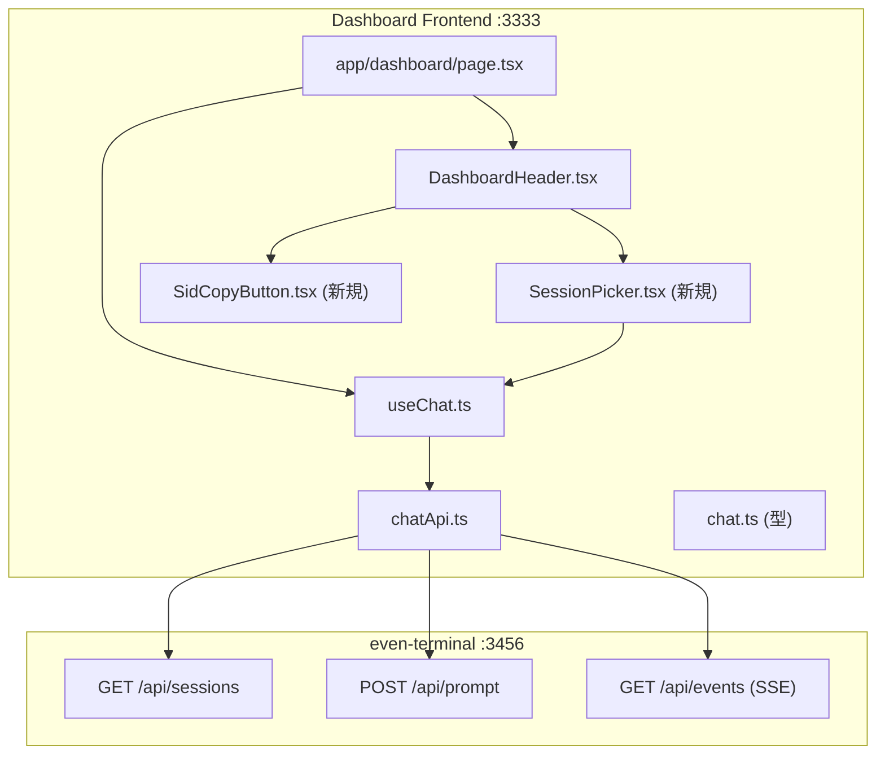

# even-terminal 統合強化 実装計画

## 概要

even-terminal 検討書（`開発/検討中/2026-05-26_even-terminalの将来位置づけ.md`）の確定方針に基づき、dashboard フロントエンドに session 切替 UI と SID 共有機能を追加する。併せて 3 モダリティ使い分けガイドと Even G2 音声回答ブリッジのドキュメントを整備する。

### 実装対象

| # | 内容 | 種別 | 工数感 |
|---|------|------|:---:|
| (b) | session 切替 UI + 自動継承（案 γ） | Next.js 実装 | 中 |
| (c) | SID クリップボードコピー（案 ζ） | Next.js 実装 | 小 |
| (a) | 3 モダリティ使い分けガイド | ドキュメント | 小 |
| (d) | Even G2 音声回答ブリッジ手順 | ドキュメント | 小 |

### 確認事項の事前解決（実装読みで回答済み）

| 確認事項 | 回答 | 根拠 |
|----------|------|------|
| `GET /api/sessions` のレスポンスフィールド | `id`, `title`（customTitle/summary/firstPrompt から最大 64 文字）, `timestamp`（lastModified の ISO 文字列）, `cwd`, `provider`, `status` | even-terminal `dist/claude/provider.js` line 149-158 |
| 新規 session 開始方法 | `POST /api/prompt` を `sessionId` なし（空文字 or 省略）で送れば自動生成 | even-terminal `dist/claude/provider.js` line 102-127: sessionId なし → `makeSession(undefined)` → SDK が新 SID を発行 |
| 「新規 session」ボタンを MVP に含めるか | **含める**（API サポート確認済み） | 上記の通り `POST /api/prompt` で対応可能 |

---

## フロントエンド計画

### 修正範囲の全体像



### 変更ファイル一覧

| # | ファイル | 変更内容 | 新規/修正 |
|---|---------|---------|:---:|
| 1 | `frontend/src/types/chat.ts` | `ChatSession` 型に `title`, `timestamp`, `status` フィールドを追加 | 修正 |
| 2 | `frontend/src/hooks/useChat.ts` | `sessions` state、`switchSession`、`startNewSession`、`fetchSessions` メソッドを追加。`onSessionSwitch` コールバック props を追加 | 修正 |
| 3 | `frontend/src/components/dashboard/SessionPicker.tsx` | session 一覧ドロップダウン + 「新規 session」ボタン | 新規 |
| 4 | `frontend/src/components/dashboard/SidCopyButton.tsx` | SID クリップボードコピーボタン（フィードバック付き） | 新規 |
| 5 | `frontend/src/components/dashboard/DashboardHeader.tsx` | SessionPicker と SidCopyButton をヘッダに配置 | 修正 |
| 6 | `frontend/src/app/dashboard/page.tsx` | useChat に `onSessionSwitch: tts.cancel` を渡す配線 | 修正 |
| 7 | `frontend/docs/screens.md` | SessionPicker / SidCopyButton の画面仕様を追記 | 修正 |
| 8 | `frontend/docs/scenarios/dashboard.md` | session 切替・SID コピーシナリオを追記 | 修正 |

### 実装ステップ（依存順）

#### Step 1: ChatSession 型の拡張

**対象**: `frontend/src/types/chat.ts`

**修正するもの**:
- `ChatSession` インターフェースに `title?: string`、`timestamp?: string`、`status?: string | null` を追加
- even-terminal API レスポンス（`id`, `title`, `timestamp`, `cwd`, `provider`, `status`）と 1:1 対応させる

#### Step 2: useChat フックの拡張

**対象**: `frontend/src/hooks/useChat.ts`

**追加するもの**:
- State: `sessions` (`ChatSession[]`)
- メソッド `switchSession(sid: string)`: (1) 既存 SSE を close → (2) `responseText` / `accumulatedTextRef` / `error` / `status` をリセット → (3) `sessionIdRef` と localStorage を更新 → (4) 新 session で `connectSSE(sid)` 再接続 → (5) `onSessionSwitch` コールバック呼び出し（TTS cancel 用）
- メソッド `startNewSession()`: (1) 既存 SSE を close → (2) `responseText` / `accumulatedTextRef` をリセット → (3) `sessionIdRef` と localStorage をクリア → (4) `isNewSession` フラグ（useRef）を true にセット。**次回 `send` 時に sessionId なしで POST** し、even-terminal レスポンス（`{ sessionId }` を返す）から新 SID を取得 → `sessionIdRef` / localStorage を更新 → `connectSSE(newSid)` で SSE 接続開始 → `isNewSession` フラグを false に戻す
- メソッド `fetchSessions()`: `listSessions` を呼んで `sessions` state を更新
- Props: `onSessionSwitch?: () => void`

**修正するもの**:
- `send` メソッド: `sessionIdRef.current` が null（= `startNewSession` 直後）の場合、sessionId を省略して `sendPrompt` を呼ぶ分岐を追加。even-terminal の `POST /api/prompt` レスポンス body `{ sessionId, provider }` から新 SID を取得し、`sessionIdRef.current` / localStorage を更新した後に `connectSSE(newSid)` を呼ぶ
- `fetchAndSelectSession` の中で `sessions` state も更新
- `UseChatReturn` に `sessions`, `switchSession`, `startNewSession`, `fetchSessions` を追加
- `UseChatProps` に `onSessionSwitch` を追加

**設計判断**:
- `switchSession` と既存 `refresh` の役割分担: `refresh` は「直近 session を自動選択」、`switchSession` は「指定 session に切替」
- session 一覧の取得タイミング: 初期化時 + `fetchSessions` 明示呼び出し時
- `fetchSessions` 実行中のローディング表示: MVP では古いリストが一瞬表示されることを許容（スピナー等は次回以降）
- `startNewSession` → `send` → 新 SID 取得のフロー: even-terminal の `POST /api/prompt` レスポンス body（`{ sessionId, provider }`）を正のソースとする。SSE イベントの `sessionId` フィールドでも取れるが、レスポンス body の方が確実かつタイミングが早い

#### Step 3: SessionPicker コンポーネント（新規）

**対象**: `frontend/src/components/dashboard/SessionPicker.tsx` (新規)

**追加するもの**:
- Client Component（`"use client"`）
- Props: `sessions: ChatSession[]`, `currentSessionId: string | null`, `onSwitch: (sid: string) => void`, `onNewSession: () => void`, `onOpen?: () => void`, `disabled?: boolean`
- ドロップダウン: session 一覧を `title`（なければ `id` の先頭 8 文字） + 相対時刻（`timestamp` から算出）で表示
- current session をハイライト表示
- 「新規 session」ボタン: `onNewSession` を呼ぶ
- ドロップダウン展開時（`onOpen`）に呼び出し元で `fetchSessions` を呼んで最新化

**注意点**:
- session 一覧が空の場合は「セッションなし」表示
- モバイル画面でのタッチ操作を考慮（ドロップダウンは `<select>` ベースではなく Tailwind ドロップダウンメニュー）

#### Step 4: SidCopyButton コンポーネント（新規）

**対象**: `frontend/src/components/dashboard/SidCopyButton.tsx` (新規)

**追加するもの**:
- Client Component（`"use client"`）
- Props: `sessionId: string | null`
- 内部 state: `copied` (boolean)
- `navigator.clipboard.writeText` でコピー、成功時に 2 秒間ラベル変化（「SID」→「Copied」）
- `sessionId` が null の場合はボタンを disabled に

**注意点**:
- `navigator.clipboard` は secure context（HTTPS）必須。Tailscale 経由の HTTP アクセス時は `document.execCommand('copy')` にフォールバック。両方使えない場合は SID を `<input>` にテキスト表示して手動コピーを促す（「コピーできませんでした。SID: xxxx」）

#### Step 5: DashboardHeader への統合

**対象**: `frontend/src/components/dashboard/DashboardHeader.tsx`

**修正するもの**:
- Props に session 関連を追加: `sessions`, `currentSessionId`, `onSessionSwitch`, `onNewSession`, `onSessionPickerOpen`, `sessionSwitchDisabled`
- ヘッダ左側（タイトル横）に SessionPicker を配置
- SessionPicker の右隣に SidCopyButton を配置

**注意点**:
- 既存のトグルボタン群（polling / TTS / Grasp）は右側に維持
- モバイル画面での折り返しは既存の `flex-wrap` パターンを踏襲

#### Step 6: DashboardPage の配線

**対象**: `frontend/src/app/dashboard/page.tsx`

**修正するもの**:
- `useChat` に `onSessionSwitch: tts.cancel` を渡す
- `DashboardHeader` に `chat.sessions`, `chat.sessionId`, `chat.switchSession`, `chat.startNewSession`, `chat.fetchSessions` を渡す

### 設計判断

| 判断 | 選択した方法 | 理由 |
|-----|------------|------|
| TTS リセットの伝達 | コールバック props (`onSessionSwitch`) | useChat と useTTS は兄弟フックで直接参照不可。コールバックが最もシンプル |
| SID コピーの UI | ボタン + 短時間ラベル変化 | toast ライブラリ不要、既存 Tailwind パターンで実現可能 |
| session 一覧の取得タイミング | 初期化時 + ドロップダウン展開時 | 常に最新を表示しつつ無駄な通信を避ける |
| 新規 session の開始方法 | `startNewSession` で state クリア → 次の `send` 時に sessionId なしで POST | even-terminal が sessionId 省略時に新 SID を自動発行する仕様を利用 |
| clipboard フォールバック | `document.execCommand('copy')` | Tailscale 経由 HTTP アクセスで `navigator.clipboard` が使えない場合の対応 |
| 書き込み排他 | 運用ルール（コードロック不要） | Q2 の bulk-coding パターンと同型。同時 attach で parent uuid chain が分岐するリスクを運用で回避 |

---

## ドキュメント計画

### (a) 3 モダリティ使い分けガイド

**出力先**: `devtools/frontend/docs/modality-guide.md`（新規）

**内容**:
- 3 経路（CLI / Even G2 + even-terminal / dashboard）の対比表
- 「一覧性 / ハンズフリー」の 2 軸ルール
- 場面マトリクス（検討書で確定済みの 10 行の表）
- 各経路の技術構成（入力デバイス・出力デバイス・サーバ構成）

### (c-doc) VSCode からの SID resume 手順

**出力先**: `devtools/frontend/docs/modality-guide.md` 内の「VSCode で対話を引き継ぐ」セクション

**内容**:
- dashboard で SID コピーボタンを押す
- VSCode で統合ターミナルを開く（`cmd+\``）
- `claude --resume <paste>` で even-terminal と同じ session を再開
- 書き込み排他の運用ルール（同時に書かない）

### (d) Even G2 確認事項音声回答ブリッジ

**出力先**: `devtools/frontend/docs/modality-guide.md` 内の「Even G2 から確認事項に回答する」セクション

**内容**:
- 音声で「A 案で」「B 案で」→ even-terminal が解釈 → 既存 API を呼ぶ流れの説明
- TTS 排他は運用で十分（dashboard 側の TTS ON/OFF トグルで調整）
- 把握系（「状況は？」）は Even G2 から OK、一括操作系（「一括codingして」）は Even G2 から発火しない運用

### ドキュメント更新

| ファイル | 更新内容 |
|---------|---------|
| `frontend/docs/modality-guide.md` | 新規: 使い分けガイド + VSCode 手順 + Even G2 手順 |
| `frontend/docs/screens.md` | SessionPicker / SidCopyButton の画面仕様 |
| `frontend/docs/scenarios/dashboard.md` | session 切替・SID コピーシナリオ |

---

## MVP 外（次回以降）

- session 検索/フィルタ（session 数が増えた場合）
- session 削除（even-terminal 側 API 依存）
- Even G2 側の音声インテント実装（even-terminal npm パッケージ側の対応。Ghostrunner 側ではコントロール外）
- VSCode コマンドパレットから SID 指定 resume（Anthropic への機能要望 or 独自ラッパー）
- 同時 attach のコードレベル排他（現時点では運用ルールで対応）

---

## 確認事項

なし（全項目を実装読みで事前解決済み）

---

## テストプラン

### 対象計画

`開発/実装/実装待ち/2026-05-27_even-terminal統合強化_plan.md`

### リスク分析

#### テストが必要な箇所

| 対象 | リスク | 理由 | テスト種別 |
|------|-------|------|----------|
| `useChat` - `switchSession` | 高 | SSE close -> localStorage 更新 -> 再接続 -> コールバック呼び出しの 4 ステップ。順序ミスで SSE リーク or TTS キャンセル漏れ | unit |
| `useChat` - `startNewSession` | 高 | sessionIdRef クリア -> 次回 send で sessionId なし POST。state リセット漏れで古い session に送信するリスク | unit |
| `useChat` - `fetchSessions` | 中 | sessions state 更新。既存 `fetchAndSelectSession` との役割分担が明確か | unit |
| `SessionPicker` | 中 | ドロップダウン開閉、session 選択、新規 session ボタン。UI ロジックが複数あり | unit |
| `SidCopyButton` | 中 | clipboard コピー + フォールバック + 2 秒ラベル変化。タイマーとブラウザ API の組み合わせ | unit |

#### テスト不要な箇所

| 対象 | 理由 |
|------|------|
| `ChatSession` 型拡張 (Step 1) | 型定義のみ。TypeScript コンパイラが保証 |
| `DashboardHeader` 統合 (Step 5) | SessionPicker / SidCopyButton を配置するだけの単純な props 受け渡し。個々のコンポーネントテストでカバー |
| `DashboardPage` 配線 (Step 6) | `onSessionSwitch: tts.cancel` を渡すだけの配線。useChat のコールバックテストでカバー |
| ドキュメント (a), (c-doc), (d) | ドキュメントのみ |

### テストケース

#### 1. useChat フック拡張

**ファイル**: `devtools/frontend/src/__tests__/hooks/useChat.test.ts`（既存ファイルに追加）
**種別**: unit
**パターン**: 既存テストと同じ MockEventSource + vi.mock パターンを踏襲

| # | ケース | 入力 | 期待結果 | 優先度 |
|---|-------|------|---------|-------|
| 1 | switchSession で SSE が切り替わる | `switchSession("session-2")` | 旧 EventSource.close() 呼び出し、新 EventSource 生成、sessionId が "session-2" に更新、localStorage 更新 | 必須 |
| 2 | switchSession で onSessionSwitch コールバックが呼ばれる | `switchSession("session-2")` (onSessionSwitch 設定済み) | onSessionSwitch が 1 回呼ばれる | 必須 |
| 3 | startNewSession で sessionId がクリアされる | `startNewSession()` | sessionId が null、localStorage から削除 | 必須 |
| 4 | startNewSession 後の send で sessionId なしの POST | `startNewSession()` -> `send("hello")` | sendPrompt が sessionId なし（空文字 or 未設定）で呼ばれる、もしくはエラー「セッションが選択されていません」 | 必須 |
| 5 | fetchSessions で sessions state が更新される | `fetchSessions()` (listSessions が 3 件返す) | sessions.length === 3 | 必須 |
| 6 | 初期化時に sessions state が設定される | マウント時 (listSessions が 2 件返す) | sessions.length === 2 | 推奨 |

**実装メモ**:
- 既存テストの `beforeEach` / `MockEventSource` / `mockListSessions` をそのまま利用
- `startNewSession` 後の `send` の挙動は実装次第（sessionId クリア後に send でエラーになるか、sessionId なしで POST するか）。計画書の「次回 send 時に sessionId なしで POST」に従い、sendPrompt の呼び出し引数を検証

#### 2. SessionPicker コンポーネント

**ファイル**: `devtools/frontend/src/__tests__/components/dashboard/SessionPicker.test.tsx`（新規）
**種別**: unit
**パターン**: 既存 `DashboardAnswerForm.test.tsx` と同じ render + userEvent パターン

| # | ケース | 入力 | 期待結果 | 優先度 |
|---|-------|------|---------|-------|
| 1 | session 一覧が表示される | sessions: 2 件、ドロップダウンを開く | 各 session の title（なければ id 先頭 8 文字）が表示 | 必須 |
| 2 | session 選択で onSwitch が呼ばれる | session 項目をクリック | `onSwitch(sid)` が正しい sid で呼ばれる | 必須 |
| 3 | 新規 session ボタンで onNewSession が呼ばれる | 「新規 session」ボタンをクリック | `onNewSession()` が 1 回呼ばれる | 必須 |
| 4 | current session がハイライトされる | currentSessionId を指定 | 該当項目に視覚的区別（CSS クラス or aria-selected） | 推奨 |
| 5 | sessions が空の場合 | sessions: [] | 「セッションなし」表示 | 必須 |
| 6 | ドロップダウン展開時に onOpen が呼ばれる | ドロップダウンを開く | `onOpen()` が呼ばれる | 推奨 |
| 7 | disabled 時に操作不可 | disabled: true | ボタンがクリック不可 | 推奨 |

#### 3. SidCopyButton コンポーネント

**ファイル**: `devtools/frontend/src/__tests__/components/dashboard/SidCopyButton.test.tsx`（新規）
**種別**: unit

| # | ケース | 入力 | 期待結果 | 優先度 |
|---|-------|------|---------|-------|
| 1 | クリックで clipboard にコピーされる | sessionId: "abc-123"、ボタンクリック | `navigator.clipboard.writeText("abc-123")` が呼ばれる | 必須 |
| 2 | コピー成功後にラベルが「Copied」に変化 | ボタンクリック（clipboard 成功） | ラベルが「Copied」に変化 | 必須 |
| 3 | 2 秒後にラベルが元に戻る | ボタンクリック後 2 秒経過 | ラベルが「SID」（元の表示）に戻る | 必須 |
| 4 | sessionId が null の場合は disabled | sessionId: null | ボタンが disabled 属性を持つ | 必須 |
| 5 | clipboard API 失敗時のフォールバック | navigator.clipboard.writeText が reject | `document.execCommand('copy')` にフォールバック（エラーにならない） | 推奨 |

**実装メモ**:
- `navigator.clipboard` は `vi.stubGlobal` または `Object.defineProperty` でモック
- タイマーテストは `vi.useFakeTimers()` + `vi.advanceTimersByTime(2000)` で検証

### テスト実行手順

```bash
cd /Users/user/Ghostrunner/devtools/frontend
npm test -- --run src/__tests__/hooks/useChat.test.ts
npm test -- --run src/__tests__/components/dashboard/SessionPicker.test.tsx
npm test -- --run src/__tests__/components/dashboard/SidCopyButton.test.tsx

# 全テスト
npm test
```

### まとめ

| 項目 | 数 |
|------|---|
| テストファイル数 | 3（既存 1 + 新規 2） |
| テストケース数 | 18（useChat: 6、SessionPicker: 7、SidCopyButton: 5） |
| 必須ケース数 | 12 |
| 推奨ケース数 | 6 |
| 推定実装時間 | 中（1-2 時間） |

**テストしない判断の根拠:**
- `ChatSession` 型拡張: フィールド追加のみ。型安全は TypeScript コンパイラが保証
- `DashboardHeader` 統合: props を子コンポーネントに渡すだけの薄いラッパー。子のテストでカバー
- `DashboardPage` 配線: `onSessionSwitch: tts.cancel` は 1 行の配線。useChat の onSessionSwitch コールバックテスト（ケース #2）で間接的にカバー
- E2E テスト: MVP 段階で ROI が低い。unit テストで主要ロジックをカバー
