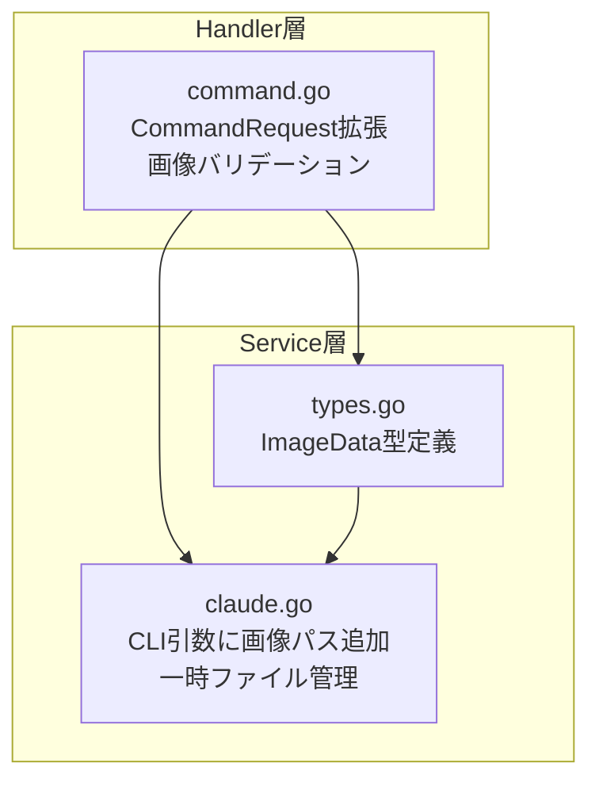
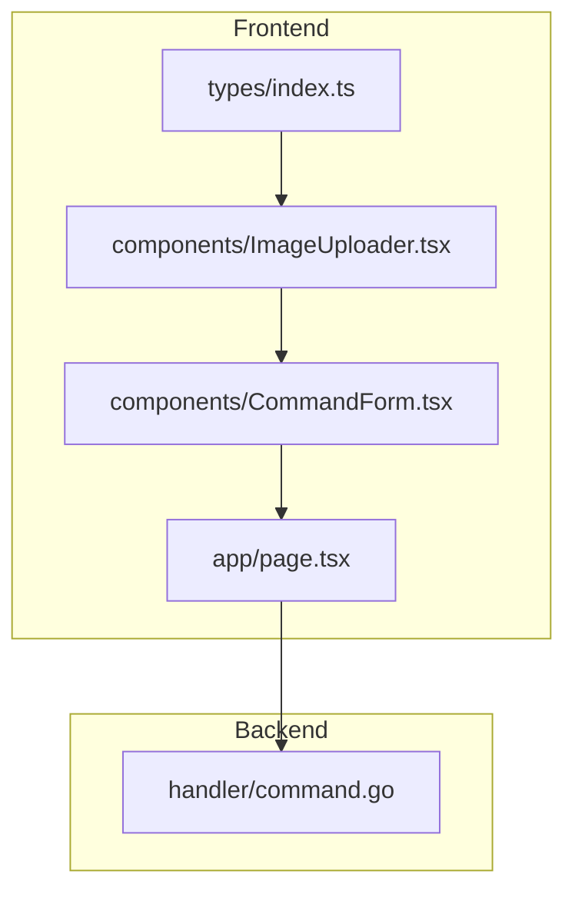

# 画像と文字の組み合わせ指示機能 実装計画

**作成日**: 2026-01-26
**ステータス**: 実装待ち

## 仕様サマリー

全コマンド（plan, research, discuss, fullstack, go, nextjs）で画像と文字を組み合わせた指示を可能にする。

- **入力形式**: テキスト + 画像（Base64エンコード）
- **画像枚数**: 最大5枚
- **画像制約**: 各5MB以下、JPEG/PNG/GIF/WebP対応
- **実装アプローチ**: Base64 + 構造化引数（MVP）

---

## バックエンド計画（Go）

### 修正範囲の全体像



### 変更ファイル一覧

| ファイル | 変更内容 | 影響度 |
|---------|---------|-------|
| `backend/internal/service/types.go` | ImageData 型、定数の追加 | 低 |
| `backend/internal/handler/command.go` | ImageData 型定義、CommandRequest に Images フィールド追加、バリデーション関数追加 | 中 |
| `backend/internal/service/claude.go` | ClaudeService インターフェースとクライアント実装の更新、一時ファイル保存処理追加 | 高 |

### 実装ステップ

#### Step 1: 定数とImageData 型定義（types.go）

**対象**: `/Users/user/Ghostrunner/backend/internal/service/types.go`

1. 画像関連の定数を追加:
```go
const (
    MaxImageCount = 5
    MaxImageSize  = 5 * 1024 * 1024 // 5MB
)

var AllowedImageMimeTypes = []string{
    "image/jpeg",
    "image/png",
    "image/gif",
    "image/webp",
}
```

2. ImageData 型を追加:
```go
type ImageData struct {
    Name     string `json:"name"`
    Data     string `json:"data"`     // Base64エンコードされた画像データ
    MimeType string `json:"mimeType"` // "image/jpeg", "image/png" など
}
```

**注意点**:
- JSON タグは仕様書に合わせる（name, data, mimeType）
- CommandResult の後に配置

#### Step 2: Handler層の型定義とバリデーション（command.go）

**対象**: `/Users/user/Ghostrunner/backend/internal/handler/command.go`

**変更内容**:

1. Handler層の ImageData 型を定義（service層との結合を避けるため）:
```go
// ImageData はクライアントから受け取る画像データ
type ImageData struct {
    Name     string `json:"name"`
    Data     string `json:"data"`
    MimeType string `json:"mimeType"`
}
```

2. CommandRequest に Images フィールド追加:
```go
type CommandRequest struct {
    Project string      `json:"project"`
    Command string      `json:"command"`
    Args    string      `json:"args"`
    Images  []ImageData `json:"images,omitempty"` // 新規追加
}
```

3. validateImages 関数を追加（service.go の定数を使用）:
```go
func validateImages(images []ImageData) error {
    if len(images) > service.MaxImageCount {
        return fmt.Errorf("最大%d枚まで", service.MaxImageCount)
    }

    for _, img := range images {
        // Base64デコード
        decoded, err := base64.StdEncoding.DecodeString(img.Data)
        if err != nil {
            return fmt.Errorf("無効なBase64: %w", err)
        }

        // サイズチェック
        if len(decoded) > service.MaxImageSize {
            return fmt.Errorf("画像サイズは5MB以下: %s", img.Name)
        }

        // MIMEタイプチェック
        valid := false
        for _, t := range service.AllowedImageMimeTypes {
            if img.MimeType == t {
                valid = true
                break
            }
        }
        if !valid {
            return fmt.Errorf("非対応の形式: %s", img.MimeType)
        }
    }

    return nil
}
```

4. handler.ImageData を service.ImageData に変換する関数:
```go
func toServiceImages(handlerImages []ImageData) []service.ImageData {
    serviceImages := make([]service.ImageData, len(handlerImages))
    for i, img := range handlerImages {
        serviceImages[i] = service.ImageData{
            Name:     img.Name,
            Data:     img.Data,
            MimeType: img.MimeType,
        }
    }
    return serviceImages
}
```

5. HandleStream で画像バリデーションを呼び出し:
```go
func (h *CommandHandler) HandleStream(c *gin.Context) {
    var req CommandRequest
    if err := c.ShouldBindJSON(&req); err != nil {
        c.JSON(400, gin.H{"error": err.Error()})
        return
    }

    // 画像のバリデーション
    if len(req.Images) > 0 {
        if err := validateImages(req.Images); err != nil {
            c.JSON(400, gin.H{"error": err.Error()})
            return
        }
    }

    // 既存の処理...
}
```

6. Handle（非ストリーム）でも同様に対応:
```go
func (h *CommandHandler) Handle(c *gin.Context) {
    var req CommandRequest
    if err := c.ShouldBindJSON(&req); err != nil {
        c.JSON(400, gin.H{"error": err.Error()})
        return
    }

    // 画像のバリデーション
    if len(req.Images) > 0 {
        if err := validateImages(req.Images); err != nil {
            c.JSON(400, gin.H{"error": err.Error()})
            return
        }
    }

    // 既存の処理...
}
```

**注意点**:
- handler.ImageData と service.ImageData を分離することで、レイヤー間の結合を緩和
- 画像なしの場合は従来通り動作すること（後方互換性）
- `encoding/base64` パッケージをインポート

#### Step 3: ClaudeService インターフェースと実装（claude.go）

**対象**: `/Users/user/Ghostrunner/backend/internal/service/claude.go`

**変更内容**:

1. ClaudeService インターフェースを更新:
```go
type ClaudeService interface {
    ExecuteCommand(ctx context.Context, project, command, args string, images []ImageData) (CommandResult, error)
    ExecuteCommandStream(ctx context.Context, project, command, args string, images []ImageData, eventCh chan<- StreamEvent) error
}
```

2. ClaudeClient の ExecuteCommandStream 実装を更新:
```go
func (c *ClaudeClient) ExecuteCommandStream(
    ctx context.Context,
    project string,
    command string,
    args string,
    images []ImageData,
    eventCh chan<- StreamEvent,
) error {
    // 一時ファイル用のスライス
    var imagePaths []string

    // defer でクリーンアップを確実に実行
    defer func() {
        for _, path := range imagePaths {
            os.Remove(path)
        }
    }()

    // 画像がある場合、一時ファイルとして保存
    if len(images) > 0 {
        for _, img := range images {
            path, err := saveImageToTemp(img)
            if err != nil {
                return fmt.Errorf("画像の一時保存に失敗: %w", err)
            }
            imagePaths = append(imagePaths, path)
        }
    }

    // Claude CLI コマンド構築
    prompt := fmt.Sprintf("/%s %s", command, args)
    cmdArgs := []string{
        "-p", prompt,
        "--output-format", "stream-json",
        "--verbose",
        "--permission-mode", "bypassPermissions",
    }

    // 画像パスを追加
    for _, path := range imagePaths {
        cmdArgs = append(cmdArgs, "--image", path)
    }

    cmd := exec.CommandContext(ctx, "claude", cmdArgs...)

    // 既存のストリーミング処理...
}
```

3. ExecuteCommand（非ストリーム）も同様に更新:
```go
func (c *ClaudeClient) ExecuteCommand(
    ctx context.Context,
    project string,
    command string,
    args string,
    images []ImageData,
) (CommandResult, error) {
    // 同様に一時ファイル保存とクリーンアップを実装
    var imagePaths []string
    defer func() {
        for _, path := range imagePaths {
            os.Remove(path)
        }
    }()

    if len(images) > 0 {
        for _, img := range images {
            path, err := saveImageToTemp(img)
            if err != nil {
                return CommandResult{}, fmt.Errorf("画像の一時保存に失敗: %w", err)
            }
            imagePaths = append(imagePaths, path)
        }
    }

    // Claude CLI コマンド構築（画像パスを含む）
    // ...
}
```

4. saveImageToTemp ヘルパー関数を追加:
```go
func saveImageToTemp(img ImageData) (string, error) {
    decoded, err := base64.StdEncoding.DecodeString(img.Data)
    if err != nil {
        return "", fmt.Errorf("Base64デコードエラー: %w", err)
    }

    // 拡張子を取得
    ext := filepath.Ext(img.Name)
    if ext == "" {
        ext = mimeTypeToExt(img.MimeType)
    }

    // 一時ファイル作成
    tmpFile, err := os.CreateTemp("", "claude-image-*"+ext)
    if err != nil {
        return "", fmt.Errorf("一時ファイル作成エラー: %w", err)
    }
    defer tmpFile.Close()

    if _, err := tmpFile.Write(decoded); err != nil {
        os.Remove(tmpFile.Name()) // エラー時はファイルを削除
        return "", fmt.Errorf("ファイル書き込みエラー: %w", err)
    }

    return tmpFile.Name(), nil
}

func mimeTypeToExt(mimeType string) string {
    switch mimeType {
    case "image/jpeg":
        return ".jpg"
    case "image/png":
        return ".png"
    case "image/gif":
        return ".gif"
    case "image/webp":
        return ".webp"
    default:
        return ""
    }
}
```

**注意点**:
- インターフェースと実装の両方を更新する必要がある
- 一時ファイルは defer で確実に削除（エラー時も含む）
- 早期リターン時もクリーンアップが実行されるように defer をスライスに対して使用
- `encoding/base64`, `os`, `path/filepath` パッケージをインポート

#### Step 4: Handler からの Service 呼び出し更新

**対象**: `/Users/user/Ghostrunner/backend/internal/handler/command.go`

HandleStream での Service 呼び出しを更新:
```go
func (h *CommandHandler) HandleStream(c *gin.Context) {
    // ... バリデーション処理 ...

    // handler.ImageData を service.ImageData に変換
    serviceImages := toServiceImages(req.Images)

    // イベントチャネルを作成
    eventCh := make(chan service.StreamEvent)

    // goroutine でサービス呼び出し
    go func() {
        err := h.service.ExecuteCommandStream(
            ctx,
            req.Project,
            req.Command,
            req.Args,
            serviceImages, // 変換後の画像データ
            eventCh,
        )
        if err != nil {
            // エラーハンドリング
        }
    }()

    // ストリーミングレスポンス処理...
}
```

Handle（非ストリーム）での呼び出しも更新:
```go
func (h *CommandHandler) Handle(c *gin.Context) {
    // ... バリデーション処理 ...

    // handler.ImageData を service.ImageData に変換
    serviceImages := toServiceImages(req.Images)

    result, err := h.service.ExecuteCommand(
        ctx,
        req.Project,
        req.Command,
        req.Args,
        serviceImages, // 変換後の画像データ
    )

    // レスポンス処理...
}
```

### 設計判断とトレードオフ

| 判断 | 選択した方法 | 理由 | 他の選択肢 |
|-----|------------|------|----------|
| 画像の渡し方 | Base64 + 一時ファイル | Claude CLI が `--image` オプションでファイルパスを受け取るため | 直接 stdin に渡す（CLI未対応） |
| 一時ファイルの配置 | os.TempDir() | OS標準の一時ディレクトリ、自動クリーンアップ対象 | プロジェクト内（不要ファイル残留リスク） |
| バリデーション位置 | Handler 層 | 早期にエラーを返しリソース消費を抑制 | Service 層（遅延検出） |

### 入力パターンの検証

| args | images | 期待動作 |
|------|--------|---------|
| あり | あり | テキスト + 画像を Claude CLI に渡す |
| あり | なし/空 | 従来通りテキストのみ（後方互換） |
| なし/空 | あり | エラー（args は必須のまま維持） |
| なし/空 | なし/空 | エラー（既存動作通り） |

### 懸念点と対応方針

#### 要確認（実装前に解決が必要）

| 懸念点 | 詳細 | 確認事項 |
|-------|------|---------|
| Claude CLI の画像オプション | 仕様書では `--image` オプションを想定 | `claude --help` で画像関連オプションを確認 |

#### 注意（実装時に考慮が必要）

| 懸念点 | 対応方針 |
|-------|---------|
| 一時ファイルの確実な削除 | executeCommandStream 内で defer + cleanup スライスで管理 |
| Base64 デコードエラー | validateImages でデコードテストを行い、不正なデータは早期拒否 |
| 画像なしリクエストの後方互換性 | images フィールドは omitempty、nil/空配列の場合は従来動作 |

---

## フロントエンド計画（Next.js）

### 修正範囲の全体像



### 変更ファイル一覧

| ファイル | 変更内容 | 影響度 |
|---------|---------|-------|
| `frontend/src/types/index.ts` | ImageData型、CommandRequest拡張 | 中 |
| `frontend/src/components/ImageUploader.tsx` | **新規作成** - 画像アップロードUI | 高 |
| `frontend/src/components/CommandForm.tsx` | ImageUploaderの組み込み | 中 |
| `frontend/src/app/page.tsx` | images状態管理、submit時の結合 | 中 |

### 実装ステップ

#### Step 1: 型定義の追加

**対象**: `frontend/src/types/index.ts`

既存の型定義に以下を追加:

1. ImageData 型を新規追加:
```typescript
export interface ImageData {
  name: string;
  data: string; // Base64エンコードされた画像データ
  mimeType: string; // "image/jpeg", "image/png" など
}
```

2. 既存の CommandRequest 型に images フィールドを追加:
```typescript
// 既存の定義を以下に変更
export interface CommandRequest {
  project: string;
  command: string;
  args: string;
  images?: ImageData[]; // 追加
}
```

#### Step 2: ImageUploaderコンポーネント作成

**対象**: `frontend/src/components/ImageUploader.tsx`（新規）

```typescript
"use client";

import { useState, useRef } from "react";
import { ImageData } from "@/types";

interface ImageUploaderProps {
  images: ImageData[];
  onImagesChange: (images: ImageData[]) => void;
  maxImages?: number;
  maxSizePerImage?: number;
}

export default function ImageUploader({
  images,
  onImagesChange,
  maxImages = 5,
  maxSizePerImage = 5 * 1024 * 1024, // 5MB
}: ImageUploaderProps) {
  const [error, setError] = useState<string>("");
  const fileInputRef = useRef<HTMLInputElement>(null);

  const handleFileSelect = async (files: FileList | null) => {
    if (!files || files.length === 0) return;

    setError("");

    // 枚数チェック
    if (images.length + files.length > maxImages) {
      setError(`最大${maxImages}枚まで選択できます`);
      return;
    }

    const newImages: ImageData[] = [];

    for (let i = 0; i < files.length; i++) {
      const file = files[i];

      // サイズチェック
      if (file.size > maxSizePerImage) {
        setError(`${file.name} は5MB以下にしてください`);
        continue;
      }

      // MIMEタイプチェック
      const allowedTypes = ["image/jpeg", "image/png", "image/gif", "image/webp"];
      if (!allowedTypes.includes(file.type)) {
        setError(`${file.name} は対応していない形式です`);
        continue;
      }

      // 重複チェック
      const isDuplicate = images.some(
        (img) => img.name === file.name
      );
      if (isDuplicate) {
        continue;
      }

      // Base64エンコード
      try {
        const base64 = await fileToBase64(file);
        newImages.push({
          name: file.name,
          data: base64,
          mimeType: file.type,
        });
      } catch (err) {
        setError(`${file.name} の読み込みに失敗しました`);
      }
    }

    if (newImages.length > 0) {
      onImagesChange([...images, ...newImages]);
    }
  };

  const fileToBase64 = (file: File): Promise<string> => {
    return new Promise((resolve, reject) => {
      const reader = new FileReader();
      reader.onload = () => {
        const result = reader.result as string;
        // "data:image/png;base64," を除去
        const base64 = result.split(",")[1];
        resolve(base64);
      };
      reader.onerror = reject;
      reader.readAsDataURL(file);
    });
  };

  const handleRemove = (index: number) => {
    setError(""); // エラーもクリア
    const newImages = images.filter((_, i) => i !== index);
    onImagesChange(newImages);
  };

  const handleDragOver = (e: React.DragEvent) => {
    e.preventDefault();
    e.stopPropagation();
  };

  const handleDrop = (e: React.DragEvent) => {
    e.preventDefault();
    e.stopPropagation();
    handleFileSelect(e.dataTransfer.files);
  };

  return (
    <div className="space-y-2">
      <label className="block text-sm font-medium">
        画像 (オプション、最大{maxImages}枚)
      </label>

      {/* ドロップゾーン */}
      <div
        onDragOver={handleDragOver}
        onDrop={handleDrop}
        onClick={() => fileInputRef.current?.click()}
        className="border-2 border-dashed border-gray-300 rounded-lg p-4 text-center cursor-pointer hover:border-blue-500 transition-colors"
      >
        <p className="text-sm text-gray-600">
          クリックまたはドラッグ&ドロップで画像を選択
        </p>
        <p className="text-xs text-gray-500 mt-1">
          JPEG, PNG, GIF, WebP (各5MB以下)
        </p>
      </div>

      <input
        ref={fileInputRef}
        type="file"
        accept="image/jpeg,image/png,image/gif,image/webp"
        multiple
        onChange={(e) => handleFileSelect(e.target.files)}
        className="hidden"
      />

      {/* エラー表示 */}
      {error && (
        <p className="text-sm text-red-600">{error}</p>
      )}

      {/* プレビュー */}
      {images.length > 0 && (
        <div className="grid grid-cols-3 gap-2">
          {images.map((img, index) => (
            <div key={index} className="relative group">
              
              <button
                type="button"
                onClick={() => handleRemove(index)}
                className="absolute top-1 right-1 bg-red-500 text-white rounded-full w-6 h-6 flex items-center justify-center opacity-0 group-hover:opacity-100 transition-opacity"
              >
                ×
              </button>
              <p className="text-xs text-gray-600 truncate mt-1">
                {img.name}
              </p>
            </div>
          ))}
        </div>
      )}
    </div>
  );
}
```

**機能**:
- ファイル選択（input type="file"）
- ドラッグ&ドロップ対応
- Base64エンコード（FileReader API）
- サムネイルプレビュー表示
- 個別削除ボタン
- バリデーション（枚数、サイズ、形式、重複）

#### Step 3: CommandFormへの統合

**対象**: `frontend/src/components/CommandForm.tsx`

既存の CommandFormProps に `images` / `onImagesChange` を追加し、ImageUploader を配置:

```typescript
import ImageUploader from "./ImageUploader";
import type { ImageData } from "@/types";

// 既存のインターフェースに以下を追加
interface CommandFormProps {
  // ... 既存のProps（projectPath, onProjectChange, command, onCommandChange など）...

  // 新規追加
  images: ImageData[];
  onImagesChange: (images: ImageData[]) => void;
}

export default function CommandForm({
  // ... 既存のprops ...
  images,
  onImagesChange,
}: CommandFormProps) {
  return (
    <div className="space-y-4">
      {/* 既存のフィールド（Project Path, Command, Args, File Selector） */}

      {/* Args フィールドの後に画像アップローダーを追加 */}
      <ImageUploader
        images={images}
        onImagesChange={onImagesChange}
      />

      {/* 既存の送信ボタンなど */}
    </div>
  );
}
```

**注意点**:
- 既存の CommandForm は `onXxxChange` 形式のイベントハンドラーを使用しているため、統一すること
- ImageUploader は Args フィールドの後、Submit ボタンの前に配置

#### Step 4: page.tsxでの状態管理

**対象**: `frontend/src/app/page.tsx`

既存の page.tsx に最小限の変更を加えて images 機能を追加:

**変更箇所**:

1. インポートに ImageData を追加:
```typescript
import type { ImageData } from "@/types";
```

2. state に images を追加（既存の state 定義の後に追加）:
```typescript
const [images, setImages] = useState<ImageData[]>([]);
```

3. handleSubmit の executeCommandStream 呼び出しに images を追加:
```typescript
const handleSubmit = useCallback(async () => {
  // ... 既存の combinedArgs 構築ロジック ...

  try {
    const response = await executeCommandStream(
      {
        project: projectPath,
        command,
        args: combinedArgs,
        images: images.length > 0 ? images : undefined, // 追加
      },
      controller.signal
    );

    // ... 既存のストリーミング処理 ...
  } catch (error) {
    // ... 既存のエラーハンドリング ...
  }
}, [/* 既存の依存配列に images を追加 */]);
```

4. CommandForm への props に images を追加:
```typescript
<CommandForm
  // ... 既存の props ...
  images={images}
  onImagesChange={setImages}
/>
```

5. resetProgress または resetSession で画像もクリア（オプション）:
```typescript
const resetProgress = useCallback(() => {
  // ... 既存のリセット処理 ...
  setImages([]); // 画像もクリア（任意）
}, []);
```

**注意点**:
- 既存の複雑な構造（カスタムフック、状態管理）を変更せず、最小限の追加のみ
- executeCommandStream は `@/lib/api` からインポート済み
- 送信完了後に images をクリアするかは、UX要件に応じて決定（現在は残す想定）

### 設計判断とトレードオフ

| 判断 | 選択した方法 | 理由 | 他の選択肢 |
|-----|------------|------|----------|
| 状態管理場所 | page.tsx（親） | 既存パターンに従う | CommandForm内（Props drilling が不要だが一貫性がない） |
| Base64変換タイミング | ファイル選択時 | プレビュー表示に必要、submit時に再変換不要 | submit時（メモリ効率は良いがプレビュー不可） |
| ドラッグ&ドロップ | 標準DOM API | 依存なし、シンプル | react-dropzone（過剰） |

### UI入力の組み合わせパターン

| ファイル選択 | テキスト(args) | 画像 | submit時の挙動 |
|------------|---------------|------|---------------|
| なし | あり | なし | args のみ送信（現状通り） |
| あり | なし | なし | selectedFile のみ送信（現状通り） |
| あり | あり | なし | selectedFile + args 結合（現状通り） |
| なし | あり | あり | args + images 送信 |
| あり | あり | あり | selectedFile + args + images 送信 |
| なし | なし | あり | **送信不可**（argsは必須のため） |

**結論**: 画像は args の補助情報として扱う。args が空の場合は画像があっても送信不可（既存バリデーション維持）。

### 懸念点と対応方針

#### 要確認（実装前に解決が必要）

| 懸念点 | 詳細 | 確認事項 |
|-------|------|---------|
| バックエンド未実装 | フロントエンドのみ先行実装して良いか | バックエンドが images を無視する場合、エラーにならないか確認（JSON の未知フィールドは無視されるため問題なし） |

#### 注意（実装時に考慮が必要）

| 懸念点 | 対応方針 |
|-------|---------|
| 大きな画像のBase64変換 | FileReader は非同期で自動的にメインスレッドをブロックしない |
| 複数画像の同時選択 | input に `multiple` 属性を付与 |
| 同じ画像の重複追加 | ファイル名 + サイズで重複チェック |

---

## 次回実装（MVP外）

以下はMVP範囲外とし、次回以降に実装：

### バックエンド
- マジックバイトによるファイル形式検証: MIMEタイプのみで十分
- 画像圧縮機能: クライアント側で対応
- 一時ファイルの定期クリーンアップジョブ: defer で都度削除するため不要

### フロントエンド
- 画像の並び替え（ドラッグ&ドロップ）: 順序はそこまで重要でない
- 画像圧縮: 5MB制限で運用可能
- クリップボードからの貼り付け: 便利機能

---

## レビュー結果と修正内容

### 実施したレビュー

計画書作成後、以下のレビューエージェントで技術的懸念を検証しました：
- `go-plan-reviewer`: バックエンド計画のレビュー
- `nextjs-plan-reviewer`: フロントエンド計画のレビュー

### 発見された Critical な懸念と対応

#### バックエンド

1. **インターフェース変更の影響範囲**: ClaudeService インターフェースのシグネチャ変更が必要
   - **対応**: インターフェース定義と実装の両方を更新するよう計画を修正

2. **型の配置場所による循環依存リスク**: handler から service の型を直接参照する設計
   - **対応**: handler.ImageData と service.ImageData を分離し、変換関数で対応

3. **Handle（非ストリーム）エンドポイントの更新漏れ**: HandleStream のみ言及
   - **対応**: Handle エンドポイントも更新対象として明記

4. **定数のハードコード**: バリデーション関数内に定数が埋め込まれている
   - **対応**: types.go で定数を一元管理するよう修正

5. **defer の不適切な使用**: ループ内での defer が正しく機能しない可能性
   - **対応**: defer でスライス全体をクリーンアップするパターンに修正

#### フロントエンド

1. **Props の命名規則不一致**: 計画書が既存の `onXxxChange` パターンと異なる
   - **対応**: 既存パターンに合わせて計画を修正

2. **page.tsx の構造理解不足**: 計画書の例が既存の複雑な構造と乖離
   - **対応**: 最小限の変更箇所のみを記載する形式に修正

3. **型定義の重複記載**: 既存の CommandRequest を再定義している
   - **対応**: 「既存定義への追加」として記述を修正

### その他の改善点

- エラー状態のクリアタイミングを明確化（handleRemove でもエラーをクリア）
- 送信完了後の画像状態の扱いを明記（オプションとして記載）

---

## 確認事項

以下の点についてご確認ください：

### バックエンド

1. **Claude CLI の画像オプション名**: `--image` で正しいですか？ `claude --help` で確認をお願いします
2. **args 必須ルールの維持**: 画像のみ（テキストなし）での実行を許可しますか？現計画では args 必須を維持しています

### フロントエンド

1. **バックエンド先行か同時か**: フロントエンドのみ先に実装して良いか？（バックエンドが images フィールドを無視する間は、画像は送信されるが処理されない状態になる）
2. **画像なしでもUIを常に表示するか**: ImageUploader を常に表示するか、トグルで表示/非表示を切り替えるか？（推奨: 常に表示、ただしコンパクトに）
3. **送信完了後の画像クリア**: コマンド実行完了後に images をクリアするか、保持するか？（推奨: 保持して再利用可能にする）

---

## 実装開始方法

確認後、以下のコマンドで実装を開始：
- 両方（フルスタック）: `/fullstack`
- Go バックエンドのみ: `/go`
- Next.js フロントエンドのみ: `/nextjs`
