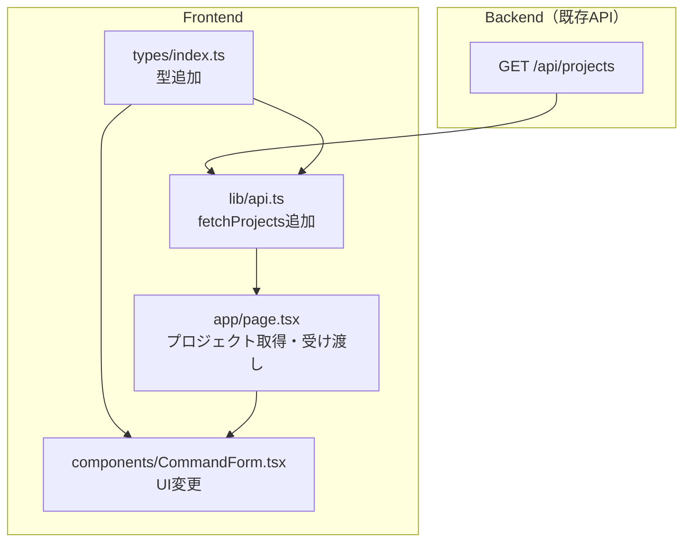

# ProjectPath候補表示 実装計画

## 仕様サマリー

`/Users/user/` 直下のディレクトリ一覧をバックエンドAPIで取得し、フロントエンドのProject Path入力をドロップダウン選択に変更する。

- バックエンド: `GET /api/projects` API新規追加
- フロントエンド: テキスト入力をプロジェクト一覧ドロップダウンに変更（履歴機能は維持）

仕様書: `開発/検討中/2026-02-16_ProjectPath候補表示.md`

---

## バックエンド計画

### 1. 仕様サマリー

`GET /api/projects` エンドポイントを新規追加する。`/Users/user/` 直下のディレクトリ一覧を返すAPIで、フロントエンドのプロジェクトパス選択UIに使用する。隠しディレクトリを除外し、通常のディレクトリのみをアルファベット順で返却する。

### 2. 変更ファイル一覧

| ファイル | 変更内容 | 影響度 |
|---------|---------|-------|
| `backend/internal/handler/projects.go` | 新規作成。ProjectsHandler と関連型を定義 | 低 |
| `backend/cmd/server/main.go` | ProjectsHandler の初期化とルーティング追加（2行追加） | 低 |
| `backend/internal/handler/doc.go` | ProjectsHandler の説明と GET /api/projects の仕様を追記 | 低 |

### 3. 実装ステップ

#### Step 1: ProjectsHandler の新規作成

**対象**: `backend/internal/handler/projects.go`（新規）

**追加するもの**:
- 型 `ProjectInfo`: フィールド `Name` (json: name), `Path` (json: path)
- 型 `ProjectsResponse`: フィールド `Success` (json: success), `Projects` (json: projects, omitempty), `Error` (json: error, omitempty)
- 型 `ProjectsHandler`: `BaseDir` フィールドを持つ構造体。ゼロ値の場合はデフォルトパス `/Users/user/` を使用する（テスト時にベースディレクトリを差し替え可能にするため）
- 関数 `NewProjectsHandler`: コンストラクタ
- メソッド `Handle(c *gin.Context)`: `/Users/user/` 直下のディレクトリをスキャンして返却

**Handle メソッドの責務**:
- ベースディレクトリのパスを定数的に保持（`/Users/user/`）
- `os.ReadDir` でディレクトリエントリを取得
- 隠しディレクトリ（`.` 始まり）を除外
- `entry.IsDir()` が true のもののみ対象（ファイル、シンボリックリンクはスキップ）
- ディレクトリ名のアルファベット順ソート（`os.ReadDir` は名前順で返すため追加ソート不要）
- 成功時は 200 + `ProjectsResponse`、ディレクトリ読み取り失敗時は 500（エラーメッセージ: `"ディレクトリ一覧の取得に失敗しました"`）

**注意点**:
- `os.ReadDir` は結果をファイル名のアルファベット順で返すため、明示的なソートは不要
- `FilesHandler` / `HealthHandler` と同じ構造体パターンに合わせる（サービス層への依存なし）
- ログ出力は `log.Printf("[ProjectsHandler] ...")` の既存フォーマットに合わせる
- `entry.IsDir()` はシンボリックリンクに対して false を返すため、仕様通りシンボリックリンクを除外できる

#### Step 2: ルーティング追加

**対象**: `backend/cmd/server/main.go`

**修正するもの**:
- `main` 関数内で `projectsHandler := handler.NewProjectsHandler()` を追加（`filesHandler` の直後が適切）
- APIルーティングブロック内で `api.GET("/projects", projectsHandler.Handle)` を追加（`/files` の直後が適切）

#### Step 3: doc.go 更新

**対象**: `backend/internal/handler/doc.go`

**修正するもの**:
- 主要コンポーネント一覧に `ProjectsHandler` の説明を追加
- エンドポイント一覧に `GET /api/projects` のリクエスト/レスポンス仕様を追加

### 4. 設計判断とトレードオフ

| 判断 | 選択した方法 | 理由 | 他の選択肢 |
|-----|------------|------|----------|
| サービス層 | 不要（ハンドラー直接実装） | `FilesHandler`/`HealthHandler` と同じく外部サービス依存がないため | サービス層を挟む（過剰な抽象化） |
| ベースパス | ハンドラー内に定数として保持 | 環境変数化は現時点で不要 | 環境変数 / config で管理（YAGNI） |
| ソート | `os.ReadDir` のデフォルト順序に依存 | Go 標準ライブラリが名前順を保証 | 明示的に `sort.Slice`（冗長） |

### 5. 懸念点と対応方針

| 懸念点 | 対応方針 |
|-------|---------|
| ベースパス `/Users/user/` のハードコード | macOS 前提のローカル開発ツールであり、現時点では定数で十分 |
| ベースディレクトリが存在しない場合 | `os.ReadDir` がエラーを返すため、500エラーとして処理 |
| パーミッション不足のディレクトリ | `ReadDir` 全体のエラーとなるため、500エラーで対応 |

---

## フロントエンド計画

### 1. 仕様サマリー

バックエンドの `GET /api/projects` API からプロジェクト一覧を取得し、現在のテキスト入力をプロジェクト一覧のドロップダウン `<select>` に置き換える。表示はディレクトリ名のみ、value はフルパス。localStorage に保存済みの前回パスがあれば初期選択する。既存の履歴ドロップダウンは維持し、ドロップダウン + 履歴の横並びレイアウトとする。

### 2. 修正範囲の全体像



### 3. 変更ファイル一覧

| ファイル | 変更内容 | 影響度 |
|---------|---------|-------|
| `frontend/src/types/index.ts` | `ProjectInfo`, `ProjectsResponse` 型追加 | 低 |
| `frontend/src/lib/api.ts` | `fetchProjects()` 関数追加 | 低 |
| `frontend/src/components/CommandForm.tsx` | テキスト入力をドロップダウンに置換、`projects` prop追加（履歴は維持） | 中 |
| `frontend/src/app/page.tsx` | プロジェクト一覧の取得と `CommandForm` への受け渡し | 中 |

### 4. 実装ステップ

#### Step 1: 型定義の追加

**対象**: `frontend/src/types/index.ts`

**追加するもの**:
- 型 `ProjectInfo`: フィールド `name` (string), `path` (string)
- 型 `ProjectsResponse`: フィールド `success` (boolean), `projects?` (ProjectInfo[]), `error?` (string)

#### Step 2: API関数の追加

**対象**: `frontend/src/lib/api.ts`

**追加するもの**:
- 関数 `fetchProjects`: `GET /api/projects` を呼び出し `ProjectsResponse` を返す
- `fetchFiles` のパターンをベースに `API_BASE` 使用、`response.ok` チェック
- ネットワークエラー時は `try-catch` で `{ success: false, projects: [] }` を返却（`fetchFiles` にはない追加のエラーハンドリング）

#### Step 3: CommandForm の UI 変更

**対象**: `frontend/src/components/CommandForm.tsx`

**修正するもの**:
- Props `CommandFormProps` に `projects` (ProjectInfo[]) を追加（`projectHistory` は維持）
- テキスト入力をプロジェクト一覧 `<select>` ドロップダウンに置換（履歴セレクトは維持）
- レイアウト: `[▼ プロジェクト一覧ドロップダウン] [履歴▼]` の横並び（既存の `flex gap-2` を継続）
- プロジェクト一覧ドロップダウンの仕様:
  - 先頭 option: `-- Select Project --`（value 空文字、disabled）。一度選択したら未選択には戻せない（意図的）
  - `<select>` に `required` 属性を付与（既存のテキスト入力と同じバリデーション）
  - 各 option: 表示は `project.name`（ディレクトリ名）、value は `project.path`（フルパス）
  - `projectPath` が `projects` の `path` 一覧に含まれないかつ空文字でない場合、先頭 option の直後に `<option value={projectPath}>{ディレクトリ名} (custom)</option>` を動的に挿入する（履歴から一覧外のパスを選択した場合に、現在の選択を視覚的に表示するため）
  - `onChange` で `onProjectChange(e.target.value)` を呼び出し
  - `value` は `projectPath` をバインド
  - CSS クラスは `flex-1 min-w-0`（既存テキスト入力と同じ比率）

**削除するもの**:
- テキスト入力要素（`<input type="text">`）のみ

**維持するもの**:
- `handleHistorySelect` 関数
- 履歴セレクト要素（`projectHistory.length > 0 && ...` ブロック）
- `projectHistory` prop

#### Step 4: page.tsx の修正

**対象**: `frontend/src/app/page.tsx`

**追加するもの**:
- State: `projects` (型: `ProjectInfo[]`)
- `useEffect`（依存配列: `[]`、マウント時のみ実行）で `fetchProjects()` を呼び出し、結果を `projects` にセット
- `fetchProjects` のインポート

**修正するもの**:
- `CommandForm` への props に `projects={projects}` を追加
- `handleSubmit` 内の `setProjectPath(projectPath)` は削除（ドロップダウン選択時に `onProjectChange` 経由で既に localStorage 保存済みのため冗長）

**維持するもの**:
- `useSessionManagement` の `projectHistory`, `addToHistory` はそのまま
- `handleSubmit` 内の `addToHistory(projectPath)` はそのまま
- `CommandForm` への `projectHistory={projectHistory}` はそのまま

**注意点**:
- `page.tsx` は Client Component（`"use client"`）なので、`useEffect` + `useState` でプロジェクト一覧を取得する
- `useEffect` の依存配列は `[]`（空配列）とし、マウント時に1回のみ実行する
- API 取得失敗時は `projects` を空配列のまま維持（エラー表示は MVP 外）

### 5. 設計判断とトレードオフ

| 判断 | 選択した方法 | 理由 | 他の選択肢 |
|-----|------------|------|----------|
| 取得タイミング | マウント時に1回 `useEffect` で取得 | プロジェクト一覧は頻繁に変わらない | `onFocus` ごとに再取得（過剰） |
| 取得場所 | `page.tsx` で取得して props で渡す | ファイル選択の `loadFiles` と同じパターン | CommandForm 内で取得（既存パターンと不一致） |
| 履歴機能 | 維持（ドロップダウンと横並び） | 変更量が少なくリスクが低い。手入力で使った `/Users/user/` 直下以外のパスも履歴に残る | 完全削除（変更が多い割にメリットが小さい） |
| 初期選択 | `<select>` の `value` に localStorage のパスをバインド | 既存の `storedPath` がそのまま使える | 別途ロジック追加（不要） |

### 6. 懸念点と対応方針

| 懸念点 | 対応方針 |
|-------|---------|
| localStorage の保存パスや履歴選択が API 一覧に存在しない場合 | `<select>` に動的 option を挿入して現在の選択を視覚的に表示する（Step 3 参照）。localStorage の値はリセットしない（パスの消失を防ぐため） |
| API 取得前のドロップダウン表示 | `projects` が空配列の間はプレースホルダーのみ表示。取得完了後にリストが反映される。ローディング表示は MVP 外とする |
| API 取得失敗時 | `projects` が空配列のため、ドロップダウンにはプレースホルダーのみ表示。既存の localStorage パスがあれば履歴経由で submit 可能。初回起動かつ API ダウンの場合はバックエンドの起動を促す |
| `handleSubmit` 内の `setProjectPath(projectPath)` | 削除する。ドロップダウン選択時に `onProjectChange` 経由で既に localStorage 保存済みのため冗長 |

---

## テストプラン

### 対象計画

`開発/実装/実装待ち/2026-02-16_ProjectPath候補表示_plan.md`

### リスク分析

#### テストが必要な箇所

| 対象 | リスク | 理由 | テスト種別 |
|------|-------|------|----------|
| `ProjectsHandler.Handle` | 中 | ディレクトリスキャン + 隠しディレクトリ除外 + ファイル除外のフィルタリングロジックがある。`os.ReadDir` の結果を正しく加工してレスポンスを構築する責務 | unit |

#### テスト不要な箇所

| 対象 | 理由 |
|------|------|
| `ProjectInfo`, `ProjectsResponse` 型定義（Go） | 構造体定義のみ。JSON タグの正しさはハンドラーテストで間接的に検証される |
| `NewProjectsHandler` コンストラクタ | 空構造体を返すだけの単純な関数 |
| `main.go` のルーティング追加 | 2行追加のみ。Gin フレームワークが保証するルーティング機能。手動確認で十分 |
| `doc.go` 更新 | ドキュメントのみの変更 |
| `frontend/src/types/index.ts` 型追加 | TypeScript の型定義のみ。コンパイル時に検証される |
| `frontend/src/lib/api.ts` の `fetchProjects` | 既存 `fetchFiles` と同一パターンの単純な fetch ラッパー。外部依存（fetch API）を呼ぶだけで独自ロジックなし |
| `frontend/src/components/CommandForm.tsx` UI 変更 | テストフレームワーク（Jest/Vitest）未導入。UI の見た目テストはコスパが悪い。Props 変更はコンパイル時の型チェックで検証される |
| `frontend/src/app/page.tsx` 修正 | テストフレームワーク未導入。状態管理の結合テストはコスト高。`useEffect` + `fetchProjects` の組み合わせは React の標準パターンで壊れにくい |

### テストケース

#### 1. ProjectsHandler.Handle

**ファイル**: `backend/internal/handler/projects_test.go`
**種別**: unit

テスト戦略: 実際のファイルシステムに依存せず、テスト用の一時ディレクトリ（`t.TempDir()`）を使ってディレクトリ構成を作り、`Handle` メソッドの挙動を検証する。ベースディレクトリを外部から差し替え可能にする設計が必要になるため、実装時に以下いずれかを採用する。

- (A) `ProjectsHandler` に `BaseDir` フィールドを追加し、テスト時にセット
- (B) `NewProjectsHandler(baseDir string)` のようにコンストラクタ引数で受け取る

本番コードではデフォルト値 `/Users/user/` をセットする。`main.go` の呼び出しは `NewProjectsHandler()` のままとし、(A) の方式で `BaseDir` のゼロ値をデフォルトパスとして扱うのが最もシンプル。

| # | ケース | 入力（ディレクトリ構成） | 期待結果 | 優先度 |
|---|-------|----------------------|---------|-------|
| 1 | 正常系: 複数ディレクトリ | `dir1/`, `dir2/`, `dir3/` | 200, `success: true`, 3件の `ProjectInfo`（アルファベット順）。各 `name` はディレクトリ名、`path` はフルパス | 必須 |
| 2 | 隠しディレクトリ除外 | `.hidden/`, `.config/`, `visible/` | 200, `success: true`, `visible` のみ1件 | 必須 |
| 3 | ファイル除外 | `dir1/`, `file.txt`（通常ファイル） | 200, `success: true`, `dir1` のみ1件 | 必須 |
| 4 | 空ディレクトリ | ベースディレクトリ内に何もない | 200, `success: true`, `projects: []`（空配列） | 必須 |
| 5 | ベースディレクトリ不在 | 存在しないパス | 500, `success: false`, エラーメッセージ含む | 推奨 |

**テスト実装上の注意**:
- `t.TempDir()` で一時ディレクトリを作り、その中にサブディレクトリ・ファイルを `os.Mkdir` / `os.WriteFile` で作成
- `gin.CreateTestContext` + `httptest.NewRecorder` で Gin のテストコンテキストを生成
- レスポンスボディを `json.Unmarshal` して `ProjectsResponse` に変換し検証
- テーブル駆動テストを使用し、`t.Run()` でサブテスト化

### テスト実行手順

```bash
# バックエンドテスト
cd /Users/user/Ghostrunner/backend
go test ./internal/handler/ -run TestProjectsHandler -v

# フロントエンド（テストなし - コンパイルチェックのみ）
cd /Users/user/Ghostrunner/frontend
npm run build
```

### まとめ

| 項目 | 数 |
|------|---|
| テストファイル数 | 1 |
| テストケース数 | 5 |
| 推定実装時間 | 小 |

**テストしない判断の根拠:**
- フロントエンド全般: テストフレームワーク（Jest/Vitest）が未導入。この計画のためだけにテスト基盤を構築するコストは変更内容のリスクに見合わない。型定義の追加・削除は TypeScript コンパイラが検証し、UI 変更は `npm run build` の成功で最低限の整合性を確認できる
- バックエンドのルーティング追加（`main.go`）: 2行の定型コード追加であり、Gin フレームワークの機能をテストすることになる
- バックエンドの型定義・コンストラクタ: 構造体定義とインスタンス生成のみで、ロジックがない
- `fetchProjects` API 関数: 既存の `fetchFiles` と完全に同一パターン。`fetch` を呼んで結果を返すだけの委譲関数であり、独自ロジックがない

---

## バックエンド実装完了レポート

### 実装サマリー

- **実装日**: 2026-02-16
- **スコープ**: バックエンド（`backend/` 配下）のみ
- **変更ファイル数**: 5 files（新規2、修正3）
- **実装内容**: `GET /api/projects` エンドポイントを新規追加。`/Users/user/` 直下のディレクトリ一覧を返すAPIで、フロントエンドのProjectPath選択ドロップダウンの候補データを提供する。隠しディレクトリ、ファイル、シンボリックリンクを除外し、アルファベット順でソートされた結果を返却する。

### 変更ファイル一覧

| ファイル | 種別 | 変更内容 |
|---------|------|---------|
| `backend/internal/handler/projects.go` | 新規 | `ProjectsHandler` 構造体、`ProjectInfo`/`ProjectsResponse` 型、`NewProjectsHandler` コンストラクタ、`Handle` メソッド（ディレクトリスキャン+フィルタリング+JSON返却）、`baseDir` ヘルパーメソッド。計100行 |
| `backend/internal/handler/projects_test.go` | 新規 | テーブル駆動テスト5ケース。`t.TempDir()` による一時ディレクトリ構築、`gin.CreateTestContext` + `httptest.NewRecorder` によるHTTPテスト。計175行 |
| `backend/cmd/server/main.go` | 修正 | `projectsHandler := handler.NewProjectsHandler()` の初期化（26行目）と `api.GET("/projects", projectsHandler.Handle)` のルーティング追加（64行目）。計2行追加 |
| `backend/internal/handler/doc.go` | 修正 | パッケージドキュメントに `ProjectsHandler` の説明追加（15行目、52-57行目）、`GET /api/projects` のリクエスト/レスポンス仕様追記（109-121行目）、使用例に `ProjectsHandler` の初期化・ルーティングコード追加（279-281行目） |
| `backend/docs/BACKEND_API.md` | 修正 | エンドポイント一覧テーブルに `/api/projects` 行追加（29行目）、Projects API セクション新設（319-388行目）。リクエスト/レスポンス形式、ProjectInfoオブジェクト仕様、HTTPステータスコード一覧を記載 |

### 計画からの変更点

特になし。バックエンド計画の Step 1 - Step 3 の全項目を計画通りに実装した。

- `ProjectsHandler` の設計（`BaseDir` フィールドによるテスト時の差し替え方式）は計画の (A) 方式を採用
- `os.ReadDir` のデフォルトソート順序に依存する方針は計画通り
- サービス層を挟まずハンドラー直接実装（`FilesHandler`/`HealthHandler` と同じパターン）は計画通り
- ログフォーマット `[ProjectsHandler]` は既存フォーマットに準拠
- テストプランの5ケースを全て実装

### 実装時の課題

特になし。

### 残存する懸念点

- **ベースパスのハードコード**: `/Users/user/` が `projects.go` 内にハードコードされている。macOS 前提のローカル開発ツールであり現時点では問題ないが、将来的に環境変数や設定ファイルで管理する必要が生じる可能性がある（計画書の懸念点に記載済み）
- **フロントエンド未実装**: 本レポートはバックエンドのみのスコープ。フロントエンド側（ドロップダウンUI、`fetchProjects` 関数、`page.tsx` の修正）は別途実装が必要

### 検証結果

#### ビルド・静的解析

| 検証項目 | 結果 |
|---------|------|
| `go build ./...` | PASS |
| `go vet ./...` | PASS |
| `go fmt ./...` | PASS（フォーマット差分なし） |

#### テスト結果

```
go test ./internal/handler/ -run TestProjectsHandler -v
```

| # | テストケース | 結果 |
|---|------------|------|
| 1 | 正常系_複数ディレクトリがアルファベット順で返される | PASS |
| 2 | 隠しディレクトリが除外される | PASS |
| 3 | ファイルが除外されディレクトリのみ返される | PASS |
| 4 | 空ディレクトリの場合に空配列が返される | PASS |
| 5 | ベースディレクトリが存在しない場合に500エラー | PASS |

全5件 PASS。テスト計画で定義した必須4件 + 推奨1件の全ケースをカバー。

#### コードレビュー

- Critical: なし
- Warning: なし

### 動作確認フロー

```
1. バックエンドサーバーを起動する
   $ cd /Users/user/Ghostrunner
   $ make restart-backend-logs

2. サーバーが起動したことをヘルスチェックで確認する
   $ curl http://localhost:8080/api/health
   期待: {"status":"ok"}

3. プロジェクト一覧APIを呼び出す
   $ curl http://localhost:8080/api/projects
   期待: {"success":true,"projects":[{"name":"...","path":"/Users/user/..."},...]}}
   - success が true であること
   - projects 配列にディレクトリ一覧が含まれること
   - 各要素に name（ディレクトリ名）と path（絶対パス）があること
   - 隠しディレクトリ（.で始まるもの）が含まれていないこと
   - ファイルが含まれていないこと
   - アルファベット順でソートされていること

4. レスポンスの path を確認する
   - 全ての path が /Users/user/ で始まること
   - path が name と一致すること（path = /Users/user/ + name）

5. サーバーを停止する
   $ make stop-backend
```

### デプロイ後の確認事項

- [ ] `curl http://localhost:8080/api/projects` で 200 レスポンスが返ること
- [ ] レスポンスの `projects` 配列に `/Users/user/` 直下のディレクトリが含まれていること
- [ ] 隠しディレクトリ（`.Trash`, `.ssh` など）が結果に含まれていないこと
- [ ] フロントエンド実装後にドロップダウンから正しくプロジェクトを選択できること
