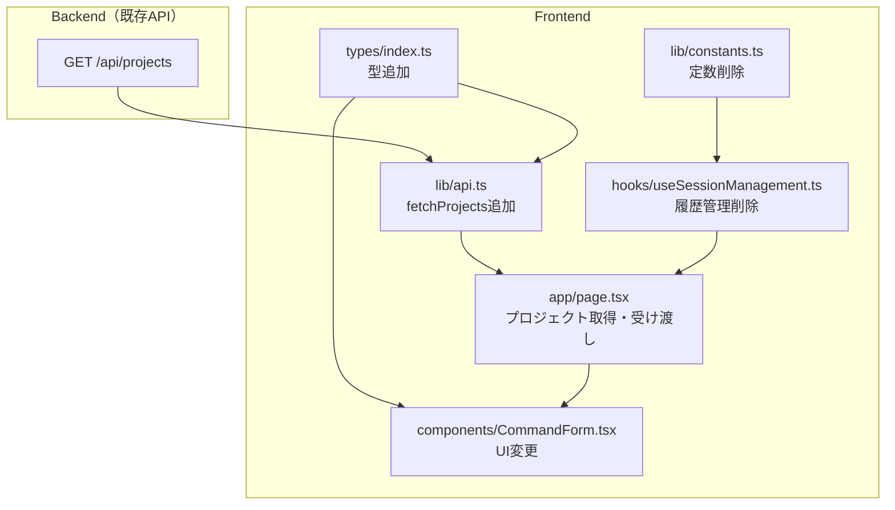

# ProjectPath候補表示 実装計画

## 仕様サマリー

`/Users/user/` 直下のディレクトリ一覧をバックエンドAPIで取得し、フロントエンドのProject Path入力をドロップダウン選択に変更する。

- バックエンド: `GET /api/projects` API新規追加
- フロントエンド: テキスト入力+履歴セレクト -> ドロップダウン選択に変更
- 履歴管理機能は不要になるため削除

仕様書: `開発/検討中/2026-02-16_ProjectPath候補表示.md`

---

## バックエンド計画

### 1. 仕様サマリー

`GET /api/projects` エンドポイントを新規追加する。`/Users/user/` 直下のディレクトリ一覧を返すAPIで、フロントエンドのプロジェクトパス選択UIに使用する。隠しディレクトリを除外し、通常のディレクトリのみをアルファベット順で返却する。

### 2. 変更ファイル一覧

| ファイル | 変更内容 | 影響度 |
|---------|---------|-------|
| `backend/internal/handler/projects.go` | 新規作成。ProjectsHandler と関連型を定義 | 低 |
| `backend/cmd/server/main.go` | ProjectsHandler の初期化とルーティング追加（2行追加） | 低 |
| `backend/internal/handler/doc.go` | ProjectsHandler の説明と GET /api/projects の仕様を追記 | 低 |

### 3. 実装ステップ

#### Step 1: ProjectsHandler の新規作成

**対象**: `backend/internal/handler/projects.go`（新規）

**追加するもの**:
- 型 `ProjectInfo`: フィールド `Name` (json: name), `Path` (json: path)
- 型 `ProjectsResponse`: フィールド `Success` (json: success), `Projects` (json: projects, omitempty), `Error` (json: error, omitempty)
- 型 `ProjectsHandler`: `BaseDir` フィールドを持つ構造体。ゼロ値の場合はデフォルトパス `/Users/user/` を使用する（テスト時にベースディレクトリを差し替え可能にするため）
- 関数 `NewProjectsHandler`: コンストラクタ
- メソッド `Handle(c *gin.Context)`: `/Users/user/` 直下のディレクトリをスキャンして返却

**Handle メソッドの責務**:
- ベースディレクトリのパスを定数的に保持（`/Users/user/`）
- `os.ReadDir` でディレクトリエントリを取得
- 隠しディレクトリ（`.` 始まり）を除外
- `entry.IsDir()` が true のもののみ対象（ファイル、シンボリックリンクはスキップ）
- ディレクトリ名のアルファベット順ソート（`os.ReadDir` は名前順で返すため追加ソート不要）
- 成功時は 200 + `ProjectsResponse`、ディレクトリ読み取り失敗時は 500（エラーメッセージ: `"ディレクトリ一覧の取得に失敗しました"`）

**注意点**:
- `os.ReadDir` は結果をファイル名のアルファベット順で返すため、明示的なソートは不要
- `FilesHandler` / `HealthHandler` と同じ構造体パターンに合わせる（サービス層への依存なし）
- ログ出力は `log.Printf("[ProjectsHandler] ...")` の既存フォーマットに合わせる
- `entry.IsDir()` はシンボリックリンクに対して false を返すため、仕様通りシンボリックリンクを除外できる

#### Step 2: ルーティング追加

**対象**: `backend/cmd/server/main.go`

**修正するもの**:
- `main` 関数内で `projectsHandler := handler.NewProjectsHandler()` を追加（`filesHandler` の直後が適切）
- APIルーティングブロック内で `api.GET("/projects", projectsHandler.Handle)` を追加（`/files` の直後が適切）

#### Step 3: doc.go 更新

**対象**: `backend/internal/handler/doc.go`

**修正するもの**:
- 主要コンポーネント一覧に `ProjectsHandler` の説明を追加
- エンドポイント一覧に `GET /api/projects` のリクエスト/レスポンス仕様を追加

### 4. 設計判断とトレードオフ

| 判断 | 選択した方法 | 理由 | 他の選択肢 |
|-----|------------|------|----------|
| サービス層 | 不要（ハンドラー直接実装） | `FilesHandler`/`HealthHandler` と同じく外部サービス依存がないため | サービス層を挟む（過剰な抽象化） |
| ベースパス | ハンドラー内に定数として保持 | 環境変数化は現時点で不要 | 環境変数 / config で管理（YAGNI） |
| ソート | `os.ReadDir` のデフォルト順序に依存 | Go 標準ライブラリが名前順を保証 | 明示的に `sort.Slice`（冗長） |

### 5. 懸念点と対応方針

| 懸念点 | 対応方針 |
|-------|---------|
| ベースパス `/Users/user/` のハードコード | macOS 前提のローカル開発ツールであり、現時点では定数で十分 |
| ベースディレクトリが存在しない場合 | `os.ReadDir` がエラーを返すため、500エラーとして処理 |
| パーミッション不足のディレクトリ | `ReadDir` 全体のエラーとなるため、500エラーで対応 |

---

## フロントエンド計画

### 1. 仕様サマリー

バックエンドの `GET /api/projects` API からプロジェクト一覧を取得し、現在の「テキスト入力 + 履歴セレクト」による Project Path 指定 UI を、プロジェクト一覧のドロップダウン `<select>` に置き換える。表示はディレクトリ名のみ、value はフルパス。localStorage に保存済みの前回パスがあれば初期選択する。履歴管理機能は不要になるため削除する。

### 2. 修正範囲の全体像



### 3. 変更ファイル一覧

| ファイル | 変更内容 | 影響度 |
|---------|---------|-------|
| `frontend/src/types/index.ts` | `ProjectInfo`, `ProjectsResponse` 型追加 | 低 |
| `frontend/src/lib/api.ts` | `fetchProjects()` 関数追加 | 低 |
| `frontend/src/lib/constants.ts` | `LOCAL_STORAGE_HISTORY_KEY`, `MAX_PROJECT_HISTORY` 削除 | 低 |
| `frontend/src/hooks/useSessionManagement.ts` | `projectHistory`, `addToHistory` 関連のコード削除 | 中 |
| `frontend/src/components/CommandForm.tsx` | テキスト入力+履歴セレクト -> ドロップダウンに置換、Props変更 | 高 |
| `frontend/src/app/page.tsx` | プロジェクト一覧の取得と受け渡し、履歴関連の参照削除 | 高 |

### 4. 実装ステップ

#### Step 1: 型定義の追加

**対象**: `frontend/src/types/index.ts`

**追加するもの**:
- 型 `ProjectInfo`: フィールド `name` (string), `path` (string)
- 型 `ProjectsResponse`: フィールド `success` (boolean), `projects?` (ProjectInfo[]), `error?` (string)

#### Step 2: API関数の追加

**対象**: `frontend/src/lib/api.ts`

**追加するもの**:
- 関数 `fetchProjects`: `GET /api/projects` を呼び出し `ProjectsResponse` を返す
- 既存の `fetchFiles` と同様のパターン（`API_BASE` 使用、エラー時は `{ success: false, error: "..." }` 返却）
- ネットワークエラー時は `try-catch` で `{ success: false, projects: [] }` を返却（`fetchFiles` と同様のエラーハンドリング）

#### Step 3: 履歴管理コードの削除

**注意: Step 3 と Step 5 は同時に実施する。** Step 3 で `useSessionManagement` から `addToHistory` を削除すると、Step 5 の修正前の `page.tsx` がコンパイルエラーになるため。

**対象**: `frontend/src/lib/constants.ts`

**削除するもの**:
- `LOCAL_STORAGE_HISTORY_KEY`
- `MAX_PROJECT_HISTORY`

**対象**: `frontend/src/hooks/useSessionManagement.ts`

**削除するもの**:
- `LOCAL_STORAGE_HISTORY_KEY`, `MAX_PROJECT_HISTORY` のインポート
- `getStoredHistory` 関数
- `projectHistory` state と `useEffect`
- `addToHistory` コールバック
- 返却オブジェクトから `projectHistory`, `addToHistory` を除去

#### Step 4: CommandForm の UI 変更

**対象**: `frontend/src/components/CommandForm.tsx`

**修正するもの**:
- Props `CommandFormProps` から `projectHistory` を削除し、`projects` (ProjectInfo[]) を追加
- `handleHistorySelect` を削除
- Project Path セクションを以下に置換:
  - テキスト入力 + 履歴セレクトの横並び -> 単一の `<select>` ドロップダウン
  - 先頭 option: `-- Select Project --`（value 空文字、disabled）。一度選択したら未選択には戻せない（意図的）
  - `<select>` に `required` 属性を付与（既存のテキスト入力と同じバリデーション）
  - 各 option: 表示は `project.name`（ディレクトリ名）、value は `project.path`（フルパス）
  - `onChange` で `onProjectChange(e.target.value)` を呼び出し
  - `value` は `projectPath` をバインド

**削除するもの**:
- `handleHistorySelect` 関数
- テキスト入力要素
- 履歴セレクト要素

#### Step 5: page.tsx の修正

**対象**: `frontend/src/app/page.tsx`

**追加するもの**:
- State: `projects` (型: `ProjectInfo[]`)
- `useEffect`（依存配列: `[]`、マウント時のみ実行）で `fetchProjects()` を呼び出し、結果を `projects` にセット
- プロジェクト一覧取得後、localStorage の保存パスが一覧に存在しない場合は `projectPath` を空文字にリセットする
- `fetchProjects` のインポート

**修正するもの**:
- `useSessionManagement` の分割代入から `projectHistory`, `addToHistory` を除去
- `handleSubmit` 内の `addToHistory(projectPath)` 呼び出しを削除
- `handleSubmit` 内の `setProjectPath(projectPath)` は削除（ドロップダウン選択時に `onProjectChange` 経由で既に localStorage 保存済みのため冗長）
- `handleSubmit` の `useCallback` 依存配列から `addToHistory` を除去
- `CommandForm` への props 受け渡し: `projectHistory` -> `projects`

**注意点**:
- `page.tsx` は Client Component（`"use client"`）なので、`useEffect` + `useState` でプロジェクト一覧を取得する
- `useEffect` の依存配列は `[]`（空配列）とし、マウント時に1回のみ実行する
- API 取得失敗時は `projects` を空配列のまま維持（エラー表示は MVP 外）

### 5. 設計判断とトレードオフ

| 判断 | 選択した方法 | 理由 | 他の選択肢 |
|-----|------------|------|----------|
| 取得タイミング | マウント時に1回 `useEffect` で取得 | プロジェクト一覧は頻繁に変わらない | `onFocus` ごとに再取得（過剰） |
| 取得場所 | `page.tsx` で取得して props で渡す | ファイル選択の `loadFiles` と同じパターン | CommandForm 内で取得（既存パターンと不一致） |
| 履歴機能 | 完全削除 | プロジェクト一覧 API があるため不要 | 残して併用（複雑化するだけ） |
| 初期選択 | `<select>` の `value` に localStorage のパスをバインド | 既存の `storedPath` がそのまま使える | 別途ロジック追加（不要） |

### 6. 懸念点と対応方針

| 懸念点 | 対応方針 |
|-------|---------|
| localStorage の保存パスが API 一覧に存在しない場合 | プロジェクト一覧取得後に `projectPath` が一覧に含まれるか検証し、存在しない場合は空文字にリセットする |
| API 取得前のドロップダウン表示 | `projects` が空配列の間はプレースホルダーのみ表示。取得完了後にリストが反映される。ローディング表示は MVP 外とする |
| `handleSubmit` 内の `setProjectPath(projectPath)` | 削除する。ドロップダウン選択時に `onProjectChange` 経由で既に localStorage 保存済みのため冗長 |

---

## テストプラン

### 対象計画

`開発/実装/実装待ち/2026-02-16_ProjectPath候補表示_plan.md`

### リスク分析

#### テストが必要な箇所

| 対象 | リスク | 理由 | テスト種別 |
|------|-------|------|----------|
| `ProjectsHandler.Handle` | 中 | ディレクトリスキャン + 隠しディレクトリ除外 + ファイル除外のフィルタリングロジックがある。`os.ReadDir` の結果を正しく加工してレスポンスを構築する責務 | unit |

#### テスト不要な箇所

| 対象 | 理由 |
|------|------|
| `ProjectInfo`, `ProjectsResponse` 型定義（Go） | 構造体定義のみ。JSON タグの正しさはハンドラーテストで間接的に検証される |
| `NewProjectsHandler` コンストラクタ | 空構造体を返すだけの単純な関数 |
| `main.go` のルーティング追加 | 2行追加のみ。Gin フレームワークが保証するルーティング機能。手動確認で十分 |
| `doc.go` 更新 | ドキュメントのみの変更 |
| `frontend/src/types/index.ts` 型追加 | TypeScript の型定義のみ。コンパイル時に検証される |
| `frontend/src/lib/api.ts` の `fetchProjects` | 既存 `fetchFiles` と同一パターンの単純な fetch ラッパー。外部依存（fetch API）を呼ぶだけで独自ロジックなし |
| `frontend/src/lib/constants.ts` 定数削除 | 2行の定数削除。削除漏れはコンパイルエラーで検出される |
| `frontend/src/hooks/useSessionManagement.ts` 履歴管理削除 | コード削除のみ。削除漏れ・参照残りはコンパイルエラーで検出される |
| `frontend/src/components/CommandForm.tsx` UI 変更 | テストフレームワーク（Jest/Vitest）未導入。UI の見た目テストはコスパが悪い。Props 変更はコンパイル時の型チェックで検証される |
| `frontend/src/app/page.tsx` 修正 | テストフレームワーク未導入。状態管理の結合テストはコスト高。`useEffect` + `fetchProjects` の組み合わせは React の標準パターンで壊れにくい |

### テストケース

#### 1. ProjectsHandler.Handle

**ファイル**: `backend/internal/handler/projects_test.go`
**種別**: unit

テスト戦略: 実際のファイルシステムに依存せず、テスト用の一時ディレクトリ（`t.TempDir()`）を使ってディレクトリ構成を作り、`Handle` メソッドの挙動を検証する。ベースディレクトリを外部から差し替え可能にする設計が必要になるため、実装時に以下いずれかを採用する。

- (A) `ProjectsHandler` に `BaseDir` フィールドを追加し、テスト時にセット
- (B) `NewProjectsHandler(baseDir string)` のようにコンストラクタ引数で受け取る

本番コードではデフォルト値 `/Users/user/` をセットする。`main.go` の呼び出しは `NewProjectsHandler()` のままとし、(A) の方式で `BaseDir` のゼロ値をデフォルトパスとして扱うのが最もシンプル。

| # | ケース | 入力（ディレクトリ構成） | 期待結果 | 優先度 |
|---|-------|----------------------|---------|-------|
| 1 | 正常系: 複数ディレクトリ | `dir1/`, `dir2/`, `dir3/` | 200, `success: true`, 3件の `ProjectInfo`（アルファベット順）。各 `name` はディレクトリ名、`path` はフルパス | 必須 |
| 2 | 隠しディレクトリ除外 | `.hidden/`, `.config/`, `visible/` | 200, `success: true`, `visible` のみ1件 | 必須 |
| 3 | ファイル除外 | `dir1/`, `file.txt`（通常ファイル） | 200, `success: true`, `dir1` のみ1件 | 必須 |
| 4 | 空ディレクトリ | ベースディレクトリ内に何もない | 200, `success: true`, `projects: []`（空配列） | 必須 |
| 5 | ベースディレクトリ不在 | 存在しないパス | 500, `success: false`, エラーメッセージ含む | 推奨 |

**テスト実装上の注意**:
- `t.TempDir()` で一時ディレクトリを作り、その中にサブディレクトリ・ファイルを `os.Mkdir` / `os.WriteFile` で作成
- `gin.CreateTestContext` + `httptest.NewRecorder` で Gin のテストコンテキストを生成
- レスポンスボディを `json.Unmarshal` して `ProjectsResponse` に変換し検証
- テーブル駆動テストを使用し、`t.Run()` でサブテスト化

### テスト実行手順

```bash
# バックエンドテスト
cd /Users/user/Ghostrunner/backend
go test ./internal/handler/ -run TestProjectsHandler -v

# フロントエンド（テストなし - コンパイルチェックのみ）
cd /Users/user/Ghostrunner/frontend
npm run build
```

### まとめ

| 項目 | 数 |
|------|---|
| テストファイル数 | 1 |
| テストケース数 | 5 |
| 推定実装時間 | 小 |

**テストしない判断の根拠:**
- フロントエンド全般: テストフレームワーク（Jest/Vitest）が未導入。この計画のためだけにテスト基盤を構築するコストは変更内容のリスクに見合わない。型定義の追加・削除は TypeScript コンパイラが検証し、UI 変更は `npm run build` の成功で最低限の整合性を確認できる
- バックエンドのルーティング追加（`main.go`）: 2行の定型コード追加であり、Gin フレームワークの機能をテストすることになる
- バックエンドの型定義・コンストラクタ: 構造体定義とインスタンス生成のみで、ロジックがない
- `fetchProjects` API 関数: 既存の `fetchFiles` と完全に同一パターン。`fetch` を呼んで結果を返すだけの委譲関数であり、独自ロジックがない
