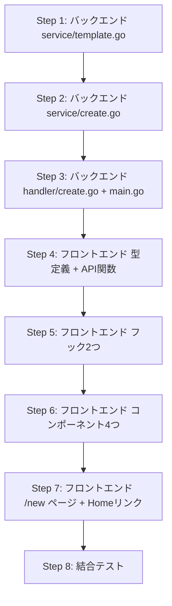

# devtools GUIプロジェクト作成画面 実装計画

## Context

CLIの `/init` コマンドは非エンジニアには分かりにくい。devtoolsのブラウザUI（localhost:3001）にフォーム画面を作り、ポチポチ選ぶだけでプロジェクト生成できるようにする。同人誌「非エンジニアでもClaude CodeでWebシステムを作る方法」の導入体験としても重要。

検討資料: `開発/検討中/2026-03-20_devtools_GUI_プロジェクト作成画面.md`

## 実装方針

- Claude CLIを使わず、Goコードで直接プロジェクト生成（高速・進捗表示が正確・APIコスト不要）
- SSEで進捗をリアルタイム表示
- 1画面フォーム → 進捗表示 → 完了画面（VS Codeで開くボタン）

---

## バックエンド計画

### 変更ファイル一覧

| ファイル | 変更 | 内容 |
|---------|------|------|
| `devtools/backend/internal/service/template.go` | 新規 | テンプレートコピー、プレースホルダー置換、docker-compose結合 |
| `devtools/backend/internal/service/create.go` | 新規 | プロジェクト生成オーケストレーション（CreateService インターフェース + 実装） |
| `devtools/backend/internal/handler/create.go` | 新規 | 3エンドポイントのハンドラー + CreateEvent用SSE送信 |
| `devtools/backend/cmd/server/main.go` | 修正 | DI追加、ルーティング3行追加 |
| `devtools/backend/go.mod` | 修正 | `gopkg.in/yaml.v3` 追加（docker-compose結合用） |

### APIエンドポイント

**1. GET /api/projects/validate?name={name}**
- プロジェクト名バリデーション（形式 + ディレクトリ存在チェック）
- 正規表現: `^[a-z0-9]+(-[a-z0-9]+)*$`
- レスポンス: `{ valid, path, error }`

**2. POST /api/projects/create/stream (SSE)**
- リクエスト: `{ name, description, services[] }`
- 10ステップ、各完了時にSSEでprogressイベント送信
- SSEイベント: `{ type: "progress"|"complete"|"error", step, message, progress }`

**3. POST /api/projects/open**
- リクエスト: `{ path }`
- `exec.Command("code", path)` でVS Code起動

### 生成ステップ（service/create.go）

| # | step ID | ラベル | 処理 |
|---|---------|--------|------|
| 1 | template_copy | テンプレートをコピー中 | base + オプションテンプレートのコピー |
| 2 | placeholder_replace | プロジェクト名を設定中 | {{PROJECT_NAME}} 置換 |
| 3 | env_create | 環境設定ファイルを作成中 | .env.example → .env + サービス別変数追加 |
| 4 | dependency_install | 依存パッケージをインストール中 | go mod tidy + npm install |
| 5 | claude_assets | 開発支援ツールを設定中 | .claude/ 資産コピー + 不要エージェント削除 |
| 6 | claude_md | プロジェクト設定を生成中 | CLAUDE.md テンプレート生成 |
| 7 | devtools_link | devtools を接続中 | シンボリックリンク作成 |
| 8 | git_init | バージョン管理を初期化中 | git init + add + commit |
| 9 | server_start | サーバーを起動中 | docker-compose up + backend/frontend起動 |
| 10 | health_check | 動作確認中 | localhost:8080/api/health ポーリング |

### docker-compose 結合ルール
- YAML パース（`gopkg.in/yaml.v3`）でマップマージ
- database選択時: with-db の docker-compose.yml をベースにする（backendサービスにenv/depends_on追加があるため）
- storage/cache: services と volumes を追加マージ

### テンプレートパス解決
- Ghostrunnerリポジトリルートからの相対パス（`../templates/`）
- devtools/backend は Ghostrunner/devtools/backend/ で動作する前提

### CLAUDE.md 生成
- Ghostrunnerの `.claude/CLAUDE.md` をベースに、プロジェクト名・概要・選択サービスに応じてセクションを組み立て
- テンプレートリテラルとして Go コード内に持つ

---

## フロントエンド計画

### 変更ファイル一覧

| ファイル | 変更 | 内容 |
|---------|------|------|
| `devtools/frontend/src/types/index.ts` | 修正 | 型追加（CreateProjectRequest, CreateProgressEvent, CreateStep, CreatedProject, CreatePhase, DataService） |
| `devtools/frontend/src/lib/createApi.ts` | 新規 | API呼び出し3関数（validateProjectName, createProjectStream, openInVSCode） |
| `devtools/frontend/src/hooks/useProjectValidation.ts` | 新規 | 300msデバウンス付きバリデーション |
| `devtools/frontend/src/hooks/useProjectCreate.ts` | 新規 | SSE通信 + 状態遷移管理 |
| `devtools/frontend/src/components/create/ServiceSelector.tsx` | 新規 | Data Servicesチェックボックス3つ |
| `devtools/frontend/src/components/create/ProjectForm.tsx` | 新規 | フォーム入力 + 確認セクション |
| `devtools/frontend/src/components/create/CreateProgress.tsx` | 新規 | チェックリスト + プログレスバー |
| `devtools/frontend/src/components/create/CreateComplete.tsx` | 新規 | 完了画面（URL + ボタン） |
| `devtools/frontend/src/app/new/page.tsx` | 新規 | /new ページ本体（phase切り替え） |
| `devtools/frontend/src/app/page.tsx` | 修正 | ヘッダーに "New Project" リンク追加 |

### 状態遷移

```
Form → Creating → Complete（成功）
                → Error（失敗）→ Form（やり直し、入力値保持）
Complete → Form（もう1つ作る）
```

### コンポーネント構成

- **page.tsx**: `useProjectCreate` で phase 管理、phase に応じて表示切替
- **ProjectForm**: 名前入力（useProjectValidation）+ 概要 + ServiceSelector + 確認セクション常時表示
- **CreateProgress**: 10ステップのチェックリスト（完了=チェック、進行中=pulse、未着手=空丸）+ プログレスバー
- **CreateComplete**: 成功メッセージ + URL + [Open in VS Code] + [Create Another]

### SSEパース
- `useSSEStream` は `StreamEvent` 型専用のため直接再利用せず、同じ ReadableStream パースロジックを `useProjectCreate` 内に持つ

---

## 実装順序



---

## 検証方法

1. `make dev` で devtools 起動
2. ブラウザで `localhost:3001/new` にアクセス
3. フォーム入力 → [Create Project] → 進捗表示 → 完了
4. [Open in VS Code] でプロジェクトが開く
5. 開いたプロジェクトで `/fullstack`, `/plan` が認識される
6. `make dev` でバックエンド + フロントエンドが起動する
