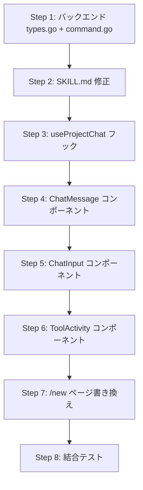

# /new 対話型プロジェクト作成 実装計画

## Context

/new ページを「フォーム入力型」から「対話型チャットUI」に再設計する。既存の `ExecuteCommandStream` + `/init` コマンドを活用し、AIと対話しながらプロジェクトを生成する。

検討資料: `開発/検討中/2026-03-20_new対話型プロジェクト作成.md`

## 実装方針

- 案A（Claude CLI 経由）を採用
- バックエンド変更: AllowedCommands に "init" 追加 + args 空許容
- SKILL.md: 引数なし時の対話フロー + MVP促進プロンプト
- フロントエンド: /new ページをチャットUIに全面書き換え

---

## バックエンド計画

### 変更ファイル一覧

| ファイル | 変更 | 内容 |
|---------|------|------|
| `devtools/backend/internal/service/types.go` | 修正 | AllowedCommands に `"init": true` 追加 |
| `devtools/backend/internal/handler/command.go` | 修正 | "init" コマンドの場合 args 空を許容 |

### 詳細

**types.go**: AllowedCommands マップに1行追加のみ。

**command.go**: Handle（L104-112）と HandleStream（L192-200）で `req.Args == ""` のバリデーションを修正。"init" コマンドの場合のみ args 空を許容する。

```go
if req.Args == "" && req.Command != "init" {
    // エラー
}
```

---

## SKILL.md 計画

### 変更ファイル

| ファイル | 変更 | 内容 |
|---------|------|------|
| `.claude/skills/init/SKILL.md` | 修正 | 引数なし対話フロー + MVP促進 + 保留対応 |

### 修正内容

1. **引数なし対話フロー**: `$ARGUMENTS` が空の場合、AskUserQuestion でプロジェクト概要から質問開始
2. **MVP促進プロンプト追加**:
   - 「まずは最小限で動くものを作りましょう」のスタンスで対話
   - ユーザーが多機能を求めた場合、スコープを絞る誘導
   - 「その機能は後から追加できます」等のフレーズ
   - 非エンジニアに分かりやすい言葉で質問
3. **保留対応**: 「分からない」「後で決める」→ 該当サービスを含めずに生成 + 後から追加する方法を案内

---

## フロントエンド計画

### 変更ファイル一覧

| ファイル | 変更 | 内容 |
|---------|------|------|
| `devtools/frontend/src/hooks/useProjectChat.ts` | 新規 | チャット対話のステート管理 |
| `devtools/frontend/src/components/chat/ChatMessage.tsx` | 新規 | AI/ユーザーメッセージ表示 |
| `devtools/frontend/src/components/chat/ChatInput.tsx` | 新規 | テキスト入力 + 送信 |
| `devtools/frontend/src/components/chat/ToolActivity.tsx` | 新規 | ツール実行リアルタイム表示 |
| `devtools/frontend/src/app/new/page.tsx` | 全面書き換え | チャットUIに変更 |

### useProjectChat フック

既存の `useSSEStream` + `executeCommandStream` / `continueSessionStream` を活用。

State:
- `messages: ChatItem[]` - チャット履歴
- `isStreaming: boolean`
- `sessionId: string | null`
- `phase: "idle" | "chatting" | "complete" | "error"`

公開関数:
- `startChat()` - /init コマンド実行で対話開始
- `sendAnswer(answer: string)` - ユーザー回答を送信
- `reset()` - 全状態リセット

イベント処理:
- `text` → 連続する text を1つの AI メッセージにマージ
- `question` → AI メッセージ + 質問UIを表示
- `tool_use` → ToolActivity グループに追加
- `complete` → phase を "complete" に
- `error` → phase を "error" に

### ChatMessage コンポーネント

- AI メッセージ: 左寄せ、背景色で区別
- ユーザーメッセージ: 右寄せ
- 質問付き: 選択肢ボタン表示

### ChatInput コンポーネント

- テキスト入力 + 送信ボタン
- Enter で送信、Shift+Enter で改行
- ストリーム中は disabled

### ToolActivity コンポーネント

- ツール実行のコンパクトリスト
- 3件以上は折りたたみ

### /new ページ構成

```
+------------------------------------------------------+
| New Project                              [Back]       |
+------------------------------------------------------+
|                                                       |
| +-- チャットエリア（スクロール可能） ----------------+ |
| |                                                    | |
| |  [AI] こんにちは！新しいプロジェクトを            | |
| |       作りましょう。何を作りたいですか？           | |
| |                                                    | |
| |  [You] 予約管理システム                            | |
| |                                                    | |
| |  [AI] いくつか確認させてください...                | |
| |                                                    | |
| +----------------------------------------------------+ |
|                                                       |
| +----------------------------------------------------+ |
| | メッセージを入力...                    [送信]      | |
| +----------------------------------------------------+ |
+------------------------------------------------------+
```

Phase切り替え:
- `idle`: 説明 + 「対話を始める」ボタン
- `chatting`: チャットエリア + ChatInput
- `complete`: 結果 + VS Codeボタン + もう1つ作るボタン
- `error`: エラー + やり直すボタン

### 既存コードの再利用

- `useSSEStream` フック → SSEストリーム処理
- `executeCommandStream` / `continueSessionStream` → API呼び出し
- `StreamEvent` / `Question` 型 → 型定義

### 削除しないファイル

Phase 1 では `components/create/*`, `hooks/useProjectCreate.ts`, `lib/createApi.ts` は残す。

---

## 実装順序



---

## 検証方法

1. バックエンド: `go build ./...` + `go test ./...`
2. フロントエンド: `npm run build` + テスト
3. 手動テスト:
   - /new にアクセス → 「対話を始める」ボタン
   - クリック → AI が最初の質問を表示
   - 回答入力 → AI が次の質問を表示
   - 全質問回答 → プロジェクト生成開始
   - ツール実行のリアルタイム表示
   - 完了 + VS Codeで開くボタン
