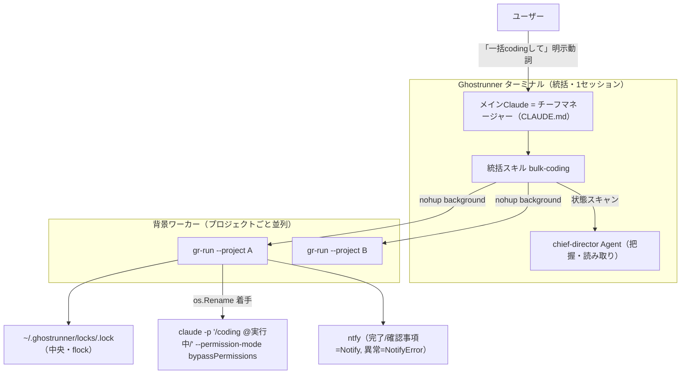
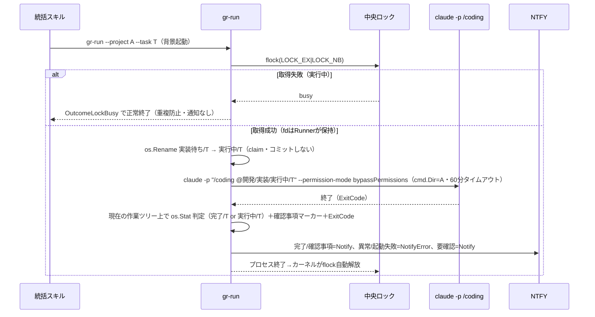

# 統括ターミナル Phase2（Layer2=一括/coding）実装計画

作成日: 2026-05-24
元検討: `開発/検討中/2026-05-24_複数プロジェクト統括ターミナル.md`（設計収束済み）
対象: Phase2 = Layer2（一括/coding）。Phase1（把握＝chief-director）は実装完了済み。
レビュー: go-plan-reviewer の Critical 3 / Warning 5 を反映済み（2026-05-24）。

## 1. 概要

複数プロジェクトを Ghostrunner ターミナルから一括で実装開始（一括/coding）できるようにする。
中核は新規 GoワンショットCLI `gr-run`（flock 重複防止 + 着手 claim + `claude -p "/coding"` 起動 + 終了コード分類 + ntfy）。
統括スキルが「実行中/ が空 ＆ 実装待ち/ にタスクあり」のプロジェクトだけ gr-run を背景起動でディスパッチする。

設計原則（検討書より）: 決まっていることは一括、決めることは個別対話。統括は1セッション（指揮官）、並列なのはワーカー（gr-run プロセス）。

## 2. 確定済みの設計判断

### 検討フェーズで決着（4論点）

- Q5 起動方法: 兼任型（明示動詞「一括codingして」が必須ゲート）
- gr-run 守備範囲: ロック + 起動 + 通知（着手 claim も込み・1プロセスに閉じる）
- 実行中/ 移動の担当: gr-run（着手: 実装待ち→実行中）＋ /coding（完了: 実行中→完了）
- ロック・状態の置き場所: ハイブリッド（状態=各プロジェクト、flock ロックのみ中央 `~/.ghostrunner/locks/`）

### 計画フェーズで決定（実装判断・レビュー反映後）

| # | 論点 | 決定 |
|---|------|------|
| 1 | gr-run ロジック配置 | 新規 `internal/grrun` パッケージ（service は常駐前提のため分離） |
| 2 | claude 起動方法 | `exec.CommandContext` 同期実行＋終了コード取得。**必須フラグ `--permission-mode bypassPermissions`**（claude.go と同じ。無いと非対話で権限を取れず無進行）。タイムアウト60分 |
| 3 | 着手 mv | **`os.Rename` のみ（git コミット/push はしない）**。claim はディスク上のファイル移動で成立（クラッシュしても物理的に実行中/ に残り chief-director がファイルで検知）。コミットすると /coding の `git checkout main && git pull`→feat 分岐と干渉し、main が実行中/ で固定・push 競合する（reviewer C2）。clean確認も不要 |
| 4 | ロックキー | `<プロジェクトベース名>-<絶対パスのsha256先頭12hex>.lock`（一覧で判別可＋衝突回避） |
| 5 | 通知の分類 | 完了/確認事項待ち=`Notify`、**異常終了・起動失敗=`NotifyError`**（把握は pull 型で即時性がないため push で補う）、要確認=`Notify`（情報。書式ずれの可能性を案内。誤検知温床のため NotifyError にしない） |
| 6 | CLI 引数 | `gr-run --project <絶対パス> --task <ファイル名> [--locks-dir]`（既定 `~/.ghostrunner/locks`） |
| 7 | 手動 /coding のカンバン挙動 | 手動でも中間列を通す。詳細は 5.2 |

## 3. 全体アーキテクチャ



## 4. バックエンド計画（gr-run / Go）

新規 GoワンショットCLI。`devtools/backend`、module `ghostrunner/backend`、go 1.24。
Clean Architecture（1ファイル200-400行・最大600行、インターフェースでDI、絵文字禁止、`log` 使用、エラーは `%w` ラップ）。新規外部依存ゼロ（`syscall.Flock` は stdlib）。

### 4.1 動作シーケンス



### 4.2 新規/変更ファイル（Go）

| ファイル | 区分 | 内容 |
|---------|------|------|
| `devtools/backend/cmd/gr-run/main.go` | 新規 | 薄いエントリ。`flag` 解析 → `Config` 構築 → `service.NewNtfyService()`（インターフェース型を返し未設定時は真の nil インターフェース＝typed-nil の落とし穴は無い）→ Notifier 注入 → `grrun.NewRunner` → `Run` → `os.Exit`。Runner 側は `notifier != nil` を確認してから通知（既存 service と同流儀） |
| `devtools/backend/internal/grrun/types.go` | 新規 | `Config` / `RunResult` / `Outcome` 定数 / パス定数（実装待ち・実行中・完了）/ 確認事項マーカー定数 / タイムアウト定数（60分） |
| `devtools/backend/internal/grrun/lock.go` | 新規 | `lockKey(projectPath)`、`AcquireLock(locksDir, projectPath) (*os.File, bool, error)`（MkdirAll→Open(O_CREATE)→`syscall.Flock(fd, LOCK_EX\|LOCK_NB)`。`EWOULDBLOCK` は busy=false、他は err。**取得した `*os.File` は呼び出し元=Runner のフィールドに保持し GC finalizer による早期 Close を防ぐ**） |
| `devtools/backend/internal/grrun/claim.go` | 新規 | `ClaimTask(projectPath, taskFile)`（実行中/ を MkdirAll → `os.Rename` 実装待ち→実行中。コミットしない）、`ClassifyResult(projectPath, taskFile, exitCode)`（**現在の作業ツリー上で `os.Stat` により 完了/・実行中/ の有無を確認＝ブランチ非依存**＋確認事項＋ExitCode で分類）、`hasUnansweredQuestion(planPath)`（確認事項マーカー grep） |
| `devtools/backend/internal/grrun/runner.go` | 新規 | `Notifier` 最小インターフェース、`Runner`（ロック `*os.File` を保持するフィールドを持つ）、`NewRunner`、`(*Runner) Run(ctx)`（ロック→claim→runClaude→分類→通知→`defer` でロック Unlock+Close）、`runClaude`（`exec.CommandContext` で `claude -p ... --permission-mode bypassPermissions` 同期実行。`cmd.Wait()` のエラーを `*exec.ExitError` に型アサートして ExitCode 取得。`cmd.Start()` 失敗＝バイナリ不在等は起動失敗 Outcome） |
| `devtools/backend/internal/grrun/*_test.go` | 新規 | `lockKey`/`ClaimTask`/`ClassifyResult`/`hasUnansweredQuestion`、flock 二重取得、`Notifier` モック注入のテーブル駆動テスト。**`hasUnansweredQuestion` のパターンが chief-director と同一であることを検証**（5.3） |

注: `internal/service/ntfy.go`（`NtfyService`・`NewNtfyService`）は**変更せず流用**。`grrun` 側に最小 `Notifier` インターフェースを定義し service への直接依存を避ける。`NewNtfyService` が nil を返す（NTFY未設定）場合は通知スキップ。`NewNtfyService` の戻り型はインターフェースなので未設定時は真の nil インターフェースになり、Runner 内の `notifier != nil` チェックで正しく判定できる。

### 4.3 結果分類（ClassifyResult・現在の作業ツリーで判定）

判定は **gr-run の `cmd.Dir`（プロジェクトルート）の現在チェックアウト中の作業ツリー上**で `os.Stat` により行う（ブランチは問わない＝claude が完了移動したブランチに居る前提。8章の既知ズレと関連）。

| ExitCode | ファイル位置 | 確認事項 | Outcome | 通知 |
|---------|-------------|---------|---------|------|
| 0 | 完了/ に存在 | - | `OutcomeCompleted` | Notify「完了」 |
| 任意 | 実行中/ に残存 | 未回答あり | `OutcomeWaitingAnswer` | Notify「確認事項」 |
| ≠0 | 実行中/ に残存 | なし | `OutcomeAbnormal` | NotifyError「異常終了」 |
| 0 | 実行中/ に残存 | なし | `OutcomeNeedsCheck` | Notify「要確認（書式ずれの可能性）」 |
| (cmd.Start失敗/バイナリ不在) | - | - | `OutcomeAbnormal` | NotifyError「起動失敗」 |
| (ロック取得失敗) | - | - | `OutcomeLockBusy` | なし（静かに終了） |

補足: `exec.CommandContext` のタイムアウト（60分）で SIGKILL された場合は `cmd.Wait()` が `*exec.ExitError` を返し ExitCode≠0 → 実行中/残存・確認事項なし → `OutcomeAbnormal`。

### 4.4 実装ステップ（依存順）

1. `types.go`: 型・定数・パス定数・タイムアウト定数
2. `lock.go`: flock 取得（fd 保持）・ロックキー
3. `claim.go`: 着手mv（os.Rename）・結果分類（os.Stat ベース）・確認事項スキャン
4. `runner.go`: Notifier IF・Runner（ロック fd 保持）・Run・runClaude（bypassPermissions・ExitError 取得・起動失敗処理）
5. `cmd/gr-run/main.go`: フラグ解析・Notifier nil ガード・組み立て
6. テスト（chief-director とのパターン一致検証含む）

## 5. スキル/設定計画

### 5.1 統括スキル（新規 `.claude/skills/bulk-coding/SKILL.md`）

役割: 「一括codingして」で発火し、対象プロジェクトを選定して gr-run を背景ディスパッチする。

手順（プラン記述。ロジック詳細は実装時）:
1. **状態スキャン**: `devtools/backend/patrol_projects.json` の `projects[]` を読む。各プロジェクトについて `実行中/*.md`（chief-director と同じ判定）と `実装待ち/*.md` を Glob。
2. **対象選定**: `実行中/` が空（=未着手で詰まっていない）＆ `実装待ち/` に1件以上、を満たすプロジェクトのみ対象。1プロジェクト＝同時1タスクなので、対象は各プロジェクトの `実装待ち/` の最古1件。
3. **ディスパッチ**: 対象ごとに gr-run を背景起動（会話を止めない）。**macOS は setsid 非標準のため使わず**、`nohup <gr-run絶対パス> --project <絶対パス> --task <ファイル名> </dev/null >/dev/null 2>&1 &` の後に zsh の `disown` で親セッションから切り離す。
4. **報告**: 起動したプロジェクト/タスク、スキップしたプロジェクト（実行中/ が空でない理由）を一覧表示。「完了・確認事項は ntfy 通知。状況は chief-director（『状況は？』）で確認」と案内。

注:
- 選定は統括スキル自身がフォルダを Glob して行う（prose 報告のパースは避ける）。chief-director は人間向け報告に併用可。
- gr-run の絶対パスは `devtools/backend/gr-run`（Makefile でビルド）に固定。SKILL に絶対パス算出方法（プロジェクトルートからの相対→絶対）を明記。

### 5.2 /coding スキルの修正（`.claude/skills/coding/SKILL.md`）

カンバン中間列対応（決定7）。手動実行（ファイルは `実装待ち/`）と gr-run 経由（ファイルは既に `実行中/`・**os.Rename のため untracked**）の両経路に対応する。

1. **開始時の着手移動を追加**（フェーズ0=ブランチ作成の直後）:
   - タスクファイルが `実装待ち/` にある場合（＝手動実行・引数が `@...実装待ち/...`）: `実行中/` へ移動。
   - 既に `実行中/` にある場合（＝gr-run 経由・引数が `@...実行中/...`）: 何もしない。
2. **完了移動の変更**（現状 [SKILL.md:294-298](.claude/skills/coding/SKILL.md#L294-L298) の `実装待ち/→完了/`）:
   - `実行中/<file>` を `完了/` へ移動する。
   - **重要**: gr-run 経由時 `実行中/<file>` は untracked（os.Rename）なので `git mv` は失敗する。よってカンバン移動は **plain `mv` で行い、コミット前に `git add` でステージ**する（手動時に git mv 済みのケースも吸収）。
   - **スコープ限定**: ステージは `開発/実装/` 全体（`-A 開発/実装/`）ではなく**当該タスクファイルのパスに限定**する（例: `git add -- "開発/実装/実装待ち/<file>" "開発/実装/実行中/<file>" "開発/実装/完了/<file>"`。存在しない側は無視される）。`-A 開発/実装/` だと他タスクの計画書・reporter のレポート出力等が完了コミットに混入するため。結果、feat ブランチのコミットは当該ファイルの「実装待ち/ 削除＋完了/ 追加」の net 差分になる。
3. **エスカレーションの確認事項化**（[SKILL.md:147,203,272](.claude/skills/coding/SKILL.md#L147)）:
   - 既存の「ユーザーに確認を求める」という対話的指示を、**「確認事項セクション（5.3 の正規形）に `未回答` で追記し、`実行中/` に残して停止する」へ置換**する（対話指示を残すと二重化するため新挙動に一本化）。
   - 理由: 非対話 `claude -p ... --permission-mode bypassPermissions` では AskUserQuestion による対話ができず、ユーザー応答が来ないままセッションが終わる。確実に確認事項を計画書へ書いてから停止しないと、質問が失われ 4.3 で `OutcomeNeedsCheck`（要確認）に落ちて気づかれにくい。追記して停止すれば把握(chief-director)で検知できる。

### 5.3 確認事項フォーマットの確立

chief-director が既にスキャンしている正規形を**唯一の真実源（SSOT）として1か所に定義**し、他は参照（リンク）に留める（書式ずれ＝誤分類の予防）。

- 正規フォーマット（計画書に追記される形）:
  ```
  ## 確認事項

  ### Q1: <質問の要約>
  **ステータス**: 未回答
  **背景**: <なぜ判断が要るか>
  **選択肢**: A) ... / B) ...
  **回答**: <回答済にする際にここへ記入>
  ```
- **バイト単位の規約**: `**ステータス**:` の太字必須、コロンは半角 `:`、コロン直後に半角スペース1個、値は厳密に `未回答` / `回答済`。対応する検出パターンは chief-director と同一の `\*\*ステータス\*\*:\s*未回答`。
- 回答後は `**ステータス**: 回答済` に変更し `**回答**:` を埋める（再起動時に文脈復元）。
- SSOT の置き場所: `.claude/` 配下の単一リファレンス（例 `.claude/agents/chief-director.md` の既存記述を正典とし、`/plan`・`/coding`・gr-run はそこを参照）。`/plan` スキルの出力規約に「確認事項は上記フォーマット」を追記、`/coding` のエスカレーション（5.2-3）がこの形で追記。
- gr-run の `hasUnansweredQuestion` と chief-director の正規表現が同一であることを **テストで担保**（パッケージが別で定数共有できないため）。
- MVP 範囲外: 回答後の**自動再起動**（手動で再度「一括codingして」または `/coding` で再開）。

### 5.4 CLAUDE.md チーフマネージャー節（`.claude/CLAUDE.md`）

既存「## 統括（把握）」節に続けて「## 統括（一括操作）」節を追記:

- **発火条件**: 「一括codingして」「実装待ちを一括で開始」等の**明示動詞**でのみ `bulk-coding` スキルを呼ぶ（把握=自動・読み取り との線引き）。
- **確認事項の取り次ぎ**: chief-director が未回答確認事項を検知 → ユーザーに噛み砕いて伝え（A案/B案）→ 回答を計画書に書き戻す（ステータスを `回答済` に）→ 必要なら再ディスパッチ。
- **状態変更は明示指示のみ**（既存原則を一括操作にも適用）。

## 6. 変更/新規ファイル一覧（全体）

| ファイル | 区分 |
|---------|------|
| `devtools/backend/cmd/gr-run/main.go` | 新規(Go) |
| `devtools/backend/internal/grrun/{types,lock,claim,runner}.go` | 新規(Go) |
| `devtools/backend/internal/grrun/*_test.go` | 新規(Go test) |
| `Makefile` | 修正（gr-run ビルドターゲット追加。出力先 `devtools/backend/gr-run`） |
| `.claude/skills/bulk-coding/SKILL.md` | 新規(スキル) |
| `.claude/skills/coding/SKILL.md` | 修正（着手移動追加・完了移動を plain mv+add -A に変更・エスカレーション確認事項化） |
| `.claude/skills/plan/SKILL.md` | 修正（確認事項フォーマット規約の参照追記） |
| `.claude/CLAUDE.md` | 修正（統括（一括操作）節の追記） |
| `.claude/agents/chief-director.md` | 確認事項フォーマット SSOT の正典化（既存記述を正式リファレンス化） |

## 7. スコープ

含む（MVP）: 上記 4・5 すべて（gr-run / 統括スキル / coding修正 / 確認事項フォーマット / CLAUDE.md節）。
含まない（次フェーズ）:
- 異常終了の自動・半自動解消（ディレクター調査・人間トリガー）
- 確認事項回答後の自動再起動オーケストレーション
- SSE/ダッシュボード連携
- 並列スロット数の動的制御・優先度付け

## 8. 既知の制約・残細目（ブロッカーではない）

- gr-run は着手 mv をコミットしないため、claude -p `/coding` 起動時の作業ツリーは「実装待ち→実行中 の未コミット rename」を含む dirty 状態で始まる。/coding フェーズ0の `git checkout main && git pull` はこの未コミット変更を保持したまま feat を切る（リモートが同ファイルを変更していた場合のみ稀に pull 競合の可能性）。完了は feat 上で plain mv + `git add -A` によりコミットされ、net で 実装待ち→完了 になる。
- 完了は feat ブランチ上。main へは /stage → /release で反映。よって一括/coding 完了直後は main 上では `実行中/` のまま、feat 上で `完了/`（4.3 の判定は現在ツリー＝feat を見るので完了判定は成立）。MVP では許容（自動 stage/release は対象外）。
- 並列スロット上限: 統括スキルが起動する gr-run 個数の上限（未設定なら全対象を同時起動）。運用で調整。
- ロックキーのハッシュは sha256 先頭12hex（衝突は事実上不要だが要注意点として記録）。

## 9. テストプラン

test-planner 確定（2026-05-24）。方針: **Go の `internal/grrun` の純粋ロジックに絞って必要十分に。** `claude -p` の実起動・flock の OS 挙動・通知の HTTP/desktop 送信はモック化または抽象化で切り離す。スキル/設定の markdown 変更は自動テスト対象外とし、手動検証の観点として列挙する。

### 9.0 リスク分析サマリ

| 対象 | リスク | 理由 | テスト |
|------|-------|------|--------|
| `ClassifyResult`（4.3 分類表） | 高 | 6 分類の分岐が密。誤分類は誤通知・気づかれない停止に直結 | unit 必須（全行網羅） |
| `hasUnansweredQuestion` | 高 | 書式ゆれ検出ミス＝確認事項待ちが異常終了に化ける。chief-director と SSOT 一致が要 | unit 必須＋パターン同一性テスト |
| `AcquireLock`（二重取得） | 高 | 重複防止の中核。壊れると二重 /coding | unit 必須 |
| `lockKey` | 中 | 衝突・不安定キーでロックが効かない | unit 推奨 |
| `ClaimTask` | 中 | 着手 mv 失敗の扱い。ただし os.Rename 自体は stdlib 保証 | unit 推奨（移動結果と異常系のみ） |
| `Runner.Run`（配線） | 中 | Outcome→Notify/NotifyError の対応付け。runClaude 抽象化が前提 | unit 推奨（runClaude 差し替え可能なら） |
| `main.go` フラグ解析・nil ガード | 低 | 薄いエントリ。flag は stdlib 保証 | テスト不要（手動 smoke で足りる） |
| ntfy `NtfyService` 本体 | 対象外 | 既存・未変更（ntfy_test.go で担保済み） | テストしない |
| スキル/CLAUDE.md/Makefile | 対象外 | markdown・ビルド定義。自動ユニットに馴染まない | 手動検証（9.5） |

### 9.1 テストケース一覧（Go / `internal/grrun/*_test.go`）

テーブル駆動・`t.Run` サブテスト・`t.TempDir()` でファイルシステムを隔離（既存 patrol_test.go と同流儀）。

#### lock_test.go — `lockKey`

| # | 観点 | 入力 | 期待 | 区分 |
|---|------|------|------|------|
| 1 | 安定性 | 同一絶対パスを2回 | 同一キー | 正常 |
| 2 | 衝突回避 | 異なる2パス（ベース名同一・ディレクトリ違い含む） | 異なるキー | 正常 |
| 3 | 形式 | 任意パス | `<ベース名>-<sha256先頭12hex>.lock`（hex 12桁・末尾 `.lock`）に一致 | 正常 |

> 注: ハッシュ値そのものの固定値比較はしない（実装詳細への過結合）。形式と安定性・差異のみ検証。

#### lock_test.go — `AcquireLock`

| # | 観点 | 入力 | 期待 | 区分 |
|---|------|------|------|------|
| 1 | 取得成功 | 空の一時 locksDir + パスA | `*os.File` 非 nil・ok=true・err=nil | 正常 |
| 2 | locksDir 自動作成 | 存在しない locksDir パス | MkdirAll され取得成功 | 正常 |
| 3 | 二重取得（同一パス・同一プロセス内） | 1 を保持したまま再取得 | ok=false・err=nil（busy） | 異常（重複防止の核） |
| 4 | 別パスは独立 | パスA保持中にパスB取得 | ok=true（互いに干渉しない） | 正常 |
| 5 | 解放後の再取得 | 1 の fd を Close 後に再取得 | ok=true | 正常 |

> flock は同一プロセス・同一 fd を介してもロックされるよう、別 fd（再 Open）で `LOCK_EX|LOCK_NB` を試す形でテストする。EWOULDBLOCK→busy の分岐を踏ませることが目的。

#### claim_test.go — `ClaimTask`

| # | 観点 | 状態 | 期待 | 区分 |
|---|------|------|------|------|
| 1 | 正常着手 | `実装待ち/T.md` 存在・`実行中/` 無し | `実行中/T.md` に移動・`実装待ち/T.md` 消失・`実行中/` 自動作成 | 正常 |
| 2 | 実行中既存 | `実行中/` が既に存在 | エラーなく移動成功（MkdirAll 冪等） | 正常 |
| 3 | 移動元不在 | `実装待ち/T.md` 無し | エラー返却（`%w` ラップ） | 異常 |

#### claim_test.go — `ClassifyResult`（4.3 全行網羅・最重要）

`t.TempDir()` 上に `開発/実装/{完了,実行中}/T.md` を配置し os.Stat ベース判定を再現。確認事項マーカーは計画書本文を書き分ける。

| # | ExitCode | ファイル配置 | 計画書の確認事項 | 期待 Outcome | 区分 |
|---|---------|-------------|-----------------|--------------|------|
| 1 | 0 | 完了/ に存在 | - | `OutcomeCompleted` | 正常 |
| 2 | 0 | 実行中/ 残存 | `未回答` あり | `OutcomeWaitingAnswer` | 正常 |
| 3 | ≠0（例 1） | 実行中/ 残存 | `未回答` あり | `OutcomeWaitingAnswer`（確認事項優先＝ExitCode 任意） | 境界 |
| 4 | ≠0（例 1） | 実行中/ 残存 | なし | `OutcomeAbnormal` | 異常 |
| 5 | 0 | 実行中/ 残存 | なし | `OutcomeNeedsCheck` | 境界 |
| 6 | ≠0（例 137=SIGKILL相当） | 実行中/ 残存 | なし | `OutcomeAbnormal`（タイムアウト SIGKILL の代理） | 異常 |

> 「ロック busy」「cmd.Start 失敗（起動失敗）」は ClassifyResult の入力に至らず Runner 側の分岐（9.1 Runner）でカバーするため、ここでは扱わない。重複させない。

#### claim_test.go — `hasUnansweredQuestion`（SSOT 担保・最重要）

5.3 のバイト単位規約を検証。chief-director（`.claude/agents/chief-director.md:37`）と同一の `\*\*ステータス\*\*:\s*未回答` であること。

| # | 観点 | 計画書本文 | 期待 | 区分 |
|---|------|-----------|------|------|
| 1 | 正規形 検出 | `**ステータス**: 未回答` | true | 正常 |
| 2 | 回答済 非検出 | `**ステータス**: 回答済` | false | 正常 |
| 3 | 複数 Q 混在 | 1件 回答済＋1件 未回答 | true | 正常 |
| 4 | 太字なし 非検出 | `ステータス: 未回答`（`**` 無し） | false（文章説明の誤検知防止） | 境界 |
| 5 | 値ゆれ 非検出 | `**ステータス**: 未 回答`（全角空白/分割） | false | 境界 |
| 6 | コロン直後スペース許容 | `\s*` の許容範囲（スペース0個/複数） | true | 境界 |
| 7 | ファイル不在 | 計画書パスが無い | false・エラーにしない（前方互換） | 異常 |
| 8 | **SSOT 一致** | chief-director.md:37 から正規表現リテラルを読み取り、grrun が使う定数と文字列一致を検証 | 一致 | 必須 |

> #8 は「パッケージが別で定数共有できない」（5.3）ことへの担保。chief-director.md をテスト内で Read し、`\*\*ステータス\*\*:\s*未回答` の出現を確認、grrun 側の正規表現定数と突き合わせる。どちらかを変えたら落ちるようにする。

#### runner_test.go — `Runner.Run`（Notifier モック注入）

`runClaude` を **インターフェース化または関数フィールドで差し替え可能**にし（9.2）、claude 実起動なしで各 Outcome を注入。Notifier はテスト用 struct（既存 patrolMockNtfyService 同様、呼び出しを記録）。

| # | 注入する Outcome 相当 | 期待する通知 | 区分 |
|---|----------------------|-------------|------|
| 1 | 完了 | `Notify` が1回（NotifyError は0回） | 正常 |
| 2 | 確認事項待ち | `Notify` が1回 | 正常 |
| 3 | 異常終了 | `NotifyError` が1回 | 異常 |
| 4 | 要確認 | `Notify` が1回 | 境界 |
| 5 | 起動失敗（runClaude が start エラー相当） | `NotifyError` が1回・claim 後でも安全に終了 | 異常 |
| 6 | ロック busy（AcquireLock が busy） | 通知0回・正常終了（静かに終了） | 境界 |
| 7 | Notifier=nil | パニックせず通知スキップ（`notifier != nil` ガード） | 境界 |

> 過剰回避: 通知の title/message 文言の厳密一致まではテストしない（文言は変わりやすく価値が低い）。検証は「どちらのメソッドが何回呼ばれたか」に絞る。#6 のロック取得は実 flock を一時 locksDir で踏ませてよい（busy は別 fd で先取りして再現）。

### 9.2 モック / 抽象化方針

- **runClaude（claude -p 実起動）**: Runner から呼ぶ実行部分を差し替え可能にする。推奨は Runner に「コマンド実行関数」を関数フィールド or 小さなインターフェースとして持たせ、本番は `exec.CommandContext(... bypassPermissions ...)`、テストは ExitCode を返すスタブを注入。実 `claude` バイナリにはテストで一切依存しない。
- **flock（AcquireLock）**: 抽象化しない。`t.TempDir()` を locksDir にして **実 `syscall.Flock` を踏ませる**（OS 挙動こそが検証対象。モックすると二重取得バグを取り逃がす）。busy 再現は同一キーを別 fd で先に確保。
- **Notifier**: 最小インターフェースに対しテスト用 struct（呼び出し記録）を注入。HTTP/desktop 送信（既存 ntfy）はこのテストの対象外。
- **ファイルシステム**: すべて `t.TempDir()` 配下に `開発/実装/{実装待ち,実行中,完了}/` を組み立てて隔離。本物のプロジェクトには触れない。
- **時間**: 60分タイムアウトの実時間は待たない。タイムアウトの結果（SIGKILL→ExitCode≠0）は ClassifyResult #6 で代理検証。

### 9.3 テストしない判断（過剰回避）

- `cmd/gr-run/main.go` のフラグ解析・組み立て: `flag` は stdlib、配線は薄い。誤りは 9.5 の手動 smoke（実 1 プロジェクトで起動）で十分検出できる。unit を書く価値が低い。
- `types.go` の定数・パス定数・getter 類: 値の受け渡しのみ。テストしない。
- `NtfyService` 本体（HTTP POST・terminal-notifier）: 既存・未変更。`ntfy_test.go` が担保済み。再テストしない。
- 通知文言の厳密一致: 変わりやすく壊れやすいだけで守備価値が低い。呼び出し有無/回数で代替。
- ロックキーのハッシュ固定値: 実装詳細。形式・安定性・差異のみで足りる。

### 9.4 テスト実行手順

```bash
cd devtools/backend
go test ./internal/grrun/...          # 新規パッケージのテスト
go test ./...                         # 全体（既存を壊していないこと）
go test -cover ./internal/grrun/...   # カバレッジ確認（目標 80%以上）
```

### 9.5 手動検証（スキル/設定の markdown・Makefile 変更）

自動テスト対象外。実装後に以下を手で確認する。

| # | 対象 | 手順 | 合格条件 |
|---|------|------|---------|
| 1 | Makefile `gr-run` ビルド | `make`（該当ターゲット） | `devtools/backend/gr-run` が生成・実行可能 |
| 2 | gr-run smoke（正常） | 実装待ちに1件あるテストプロジェクトで `gr-run --project <絶対> --task <file>` | claim で実行中/ へ移動・/coding 起動・完了 or 確認事項で ntfy |
| 3 | gr-run 二重起動 | 同一プロジェクトに gr-run を2連続起動 | 2つ目が `OutcomeLockBusy` で静かに終了（通知なし）・二重 /coding が起きない |
| 4 | bulk-coding スキル選定 | 「一括codingして」発火 | 実行中/ 空＆実装待ち有のプロジェクトのみ最古1件をディスパッチ・他はスキップ理由付きで報告 |
| 5 | bulk-coding 明示動詞ゲート | 把握系の問いかけ（「状況は？」） | bulk-coding が発火しない（chief-director のみ） |
| 6 | /coding 着手移動 | 手動 `@実装待ち/...` と gr-run 経由 `@実行中/...` 両経路 | 手動は実装待ち→実行中、gr-run 経由は二重移動しない |
| 7 | /coding 完了移動 | gr-run 経由（実行中/ が untracked）で完了 | plain mv＋当該パス限定 `git add` でコミット・他タスクの差分が混入しない |
| 8 | /coding エスカレーション | 判断が要る状況で非対話実行 | 正規形 `**ステータス**: 未回答` で計画書に追記して停止（対話を待たない） |
| 9 | 確認事項 SSOT 整合 | chief-director / gr-run / /plan / /coding を横断 | 同一フォーマット参照・chief-director で未回答が検知できる |

### 9.6 まとめ

| 項目 | 数 |
|------|---|
| テストファイル | 3（lock_test.go / claim_test.go / runner_test.go） |
| テストケース（概算） | 約 29（lockKey 3・AcquireLock 5・ClaimTask 3・ClassifyResult 6・hasUnansweredQuestion 8・Run 7、うち SSOT 一致1） |
| 手動検証項目 | 9 |
| 推定実装規模 | 中（runClaude の差し替え抽象化が要・他は素直なテーブル駆動） |

**コア担保**: ClassifyResult 全行網羅・二重ロック・hasUnansweredQuestion の SSOT 一致。この3点が崩れると「誤通知」「二重実行」「確認事項の取り逃がし」という本番影響に直結するため必須。それ以外は手動 smoke で必要十分とする。
