# even-terminal ポート固有化（G2 ホストズレ根本対策）実装計画

## 概要

検討書 `開発/検討中/2026-05-28_even-terminalポート固有化.md`（MVP+ スコープ確定済み）に基づく実装計画。

`make g2-all` の **index 連番ポート割当**が G2 アプリのホストズレを生んでいた。新規プロジェクトは `/init` 時に even-terminal ポート（`4xxx`・下3桁共通）を `.claude/ports.json`（台帳）に記録し、`make g2-all` がそれを読むことで、生成時点からポートが固定されズレが起きないようにする。既存 x-liker は台帳を1つ手で置いて恒久固定する。

## スコープ（MVP+・確定済み）

### 範囲内
1. `/init` 改修：ポート生成に `PORT_EVEN_TERMINAL=4${PORT_SUFFIX}` 追加、予約除外に `4040, 4444` 追加、`.claude/ports.json` 生成
2. ポート決定ロジックを共通 python スクリプト（新規）に切り出し
3. `make g2-all` / `g2-qr` / `stop-g2-all` を共通スクリプト利用に改修（台帳優先・なければ index 連番フォールバック）
4. x-liker に `.claude/ports.json` を手で配置（恒久固定）

### 範囲外（検討書の判断どおり）
- 既存プロジェクトの一斉移行（x-liker 以外は触らない＝従来の index 連番のまま）
- `loader.go` / `patrol_projects.json` の schema 拡張（make g2-all が直接 `.claude/ports.json` を読むため Go 側は介さない）
- G2 アプリ側の登録挙動改善（Ghostrunner 外）

## アーキテクチャ

```mermaid
flowchart TD
    subgraph init["/init (新規プロジェクト生成)"]
        GEN["ポート生成<br/>4&#36;{PORT_SUFFIX}"]
        PORTS["&lt;project&gt;/.claude/ports.json<br/>{backend, frontend, even_terminal, ...}"]
        GEN --> PORTS
    end

    subgraph make["make g2-all / g2-qr / stop-g2-all"]
        RESOLVE["scripts/g2_resolve_ports.py"]
        PATROL["patrol_projects.json<br/>(path + name)"]
        RESOLVE --> PATROL
        RESOLVE -->|"各 path の"| PORTS2["&lt;path&gt;/.claude/ports.json"]
        RESOLVE -->|"台帳なし→"| FALLBACK["index 連番 3456+i"]
    end

    PORTS -.->|"新規は最初から台帳あり"| PORTS2
```



## 変更ファイル一覧

| # | ファイル | 変更内容 | 新規/修正 |
|---|---------|---------|:---:|
| 1 | `scripts/g2_resolve_ports.py` | patrol_projects.json を読み、各プロジェクトの `<port> <name> <path>` を1行ずつ出力。台帳優先・index 連番フォールバック | 新規 |
| 2 | `Makefile` | `g2-all` / `g2-qr` / `stop-g2-all` を共通スクリプト利用に改修。QR 表示にポート併記。help テキスト更新 | 修正 |
| 3 | `.claude/skills/init/SKILL.md` | Step 4 にポート生成 (`PORT_EVEN_TERMINAL`) + 予約 (`4040, 4444`) 追加。Step 7 で `.claude/ports.json` 生成 | 修正 |

※ x-liker への `.claude/ports.json` 配置は Ghostrunner リポジトリ外（x-liker 側）のため、変更ファイル一覧には含めず「適用手順」として後述。

## 実装ステップ（依存順）

### Step 1: 共通ポート解決スクリプト（新規）

**対象**: `scripts/g2_resolve_ports.py`（新規）

**役割**:
- 入力: `patrol_projects.json` のパス（引数 or 固定パス）
- 出力: 各プロジェクトにつき `<port> <name> <path>` を標準出力に1行ずつ
- ポート決定順（フォールバック）:
  1. `<path>/.claude/ports.json` が存在し `even_terminal` キーがあればその値
  2. なければ `index + 3456`（index 連番フォールバック）
- 不正な JSON・読み取り失敗時は index 連番にフォールバック（例外で全体を止めない）

**設計判断**:
- Makefile 内 1行 python ではなく独立スクリプトにする理由: `g2-all` / `g2-qr` / `stop-g2-all` の3箇所で同じロジックを使うため DRY 化。可読性・保守性も向上
- 出力フォーマットは既存 `make g2-all`（`<port> <name> <path>`）を踏襲し、Makefile 側の `while read` 構造を変えない

### Step 2: Makefile の g2 系ターゲット改修

**対象**: `Makefile`（`g2-all` 177-200 / `stop-g2-all` 202-206 / `g2-qr` 217-230）

**修正内容**:
- **g2-all**: 現状の 1行 python（`{i+3456}`）を `python3 $(PROJECT_ROOT)/scripts/g2_resolve_ports.py` 呼び出しに置換。出力を `/tmp/g2-all-projects.txt` に保存して既存の `while read PORT NAME PROJECT_PATH` 構造はそのまま利用。QR 表示行にプロジェクトパスを併記
- **g2-qr**: 現状は name のみ取得。共通スクリプトから `<port> <name> <path>` を取得し、`===== $NAME 接続 QR (:$PORT) =====` のようにポート併記。ログファイル名は従来どおり `/tmp/even-terminal-$NAME.log`
- **stop-g2-all**: 共通スクリプトが出すポート群を停止対象にする。加えて**旧固定範囲 3456〜3462 も停止対象として残す**（移行期互換・検討書の判断どおり）
- **help**: `make g2-all` / `g2-qr` の説明に「.claude/ports.json があれば固有ポートを使用」の旨を1行補足

**設計判断**:
- stop-g2-all の停止対象 = 「台帳/index で解決したポート群」∪「旧固定範囲 3456-3462」。台帳で 4xxx に移ったプロジェクトと、まだ index 連番の既存プロジェクトの両方を確実に止める

### Step 3: /init SKILL.md の改修

**対象**: `.claude/skills/init/SKILL.md`

**修正内容（Web フロー）**:
- **Step 4.1（ポート生成）**:
  - `PORT_EVEN_TERMINAL=4${PORT_SUFFIX}` を追加
  - 予約済みポートリスト（現状 8080, 8888, 3000, 3333, 5432, 9000, 9001, 6379）に `4040, 4444` を追加
  - 使用中チェック（`lsof -ti:`）の対象に `${PORT_EVEN_TERMINAL}` を追加
- **Step 7（`.claude/ 資産の生成`）**:
  - `.claude/` ディレクトリ作成後、`.claude/ports.json` を生成するブロックを追加
  - 含めるキー:
    - 必須: `backend`, `frontend`, `even_terminal`
    - PostgreSQL 選択時のみ: `db`
    - ストレージ選択時のみ: `minio`, `minio_console`
    - Redis 選択時のみ: `redis`
  - 選択オプションに応じてキーを出し分ける（実行する AI が選択結果に基づき JSON を構築）

**注意点**:
- macOS フロー（Swift）はポート概念が薄く even-terminal 連携も別問題なので、本計画では Web フローのみ対象（Swift フローは範囲外）
- `PORT_EVEN_TERMINAL` は Step 4 で定義され、Step 7 まで同一実行コンテキストで生きている前提（既存の `${PORT_DB}` 等が Step 5 で使われているのと同型）

### Step 4: x-liker への台帳配置（適用手順・Ghostrunner 外）

**対象**: `/Users/user/x-liker/.claude/ports.json`（新規・x-liker リポジトリ側）

**内容**:
```json
{
  "backend": 8909,
  "frontend": 3909,
  "even_terminal": 4909
}
```

**設計判断**:
- `even_terminal` のみで make g2-all は動くが、台帳の一貫性・将来の参照性のため backend/frontend も記載（値は x-liker の Makefile から確認済み: 8909/3909）
- x-liker は別 git リポジトリのため、Ghostrunner のコミットには含めない。配置後、x-liker 側でコミットするかはユーザー判断

## 設計判断まとめ

| 判断 | 選択 | 理由 |
|-----|------|------|
| ポート決定ロジックの配置 | 共通 python スクリプト（`scripts/g2_resolve_ports.py`） | 3 ターゲットで使うため DRY・可読性 |
| make g2-all フォールバック | 台帳優先 → なければ index 連番 | 既存プロジェクトを無改修で動かす（後方互換）。検討書判断1 |
| stop-g2-all 停止対象 | 解決ポート群 ∪ 旧固定範囲 3456-3462 | 移行期に新旧どちらのポートも確実に停止 |
| x-liker 台帳の内容 | backend/frontend/even_terminal 全て | 台帳の一貫性・将来参照性 |
| Swift フロー | 範囲外 | ポート概念が薄く even-terminal 連携も別問題 |

## 確認事項

なし（スコープ・設計判断ともに検討フェーズ + 本計画の推奨で確定済み）。

## 検証手順（手動）

### 1. 共通スクリプト単体動作

```bash
# patrol_projects.json を入力にポート解決
python3 scripts/g2_resolve_ports.py devtools/backend/patrol_projects.json
# 期待: 各プロジェクトの <port> <name> <path> が1行ずつ。
#       x-liker(台帳配置後)は 4909、台帳なしのプロジェクトは 3456+index
```

### 2. /init での新規プロジェクト生成

```bash
# Ghostrunner で /init test-evenport を実行
cat ~/test-evenport/.claude/ports.json
# 期待: { "backend": 8XXX, "frontend": 3XXX, "even_terminal": 4XXX } で下3桁が一致
```

### 3. make g2-all での固有ポート起動

```bash
# x-liker に .claude/ports.json を配置後
make stop-g2-all
make g2-all
lsof -nP -iTCP -sTCP:LISTEN | grep ":4909"   # x-liker が 4909 で起動
make g2-qr                                    # QR 表示にポート(:4909)が併記される
```

### 4. G2 アプリでの再登録確認

```bash
# G2 アプリで x-liker を削除 → make g2-qr の x-liker QR(:4909) を再スキャン
# 開いて session の cwd が /Users/user/x-liker であることを確認
```

### 5. 既存プロジェクトの後方互換確認

```bash
# 台帳のない既存プロジェクト(face-search 等)が従来の index 連番で起動することを確認
make g2-status
```

## リスクと注意事項

| リスク | 対応 |
|---|---|
| 共通スクリプトの JSON 読み取り失敗で全体が止まる | スクリプト内で例外を握りつぶし index 連番にフォールバック。1プロジェクトの台帳破損が他に波及しない |
| 4xxx 予約ポート衝突（4040 yandex, 4444 krb524） | SKILL.md の予約リストに追加 + `/init` の lsof チェック |
| 台帳ポートと index 連番の混在による衝突 | ポート番号帯が異なる（4xxx vs 3456-34xx）ため衝突しない |
| Swift プロジェクトに even-terminal 概念がない | Web フローのみ対象とし Swift フローは触らない |
| x-liker 再登録の手動工数 | 1プロジェクトのみ。make g2-qr で QR 再表示できる |

## テスト方針

本タスクの変更対象は **Makefile / python スクリプト / SKILL.md（markdown）/ JSON** のみで、Go/TypeScript の自動テスト対象コードは含まない。よって自動テスト（unit/integration）は作成せず、上記「検証手順（手動）」で品質を担保する。

- python スクリプトは「検証手順 1」で入出力を実機確認（台帳あり→4909、台帳なし→index 連番、JSON 破損→フォールバック）
- /init 改修は「検証手順 2」で生成物（`.claude/ports.json`）を確認
- Makefile 改修は「検証手順 3〜5」で実機の起動・停止・QR 表示を確認

**自動テストを作らない根拠**: test-planner の対象（Go/TS のロジック）が存在しない。Makefile/shell/JSON のロジックは分岐も少なく、手動実機検証の ROI が高い。

## まとめ

| 項目 | 数 |
|------|---|
| 新規ファイル | 1（`scripts/g2_resolve_ports.py`） |
| 修正ファイル | 2（`Makefile`, `.claude/skills/init/SKILL.md`） |
| Ghostrunner 外の適用 | 1（x-liker の `.claude/ports.json`） |
| 自動テスト | 0（手動検証 5 ステップ） |
| 推定実装時間 | 小〜中（1-2 時間） |
