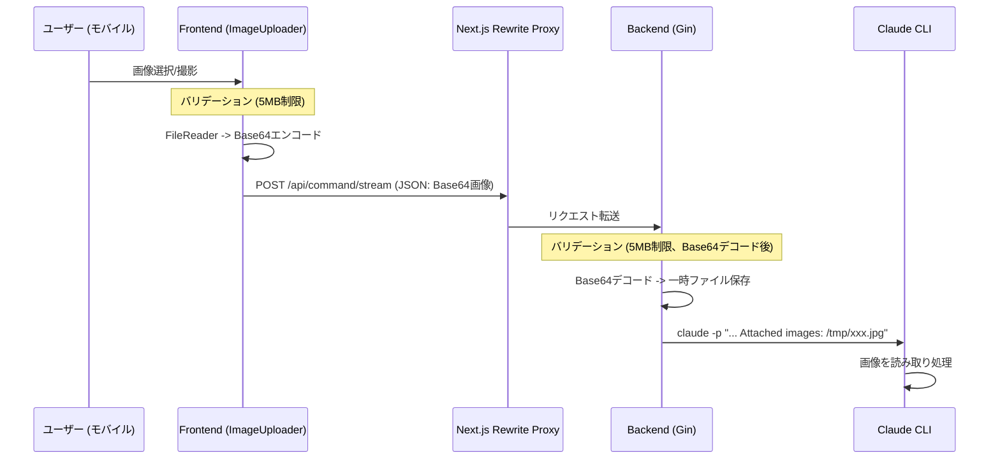
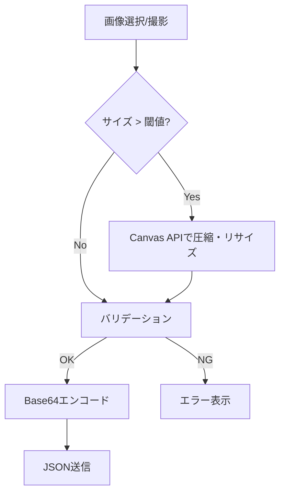
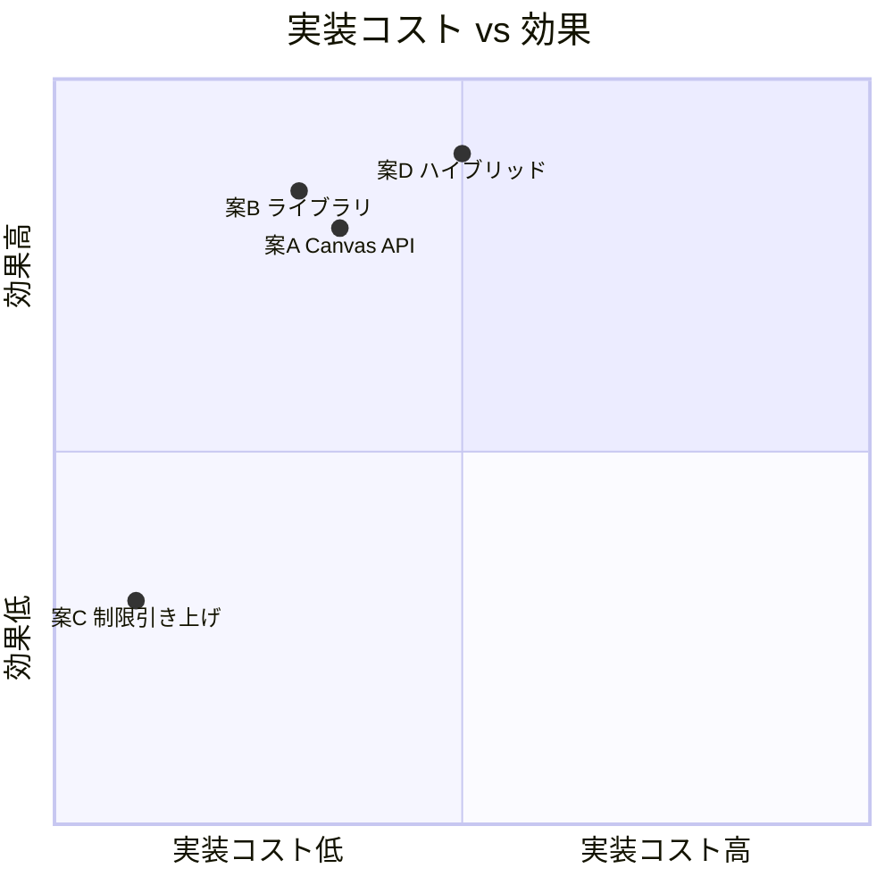
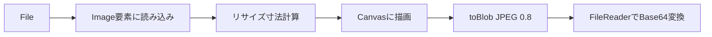
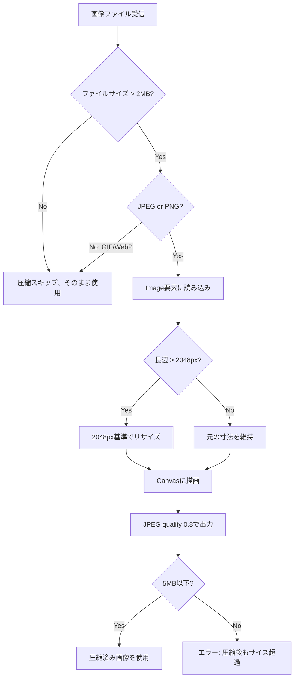

# 検討結果: 画像サイズ制限緩和

## 検討経緯

| 日付 | 内容 |
|------|------|
| 2026-01-27 | 初回相談: モバイル撮影画像が5MB制限に引っかかりアップロードできない問題 |

## 背景・目的

ImageUploaderコンポーネントでスマートフォンのカメラ撮影画像をアップロードする際、現行の5MB制限に引っかかって実用上の問題が発生している。スマートフォンのカメラは通常5MB〜15MB程度のJPEGを生成するため、撮影した写真をそのままアップロードできないケースが多い。

画像の最終用途はClaude CLIに一時ファイルとして渡すだけであり、高解像度の元画像が必要なケースは少ない。適切な圧縮・リサイズにより、品質を大きく損なわずにサイズを削減できる。

## 対象ユーザー

モバイルデバイスからカメラ撮影した画像を添付して指示を送りたいユーザー

## 解決する課題

- スマートフォンカメラの撮影画像（5〜15MB）がアップロードできない
- 現在は事前にリサイズツール等で加工する手間が必要
- カメラ撮影ゾーンを追加したのに、撮影した写真が使えないという矛盾

## 現在のアーキテクチャ

### 現在の制約ポイント

| 箇所 | 制限 | 定義場所 |
|------|------|----------|
| フロントエンド | `MAX_SIZE_BYTES = 5 * 1024 * 1024` | `ImageUploader.tsx` L7 |
| バックエンド | `MaxImageSize = 5 * 1024 * 1024` | `service/types.go` L61 |
| Gin デフォルト | リクエストボディ制限なし（明示的設定なし） | `main.go` |
| Next.js Proxy | rewrite設定のみ、サイズ制限なし | `next.config.ts` |

### Base64オーバーヘッド

画像はBase64エンコードしてJSON本文に含めて送信している。Base64は元データの約1.33倍のサイズになるため、5枚の画像を送る場合のリクエストボディは最大で `5MB * 5枚 * 1.33 = 33.3MB` に達しうる。

## 選択肢の検討

### 案A: フロントエンドで画像圧縮（Canvas API）

- 概要: ブラウザのCanvas APIを使い、アップロード前に画像をリサイズ・圧縮する。外部ライブラリ不要。
- 処理フロー: `File -> Image -> Canvas (リサイズ) -> canvas.toBlob(JPEG, quality) -> Base64`
- リサイズ目標: 長辺2048px以下、JPEG quality 0.8程度で1〜2MB程度に収まる
- メリット:
  - 外部依存なし（ブラウザ標準API）
  - バンドルサイズ増加ゼロ
  - フロントエンドのみの変更で完結可能
  - ネットワーク転送量も削減
- デメリット:
  - Canvas APIはEXIF情報（回転情報等）を自動処理しない場合がある（ただし最近のブラウザは対応済み）
  - PNG透過画像をJPEGに変換すると透過が失われる
  - GIF/WebPの変換には制約がある
  - 実装がやや煩雑（リサイズロジック、非同期処理）
- 工数感: 小

### 案B: フロントエンドで画像圧縮（browser-image-compression）

- 概要: `browser-image-compression` ライブラリを使い、アップロード前に自動圧縮する。
- 処理: `File -> compress(file, options) -> compressedFile -> Base64`
- メリット:
  - EXIF回転の自動処理
  - Web Worker対応（UIブロック回避）
  - maxSizeMB / maxWidthOrHeight の宣言的な指定が可能
  - 実装が簡潔
- デメリット:
  - 外部依存の追加（約40KB gzipped）
  - ライブラリのメンテナンス状況への依存
- 工数感: 小

### 案C: サイズ制限を引き上げるのみ

- 概要: フロントエンド・バックエンドの制限値を20MBに引き上げる。
- メリット:
  - 変更箇所が2か所のみ（定数変更）
  - 実装が最もシンプル
  - 画質劣化なし
- デメリット:
  - ネットワーク転送量が大きい（Base64で最大133MB: 20MB * 5枚 * 1.33）
  - モバイル回線ではアップロードに時間がかかる
  - Ginのデフォルトボディサイズ制限に抵触する可能性
  - メモリ使用量が増大（Base64デコード時にバックエンドで大量メモリ消費）
  - 根本的解決にならない（将来さらに高解像度カメラが登場）
- 工数感: 極小

### 案D: ハイブリッド（フロントエンド圧縮 + バックエンド制限引き上げ）

- 概要: フロントエンドで圧縮を行いつつ、バックエンドの制限も適度に引き上げる（10MB程度）。
- 処理フロー:

- メリット:
  - 通常のケースは圧縮で対応（高速アップロード）
  - 圧縮後も制限を超えるエッジケースに対応
  - 安全マージンがある
- デメリット:
  - フロントエンド + バックエンド両方の変更が必要
  - やや過剰設計
- 工数感: 小〜中

## トレードオフ比較

| 観点 | 案A: Canvas API | 案B: ライブラリ | 案C: 制限引上げ | 案D: ハイブリッド |
|------|:-:|:-:|:-:|:-:|
| 実装の簡潔さ | 中 | 高 | 最高 | 中 |
| 外部依存 | なし | あり | なし | なし/あり |
| 転送量削減 | あり | あり | なし | あり |
| 画質維持 | 高 | 高 | 最高 | 高 |
| エッジケース対応 | 中 | 高 | 低 | 最高 |
| 将来対応力 | 高 | 高 | 低 | 最高 |
| バックエンド変更 | 不要 | 不要 | 必要 | 必要 |

## MVP提案

**推奨案: 案A（Canvas APIによるフロントエンド圧縮）**

外部依存を追加せず、フロントエンドのみの変更で完結する案Aを推奨する。

### 推奨理由

1. **外部依存ゼロ**: `package.json` に新しい依存を追加しない
2. **フロントエンドのみ**: バックエンドの変更が不要で影響範囲が小さい
3. **転送量削減**: 圧縮により通信時間も短縮される
4. **Claude CLIの用途に十分**: AIが画像を認識するだけなら2048px・JPEG quality 0.8で十分すぎる品質
5. **EXIF回転**: 2024年以降のモバイルブラウザはCanvas描画時にEXIF回転を自動適用する（Safari 17+, Chrome 121+）

### MVP範囲

- ImageUploaderの `processFiles` 内で、サイズが閾値（例: 2MB）を超えるJPEG/PNG画像に対してCanvas APIでリサイズ・圧縮を実行
- リサイズ条件: 長辺が2048pxを超える場合にリサイズ
- 出力形式: JPEG（quality 0.8）
  - ただしPNG透過画像はPNGのままリサイズ
- 圧縮後にも5MB制限のバリデーションを適用（フェイルセーフ）
- 圧縮中の進捗表示（「圧縮中...」のインジケーター）
- バックエンドの制限値は変更しない

### 変更対象ファイル

| ファイル | 変更内容 |
|----------|----------|
| `frontend/src/components/ImageUploader.tsx` | 圧縮ロジック追加、UIに圧縮中インジケーター追加 |

### 次回以降（MVP外）

- GIF/WebPの圧縮対応（現時点ではGIF/WebPは元サイズで送信）
- バックエンド側の制限引き上げ（案Dへの拡張）
- 圧縮品質のユーザー設定
- 圧縮前後のサイズ表示

## 技術的補足

### Canvas APIによる画像リサイズの流れ

### 圧縮判定ロジック

## 次のステップ

1. この検討結果を `開発/検討中/` に保存 -> 完了
2. 方針決定後、`/plan` で実装計画を作成
3. 計画確定後、`開発/実装/実装待ち/` に移動
