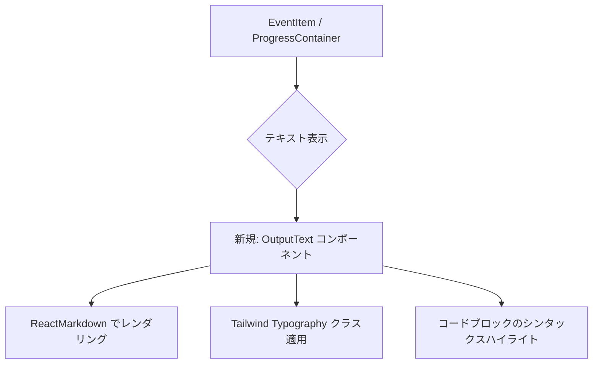

# 検討結果: Output欄表示改善

## 検討経緯

| 日付 | 内容 |
|------|------|
| 2026-02-16 | 初回相談: AIが生成するOutput欄の表示を改善したい（常に全文表示 + Markdown構文反映） |

## 背景・目的

現在、AIコマンド実行時の中間出力と最終結果は、以下の箇所に表示されます。

- **EventItem.tsx**: 中間出力（Outputイベント）
- **ProgressContainer.tsx**: 最終結果（`resultOutput`）

現状の問題点:
1. EventItemで200文字以上のテキストは最初の150文字だけ表示され、「[Show more]」ボタンで展開する必要がある
2. Markdown構文（`**太字**`、`` `コード` ``など）がプレーンテキストで表示されている

ユーザーの要望:
1. デフォルトで全文表示にしたい（折りたたみ不要）
2. Markdown構文を反映してほしい（太字、コード、リストなど）

## 対象ユーザー

- Ghostrunnerシステムの利用者（AIコマンド実行の結果を確認する人）

## 解決する課題

AIの出力は構造化されたテキストで、Markdown構文が含まれることが多い。しかし現状は:
- 長文の場合、毎回「Show more」を押す手間がかかる
- Markdown構文がそのまま表示されて読みにくい

これを改善することで、出力結果の可読性を大幅に向上させる。

## 改善案

既存の `MarkdownViewer` コンポーネントを参考に、軽量なMarkdownレンダラーを作成し、Output欄に適用する。

### 設計方針



### 特徴

- 常に全文表示（折りたたみ機能を削除）
- Markdown構文のレンダリング（太字、コード、リスト、見出しなど）
- 既存の `MarkdownViewer` と同じパッケージを使用（`react-markdown`, `remark-gfm`, `rehype-highlight`）
- スタイルは軽量化（proseクラスを使用するが、コンパクトな設定）

### トレードオフ

| 項目 | メリット | デメリット |
|------|----------|------------|
| 常に全文表示 | ユーザーが毎回展開する手間がなくなる | 出力が長い場合、画面が縦に伸びる |
| Markdown反映 | 構造化された読みやすい表示 | レンダリングコストが微増（体感なし） |
| 軽量コンポーネント | 既存のMarkdownViewerを改変しない | 新しいファイルが1つ増える |

## MVP提案

**推奨案**: 軽量なOutputTextコンポーネントを新規作成

### MVP範囲

1. `OutputText.tsx` を新規作成（Markdownレンダリング）
2. `EventItem.tsx` でOutputTextを使用（折りたたみロジックを削除）
3. `ProgressContainer.tsx` でOutputTextを使用（最終結果表示）

### 次回以降（後回し）

- Mermaid図のレンダリング対応（現状は必要性が低い）
- 長文出力の場合の仮想スクロール最適化
- 出力内容の検索機能

## 実装詳細

### 新規ファイル: `OutputText.tsx`

**配置**: `/Users/user/Ghostrunner/frontend/src/components/OutputText.tsx`

**機能**:
- ReactMarkdownでMarkdown構文をレンダリング
- remark-gfm（GitHub Flavored Markdown）対応
- rehype-highlightでコードブロックのシンタックスハイライト
- Tailwind Typographyでスタイル適用（コンパクト版）

**主な仕様**:
- インラインコード: `bg-gray-100 px-1 py-0.5 rounded`
- コードブロック: highlight.jsのGitHubテーマ
- 全体: `prose prose-sm`（小さめのタイポグラフィ）
- 最大高さ: `max-h-96 overflow-y-auto`（長文の場合スクロール可能）

### 変更ファイル1: `EventItem.tsx`

**変更内容**:
- 200文字判定・折りたたみロジックを削除
- `event.fullText` がある場合、`<OutputText text={event.fullText} />` を使用
- `isExpanded` stateと「Show more」ボタンを削除

### 変更ファイル2: `ProgressContainer.tsx`

**変更内容**:
- `resultOutput` の表示箇所で `<OutputText text={resultOutput} />` を使用
- `whitespace-pre-wrap` による素のテキスト表示を廃止

## 既存コードとの整合性

### スタイルの統一

- 既存の `MarkdownViewer` は `prose prose-lg`（大きめ）
- 新規の `OutputText` は `prose prose-sm`（小さめ）
- 理由: EventItemやProgressContainerは他の要素と並んで表示されるため、コンパクトな方が適切

### パッケージの再利用

既存のMarkdown関連パッケージをそのまま使用:
- `react-markdown`: Markdownレンダラー
- `remark-gfm`: GitHub Flavored Markdown（テーブル、タスクリストなど）
- `rehype-highlight`: コードブロックのシンタックスハイライト
- `highlight.js`: 構文ハイライトのテーマ（GitHubテーマは既に読み込み済み）

### Tailwind Typography

`@tailwindcss/typography` は既に `globals.css` で有効化済み:
```css
@plugin "@tailwindcss/typography";
```

proseクラスがそのまま使用可能。

## 変更対象ファイル

1. `/Users/user/Ghostrunner/frontend/src/components/OutputText.tsx`（新規作成）
2. `/Users/user/Ghostrunner/frontend/src/components/EventItem.tsx`（変更）
3. `/Users/user/Ghostrunner/frontend/src/components/ProgressContainer.tsx`（変更）

## 具体的な変更内容

### 1. OutputText.tsx（新規）

Markdownレンダリング専用の軽量コンポーネント。

**主な特徴**:
- `prose prose-sm` でコンパクトな表示
- インラインコードとブロックコードを区別
- 最大高さ制限 + スクロール対応

### 2. EventItem.tsx（変更）

**削除**:
- `isExpanded` state
- 200文字判定ロジック
- 「Show more」ボタン

**追加**:
- `OutputText` コンポーネントのimport
- `event.fullText` がある場合、`<OutputText />` で表示

### 3. ProgressContainer.tsx（変更）

**変更**:
- `resultOutput` 表示部分で `<OutputText />` を使用
- `whitespace-pre-wrap` の素のテキスト表示を廃止

## 次のステップ

1. この検討結果を `/plan` コマンドで実装計画に変換
2. 計画確定後、実装エージェントが3ファイルを変更
3. 動作確認後、検討結果を `開発/アーカイブ/` に移動

## 備考

### 長文出力のUX

常に全文表示にすることで、出力が長い場合は画面が縦に伸びます。これは以下で対応:
- `max-h-96 overflow-y-auto` でスクロール可能
- ユーザーは自然にスクロールして全文を確認できる

「Show more」ボタンを毎回押す手間よりも、スクロールの方が直感的で操作が少ない。

### Markdown構文の範囲

OutputTextがサポートするMarkdown構文:
- **太字**: `**text**`
- *斜体*: `*text*`
- `インラインコード`: `` `code` ``
- コードブロック: ` ```language ... ``` `
- 見出し: `# H1`, `## H2` など
- リスト: `- item`, `1. item`
- テーブル: GitHub Flavored Markdown形式
- リンク: `[text](url)`

Mermaid図は今回対応しない（必要になったら追加可能）。
