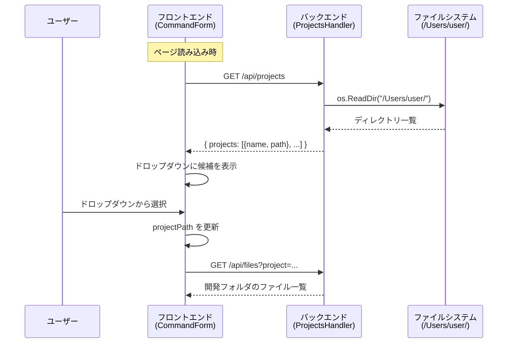

# 検討結果: Project Path 候補表示

## 検討経緯

| 日付 | 内容 |
|------|------|
| 2026-02-16 | 初回相談: 「Project Pathに常に候補を出したい」 |
| 2026-02-16 | コードベース調査完了、3案を提示（履歴強化 / 設定ファイル / ファイルシステムスキャン） |
| 2026-02-16 | 方針決定: `/Users/user/` 直下のディレクトリをドロップダウンで選択する |
| 2026-02-16 | スキャン対象を `/Users/user/` に確定、検討完了 |

## 背景・目的

Project Path の入力欄に、プロジェクトのパス候補を常に表示したい。
`/Users/user/` 直下のディレクトリ一覧をドロップダウンで選べるようにする。

## 対象ユーザー

Ghostrunner WebUI を使ってコマンドを実行するユーザー（開発者本人）

## 解決する課題

- 初回利用時やブラウザ変更時に、プロジェクトパスを手入力する必要がある
- 履歴がないと候補が出ないため、正確なパスを覚えていないと使いづらい
- よく使うプロジェクトにすぐアクセスしたい

## 決定した方針

**`/Users/user/` 直下のディレクトリをバックエンドAPIで取得し、フロントエンドでドロップダウン選択として表示する。**

- スキャン対象: `/Users/user/` 直下の1階層のみ
- 隠しディレクトリ（`.` で始まるもの）は除外
- システムディレクトリ（`/Users/Shared` 等）は対象外（ユーザーホーム直下のみ）

## 現状の仕組み（変更対象）

### フロントエンド

- **`CommandForm.tsx`** (L87-115): テキスト入力 + 履歴セレクト（幅20）の横並び
- **`useSessionManagement.ts`**: `localStorage` にプロジェクトパスと履歴を保存
  - `ghostrunner_project` - 最後に使ったプロジェクトパス
  - `ghostrunner_project_history` - 過去のパス一覧（最大10件）
- **`api.ts`**: バックエンドAPI呼び出し関数群

### バックエンド

- `validateProjectPath()`: 空でない / 絶対パス / 存在するディレクトリ を検証
- プロジェクト一覧APIは存在しない（新規追加が必要）
- 既存パターン: `files.go` の `FilesHandler` が `os.ReadDir` でディレクトリ読み取りを行っている

### データフロー（現在）

```
ユーザー手入力 -> localStorage保存 -> 履歴として蓄積（最大10件）
```

### データフロー（変更後）

```
バックエンドAPI -> /Users/user/ 直下のディレクトリ一覧取得
                -> フロントエンドのドロップダウンに表示
                -> ユーザーが選択 -> projectPath にセット
```

## 必要な変更

### 1. バックエンド: 新規API追加

**`GET /api/projects`**

```
リクエスト: なし（パラメータ不要）
レスポンス:
{
  "success": true,
  "projects": [
    { "name": "Ghostrunner", "path": "/Users/user/Ghostrunner" },
    { "name": "other-project", "path": "/Users/user/other-project" },
    ...
  ]
}
```

処理内容:
- `/Users/user/` 直下のディレクトリをスキャン（`os.ReadDir`）
- 隠しディレクトリ（`.` で始まるもの）を除外
- 通常のディレクトリのみ返却（ファイル、シンボリックリンク等はスキップ）
- ディレクトリ名のアルファベット順でソート

対象ファイル:
- 新規: `backend/internal/handler/projects.go`
- 変更: `backend/cmd/server/main.go`（ルーティング追加）

### 2. フロントエンド: ドロップダウンUI変更

対象ファイル:
- 変更: `frontend/src/components/CommandForm.tsx` -- テキスト入力 + 履歴セレクトをドロップダウン選択に変更
- 変更: `frontend/src/lib/api.ts` -- `fetchProjects()` 関数追加
- 変更: `frontend/src/types/index.ts` -- `ProjectInfo`, `ProjectsResponse` 型追加
- 変更: `frontend/src/app/page.tsx` -- プロジェクト一覧の取得とCommandFormへの受け渡し

### 3. 不要になるもの

- `useSessionManagement.ts` の `projectHistory` / `addToHistory` -- 履歴ドロップダウンが不要になるため削除候補
- `CommandForm.tsx` の履歴セレクト UI（L100-114）-- ドロップダウンに置き換え
- `constants.ts` の `LOCAL_STORAGE_HISTORY_KEY` / `MAX_PROJECT_HISTORY` -- 履歴管理が不要になる場合は削除候補

## アーキテクチャ



## UI変更イメージ

### 変更前（現在）

```
Project Path
[________________________テキスト入力________________________] [履歴▼]
```

### 変更後

```
Project Path
[▼ Ghostrunner________________________________________________]
```

- `<select>` ドロップダウンでプロジェクト一覧を表示
- 選択するとフルパス（`/Users/user/Ghostrunner`）が `projectPath` にセットされる
- 表示テキストはディレクトリ名のみ（例: `Ghostrunner`）、value はフルパス
- 先頭に `-- Select Project --` のようなプレースホルダー option を配置
- `localStorage` に保存済みの前回パスがあれば、初期表示時にそのプロジェクトを選択状態にする

## セキュリティ考慮

- ローカル開発マシンで動作する前提のため、ファイルシステム情報露出のリスクは許容範囲
- スキャン対象は `/Users/user/` 直下の1階層のみ（再帰スキャンしない）
- CORS設定により、許可されたオリジンからのみアクセス可能（既存設定を継続）

## MVP範囲

### 必須

- バックエンド: `GET /api/projects` API 追加（`/Users/user/` 直下をスキャン）
- フロントエンド: テキスト入力 + 履歴セレクトをドロップダウン選択に変更
- ページ読み込み時にAPIを呼び出してドロップダウンを構築
- 前回選択したプロジェクトを `localStorage` から復元

### 次回以降（後回し）

- テキスト入力との併用（ドロップダウン + 手入力のハイブリッド）
- スキャン対象ディレクトリの設定化（環境変数で変更可能に）
- ディレクトリの深掘り機能（子ディレクトリも辿れるように）
- プロジェクトのお気に入り/ピン止め機能

## 次のステップ

1. `/plan` で実装計画を作成
2. 計画確定後、`開発/実装/実装待ち/` に移動
