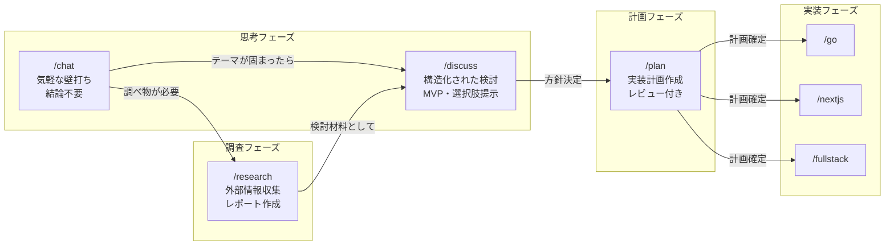

# 検討結果: チャット壁打ちコマンド

## 検討経緯

| 日付 | 内容 |
|------|------|
| 2026-02-16 | 初回相談: 「もっとchatに近い状態で壁打ちできるコマンドが欲しい」。既存 `/discuss` との住み分けを検討 |

## 背景・目的

既存の `/discuss` コマンドは「アイデアを整理し、実装計画に移行できる状態まで持っていく」ことをゴールとしたファシリテーターである。構造化された出力（MVP提案、複数案比較表、検討結果ファイル）を重視するため、以下の場面でオーバースペックに感じる:

- **まだ何を作りたいか自分でも分からない**段階での雑談
- **技術的な疑問**をサッと聞きたい（「このアーキテクチャでいいっけ？」）
- **思考の壁打ち**（結論を出す必要はなく、考えを整理したいだけ）
- **複数の話題を行き来**する自由な対話

つまり、`/discuss` が「会議室での構造化されたディスカッション」だとすると、新コマンドは「ホワイトボードの前での雑談」に相当する。

## 対象ユーザー

開発者（自分自身）。実装前の思考整理や、ふとした疑問の壁打ち相手が必要な場面。

## 解決する課題

| 課題 | 現状 | 改善後 |
|------|------|--------|
| `/discuss` が重い | 毎回MVP提案や複数案提示など構造化された対話を強制される | 気軽に思考を投げて反応を得られる |
| 結論を出すプレッシャー | 検討結果ファイルへの出力が前提 | 結論が出なくても OK。必要なら後から `/discuss` に引き継ぐ |
| 話題を自由に変えにくい | 1つのテーマに対して深掘りフローが固定 | 話題のジャンプ、脱線、回帰が自由 |
| サブエージェント起動のオーバーヘッド | discuss エージェント経由で毎回コンテキスト渡しが発生 | メインコンテキストで直接対話 |

## 既存 `/discuss` の分析

### `/discuss` の特徴

```
- サブエージェント（discuss エージェント）を起動
- 構造化された対話フロー（明確化 → 分析 → 選択肢 → MVP提案）
- 必ず検討結果ファイルを出力（開発/検討中/YYYY-MM-DD_機能名.md）
- Mermaid図、比較表を積極的に使用
- 実装には踏み込まない
- 1つのテーマに集中する設計
```

### `/discuss` の限界

1. **起動コスト**: サブエージェント経由のため、軽い質問には重い
2. **構造化の強制**: フォーマットに沿った出力が前提で、雑談的な対話に不向き
3. **成果物前提**: 検討結果ファイルの出力が暗黙のゴール
4. **テーマの固定**: 1つのテーマを深掘りする設計で、話題の自由な切り替えに不向き

## 選択肢の検討

### 案A: `/chat` コマンド（メインコンテキスト直接対話）

- 概要: サブエージェントを使わず、メインの Claude Code セッションで直接壁打ちするコマンド。システムプロンプトでカジュアルな対話モードに切り替える
- メリット:
  - 起動が最速（サブエージェントのオーバーヘッドなし）
  - メインコンテキストのツール（Grep, Read等）をそのまま使える
  - 話題の切り替えが自然
  - コードベースの知識をそのまま活用できる
- デメリット:
  - メインセッションのコンテキストを消費する
  - 「壁打ちモード」と「通常モード」の切り替えが曖昧になる可能性
- 工数感: 小（コマンド定義ファイル1つ）

### 案B: `/chat` コマンド（専用エージェント経由）

- 概要: 軽量な chat エージェントを新規作成し、カジュアルな対話に特化させる
- メリット:
  - `/discuss` との役割分離が明確
  - エージェントのプロンプトで「気軽さ」を制御できる
  - メインセッションのコンテキストを汚さない
- デメリット:
  - サブエージェント起動のオーバーヘッドがある（`/discuss` と同じ問題の軽減版にとどまる）
  - メインコンテキストとの情報断絶が起きる
  - エージェント間でコンテキストを引き継ぎにくい
- 工数感: 小（エージェント定義 + コマンド定義）

### 案C: `/discuss` の改良（モード追加）

- 概要: `/discuss` にオプション引数（例: `/discuss --casual` や `/discuss chat`）を追加し、カジュアルモードと構造化モードを切り替えられるようにする
- メリット:
  - コマンド数が増えない
  - discuss エージェントの資産を活用
  - 対話中にモード切り替えも可能
- デメリット:
  - 1つのエージェントに2つの責務を持たせることで複雑化
  - プロンプトが肥大化し、挙動が不安定になるリスク
  - 「カジュアル」を指示しても構造化に引きずられやすい
- 工数感: 小（エージェント定義の修正）

## 住み分けの全体像



### `/chat` と `/discuss` の比較

| 観点 | `/chat`（新設） | `/discuss`（既存） |
|------|-----------------|-------------------|
| 目的 | 思考の壁打ち、雑談 | アイデアの構造化、MVP提案 |
| 対話スタイル | カジュアル、自由 | ファシリテーター的、構造化 |
| 話題の切り替え | 自由 | 1テーマに集中 |
| 成果物 | なし（任意でメモ保存） | 検討結果ファイル（必須） |
| 結論 | 出なくてもOK | 方向性を決めることが目標 |
| 図表 | 必要な時だけ | 積極的に使用 |
| コード調査 | 聞かれたらやる | 関連コードを積極調査 |
| 終了後の遷移 | `/discuss` or `/plan` or 何もしない | `/plan` |

## MVP提案

**推奨案**: 案A（メインコンテキスト直接対話）

### 理由

- 「chatに近い」という要望の本質は**軽さ**と**自由さ**
- サブエージェント経由にすると、その時点で「重い」体験になる
- メインコンテキストで直接対話することで、コードベースの知識もシームレスに活用できる
- コマンド定義ファイル1つで実現でき、工数が最小

### MVP範囲

- `/chat` コマンド定義ファイル（`.claude/commands/chat.md`）
  - カジュアルな壁打ちモードのシステムプロンプト
  - 構造化を強制しない対話ルール
  - 必要に応じてコード調査可能
  - 成果物の出力は任意（ユーザーが求めた場合のみメモとして保存）

### コマンド設計方針

- サブエージェントを使わない（メインコンテキストで直接実行）
- 対話のトーン: 同僚との雑談レベル
- フォーマット強制なし（箇条書き、図、コード例は必要な時だけ）
- `$ARGUMENTS` に初回の話題を渡す
- 結論を急がない、深掘りを強制しない
- ユーザーが「まとめて」と言ったら要点を整理
- ユーザーが「discuss に引き継いで」と言ったら `/discuss` への橋渡し

### 次回以降

- 対話ログの自動保存機能（`開発/メモ/YYYY-MM-DD_topic.md`）
- `/discuss` への引き継ぎ時にコンテキストを自動整理する機能
- よく使うパターン（技術相談、設計相談、命名相談）のテンプレート

## 次のステップ

1. この検討結果の方針について確認
2. 方針決定後、`/chat` コマンド定義ファイルを作成（案Aの場合は `.claude/commands/chat.md` のみ）
3. 実際に使ってみて、必要に応じて調整
